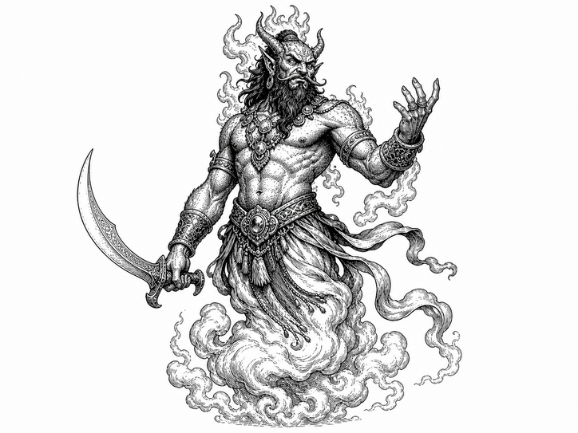

> This document merges the monster material from the B/X Basic and Expert books into one continuous reference chapter. The shared monster-entry rules are stated once, Basic and Expert entries are combined into one alphabetical sequence, and selected illustration plates from the original books are retained where they materially improve the presentation.

## Using This Chapter

The monsters are arranged alphabetically for quick reference.

Some monster names are followed by an asterisk (`*`). This means that special or magical weapons are needed to fight them, and such monsters should be used with caution.

All non-human monsters have infravision unless a description says otherwise. They can detect heat out to `60'` in darkness. Hot objects appear bright, warm things appear in shades of gray, cold things appear dark, and large heat sources can interfere with this sense.

`Armor Class:` Armor Class is given in the same general way as for player characters and is based on both protection and agility.

`Hit Dice:` Hit Dice show how many `d8` are rolled for hit points, including any pluses or minuses. Hit Dice also indicate a monster's rough level, the dungeon level where it is most commonly found, its attack ability, and its experience value. In general, a monster's level is equal to its Hit Dice, ignoring pluses and minuses, though especially dangerous monsters may be treated as a level higher. As a rule of thumb, monsters fit best within about two dungeon levels of their Hit Dice, with fewer appearing above that range and more below it.

An asterisk after Hit Dice matters for experience awards. `*` means the special-abilities bonus is added once, and `**` means it is added twice.

A monster's hit dice also determines its chance to hit in combat and the amount of experience points
characters earn for defeating them.

Monster Melee & Missile Attacks

| Hit Dice  |  9 |  8 |  7 |  6 |  5 |  4 |  3 |  2 |  1 |  0 | -1 | -2 | -3 |
|-----------|----|----|----|----|----|----|----|----|----|----|----|----|----|
|  Up to 1  | 10 | 11 | 12 | 13 | 14 | 15 | 16 | 17 | 18 | 19 | 20 | 20 | 20 |
|  1+ to 2  |  9 | 10 | 11 | 12 | 13 | 14 | 15 | 16 | 17 | 18 | 19 | 20 | 20 |
|  2+ to 3  |  8 |  9 | 10 | 11 | 12 | 13 | 14 | 15 | 16 | 17 | 18 | 19 | 20 |
|  3+ to 4  |  7 |  8 |  9 | 10 | 11 | 12 | 13 | 14 | 15 | 16 | 17 | 18 | 19 |
|  4+ to 5  |  6 |  7 |  8 |  9 | 10 | 11 | 12 | 13 | 14 | 15 | 16 | 17 | 18 |
|  5+ to 6  |  5 |  6 |  7 |  8 |  9 | 10 | 11 | 12 | 13 | 14 | 15 | 16 | 17 |
|  6+ to 7  |  4 |  5 |  6 |  7 |  8 |  9 | 10 | 11 | 12 | 13 | 14 | 15 | 16 |
|  7+ to 9  |  3 |  4 |  5 |  6 |  7 |  8 |  9 | 10 | 11 | 12 | 13 | 14 | 15 |
|  9+ to 12 |  2 |  3 |  4 |  5 |  6 |  7 |  8 |  9 | 10 | 11 | 12 | 13 | 14 |
| 12+ to 13 |  2 |  2 |  3 |  4 |  5 |  6 |  7 |  8 |  9 | 10 | 11 | 12 | 13 |
| 13+ to 15 |  2 |  2 |  2 |  3 |  4 |  5 |  6 |  7 |  8 |  9 | 10 | 11 | 12 |
| 15+ to 17 |  2 |  2 |  2 |  2 |  3 |  4 |  5 |  6 |  7 |  8 |  9 | 10 | 11 |
| 17+ to 19 |  2 |  2 |  2 |  2 |  2 |  3 |  4 |  5 |  6 |  7 |  8 |  9 | 10 |
| 19+ to 21 |  2 |  2 |  2 |  2 |  2 |  2 |  3 |  4 |  5 |  6 |  7 |  8 |  9 |
|     21+   |  2 |  2 |  2 |  2 |  2 |  2 |  2 |  3 |  4 |  5 |  6 |  7 |  8 |

Experience Points for Monsters Defeated

| Hit Dice | XP Value | Special Ability Bonus |
|----------|----------|-----------------------|
| > 1      | 1        | 1                     |
|   1      | 10       | 2                     |
|   1+     | 15       | 4                     |
|   2      | 20       | 5                     |
|   2+     | 25       | 10                    |
|   3      | 35       | 15                    |
|   3+     | 50       | 25                    |
|   4      | 75       | 50                    |
|   4+     | 125      | 75                    |
|   5      | 157      | 125                   |
|   5+     | 225      | 175                   |
|   6      | 275      | 225                   |
|   6+     | 350      | 300                   |
|   7-7+   | 450      | 400                   |
|   8-8+   | 650      | 550                   |
|   9-10+  | 900      | 700                   |
|  11-12+  | 1,100    | 800                   |
|  13-16+  | 1,350    | 950                   |
|  17-20+  | 2,000    | 1,250                 |
|    21 +  | 2,500    | 2,000                 |

`Move:` Move gives the number of feet a monster may travel in one turn. The number in parentheses is the number of feet it may move in one combat round. If two movement rates are given, the first is ordinary movement and the second is a special mode such as swimming, flying, or climbing.

`Attacks:` Attacks gives the number and kind of attacks a monster may make in one round.

`Damage:` Damage gives the matching damage values in the same order as the attacks listed.

- Acid: Acid may continue to burn after the initial hit and can destroy armor as well as flesh.

- Charge: A charge occurs when a monster rushes quickly into melee combat. A monster cannot charge while already engaged in melee combat or while moving through difficult terrain such as mountains, hills, forests, swamps, jungles, or broken ground. To charge, a monster must move at least 10 yards. If the attack hits, it deals double damage. Successful attacks made against a charging monster with a spear or polearm also deal double damage to the charging monster.

- Charm: A charmed victim cannot act freely, cannot attack the charming monster, and will obey simple commands if they can be understood.

- Continuous Damage: Some special forms of damage, such as blood drain, swallowing, constriction, and similar attacks, deal damage automatically each round until the attacker is killed, driven off, or releases its victim.

- Energy Drain: Energy drain removes a level of experience or one hit die with no saving throw. The loss cannot normally be cured.

- Paralysis: A failed save versus Paralysis leaves the victim helpless but aware, usually for `2-8` turns unless cured. Attacks against a paralyzed target hit automatically.

- Poison: A poisoned hit is often fatal if the victim fails a save versus Poison.

`No. Appearing:` This gives the suggested number encountered on the dungeon level that matches the monster's Hit Dice or level. Numbers in parentheses give the usual lair or wilderness total, and a `0` means the monster is not normally found in that setting.

`Save As:` This gives the class and level used for saving throws. Intelligent monsters usually save at full monster level, often as fighters unless the description says otherwise. Unintelligent monsters often save at half level, rounded up.

`Morale:` Morale is the B/X optional morale score. The DM rolls `2d6`; if the roll is higher than the adjusted morale, the monster tries to flee.

`Treasure Type:` Treasure Type refers to the standard B/X treasure tables. Lair monsters are more likely to have treasure than wandering monsters, and unintelligent animals often have little or none unless circumstance explains it.

`Alignment:` Alignment shows whether a monster is Lawful, Neutral, or Chaotic. Unintelligent animals are usually Neutral.

When a monster entry includes multiple varieties, the original grouped presentation has been kept rather than split into many near-duplicate entries. This is especially true for dragons, lycanthropes, living statues, giant animals, sharks, whales, and similar related families.

## Monster Descriptions

### Dryad
*Source:* `Expert`  

| Stat | Value |
| --- | --- |
| Armor Class | 5 |
| Hit Dice | 2* |
| Movement | 120' (40') |
| Attacks | See below |
| Damage | 0 |
| No. Appearing | 0 (1-6) |
| Save As | Fighter: 4 |
| Morale | 6 |
| Treasure Type | D |
| Alignment | Neutral |

A dryad is a beautiful female tree spirit who lives in a woodland setting or dense forest. Each individual dryad always lives in a specific tree and will die in one turn if taken more than 240’ away from it. A dryad will also die if her tree dies. If a dryad wishes to be unobserved, she will join with her tree, becoming part of it. Dryads are extremely shy and non-violent, but very suspicious of strangers.

Anyone approaching or following a dryad, not merely standing in the area of the tree, may be attacked by the powerful charm person spell these creatures can cast. The victim must make a saving throw vs. Spells with a penalty of -2 on the roll. A charmed character will approach the tree and be drawn into it. Unless rescued immediately, the victim will never be seen again.

Dryads hide their treasure in hollows under the roots of their trees.

### Basilisk
*Source:* `Expert`  

| Stat | Value |
| --- | --- |
| Armor Class | 4 |
| Hit Dice | 6 + r* |
| Move | 60' (20') |
| Attacks | 1 bite + gaze |
| Damage | 1-10 points + petrification |
| No. Appearing | 1-6 (1-6) |
| Save As | Fighter: 6 |
| Morale | 9 |
| Treasure Type | F |
| Alignment | Neutral |

A basilisk is a 10' long, sinuous magical lizard that is non-intelligent. It lives in underground caverns or wild and tangled thickets.

Creatures touched by a basilisk, or meeting its gaze, must make a saving throw vs. Turn to Stone or be petrified (including all the character wears and holds). Surprised characters automatically meet the gaze of a basilisk. Characters in hand-to-hand combat with a basilisk meet its glance each round unless looking away.

Characters looking away to avoid the gaze of a basilisk must fight it with a penalty of -4 on their "to hit" rolls, while the basilisk attacks at + 2 . The beast can be safely viewed in a mirror, and characters who fight it while looking into a mirror will only have a -1 penalty on their "to hit" rolls. If the basilisk sees itself in a mirror (a 1d6 roll of 1 or 2), if must make a saving throw or be turned to stone! There must be light close by for mirrors to be used, and using a mirror prevents the effective use of a shield.

### Black Pudding
*Source:* `Expert`  

| Stat | Value |
| --- | --- |
| Armor Class | 6 |
| Hit Dice | 10* |
| Move | 60' (20') |
| Attacks | 1 |
| Damage | 3-24 |
| No. Appearing | 1 (0) |
| Save As | Fighter: 5 |
| Morale | 12 |
| Treasure Type | Nil |
| Alignment | Neutral |

A black pudding is a black amorphous blob 5'–30' in diameter. It is non-intelligent, constantly hungry, and moves silently through dark places in search of prey.

It can dissolve wood and corrode metal in one turn, but cannot affect stone. Ancient dungeons often bear long black scars where a pudding has slowly passed. The air around a black pudding is damp and foul, carrying the stench of rot and corrosion.

Black puddings can travel on ceilings and walls and can pass through small openings. They instinctively avoid bright light and often lurk in forgotten tunnels, wells, and dungeon cisterns.

They can be killed only by fire; other attacks (weapons or spells) merely break them into smaller puddings (a 2 hit dice pudding that does 1–8 points of damage is created per blow). A flaming sword will do normal damage.

### Blink Dog
*Source:* `Expert`  

| Stat | Value |
| --- | --- |
| Armor Class | 5 |
| Hit Dice | 4' |
| Move | 120' (40') |
| Attacks | 1 bite |
| Damage | 1-6 |
| No. Appearing | 1-6 (1-6) |
| Save As | Fighter: 4 |
| Morale | 6 |
| Treasure Type | C |
| Alignment | Lawful |

Blink dogs look like Australian wild dogs. They are highly intelligent, travel in packs, and use a limited teleportation ability: they can "blink out" of one spot and immediately appear ("blink in") at another. When attacking, they "blink" close to an enemy, attack, and then reappear 10 to 40 feet away. On any round in which they have the initiative, they can attack without risking a counterattack by the defender, by "blinking" away. Their instincts prevent blink dogs from "blinking" into solid objects. If seriously threatened, an entire pack will "blink" out and not reappear. Blink dogs always attack displacer beasts, their natural enemies.

### Bugbear
*Source:* `Basic`  

| Stat | Value |
| --- | --- |
| Armor Class | 5 |
| Hit Dice | 3+1 |
| Move | 90' (30') |
| Attacks | 1 weapon |
| Damage | 2-8 or by weapon + 1 |
| No. Appearing | 2-8 (5-20) |
| Save As | Fighter: 3 |
| Morale | 9 |
| Treasure Type | B |
| Alignment | Chaotic |

Bugbears are giant hairy goblins. Despite their size and awkward walk, they move very quietly and attack without warning whenever they can. They surprise on a roll of 1-3 (on 1d6) due to their stealth. When using weapons, they add + 1 to all damage rolls due to their strength.

### Caecilia
*Source:* `Expert`  

| Stat | Value |
| --- | --- |
| Armor Class | 6 |
| Hit Dice | 6* |
| Move | 60' (20') |
| Attacks | 1 bite |
| Damage | 1-8 |
| No. Appearing | 1-3 (1-3) |
| Save As | Fighter: 3 |
| Morale | 9 |
| Treasure Type | B |
| Alignment | Neutral |

These giant gray wormlike creatures are about 30' long. They attack with their cavernous mouths and sharp teeth. An unadjusted "to hit" roll of 19 or 20 means that they have swallowed their prey whole. The victim will take 1-8 points of damage each round after that until either the victim or the caecilia is dead. Any attack from inside a caecilia may only be made with a dagger, and with a penalty of -4 on "to hit" rolls.

### Carrion Crawler
*Source:* `Basic`  

| Stat | Value |
| --- | --- |
| Armor Class | 7 |
| Hit Dice | 3+1* |
| Move | 120'(40') |
| Attacks | 8 tentacles |
| Damage | Paralysis |
| No. Appearing | 1-3(1-3) |
| Save As | Fighter: 2 |
| Morale | 9 |
| Treasure Type | B |
| Alignment | Neutral |

This scavenger is worm-shaped, 9' long and 3' high with many legs. It can move equally well on a floor, wall, or ceiling like a spider. Its mouth is surrounded by 8 tentacles, each 2' long, which can paralyze on a successful hit unless a saving throw vs. Paralysis is made. Once paralyzed, a victim will be eaten (unless the carrion crawler is being attacked). The paralysis can be removed by a cure light wounds spell, but any spell so used will have no other effect.

Without a spell, the paralysis will wear off in 2-8 turns.

### Centaur
*Source:* `Expert`  

| Stat | Value |
| --- | --- |
| Armor Class | 5 |
| Hit Dice | 4 |
| Move | 180' (60') |
| Attacks | 2 hooves / 1 weapon |
| Damage | 1-6 / 1-6 / 1-6 or by weapon |
| No. Appearing | 0 (2-20) |
| Save As | Fighter: 4 |
| Morale | 8 |
| Treasure Type | A |
| Alignment | Neutral |

A centaur is a creature with the head, arms, and upper body of a man joined to the body and legs of a horse. Centaurs prefer to live far from humankind in meadows and forests. Since they are somewhat intelligent, they will arm themselves with weapons such as clubs, lances, or bows.

Centaurs will form into small tribes or families. Their homes will be found in dense thickets or woods reached by twisting and guarded pathways. The females and young will usually stay in the lair. If attacked, females and young will attempt to flee unless escape is impossible, in which case they will fight to the death. The young will fight as 2 hit dice monsters, doing 1-2 / 1-2 / 1-4 damage or by weapon type.

### Chimera
*Source:* `Expert`  

| Stat | Value |
| --- | --- |
| Armor Class | 4 |
| Hit Dice | 9** |
| Move | 120' (40') |
| Flying | 180' (60') |
| Attacks | 2 claws / 3 heads + special |
| Damage | 1-3 / 1-3 / 2-8 / 2-8 / 3-12 + special |
| No. Appearing | 1-2 (1-4) |
| Save As | Fighter: 9 |
| Morale | 9 |
| Treasure Type | F |
| Alignment | Chaotic |

A chimera is a horrid combination of three different creatures. It has three heads, goat, lion, and dragon, the forebody of a lion, the hindquarters of a goat, and the wings of a dragon. The goat's head gores with its horns, the lion's head bites with its fangs, and the dragon's head can bite or breathe fire, a 50' long cone with a 10' wide end, for 3-18 points of damage.

Like a regular dragon, the dragon head will breathe fire 50% of the time or bite 50% of the time. The dragon's head can only breathe 3 times per day. Chimeras usually live in wild hills, but may occasionally be found in dungeons.

### Cockatrice
*Source:* `Expert`  

| Stat | Value |
| --- | --- |
| Armor Class | 6 |
| Hit Dice | 5** |
| Move | 90' (30') |
| Flying | 180' (60') |
| Attacks | 1 beak + special |
| Damage | 1-6 + petrification |
| No. Appearing | 1-4 (1-8) |
| Save As | Fighter: 5 |
| Morale | 7 |
| Treasure Type | D |
| Alignment | Neutral |

This is a small, magical monster with the head, wings, and legs of a rooster and the tail of a serpent. It is able to strike with its beak for 1-6 points of damage. However, its small size and single attack disguises its greatest danger: any character touched by a cockatrice must make a saving throw or be turned to stone.

Cockatrices may be found anywhere.

### Cyclops
*Source:* `Expert`  

| Stat | Value |
| --- | --- |
| Armor Class | 5 |
| Hit Dice | 13* |
| Move | 90' (30') |
| Attacks | 1 |
| Damage | 3-30 |
| No. Appearing | 1 (1-4) |
| Save As | Fighter: 13 |
| Morale | 9 |
| Treasure Type | E + 5000 gp |
| Alignment | Chaotic |

A cyclops is a rare type of giant, noted for its great size and the single eye in the center of its forehead. A cyclops is about 20' tall. It has poor depth perception due to its single eye, and strikes with a penalty of -2 on all "to hit" rolls. A cyclops will usually fight with a wooden club. A cyclops can throw rocks up to a distance of 200 feet with a penalty of -2 to hit. These rocks will cause 3-18 points of damage to any creature struck.

Some cyclops, 5%, are able to cast a curse once a week. The DM should decide the exact nature of the curse.

A cyclops usually lives alone, though a small group may sometimes share a large cave. They spend their time raising sheep and grapes. Cyclopes are known for their stupidity, and a clever party can often escape from them by trickery.

### Devil Swine
*Source:* `Expert`  

| Stat | Value |
| --- | --- |
| Armor Class | 3 (9) |
| Hit Dice | 9* |
| Move | 180' (60') |
| Human | 120' (40') |
| Attacks | 1 gore (or blow) |
| Damage | 2-12 (or by weapon) |
| No. Appearing | 1-3 (1-4) |
| Save As | Fighter: 9 |
| Morale | 10 |
| Treasure Type | C |
| Alignment | Chaotic |

Devil swine are lycanthropes, shape-changers. They haunt the fringes of human settlements, especially those near swamps or forests. They are carnivorous and especially fond of human flesh. They can assume the forms of huge hogs or fat human beings, and can change from one form to the other freely at night, but at dawn they must retain their current form until dusk. Devil swine can be harmed only by silver or magical weapons.

Devil swine possess a powerful charm person spell that can be used 3 times each 24 hours. They can use this spell in either human or swine form. A saving throw vs. Spells is allowed, at -2 on the roll. The charmed victim will be unable to use spells or magical devices, and each devil swine may have 0-3 humans under its control. Devil swine prefer to attack from ambush.

### Displacer Beast
*Source:* `Expert`  

| Stat | Value |
| --- | --- |
| Armor Class | 4 |
| Hit Dice | 6* |
| Move | 150' (50') |
| Attacks | 2 tentacles |
| Damage | 2-8 / 2-8 |
| No. Appearing | 1-4 (1-4) |
| Save As | Fighter: 6 |
| Morale | 8 |
| Treasure Type | D |
| Alignment | Neutral |

A displacer beast looks like a large black panther with six legs and a pair of tentacles growing from its shoulders. It attacks with these tentacles, which have sharp horn-like edges. A displacer beast always appears to be 3' from its actual position, making the creature hard to hit: any creature attacking it must subtract 2 from the "to hit" rolls. The displacer beast also receives a +2 bonus on all saving throws.

They are semi-intelligent. Displacer beasts hate and fear blink dogs, and will always attack them and anyone traveling with them.

### Djinni, Lesser*
*Source:* `Expert`  

| Stat | Value |
| --- | --- |
| Armor Class | 5 |
| Hit Dice | 7 + 1 |
| Move | 90' (30') |
| Flying | 240' (80') |
| Attacks | 1 + special |
| Damage | 2-16 (fists), or 2-12 (whirlwind) |
| No. Appearing | 1 (0) |
| Save As | Fighter: 14 |
| Morale | 12 |
| Treasure Type | Nil |
| Alignment | Neutral |

The djinn are intelligent, free-willed air elementals. They appear as tall, human-like beings, surrounded with clouds. Djinn are highly magical in nature and save as 14th level fighters. They can only be harmed by magic or magical weapons.

A djinni can perform any of its seven powers three times a day. These powers are: create food and drink, as a 7th level cleric; create metallic objects of temporary duration, varying with hardness, gold for 1 day and iron for one round, to a maximum of 1000 en weight; create soft goods and wooden objects, permanent, to a maximum of 1000 en weight; become invisible; assume gaseous form; or form itself into a whirlwind. In addition, a djinni can create illusions that affect both sight and hearing at will. Such illusions last until touched or magically dispelled; the djinni need not concentrate to maintain them.

Djinn have two forms of attack. A djinni can form itself into a whirlwind, 70' tall, 20' diameter at the top, 10' diameter at base, that moves 120' (40') per turn. The djinni requires 5 rounds to enter or leave whirlwind form. The djinni-whirlwind will do 2-12 points of damage to all in its path and will sweep aside all creatures with fewer than 2 hit dice who do not save vs. Death Ray. When not in whirlwind form, a djinni strikes once per round with its fists for 2-16 points of damage. If a djinni is slain, it returns to its own plane. A djinni can carry 6000 en weight without tiring. Up to 12,000 en weight can be carried for 3 turns walking or 1 turn flying. Afterwards, a djinni must rest for one turn.

### Doppleganger
*Source:* `Basic`  

| Stat | Value |
| --- | --- |
| Armor Class | 5 |
| Hit Dice | 4' |
| Move | 90' (30') |
| Attacks | 1 |
| Damage | 1-12 |
| No. Appearing | 1-6 (1-6) |
| Save As | Fighter: 10 |
| Morale | 10 |
| Treasure Type | E |
| Alignment | Chaotic |

These man-sized, shape-changing creatures are intelligent and evil.

A doppleganger is able to shape itself into the exact form of any human-like creature (up to 7' tall) it sees. Once in the form of the person it is imitating, it will always attack that person. Its favorite trick is to kill the original person in some way without the party knowing. Then, in the role of that individual, it will attack the others by surprise, often when the party is already engaged in combat.

Sleep and charm spells do not affect dopplegangers and they save as Fighter: 10 due to their highly magical nature. When killed, a doppleganger will turn back into its original form.

### Dragon
*Source:* `Basic`  

| Stat | White | Black | Green | Blue | Red | Gold |
| --- | --- | --- | --- | --- | --- | --- |
| Armor Class | 3 | 2 | 1 | 0 | -1 | -2 |
| Hit Dice | 6** | 7** | 8** | 9** | 10** | 11** |
| Move | 90' (30'); fly 240' (80') | 90' (30'); fly 240' (80') | 90' (30'); fly 240' (80') | 90' (30'); fly 240' (80') | 90' (30'); fly 240' (80') | 90' (30'); fly 240' (80') |
| Attacks | 2 claws / 1 bite + breath | 2 claws / 1 bite + breath | 2 claws / 1 bite + breath | 2 claws / 1 bite + breath | 2 claws / 1 bite + breath | 2 claws / 1 bite + breath |
| Damage | 1-4 / 1-4 / 2-16 | 2-5 / 2-5 / 2-20 | 1-6 / 1-6 / 3-24 | 2-7 / 2-7 / 3-30 | 1-8 / 1-8 / 4-32 | 2-8 / 2-8 / 6-36 |
| No. Appearing | 1-4 (1-4) | 1-4 (1-4) | 1-4 (1-4) | 1-4 (1-4) | 1-4 (1-4) | 1-4 (1-4) |
| Save As | Fighter: 6 | Fighter: 7 | Fighter: 8 | Fighter: 9 | Fighter: 10 | Fighter: 11 |
| Morale | 8 | 8 | 9 | 9 | 10 | 10 |
| Treasure Type | H | H | H | H | H | H |
| Alignment | Neutral | Chaotic | Chaotic | Neutral | Chaotic | Lawful |

| Trait | White | Black | Green | Blue | Red | Gold |
| --- | --- | --- | --- | --- | --- | --- |
| Where Found | Cold region | Swamp, marsh | Jungle, forest | Desert, plain | Mountain, hill | Anywhere |
| Breath Weapon | Cold | Acid | Chlorine gas | Lightning | Fire | Fire / gas |
| Range and Shape | 80' × 30' cone | 60' × 5' line | 50' × 40' cloud | 100' × 5' line | 90' × 30' cone | 90' × 30' cone / 50' × 40' cloud |
| Chance of Talking | 10% | 20% | 30% | 40% | 50% | 100% |
| Chance of Being Asleep | 50% | 40% | 30% | 20% | 10% | 5% |
| Spells by Level | 3 / - / - | 4 / - / - | 3 / 3 / - | 4 / 4 / - | 3 / 3 / 3 | 4 / 4 / 4 |

Dragons are a very old race of huge winged lizards. They like to live in isolated, out-of-the-way places where few humans are found. Though the color of their scaly hide makes dragons look different, they all have several traits in common: they are hatched from eggs, are meat-eaters, have Breath Weapons, love treasure, and will do everything possible to save their own lives, including surrender.

Dragons are proud of their long history, and because of this they tend to think less of the younger races. Chaotic dragons might capture humans, but will usually kill and eat them immediately. Neutral dragons might either attack or ignore a party completely. Lawful dragons, however, may actually help a party if the characters are truly worthy of the honor. When playing a dragon, the DM should remember that even the hungriest dragon will pause and listen to flattery, provided no one is attacking it and it understands the speaker.

BREATH WEAPONS DAMAGE: All dragons have a special attack with their Breath Weapon in addition to their claw and bite attacks. Any dragon can use its Breath Weapon up to 3 times each day. A dragon's first attack is always with its Breath Weapon. The number of points of damage any Breath Weapon does is equal to the dragon's remaining number of hit points. Any damage done to a dragon will reduce the damage it can do with its Breath Weapon.

After the first Breath attack, a dragon may choose to attack with claws and bite. To determine this randomly, roll 1d6. A result of 1-3 means that the dragon will use its claw and bite attacks; a result of 4-6 means that the dragon will breathe again.

SHAPE OF BREATH: A dragon's Breath Weapon appears as one of three different shapes: cone-shaped, a straight line, or a cloud of gas.

A cone-shaped Breath begins at the dragon's mouth, where it is 2' wide, and spreads out until it is 30' wide at its furthest end. For example, the area of effect of a white dragon's Breath is a cone 80' long and 30' wide at its far end.

A line-shaped Breath starts in the dragon's mouth and stretches out toward its victim in a straight line, even downwards. Even at its source, a line-shaped Breath is 5' wide.

A cloud-shaped Breath billows forth from the dragon's mouth to form a 50'x40'x20' tall cloud around the dragon's targets directly in front of it.

SAVING THROWS: Anyone caught within the area of effect of a dragon's Breath Weapon may make a saving throw. A successful saving throw means that the victim takes only 1/2 damage from the Breath. Dragons are never affected by the normal or smaller versions of their own Breath Weapons, and automatically make their saving throws against any attack form that is the same as their Breath Weapon. For example, a red dragon will take no damage from burning oil, and will always take only 1/2 damage from a fire-type magic spell such as a fire ball.

TALKING: Dragons are intelligent, and some dragons can speak Dragon and Common. The percentage listed under Chance of Talking is the chance that a dragon will be able to talk. Talking dragons are also able to use Magic-user/Elf spells. The number of spells and their levels are given above under Spells by Level. For example, 3 / 3 / - would mean that the dragon can cast 3 first-level spells and 3 second-level spells, but no third-level spells. Dragon spells are usually selected randomly.

SLEEPING DRAGONS: The percentage chance given under Chance of Being Asleep applies whenever a party encounters a dragon on the ground; flying dragons are never asleep. Any result greater than the percentage means that the dragon is not asleep, though it may be pretending to be. If a dragon is asleep, it may be attacked with a bonus of +2 on attack rolls for one round, during which it will wake. Combat proceeds normally from the second round on.

SUBDUING DRAGONS: Whenever characters encounter a dragon, they may choose to try to subdue it rather than kill it. To subdue a dragon, all the attacks must be with the flat of the sword; missile weapons and spells may not be used. Attacks and damage are determined normally when trying to subdue the dragon. The dragon will fight normally until it reaches 0 or fewer hit points, at which time it will surrender. A dragon may be subdued because it realizes that its attackers could have killed it if they had been striking to kill.

A subdued dragon will attempt to escape or turn on its captor if given a reasonable chance to do so through the party's actions. For example, a dragon left unguarded at night, or ordered to guard a position alone, would consider these reasonable chances. A subdued dragon must be sold. The price is up to the DM, but should never exceed 1,000 gp per hit point. The dragon may be forced to serve the characters who subdued it. If a subdued dragon is ever ordered to perform a task that is apparently suicidal, it will attempt to escape and/or kill its captors.

AGE: The statistics given are for an average-sized dragon of its type. Younger dragons are smaller and have acquired less treasure; older dragons are larger and have acquired more. Dragons generally range in size from 3 hit dice smaller to 3 hit dice larger than average. For example, red dragons could be found having 7 to 13 hit dice, depending on their age.

TREASURE: Younger dragons may have collected as little as 1/2 the normal listed treasure; older dragons may have as much as double the listed amount. Dragon treasure is only found in the dragon's lair. These lairs are rarely left unguarded, and are well-hidden to prevent easy discovery.

GOLD DRAGONS: Gold dragons always talk and use spells. They can also change their shape, and often appear in the form of a human or animal. Gold dragons may breathe either fire, like a red dragon, or chlorine gas, like a green dragon, though they still have a total of 3 Breath Weapon attacks per day, not 6. The type of Breath attack should be chosen by the DM to fit the situation.

Dragons are extremely powerful and should be used with caution when encountered by low-level player characters. It is recommended that until characters reach the fourth level and higher, only the youngest and smallest dragons be used by the DM.

### Dragon Turtle
*Source:* `Expert`  

| Stat | Value |
| --- | --- |
| Armor Class | -2 |
| Hit Dice | 30 |
| Move | 30' (10') |
| Swimming | 90' (30') |
| Attacks | 2 claws / 1 bite |
| Damage | 1-8 claw / 10-60 bite |
| No. Appearing | 0 (1) |
| Save As | Fighter: 15 |
| Morale | 10 |
| Treasure Type | H |
| Alignment | Chaotic |

Dragon turtles appear to be some unusual mixture of a dragon and a gigantic turtle. They have the head, limbs and tail of a great dragon and the hard shell of a turtle. These creatures live in the depths of great oceans and seas, seldom surfacing or approaching land. Dragon turtles are so large that sailors have mistakenly anchored on ones floating on the surface, thinking the hard shell to be a small island.

Besides its powerful claws and bite, the dragon turtle is also able to use a breath weapon. It can breathe a 30' wide cloud of steam to a distance of 90'. This breath weapon will do damage in the same manner as a dragon's, inflicting hit points of damage equal to the current hit points of the dragon turtle.

Dragon turtles live in great caverns on the bottom of the deepest oceans, where they keep the treasures of sunken ships. On occasion they will rise under ships, attempting to overturn them and devour the occupants.

Note: Dragon turtles are extremely powerful creatures that should not be used unless the player characters are of very high level.

### Efreeti, Lesser*
*Source:* `Expert`  

| Stat | Value |
| --- | --- |
| Armor Class | 3 |
| Hit Dice | 10* |
| Move | 90' (30') |
| Flying | 240' (80') |
| Attacks | 1 |
| Damage | 2-16 |
| No. Appearing | 1 (1) |
| Save As | Fighter: 15 |
| Morale | 12 |
| Treasure Type | Nil |
| Alignment | Chaotic |

Efreet are free-willed fire elementals. They usually appear as clouds of smoke that solidify into giant demonic-faced men surrounded by flame. The air around them is always hot and smoky, they are highly magical in nature, and they can only be hit with magic weapons.

Efreet can create objects, create illusions, and turn invisible like djinn. They may also create a wall of fire up to 3 times per day. An efreeti can transform itself into a pillar of flame for up to 3 rounds, setting flammable items within 5' alight and doing an extra 1-8 points of damage to creatures it strikes while in that form.

Efreet may fly and carry up to 10,000 en weight while flying. They can be summoned by high-level magic-users who know the special spells required, but once summoned they must be carefully controlled.

### Elemental*
*Source:* `Expert`  

| Stat | Air | Earth | Fire | Water |
| --- | --- | --- | --- | --- |
| Armor Class | Variable | Variable | Variable | Variable |
| Hit Dice | Variable | Variable | Variable | Variable |
| Move | Fly 360' (120') | 60' (20') | 120' (40') | 60' (20'); Swim 180' (60') |
| Attacks | Special | Special | Special | Special |
| Damage | Variable | Variable | Variable | Variable |
| No. Appearing | 1 (1) | 1 (1) | 1 (1) | 1 (1) |
| Save As | Variable | Variable | Variable | Variable |
| Morale | 10 | 10 | 10 | 10 |
| Treasure Type | Nil | Nil | Nil | Nil |
| Alignment | Neutral | Neutral | Neutral | Neutral |

Elementals can be brought forth only from a large amount of their element, open air, bare earth or rock, large fire, or a large pond. After being summoned they must be totally controlled at all times by the person who summoned them. Control requires complete concentration. If the summoner moves over half speed, takes damage in combat, or does anything besides paying attention to the elemental, the elemental will turn and attempt to attack its summoner. It will also attack any creature in the path between it and the one who summoned it. Once control is lost, it can never be regained. An elemental vanishes when dispelled, when the elemental is slain, or when the summoner orders the elemental to return from whence it came while it is still under control. Elementals can be hit only by magic or magic weapons.

Staff elementals, the weakest, are summoned by a magic-user with a special staff. Device elementals are summoned with the use of a special miscellaneous magic item. Conjured elementals are summoned by the use of the 5th level magic-user or elf spell.

| Kind | Armor Class | Hit Dice | Damage | Save As |
| --- | --- | --- | --- | --- |
| Staff | 2 | 8 | 1-8 | Fighter: 8 |
| Device | 0 | 12 | 2-16 | Fighter: 12 |
| Conjured | -2 | 16 | 3-24 | Fighter: 16 |

Air elementals appear as great whirlwinds 2' tall and 1/2' in diameter for each hit die they have. The whirlwind will catch and sweep away creatures of less than 2 hit dice unless a saving throw vs. Death Ray is made. Air elementals do an extra 1-8 points of damage against flying opponents.

Earth elementals appear as huge man-like figures 1' tall for each hit die they have. Earth elementals cannot cross a water barrier wider than their height. Earth elementals do an extra 1-8 points of damage against opponents on the ground.

Fire elementals appear as swirling pillars of roaring flame 1' tall and 1' in diameter for each hit die they have. They cannot cross a water barrier wider than their own diameter. They do an additional 1-8 points of damage against all creatures with cold-based attacks.

Water elementals appear as great waves of water 1/2' tall and 2' in diameter for each hit die they have. Water elementals are not able to move more than 60' from water. They do an extra 1-8 points of damage against opponents in water.

### Gargoyle*
*Source:* `Basic`  

| Stat | Value |
| --- | --- |
| Armor Class | 5 |
| Hit Dice | 4 |
| Move | 90' (30') |
| Flying | 150' (50') |
| Attacks | 2 claws/1 bite/ |
| Damage | 1-3/1-3/1-6/ |
| No. Appearing | 1-6(2-8) |
| Save As | Fighter: 8 |
| Morale | 11 |
| Treasure Type | C 1 horn |
| Alignment | Chaotic 1-4 |

Gargoyles are magical  and save as Fighter: 8. They can only be hit with magic or magical weapons. As pictured in medieval architecture, they are horned, clawed, fanged, winged, hideous-looking beasts. Their skin often looks exactly like stone and are often mistaken to be statues. Gargoyles are very cunning and at least semi-intelligent. They will attack nearly anything that approaches them. Gargoyles are not affected by sleep or charm spells. The DM is advised to use gargoyles only if the player characters have at least one magical weapon.

### Gelatinous Cube
*Source:* `Basic`  

| Stat | Value |
| --- | --- |
| Armor Class | 8 |
| Hit Dice | 4' |
| Move | 60' (20') |
| Attacks | 1 |
| Damage | 2-8 + special |
| No. Appearing | 1 (0) |
| Save As | Fighter: 2 |
| Morale | 12 |
| Treasure Type | V |
| Alignment | Neutral |

These  are made of a clear jelly and are shaped like cubes about 10' on a side. Due to their near transparency, they surprise on a roll of 1-4 (1d6). They move through the rooms and corridors of dungeons, sweeping the halls clean of all living and dead material. In the process, they may pick up items they can't dissolve (such as gold pieces and gems). Though they usually eat carrion, they will attack any living creature they encounter, inflicting 2d4 points of damage. Each successful hit will paralyze the victim unless a saving throw versus Paralysis is made. Any attacks on a paralyzed victim will automatically hit (only a damage roll is needed). This paralysis is the normal type (lasting 2-8 turns unless removed by a cure light wounds spell). A gelatinous cube may be harmed by fire and weapons, but not by cold or lightning.

### Ghoul
*Source:* `Basic`  

| Stat | Value |
| --- | --- |
| Armor Class | 6 |
| Hit Dice | 2* |
| Move | 90' (30') |
| Attacks | 2 claws/1 bite |
| Damage | 1 3, all + |
| No. Appearing | 1-6(2-16) |
| Save As | Fighter: 2 |
| Morale | 9 |
| Treasure Type | B |
| Alignment | Chaotic special |

Ghouls are undead creatures. They are hideous, beast-like humans who will attack anything living. Any attack by a ghoul will paralyze any creature of ogre-size or smaller that they hit successfully (except elves) unless the victim saves vs. Paralysis. Once an opponent is paralyzed, the ghoul will turn and attack another opponent, until either the ghoul or all the opponents are paralyzed or dead. This paralysis is the normal type (lasting 2-8 turns unless removed by a cure light wounds spell).

### Giant
*Source:* `Expert`  

| Stat | Hill Giant | Stone Giant | Frost Giant | Fire Giant | Cloud Giant | Storm Giant |
| --- | --- | --- | --- | --- | --- | --- |
| Armor Class | 4 | 4 | 4 | 4 | 4 | 2 |
| Hit Dice | 8 | 9 | 10 + 1 | 11 + 2 | 12 + 3 | 15 |
| Move | 120' (40') | 120' (40') | 120' (40') | 120' (40') | 120' (40') | 150' (50') |
| Attacks | 1 | 1 | 1 | 1 | 1 | 1 + special |
| Damage | 2-16 | 3-18 | 4-24 | 5-30 | 6-36 | 8-48 + special |
| No. Appearing | 1-4 (2-8) | 1-2 (1-6) | 1-2 (1-4) | 1-2 (1-3) | 1-2 (1-3) | 1-2 (1-3) |
| Save As | Fighter: 8 | Fighter: 9 | Fighter: 10 | Fighter: 11 | Fighter: 12 | Fighter: 15 |
| Morale | 8 | 9 | 9 | 9 | 10 | 10 |
| Treasure Type | E + 5000 gp | E + 5000 gp | E + 5000 gp | E + 5000 gp | E + 5000 gp | E + 5000 gp |
| Alignment | Chaotic | Neutral | Chaotic | Chaotic | Neutral | Lawful |

- *Hill giants* are hairy, stupid brutes about 12' tall who wear skins and raid nearby human settlements for food and plunder.
- *Stone giants* are 14' tall with gray rock-like skin and hurl boulders up to 300'.
- *Frost giants* are pale, cold-dwelling raiders with bear or wolf guards and immunity to cold-based attacks.
- *Fire giants* have red skin, dark hair, and homes near volcanic regions; they are immune to fire-based attacks and often keep hydras or hellhounds as guards.
- *Cloud giants* are tall, sharp-sensed mountain or cloud dwellers who often keep giant hawks or dire wolves.
- *Storm giants* are the tallest of all giants, love thunder storms, and in a storm may hurl lightning that does damage equal to their current hit points, with a save vs. Spells for half.

### Gnoll
*Source:* `Basic`  

| Stat | Value |
| --- | --- |
| Armor Class | 5 |
| Hit Dice | 2 |
| Move | 90' (30') |
| Attacks | 1 weapon |
| Damage | 2-8 or by weapon + 1 |
| No. Appearing | 1-6 (3-18) |
| Save As | Fighter: 2 |
| Morale | 8 |
| Treasure Type | D |
| Alignment | Chaotic |

Gnolls are beings of low intelligence that appear to be human-like hyenas. They may use any weapons. They are strong, but dislike work and prefer to bully and steal for a living. For every 20 gnolls encountered, one will be a leader with 16 hit points who attacks as a 3 hit dice monster. Gnolls are rumored to be the result of a magical combination of a gnome and a troll by an evil magic-user.

### Goblin
*Source:* `Basic`  

| Stat | Value |
| --- | --- |
| Armor Class | 6 |
| Hit Dice | 1-1 |
| Move | 60' (20') |
| Attacks | 1 weapon |
| Damage | 1-6 or by |
| No. Appearing | 2-8 (6-60) |
| Save As | Normal Man |
| Morale | 7 or see below |
| Treasure Type | type C is only found in the goblin lair or when encountered in the wilderness. |
| Treasure Type | R(C) |
| Alignment | Chaotic weapon |

Goblins are a small incredibly ugly human-like race. Their skin is a pale earthy color, such as chalky tan or livid gray. Their eyes are red, and glow when there is little light, somewhat like rat's eyes.

Goblins live underground and have well-developed infravision (heat-sensing sight) to 90'. In full daylight they fight with a penalty of -1 on their "to hit" rolls. Goblins hate dwarves and will attack them on sight. There is a 20% chance that when goblins are encountered, 1 of every 4 will be riding a dire wolf.

In the goblin lair lives a goblin king with 15 hit points who fights as a 3 hit dice monster and gains + 1 on damage rolls. The goblin king has a bodyguard of 2-12 goblins who fight as 2 hit dice monsters and have 2-12 hit points each. The king and his bodyguard may fight in full daylight without a penalty. The goblin morale will be 9 rather than 7 as long as their king is with them and still alive.

Treasure type C is only found in the goblin lair or when encountered in the wilderness.

### Golem*
*Source:* `Expert`  

| Stat | Wood | Bone | Amber | Bronze |
| --- | --- | --- | --- | --- |
| Armor Class | 7 | 2 | 6 | 0 |
| Hit Dice | 2 + 2 | 8 | 10** | 20** |
| Move | 120' (40') | 120' (40') | 180' (60') | 240' (80') |
| Attacks | 1 fist | 4 weapons | 2 claws / 1 bite | 1 fist + special |
| Damage | 1-8 | By weapon | 2-12 / 2-12 / 2-20 | 3-30 + special |
| No. Appearing | 1 (1) | 1 (1) | 1 (1) | 1 (1) |
| Save As | Fighter: 1 | Fighter: 4 | Fighter: 5 | Fighter: 10 |
| Morale | 12 | 12 | 12 | 12 |
| Treasure Type | Nil | Nil | Nil | Nil |
| Alignment | Neutral | Neutral | Neutral | Neutral |

A golem is a powerful monster, created and animated by a high-level magic-user or cleric. They can be made of almost any material, but the ones listed are typical. The DM should feel free to create other golems with any special powers desired.

Normally golems can only be hit by magic weapons. Golems are also immune to sleep, charm, and hold spells, as well as all forms of gases. Creating a golem is costly, time consuming, and beyond the power of player characters in the D&D Expert rules.

- *Wood golems* are crude manlike figures about 3' tall, hacked from wood. They move stiffly and have a penalty of -1 on initiative rolls. They burn easily, saving at -2 and suffering one extra point of damage per die from fire-based attacks.

- *Bone golems* are 6' tall creatures made from the bones of dead men bound together into a manlike form. They wield weapons from skeletal arms fastened to their bodies at various points. Either four one-handed weapons or two pole arms may be used by a bone golem, and it will attack up to two enemies per round. Bone golems are immune to fire, cold, and electrical attacks.

- *Amber golems* resemble giant lions or tigers. They are faultless trackers and can detect invisible creatures within 60'.

- *Bronze golems* look somewhat like fire giants. Their skin is bronze and their blood is liquid fire. Any creature hit by a bronze golem takes 1-10 more points of damage from the great heat inside it. Anyone scoring damage on a bronze golem with an edged weapon must save vs. Death Ray or take 2-12 points of damage from the fiery blood spurting out of the wound. Bronze golems are not affected by fire-based attacks.

### Gorgon
*Source:* `Expert`  

| Stat | Value |
| --- | --- |
| Armor Class | 2 |
| Hit Dice | 8* |
| Move | 120' (40') |
| Attacks | 1 gore or breath |
| Damage | 2-12 or petrification |
| No. Appearing | 1-2 (1-4) |
| Save As | Fighter: 8 |
| Morale | 8 |
| Treasure Type | E |
| Alignment | Chaotic |

A gorgon is a magical bull-like monster covered with large iron scales. It gores opponents with its great horns and will do double damage if it hits when charging. A gorgon also breathes clouds of vapor that will petrify any opponents who fail their saving throw vs. Turn to Stone.

A gorgon's vapor cloud is 60' long by 10' wide. They are impervious to their own breath weapon. Gorgons are usually found in foothills or grasslands.

### Gray Ooze
*Source:* `Basic`  

| Stat | Value |
| --- | --- |
| Armor Class | 8 |
| Hit Dice | 3* |
| Move | 10' (3') |
| Attacks | 1 |
| Damage | 2-16 |
| No. Appearing | 1 (1) |
| Save As | Fighter: 2 |
| Morale | 12 |
| Treasure Type | Nil |
| Alignment | Neutral |

This seeping horror looks like wet stone and is difficult to see. It secretes an acid which does 2d8 points of damage if the gray ooze hits bare skin. This acid will dissolve and destroy magic armor in one turn. After the first hit, the ooze will stick to its victim, automatically destroying any normal armor and doing 2d8 points of damage each round. Gray ooze cannot be harmed by cold or fire, but can be harmed by weapons and lightning.

### Green Slime*
*Source:* `Basic`  

| Stat | Value |
| --- | --- |
| Armor Class | Can always be hit |
| Hit Dice | 2* |
| Move | 3' (1') |
| Attacks | 1 |
| Damage | See below |
| No. Appearing | 1 (0) |
| Save As | Fighter: 1 |
| Morale | 12 |
| Treasure Type | Nil |
| Alignment | Neutral |

Green slime looks like green, oozing slime. This creature can be harmed by fire or cold but cannot be hurt by any other attacks. It dissolves wood and metal in 6 rounds, but cannot dissolve stone.

Green slime often clings to walls and ceilings and will drop down on surprised characters. Once in contact with flesh, it will stick and turn the flesh into green slime. It cannot be scraped off, but must be burnt off, or treated with a cure disease spell.

When green slime drops on a victim, or is stepped on, the victim can usually burn it while it is dissolving armor and clothing. If it is not burned off, the victim will turn completely into green slime 1-4 rounds after the first 6-round, one-minute period. Burning does 1/2 damage to the green slime and 1/2 damage to the victim.

### Griffon
*Source:* `Expert`  

| Stat | Value |
| --- | --- |
| Armor Class | 5 |
| Hit Dice | 7 |
| Move | 120' (40') |
| Flying | 360' (120') |
| Attacks | 2 claws / 1 bite |
| Damage | 1-4 / 1-4 / 2-16 |
| No. Appearing | 0 (2-16) |
| Save As | Fighter: 4 |
| Morale | 8 |
| Treasure Type | E |
| Alignment | Neutral |

A griffon is a large monster with the head, wings, and front claws of an eagle and the body and hindquarters of a lion. It is a voracious predator. Its favorite prey is horses. When within 120' of horses a griffon must pass a morale check or attack immediately.

Wild griffons will attack any who approach their nests. If captured young, they can be tamed to become fierce, loyal mounts, with training left to the DM's discretion. Tamed griffons are still likely to attack horses, however, and must check morale as above.

### Harpy
*Source:* `Basic`  

| Stat | Value |
| --- | --- |
| Armor Class | 7 |
| Hit Dice | 3* |
| Move | 60' (20') |
| Flying | 150' (50') |
| Attacks | 2 claws/1 |
| Damage | 1-4/1-4/1-6 |
| No. Appearing | 1-6 (2-8) |
| Save As | Fighter: 3 |
| Morale | 7 |
| Treasure Type | C weapon + special |
| Alignment | Chaotic + special |

A harpy has the lower body of a giant eagle and the upper body and head of a hideous-looking woman. By their singing, harpies lure creatures to them, to be killed and devoured. Any creature hearing the harpy's song must save vs. Spells or be charmed (see special attacks at the beginning of the  section).

Charmed individuals will move toward the harpies, resisting any attempt to stop them, but not otherwise attacking. If a character saves against the songs of a group of harpies, the character will not be affected by any of their songs during the encounter. Harpies are resistant to magic and have a + 2 on all their saves.

### Hellhound
*Source:* `Expert`  

| Stat | Value |
| --- | --- |
| Armor Class | 4 |
| Hit Dice | 3-7* |
| Move | 120' (40') |
| Attacks | Bite or breath |
| Damage | 1-6 or special |
| No. Appearing | 2-8 (2-8) |
| Save As | Variable |
| Morale | 9 |
| Treasure Type | C |
| Alignment | Chaotic |

A hellhound appears as a reddish-brown hound the size of a large wolfhound or small pony, and is impervious to normal fire. They are often found near volcanos, deep in dungeons, or with another fire-loving creature such as a fire giant. Hellhounds are cunning and highly intelligent. They save as a fighter level equal to their hit dice.

In melee, a hellhound will attack one person, biting, 3-6 on 1d6, or breathing fire, 1 or 2 on 1d6, each round. Its breath does 1d6 points of damage for each hit die the hellhound has, 3d6 to 7d6. A character who makes a saving throw vs. Dragon Breath takes only half damage.

Hellhounds have a 75% chance per round of detecting an invisible person or object within 60'. They save as a fighter of equal hit dice.

### Hippogriff
*Source:* `Expert`  

| Stat | Value |
| --- | --- |
| Armor Class | 5 |
| Hit Dice | 3 + 1 |
| Move | 180' (60') |
| Flying | 360' (120') |
| Attacks | 2 claws / 1 bite |
| Damage | 1-6 / 1-6 / 1-10 |
| No. Appearing | 0 (2-16) |
| Save As | Fighter: 2 |
| Morale | 8 |
| Treasure Type | Nil |
| Alignment | Neutral |

A hippogriff is a fantastic creature with the foreparts and head of a giant eagle and the hindquarters of a horse. Hippogriffs can be ridden if tamed. They usually attack pegasi, their natural enemies, and nest in rocky crags.

### Hobgoblin
*Source:* `Basic`  

| Stat | Value |
| --- | --- |
| Armor Class | 6 |
| Hit Dice | 1+1 |
| Move | 90' (30') |
| Attacks | 1 weapon |
| Damage | 1-8 or by |
| No. Appearing | 1-6 (4-24) |
| Save As | Fighter: 1 |
| Morale | 8 or see below |
| Treasure Type | D |
| Alignment | Chaotic weapon |

Hobgoblins are bigger and meaner relatives of goblins. They live underground but often hunt above ground and have no penalties for fighting in full daylight. A hobgoblin king and 1-4 (1d4) bodyguards live in the hobgoblin lair. The king has 22 hit points and fights as a 5 hit dice monster, gaining a bonus of + 2 on damage.

The bodyguards all fight as 4 hit dice  and have 3-18 (3d6) hit points each. As long as their king is alive and with them, hobgoblin morale is 10 rather than 8.

### Hydra
*Source:* `Expert`  

| Stat | Value |
| --- | --- |
| Armor Class | 5 |
| Hit Dice | 5-12 |
| Move | 120' (40') |
| Attacks | 5-12 (see below) |
| Damage | 1-10 per head |
| No. Appearing | 1 (1) |
| Save As | Fighter (see below) |
| Morale | 9 |
| Treasure Type | B |
| Alignment | Neutral |

A hydra is a large creature with a dragon-like body and 5 to 12, 1d8 + 4, serpentine heads. It has one hit die for each head, and always has 8 hit points per hit die. A hydra will attack with all of its heads each round. For every 8 points of damage a hydra takes, one head will no longer attack. Example: if a 7-headed hydra took 18 points of damage, it would only attack with 5 heads in the next round. A hydra saves as a fighter of a level equal to its number of heads.

Sea hydras have adapted to water. They possess fins instead of legs. They are otherwise the same as their land-dwelling cousins.

The DM may wish to create special versions of hydra. Special hydras could have poisonous bites or breathe fire, as a dragon, but with a 5' range and only causing 8 points of damage per head. Such creatures should be placed by the DM to guard special treasures.

### Invisible Stalker
*Source:* `Expert`  

| Stat | Value |
| --- | --- |
| Armor Class | 3 |
| Hit Dice | 8* |
| Move | 120' (40') |
| Attacks | 1 |
| Damage | 4-16 |
| No. Appearing | 1 (1) |
| Save As | Fighter: 8 |
| Morale | 12 |
| Treasure Type | Nil |
| Alignment | Neutral |

An invisible stalker is a very intelligent enchanted monster summoned to this world by use of the invisible stalker magic-user's spell. If the stalker is given a simple task that is clear and can be swiftly completed, it will obey promptly. If the task is complex or lengthy, the invisible stalker will try to distort the intent while obeying the literal command. Example: if ordered to guard a treasure for longer than a week, the stalker may take it away to its native plane of existence and guard it there forever.

Invisible stalkers are most often used to track and slay enemies. They are faultless trackers. They surprise any creature that cannot detect invisible creatures on a 1d6 roll of 1-5. They will return to their native plane once they are slain, dispelled, or have completed their task.

### Kobold
*Source:* `Basic`  

| Stat | Value |
| --- | --- |
| Armor Class | 7 |
| Hit Dice | V 2 (1-4hp) |
| Move | 60' (20') |
| Attacks | 1 weapon |
| Damage | 1-4 or weapon -1 |
| No. Appearing | 4-16 (6-60) |
| Save As | Normal Man |
| Morale | 6 or see below |
| Treasure Type | P(J) |
| Alignment | Chaotic |

These small, evil dog-like men usually live underground. They have scaly rust-brown skin and no hair. They have well developed infravision (heat-sensing sight) to a 90' range. They prefer to attack by ambush. A kobold chieftain and 1-6 bodyguards live in the kobold lair. The chieftain has 9 hit points and fights as a 2 hit dice monster. The bodyguards each have 6 hit points and fight as 1 + 1 hit dice . As long as the chieftain is alive, all kobolds with him have a morale of 8 rather than 6. Kobolds hate gnomes and will attack them on sight. Treasure type J is only found in encounters in the lair or in the wilderness.

### Living Statue
*Source:* `Basic`  

| Stat | Crystal | Iron | Rock |
| --- | --- | --- | --- |
| Armor Class | 4 | 2 | 4 |
| Hit Dice | 3 | 4 | 5* |
| Move | 90' (30') | 30' (10') | 60' (20') |
| Attacks | 2 blows | 2 blows + special | 2 blows |
| Damage | 1-6 / 1-6 | 1-8 / 1-8 + special | 2-12 / 2-12 |
| No. Appearing | 1-6 (1-6) | 1-4 (1-4) | 1-3 (1-3) |
| Save As | Fighter: 3 | Fighter: 4 | Fighter: 5 |
| Morale | 11 | 11 | 11 |
| Treasure Type | Nil | Nil | Nil |
| Alignment | Lawful | Neutral | Chaotic |

A living statue is an enchanted animated creature made by a powerful wizard. It appears to be a perfectly normal statue until it begins to move. A living statue may be of any size or material. Living crystal, iron, and rock statues are three types of living statues which serve as examples, should a DM wish to make up his or her own types. Living statues are not affected by sleep spells.

- *Crystal*: Living crystal statues are life forms made of crystals instead of flesh. They can look like a statue of anything, but often appear human.

- *Iron*: Living iron statues have bodies which can absorb iron and steel. When hit, they will take normal damage, but if a non-magical meta1 weapon is used, the attacker must save vs. Spells or the weapon will become stuck in the body of the living iron statue, and may only be removed if the statue is killed.

- *Rock*: Living rock statues have an outer crust of stone but are filled with hot magma (fiery lava). When the living rock statue attacks, it will squirt the magma from its finger tips for 2d6 points of damage per hit.

### Lizard Man
*Source:* `Basic`  

| Stat | Value |
| --- | --- |
| Armor Class | 5 |
| Hit Dice | 2 + 1 |
| Move | 60' (20'); in water 120' (40') |
| Attacks | 1 weapon |
| Damage | 2-7 or weapon + 1 |
| No. Appearing | 2-8 (6-36) |
| Save As | Fighter: 2 |
| Morale | 12 |
| Treasure Type | D |
| Alignment | Neutral |

These water-dwelling creatures look like men with lizard heads and tails. They live in tribes. They will try to capture humans and demi-humans and take the victims back to the tribal lair as the main course of a feast. Lizard men are semi-intelligent and use weapons such as spears and large clubs (treat the clubs as maces) gaining a bonus of + 1 on damage rolls due to their great strength. Lizard men are often found in swamps, rivers, and along seacoasts as well as in dungeons.

### Lycanthrope*
*Source:* `Basic`  

| Stat | Wererat | Werewolf | Wereboar | Weretiger | Werebear |
| --- | --- | --- | --- | --- | --- |
| Armor Class | 7, (9) | 5, (9) | 4, (9) | 3, (9) | 2, (8) |
| Hit Dice | 3* | 4* | 4 + 1* | 5* | 6* |
| Move | 120' (40') | 180' (60') | 150' (50') | 150' (50') | 120' (40') |
| Attacks | 1 bite or weapon | 1 bite | 1 tusk-bite | 2 claws / 1 bite | 2 claws / 1 bite |
| Damage | 1-4 or by weapon | 2-8 | 2-12 | 1-6 / 1-6 / 2-12 | 2-8 / 2-8 / 2-16 |
| No. Appearing | 1-8 (2-16) | 1-6 (2-12) | 1-4 (2-8) | 1-4 (1-4) | 1-4 (1-4) |
| Save As | Fighter: 3 | Fighter: 4 | Fighter: 4 | Fighter: 5 | Fighter: 6 |
| Morale | 8 | 8 | 9 | 9 | 10 |
| Treasure Type | C | C | C | C | C |
| Alignment | Chaotic | Chaotic | Neutral | Neutral | Neutral |

Lycanthropes are humans who can change into beasts, or in the case of wererats, beasts who can change into humans. They do not wear armor, since it would interfere with their shapechanging. Any lycanthrope can summon 1 or 2 of the animals of their were-type, such as giant rats, wolves, boars, great cats, or bears, which will arrive in 1-4 rounds. If a lycanthrope is hit by wolfsbane, it must save vs. Poison or run away in fear. The sprig of wolfsbane must be swung or thrown as a weapon using normal combat procedures. All lycanthropes will turn back into human form when killed. Some animals, such as horses, do not like the smell of lycanthropes and will react with fear.

ANIMAL FORM: In animal form, a lycanthrope may only be harmed by magic weapons, silvered weapons, or magic spells. The lycanthrope cannot speak normal languages, though it can speak with normal animals of its were-type.

HUMAN FORM: In human form, a lycanthrope often looks somewhat like its were-form. In this form, it may be attacked normally, and may speak any known languages.

LYCANTHROPY: Lycanthropy is a disease. Any human character who is severely hurt by were-creatures, losing more than half of his or her hit points in battle with them, will become a lycanthrope of the same type in 2-24 days. The victim will begin to show signs of the disease after only half that time. The disease will kill non-humans instead of turning them into were-creatures. It may only be cured by a high-level cleric of 11th level or greater. Any character who becomes a full were-creature becomes an NPC, to be run by the DM only.

- *Wererats*: Wererats are different from most lycanthropes. They are intelligent, can speak Common in either form, and may use any weapon. A wererat usually prefers to use a man-sized rat form, but may become a full-sized human. Wererats are sneaky and often set ambushes, surprising on a roll of 1-4 on 1d6. They summon giant rats to help them in battle. Only a wererat's bite causes lycanthropy.

- *Werewolves*: These creatures are semi-intelligent and usually hunt in packs. Any group of 5 or more will have a leader with 30 hit points, attacks as a 5 hit dice monster, and gains +2 on damage rolls. Werewolves summon normal wolves to form large packs with them.

- *Wereboars*: Wereboars are semi-intelligent and have bad tempers. In human form they often seem to be berserkers, and may act the same way in battle, gaining +2 on attack rolls and fighting to the death. Wereboars summon normal boars to help them in battle.

- *Weretigers*: These relatives of the Great Cats often act like them, being very curious but becoming dangerous when threatened. They are good swimmers and quiet trackers, surprising on a roll of 1-4 on 1d6. They may summon any type of Great Cat in the area, preferring tigers.

- *Werebears*: Werebears are very intelligent, even in animal form. A werebear usually prefers to live alone or with bears. It might be friendly if peacefully approached. In combat, werebears may hug for 2-16 points of damage, in addition to normal damage, if both paws hit the same target in one combat round. A werebear may summon any type of bear in the area.

Armor Class in parentheses applies when in human form.

### Manticore
*Source:* `Expert`  

| Stat | Value |
| --- | --- |
| Armor Class | 4 |
| Hit Dice | 6 + 1 |
| Move | 120' (40') |
| Flying | 180' (60') |
| Attacks | 2 claws / 1 bite or spikes |
| Damage | 1-4 / 1-4 / 2-8 or special |
| No. Appearing | 1-2 (1-4) |
| Save As | Fighter: 6 |
| Morale | 9 |
| Treasure Type | D |
| Alignment | Chaotic |

A manticore is a horrid monster having a man's face, the body of a lion, leathery bat wings, and a tail ridged with spikes. The manticore has 24 spikes and can shoot 6 each round even when flying. The tail spikes have a 180' range and each do 1-6 points of damage. The creature will regrow 2 spikes per day.

The manticore's favorite food is man. They usually live in wild mountain ranges. They will frequently track parties with humans, ambushing with spike attacks when the party stops to rest.

### Medusa
*Source:* `Basic`  

| Stat | Value |
| --- | --- |
| Armor Class | 8 |
| Hit Dice | 4" |
| Move | 90' (30') |
| Attacks | 1 snakebite + |
| Damage | 1-6 + poison |
| No. Appearing | 1-3(1-4) |
| Save As | Fighter: 4 |
| Morale | 8 |
| Treasure Type | F special |
| Alignment | Chaotic |

A medusa looks like a human female with live snakes growing from her head instead of hair. The sight of a medusa will turn a creature to stone unless the victim saves vs. Turn to Stone. The bite of the snakes is poisonous (save vs. Poison or die in one turn) and when they hit they will do a total of 1-6 (1d6) points of damage. The group of snakes may only attack once per round. A medusa will often wear a robe with a hood for disguise in order to trick its victims into looking at it. A medusa can be looked at without harm by looking at its reflection in a mirror. If a medusa sees its own reflection, it must save vs. Turn to Stone or it will petrify itself!

Anyone who tries to attack a medusa without looking at it must subtract 4 from all "to hit" rolls, and the medusa may attack with a bonus of + 2 on its "to hit" rolls. A medusa also gains + 2 on saves vs. Spells due to her magical nature.

### Mermen
*Source:* `Expert`  

| Stat | Value |
| --- | --- |
| Armor Class | 6 |
| Hit Dice | 1-4 |
| Move | 120' (40') |
| Attacks | 1 |
| Damage | 1-6 or by weapon |
| No. Appearing | 0 (1-20) |
| Save As | Fighter: 1 |
| Morale | 8 |
| Treasure Type | A |
| Alignment | Neutral |

Mermen have the upper bodies of men and the lower bodies of large fish. They are armed with spears, tridents (treat as spears), or daggers. They live in coastal waters and hunt fish and harvest kelp.

All mermen except leaders have 1 hit die and save as 1st level fighters. The number appearing represents a small hunting party, although mermen will often form underwater villages of 100 to 300 creatures. For every 10 mermen encountered there will be a leader with 2 hit dice. For every 50 there will be one leader with 4 hit dice. Mermen leaders save as fighters with the same amount of hit dice.

Mermen often keep trained marine animals and monsters to help guard their homes.

### Minotaur
*Source:* `Basic`  

| Stat | Value |
| --- | --- |
| Armor Class | 6 |
| Hit Dice | 6 |
| Move | 120' (40') |
| Attacks | 1 gore/1 bite |
| Damage | 1-6/1-6 or by |
| No. Appearing | 1-6 (1-8) |
| Save As | Fighter: 6 |
| Morale | 12 |
| Treasure Type | C or 1 weapon |
| Alignment | Chaotic weapon type |

A minotaur is a large man with the head of a bull. It is larger than human size, and eats humans. A minotaur will always attack anything its size or smaller and will pursue as long as its prey is in sight.

Minotaurs are semi-intelligent and some use weapons, preferring a spear, club, or axe. Minotaurs gain + 2 to damage done with a weapon due to their strength. If a minotaur uses a weapon, it may not gore or bite. Minotaurs usually live in tunnels or mazes.

### Mummy*
*Source:* `Expert`  

| Stat | Value |
| --- | --- |
| Armor Class | 3 |
| Hit Dice | 5 + 1* |
| Move | 60' (20') |
| Attacks | 1 touch + disease |
| Damage | 1-12 + disease |
| No. Appearing | 1-4 (1-12) |
| Save As | Fighter: 5 |
| Morale | 12 |
| Treasure Type | D |
| Alignment | Chaotic |

Mummies are undead who lurk near deserted ruins and tombs. On seeing a mummy, each character must save vs. Paralysis or be paralyzed with fear until the mummy attacks someone or goes out of sight.

In melee, a hit by a mummy does 1-12 points of damage and infects the creature hit with a hideous rotting disease. This disease prevents magical healing and makes all wounds take 10 times as long to heal. The disease lasts until it is magically cured.

Mummies can only be damaged by spells, fire, or magic weapons, all of which will only do half damage. They are immune to sleep, charm, and hold spells.

### Nixies
*Source:* `Expert`  

| Stat | Value |
| --- | --- |
| Armor Class | 7 |
| Hit Dice | 1 |
| Move | 120' (40') |
| Attacks | 1 |
| Damage | 1-4|
| No. Appearing | 0 (2-20) |
| Save As | Elf: 1 |
| Morale | 6 |
| Treasure Type | B |
| Alignment | Neutral |

Nixies are 3' tall water sprites. They look like small beautiful women, and their skin is light blue, green, or gray-green. They avoid combat, but may try to charm an adventurer. Ten nixies can cast one such charm, and if a save vs. Spells is not made, the victim will enter the water and serve the nixies for a year. (Each nixie can cast a water breathing spell on her slave, but this must be renewed every day.) If forced to fight, nixies use small tridents (treat as spears) and daggers, and each will summon a giant bass to aid them (AC 7, HD 2, MV 120' (40'), #AT 1, D 1-6, Save Fl, ML 8, AL N).

Nixies dwell in rivers and lakes, making their lairs in the deepest part of the water.

### Ochre Jelly
*Source:* `Basic`  

| Stat | Value |
| --- | --- |
| Armor Class | 8 |
| Hit Dice | 5* |
| Move | 30' (10') |
| Attacks | 1 |
| Damage | 2-12 |
| No. Appearing | 1 (0) |
| Save As | Fighter: 3 |
| Morale | 12 |
| Treasure Type | Nil |
| Alignment | Neutral |

An ochre jelly is an ochre-colored giant amoeba which can only be harmed by fire or cold. Attacks with weapons or lightning merely make several (1d4+ 1) smaller (2 hit dice) ochre jellies. An ochre jelly does 2d6 damage per turn to exposed flesh. The smaller ochre jellies only do half damage. It can seep through small cracks, and destroy wood, leather, and cloth in 1 round, but cannot eat through metal or stone.

### Ogre
*Source:* `Basic`  

| Stat | Value |
| --- | --- |
| Armor Class | 5 |
| Hit Dice | 4+1 |
| Move | 90' (30') |
| Attacks | lclub |
| Damage | 1-10 |
| No. Appearing | 1-6 (2-12) |
| Save As | Fighter: 4 |
| Morale | 10 |
| Treasure Type | C + 1000 gp |
| Alignment | Chaotic |

Ogres are huge fearsome human-like creatures, usually 8 to 10 feet tall. They wear animal skins for clothes, and often live in caves.

When encountered outside their lair, they will be carrying 100-600 gp (1d6 x 100) in large sacks. Ogres hate Neanderthals and will attack them on sight.

### Orc
*Source:* `Basic`  

| Stat | Value |
| --- | --- |
| Armor Class | 6 |
| Hit Dice | 1 |
| Move | 120' (40') |
| Attacks | 1 weapon |
| Damage | 1-6 or weapon |
| No. Appearing | 2-8 (10-60) |
| Save As | Fighter: 1 |
| Morale | 8 |
| Treasure Type | D |
| Alignment | Chaotic |

Orcs are ugly human-like creatures who look like a combination of animal and man. Orcs are nocturnal (usually sleeping in the day and active at night or in the dark), and prefer to live underground.

When fighting in daylight, they must subtract 1 from their "to hit" rolls. They have bad tempers and do not like other living things; they will often kill something for their own amusement. They are afraid of anything which looks larger and stronger than they are, but may be forced to fight by their leaders.

Orc leaders gain their positions by fighting and defeating (or killing) the others. One member of any group of orcs will be a leader with 8 hit points who gains a bonus of + 1 on damage rolls. If this "leader" is killed, the morale of the group becomes 6 instead of 8.

Orcs may often be hired at low cost as soldiers, and are often used for armies by Chaotic leaders (both humans and monsters). The orcs are satisfied by being allowed to kill and burn as much as they want. Orcs prefer swords, spears, axes, and clubs for weapons.

They will not use mechanical weapons (such as catapults), as only their leaders understand how to operate them.

There are many different tribes of orcs. Members of different tribes are not usually friendly with each other, and may start fighting unless their leaders are present. An orc lair has only one tribe. Each tribe will have as many female orcs as males, and 2 children ("whelps") for each 2 adults. The leader of an orc tribe is a chieftain who has 15 hit points, attacks as a 4 hit dice monster, and gains + 2 on damage rolls. For every 20 orcs in a tribe, there may be an ogre with them (a 1 in 6 chance). (If the D&D EXPERT rules are used, there is a 1 in 10 chance of a troll living in the lair as well.)

### Owl Bear
*Source:* `Basic`  

| Stat | Value |
| --- | --- |
| Armor Class | 5 |
| Hit Dice | 5 |
| Move | 120' (40') |
| Attacks | 2 claws/1 bite |
| Damage | 1-8 each |
| No. Appearing | 1-4 (1-4) |
| Save As | Fighter: 3 |
| Morale | 9 |
| Treasure Type | C |
| Alignment | Neutral |

An owl bear is a huge bear-like creature with the head of a giant owl. An owl bear stands 8' tall and weighs 1500 pounds (15,000 coins). Owl bears have nasty tempers and are usually hungry, preferring meat. If both paws of an owl bear hit the same opponent in one round, the owl bear will "hug" for an additional 2d8 points of damage. They are commonly found underground and in dense forests.

### Pegasus
*Source:* `Expert`  

| Stat | Value |
| --- | --- |
| Armor Class | 6 |
| Hit Dice | 2 + 2 |
| Move | 240' (80') |
| Flying | 480' (160') |
| Attacks | 2 hooves |
| Damage | 1-6 / 1-6 |
| No. Appearing | 0 (1-12) |
| Save As | Fighter: 2 |
| Morale | 8 |
| Treasure Type | Nil |
| Alignment | Lawful |

These semi-intelligent flying horses are wild and shy. They cannot be tamed, but will serve Lawful characters only if captured when young and trained. Pegasi are the natural enemies of hippogriffs.

### Pixie
*Source:* `Basic`  

| Stat | Value |
| --- | --- |
| Armor Class | 3 |
| Hit Dice | 1* |
| Move | 90' (30') |
| Flying | 180' (60') |
| Attacks | 1 dagger |
| Damage | 1-4 |
| No. Appearing | 2-8 (10-40) |
| Save As | Elf: 1 |
| Morale | 7 |
| Treasure Type | R + S |
| Alignment | Neutral |

Pixies are small (1-2' tall) human-like creatures with insect-like wings distantly related to elves. They are invisible unless they want to be seen (or unless a detect invisible spell is used when they are nearby). Unlike the effects of the invisibility spell, pixies can attack and remain invisible, and they always gain surprise when doing so. They may not be attacked in the first round of combat, but after that their attackers will see shadows and movement in the air and may attack the pixies with a -2 penalty on "to hit" rolls.

Their small insect-like wings can only support pixies for 3 turns, and they must rest one full turn after flying.

### Purple Worm
*Source:* `Expert`  

Armor Class: 6  
Hit Dice:  
Move:  
Attacks:  
Damage:  
15*  
60' (20')  
1 bite/1 sting  
2-16/1-8  
+ poison  
No. Appearing: 1-2 (1-4)  
Save As: Fighter: 8  
Morale: 10  
Treasure Type: D  
Alignment: Neutral  

Purple worms are huge, slime-covered creatures over 100' long and 8' to 10' in diameter. These  tunnel through the earth, burrowing up from the ground to feed on surface-dwelling creatures. They attack by biting and stinging with their tails. If the "to hit" roll for the bite is 4 or more than the number required (or a 20, in any case), creatures of man-size or smaller will be swallowed whole, taking 3-18 (3d6) points of damage each round thereafter.

Those stung by the tail must save vs. Poison or die. Note that if encountered underground, the size of underground tunnels may prevent a purple worm from using one or both of its attacks.

### Roc
*Source:* `Expert`  

| Stat | Small Roc | Large Roc | Giant Roc |
| --- | --- | --- | --- |
| Armor Class | 4 | 2 | 0 |
| Hit Dice | 6 | 12 | 36 |
| Move | 60' (20') | 60' (20') | 60' (20') |
| Flying | 480' (160') | 480' (160') | 480' (160') |
| Attacks | 2 claws / 1 bite | 2 claws / 1 bite | 2 claws / 1 bite |
| Damage | 2-5 / 2-5 / 2-12 | 1-8 / 1-8 / 2-20 | 3-18 / 3-18 / 8-48 |
| No. Appearing | 0 (1-12) | 0 (1-8) | 0 (1) |
| Save As | Fighter: 3 | Fighter: 6 | Fighter: 18 |
| Morale | 8 | 9 | 10 |
| Treasure Type | I | I | I |
| Alignment | Lawful | Lawful | Lawful |

Rocs are huge birds of prey resembling eagles. They are very lawful, and are often unfriendly towards neutrals, -1 on reaction rolls, and chaotics, -2 on reactions. Rocs prefer solitude and will swoop to attack any intruders unless carefully approached.

Roc nests are found in the highest mountains and 50% of the time will contain 1-6 eggs or young. Rocs never check morale if encountered in their lair. If hatched or captured as chicks, young rocs can be trained.

### Rust Monster
*Source:* `Basic`  

| Stat | Value |
| --- | --- |
| Armor Class | 2 |
| Hit Dice | 5 |
| Move | 120' (40') |
| Attacks | 1 |
| Damage | See below |
| No. Appearing | 1-4 (1-4) |
| Save As | Fighter: 3 |
| Morale | 7 |
| Treasure Type | Nil |
| Alignment | Neutral |

A rust monster has a body like a giant armadillo with a long tail, and 2 long front "feelers" (antennae). If a character hits a rust monster, or if a rust monster hits a character with its antenna, it will cause any metal armor or weapons touching it to immediately rust, so that they are unusable and worthless. Each time magical weapons and armor are struck they will lose one plus. Magical weapons and armor have a chance of not being affected. For each "plus" that a weapon or armor has, there is a 10% chance that it will not rust. EXAMPLE: A shield + 3 has a 30% chance of surviving the attack or else it is reduced to a shield + 2. A rust monster is attracted by the smell of metal. It eats the rust created by its attacks.

### Salamander*
*Source:* `Expert`  

| Stat | Flame Salamander | Frost Salamander |
| --- | --- | --- |
| Armor Class | 2 | 3 |
| Hit Dice | 8* | 12* |
| Move | 120' (40') | 120' (40') |
| Attacks | 2 claws / 1 bite | 4 claws / 1 bite |
| Damage | 1-4 / 1-4 / 1-8 | 1-6 (x4) / 2-12 |
| No. Appearing | 2-5 (2-8) | 1-3 (1-3) |
| Save As | Fighter: 8 | Fighter: 12 |
| Morale | 8 | 9 |
| Treasure Type | F | E |
| Alignment | Neutral | Chaotic |

A flame salamander is a form of free-willed fire elemental that looks like a giant snake, 12' to 16' long, with the head and limbs of a lizard. It has scales of bright orange-yellow and orange-red. All creatures within 20' will take 1-8 points of damage per round from the intense heat the salamander generates. Flame salamanders are immune to all fire-based attacks. These creatures are intelligent and prefer to live near, or in, volcanoes or in very hot, dry lands.

A frost salamander looks like a giant lizard with 6 legs. Its scales are white or blue-white in color. When it fights, it rears up and strikes with the front four legs as well as fangs. All creatures within 20' will take an additional 1-8 points of damage each round from the extreme cold the monster radiates. Frost salamanders are immune to all cold-based attacks. They live in frozen wastelands, glaciers, and icy tundras.

Frost and flame salamanders hate each other, and will attack one another on sight.

### Sea Dragons
*Source:* `Expert`  

| Stat | Value |
| --- | --- |
| Armor Class | 1 |
| Hit Dice | — |
| Move | 8 180' (60') (Swimming or Flying) |
| Attacks | — |
| Damage | 1 bite or 1 spit 3-24 |
| No. Appearing | 0 (1-4) |
| Save As | Fighter: 8 (see below) |
| Morale | 9 |
| Treasure Type | H |
| Alignment | Neutral |

Sea dragons are intelligent and usually green in color with a bright yellow-green crest. Sea dragons have a 20% chance of talking and being spell casters, with three 1st level and three 2nd leve1 spells.

Their breath weapon is a 20' diameter glob of poison that they can spit up to 100', three times per day (50% chance to use). Those struck must save vs. Dragon Breath or die. (This poison loses its effectiveness after 1 round). Their bite is not poisonous.

The statistics given are for an average-sized sea dragon. Younger dragons, as with other dragons, are smaller and have acquired less treasure; older sea dragons are larger and have acquired more.

Sea dragons generally range in size from 3 hit dice smaller to 3 hit dice larger than average.

Sea dragons have fin-like wings which enable them to glide above the water for up to 6 rounds (much like "flying fish"). They live in caves or sunken ships at the bottom of the ocean, and may attack passing ships for food and treasure.

### Sea Serpent (Lesser)
*Source:* `Expert`  

| Stat | Value |
| --- | --- |
| Armor Class | 5 |
| Hit Dice | 6 |
| Move | 150' (50') |
| Attacks | 1 bite or squeeze |
| Damage | 2-12 |
| No. Appearing | 0 (2-12) |
| Save As | Fighter: 3 |
| Morale | 8 |
| Treasure Type | Nil |
| Alignment | Neutral |

A sea serpent resembles a long, 20' to 30', giant snake with many fins. A sea serpent may attack a sea craft its own size or smaller by looping around the boat and squeezing for 1-10 points of hull damage per round. Its normal attack is a bite, and it can lunge up to 20' out of the water when biting creatures on the surface.

### Shadow
*Source:* `Basic`  

| Stat | Value |
| --- | --- |
| Armor Class | 7 |
| Hit Dice | 2 + 2* |
| Move | 90' (30') |
| Attacks | 1 |
| Damage | 1-4 + special |
| No. Appearing | 1-8 (1-12) |
| Save As | Fighter: 2 |
| Morale | 12 |
| Treasure Type | F |
| Alignment | Chaotic |

Shadows are in-corporeal (ghost-like) intelligent creatures. They can only be harmed by magical weapons. They look like real shadows and can alter their shape slightly. Shadows are hard to see and surprise on a 1 to 5 on a d6. If a shadow scores a hit, it will drain 1 point of Strength in addition to doing normal damage (1d4 points). This weakness will last for 8 turns. Any creature whose Strength is reduced to 0 or less will become a shadow. Shadows are not undead, and cannot be "Turned" by clerics. They are not affected by sleep and charm spells. The DM is advised not to use shadows unless the party has at least one magical weapon.

### Shrieker
*Source:* `Basic`  

| Stat | Value |
| --- | --- |
| Armor Class | 7 |
| Hit Dice | 3 |
| Move | 9' (3') |
| Attacks | See below |
| Damage | Nil |
| No. Appearing | 1-8 (0) |
| Save As | Fighter: 1 |
| Morale | 12 |
| Treasure Type | Nil |
| Alignment | Neutral |

Shriekers look like giant mushrooms. They live in underground caverns and are able to move around slowly. They react to light (within 60') and movement (within 30') by emitting a piercing shriek which lasts for 1-3 rounds. There will be a 50% chance per round of a wandering monster encounter for each round that a shrieker shrieks. The wandering monster will arrive in 2-12 (2d6) rounds.

### Skeleton
*Source:* `Basic`  

| Stat | Value |
| --- | --- |
| Armor Class | 7 |
| Hit Dice | 1 |
| Move | 60' (20') |
| Attacks | 1 |
| Damage | 1-6 or weapon |
| No. Appearing | 3-12 (3-30) |
| Save As | Fighter: 1 |
| Morale | 12 |
| Treasure Type | Nil |
| Alignment | Chaotic |

Animated skeletons are undead creatures often found near graveyards, dungeons, or other deserted places. They are used as guards by the high level magic-user or cleric who animated them.

Since they are undead, they can be "Turned" by a cleric, and are not affected by sleep or charm spells, nor any form of mind reading. Skeletons will always fight until killed.

### Spectre*
*Source:* `Expert`  

| Stat | Value |
| --- | --- |
| Armor Class | 2 |
| Hit Dice | 6** |
| Move | 150' (50') |
| Flying | 300' (100') |
| Attacks | 1 touch + special |
| Damage | 1-8 + 2 level drain |
| No. Appearing | 1-4 (1-8) |
| Save As | Fighter: 6 |
| Morale | 11 |
| Treasure Type | E |
| Alignment | Chaotic |

The ghostly spectres are among the mightiest of the undead. They have no solid bodies and can only be hit by magic weapons; silver weapons have no effect. Like all undead, spectres are immune to sleep, charm, and hold spells.

A hit by a spectre does 1-8 points of damage and drains 2 life energy levels. The result of this drain is that the creature touched loses 2 hit dice, levels of experience. Experience points will drop to the lowest amount needed for the new level, and all hit dice and abilities associated with the drained levels are lost.

A character whose level is reduced to 0 is slain. A character slain by a spectre will rise the next night as a spectre under the control of the slayer.

### Sprite
*Source:* `Basic`  

| Stat | Value |
| --- | --- |
| Armor Class | — |
| Hit Dice | 1/2* (1-4 hp) |
| Move | 60' (20') |
| Flying | 180' (60') |
| Attacks | 1 spell |
| Damage | See below |
| No. Appearing | 3-18 (5-40) |
| Save As | Elf: 1 |
| Morale | 7 |
| Treasure Type | S |
| Alignment | Neutral |

Sprites are small winged people about 1 foot tall related to pixies and elves. While shy, they are very curious and have a strange sense of humor. Five sprites acting together can cast one curse spell. This will take the form of a magical practical joke, such as tripping or having one's nose grow. The exact effect of the spell is up to the DM's imagination. Sprites will never cause death on purpose even if they are attacked. (In the D&D EXPERT rules, the effects of the sprites' curse can be removed by a remove curse spell.)

### Stirge
*Source:* `Basic`  

| Stat | Value |
| --- | --- |
| Armor Class | 7 |
| Hit Dice | 1* |
| Move | 30' (10') |
| Flying | 180' (60') |
| Attacks | 1 |
| Damage | 1-3 |
| No. Appearing | 1-10 (3-36) |
| Save As | Fighter: 2 |
| Morale | 9 |
| Treasure Type | L |
| Alignment | Neutral |

A stirge is a birdlike creature with a long beak, rather like a very small feathered anteater. When it attacks, it tries to bury its beak in the victim and suck blood. A successful hit means it has attached itself, after which it automatically drains 1-3 points each round until either it or its victim dies.

Because of its speed, a flying stirge gains a +2 bonus on its first attack roll against a target. Stirges are hardy and save as Fighter: 2.

### Termite, Water
*Source:* `Expert`  

| Stat | Swamp Termite | Fresh Water Termite | Salt Water Termite |
| --- | --- | --- | --- |
| Armor Class | 4 | 6 | 5 |
| Hit Dice | 1 + 1 | 2 + 1 | 4 |
| Move | 90' (30') | 120' (40') | 180' (60') |
| Attacks | See below | See below | See below |
| Damage | 1-3 | 1-4 | 1-6 |
| No. Appearing | 0 (1-4) | 0 (1-3) | 0 (2-7) |
| Save As | Fighter: 1 | Fighter: 2 | Fighter: 3 |
| Morale | 10 | 8 | 11 |
| Treasure Type | Nil | Nil | Nil |
| Alignment | Neutral | Neutral | Neutral |

Water termites vary from about 1' to 5' in length, the largest being found in ocean waters. All are shaped similar to normal termites except for an elastic body sack which can intake and expel water.

When the body sack is completely expanded, the water termite looks like a large balloon with a small insect-like head attached at the front of the body. These termites jet about underwater like squids. When frightened above water, the water termite will release an irritating spray at one target. Any creature or character hit by this spray must save vs. Poison or be stunned for 1 turn. If frightened underwater, it will produce a black ink to obscure the vision of its attacker. These defense mechanisms can be used once per turn. If backed into a corner, the water termite will attempt to bite its attacker.

The real terror of these creatures is the possible destruction they can cause to boats and ships. Water termites will cling to passing vessels and move about the bottom to find a good place to begin eating away at the wood. Once attached, each termite will do 1-3 points of hull damage to the ship or boat and then will drop off, having eaten its fill. Check for sinking (see page ) after the water termites have begun to damage the vessel. Once a water termite damages a boat or ship, there is a 50% chance each round that someone will notice water leaking into the vessel.

### Thoul
*Source:* `Basic`  

| Stat | Value |
| --- | --- |
| Armor Class | 6 |
| Hit Dice | 3** |
| Move | 120' (40') |
| Attacks | 2 claws or 1 weapon |
| Damage | 1-3 / 1-3 or weapon |
| No. Appearing | 1-6 (1-10) |
| Save As | Fighter: 3 |
| Morale | 10 |
| Treasure Type | C |
| Alignment | Chaotic |

A thoul is a magical combination of a ghoul, a hobgoblin, and a troll (see D&D EXPERT rules). Except when very close, thouls look exactly like hobgoblins, and they are sometimes found as part of the bodyguard of a hobgoblin king. The touch of a thoul will paralyze in the same way as that of a ghoul.

If it is damaged, a thoul will regenerate 1 hit point per round as long as it is alive. After a thoul is hit, the DM should add 1 hit point to its total at the beginning of each round of combat.

### Treant
*Source:* `Expert`  

| Stat | Value |
| --- | --- |
| Armor Class | 2 |
| Hit Dice | 8 |
| Move | 60' (20') |
| Attacks | 2 blows |
| Damage | 2-12 / 2-12 |
| No. Appearing | 0 (1-8) |
| Save As | Fighter: 8 |
| Morale | 9 |
| Treasure Type | C |
| Alignment | Lawful |

Treants are 18' tall tree-men who resemble trees. Treants are only concerned with protecting forests and plant life. They speak a slow and difficult tongue and distrust those who use fire. Because treants are often mistaken for normal trees, all encounters with treants take place at 30 yards or less and they surprise a party on a roll of 1-3.

One treant can animate any two trees within 60' to move at 30', 5', and fight as treants. A treant may change which trees it is animating at will.

### Troglodyte
*Source:* `Basic`  

| Stat | Value |
| --- | --- |
| Armor Class | 5 |
| Hit Dice | 2* |
| Move | 120' (40') |
| Attacks | 2 claws / 1 bite |
| Damage | 1-4 each |
| No. Appearing | 1-8 (5-40) |
| Save As | Fighter: 2 |
| Morale | 9 |
| Treasure Type | A |
| Alignment | Chaotic |

A troglodyte is an intelligent human-like reptile with a short tail, long legs, and a spiny comb on its head and arms. Troglodytes walk upright and use their hands as well as humans. They hate most other creatures, and will try to kill anyone they meet.

They have a chameleon-like ability to change colors and use it to hide by rock walls, surprising on a roll of 1-4 on 1d6. They secrete an oil which produces a stench that will nauseate humans and demi-humans unless the victims save vs. Poison. Nauseated characters have a -2 penalty on their attack rolls while in hand-to-hand combat with the troglodytes.

### Troll
*Source:* `Expert`  

| Stat | Value |
| --- | --- |
| Armor Class | 4 |
| Hit Dice | 6 + 3* |
| Move | 120' (40') |
| Attacks | 2 claws / 1 bite |
| Damage | 1-6 / 1-6 / 1-10 |
| No. Appearing | 1-8 (1-8) |
| Save As | Fighter: 6 |
| Morale | 10 (8) |
| Treasure Type | D |
| Alignment | Chaotic |

Thin, rubbery, and loathsome, trolls stand nearly 8' tall. They are intelligent and prefer humanoid creatures over all other foods. Trolls live in caves, dungeons, wastelands, and in ruined dwellings of the humanoids they have slain and eaten.

Trolls are strong and rend their opponents with talons and sharp teeth. A troll has the power of regeneration, the ability to heal and grow back together. A troll will begin to heal 3 rounds after it has taken damage. A troll's wounds will heal themselves at a rate of 3 hit points per round, and even severed limbs will crawl back to the body and rejoin. The troll cannot regenerate damage from fire or acid. In game turns, this means that unless totally consumed by fire or acid, a troll will eventually regenerate completely. If reduced to 0 hit points by other than fire or acid damage, the troll will heal enough to fight again in 2-12 rounds. The morale in parentheses applies only when the troll is attacked by fire or acid.

### Undead

See Skeleton, Zombie, Ghoul, Wight, Wraith, Mummy, Spectre, and Vampire.

Undead are evil creatures created through dark magic. They are unaffected by things that affect living creatures, such as poison, and are not affected by spells which influence the mind, such as sleep and charm person. They do not make noise.

### Unicorn
*Source:* `Expert`  

| Stat | Value |
| --- | --- |
| Armor Class | 2 |
| Hit Dice | 4* |
| Move | 240' (80') |
| Attacks | 2 hooves / 1 horn |
| Damage | 1-8 each |
| No. Appearing | 1-6 (1-8) |
| Save As | Fighter: 8 |
| Morale | 7 |
| Treasure Type | Nil |
| Alignment | Lawful |

A unicorn looks like a slender horse with a horn growing from its forehead. A unicorn is a fierce but shy creature. Only a pure maiden can talk to or ride one. It can magically teleport itself with a rider to a distance of 360' once per day.

### Vampire*
*Source:* `Expert`  

| Stat | Value |
| --- | --- |
| Armor Class | 2 |
| Hit Dice | 7-9** |
| Move | 120' (40') |
| Flying | 180' (60') |
| Attacks | 1 touch + special |
| Damage | 1-10 + energy drain |
| No. Appearing | 1-4 (1-6) |
| Save As | Fighter: 7-9 |
| Morale | 11 |
| Treasure Type | F |
| Alignment | Chaotic |

Vampires are the most feared of the undead, feeding on the blood of the living in order to survive. Vampires haunt ruins, tombs, crypts, and other places deserted by man. They are unaffected by sleep, charm, and hold spells. Vampires can only be hit with magic weapons.

In human form, a vampire's touch will drain 2 life energy levels from the victim. A character slain by a vampire will return from death as a vampire in 3 days.

A vampire may also attempt to charm any who gaze into its eyes. The victim must save vs. Spells to avoid the charm, with a -2 penalty on the roll. A charmed victim will be totally under the vampire's control, but cannot use spells or magic.

A vampire in any form can regenerate 3 hit points per round, as soon as it is damaged. If a vampire is reduced to 0 hit points, it will not regenerate, but will become gaseous and flee to its coffin.

In human form the vampire can summon 10-100 rats, 5-20 giant rats, 10-100 bats, 3-18 giant bats, or 3-18 wolves, 2-8 dire wolves, if these are in the area.

Weaknesses of vampires: Vampires will not come within 10' of any strongly presented holy symbol, although they may move to attack the person holding the symbol from another direction. A strong odor of garlic repels them, save vs. Poison or cannot attack that round. Vampires cast no reflection and avoid mirrors.

A vampire may take the form of a human, a dire wolf, a giant bat, or a gaseous cloud at will. This transformation requires 1 round. In dire wolf or giant bat form, the vampire will move, attack, and do damage according to the statistics for those creatures. The vampire's armor class, hit dice, morale, and saving throws remain unchanged. In gaseous form, a vampire can fly at the listed speed and has immunity to all weapon attacks. A vampire cannot attack while in gaseous form.

Vampires cannot cross running water, either on foot or flying, except at bridges or while in their coffins. During the day, a vampire usually rests in its coffin, and failure to do so results in the loss of 2-12 hit points per day. These hit points will not be regenerated until the vampire has rested in its coffin for a full day.

Destroying vampires: A vampire can be destroyed by driving a wooden stake through its heart or by immersion in running water for 1 turn. If a vampire is exposed to direct sunlight, the creature must make a saving throw vs. Death Ray each round or disintegrate. A continual light spell will not disintegrate a vampire, but will partially blind it, making its attacks suffer a -4 penalty to hit. If all of the vampire's coffins are blessed or destroyed, the vampire will weaken, taking damage as above, and will die when its hit points are reduced to 0. A vampire will always have several well-hidden coffins available.

### Veteran
*Source:* `Basic`  

| Stat | Value |
| --- | --- |
| Armor Class | 2 |
| Hit Dice | 1-3 |
| Move | 60' (20') |
| Attacks | 1 weapon |
| Damage | 1-8 or weapon |
| No. Appearing | 2-8 (2-12) |
| Save As | Fighter: 1-3 |
| Morale | 9 (varies) |
| Treasure Type | V |
| Alignment | Any |

Veterans are low-level fighters, usually returning from or going to a war. To determine each veteran's level and alignment, use the method outlined under Creating an NPC Party. A party of veterans may be of mixed levels and alignments, or the DM may wish to give all members the same levels.

### Weasel, Giant
*Source:* `Expert`  

| Stat | Value |
| --- | --- |
| Armor Class | 7 |
| Hit Dice | 4 + 4 |
| Move | 150' (50') |
| Attacks | 1 bite + special |
| Damage | 2-8 |
| No. Appearing | 1-4 (1-6) |
| Save As | Fighter: 3 |
| Morale | 8 |
| Treasure Type | V |
| Alignment | Neutral |

A giant weasel is 8'-9' long and covered with richly colored fur of white, gold, or brown. These quick, vicious predators hunt singly or in groups. Once they bite, they hold on and suck blood, doing 2-8 points of damage each round until their prey dies or the weasel is killed.

Giant weasels have infravision to 30' and can track by scent. They prefer wounded prey and lair in underground tunnels, where treasure is often found on the bodies of creatures they have dragged back to eat.

### Were-creature

See Lycanthropes.

### Wight*
*Source:* `Basic`  

| Stat | Value |
| --- | --- |
| Armor Class | 5 |
| Hit Dice | 3* |
| Move | 90' (30') |
| Attacks | 1 |
| Damage | Energy drain |
| No. Appearing | 1-6 (1-8) |
| Save As | Fighter: 3 |
| Morale | 12 |
| Treasure Type | B |
| Alignment | Chaotic |

A wight is an undead spirit living in the body of a dead human or demi-human. It can only be hit by silvered or magical weapons. Wights are greatly feared, as they drain life energy when striking a victim. Each hit drains one level of experience or hit die. Example: a 3rd level fighter struck by a wight becomes a 2nd level fighter, keeping only enough experience points to be at the midpoint of 2nd level, and losing 1 hit die of hit points.

Any person totally drained of life energy by a wight will become a wight in 1-4 days and will be under control of the wight who drained them.

### Wraith*
*Source:* `Expert`  

| Stat | Value |
| --- | --- |
| Armor Class | 3 |
| Hit Dice | 4** |
| Move | 120' (40') |
| Flying | 240' (80') |
| Attacks | 1 touch + special |
| Damage | 1-6 + energy drain |
| No. Appearing | 1-4 (1-6) |
| Save As | Fighter: 4 |
| Morale | 12 |
| Treasure Type | E |
| Alignment | Chaotic |

A wraith is an undead monster that drains the life force of its victims. It has no physical body and looks like a pale, manlike, almost transparent figure composed of thick mist. It is immune to sleep, charm, and hold spells. A wraith can only be hit by silver or magical weapons, but silver weapons will only do half damage.

When a wraith hits in melee, it will do normal damage and also drain one life energy level, see spectre. Wraiths dwell in deserted lands or in the dwellings of creatures they have slain or frightened away. Characters slain by a wraith will become wraiths under the control of the one that killed them after one day.

### Wyvern
*Source:* `Expert`  

| Stat | Value |
| --- | --- |
| Armor Class | 3 |
| Hit Dice | 7* |
| Move | 90' (30') |
| Flying | 240' (80') |
| Attacks | 1 bite / 1 sting |
| Damage | 2-16 / 1-6 + poison |
| No. Appearing | 1-2 (1-6) |
| Save As | Fighter: 4 |
| Morale | 9 |
| Treasure Type | E |
| Alignment | Chaotic |

A wyvern looks like a two-legged, winged dragon with a long tail. In combat, the wyvern will bite and arch its tail over its head to hit opponents in front of it. Those stung by the tail must save vs. Poison or die. These beasts prefer to live on cliffs or in forests, but may be found anywhere.

### Yellow Mold
*Source:* `Basic`  

| Stat | Value |
| --- | --- |
| Armor Class | Can always be hit |
| Hit Dice | 2 |
| Move | 0 |
| Attacks | Spores |
| Damage | 1-6 + special |
| No. Appearing | 1-8 (1-4) |
| Save As | Fighter: 2 |
| Morale | Not applicable |
| Treasure Type | Nil |
| Alignment | Neutral |

This deadly fungus covers an area of 10 square feet (2' by 5', for example), though many are sometimes found together. Yellow mold can only be killed by fire; a torch will do 1-4 points of damage to it each round. It will eat through wood and leather but does not harm metal or stone.

It does not actually attack, but if it is touched by a torch, for example, the touch may cause the mold to squirt out a 10'x10'x10' cloud of spores. There is a 50% chance per hit that the mold will squirt out this cloud. Anyone caught within the cloud must save vs. Death Ray or choke to death within 6 rounds.

### Zombie
*Source:* `Basic`  

| Stat | Value |
| --- | --- |
| Armor Class | 8 |
| Hit Dice | 2 |
| Move | 120' (40') |
| Attacks | 1 weapon |
| Damage | 1-8 or weapon |
| No. Appearing | 2-8 (4-24) |
| Save As | Fighter: 1 |
| Morale | 12 |
| Treasure Type | Nil |
| Alignment | Chaotic |

Zombies are undead humans or demi-humans animated by some evil cleric or magic-user. As all undead, they may be turned by a cleric but are not affected by sleep or charm spells or any form of mind reading. They are often placed to guard treasures, since they make no noise until they attack.

Zombies will always attack on sight, but can be destroyed by normal weapons. They are slow fighters and always strike last (no initiative roll needed).

## Animals

### Ape, White
*Source:* `Basic`  

| Stat | Value |
| --- | --- |
| Armor Class | 6 |
| Hit Dice | 4 |
| Move | 120' (40') |
| Attacks | 2 claws |
| Damage | 1-4/1-4 |
| No. Appearing | 1-6(2-8) |
| Save As | Fighter: 2 |
| Morale | 7 |
| Treasure Type | Nil |
| Alignment | Neutral |

White apes have lost their color due to many years of living in caves. They are nocturnal, sleeping in the day and looking for fruits and vegetables at night. If creatures approach their lair, the apes will threaten them. If their threats are ignored, they will attack. They may throw one stone per round for 1d6 points. White apes are not intelligent and sometimes are kept as pets by Neanderthals.

### Baboon, Roc
*Source:* `Basic`  

| Stat | Value |
| --- | --- |
| Armor Class | 6 |
| Hit Dice | 2 |
| Move | 120'(40') |
| Attacks | 1 club/1 bite |
| Damage | 1-6/1-3 |
| No. Appearing | 2-12(5-30) |
| Save As | Fighter: 2 |
| Morale | 8 |
| Treasure Type | U |
| Alignment | Neutral |

Rock baboons are larger versions of normal baboons, and are more intelligent. They will eat anything, but prefer meat. They do not make tools or weapons but will pick up bones or branches to use as clubs. Rock baboons form packs, each led by a dominant male. They are ferocious and have vicious tempers. They do not speak a true language, but use simple screams to communicate warnings and needs.

### Bat
*Source:* `Basic`  

| Stat | Normal | Giant |
| --- | --- | --- |
| Armor Class | 6 | 6 |
| Hit Dice | 1 point (0 level man) | 2 |
| Move | 9' (3') | 30' (10') |
| Fly | 120' (40') | 180' (60') |
| Attacks | Confusion | 1 bite |
| Damage | Nil | 1-4 |
| No. Appearing | 1-100 (1-100) | 1-10 (1-10) |
| Save As | Normal Man | Fighter: 1 |
| Morale | 6 | 8 |
| Treasure | Nil | Nil |
| Alignment | Neutral | Neutral |

Bats are nocturnal (sleeping during the day, moving about at night) flying mammals. They often live in caves or abandoned buildings.

They don't use their eyes to see but find their way about by echolocation (a type of radar using hearing and echoes to locate objects).

Since they don't use their eyes, spells or abilities which depend on sight to affect their victims will not work on bats. A silence 15' radius spell will effectively blind a bat.

Normal Bats: Normal bats will not attack men but may confuse them by flying around their heads. There must be at least ten bats to confuse one character. Characters who are confused will have a penalty of -2 on their "to hit" rolls and saving throws and cannot cast spells. Normal bats must check morale each round unless they are controlled or summoned.

Giant Bats: Giant Bats are carnivorous (meat eaters) and may attack a party if extremely hungry. More dangerous, however, are giant vampire bats. Five percent (5%) of all giant bat encounters will be groups of giant vampire bats. The bite of a giant vampire bat does no extra damage but its victim must save vs. Paralysis or fall unconscious for 1-10 rounds. This will allow the vampire bat to feed without being disturbed, draining 1-4 points of blood per round. Any victim who dies from having his or her blood drained by a giant vampire bat must save vs. Spells or become an undead creature 24 hours after death. (If D&D EXPERT rules are used this may be a vampire.)

### Bear
*Source:* `Basic`  

| Stat | Black | Grizzly | Polar | Cave |
| --- | --- | --- | --- | --- |
| Armor Class | 6 | 6 | 6 | 5 |
| Hit Dice | 4 | 5 | 6 | 7 |
| Move | 120' (40') | 120' (40') | 120' (40') | 120' (40') |
| Attacks | 2 claws / 1 bite | 2 claws / 1 bite | 2 claws / 1 bite | 2 claws / 1 bite |
| Damage | 1-3 / 1-3 / 1-6 | 1-4 / 1-4 / 1-8 | 1-6 / 1-6 / 1-10 | 1-8 / 1-8 / 2-12 |
| No. Appearing | 1-4 (1-4) | 1-4 (1-4) | 1 (1-2) | 1-2 (1-2) |
| Save As | Fighter: 2 | Fighter: 2 | Fighter: 3 | Fighter: 3 |
| Morale | 7 | 8 | 8 | 9 |
| Treasure Type | U | U | U | V |
| Alignment | Neutral | Neutral | Neutral | Neutral |

Bears are well known to all adventurers. If a bear (of any type) hits with both paws on the same victim in one round of combat, the bear has hugged its victim and will cause 2-16 (2d8) additional points of damage in the same round as the attack.

- *Black bear*: Black bears have black fur and stand about 6' tall.

They are omnivorous (will eat almost anything), but prefer roots and berries. A black bear will not usually attack unless it is cornered and cannot escape. Adult black bears will fight to the death to protect their young. They have been known to raid camps, seeking food. They are especially fond of such treats as fresh fish and sweets.

- *Grizzly bear*: Grizzly bears have silver-tipped brown or reddish brown fur, and stand about 9' tall. They are fond of meat and are much more likely to attack than black bears. Grizzlies are found in most climates, but are most common in mountains and forests.

- *Polar bear*: Polar bears have white fur and stand about 11' tall.

They live in cold regions. They usually eat fish, but are as likely to attack as grizzly bears. These huge bears are good swimmers, and their wide feet allow them to run across snow without sinking.

- *Cave bear*: A cave bear is a type of giant grizzly bear which lives in caves and "lost world" areas. It stands about 15' tall and is the most ferocious of all the bears. Though omnivorous, a cave bear prefers meat, and enjoys human flesh. Cave bears have bad eyesight but a good sense of smell. If hungry, they will follow a track of blood until they have eaten.

### Boar
*Source:* `Basic`  

| Stat | Value |
| --- | --- |
| Armor Class | 7 |
| Hit Dice | 3 |
| Move | 150' (50') |
| Attacks | ltusk |
| Damage | 2-8 |
| No. Appearing | 1-6 (1-6) |
| Save As | Fighter: 2 |
| Morale | 9 |
| Treasure Type | Nil |
| Alignment | Neutral |

Wild boars generally prefer forested areas, but can be found nearly everywhere. They are omnivorous (eating almost anything), and have extremely nasty tempers when disturbed.

### Camel
*Source:* `Expert`  

| Stat | Value |
| --- | --- |
| Armor Class | 7 |
| Hit Dice | 2 |
| Move | 150' (50') |
| Attacks | 1 bite / 1 hoof |
| Damage | 1 / 1-4 |
| No. Appearing | 0 (2-8) |
| Save As | Fighter: 1 |
| Morale | 7 |
| Treasure Type | Nil |
| Alignment | Neutral |

Camels are ill-tempered beasts, prone to biting and kicking any creature that gets in their way, including their masters. They often kick with one leg. They are used as pack and riding animals in deserts and barren lands, treating these as clear terrain. A camel may carry up to 3000 coins of weight and still move at normal speed, but the maximum load that can be carried is 6000 coins. A well-watered camel may travel for 2 weeks without drinking.

Charge attacks with a lance from camelback are not possible.

### Cat, Great
*Source:* `Basic`  

| Stat | Mountain Lion | Panther | Lion | Sabre-tooth Tiger | Tiger |
| --- | --- | --- | --- | --- | --- |
| Armor Class | 6 | 4 | 6 | 6 | 6 |
| Hit Dice | 3 + 2 | 4 | 5 | 6 | 8 |
| Move | 150' (50') | 210' (70') | 150' (50') | 150' (50') | 150' (50') |
| Attacks | 2 claws / 1 bite | 2 claws / 1 bite | 2 claws / 1 bite | 2 claws / 1 bite | 2 claws / 1 bite |
| Damage | 1-3 / 1-3 / 1-6 | 1-4 / 1-4 / 1-8 | 2-5 / 2-5 / 1-10 | 1-6 / 1-6 / 2-12 | 1-8 / 1-8 / 2-16 |
| No. Appearing | 1-4 (1-4) | 1-2 (1-6) | 1-4 (1-8) | 1 (1-3) | 1-4 (1-4) |
| Save As | Fighter: 2 | Fighter: 2 | Fighter: 3 | Fighter: 3 | Fighter: 4 |
| Morale | 8 | 8 | 9 | 9 | 10 |
| Treasure Type | U | U | U | U | V |
| Alignment | Neutral | Neutral | Neutral | Neutral | Neutral |

The Great Cats are normally cautious and will avoid fights unless forced by extreme hunger or when trapped with no escape route.

Though they may be found in a relaxed or even playful mood, they are subject to rapid and violent changes of temper. They often develop a fondness for one type of food, and will go out of their way to hunt that type of prey. Sometimes this taste in food runs to humans or human-like creatures. The Great Cats will rarely go too deeply into caves, preferring to remain within fleeing distance of the wilderness outside. Despite their shyness they are very inquisitive, and may follow a party just out of curiosity. They will always chase a fleeing prey.

Mountain Lion: This tawny-furred species lives mostly in mountainous regions but also inhabits forests and deserts. They will wander further into dungeons than any other species of Great Cat.

Panther: Panthers are found on plains, forests, and open shrub lands. They are extremely quick and can outrun most prey over short distances.

Lion: Lions generally live in warm climates, and thrive in savannah and brush lands near deserts. They usually hunt in groups known as prides.

Tiger: Tigers are the largest of the commonly found Great Cats.

They prefer cooler climates and wooded lands where their striped bodies offer some degree of camouflage, useful when hunting.

They will surprise their prey on a roll of 1-4 (on 1d6) when in woods.

Sabre-Tooth Tiger: Sabre-tooth tigers are the largest and most ferocious of the Great Cats. They have oversized fangs, from which they get their name. Fortunately, sabre-tooth tigers are mostly extinct, except in "lost world" areas.

### Crab, Giant
*Source:* `Expert`  

| Stat | Value |
| --- | --- |
| Armor Class | 2 |
| Hit Dice | 3 |
| Move | 60' (20') |
| Attacks | 2 pincers |
| Damage | 2-12 / 2-12 |
| No. Appearing | 1-2 (1-6) |
| Save As | Fighter: 2 |
| Morale | 7 |
| Treasure Type | Nil |
| Alignment | Neutral |

Unable to swim, giant crabs are found on the bottom of shallow waters, in coastal rivers and on beaches, and in salt or fresh water. They are always hungry and will attack anything that moves. Giant crabs are not intelligent.

### Crocodile
*Source:* `Expert`  

| Stat | Crocodile | Large Crocodile | Giant Crocodile |
| --- | --- | --- | --- |
| Armor Class | 5 | 3 | 1 |
| Hit Dice | 2 | 6 | 15 |
| Move | 90' (30') | 90' (30') | 90' (30') |
| Swimming | 90' (30') | 90' (30') | 90' (30') |
| Attacks | 1 | 1 | 1 |
| Damage | 1-8 | 2-16 | 3-24 |
| No. Appearing | 0 (1-8) | 0 (1-4) | 0 (1-3) |
| Save As | Fighter: 1 | Fighter: 3 | Fighter: 8 |
| Morale | 7 | 7 | 9 |
| Treasure Type | Nil | Nil | Nil |
| Alignment | Neutral | Neutral | Neutral |

Crocodiles are commonly found in tropical and semi-tropical swamps or in slow-moving rivers. Awkward on land, they do not stray far from water and will spend hours floating barely under the surface. If hungry, crocodiles will attack creatures in the water. They are particularly attracted to the smell of blood or violent thrashing of the water.

Large crocodiles are at least 20' long, and can overturn canoes and small rafts. Giant crocodiles are normally found only in "lost worlds" where prehistoric creatures thrive. They are over 50' long and have been known to attack small boats or ships.

### Elephant
*Source:* `Expert`  

| Stat | Value |
| --- | --- |
| Armor Class | 5 |
| Hit Dice | 9 |
| Move | 120' (40') |
| Attacks | 2 tusks or 1 trample |
| Damage | 2-8 / 2-8 or 4-32 |
| No. Appearing | 0 (1-20) |
| Save As | Fighter: 5 |
| Morale | 8 |
| Treasure Type | See below |
| Alignment | Neutral |

Any number of elephants from a lone rogue to an entire herd may be encountered. Both males and females have tusks.

In combat, elephants will first charge, striking with their tusks for double damage. In succeeding combat rounds, they will either strike with their tusks, 25%, or trample, 75%. If the opponent is man-sized or smaller, the elephant receives a bonus of +4 on "to hit" rolls when trampling.

Elephants dwell at the edge of sub-tropical forest areas. Their tusks are valued for the ivory and may be sold for 100-600 gp each.

### Ferret, Giant
*Source:* `Basic`  

| Stat | Value |
| --- | --- |
| Armor Class | 5 |
| Hit Dice | 1+ 1 |
| Move | 150' (50") |
| Attacks | 1 bite |
| Damage | 1-8 |
| No. Appearing | 1-8(1-12) |
| Save As | Fighter: 1 |
| Morale | 8 |
| Treasure Type | Nil |
| Alignment | Neutral |

Giant ferrets look like 3' long weasels. They hunt giant rats underground, and are sometimes trained for this purpose. Unfortunately, their tempers are highly unpredictable, and they have been known to attack their trainers and other humans.

### Fish, Giant
*Source:* `Expert`  

| Stat | Giant Piranha | Giant Rockfish | Giant Catfish | Giant Sturgeon |
| --- | --- | --- | --- | --- |
| Armor Class | 6 | 7 | 4 | 0 |
| Hit Dice | 3 + 3 | 5 + 5 | 8 + 3* | 10 + 2* |
| Move (swimming) | 150' (50') | 180' (60') | 90' (30') | 180' (60') |
| Attacks | 1 bite | 4 spines + poison | 1 bite / 4 feelers | 1 bite |
| Damage | 1-8 | (1-4) x 4 + poison | 2-16 / (1-4) x 4 | 2-20 |
| No. Appearing | 0 (2-8) | 0 (2-8) | 0 (1-2) | 0 (1) |
| Save As | Fighter: 2 | Fighter: 3 | Fighter: 4 | Fighter: 5 |
| Morale | 7 | 8 | 8 | 9 |
| Treasure Type | Nil | Nil | Nil | Nil |
| Alignment | Neutral | Neutral | Neutral | Neutral |

Giant piranha are 5' in length with green and black scales. They attack anything that disturbs the water near them. Up to 8 giant piranha can attack the same target. Once blood is drawn they go into a feeding frenzy and will not check morale. Piranha inhabit warm fresh waters and prefer rivers to lakes.

Spiny rockfish are found in shallow salt water and are very difficult to distinguish from normal boulders. There is a 70% chance that one will be mistaken for a boulder or lump of coral. A rockfish is normally harmless, but will viciously attack anyone who disturbs it. Its body is covered with spines, and it may lash 4 of them at any character. These spines do 1-4 points of damage each and are deadly poisonous, save vs. Poison or die. Mistaking a rockfish for a rock or lump of coral and grasping it will result in 4 automatic hits, each requiring a save vs. Poison in addition to the normal damage taken.

Giant catfish are chalky white fish about 15' long. They have two long feelers that sprout from each side of the mouth, and lurk in the cool muck of river and lake bottoms attacking swimmers or things moving on the bottom.

Giant sturgeon are almost 30' long and are covered with thick armorlike scales. Sturgeons are vicious fighters. On a roll of 18 or better they swallow their prey whole.

Any character swallowed takes 2-12 points of damage per round and must make a saving throw vs. Death Ray or be paralyzed. If the character saves, he or she may try to hack a way out at a penalty of -4; the inside of a sturgeon has a base AC of 7.

### Hawk
*Source:* `Expert`  

| Stat | Normal Hawk | Giant Hawk |
| --- | --- | --- |
| Armor Class | 8 | 6 |
| Hit Dice | 1/2 (1-4 hit points) | 3 + 3 |
| Move | Fly 480' (160') | Fly 450' (150') |
| Attacks | 1 | 1 |
| Damage | 1-2 | 1-6 |
| No. Appearing | 0 (1-6) | 0 (1-3) |
| Save As | Normal Man | Fighter: 2 |
| Morale | 7 | 8 |
| Treasure Type | Nil | Nil |
| Alignment | Neutral | Neutral |

Hawks are hunting birds that glide on the updrafts of the wind, watching the ground for prey. If a hawk surprises its victim, it does double damage on its first attack.

Normal hawks do not usually attack human-sized or larger creatures unless the target appears unable to defend itself. Giant hawks are as large as a very big dog or small pony, are much stronger, and will attack human-sized creatures if hungry. Both normal and giant hawks may be trained as pets or guards by an animal trainer.

### Herd Animals
*Source:* `Expert`  

| Stat          | Value             |
| ------------- | ----------------- |
| Armor Class   | 7                 |
| Hit Dice      | (Variable 1-4)    |
| Move          | 240' (80')        |
| Attacks       | 1 butt            |
| Damage        | 1-4 or 1-6 or 1-8 |
| No. Appearing | 0 (3-30)          |
| Save As       | Fighter: 1 or 2   |
| Morale        | 5                 |
| Treasure Type | Nil               |
| Alignment     | Neutral           |

This category includes most wild, grazing creatures such as antelope, deer, wild oxen, moose, elk, goats, and caribou. At least one species will be encountered in any given climate. The number of hit dice the creature has and the amount of damage it does depends on its size. Deer, antelope, and goats typically have 1 or 2 hit dice; caribou and oxen have 3 hit dice, while elk and moose may have up to 4. Only males have a butt attack. If more than 2 creatures are encountered, there will be 1 male per 4 creatures, with the remainder being females and young. The young will have 1/2 the hit points normal, but the males will have 1-4 extra hit points. Females and young will flee from trouble while the male protects them.

### Horse
*Source:* `Expert`  

| Stat | Riding Horse | War Horse | Draft Horse |
| --- | --- | --- | --- |
| Armor Class | 1 | 7 | 7 |
| Hit Dice | 2 | 3 | 3 |
| Move | 240' (80') | 120' (40') | 90' (30') |
| Attacks | 2 hooves | 2 hooves | Nil |
| Damage | 1-4 / 1-4 | 1-6 / 1-6 | Nil |
| No. Appearing | 0 (10-100) | 0 (domestic only) | 0 (domestic only) |
| Save As | Fighter: 1 | Fighter: 2 | Fighter: 2 |
| Morale | 7 | 9 | 6 |
| Treasure Type | Nil | Nil | Nil |
| Alignment | Neutral | Neutral | Neutral |

Riding horses are smaller than draft or war horses but can carry a rider farther. A riding horse is noted for its ability to exist anywhere there is grass to feed on. Any wild horse can become a riding horse if tamed. The amount of weight the horse can carry and still move at normal speed is 3000 cn. The maximum weight that can be carried is 6000 cn at half movement.

War horses are bred for warlike temperament and strength. They cannot be ridden long distances at high speed, but are powerful in a short charge. A war horse can carry 4000 cn at full speed and 8000 cn at half speed. When charging, a rider employing a lance will do double damage if a hit is successful, although the horse may not fight at the same time. After the first charging round, both rider and horse can fight normally.

Draft horses are large horses bred for sturdiness and endurance. They are used primarily for plowing, pulling wagons, and as pack animals. A draft horse can carry a normal load of 4500 cn and a maximum load, movement reduced by 1/2, of 9000 cn. A draft horse will not fight; if attacked, it will attempt to flee.

### Leech, Giant
*Source:* `Expert`  

| Stat | Value |
| --- | --- |
| Armor Class | 7 |
| Hit Dice | 6 |
| Move | 90' (30') |
| Attacks | Blood suck |
| Damage | 1-6 |
| No. Appearing | 0 (1-4) |
| Save As | Fighter: 3 |
| Morale | 10 |
| Treasure Type | Nil |
| Alignment | Neutral |

Giant leeches are loathsome and slug-like. They live in swamps and are about 3 to 4 feet long. A giant leech has a sucker-like mouth that attaches to the victim if a hit is successful. It then sucks blood, doing 1-6 points of damage per round. A giant leech must be killed to be removed from its victim. When the victim dies, the leech will drop off and hide while it digests its meal.

### Lizards, Giant
*Source:* `Basic`  

| Stat | Gecko | Draco | Horned Chameleon | Tuatara |
| --- | --- | --- | --- | --- |
| Armor Class | 5 | 5 | 2 | 4 |
| Hit Dice | 3 + 1 | 4 + 2 | 5* | 6 |
| Move | 120' (40') | 120' (40'); fly 210' (70') | 120' (40') | 90' (30') |
| Attacks | 1 bite | 1 bite | 1 bite / 1 horn | 2 claws / 1 bite |
| Damage | 1-8 | 1-10 | 2-8 / 1-6 | 1-4 / 1-4 / 2-12 |
| No. Appearing | 1-6 (1-10) | 1-4 (1-8) | 1-3 (1-6) | 1-2 (1-4) |
| Save As | Fighter: 2 | Fighter: 3 | Fighter: 3 | Fighter: 4 |
| Morale | 7 | 7 | 7 | 6 |
| Treasure Type | U | U | U | V |
| Alignment | Neutral | Neutral | Neutral | Neutral |

Gecko: A gecko is a 5' long lizard colored pale blue with orange-brown spots. Geckos are carnivorous and nocturnal, sleeping during the day and active at night or in darkness. Geckos hunt by climbing steep walls or trees with their specially adapted feet, then dropping on their prey to attack.

Draco: A draco is a 6' long lizard with wide flaps of skin between its legs which it can spread to glide through the air like a flying squirrel. Dracos are generally found above ground, though they sometimes creep into caves to escape very cold or very hot weather. Dracos are carnivorous and have been known to attack humans.

Horned Chameleon: A horned chameleon is a 7' long lizard which can change color to blend into its surroundings. It surprises on a roll of 1-5 on 1d6. A horned chameleon can shoot out its sticky tongue up to 5' long. A successful hit means that the victim is pulled to the horned chameleon's mouth and automatically bitten for 2d4 points of damage. The horned chameleon can also attack with its horn for 1d6, and may use its tail to knock other attackers down on a successful hit, doing no damage but preventing the victim from attacking that round.

Tuatara: A tuatara is a 8' long lizard that looks like a cross between an iguana and a toad. It has pebble-colored olive skin with white spikes along its back. It is carnivorous and sometimes attacks humans. A tuatara has a membrane over its eyes which, when lowered, is sensitive to changes in temperature, allowing it to see in darkness with 90' infravision.

### Mule
*Source:* `Basic`  

| Stat | Value |
| --- | --- |
| Armor Class | 7 |
| Hit Dice | 2 |
| Move | 120' (40') |
| Attacks | 1 kick or 1 bite |
| Damage | 1-4 or 1-3 |
| No. Appearing | 1-8 (2-12) |
| Save As | Normal Man |
| Morale | 8 |
| Treasure Type | Nil |
| Alignment | Neutral |

A mule is a crossbreed between a horse and a donkey. Mules are stubborn, and if bothered or excited they may either bite or kick. If the DM permits it, mules can be taken into dungeons. A mule can carry a normal load of 2000 coins (or 4000 coins at most, with its move reduced to 6O'/turn). Mules cannot be trained to attack, but will fight in their own defense.

### Octopus, Giant
*Source:* `Expert`  

| Stat | Value |
| --- | --- |
| Armor Class | 7 |
| Hit Dice | 8 |
| Move | — |
| Attacks | — |
| Damage | 90' (30') 8 tentacles/ 1 bite 1-3 (x8)/1-6 |
| No. Appearing | 0 (1-2) |
| Save As | Fighter: 4 |
| Morale | 7 |
| Treasure Type | Nil |
| Alignment | Neutral |

Giant octopi lurk in the waters near fishing villages and other coastal areas in tropical or temperate climates.

In combat, a giant octopus will squeeze with its tentacles and stab or bite any creature dragged to its mouth with its fearsome beak.

Once a tentacle hits in combat, it will constrict and automatically do 1-3 points of damage each round. Each tentacle that hits also reduces its victim's chance to hit by 1 (a man with all of an octopus's tentacles wrapped around him would have a penalty of -8 on his "to hit" rolls). A character may try to sever a tentacle and will succeed when any single hit with an edged weapon does 6 or more points of damage.

If a combat is going against it, a giant octopus will flee, jetting away at triple speed and trailing a large, black cloud of ink (40' radius).

### Rat
*Source:* `Basic`  

| Stat | Normal | Giant |
| --- | --- | --- |
| Armor Class | 9 | 7 |
| Hit Dice | 1 hit point | 1-4 hit points |
| Move | 60' (20') | 120' (40') |
| Swimming | 30' (10') | 60' (20') |
| Attacks | 1 bite per pack | 1 bite each |
| Damage | 1-6 + disease | 1-3 + disease |
| No. Appearing | 5-50 (2-20) | 3-18 (3-30) |
| Save As | Normal Man | Fighter: 1 |
| Morale | 5 | 8 |
| Treasure Type | L | C |
| Alignment | Neutral | Neutral |

Rats will eat almost anything and some rats carry diseases. Anyone bitten by a rat has a 1 in 20 chance of being infected, and that chance should be checked each time a rat successfully hits. The victim may still avoid the disease by making a saving throw vs. Poison. If the save is failed, roll 1d4. On a 1 the victim dies in 1-6 days; otherwise the victim is sick in bed and unable to adventure for one month. The disease may be cured magically.

Rats usually avoid humans and will not attack unless summoned, by a wererat for example, or while defending their lair. Rats are good swimmers and may attack without penalty while in water. They are afraid of fire, and will run from it unless forced to fight by their leader, the creature summoning them.

Normal Rats: Normal rats may be from 6 inches to 2 feet long and have gray or brown fur. They attack in packs of 5 to 10. If there are more than 10 rats they will attack several creatures as packs of 10 or less. A pack will only attack one creature at a time, but may bite for 1-6 points of damage, plus the normal chance of disease checked once per pack attack. Rats will climb all over the creature they are attacking and the victim must save vs. Death or be knocked down by them and unable to fight until regaining its feet.

Giant Rats: Giant rats are 3 feet long or more, and have gray or black fur. They are often found in the dark corners of dungeon rooms and in areas where undead monsters lurk.

### Rhagodessa
*Source:* `Expert`  

| Stat | Value |
| --- | --- |
| Armor Class | 5 |
| Hit Dice | 4 + 2 |
| Move | 150' (50') |
| Attacks | — |
| Damage | 1 leg/1 bite 0/2-16 |
| No. Appearing | 1-4 (1-6) |
| Save As | Fighter: 2 |
| Morale | 9 |
| Treasure Type | U |
| Alignment | Neutral |

A rhagodessa is a giant arachnid which looks like a huge hairy spider with an oversized head and jaws (mandibles). A rhagodessa is nocturnal (sleeping during the day and active at night or in the dark), and lives in caves. A rhagodessa is about the size of a small horse, colored yellow with a dark brown thorax. It has 5 pairs of legs; the front pair end in suckers which help the creature to grasp its prey. A hit with a sucker-leg does no damage but means that the victim is stuck. In the next round of combat, the victim will be pulled to the rhagodessa's mandibles and will automatically be bitten for 2d8 points of damage. Rhagodessae can climb walls, are meateaters and always hungry.

### Rhinoceros
*Source:* `Expert`  

| Stat | Normal | Woolly |
| --- | --- | --- |
| Armor Class | 5 | 4 |
| Hit Dice | 6 | 8 |
| Move | 120' (40') | 120' (40') |
| Attacks | butt or trample | butt or trample |
| Damage | 2-8 or 2-16 | 2-12 or 2-24 |
| No. Appearing | 0 (1-12) | 0 (1-8) |
| Save As | Fighter: 3 | Fighter: 4 |
| Morale | 6 | 6 |
| Treasure Type | Nil | Nil |
| Alignment | Neutral | Neutral |

Though unintelligent plant eaters, rhinoceri can be very dangerous.

If threatened, surprised, or charged, they will stampede in a random direction, goring all in their path for double damage on the first attack.

Woolly rhinos are covered with long white hair. Woolly rhinos travel in small herds across tundra and plain, usually in "lost world" areas.

### Shark
*Source:* `Expert`  

| Stat | Bull | Mako | Great White |
| --- | --- | --- | --- |
| Armor Class | 4 | 4 | 4 |
| Hit Dice | 2 | 4 | 8 |
| Move | 180' (60') | 180' (60') | 180' (60') |
| Attacks | 1 bite | 1 bite | 1 bite |
| Damage | 2-8 | 2-12 | 2-20 |
| No. Appearing | 0 (3-18) | 0 (2-12) | 0 (1-4) |
| Save As | Fighter: 1 | Fighter: 2 | Fighter: 4 |
| Morale | 7 | 7 | 7 |
| Treasure Type | Nil | Nil | Nil |
| Alignment | Neutral | Neutral | Neutral |

Sharks are vicious predators. They have little intelligence and are unpredictable. They are attracted to the scent of blood within 300', and it will drive them into a feeding frenzy, no morale checks required. They attack by making long, curving passes. Sharks are found in salt water.

Bull sharks are 8' long and brown in color. Bull sharks will ram their prey first to stun it, and then attack the helpless prey the next round.

Mako sharks are 15' long and blue-gray or tan in color. Mako sharks are extremely unpredictable, ignoring swimmers one moment and then, for no apparent reason, attacking.

Great white sharks are 30' long or larger and gray with a white underside. They have been known to destroy small boats.

### Shrew, Giant
*Source:* `Basic`  

| Stat | Value |
| --- | --- |
| Armor Class | 4 |
| Hit Dice | 1 |
| Move | 180' (60') |
| Attacks | 2 bites |
| Damage | 1-6/1-6 |
| No. Appearing | 1-4 (1-8) |
| Save As | Fighter: 1 |
| Morale | 10 |
| Treasure Type | Nil |
| Alignment | Neutral |

Giant shrews look like brown-furred rats with long snouts. They can burrow, climb, or jump (up to 5'). They are insectivorous and hunt insects, their main source of food. The eyes of giant shrews are so weak that the creatures are almost blind. They are not affected by light or the lack of it. Like bats, they use very high squeaks to "see" areas and things, and can listen to the echoes so closely that they may "see" things up to 60' away underground as well as a creature with normal sight. A silence 15' radius spell will "blind" a giant shrew. If it cannot hear, it will be confused, and then has an Armor Class of 8 and a penalty of -4 on "to hit" rolls.

Giant shrews do not like large open areas, and remain underground most of the time.

Giant shrews often choose one area to hunt in, and will fight to defend "their" area from other animals (including humans). They are very ferocious and will attack anything. Giant shrews are very quick and will always have initiative on their first attack; in addition they will gain + 1 on their initiative roll for their second attack.

Their attack is so ferocious (attacking the head and shoulders of the defender) that when they attack any creature of 3 hit dice (3rd level) or less, the victim must save vs. Death or run away in fear.

### Snake
*Source:* `Basic`  

| Stat | Spitting Cobra | Pit Viper | Sea Snake | Giant Rattler | Rock Python |
| --- | --- | --- | --- | --- | --- |
| Armor Class | 7 | 6 | 6 | 5 | 6 |
| Hit Dice | 1* | 2* | 3* | 4* | 5* |
| Move | 90' (30') | 90' (30') | 90' (30') | 120' (40') | 90' (30') |
| Attacks | 1 bite or 1 spit | 1 bite | 1 bite | 2 bites | 1 bite / 1 squeeze |
| Damage | 1-3 + poison | 1-4 + poison | 1 + poison | 1-4 + poison | 1-4 / 2-8 |
| No. Appearing | 1-6 (1-6) | 1-8 (1-8) | 1-8 (1-8) | 1-4 (1-4) | 1-3 (1-3) |
| Save As | Fighter: 1 | Fighter: 1 | Fighter: 2 | Fighter: 2 | Fighter: 3 |
| Morale | 7 | 7 | 7 | 8 | 8 |
| Treasure Type | Nil | Nil | Nil | U | U |
| Alignment | Neutral | Neutral | Neutral | Neutral | Neutral |

Snakes are found almost everywhere except for very hot or very cold places. Most snakes do not usually attack unless surprised or threatened. Many (but not all) snakes have poisonous bites.

Spitting Cobra: A spitting cobra is a 3' long grayish-white snake which can squirt a stream of venom up to a distance of 6 feet. It aims for its victim's eyes. If the spit hits, the victim must save vs.

Poison or be blinded. (This blindness can normally only be removed by a cure blindness spell from the D&D EXPERT rules, but the DM may wish to invent other ways — such as eating a shrieker.) As with most small poisonous snakes, a spitting cobra will not attack human-sized or larger opponents unless startled or threatened. It can either spit or bite in one round, but not both. It will usually spit. The damage given (1-3 points) only applies to the bite; in this case, the victim must save vs. Poison or die in 1- 10 (1d10) turns.

Pit Viper: A pit viper is a 5' long greenish-gray poisonous snake with small pits in its head. These pits act as heat sensors, with a range of 60'. The combination of pits and infravision makes it very hard to fight a pit viper; it is so quick that it always gains the initiative (no roll needed). Any victim bitten by a pit viper must save vs.

Poison or die.

Sea Snake: Sea snakes are snakes adapted for living in the sea.

All are poisonous. They average 6' long (for every 3 hit dice) in size, but can be much larger if the DM desires. They must come to the surface of the water to breathe once an hour. Their bite is little more than a pinprick, and will go unnoticed 50% of the time. The victim must save vs. Poison, and the poison is slow-acting; its full effects take 3-6 (ld4 + 2) turns to be felt if the saving throw is failed. (By the time this is felt, there is a 25% chance that not even a neutralize poison spell — see D&D EXPERT rules — can save the victim.) Unlike other snakes, sea snakes will attack humans for food.

Giant Rattlesnake: A giant rattlesnake is a 10' long snake with brown and white scales set in a diamond pattern. On its tail is a dried, scaly rattle, which it often rattles to warn off intruders or attackers who are too large to eat. Giant rattlesnakes are meat-eaters and their bite is poisonous (save vs. Poison or die in 1-6 turns.) They are very fast and may attack a second time at the end of every round.

Rock Python: A rock python is a 20' long giant snake with brown and yellow scales set in a spiral pattern. Its first attack is a bite. If the bite is successful, a rock python will coil around the victim and constrict in the same round. This squeezing does 2d4 points of damage per round, and begins automatically once the bite hits.

### Squid, Giant
*Source:* `Expert`  

| Stat | Value |
| --- | --- |
| Armor Class | 7 |
| Hit Dice | 6 |
| Move | 120' (40') |
| Attacks | 8 tentacles / 1 bite |
| Damage | 1-4 tentacles / 1-10 beak |
| No. Appearing | 0 (1-4) |
| Save As | Fighter: 3 |
| Morale | 7 (9) |
| Treasure Type | V |
| Alignment | Neutral |

A giant squid dwells only in the deep sea, rising to the surface only to hunt. A giant squid will sometimes, 25%, wrap its two long tentacles about a boat and squeeze, doing 1-10 points of damage to the boat's hull, while the beak does 2 points per round after the tentacles grapple. Giant squids often, 75%, attempt to snatch seamen from the decks of passing ships and pull them to their lair below to be devoured.

The lesser tentacles do constriction damage after they hit. They can be severed with a single blow that does 6 or more points, while the greater tentacles can be severed with a blow that causes 10 or more points of damage.

If its morale fails, the squid can flee at triple speed and will leave great clouds of ink, 30' radius, twice per day maximum, to confuse pursuers. A large giant squid can even be double or triple normal size.

### Toad, Giant
*Source:* `Expert`  

| Stat | Value |
| --- | --- |
| Armor Class | 7 |
| Hit Dice | 2 + 2 |
| Move | 90' (30') |
| Attacks | 1 bite |
| Damage | 2-5 |
| No. Appearing | 1-4 (1-4) |
| Save As | Fighter: 1 |
| Morale | 6 |
| Treasure Type | Nil |
| Alignment | Neutral |

A giant toad is about the size of a very large dog and weighs 150-250 pounds. These toads can change their skin color to blend into woods or poorly lit dungeons, thus surprising their prey on a roll of 1-3. They can shoot their tongues out to 15' and drag dwarf-sized or smaller victims to their mouths to be bitten. On a "to hit" roll of 20, small prey will be swallowed whole, taking 1-6 points of damage each round thereafter.

### Whale
*Source:* `Expert`  

| Stat | Killer Whale | Narwhal | Sperm Whale |
| --- | --- | --- | --- |
| Armor Class | 6 | 7 | 6 |
| Hit Dice | 6 | 12 | 36 |
| Move | 240' | 180' | 180' |
| Attacks | 1 bite | 1 horn / 1 bite | 1 bite |
| Damage | 1-20 | 2-12 / 1-8 | 3-60 |
| No. Appearing | 0 (1-6) | 0 (1-4) | 0 (1-3) |
| Save As | Fighter: 3 | Fighter: 12 | Fighter: 15 |
| Morale | 10 | 8 | 7 |
| Treasure Type | V | See below | V |
| Alignment | Neutral | Lawful | Neutral |

Killer whale. These are 25' long and are found mainly in cold waters. They live by hunting other sea creatures (even other whales). Creatures of halfling size or smaller will be swallowed whole if the killer whale scores a 20 on its "to hit" roll. Those swallowed take 1-6 points of damage per round and will drown in 10 rounds unless freed.

Narwhal. The narwhal is 15' long, grey to white in color, and has an 8' long spiral horn on its head (like that of a unicorn). It is an intelligent, magical creature, very independent and secretive. It is rumored that their horns vibrate in the presence of evil. Their horns are worth from 1,000 to 6,000 gold pieces each (1d6 x 1000) for their ivory. Narwhals roam arctic waters.

Sperm whale. This huge whale can grow to be 60' long. It preys on the most feared denizens of the deep (such as the giant squid).

Man-sized or smaller creatures will be swallowed on a die roll that is 4 or more than the score needed to hit, taking 3-18 points of damage per round. Sperm whales will sometimes (10% chance) attack ships, attempting to ram. Should the sperm whale succeed, it will do 6-36 points of damage to the ship.

### Wolf
*Source:* `Basic`  

| Stat | Normal Wolf | Dire Wolf |
| --- | --- | --- |
| Armor Class | 7 | 6 |
| Hit Dice | 2 + 2 | 4 + 1 |
| Move | 180' (60') | 150' (50') |
| Attacks | 1 bite | 1 bite |
| Damage | 1-6 | 2-8 |
| No. Appearing | 2-12 (3-18) | 1-4 (2-8) |
| Save As | Fighter: 1 | Fighter: 2 |
| Morale | 8 (6) | 8 |
| Treasure Type | Nil | Nil |
| Alignment | Neutral | Neutral |

Wolves are meat-eaters and hunt in packs. Though wolves prefer the wilderness, they will occasionally be found in caves. Captured wolf cubs can be trained like dogs, if the DM permits, but it is difficult. If 3 wolves or fewer are encountered, or if a pack is reduced to less than 50% of its original numbers, their morale is 6 rather than 8.

Dire Wolves: Dire wolves may be found in caves, woods, or mountains. They are larger and more ferocious than normal wolves, and are semi-intelligent. They are fierce enemies and usually hunt in packs. They are sometimes trained by goblins to be used as mounts. Captured dire wolf cubs can be trained like dogs, if the DM permits, but they are even more savage than normal wolves.

## Insects

### Ant, Driver
*Source:* `Basic`  

| Stat | Value |
| --- | --- |
| Armor Class | 3 |
| Hit Dice | 4* |
| Move | 180' (60') |
| Attacks | 1 |
| Damage | 2-12 |
| No. Appearing | 2-8 (4-24) |
| Save As | Fighter: 2 |
| Morale | 7 and see below |
| Treasure Type | U or see below |
| Alignment | Neutral |

Driver ants are giant black ants about 6' long. They are omnivorous. When hungry, they will devour anything edible in their path.

Once engaged in combat, they will fight to the death, even trying to cross flames to reach their opponents. The nest-lair will always be guarded by 4-24 driver ants. There are legends of driver ants mining gold, and there is a 30% chance that a driver ant lair will contain 1-10 thousand gp worth of nuggets.

### Bee, Killer
*Source:* `Basic`  

| Stat | Value |
| --- | --- |
| Armor Class | — |
| Hit Dice | 1/2* (1-4 hp) |
| Move | 150' (50') |
| Attacks | 1 sting |
| Damage | 1-3 + special |
| No. Appearing | 1-6 (5-30) |
| Save As | Fighter: 1 |
| Morale | 9 |
| Treasure Type | See below |
| Alignment | Neutral |

Killer Bees are 1' long giant bees with a very vicious temper. Killer bees almost always attack on sight, and will automatically attack anyone within 30' of their underground hive. When a killer bee successfully stings (attacks), it dies, but the creature stung must save vs. Poison or die. The stinger will continue to work its way into the victim, doing an automatic 1 point of damage per round, unless 1 round is spent pulling it out.

A special kind of honey may be found inside the beehive. If eaten, it acts as one half-strength potion of healing, curing 1-4 (1d4) points of damage (this will require all the honey in the hive — about 2 pints). There will always be at least 10 killer bees with their queen in or near the hive. At least 4 of these bees will have 1 hit die each. The queen bee will have 2 hit dice and can sting repeatedly without dying.

### Beetle, Giant
*Source:* `Basic`  

| Stat | Fire | Oil | Tiger |
| --- | --- | --- | --- |
| Armor Class | 4 | 4 | 3 |
| Hit Dice | 1 + 2 | 2* | 3 + 1 |
| Move | 120' (40') | 120' (40') | 150' (50') |
| Attacks | 1 bite | 1 bite + special | 1 bite |
| Damage | 2-8 | 1-6 + special | 2-12 |
| No. Appearing | 1-8 (2-12) | 1-8 (2-12) | 1-6 (2-8) |
| Save As | Fighter: 1 | Fighter: 1 | Fighter: 1 |
| Morale | 7 | 8 | 9 |
| Treasure Type | Nil | Nil | U |
| Alignment | Neutral | Neutral | Neutral |

- *Fire Beetle*: Fire beetles are 21/2' long creatures often found below ground. They are nocturnal, but may be active underground at any time. A fire beetle has two glowing glands above its eyes and one near the back of its abdomen. These glands give off light in a 10' radius, and will continue to glow for 1-6 days after they are removed.

- *Oil Beetle*: Oil beetles are 3' long giant beetles that sometimes burrow underground. When attacked, they will squirt an oily fluid at one of their attackers (a "to hit" roll is needed; the range is 5'). If the oil hits it will raise painful blisters, causing the victim to fight with a penalty of -2 on his or her "to hit" rolls until a cure light wounds spell is used or until 24 hours have passed. If the spell is used to cure blisters, it will not also cure points of damage. Oil beetles can also attack with their mandibles (horned jaws).

- *Tiger Beetle*: Tiger beetles are 4' long giant beetles with a striped carapace (a shell-like covering) which looks like a tiger's skin. They are carnivorous (meat-eaters) and usually prey on robber flies.

They have been known to attack and eat humans, crushing them with their powerful mandibles.

### Centipede, Giant
*Source:* `Basic`  

| Stat | Value |
| --- | --- |
| Armor Class | 9 |
| Hit Dice | 1/2(1-4hp) |
| Move | 60' (20') |
| Attacks | 1 bite |
| Damage | Poison |
| No. Appearing | 2-8(1-8) |
| Save As | Normal Man |
| Morale | 7 |
| Treasure Type | Nil |
| Alignment | Neutral |

Giant centipedes are insects with 1' long bodies and many legs they like to live in damp, dark places. Their bite does no damage, but the victim must save vs. Poison or become violently ill for 10 days. Characters who do not save move at 1/2 speed and will not e able to perform any other physical action.

### Fly, Robber
*Source:* `Basic`  

| Stat | Value |
| --- | --- |
| Armor Class | 6 |
| Hit Dice | 2 |
| Move | 90' (30') |
| Flying | 180' (60') |
| Attacks | 1 bite |
| Damage | 1-8 |
| No. Appearing | 1-6 (2-12) |
| Save As | Fighter: 1 |
| Morale | 8 |
| Treasure Type | U |
| Alignment | Neutral |

Robber flies are 3' long giant flies colored with black and yellow stripes. At a distance they look like killer bees. They are not harmed by the poison of killer bees, which are their main source of food. Robber flies are patient hunters. They often hide in shadows and wait for prey, surprising on a roll of 1-4 (on 1d6). A robber fly can leap up to 30' and attack with its bite. Robber flies are meat eaters and have been known to attack humans.

### Insect Swarms
*Source:* `Basic`  

| Stat | Value |
| --- | --- |
| Armor Class | 7 |
| Hit Dice | (2-4) |
| Move | 30' (10') |
| Flying | 60' (20') Attack: 1 swarm |
| Damage | 2 points |
| No. Appearing | 1 swarm (1-3 swarms) |
| Save As | Normal Man |
| Morale | 11 |
| Treasure Type | Nil |
| Alignment | Neutral |

Insect swarms are a special type of monster. Swarms are not single creatures, but are whole communities of tiny creatures acting together. A swarm may be attracted to light, or a strange smell, or may be defending their lair. A swarm can be considered to be 10'x30' but may be larger or smaller. Some types of creatures which swarm are: ants, spiders and centipedes (crawlers), bees and wasps (flyers), and beetles and locusts (both crawlers and flyers).

If a character is within a swarm he or she is automatically hit by the.

creatures and will take 2 points of damage each round. If the character has no armor the damage will be doubled. If the character is warding the insects off (explained hereafter) or runs out of the swarm the damage will be halved. It takes 3 rounds for a character who has escaped a swarm to swat all the remaining insects.

Characters may ward off the insects by swinging a weapon or similar object around. If the object is a torch the swarm will take 1-4 points of damage. Weapons will do no damage to an insect swarm.

Swarms are affected by a sleep spell (which will affect the whole swarm), smoke (which will drive them away), and fire or extreme cold (which will damage them). The DM may choose to have other things affect swarms if he or she wishes.

If a swarm is angry (has taken damage) it will pursue characters as best as it can. A swarm may be escaped by running out of its line of sight or diving under water. If a character dives under water he or she will take damage for one more round and then all the insects on him or her will be dead.

### Locust, Cave
*Source:* `Basic`  

| Stat | Value |
| --- | --- |
| Armor Class | 4 |
| Hit Dice | 2 |
| Move | 60' (20') |
| Fly | 180' (60') |
| Attacks | 1 bite or 1 bump or 1 spit |
| Damage | 1-2 or 1-4 or see below |
| No. Appearing | 2-20 (1-10) |
| Save As | Fighter: 2 |
| Morale | 5 |
| Treasure Type | Nil |
| Alignment | Neutral |

Cave locusts are 2-3' long, stone-gray giant grasshoppers that live underground. Because of their color they may be mistaken for statues until closely approached. They are herbivorous, eat fungus such as yellow mold and shriekers, and are not harmed by yellow mold or most poisons.

They are very nervous and usually flee rather than fight, often leaping up to 60' away. Unfortunately their sense of direction is poor, and they may accidentally jump into a party; if they jump toward a group, determine a random target and make a normal attack roll, with 1-4 points of battering damage on a hit.

When frightened or attacked, cave locusts make a loud shrieking noise to warn their fellows. This cry has a 20% chance each round of attracting wandering monsters. If cornered, a cave locust may spit a brown gooey substance up to 10'. Treat the spit as an attack against Armor Class 9; a victim hit must save vs. Poison or be unable to act for 1 turn because of the awful smell.

### Scorpion, Giant
*Source:* `Expert`  

| Stat | Value |
| --- | --- |
| Armor Class | 2 |
| Hit Dice | 4* |
| Move | 150' (50') |
| Attacks | 2 claws / 1 sting |
| Damage | 1-10 / 1-10 / 1-4 + poison |
| No. Appearing | 1-6 (1-6) |
| Save As | Fighter: 2 |
| Morale | 11 |
| Treasure Type | V |
| Alignment | Chaotic |

A giant scorpion is the size of a small horse and will usually attack on sight. It fights by grasping opponents with its claws and stinging the immobilized foe. If a claw hits, the stinger attacks at +2.

Anyone struck by the stinger must save vs. Poison or die. Giant scorpions live in deserts, caves, and ruins.

### Spider, Giant
*Source:* `Basic`  

| Stat | Crab Spider | Black Widow | Tarantella |
| --- | --- | --- | --- |
| Armor Class | 7 | 6 | 5 |
| Hit Dice | 2* | 3* | 4* |
| Move | 120' (40') | 60' (20') | 120' (40') |
| In Web | No webs | 120' (40') | No webs |
| Attacks | 1 bite | 1 bite | 1 bite |
| Damage | 1-8 + poison | 2-12 + poison | 1-8 + poison |
| No. Appearing | 1-4 (1-4) | 1-3 (1-3) | 1-3 (1-3) |
| Save As | Fighter: 1 | Fighter: 2 | Fighter: 2 |
| Morale | 7 | 8 | 8 |
| Treasure Type | U | U | U |
| Alignment | Neutral | Neutral | Neutral |

- *Crab Spider*: Crab spiders are 5' long giant spiders. They are meat-eaters and attack their victims by clinging to walls or ceilings and dropping onto them. They have chameleon-like powers and can change their color to blend into their surroundings, surprising on a roll of 1-4 (on 1d6). After the first attack, a crab spider can be seen and attacked normally. Any victim bitten by a crab spider must save vs. Poison or die in 1d4 turns. However, the poison is weak, and the victim may add + 2 to the saving throw roll.

- *Black Widow Spider*: Black widow spiders are 6' long and colored black with a red "hourglass" mark on their abdomens. They tend to stay close to their webbed lairs. They are carnivorous and have been known to attack humans. Their webs should be treated as the magic-user's spell web, with respect to the chances of breaking free (once entrapped). The webs may also be burned away. Any victim of the bite of a black widow spider must save vs. Poison or die in 1 turn.

- *Tarantella*: A tarantella is a huge hairy magical spider which looks like a 7' long tarantula. Its bite does not kill; instead, it causes the victim (if a saving throw vs. Poison is failed) to have painful spasms which resemble a frantic thance. This thance has a magical effect on onlookers, and they may be affected. Anyone watching must save vs. Spells or start to thance in the same way. Dancing victims have a penalty of -4 on their "to hit" rolls, and attackers gain + 4 "to hit" the victim. The effects of the bite last for 2-12 turns. However, thancers will drop from exhaustion in 5 turns, and they will then be helpless against attacks. Those caught while watching will thance as long as the original victim. (In the D&D EXPERT rules, there are magical means to cure the poison, and a dispel magic spell will stop the thance.)

## Prehistoric

### Mastodon
*Source:* `Expert`  

| Stat | Value |
| --- | --- |
| Armor Class | 3 |
| Hit Dice | 15 |
| Move | 120' (40') |
| Attacks | 2 tusks or 1 trample |
| Damage | 2-12 / 2-12 or 4-32 |
| No. Appearing | 0 (2-16) |
| Save As | Fighter: 8 |
| Morale | 8 |
| Treasure Type | See below |
| Alignment | Neutral |

Mastodons look like hairy elephants with long tusks. In combat, a mastodon will charge, striking only with its tusks for double damage. In succeeding rounds, it will either strike with its tusks, 25%, or trample, 75%, if the opponent is man-sized or smaller. The mastodon gains a bonus of +4 on "to hit" rolls when trampling any creature man-sized or smaller.

Ivory mastodon tusks are quite valuable, each tusk being worth 200-800 gp. They live in cold, icy tundras or "lost worlds."

### Neanderthal (Caveman)
*Source:* `Basic`  

| Stat | Value |
| --- | --- |
| Armor Class | 8 |
| Hit Dice | 2 |
| Move | 120' (40') |
| Attacks | 1 weapon |
| Damage | 2-8 or weapon + 1 |
| No. Appearing | 1-10 (10-40) |
| Save As | Fighter: 2 |
| Morale | 7 |
| Treasure Type | C |
| Alignment | Lawful |

Neanderthals, also known as cavemen, are a demi-human species related to humans. They have squat bodies with large bones and powerful muscles. Their faces have apelike features, including large brows above the eyes. Neanderthals live in family groups in caves and caverns.

Neanderthals usually attack with thrown spears and use stone axes, clubs, or stone hammers in hand-to-hand combat. They choose their leaders from a similar race that is much larger than the average Neanderthal. These leaders have 6 hit dice and are 10' tall. There will be 10-40 Neanderthals in the lair with 2 leaders, one male and one female. Neanderthals often hunt cave bears and keep white apes as pets. They are friendly toward dwarves and gnomes, but hate goblins and kobolds. They will attack ogres on sight. They are shy and will avoid humans, but are not usually hostile unless they are attacked.

### Pterodactyl
*Source:* `Expert`  

| Stat | Pterodactyl | Pteranodon |
| --- | --- | --- |
| Armor Class | 7 | 6 |
| Hit Dice | 1 | 5 |
| Flying | 180' (60') | 240' (120') |
| Attacks | 1 | 1 |
| Damage | 1-3 | 1-12 |
| No. Appearing | 0 (2-8) | 0 (1-4) |
| Save As | Fighter: 1 | Fighter: 3 |
| Morale | 7 | 8 |
| Treasure Type | Nil | V |
| Alignment | Neutral | Neutral |

Pterodactyls are bat-like reptiles with wingspans of 8-10 feet. They hunt small and medium-sized animals, gliding slowly along air currents to spot their prey. If driven by great hunger they will attack human-sized creatures.

Pteranodons are giant pterodactyls. They are more aggressive and will often attack humans or humanoids. These monsters can have a wingspan of up to 50 feet.

Pteranodons and pterodactyls are only found in warm climates, usually in "lost world" areas.

### Stegosaurus
*Source:* `Expert`  

| Stat | Value |
| --- | --- |
| Armor Class | 3 |
| Hit Dice | 11 |
| Move | 60' (20') |
| Attacks | tail or trample |
| Damage | 2-16 or 2-16 |
| No. Appearing | 0 (1-4) |
| Save As | Fighter: 6 |
| Morale | 7 |
| Treasure Type | Nil |
| Alignment | Neutral |

These squat dinosaurs have hard upright plates of bone along their backs and 4 long spikes on the end of their tails. They will swing their tail at anything that menaces them. Stegosaurs are herbivores and prefer sub-tropical conditions. They are usually found only in "lost world" areas.

### Titanothere
*Source:* `Expert`  

| Stat | Value |
| --- | --- |
| Armor Class | 5 |
| Hit Dice | 12 |
| Move | 120' (40') |
| Attacks | butt or trample |
| Damage | 2-12 / 3-24 |
| No. Appearing | 0 (1-6) |
| Save As | Fighter: 6 |
| Morale | 7 |
| Treasure Type | Nil |
| Alignment | Neutral |

The prehistoric titanothere resembles a huge blunt-horned rhino, 12' tall at the shoulder. They are generally peaceful if left alone, preferring to graze grass and eat leaves off trees. In combat, titanotheres will butt or trample their opponents. Small herds of these creatures are found in the grasslands of "lost world" areas.

### Triceratops
*Source:* `Expert`  

| Stat | Value |
| --- | --- |
| Armor Class | 2 |
| Hit Dice | 11 |
| Move | 90' (30') |
| Attacks | gore or trample |
| Damage | 3-18 each |
| No. Appearing | 0 (1-4) |
| Save As | Fighter: 6 |
| Morale | 8 |
| Treasure Type | Nil |
| Alignment | Neutral |

A triceratops is a heavily muscled, four-legged dinosaur that stands about 12' high at the shoulder and is nearly 40' long. It has three horns protruding from the bony protective crest that covers its head. Although these creatures are plant eaters, they are aggressive and dangerous, usually attacking on sight. They charge for double damage on the first attack.

Triceratops are found on the plains of "lost worlds."

### Tyrannosaurus Rex
*Source:* `Expert`  

| Stat | Value |
| --- | --- |
| Armor Class | 3 |
| Hit Dice | 20 |
| Move | 120' (40') |
| Attacks | 1 bite |
| Damage | 6-36 |
| No. Appearing | 0 (1) |
| Save As | Fighter: 10 |
| Morale | 11 |
| Treasure Type | V x 3 |
| Alignment | Neutral |

The tyrannosaurus rex is one of the largest hunting dinosaurs, standing over 20' tall. Its great jaws are lined with sharp teeth and it moves erect on its hind legs. It will attack anything man-sized or larger, usually attacking the largest creature first.

The tyrannosaurus rex is usually found only in "lost world" areas.

## NPCs

### Acolyte
*Source:* `Basic`  

| Stat | Value |
| --- | --- |
| Armor Class | 2 |
| Hit Dice | 1 |
| Move | 60' (20') |
| Attacks | 1 mace |
| Damage | 1-6 |
| No. Appearing | 1-8 (1-20) |
| Save As | Cleric: 1 |
| Morale | 7 |
| Treasure Type | U |
| Alignment | Any |

Acolytes are 1st level NPC clerics on a pilgrimage to or from a holy (or unholy) shrine — or perhaps merely seeking adventure. All of the clerics in the party will be of the same alignment, but the entire party has an equal chance to be Lawful, Neutral, or Chaotic. The acolytes do not know any spells. If there are 4 or more encountered they will be led by either a 2nd, 3rd, 4th, or 5th level cleric (roll 1d10: 1-4 = 2nd level leader, 5-7 = 3rd level, 8-9 = 4th level, 10 = 5th level). The DM may choose any clerica1 spells for the leader, or they may be rolled at random.

### Bandit
*Source:* `Basic`  

| Stat | Value |
| --- | --- |
| Armor Class | 6 |
| Hit Dice | 1 |
| Move | 120' (40') |
| Attacks | 1 weapon |
| Damage | 1-6 or weapon |
| No. Appearing | 1-8 (3-30) |
| Save As | Thief: 1 |
| Morale | 8 |
| Treasure Type | U (A) |
| Alignment | Chaotic or Neutral |

Bandits are NPC thieves who have joined together for the purpose of robbing others. Bandits will act as normal humans in order to surprise their intended victims. Treasure Type (A) is only found when bandits are encountered in the wilderness in their lair.

Bandits may have an NPC leader of any class, fighter, magic-user, thief, or cleric, who is of an experience level higher than the bandits.

### Berserker
*Source:* `Basic`  

| Stat | Value |
| --- | --- |
| Armor Class | 7 |
| Hit Dice | 1 + 1* |
| Move | 120' (40') |
| Attacks | 1 weapon |
| Damage | 1-8 or weapon |
| No. Appearing | 1-6(3-30) |
| Save As | Fighter: 1 |
| Morale | See below |
| Treasure Type | P (B) |
| Alignment | Neutral |

Berserkers are simply fighters who go mad in battle. Their reactions are determined normally, but once a battle starts they will always fight to the death — sometimes attacking their comrades in their blind rage. When fighting humans or human-like creatures, such as kobolds, goblins or orcs, they add + 2 to their "to hit" rolls due to this ferocity. They never retreat, surrender, or take prisoners. Treasure Type (B) is only found in the wilderness.

### Dwarf
*Source:* `Basic`  

| Stat | Value |
| --- | --- |
| Armor Class | 4 |
| Hit Dice | 1 |
| Move | 60' (201) |
| Attacks | 1 weapon |
| Damage | 1-8 or weapon |
| No. Appearing | 1-6 (5-40) |
| Save As | Dwarf: 1 |
| Morale | 8 or see below |
| Treasure Type | G |
| Alignment | Lawful/Neutral |

Dwarves can also appear as NPCs, usually in clan groups or as war or mining expeditions. For every 20 dwarves there will be one leader (level 3-8: 1d6 + 2) and who may have magical items. To check for possible magical items, multiply the leader's level by 5.

The result is the percentage chance for that leader to own a magical item from any one particular subtable. Roll separately for each type (subtable) of magic treasure. Check all the subtables except the Scroll subtable and the Wand/Rod/Staff subtable.

As long as their leader is fighting with them and still alive, dwarven morale is 10 rather than 8. Dwarves hate goblins, and will usually attack them on sight.

### Elf
*Source:* `Basic`  

| Stat | Value |
| --- | --- |
| Armor Class | 5 |
| Hit Dice | i+ r |
| Move | 120' (40') |
| Attacks | 1 weapon |
| Damage | 1-8 or by |
| No. Appearing | 1-4 (2-24) |
| Save As | Elf: 1 |
| Morale | 8 or see below |
| Treasure Type | E |
| Alignment | Neutral |

Elves can also appear as NPCs. Each elf will have one 1st level spell (chosen at random). When a group of 15 or more elves appears, one of them will be a leader of level 2-7 (1d6 + 1). Check for possible magical items that the leader may have. To check for items, multiply the leader's level by 5. The result is the percentage chance for that leader to have a magic item from any one of the magic subtables. Roll separately for each subtable, and check all the magic subtables. As long as their leader is alive, elven morale is 10 rather than 8.

### Gnome
*Source:* `Basic`  

| Stat | Value |
| --- | --- |
| Armor Class | 5 |
| Hit Dice | 1 |
| Move | 60" (20') |
| Attacks | 1 weapon |
| Damage | 1-6 or by |
| No. Appearing | 1-8 (5-40) |
| Save As | Dwarf: 1 |
| Morale | 8 or see below |
| Treasure Type | C |
| Alignment | Lawful/Neutral |

Gnomes are a human-like race related to dwarves. They are smaller than dwarves, and have long noses and full beards.

Gnomes have well developed infravision (heat-sensing sight), and can "see" heat to 90' in the dark. They usually live in burrows in the lowlands. Gnomes are excellent metalsmiths and miners. They love gold and gems and have been known to make bad decisions just to obtain them. They love machinery of all kinds and like to use crossbows as missile weapons and war hammers in hand-to-hand combat. Gnomes like most dwarves, but war with goblins and kobolds who steal their precious gold. They will usually attack kobolds on sight.

For every 20 gnomes, one will be a leader with 11 hit points who fights as a 2 hit dice monster. In the gnome lair lives a clan chieftain and his 1-6 bodyguards. The clan chieftain has 18 hit points, attacks as a 4 hit dice monster, and gains a bonus of + 1 on damage rolls. The bodyguards will have 10-13 (ld4 + 9) hit points and attack as 3 hit dice . As long as the clan chieftain or leader is alive, all gnomes within sight of him have a morale of 10 rather than 8.

### Halfling
*Source:* `Basic`  

| Stat | Value |
| --- | --- |
| Armor Class | 7 |
| Hit Dice | 1-1 |
| Move | 90' (30') |
| Attacks | 1 weapon |
| Damage | 1-6 or by |
| No. Appearing | 3-18(5-40) |
| Save As | Halfling: 1 |
| Morale | 7 |
| Treasure Type | V (or B) |
| Alignment | Lawful |

Halflings can also be NPCs. They live in small villages of 30-300 inhabitants. Each village will have a leader (level 2-7) and a village guard of 5-20 militia (each with 2 hit dice). Treasure type (B) will only be found if encountered in the wilderness.

### Medium
*Source:* `Basic`  

| Stat | Value |
| --- | --- |
| Armor Class | 9 |
| Hit Dice | 1* |
| Move | 120' (40') |
| Attacks | 1 dagger or spell |
| Damage | 1-4 or by spell |
| No. Appearing | 1-4 (1-12) |
| Save As | Magic-user: 1 |
| Morale | 7 |
| Treasure Type | V |
| Alignment | Any |

Mediums are NPC 1st level magic-users. There is a 50% chance that mediums will be accompanied by their master, a 3rd level magic-user. Mediums will each have one 1st level spell which the DM may choose or determine randomly.

The 3rd level magic-user will have two 1st level spells and one 2nd level spell, chosen in a similar manner.

### Men
*Source:* `Expert`  

| Stat | Brigand | Buccaneer / Pirate | Dervish | Merchant | Nomad |
| --- | --- | --- | --- | --- | --- |
| Armor Class | Variable | Variable | Variable | 5 | Variable |
| Hit Dice | 1 | 1 | 1 | 1 | 1 |
| Move | 120' (40') | 120' (40') | 120' (40') | 90' (30') | 120' (40') |
| Attacks | 1 weapon | 1 weapon | 1 weapon | 1 weapon | 1 weapon |
| Damage | 1-6 or by weapon | 1-6 or by weapon | 1-6 or by weapon | 1-6 or by weapon | 1-6 or by weapon |
| No. Appearing | 0 (10-40) | 0 (special) | 0 (20-70) | 0 (1-20) | 0 (10-40) |
| Save As | Fighter: 1 | Fighter: 1 | Fighter: 1 | Fighter: 1 | Fighter: 1 |
| Morale | 8 | 6 (7) | 10 | Variable | 8 |
| Treasure Type | A | A | A | A | A |
| Alignment | Chaotic | Neutral (pirates chaotic) | Lawful | Neutral | Neutral |

Most groups of men will be led by additional higher-level leaders with better armor, hit points, saving throws, and possibly magic items. Men also usually have large camps, and the treasure will usually be at the camp.

Brigands are loosely organized outlaws and renegade mercenaries who live by raiding towns and robbing caravans and travelers. For every 20 brigands there will be an additional 2nd level fighter who acts as their leader. For every 40 brigands there will be an additional 4th level fighter acting as commander of the entire group.

Half the brigands will have leather armor, shield, short bow, and sword. The rest will be mounted on riding horses, wear chain mail and shield, and carry swords. The leaders will wear plate mail, carry swords and lances, and ride barded war horses. Brigands will often band together to make fortified camps of 50-300 men. A camp will always be led by a 9th level fighter, with an additional 5th level fighter for every 50 brigands. There is also a 50% chance that a magic-user of 9th to 11th level will be in the brigand camp, and a 30% chance for a cleric of 8th level.

Buccaneers are found on seas, rivers, great lakes, and occasionally oceans. They live by raiding coastal towns and capturing ships to sell the booty elsewhere. Pirates are seagoing men who plunder other vessels, raid coastal towns, and engage in illegal slave trades. They are noted for evil acts and cruelty toward prisoners, and will also freely attack each other if there is a chance for profit. The number of buccaneers or pirates that appear depends on the type and number of ships they are sailing.

Buccaneers and pirates are organized as follows. Leather armor and sword: buccaneers 60%, pirates 50%. Leather armor, sword, and crossbow: buccaneers 30%, pirates 35%. Chain mail and sword: buccaneers 10%, pirates 15%; buccaneers of this type also carry crossbows. For every 30 buccaneers there will be a 4th level fighter. For every ship, there will be a 7th level fighter as captain, and there will be a 9th level fighter as commander of the fleet. There is a 30% chance that a 10th or 11th level magic-user and a 25% chance that an 8th level cleric will be with the fleet.

For every 30 pirates, they will be led by a 4th level fighter. For every 50 pirates or ship, there will be a 5th level fighter. For every 100 pirates or fleet, there will be an 8th level fighter as leader. For every fleet of 300 or more pirates, there will be an 11th level fighter, the pirate lord, as commander of the fleet, and a 75% chance for a 9th or 10th level magic-user. Buccaneers and pirates may carry their treasure with them or have maps showing where it is buried. The treasure given is the total for the entire buccaneer pack or pirate fleet and may be divided as the DM desires. In addition, pirates have a 25% chance of having 1-3 prisoners with them, awaiting ransom. Often, well-defended coastal towns will serve as havens for pirates and buccaneers. These are lawless and dangerous places, full of many possible adventures.

Dervishes often form into camps or tribes of up to 300 men, led by a 10th level cleric. Such a camp will be of tents, 75%, or a wooden or brick stockade, 25%. These camps will contain women, children, livestock, and the treasure of the dervishes.

Dervishes are noted for their fanatic belief in their religion and their intolerance of other views. On rare occasions, they will wage a holy war, in which they will attempt to capture or kill all who have different beliefs. Captives will be given an opportunity to convert; if they refuse, they may be killed or enslaved. Lawful characters may be invited to join the crusade, and those who refuse will be viewed with great suspicion unless a good reason can be provided as to why they should not participate.

Merchants are traders who travel in caravans from town to town, selling and buying various goods such as wines, silks, jewels, and precious metals. Those in the caravan usually ride horses, but they are likely to travel by camel in desert and barren lands and by mule in the mountains. All merchants wear chain mail and carry a sword and dagger.

Typical caravan organization is 5 wagons with 10 merchants, 20 1st level fighters, 2 2nd or 3rd level fighters, 1 5th level fighter, and 1-12 extra animals. At 10 wagons, 20 merchants, 40 1st level fighters, 4 2nd or 3rd level fighters, 1 5th level fighter, and 1-12 extra animals. At 15 wagons, 30 merchants, 60 1st level fighters, 6 2nd or 3rd level fighters, 1 5th level fighter, and 1-12 extra animals. At 20 wagons, 40 merchants, 80 1st level fighters, 8 2nd or 3rd level fighters, 1 5th level fighter, and 1-12 extra animals. All fighters have Armor Class 4 and carry swords, daggers, and crossbows. The extra animals may be horses, mules, or even camels, at the DM's choice. If a caravan has fewer than 20 wagons, the treasure should be reduced accordingly.

Nomads are groups of wandering tribesmen who may be peaceful or warlike and may have any alignment. Small bands encountered hunting or foraging in the wilderness will usually be part of a larger tribe. All treasure will be at the main camp.

### Noble
*Source:* `Basic`  

| Stat | Value |
| --- | --- |
| Armor Class | 2 |
| Hit Dice | 3 |
| Move | 60' (20') |
| Attacks | 1 weapon |
| Damage | 1-8 or weapon |
| No. Appearing | 2-12 (2-12) |
| Save As | Variable |
| Morale | 8 |
| Treasure Type | V x 3 |
| Alignment | Any |

"Noble" is a general term for the lord of a castle and any of his or her relatives. In the D&D BASIC rules, a noble will always be a 3rd level fighter. However, the DM may choose to make a noble any class and level. The DM may make up the noble's title or use traditional ones; a few sample titles are Baron or Baroness, Count or Countess, Duke or Duchess, Emir, Khan, Knight, Margrave, and Sheikh.

A little research will uncover many more traditional titles. A noble will always be accompanied by a squire, a 2nd level fighter. A noble might also be accompanied by as many as 10 retainers or hirelings, usually 1st level fighters. For details on encounters with nobles in their castles, see the D&D EXPERT rules.

### Normal Human
*Source:* `Basic`  

| Stat | Value |
| --- | --- |
| Armor Class | 9 |
| Hit Dice | 1-4 hit points Save As: Normal Human |
| Move | 120' (40') |
| Attacks | 1 weapon |
| Damage | By weapon type 
| No. Appearing | 1-4 (1-20) |
| Morale | 6 |
| Treasure Type | U |
| Alignment | Varies; usually Lawful |

A normal human is a human who does not seek dangerous adventure. A normal human does not have a class. Normal humans have their own saving throws and "to hit" numbers. They have from 1 to 4 hit points (depending on their age, health, and profession). EXAMPLE: An adult blacksmith would have 4 hp, but a young child or sickly beggar would have 1 hp.

Most humans are "normal" humans, though people with certain professions (such as merchant, soldier, lord, scout, and so forth) help in some adventures. As soon as a human gets experience points through an adventure, that person must choose a character class. Some type of normal humans are: peasants, children, housewives, workers, artists, villagers, townspeople, slaves, fishermen, and scholars.

### NPC Parties
*Source:* `Expert`  

| Stat | Adventurers | Cleric | Fighter | Magic-User |
| --- | --- | --- | --- | --- |
| Armor Class | varies | varies | varies | varies |
| Hit Dice | varies | varies | varies | varies |
| Move | varies | varies | varies | varies |
| Attacks | varies | varies | varies | varies |
| Damage | varies | varies | varies | varies |
| No. Appearing | 4-9 (4-9) | 1 + 2-7 (1 + 2-7) | 1 + 2-8 (1 + 2-8) | 1 + 2-8 (1 + 2-8) |
| Save As | varies | varies | varies | varies |
| Morale | varies | varies | varies | varies |
| Treasure Type | varies | U + V | U + V | U + V |
| Alignment | varies | varies | varies | varies |

An NPC party is any group of non-player characters. They may be of any class and level. Each NPC may be Lawful, Neutral, or Chaotic, and the group may be mixed with respect to alignment and class. All rules for player characters apply to NPCs. An NPC party may be created in great detail before a game; the Basic rules point to the procedure in Creating an NPC Party.

A high-level NPC party may be a mixed group of adventurers of any class or alignment. A cleric party is led by a 7th to 12th level cleric, usually with lesser clerics and a few fighters. A fighter party is led by a 7th to 10th level fighter with retainers of similar alignment.

A magic-user party is led by a 7th to 10th level magic-user, often with apprentices and hired fighters. Any magic items found in such a party's treasure should be assumed to be in active use by the NPCs.

### Trader
*Source:* `Basic`  

| Stat | Value |
| --- | --- |
| Armor Class | 6 |
| Hit Dice | 1 |
| Move | 120' (40') |
| Attacks | 1 weapon |
| Damage | 1-6 or weapon |
| No. Appearing | 1-8 (3-18) |
| Save As | Fighter: 1 |
| Morale | 7 |
| Treasure Type | U + V |
| Alignment | Any |

Traders are first level fighters who make their living trading goods. They are similar to merchants, but much braver and much better fighters. They usually carry swords and hand axes. They wear furs, treating them as leather armor, and carry shields.

When encountered in the wilderness, they will be leading 1-4 pack mules carrying trade goods. The choice of exactly which trade goods is left to the DM; typical ones are spices, furs, or carved decorative items.
