> This document merges the monster material from the B/X Basic and Expert books into one continuous reference chapter. The shared monster-entry rules are stated once, Basic and Expert entries are combined into one alphabetical sequence, and selected illustration plates from the original books are retained where they materially improve the presentation.

::: pagebreak-pdf
:::

## Explanations

::: twocolumn-pdf-begin
:::

Any creature that is not a player character is called a monster. Monsters may be friendly or hostile, wild or tame, ordinary beasts or fantastic creatures. The DM chooses which monsters become the allies and opponents of the players.

The monsters in this book represent the most commonly encountered examples of their kind. The DM may make monsters stronger or weaker to suit the needs of the campaign. When adjusting a monster’s strength, the DM should also adjust related abilities such as Armor Class, Move, Damage, and Saves so they remain balanced with the monster’s Hit Dice.

Some monster names are followed by an asterisk (*). This indicates that they can only be harmed by magic spells or special or magical weapons, and such monsters should be used with caution.

Unless otherwise noted, all non-human monsters have infravision, allowing them to detect heat up to 60' away in darkness. Hot objects appear bright, warm things appear in shades of gray, and cold things appear dark. Living creatures are visible by their body heat. Fire or other large heat sources may interfere with this sense.

**Armor Class (AC)**: is determined in much the same way as for player characters and is based on both the toughness of a monster’s skin or armor and its speed and dexterity. This book uses ascending Armor Class: higher is better, an unarmored creature is AC 10, and each point of protection — from natural toughness, worn armor, a shield, or magic — adds to that number.

**Hit Dice**: gives the number of eight-sided dice (`d8`) to be used to determine a monster's hit points, as well as any adjustments to the hit points (+ or -). 

*Example*: To determine the hit points of a monster with `3+1` hit dice, roll `3d8` and add `1` to the total. **The DM will always use eight-sided dice to find a monster's hit points**.

"Hit dice" also gives the level of the monster and the dungeon level on which it is most commonly found. In general, a monster's level equals its number of hit dice, ignoring any pluses or minuses. 

*Example*: A monster with `3+1` hit dice is a third level monster, and is most commonly found on the 3^rd^ level of any dungeon.

*Note*: if a monster has several special powers, the DM may consider it one level greater than its hit dice.  A monster's level is only a guide, and a monster could be found anywhere in a dungeon, whatever the level. However, as a general rule, it is useful to limit monsters to 2 dungeon levels higher or lower than their hit dice. When monsters are encountered on dungeon levels less than the monsters' level, there should be fewer monsters than normal. And when monsters are met on dungeon
levels greater than the monsters' level, there should be more monsters than normal.

*Example*: A 4^th^ level monster might be found anywhere in dungeon levels 2 through 6, but it is not likely to be found on the 1^st^ or 7^th^ levels except one at a time (on the 1^st^ level) or in large numbers (on the 7^th^ level or below).

"Hit dice" also determine both the chances of a monster's attack being successful and the number of experience points a character will get for defeating it. The **Monster Attacks** table and the **Experience Points for Monsters** table are both arranged by the monster's hit dice.

In each monster description, an asterisk (*) after the hit dice means that the special abilities bonus should be added when the DM gives out experience points. Two asterisks (**) means that the special abilities bonus should be added twice when the DM gives experience points.

**Move (Movement Rate)**: gives the number of feet a monster may move in one *turn*. The number in parentheses is the number of feet the monster may move in one *round* of combat.  Some monsters have two movement rates. The first is the monster’s normal movement rate, while the second is a special form of movement such as swimming, flying, or climbing.

**Attacks**: gives the number and type of attacks a monster may make in one combat round. Humanoid monsters often use weapons, while other creatures attack with claws, bites, horns, pincers, or other natural weapons.

**Damage**: gives the amount of damage caused by each successful attack. When a monster has multiple attacks, the damage values are listed in the same order as the attacks. Damage ranges correspond to dice rolls; for example, 3-18 means `3d6` damage.

*Example*: `Attacks: 2 claws/1 bite`; `Damage: 1-4/1-4/2-12` indicates that the monster makes two claw attacks that each inflict `1d4` damage and one bite attack that inflicts `2d6` damage.

::: pagebreak-pdf
:::

Some monsters also have special attacks, such as poison, petrification, paralysis, energy drain, or similar abilities, described below.

- *Acid*: Some monsters, such as gray oozes and ochre jellies, attack with acid. A successful hit means the acid has reached the target’s skin. Acid continues to cause damage each round without further attack rolls until it is washed off with water, wine, or similar liquid.  Acid can also destroy armor after prolonged contact, eventually reducing it to uselessness and leaving the wearer with Armor Class 10.  A black dragon’s acid breath is different. It causes damage for only one round per breath attack and is then neutralized. A successful saving throw reduces the damage by half. Armor is only destroyed if the victim is killed by the attack.

- *Charge*: A charge occurs when a creature rushes into melee combat. A charge cannot be made once opponents are already in melee range, nor can it be used in terrain that prevents running, such as forests, mountains, jungles, swamps, or broken ground.  The charging creature must move at least 20' before attacking. A successful charge attack by a creature using horns, tusks, or similar natural weapons inflicts double damage.  Spears and pole arms braced against a charging creature also inflict double damage on a successful hit.

- *Charm*: A character who fails a saving throw versus Spells against a charm attack becomes unable to act freely. A charmed character cannot attack or deliberately harm the charming creature and will obey simple commands if they can understand them.  If the monster and character do not share a language, the charmed character will still attempt to protect the monster from harm. Charmed characters are too confused to cast spells or use magic items. The death of the charming creature usually ends the effect, though charm may also be removed by **dispel magic** or similar magic.

- *Continuous Damage*: Some special forms of damage, such as blood drain, swallowing, constriction, and similar attacks, deal damage automatically each round until the attacker is killed, driven off, or releases its victim.

- *Energy Drain*: A successful hit by certain **undead** monsters drains energy from the victim. Unlike most special attacks, there is no saving throw against energy drain. Each successful drain removes one experience level from a character or one Hit Die from a monster. The victim immediately loses all benefits of the lost level, including attack ability, saving throws, spells, and other class abilities.  Energy drain cannot normally be cured, except by certain high level cleric spells.

- *Paralysis*: is less deadly than poison, but still very dangerous. A character struck by a paralyzing attack who fails a saving throw versus Paralysis becomes unable to move or act. The character remains fully aware of events around them, but cannot move, speak, cast spells, or perform any other actions until the paralysis ends.  Unless otherwise stated, paralysis lasts for 2–8 (`2d4`) turns. A cleric’s **cure light wounds** spell may remove paralysis, though it causes no healing when used this way.  Attacks against a paralyzed creature automatically hit; only damage must be rolled. Paralysis has no permanent effects once it wears off.

- *Poison*: A poisoned hit is often fatal if the victim fails a save versus Poison.

- *Swallow*: Some monsters can swallow opponents whole. This attack always succeeds on a natural roll of 20, though larger creatures may require a higher number.  A swallowed victim suffers the listed damage each round until either the monster or the victim dies. A swallowed creature armed with an edged weapon may attack from inside the monster, but suffers a -4 penalty on attack rolls.  Being swallowed may also cause additional effects depending on the monster, such as paralysis or unconsciousness. A victim killed and left inside the creature will be completely digested after 6 turns and cannot be recovered.

- *Swoop*: Certain flying monsters can make diving attacks from above. If the monster surprises its target, a successful swoop attack inflicts double damage.  Swoop attacks cannot be used against targets protected by dense forest or jungle cover. On a roll of 18+, the monster also grabs the victim and attempts to fly away. If the victim is too heavy to carry, the monster releases them and attacks normally on the following round.

- *Trample*: Some large monsters can crush opponents beneath their weight. Creatures with this attack have a 75% chance each round to trample instead of using another attack.  Trample attacks gain a +4 bonus on attack rolls against man-sized or smaller creatures.  The DM may also allow herds of 20 or more normal animals, such as horses, to stampede and trample. A stampeding herd inflicts `1d20` points of damage.

**No. Appearing (Number Appearing)**: gives the suggested number of monsters encountered at one time. The first number is the typical range encountered on a dungeon level equal to the monster's Hit Dice or level. A second number in parentheses, where given, is the number encountered in the monster's own lair or out in the wilderness — usually a larger group than a single wandering encounter would turn up.

*Example*: A monster with 3+1 Hit Dice and No. Appearing: `1-6 (2-12)` would commonly be encountered in groups of `1d6` on the 3^rd^ dungeon level, but in a group of `2d6` if found in its lair or in the wilderness.

When monsters are encountered on dungeon levels lower than their own level, fewer should usually appear. On deeper levels, larger groups are more common. The exact numbers are left to the DM’s judgment.

The number in parentheses gives the typical number encountered in the monster’s lair or in the wilderness. Wilderness lairs often contain up to five times the number normally encountered in a dungeon.

A `0` means the monster is not normally encountered in that environment unless specially placed by the DM.

**Save As**: gives the character class and level a monster uses for saving throws. Monsters normally save as Fighters.  Unintelligent monsters usually save at half their Hit Dice or monster level, rounding fractions up.

*Example*: An unintelligent monster with 3 Hit Dice would save as a 2^nd^ level character. Intelligent monsters usually save at their full monster level.

Some monsters that are magical, enchanted, or possess special abilities may have improved saving throws, as noted in their descriptions.

**Morale**: measures a monster’s willingness to continue fighting. The DM may adjust morale to reflect the situation or circumstances of the encounter.  To check morale, roll `2d6`. If the result is greater than the monster’s morale score, the creature will usually attempt to flee, retreat, or surrender.

**Treasure Type**: gives the letter code used to determine the treasure associated with a monster, as described on the **Treasure Types** table. Treasure is most often found in a monster’s lair rather than carried by wandering monsters, unless an individual treasure type is listed.

Unintelligent creatures rarely possess treasure, though valuables may sometimes be found among the remains of their victims or collected as shiny curiosities.

**Alignment**: shows whether a monster is Lawful, Neutral, or Chaotic. Unintelligent creatures are usually Neutral. The DM should play monsters according to their alignment and behavior. Only intelligent creatures can speak an alignment language.

::: twocolumn-pdf-end
:::

| Hit Dice  | 10 | 11 | 12 | 13 | 14 | 15 | 16 | 17 | 18 | 19 | 20 | 21 | 22 | 23 | 24 | 25 | 26 | 27 |
|-----------|----|----|----|----|----|----|----|----|----|----|----|----|----|----|----|----|----|----|
| Up to 1   | 10 | 11 | 12 | 13 | 14 | 15 | 16 | 17 | 18 | 19 | 20 | 20 | 20 | 20 | 20 | 20 | 20 | 20 |
| 1+ to 2   |  9 | 10 | 11 | 12 | 13 | 14 | 15 | 16 | 17 | 18 | 19 | 20 | 20 | 20 | 20 | 20 | 20 | 20 |
| 2+ to 3   |  8 |  9 | 10 | 11 | 12 | 13 | 14 | 15 | 16 | 17 | 18 | 19 | 20 | 20 | 20 | 20 | 20 | 20 |
| 3+ to 4   |  7 |  8 |  9 | 10 | 11 | 12 | 13 | 14 | 15 | 16 | 17 | 18 | 19 | 20 | 20 | 20 | 20 | 20 |
| 4+ to 5   |  6 |  7 |  8 |  9 | 10 | 11 | 12 | 13 | 14 | 15 | 16 | 17 | 18 | 19 | 20 | 20 | 20 | 20 |
| 5+ to 6   |  5 |  6 |  7 |  8 |  9 | 10 | 11 | 12 | 13 | 14 | 15 | 16 | 17 | 18 | 19 | 20 | 20 | 20 |
| 6+ to 7   |  4 |  5 |  6 |  7 |  8 |  9 | 10 | 11 | 12 | 13 | 14 | 15 | 16 | 17 | 18 | 19 | 20 | 20 |
| 7+ to 9   |  3 |  4 |  5 |  6 |  7 |  8 |  9 | 10 | 11 | 12 | 13 | 14 | 15 | 16 | 17 | 18 | 19 | 20 |
| 9+ to 11  |  2 |  3 |  4 |  5 |  6 |  7 |  8 |  9 | 10 | 11 | 12 | 13 | 14 | 15 | 16 | 17 | 18 | 19 |
| 11+ to 13 |  2 |  2 |  3 |  4 |  5 |  6 |  7 |  8 |  9 | 10 | 11 | 12 | 13 | 14 | 15 | 16 | 17 | 18 |
| 13+ to 15 |  2 |  2 |  2 |  3 |  4 |  5 |  6 |  7 |  8 |  9 | 10 | 11 | 12 | 13 | 14 | 15 | 16 | 17 |
| 15+ to 17 |  2 |  2 |  2 |  2 |  3 |  4 |  5 |  6 |  7 |  8 |  9 | 10 | 11 | 12 | 13 | 14 | 15 | 16 |
| 17+ to 19 |  2 |  2 |  2 |  2 |  2 |  3 |  4 |  5 |  6 |  7 |  8 |  9 | 10 | 11 | 12 | 13 | 14 | 15 |
| 19+ to 21 |  2 |  2 |  2 |  2 |  2 |  2 |  3 |  4 |  5 |  6 |  7 |  8 |  9 | 10 | 11 | 12 | 13 | 14 |
| 21+ to 23 |  2 |  2 |  2 |  2 |  2 |  2 |  2 |  3 |  4 |  5 |  6 |  7 |  8 |  9 | 10 | 11 | 12 | 13 |
::: center
*Monster Attack Matrix*
:::

An asterisk after Hit Dice matters for experience awards. (*) means the XP Bonus is added once, and (**) means it is added twice.

| Hit Dice  | XP Value    | Bonus       | XP * Value  | XP ** Value |
|-----------|-------------|-------------|-------------|-------------|
| Under 1   | 5           | 1           | 6           | 7           |
| 1 to 1+   | 10–15       | 3-4         | 13–19       | 16–23       |
| 2 to 2+   | 20–25       | 5-10        | 25–35       | 30–45       |
| 3 to 3+   | 35–50       | 15-25       | 50–75       | 65–100      |
| 4 to 4+   | 75–125      | 50-75       | 125–200     | 175–275     |
| 5 to 5+   | 175–225     | 125-175     | 300–400     | 425–575     |
| 6 to 6+   | 275–350     | 225-300     | 500–650     | 725–950     |
| 7 to 7+   | 450–500     | 450-500     | 850–950     | 1,250–1,400 |
| 8 to 8+   | 650–750     | 550–600     | 1,200–1,350 | 1,750–1,950 |
| 9 to 9+   | 900–1,000   | 700–750     | 1,600–1,750 | 2,300–2,500 |
| 10 to 10+ | 1,250–1,300 | 875–950     | 2,125–2,250 | 3,000–3,200 |
| 11 to 11+ | 1,450–1,500 | 975–1,000   | 2,425–2,500 | 3,400–3,500 |
| 12 to 12+ | 1,650–1,750 | 1,050–1,075 | 2,700–2,825 | 3,750–3,900 |
| 13 to 16+ | 1,900–2,050 | 1,150–1,300 | 3,050–3,350 | 4,200–4,650 |
| 17 to 20+ | 2,200–2,400 | 1,500–1,750 | 3,700–4,150 | 5,200–5,900 |
| 21 to 21+ | 2,500–2,650 | 2,000–2,150 | 4,500–4,800 | 6,500–6,950 |
| 22 to 22+ | 2,750–2,900 | 2,250–2,400 | 5,000–5,300 | 7,250–7,700 |

::: center
*Experience Points for Monsters*
:::

::: center
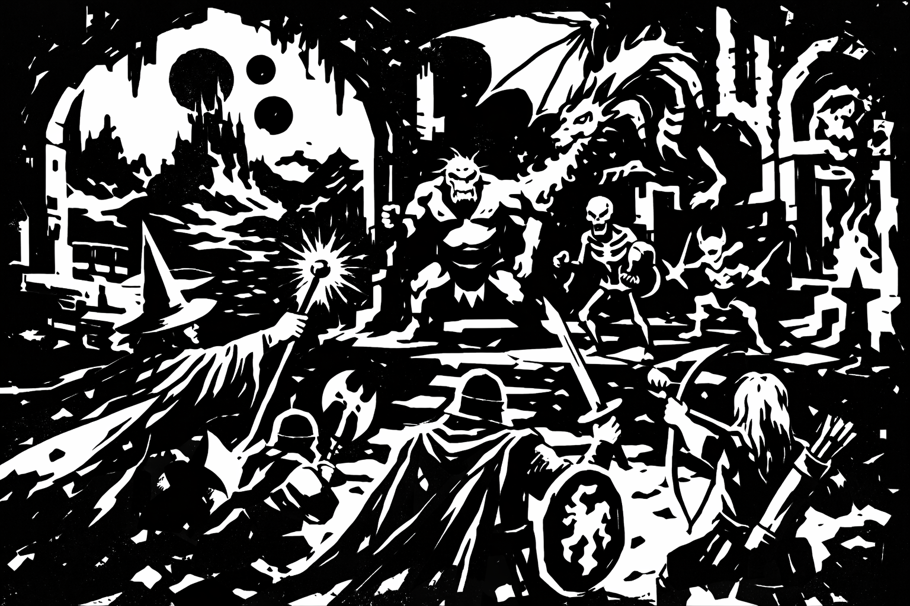
:::

::: center
Welcome, Adventurers!
:::

## Animals

Animals in this section are considered “animals” for the purposes of magic such as **animal summoning** or **invisibility to animals**. These are natural creatures, though some may be unusually large, fierce, or dangerous. Some kindly DMs may permit other creatures, such as dinosaurs or giant invertebrates, to count as “animals” for such magic—but this is strictly at the DM’s option.

::: pagebreak-pdf
:::

::: twocolumn-pdf-begin
:::

::: center
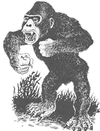
:::

### Ape
*Source:* `AD&D 1E Conversion`  *Category:* `Animal`

|               | Gorilla          | Carnivorous Ape  |
| ------------- | ---------------- | ---------------- |
| Armor Class   | 13               | 13               |
| Hit Dice      | 4+1              | 5                |
| Move          | 120' (40')       | 120' (40')       |
| Attacks       | 2 claws / 1 bite | 2 claws / 1 bite |
| Damage        | 1d3 / 1d3 / 1d6  | 1d4 / 1d4 / 1d8  |
| No. Appearing | 1d4 (3d4)        | 2d4 (4d4)        |
| Save As       | Fighter 2        | Fighter 3        |
| Morale        | 8                | 10               |
| Treasure Type | Nil              | C                |
| Alignment     | Neutral          | Neutral          |

Apes are large primates found in remote tropical forests. Though immensely strong, they differ greatly in temperament and behavior. Both grab and rend on a double-claw hit, but the gorilla is shy and defensive while the carnivorous ape is aggressive and man-eating.

**Gorillas**: Gorillas are normally shy and non-aggressive, preferring to avoid conflict whenever possible. However, if threatened, cornered, or defending their young, they fight with tremendous strength and ferocity. If a gorilla hits with both claws in the same round, it grabs and rends its opponent for an additional `1d6` points of damage.

**Carnivorous Apes**: Carnivorous apes are larger, stronger, and far more aggressive relatives of the gorilla. Highly cunning and unusually intelligent for animals, they have a particular taste for human flesh. Their eyesight, hearing, and sense of smell are exceptionally keen, and they are surprised only on a roll of 1 on `1d6`. If a carnivorous ape hits with both claws in the same round, it grabs and rends its opponent for an additional `1d8` points of damage.

### Baboon
*Source:* `Basic`  *Category:* `Animal`

|               | Baboon     | Rock Baboon |
| ------------- | ---------- | ----------- |
| Armor Class   | 12          | 13           |
| Hit Dice      | 1+1        | 2           |
| Save As       | Fighter 1  | Fighter 1   |
| Move          | 120' (40') | 120' (40')  |
| Attacks       | 1 bite     | club / bite |
| Damage        | 1d4        | 1d6/1d3     |
| No. Appearing | 2d6 (4d10) | 2d6 (5d6)   |
| Morale        | 6          | 8           |
| Treasure Type | Nil        | U           |
| Alignment     | Neutral    | Neutral     |

**Baboons** are mostly herbivorous troop animals. They are territorial and noisy, relying on numbers, threat displays, and quick climbing to drive off intruders. A troop is led by `2d4` large males, which inflict `1d4+1` damage with their attacks. Half of any troop consists of young, which do not normally fight. If their territory is invaded, baboons attempt to drive intruders away, though there is a 90% chance that a troop will flee if faced with determined resistance.

**Rock baboons**: are larger and more intelligent than normal baboons. Omnivorous and aggressive, they will eat nearly anything but strongly prefer meat. They do not make tools or weapons, though they commonly wield stones, bones, or heavy branches as crude clubs. They favor rocky hills, cliffs, and ruined places, where they hurl stones from above at intruders before closing to attack.  Though incapable of true speech, they communicate through barks, shrieks, and threatening screams that convey simple warnings and commands.

::: center
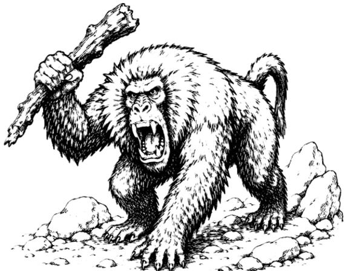
:::

### Badger
*Source:* `AD&D 1E Conversion`  *Category:* `Animal`

|               | Badger           | Giant Badger     |
| ------------- | ---------------- | ---------------- |
| Armor Class   | 15                | 15                |
| Hit Dice      | 1+2              | 3                |
| Save As       | Fighter 1        | Fighter 2        |
| Move          | 60' (20')        | 60' (20')        |
| Burrow        | 30' (10')        | 30' (10')        |
| Attacks       | 2 claws / 1 bite | 2 claws / 1 bite |
| Damage        | 1d2 / 1d2 / 1d3  | 1d3 / 1d3 / 1d6  |
| No. Appearing | 1d2 (2d4)        | 1d2 (1d4)        |
| Morale        | 8                | 8                |
| Treasure Type | Nil              | Nil              |
| Alignment     | Neutral          | Neutral          |

Badgers are fierce burrowing animals that staunchly defend their territory. Their quickness and low profile account for their unusually good Armor Class.

**Badgers**: are normally solitary. If more than one is encountered, it is usually a mated pair and their young. A badger's pelt may be sold for 10-30 gp.

**Giant badgers**: are a rare variety that grows to nearly twice the size of normal badgers. They share the same habits and temperament, but are considerably stronger and more dangerous.

::: center
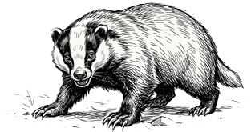
:::

### Barracuda
*Source:* `AD&D 1E Conversion`
*Category:* `Animal`

| Armor Class | 13           | No. Appearing | 2d6 (2d12)  |
| Hit Dice    | 1-3         | Save As       | Fighter 1-2 |
| Move (swim) | 300' (100') | Morale        | 8           |
| Attacks     | 1 bite      | Treasure Type | Nil         |
| Damage      | 2d4         | Alignment     | Neutral     |

Barracuda are predatory fish that inhabit warm salt waters. They are lightning fast, capable of accelerating from complete stillness to full speed in a single round.

Barracuda attack any prey that is injured, appears helpless, or is significantly smaller than themselves. The scent of blood in the water often attracts multiple barracuda to the same area, making them especially dangerous to wounded swimmers.

### Bat
*Source:* `Basic`  *Category:* `Animal`

|               | Normal        | Giant       |
| ------------- | ------------- | ----------- |
| Armor Class   | 13             | 13           |
| Hit Dice      | 1 HP          | 2           |
| Move          | 9' (3')       | 30' (10')   | 
| Fly           | 120' (40')    | 180' (60')  |
| Attacks       | Confusion     | 1 bite      |
| Damage        | Nil           | 1d4         |
| No. Appearing | 1d100 (1d100) | 1d10 (1d10) |
| Save As       | Normal Man    | Fighter 1   |
| Morale        | 6             | 8           |
| Treasure      | Nil           | Nil         |
| Alignment     | Neutral       | Neutral     |

Bats are nocturnal flying mammals commonly found in caves, ruins, and abandoned buildings.  They navigate by echolocation rather than sight, using high-pitched sounds and echoes to locate their surroundings.

Because bats do not rely on vision, spells or abilities that affect sight will not work on them. However, a **silence 15’** radius spell effectively blinds a bat by preventing it from using echolocation.

**Normal Bats**: Normal bats do not attack humans, but large groups may confuse victims by swarming around their heads. At least ten bats are required to affect one character. Confused characters suffer a -2 penalty on attack rolls and saving throws and cannot cast spells.

**Giant Bats**: Giant bats are carnivorous and may attack adventurers if hungry.

**Vampire Bats**: 5% of giant bat encounters are actually giant vampire bats. Their bite causes no extra damage, but the victim must save versus Paralysis or fall unconscious for `1d10` rounds. A vampire bat then drains `1d4` hit points of blood each round. Any creature slain in this way must save versus Spells or rise as a vampire 24 hours later.

::: center
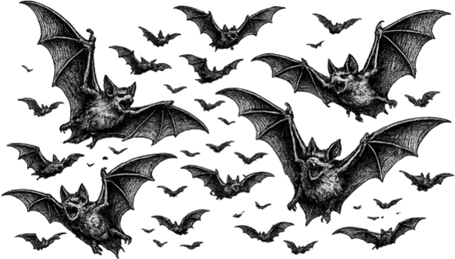
:::

::: twocolumn-pdf-end
:::

### Bear
*Source:* `Basic`  *Category:* `Animal`

|                | Black            | Grizzly          | Polar             | Dire             |
|----------------|------------------|------------------|-------------------|------------------|
| Armor Class    | 13                | 13                | 13                 | 13                |
| Hit Dice       | 4                | 5                | 6                 | 6+2              |
| Move           | 120' (40')       | 120' (40')       | 120' (40')        | 120' (40')       |
| Attacks        | 2 claws / 1 bite | 2 claws / 1 bite | 2 claws / 1 bite  | 2 claws / 1 bite |
| Damage         | 1d3 / 1d3 / 1d6  | 1d4 / 1d4 / 1d8  | 1d6 / 1d6 / 1d10  | 1d8 / 1d8 / 1d10 |
| No. Appearing  | 1d4 (1d4)        | 1d4 (1d4)        | 1 (1d2)           | 1d2 (1d2)        |
| Save As        | Fighter 2        | Fighter 2        | Fighter 3         | Fighter 3        |
| Morale         | 7                | 8                | 8                 | 9                |
| Treasure Type  | U                | U                | U                 | U                |
| Alignment      | Neutral          | Neutral          | Neutral           | Neutral          |

::: twocolumn-pdf-begin
:::

Bears are well known to all adventurers. If a bear (of any type) hits with both paws on the same victim in one round of combat, the bear has hugged its victim and will cause `2d8` additional points of damage in the same round as the attack.

**Black bear**: have black fur and stand about 6' tall.  They are omnivorous (will eat almost anything), but prefer roots and berries. A black bear will not usually attack unless it is cornered and cannot escape. Adult black bears will fight to the death to protect their young. They have been known to raid camps, seeking food. They are especially fond of such treats as fresh fish and sweets.

**Grizzly bear**: have silver-tipped brown or reddish brown fur, and stand about 9' tall. They are fond of meat and are much more likely to attack than black bears. Grizzlies are found in most climates, but are most common in mountains and forests.

**Polar bear**: have white fur and stand about 11' tall.  They live in cold regions. They usually eat fish, but are as likely to attack as grizzly bears. These huge bears are good swimmers, and their wide feet allow them to run across snow without sinking.

**Dire bear**: are massive, broad-shouldered predators found in deep forests, remote mountains, and other untamed wilderness. Standing nearly 14' tall when rearing, they are larger and more aggressive than grizzlies, with thick dark fur, huge claws, and a savage temper. Dire bears are relentless hunters and will pursue wounded prey for hours. Unlike most bears, they often attack humans on sight and are feared even by giants and other large predators.

::: center
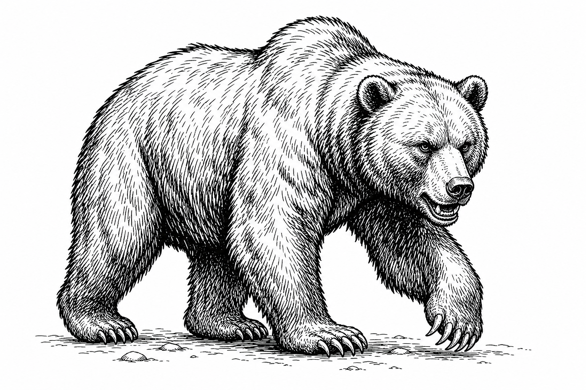
:::

### Beaver, Giant
*Source:* `AD&D 1E Conversion`
*Category:* `Animal`

| Armor Class | 13          | No. Appearing | 0 (3d10)  |
| Hit Dice    | 4          | Save As       | Fighter 4 |
| Move        | 60' (20')  | Morale        | 7         |
| Swim        | 120' (40') | Treasure Type | C         |
| Attacks     | 1 bite     | Alignment     | Neutral   |
| Damage      | 4d4        |               |           |

Giant beavers are intelligent but usually docile. They flee danger when possible, but fight fiercely if cornered or if their lodge is threatened.

A giant beaver colony lives in a great lodge of mud and logs, usually in the middle of a lake created by its dam. If an alarm is sounded by tail slap, the whole colony rushes to defend the lodge and its young. For each adult there is usually one young beaver.

Giant beavers sometimes trade. They prize coins, valuables, tender twigs, and bark, especially birch, aspen, and willow. If treated well, they may be persuaded to build dam-like works near water. Their hides are valuable, and kits may be captured and sold, though doing so earns the enmity of the colony.

### Boar
*Source:* `AD&D 1E Conversion`
*Category:* `Animal`

|               | Wild Boar  | Warthog    |
| ------------- | ---------- | ---------- |
| Armor Class   | 12          | 12          |
| Hit Dice      | 3+3        | 3          |
| Save As       | Fighter 2  | Fighter 2  |
| Move          | 150' (50') | 120' (40') |
| Attacks       | 1 tusk     | 2 tusks    |
| Damage        | 3d4        | 2d4 / 2d4  |
| No. Appearing | 1d6 (1d12) | 1d4 (1d6)  |
| Morale        | 9          | 8          |
| Treasure Type | Nil        | Nil        |
| Alignment     | Neutral    | Neutral    |

Boars are tough, pig-like omnivores. Wild boars and giant boars are fierce when roused, while warthogs are usually aggressive only when cornered, threatened, or defending territory.

If several wild boars are encountered, the group includes one boar, several sows, and young. A wild boar may fight for `2d4` rounds after reaching 0 hit points unless reduced to -7 or worse.

Warthogs make two slashing tusk attacks. If 3-6 are encountered, the remainder may be young with 1-2 Hit Dice. A warthog may fight for `1d2` rounds after reaching 0 hit points unless reduced to -6 or worse.

::: center
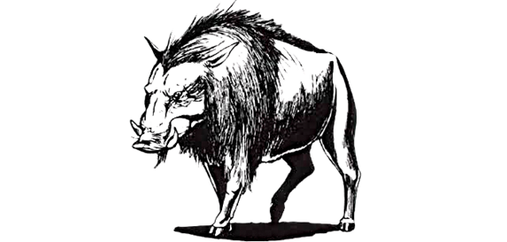
:::

### Buffalo
*Source:* `AD&D 1E Conversion`
*Category:* `Animal`

| Armor Class | 12          | No. Appearing | 2d6 (4d6) |
| Hit Dice    | 5          | Save As       | Fighter 3 |
| Move        | 150' (50') | Morale        | 8         |
| Attacks     | 2 horns    | Treasure Type | Nil       |
| Damage      | 1d8 / 1d8  | Alignment     | Neutral   |

Buffalo are dangerous herd animals of tropical and subtropical plains. They usually attack if approached within 60', though some herds flee when threatened.

A charging buffalo must move at least 40' before impact. A charge deals `3d6` damage, plus `1d4` trampling damage.

### Bull
*Source:* `AD&D 1E Conversion`
*Category:* `Animal`

| Armor Class | 12          | No. Appearing | 1d4 (2d10) |
| Hit Dice    | 4          | Save As       | Fighter 2  |
| Move        | 150' (50') | Morale        | 8          |
| Attacks     | 2 horns    | Treasure Type | Nil        |
| Damage      | 1d6 / 1d6  | Alignment     | Neutral    |

Bulls are mature male bovines noted for their strength, aggression, and territorial nature. This entry may also be used for wild oxen, aurochs, and similar wild cattle.

There is a 75% chance that a bull attacks if approached within 80'. A charging bull must move at least 30' before impact. A successful charge inflicts `3d6` damage, plus `1d4` trampling damage.

When encountered as part of a herd, bulls typically place themselves between the threat and the remainder of the herd, attacking until the danger is driven off or they are slain.

### Camel
*Source:* `Expert`  *Category:* `Animal`

| Armor Class | 12          | No. Appearing | 0 (2d4)   |
| Hit Dice    | 2          | Save As       | Fighter 1 |
| Move        | 150' (50') | Morale        | 7         |
| Attacks     | bite/hoof  | Treasure Type | Nil       |
| Damage      | 1 / 1d4    | Alignment     | Neutral   |

Wild camels include single-humped dromedaries of hot deserts and double-humped bactrians that can endure colder regions. Camels can go up to two weeks without food or water.

A camel can carry up to 6,000 cn, though this slows it to 50' (15'). A load of 4,000-5,000 cn slows it to 120' (40'). Bactrian camels move 30' (10') slower than dromedaries.

Camels bite when forced to fight. They are ill-tempered and may spit at those who approach to ride or handle them. There is a 50% chance a camel spits; if it does, the target must Save vs. Paralysis or be blinded for `1d3` rounds. Horses dislike the odor of camels.

Charge attacks with a lance from camelback are **not** possible.

::: center
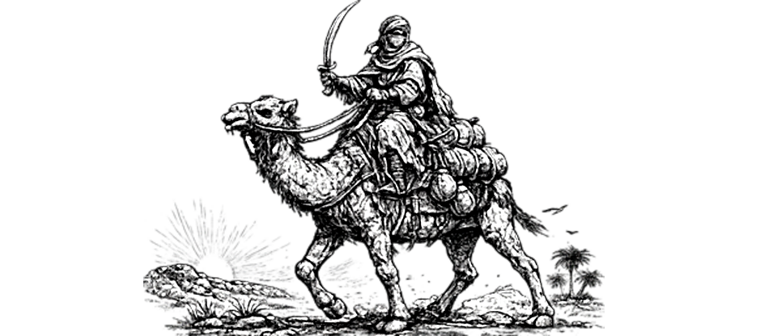
:::

::: twocolumn-pdf-end
:::

### Cat, Great
*Source:* `Basic`  *Category:* `Animal`

|                | Mountain Lion | Panther       | Lion         | Jaguar       | Tiger        |
|----------------|---------------|---------------|--------------|------------- |--------------|
| Armor Class    | 13             | 15             | 13            | 14            | 13            |
| Hit Dice       | 3 + 2         | 4             | 5            | 5            | 6            |
| Move           | 150' (50')    | 210' (70')    | 150' (50')   | 150' (50')   | 150' (50')   |
| Attacks        | 2 claws/bite  | 2 claws/bite  | 2 claws/bite | 2 claws/bite | 2 claws/bite |
| Damage         | 1d3/1d3/1d6   | 1d4/1d4/1d8   | 1d4/1d4/1d10 | 1d6/1d6/1d10 | 1d6/1d6/2d6  |
| No. Appearing  | 1d4 (1d4)     | 1d2 (1d6)     | 1d4 (1d8)    | 1d2 (1d4)    | 1 (1d3)      |
| Save As        | Fighter 2     | Fighter 2     | Fighter 3    | Fighter 3    | Fighter 3    |
| Morale         | 8             | 8             | 9            | 9            | 9            |
| Treasure Type  | U             | U             | U            | U            | U            |
| Alignment      | Neutral       | Neutral       | Neutral      | Neutral      | Neutral      |

::: twocolumn-pdf-begin
:::

The Great Cats are normally cautious and avoid fights unless driven by extreme hunger or trapped with no escape route. Though they may appear relaxed or even playful, they are prone to sudden violent changes of temper. Many develop a preference for certain prey and may deliberately hunt it, sometimes including humans or human-like creatures. Great Cats rarely venture deep into caves, preferring to remain close to open wilderness. Despite their caution, they are intensely curious and may follow adventurers simply to observe them. They will always pursue fleeing prey.

**Mountain Lion**: These tawny-furred cats inhabit mountains, forests, and deserts. They wander farther into caves and ruins than most other Great Cats.

**Panther**: Panthers/Leopards are found in forests, plains, and shrub lands. They are exceptionally fast and can outrun most prey over short distances.

**Lion**: Lions inhabit warm climates, especially savannahs and brush lands near deserts. They commonly hunt in groups known as prides.

**Jaguar**: Jaguars inhabit dense jungles, swamps, and overgrown ruins. Powerful swimmers and skilled climbers, they prefer ambush attacks from trees or thick vegetation. Unlike most Great Cats, jaguars readily enter water and sometimes drag prey into rivers or marshes to drown it.

**Tiger**: Tigers are the largest commonly encountered Great Cats. They prefer cool forests and wooded lands where their striped coats provide natural camouflage. Tigers surprise prey on a roll of `1-4` on `1d6` when hunting in wooded terrain.

::: center

:::

### Cattle
*Source:* `AD&D 1E Conversion`
*Category:* `Animal`

| Armor Class | 12          | No. Appearing | 0 (5d20)    |
| Hit Dice    | 1-4        | Save As       | Fighter 1-2 |
| Move        | 150' (50') | Morale        | 6           |
| Attacks     | 1 gore     | Treasure Type | Nil         |
| Damage      | 1d4        | Alignment     | Neutral     |

Cattle are domesticated bovines raised for meat, milk, labor, and hides. They are commonly found in pastures, ranches, and settled lands, where they gather in large herds. Most cattle are placid and accustomed to the presence of humans.

When frightened, however, cattle are prone to panic. There is a 25% chance that a startled herd stampedes directly through nearby creatures. If no cover is available, each creature in the path is trampled by `2d4` cattle, taking `1d4` damage from each.

Most herds consist primarily of cows, heifers, steers, and calves, supervised by herdsmen or guarded by one or more bulls.

::: center
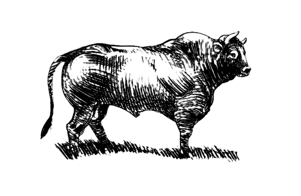
:::

### Crab, Giant
*Source:* `Expert`  *Category:* `Animal`

| Armor Class | 17         | No. Appearing | 1d2 (1d6) |
| Hit Dice   | 3         | Save As       | Fighter 2 |
| Move       | 60' (20') | Morale        | 7         |
| Attacks    | 2 pincers | Treasure Type | Nil       |
| Damage     | 2d6/2d6   | Alignment     | Neutral   |

Unable to swim, giant crabs are found on the bottom of shallow waters, in coastal rivers and on beaches, and in salt or fresh water. They are always hungry and will attack anything that moves. Giant crabs are not intelligent.

### Crayfish, Giant
*Source:* `AD&D 1E Conversion`  *Category:* `Animal`

| Armor Class | 15          | No. Appearing | 1d4 (1d4)  |
| Hit Dice    | 4+4        | Save As       | Fighter 3  |
| Move        | 60' (20')  | Morale        | 8          |
| Swim        | 120' (40') | Treasure Type | Nil        |
| Attacks     | 2 claws    | Alignment     | Neutral    |
| Damage      | 2d6 / 2d6  |               |            |

Giant crayfish are strange freshwater monsters. They walk slowly but can swim with sudden speed for short distances.

Like giant crabs, giant crayfish hide and rush out to seize prey. They surprise on 1-3 on `1d6`.

### Crocodile
*Source:* `Expert`  *Category:* `Animal`

|                | Crocodile       | Large Crocodile | Giant Crocodile |
|----------------|-----------------|-----------------|-----------------|
| Armor Class    | 14               | 16               | 18               |
| Hit Dice       | 2               | 6               | 15              |
| Move           | 90' (30')       | 90' (30')       | 90' (30')       |
| Swimming       | 90' (30')       | 90' (30')       | 90' (30')       |
| Attacks        | bite            | bite            | bite            |
| Damage         | 1d8             | 2d8             | 3d8             |
| No. Appearing  | 0 (1d8)         | 0 (1d4)         | 0 (1d3)         |
| Save As        | Fighter 1       | Fighter 3       | Fighter 8       |
| Morale         | 7               | 7               | 9               |
| Treasure Type  | Nil             | Nil             | Nil             |
| Alignment      | Neutral         | Neutral         | Neutral         |

Crocodiles are commonly found in tropical and semi-tropical swamps or in slow-moving rivers. Awkward on land, they do not stray far from water and will spend hours floating barely under the surface. If hungry, crocodiles will attack creatures in the water. They are particularly attracted to the smell of blood or violent thrashing of the water.

Large crocodiles are at least 20' long, and can overturn canoes and small rafts. Giant crocodiles are normally found only in "lost worlds" where prehistoric creatures thrive. They are over 50' long and have been known to attack small boats or ships.

::: center

:::

### Dog
*Source:* `AD&D 1E Conversion`  *Category:* `Animal`

|               | War Dog      | Wild Dog     |
| ------------- | ------------ | ------------ |
| Armor Class   | 13            | 12            |
| Hit Dice      | 2+2          | 1+1          |
| Save As       | Fighter 2    | Fighter 1    |
| Move          | 120' (40')   | 150' (50')   |
| Attacks       | 1 bite       | 1 bite       |
| Damage        | 2d4          | 1d4          |
| No. Appearing | 1d4 (1d6)    | 2d4 (4d4)    |
| Morale        | 9            | 7            |
| Treasure Type | Nil          | Nil          |
| Alignment     | Neutral      | Neutral      |

War dogs are large dogs trained to fight. They are loyal to their masters, ferocious in attack, and usually protected by light leather armor and a spiked collar. Their number depends on their handlers.

Wild dogs roam in packs across many regions, sometimes overlapping the range of wolves. If well fed, they avoid contact. A wild dog can be tamed only if separated from its pack.

### Dolphin
*Source:* `AD&D 1E Conversion`  *Category:* `Animal`

| Armor Class | 14           | No. Appearing | 1d10 (2d10) |
| Hit Dice    | 2+2         | Save As       | Fighter 4   |
| Move        | 300' (100') | Morale        | 8           |   
| Attacks     | 1 ram       | Treasure Type | Nil         |
| Damage      | 2d4         | Alignment     | Lawful      |

Dolphins are intelligent sea mammals that usually roam the oceans in nomadic schools. Some form underwater communities; if one is found, nearby communities are likely to exist within a few miles.

Communal dolphins may keep swordfish or narwhals as guards, depending on climate. Dolphins help humans in distress and attack creatures that threaten them. They hate sharks and attack them unless outnumbered at least two to one.  Their ramming attack can shatter a small boat's hull if the crew provokes them.

### Eagle, Giant
*Source:* `AD&D 1E Conversion`  *Category:* `Animal`

| Armor Class | 12          | No. Appearing | 1d6 (2d10) |
| Hit Dice    | 4          | Save As       | Fighter 4  |
| Move        | 30' (10')  | Morale        | 8          |
| Fly         | 480' (160') | Treasure Type | Q, C magic only |
| Attacks     | 2 claws / 1 bite | Alignment | Neutral    |
| Damage      | 1d6 / 1d6 / 2d6 |           |            |

Giant eagles nest on high cliffs, mesas, and mountain crags. Their eyesight is so keen that they are surprised only in their lairs or at night.

If a giant eagle dives at least 50' before attacking, it gains +4 to hit and deals double claw damage, but cannot bite that round. It can carry up to 2,000 cn at half speed.

Away from the nest, giant eagles usually ignore good creatures and attack evil creatures that seem threatening. In the lair they are hostile, especially if eggs or young are present. Each nest holds `1d4` young, and there is one nest per two adults.

### Eel
*Source:* `AD&D 1E Conversion`  *Category:* `Animal`

|               | Electric Eel | Giant Eel    | Weed Eel    |
| ------------- | ------------ | ------------ | ----------- |
| Armor Class   | 10            | 13            | 11           |
| Hit Dice      | 2            | 5            | 1-1         |
| Save As       | Fighter 1    | Fighter 3    | Fighter 1   |
| Move          | 120' (40')   | 90' (30')    | 150' (50')  |
| Attacks       | 1 bite       | 1 bite       | 1 bite      |
| Damage        | 1d3          | 3d6          | 1 poison    |
| No. Appearing | 1d3 (1d3)    | 1d4 (1d4)    | 2d10 (6d10) |
| Morale        | 7            | 8            | 8           |
| Treasure Type | Nil          | Nil          | O, P, R     |
| Alignment     | Neutral      | Neutral      | Neutral     |

Eels are water-dwellers and usually attack only when approached too closely. Giant eels are often morays with vicious teeth and foul tempers.

Electric eels live in warm fresh water. Once per hour, an electric eel may discharge a shock in a 15' radius. Creatures within 5' take `3d8` damage, those 5'-10' away take `2d8`, and those 10'-15' away take `1d8`. Electric eels are immune to electrical effects.

Weed eels resemble seaweed and live in colonies of small tunnels leading to a treasure-floored communal cave. Their bite is poisonous; a bitten creature must Save vs. Poison or die. If intruders enter their tunnels, weed eels rush out to defend the colony.

::: center
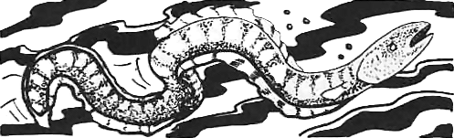
:::

### Elephant
*Source:* `Expert`  *Category:* `Animal`

| Armor Class    | 14                  | No. Appearing | 0 (1d20)    |
| Hit Dice       | 9                  | Save As       | Fighter 5   |
| Move           | 120' (40')         | Morale        | 8           |
| Attacks        | 2 tusks or trample | Treasure Type | See below   |
| Damage         | 2d4/2d4 or 4d8     | Alignment     | Neutral     |

Any number of elephants from a lone rogue to an entire herd may be encountered. Both males and females have tusks.

In combat, elephants will first charge, striking with their tusks for double damage. In succeeding combat rounds, they will either strike with their tusks, 25%, or trample, 75%. If the opponent is man-sized or smaller, the elephant receives a bonus of +4 on "to hit" rolls when trampling.

Elephants dwell at the edge of sub-tropical forest areas. Their tusks are valued for the ivory and may be sold for 100-600 gp each.

### Ferret, Giant
*Source:* `Basic`  *Category:* `Animal`

| Armor Class | 14          | No. Appearing | 1d8 (1d12) |
| Hit Dice    | 1 + 1      | Save As       | Fighter 1  |
| Move        | 150' (50') | Morale        | 8          |
| Attacks     | 1 bite     | Treasure Type | Nil        |
| Damage      | 1d8        | Alignment     | Neutral    |

Giant ferrets look like 3' long weasels, with sleek, sinuous bodies well-suited to slipping through narrow tunnels and burrows. They hunt giant rats underground, and are sometimes trained for this purpose. Skilled trainers value them for their speed and tenacity in confined spaces, but success is far from guaranteed. Unfortunately, their tempers are highly unpredictable, and they have been known to attack their trainers and other humans. Even a ferret raised from a kit may turn on its handler without warning, making them a risky companion at best.

::: twocolumn-pdf-end
:::

### Fish, Giant
*Source:* `Expert`  *Category:* `Animal`

|                 | Giant Piranha | Spiny Rockfish     | Giant Catfish      | Giant Sturgeon |
|-----------------|---------------|--------------------|--------------------|----------------|
| Armor Class     | 13             | 12                  | 15                  | 19              |
| Hit Dice        | 3 + 3         | 5 + 5*             | 8 + 3              | 10 + 2*        |
| Move (swimming) | 150' (50')    | 180' (60')         | 90' (30')          | 180' (60')     |
| Attacks         | 1 bite        | 4 spines + poison  | 1 bite / 4 feelers | 1 bite         |
| Damage          | 1d8           | (1d4) x 4 + poison | 2d8 / (1d4) x 4    | 2d10           |
| No. Appearing   | 0 (2d4)       | 0 (2d4)            | 0 (1d2)            | 0 (1)          |
| Save As         | Fighter 2     | Fighter 3          | Fighter 4          | Fighter 5      |
| Morale          | 7             | 8                  | 8                  | 9              |
| Treasure Type   | Nil           | Nil                | Nil                | Nil            |
| Alignment       | Neutral       | Neutral            | Neutral            | Neutral        |

::: twocolumn-pdf-begin
:::

**Giant piranha**: are 5' in length with green and black scales. They attack anything that disturbs the water near them. Up to 8 giant piranha can attack the same target. Once blood is drawn they go into a feeding frenzy and will not check morale. Piranha inhabit warm fresh waters and prefer rivers to lakes.

**Spiny rockfish**: are found in shallow salt water and are very difficult to distinguish from normal boulders. There is a 70% chance that one will be mistaken for a boulder or lump of coral. A rockfish is normally harmless, but will viciously attack anyone who disturbs it. Its body is covered with spines, and it may lash 4 of them at any character. These spines do `1d4` points of damage each and are deadly poisonous, save vs. Poison or die. Mistaking a rockfish for a rock or lump of coral and grasping it will result in 4 automatic hits, each requiring a save vs. Poison in addition to the normal damage taken.

**Giant catfish**: are chalky white fish about 15' long. They have two long feelers that sprout from each side of the mouth, and lurk in the cool muck of river and lake bottoms attacking swimmers or things moving on the bottom.

**Giant sturgeon**: are almost 30' long and are covered with thick armorlike scales. Sturgeons are vicious fighters. On a roll of 18 or better they swallow their prey whole.

Any character swallowed takes `2d6` points of damage per round and must make a saving throw vs. Death Ray or be paralyzed. If the character saves, he or she may try to hack a way out at a penalty of -4; the inside of a sturgeon has a base AC of 12.

::: center
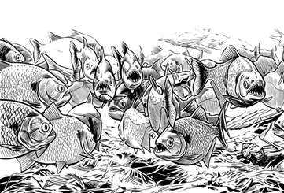
:::

### Flightless Bird
*Source:* `AD&D 1E Conversion`  *Category:* `Animal`

| Armor Class | 12          | No. Appearing | 2d6 (2d10) |
| Hit Dice    | 1-3        | Save As       | Fighter 1-2 |
| Move        | 180' (60') | Morale        | 6          |
| Attacks     | 1 peck or 1 kick | Treasure Type | Nil    |
| Damage      | 1d4 or 2d4 | Alignment     | Neutral    |

These large avian creatures are typified by the ostrich, emu, and rhea.  They live in warm climates in open grasslands.

- Ostrich sized have 3 HD
- Emu-like birds have 2 HD
- Rhea-sized birds have 1 HD

All flightless birds are non-aggressive and run from danger.  If cornered they can peck for `1d4` damage or kick for `2d4` points.  Despite their inability to fly, these birds are remarkably swift, relying on speed and keen eyesight to spot predators across the open plains long before they draw near.  They travel in loose flocks and forage on seeds, roots, and small insects, rarely wandering far from a reliable water source.

### Frog, Giant
*Source:* `AD&D 1E Conversion`  *Category:* `Animal`

|               | Giant Frog         | Killer Frog       | Poisonous Frog |
| ------------- | ------------------ | ----------------- | -------------- |
| Armor Class   | 12                  | 11                 | 11              |
| Hit Dice      | 1-3                | 1+4               | 1*             |
| Save As       | Fighter 1-2        | Fighter 1         | Fighter 1      |
| Move          | 30' (10')          | 60' (20')         | 30' (10')      |
| Swim          | 90' (30')          | 120' (40')        | 90' (30')      |
| Attacks       | 1 tongue or 1 bite | 2 claws / 1 bite  | 1 bite         |
| Damage        | grab or 1d4+1      | 1d2 / 1d2 / 1d4+1 | 1 poison       |
| No. Appearing | 2d10 (5d8)         | 2d6 (3d6)         | 1d6 (2d6)      |
| Morale        | 7                  | 9                 | 7              |
| Treasure Type | Nil                | Nil               | Nil            |
| Alignment     | Neutral            | Neutral           | Neutral        |

**Giant frogs** are found in marshes, swamps, large ponds, river banks, and lake shores. The smallest are only about 2' long (body), medium-sized frogs (2 hit dice) are about 4' long, and the largest are some 6' long. Because of their coloration they surprise on a 1-4. These creatures can leap up to 18' to attack.

A giant frog has a tongue equal to three times its body length. This sticky member strikes at +4 to hit but does no damage. The tongue is used to draw prey to the frog's mouth. Any creature hit by the tongue gets the opportunity to hit it, and if it does, the frog will withdraw it and not use it against that creature again. If the tongue is not struck, the creature contacted by this member is drawn to the frog's mouth on the next turn and automatically takes maximum damage. Exception: creatures weighing more than the frog have a second opportunity to strike the tongue and will not be dragged to the frog's mouth until the third melee round. Furthermore, creatures weighing more than twice the frog's weight will not be dragged at all, and the frog will release its hold on the third melee round.

Frogs weigh from 50 to 250 pounds (figure 50 pounds additional weight for every foot of body length over 2'). For each 50 pounds of weight over 50, subtract 2' from the maximum leaping distance (18'). A giant frog can jump to a maximum height of 30', regardless of weight. The direction of a jump can be up to 45 degrees to either side of the frog's direct facing.

Giant frogs eat large insects, birds, rats, or just about any other creature small enough to swallow. A giant frog can swallow a small human, elf, halfling, etc.; this is indicated by a score of 20. If a giant frog swallows an opponent whole, the victim has a chance to cut its way out if it has a sharp-edged weapon and can score an 18 or better (this also kills the frog). The victim has three chances to escape. Hits upon a giant frog with prey swallowed whole have a one-third probability of instead hitting the creature inside, inflicting whatever damage was scored on the giant frog on that creature as well.

Giant frogs hunt aggressively but fear predators such as giant fish, giant turtles, and giant snakes. If severely wounded, they will retreat. They fear fire.

**Killer Frog:** These smallish giant frogs employ talons and teeth in attack. They are man-eating, specifically bred mutants. Only their cannibalistic habits keep them from becoming common, and thus a real threat.

**Poisonous Frog:** This is a rare variety of the normal frog. It secretes a poison from its skin, so that its touch as well as its bite can prove fatal. However, as the poison is weak, all creatures gain a +4 bonus on their saving throws.

::: center

:::

### Gar, Giant
*Source:* `AD&D 1E Conversion`  *Category:* `Animal`

| Armor Class | 16          | No. Appearing | 1d6 (1d12) |
| Hit Dice    | 8          | Save As       | Fighter 4  |
| Move        | 300' (100') swim | Morale | 8          |
| Attacks     | 1 bite     | Treasure Type | Nil        |
| Damage      | 5d4        | Alignment     | Neutral    |

Giant gar are aggressive hunters found only in large, deep lakes and rivers. Unlike their smaller kin, they actively pursue prey.

A giant gar swallows prey whole on a natural attack roll of 20. A swallowed creature has a 5% chance per round of dying and can escape only by cutting free with a sharp weapon, dealing damage equal to one-quarter of the gar's total hit points. Piercing attacks against the gar have a 20% chance to also injure a swallowed creature.

::: center
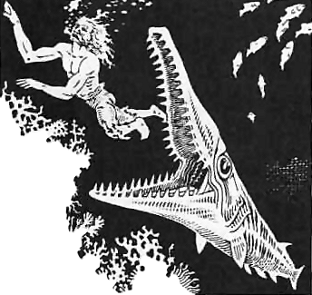
:::

### Goat, Giant
*Source:* `AD&D 1E Conversion`  *Category:* `Animal`

| Armor Class | 12          | No. Appearing | 1d6 (1d12) |
| Hit Dice    | 3+1        | Save As       | Fighter 2  |
| Move        | 180' (60') | Morale        | 8          |
| Attacks     | 1 butt     | Treasure Type | Nil        |
| Damage      | 2d8        | Alignment     | Neutral    |

Giant goats are reclusive herbivores of hilly country. They aggressively defend themselves from threats and may be tamed in rare cases as mounts.

If a giant goat charges, it adds +4 damage on a hit. If more than seven are encountered, the remainder are young.

::: center
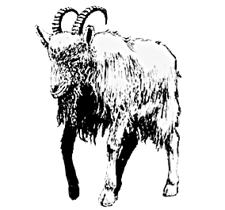
:::

### Hawk
*Source:* `Expert`  *Category:* `Animal`

|               | Normal Hawk     | Giant Hawk      |
|---------------|-----------------|-----------------|
| Armor Class   | 11               | 13               |
| Hit Dice      | 1/2 (1d4 hp)    | 3 + 3           |
| Move          | Fly 480' (160') | Fly 450' (150') |
| Attacks       | 1               | 1               |
| Damage        | 1d2             | 1d6             |
| No. Appearing | 0 (1d6)         | 0 (1d3)         |
| Save As       | Normal Man      | Fighter 2       |
| Morale        | 7               | 8               |
| Treasure Type | Nil             | Nil             |
| Alignment     | Neutral         | Neutral         |

Hawks are hunting birds that glide on the updrafts of the wind, watching the ground for prey. If a hawk surprises its victim, it does double damage on its first attack.

Normal hawks do not usually attack human-sized or larger creatures unless the target appears unable to defend itself. Giant hawks are as large as a very big dog or small pony, are much stronger, and will attack human-sized creatures if hungry.

Both normal and giant hawks may be trained as pets or guards by an animal trainer.

### Herd Animals
*Source:* `Expert`  *Category:* `Animal`

| Armor Class | 12          | No. Appearing | 0 (3d10)    |
| Hit Dice    | 1-4        | Save As       | Fighter 1-2 |
| Move        | 240' (80') | Morale        | 5           |
| Attacks     | 1 butt     | Treasure Type | Nil         |
| Damage      | 1d4-1d8    | Alignment     | Neutral     |

This category includes most wild, grazing creatures such as antelope, deer, wild oxen, moose, elk, goats, and caribou. At least one species will be encountered in any given climate.

The number of hit dice the creature has and the amount of damage it does depends on its size. Deer, antelope, and goats typically have 1 or 2 hit dice; caribou and oxen have 3 hit dice, while elk and moose may have up to 4.

Only males have a butt attack. If more than 2 creatures are encountered, there will be 1 male per 4 creatures, with the remainder being females and young. The young will have 1/2 the hit points normal, but the males will have 1-4 extra hit points. Females and young will flee from trouble while the male protects them.

### Hippopotamus
*Source:* `AD&D 1E Conversion`  *Category:* `Animal`

| Armor Class | 13          | No. Appearing | 1d6 (2d6)  |
| Hit Dice    | 8          | Save As       | Fighter 4  |
| Move        | 90' (30')  | Morale        | 8          |
| Swim        | 120' (40') | Treasure Type | Nil        |
| Attacks     | 1 bite     | Alignment     | Neutral    |
| Damage      | 2d6 or 3d6 |               |            |

Hippopotami are aggressive river and lake animals. They usually attack boats, swimmers, or creatures that approach too closely.

In water they can capsize small craft or drag prey below. Large bulls deal `3d6` damage with their bite.

::: twocolumn-pdf-end
:::

### Horse
*Source:* `Expert`  *Category:* `Animal`

|               | Riding Horse | War Horse         | Draft Horse       |
|---------------|--------------|-------------------|-------------------|
| Armor Class   | 12            | 12                 | 12                 |
| Hit Dice      | 2            | 3                 | 3                 |
| Move          | 240' (80')   | 120' (40')        | 90' (30')         |
| Attacks       | 2 hooves     | 2 hooves          | Nil               |
| Damage        | 1d4 / 1d4    | 1d6 / 1d6         | Nil               |
| No. Appearing | 0 (10d10)    | 0 (domestic only) | 0 (domestic only) |
| Save As       | Fighter 1    | Fighter 2        | Fighter 2        |
| Morale        | 7            | 9                 | 6                 |
| Treasure Type | Nil          | Nil               | Nil               |
| Alignment     | Neutral      | Neutral           | Neutral           |

::: twocolumn-pdf-begin
:::

**Riding horses**: are smaller than draft or war horses but can carry a rider farther. A riding horse is noted for its ability to exist anywhere there is grass to feed on. Any wild horse can become a riding horse if tamed. The amount of weight the horse can carry and still move at normal speed is 3000 cn. The maximum weight that can be carried is 6000 cn at half movement.

**War horses**: are bred for warlike temperament and strength. They cannot be ridden long distances at high speed, but are powerful in a short charge. A war horse can carry 4000 cn at full speed and 8000 cn at half speed. When charging, a rider employing a lance will do double damage if a hit is successful, although the horse may not fight at the same time. After the first charging round, both rider and horse can fight normally.

**Draft horses**: are large horses bred for sturdiness and endurance. They are used primarily for plowing, pulling wagons, and as pack animals. A draft horse can carry a normal load of 4500 cn and a maximum load, movement reduced by 1/2, of 9000 cn. A draft horse will not fight; if attacked, it will attempt to flee.

::: center
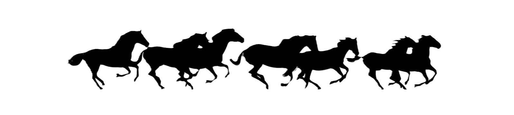
:::

### Hyena
*Source:* `AD&D 1E Conversion`  *Category:* `Animal`

| Armor Class | 12          | No. Appearing | 2d6 (4d6)  |
| Hit Dice    | 1+1        | Save As       | Fighter 1  |
| Move        | 120' (40') | Morale        | 7          |
| Attacks     | 1 bite     | Treasure Type | Nil        |
| Damage      | 1d4        | Alignment     | Neutral    |

Hyenas are cowardly scavengers and pack hunters of warm plains and scrublands. They prefer carrion but attack weak or isolated prey.

When led by gnolls or driven by hunger, hyenas are bolder and may harry a party for hours.

### Jackal
*Source:* `AD&D 1E Conversion`  *Category:* `Animal`

| Armor Class | 12          | No. Appearing | 2d6 (4d6)  |
| Hit Dice    | 1d4 hp     | Save As       | Normal Man |
| Move        | 120' (40') | Morale        | 6          |
| Attacks     | 1 bite     | Treasure Type | Nil        |
| Damage      | 1d2        | Alignment     | Neutral    |

Jackals are small scavenging canines of warm lands. They avoid strong prey but may follow wounded creatures or battlefields.

Their howls can reveal the presence of intruders or attract larger predators.

### Lamprey
*Source:* `AD&D 1E Conversion`  *Category:* `Animal`

| Armor Class | 12          | No. Appearing | 1d6 (2d6)  |
| Hit Dice    | 1+1        | Save As       | Fighter 1  |
| Move        | 120' (40') swim | Morale   | 7          |
| Attacks     | 1 bite     | Treasure Type | Nil        |
| Damage      | 1d4        | Alignment     | Neutral    |

Lampreys are blood-drinking aquatic parasites. They attach with circular mouths and rasping teeth.

Once attached, a lamprey drains `1d4` damage each round until killed or removed. Removing it without killing it causes an additional `1d4` damage.

::: center
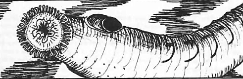
:::

### Leech, Giant
*Source:* `Expert`  *Category:* `Animal`

| Armor Class | 12          | No. Appearing | 0 (1d4)   |
| Hit Dice    | 6          | Save As       | Fighter 3 |
| Move        | 90' (30')  | Morale        | 10        |
| Attacks     | Blood suck | Treasure Type | Nil       |
| Damage      | 1d6        | Alignment     | Neutral   |

Giant leeches are loathsome and slug-like. They live in swamps and are about 3 to 4 feet long. A giant leech has a sucker-like mouth that attaches to the victim if a hit is successful. It then sucks blood, doing `1d6` points of damage per round. A giant leech must be killed to be removed from its victim. When the victim dies, the leech will drop off and hide while it digests its meal.

::: center
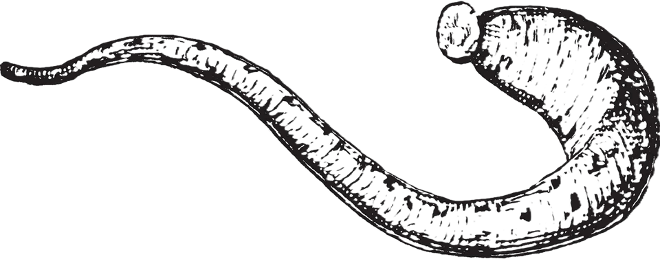
:::

::: twocolumn-pdf-end
:::

### Lizards, Giant
*Source:* `Basic`  *Category:* `Animal`

|               | Gecko      | Draco                      | Horned Chameleon | Tuatara          |
|---------------|------------|----------------------------|------------------|------------------|
| Armor Class   | 14         | 14                         | 17               | 15               |
| Hit Dice      | 3 + 1      | 4 + 2                      | 5*               | 6                |
| Move          | 120' (40') | 120' (40'); fly 210' (70') | 120' (40')       | 90' (30')        |
| Attacks       | 1 bite     | 1 bite                     | 1 bite / 1 horn  | 2 claws / 1 bite |
| Damage        | 1d8        | 1d10                       | 2d4 / 1d6        | 1d4 / 1d4 / 2d6  |
| No. Appearing | 1d6 (1d10) | 1d4 (1d8)                  | 1d3 (1d6)        | 1d2 (1d4)        |
| Save As       | Fighter 2  | Fighter 3                  | Fighter 3        | Fighter 4        |
| Morale        | 7          | 7                          | 7                | 6                |
| Treasure Type | U          | U                          | U                | V                |
| Alignment     | Neutral    | Neutral                    | Neutral          | Neutral          |

::: twocolumn-pdf-begin
:::

**Gecko**: is a 5' long lizard colored pale blue with orange-brown spots. Geckos are carnivorous and nocturnal, sleeping during the day and active at night or in darkness. Geckos hunt by climbing steep walls or trees with their specially adapted feet, then dropping on their prey to attack.

**Draco**: is a 6' long lizard with wide flaps of skin between its legs which it can spread to glide through the air like a flying squirrel. Dracos are generally found above ground, though they sometimes creep into caves to escape very cold or very hot weather. Dracos are carnivorous and have been known to attack humans.

**Horned Chameleon**: is a 7' long lizard which can change color to blend into its surroundings. It surprises on a roll of 1-5 on `1d6`. 

A horned chameleon can shoot out its sticky tongue up to 5' long. A successful hit means that the victim is pulled to the horned chameleon's mouth and automatically bitten for `2d4` points of damage.

The horned chameleon can also attack with its horn for `1d6`, and may use its tail to knock other attackers down on a successful hit, doing no damage but preventing the victim from attacking that round.

::: pagebreak-pdf
:::

**Tuatara**: is an 8' long lizard that looks like a cross between an iguana and a toad. It has pebble-colored olive skin with white spikes along its back. It is carnivorous and sometimes attacks humans. A tuatara has a membrane over its eyes which, when lowered, is sensitive to changes in temperature, allowing it to see in darkness with 90' infravision.

::: center
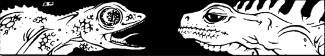
:::

### Lynx, Giant
*Source:* `AD&D 1E Conversion`  *Category:* `Animal`

| Armor Class | 13          | No. Appearing | 1d2 (1d4)  |
| Hit Dice    | 2+2        | Save As       | Fighter 2  |
| Move        | 120' (40') | Morale        | 8          |
| Attacks     | 2 claws / 1 bite | Treasure Type | Nil    |
| Damage      | 1d2 / 1d2 / 1d4 | Alignment | Neutral    |

Giant lynx are intelligent forest cats of cold regions. They climb well, swim reasonably, and leap up to 15'.

If a giant lynx hits with both forepaws, it rakes with its rear claws for `1d3` / `1d3` damage. Giant lynx hide so well they are 90% unlikely to be detected under normal conditions, surprise on 1-5 on `1d6`, and detect traps with 75% accuracy.

::: center
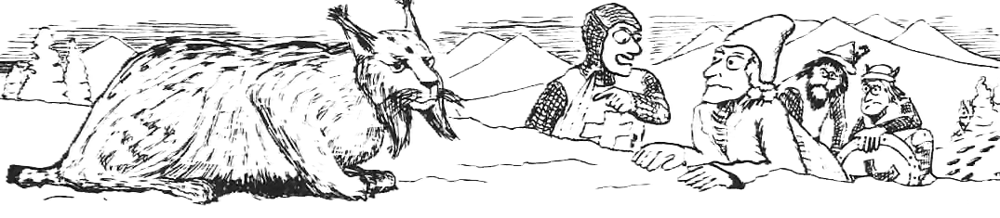
:::

### Masher
*Source:* `AD&D 1E Conversion`  *Category:* `Animal`

| Armor Class | 12          | No. Appearing | 1d4 (2d4)  |
| Hit Dice    | 8          | Save As       | Fighter 4  |
| Move        | 90' (30') swim | Morale    | 7          |
| Attacks     | 1 bite     | Treasure Type | Nil        |
| Damage      | 5d4        | Alignment     | Neutral    |

Mashers are slow, worm-like fish that crush and eat coral reefs. If surprised or threatened, they attack in self-defense.

A masher has 4, 6, or 8 long poisonous dorsal spines. Unless attacked from directly ahead or below, an attacker risks striking a spine and must Save vs. Poison or die.

### Mule
*Source:* `Basic`  *Category:* `Animal`

| Armor Class | 12                | No. Appearing | 1d8 (2d6)  |
| Hit Dice    | 2                | Save As       | Normal Man |
| Move        | 120' (40')       | Morale        | 8          |
| Attacks     | 1 kick or 1 bite | Treasure Type | Nil        |
| Damage      | 1d4 or 1d3       | Alignment     | Neutral    |

A mule is a crossbreed between a horse and a donkey. Mules are stubborn, and if bothered or excited they may either bite or kick. If the DM permits it, mules can be taken into dungeons. A mule can carry a normal load of 2000 coins (or 4000 coins at most, with its move reduced to 60'/turn). Mules cannot be trained to attack, but will fight in their own defense.

### Octopus, Giant
*Source:* `Expert`  *Category:* `Animal`

| Armor Class | 12                  | No. Appearing | 0 (1d2)   |
| Hit Dice    | 8                  | Save As       | Fighter 4 |
| Move        | 90' (30')          | Morale        | 7         |
| Attacks     | 8 tentacles/1 bite | Treasure Type | Nil       |
| Damage      | 1d3 (x8) / 1d6     | Alignment     | Neutral   |

Giant octopi lurk in the waters near fishing villages and other coastal areas in tropical or temperate climates.

In combat, a giant octopus will squeeze with its tentacles and stab or bite any creature dragged to its mouth with its fearsome beak.

Once a tentacle hits in combat, it will constrict and automatically do 1-3 points of damage each round. Each tentacle that hits also reduces its victim's chance to hit by 1 (a man with all of an octopus's tentacles wrapped around him would have a penalty of -8 on his "to hit" rolls). A character may try to sever a tentacle and will succeed when any single hit with an edged weapon does 6 or more points of damage.

If a combat is going against it, a giant octopus will flee, jetting away at triple speed and trailing a large, black cloud of ink (40' radius).

::: center
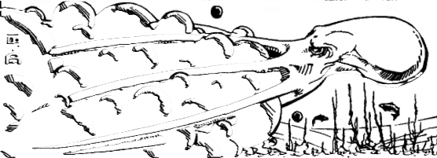
:::

### Otter, Giant
*Source:* `AD&D 1E Conversion`  *Category:* `Animal`

| Armor Class | 14          | No. Appearing | 1d4 (1d8)  |
| Hit Dice    | 5          | Save As       | Fighter 3  |
| Move        | 90' (30')  | Morale        | 7          |
| Swim        | 180' (60') | Treasure Type | Nil        |
| Attacks     | 1 bite     | Alignment     | Neutral    |
| Damage      | 2d6        |               |            |

Giant otters are playful but dangerous river and lake predators. They eat fish and shellfish, but defend their dens and young fiercely.

They are swift swimmers and may befriend kindly water folk if treated well.

### Owl, Giant
*Source:* `AD&D 1E Conversion`  *Category:* `Animal`

| Armor Class | 13          | No. Appearing | 1d2 (1d4)  |
| Hit Dice    | 4          | Save As       | Fighter 2  |
| Move        | 30' (10')  | Morale        | 8          |
| Fly         | 180' (60') | Treasure Type | Nil        |
| Attacks     | 2 claws / 1 bite | Alignment | Neutral    |
| Damage      | 1d6 / 1d6 / 2d4 |           |            |

Giant owls are intelligent nocturnal hunters of deep forests. They fly silently and surprise prey easily at night.

They may serve or ally with elves and other woodland folk. Giant owls speak their own language and can understand simple commands.

### Pike, Giant
*Source:* `AD&D 1E Conversion`  *Category:* `Animal`

| Armor Class | 14          | No. Appearing | 1d4 (2d4)  |
| Hit Dice    | 4          | Save As       | Fighter 2  |
| Move        | 300' (100') swim | Morale | 8          |
| Attacks     | 1 bite     | Treasure Type | Nil        |
| Damage      | 2d6        | Alignment     | Neutral    |

Giant pike are swift freshwater predators. They lurk among weeds and strike suddenly at fish, birds, and swimmers.

They are attracted by blood and splashing, but avoid obviously stronger aquatic monsters.

::: center
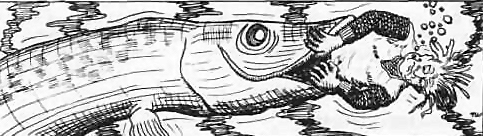
:::

### Porcupine, Giant
*Source:* `AD&D 1E Conversion`  *Category:* `Animal`

| Armor Class | 14          | No. Appearing | 1d4 (1d8)  |
| Hit Dice    | 6          | Save As       | Fighter 3  |
| Move        | 60' (20')  | Morale        | 7          |
| Attacks     | 1 bite or quills | Treasure Type | Nil |
| Damage      | 2d4 or 1d6 each | Alignment | Neutral |

Giant porcupines are shy herbivores that defend themselves with long quills. Predators striking them may be impaled.

When threatened, a giant porcupine lashes or backs into attackers. Creatures hitting it in melee risk `1d4` quill hits for `1d6` damage each.

### Ram, Giant
*Source:* `AD&D 1E Conversion`  *Category:* `Animal`

| Armor Class | 13          | No. Appearing | 1d6 (2d6)  |
| Hit Dice    | 4          | Save As       | Fighter 2  |
| Move        | 180' (60') | Morale        | 8          |
| Attacks     | 1 butt     | Treasure Type | Nil        |
| Damage      | 2d8        | Alignment     | Neutral    |

Giant rams live in hills and mountains. They are not normally aggressive, but males defend the flock to the death.

A charging ram deals double damage. A flock usually contains one ram, four ewes, and the rest lambs.

### Rat
*Source:* `Basic`  *Category:* `Animal`

|               | Normal          | Giant          |
|---------------|-----------------|----------------|
| Armor Class   | 10               | 12              |
| Hit Dice      | 1 hit point     | 1d4 hit points |
| Move          | 60' (20')       | 120' (40')     |
| Swimming      | 30' (10')       | 60' (20')      |
| Attacks       | 1 bite per pack | 1 bite each    |
| Damage        | 1d6 + disease   | 1d3 + disease  |
| No. Appearing | 5d10 (2d10)     | 3d6 (3d10)     |
| Save As       | Normal Man      | Fighter 1      |
| Morale        | 5               | 8              |
| Treasure Type | L               | C              |
| Alignment     | Neutral         | Neutral        |

Rats will eat almost anything and some rats carry diseases. Anyone bitten by a rat has a 1 in 20 chance of being infected, and that chance should be checked each time a rat successfully hits. The victim may still avoid the disease by making a saving throw vs. Poison. If the save is failed, roll `1d4`. On a 1 the victim dies in 1-6 days; otherwise the victim is sick in bed and unable to adventure for one month. The disease may be cured magically.

Rats usually avoid humans and will not attack unless summoned, by a wererat for example, or while defending their lair. Rats are good swimmers and may attack without penalty while in water. They are afraid of fire, and will run from it unless forced to fight by their leader, the creature summoning them.

Normal Rats: Normal rats may be from 6 inches to 2 feet long and have gray or brown fur. They attack in packs of 5 to 10. If there are more than 10 rats they will attack several creatures as packs of 10 or less. A pack will only attack one creature at a time, but may bite for 1-6 points of damage, plus the normal chance of disease checked once per pack attack. Rats will climb all over the creature they are attacking and the victim must save vs. Death or be knocked down by them and unable to fight until regaining its feet.

Giant Rats: Giant rats are 3 feet long or more, and have gray or black fur. They are often found in the dark corners of dungeon rooms and in areas where undead monsters lurk.

### Ray
*Source:* `AD&D 1E Conversion`  *Category:* `Animal`

|               | Manta Ray    | Pungi Ray    | Sting Ray   |
| ------------- | ------------ | ------------ | ----------- |
| Armor Class   | 13            | 12            | 11           |
| Hit Dice      | 8            | 4            | 1           |
| Save As       | Fighter 4    | Fighter 2    | Fighter 1   |
| Move          | 180' (60') swim | 120' (40') swim | 120' (40') swim |
| Attacks       | 1 bite / 1 tail | Spines      | 1 tail      |
| Damage        | Swallow / 2d10 | Poison      | 1d3 poison  |
| No. Appearing | 1 (1d3)      | 1d4 (1d4)    | 1d6 (2d6)   |
| Morale        | 8            | 6            | 6           |
| Treasure Type | C            | Nil          | Nil         |
| Alignment     | Neutral      | Neutral      | Neutral     |

Manta rays lie camouflaged on the sea floor and engulf prey in their huge mouths. Swallowed creatures die in 6 rounds unless they cut their way free. A manta's tail spine deals `2d10` damage and may stun unless a Save vs. Paralysis succeeds.

Pungi rays hide under sand with poisonous spines protruding like seaweed. A creature stepping or falling onto the spines must Save vs. Poison or die.

Sting rays are shallow-water bottom feeders that lash with poisonous tail spines when stepped on. A victim must Save vs. Poison or be paralyzed for `5d4` turns and take the same amount of additional damage.

### Rhinoceros
*Source:* `Expert`  *Category:* `Animal`

| Armor Class | 14               | No. Appearing | 0 (1d12)  |
| Hit Dice    | 6               | Save As       | Fighter 3 |
| Move        | 120' (40')      | Morale        | 6         |
| Attacks     | butt or trample | Treasure Type | Nil       |
| Damage      | 2d4 or 2d8      | Alignment     | Neutral   |

Though unintelligent plant eaters, rhinoceroses are extremely dangerous animals with fierce tempers and poor eyesight. Easily startled, they often react to unfamiliar sights or sounds with sudden violence.

If threatened, surprised, or charged, a rhinoceros will stampede in a random direction, goring anything in its path and inflicting double damage with its first successful attack.

### Sea Horse, Giant
*Source:* `AD&D 1E Conversion`  *Category:* `Animal`

| Armor Class | 12          | No. Appearing | 1d6 (2d6)  |
| Hit Dice    | 2          | Save As       | Fighter 1  |
| Move        | 210' (70') swim | Morale   | 6          |
| Attacks     | 1 butt     | Treasure Type | Nil        |
| Damage      | 1d4        | Alignment     | Neutral    |

Giant sea horses are shy marine mounts often used by mermen, nixies, and other aquatic folk, who prize them for their gentle temperament and graceful bearing. Bonded riders can guide them with light touches and soft signals, making them ideal for underwater messengers and scouts. They avoid combat unless trained, relying instead on speed and stealth to escape danger.

::: center
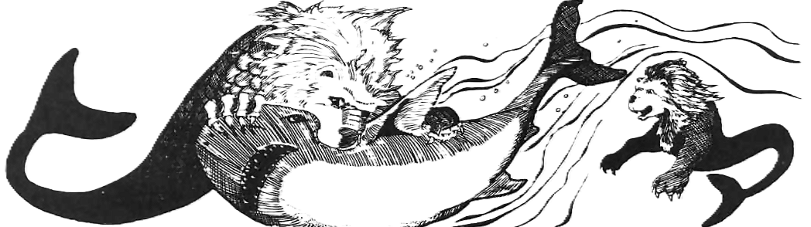
:::

### Shark
*Source:* `Expert`  *Category:* `Animal`

|               | Bull       | Mako       | Great White |
|---------------|------------|------------|-------------|
| Armor Class   | 15          | 15          | 15           |
| Hit Dice      | 2          | 4          | 8           |
| Move          | 180' (60') | 180' (60') | 180' (60')  |
| Attacks       | 1 bite     | 1 bite     | 1 bite      |
| Damage        | 2d4        | 2d6        | 2d10        |
| No. Appearing | 0 (3d6)    | 0 (2d6)    | 0 (1d4)     |
| Save As       | Fighter 1  | Fighter 2  | Fighter 4   |
| Morale        | 7          | 7          | 7           |
| Treasure Type | Nil        | Nil        | Nil         |
| Alignment     | Neutral    | Neutral    | Neutral     |

Sharks are vicious predators. They have little intelligence and are unpredictable. They are attracted to the scent of blood within 300', and it will drive them into a feeding frenzy, no morale checks required. They attack by making long, curving passes. Sharks are found in salt water.

Bull sharks are 8' long and brown in color. Bull sharks will ram their prey first to stun it, and then attack the helpless prey the next round.

Mako sharks are 15' long and blue-gray or tan in color. Mako sharks are extremely unpredictable, ignoring swimmers one moment and then, for no apparent reason, attacking.

Great white sharks are 30' long or larger and gray with a white underside. They have been known to destroy small boats.

::: center
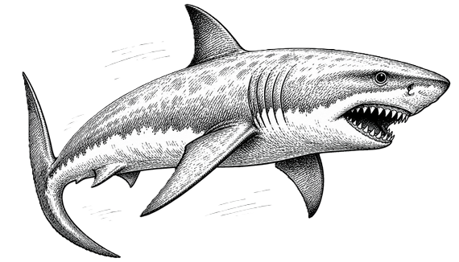
:::

### Shrew, Giant
*Source:* `Basic`  *Category:* `Animal`

| Armor Class | 15          | No. Appearing | 1d4 (1d8) |
| Hit Dice    | 1          | Save As       | Fighter 1 |
| Move        | 180' (60') | Morale        | 10        |
| Attacks     | 2 bites    | Treasure Type | Nil       |
| Damage      | 1d6 / 1d6  | Alignment     | Neutral   |

Giant shrews look like brown-furred rats with long snouts. They can burrow, climb, or jump (up to 5'). They are insectivorous and hunt insects, their main source of food. The eyes of giant shrews are so weak that the creatures are almost blind. They are not affected by light or the lack of it. Like bats, they use very high squeaks to "see" areas and things, and can listen to the echoes so closely that they may "see" things up to 60' away underground as well as a creature with normal sight. A silence 15' radius spell will "blind" a giant shrew. If it cannot hear, it will be confused, and then has an Armor Class of 11 and a penalty of -4 on "to hit" rolls.

Giant shrews do not like large open areas, and remain underground most of the time.

Giant shrews often choose one area to hunt in, and will fight to defend "their" area from other animals (including humans). They are very ferocious and will attack anything. Giant shrews are very quick and will always have initiative on their first attack; in addition they will gain + 1 on their initiative roll for their second attack.

Their attack is so ferocious (attacking the head and shoulders of the defender) that when they attack any creature of 3 hit dice (3^rd^ level) or less, the victim must save vs. Death or run away in fear.

### Skunk, Giant
*Source:* `AD&D 1E Conversion`  *Category:* `Animal`

| Armor Class | 12          | No. Appearing | 1d2 (1d4)  |
| Hit Dice    | 5          | Save As       | Fighter 3  |
| Move        | 120' (40') | Morale        | 6          |
| Attacks     | 1 bite or musk | Treasure Type | Nil    |
| Damage      | 1d6 or special | Alignment | Neutral   |

Giant skunks are shy but dangerous animals. If threatened, they spray a foul musk in a cone behind them.

Creatures struck by musk must Save vs. Poison or be blinded and nauseated for `1d6` turns. The odor clings for days unless washed with strong substances or removed by magic.

::: twocolumn-pdf-end
:::

### Snake
*Source:* `Basic`  *Category:* `Animal`

|               | Spitting Cobra   | Pit Viper    | Sea Snake  | Giant Rattler | Rock Python        |
|---------------|------------------|--------------|------------|---------------|--------------------|
| Armor Class   | 12                | 13            | 13          | 14             | 13                  |
| Hit Dice      | 1*               | 2*           | 3*         | 4*            | 5*                 |
| Move          | 90' (30')        | 90' (30')    | 90' (30')  | 120' (40')    | 90' (30')          |
| Attacks       | 1 bite or 1 spit | 1 bite       | 1 bite     | 2 bites       | 1 bite / 1 squeeze |
| Damage        | 1d3 + poison     | 1d4 + poison | 1 + poison | 1d4 + poison  | 1d4 / 2d4          |
| No. Appearing | 1d6 (1d6)        | 1d8 (1d8)    | 1d8 (1d8)  | 1d4 (1d4)     | 1d3 (1d3)          | 
| Save As       | Fighter 1        | Fighter 1    | Fighter 2  | Fighter 2     | Fighter 3          |
| Morale        | 7                | 7            | 7          | 8             | 8                  |
| Treasure Type | Nil              | Nil          | Nil        | U             | U                  |
| Alignment     | Neutral          | Neutral      | Neutral    | Neutral       | Neutral            |

::: twocolumn-pdf-begin
:::

Snakes are found almost everywhere except for very hot or very cold places. Most snakes do not usually attack unless surprised or threatened. Many (but not all) snakes have poisonous bites.  They average 6' long (for every 3 hit dice) in size, but can be much larger if the DM desires. 

**Spitting Cobra**: A spitting cobra is a 3' long grayish-white snake which can squirt a stream of venom up to a distance of 6 feet. It aims for its victim's eyes. If the spit hits, the victim must save vs. Poison or be blinded. (This blindness can normally only be removed by a cure blindness spell from the D&D EXPERT rules, but the DM may wish to invent other ways — such as eating a shrieker.) As with most small poisonous snakes, a spitting cobra will not attack human-sized or larger opponents unless startled or threatened. It can either spit or bite in one round, but not both. It will usually spit. The damage given (1-3 points) only applies to the bite; in this case, the victim must save vs. Poison or die in 1- 10 (`1d10`) turns.

**Pit Viper**: A pit viper is a 5' long greenish-gray poisonous snake with small pits in its head. These pits act as heat sensors, with a range of 60'. The combination of pits and infravision makes it very hard to fight a pit viper; it is so quick that it always gains the initiative (no roll needed). Any victim bitten by a pit viper must save vs. Poison or die.

**Sea Snake**: Sea snakes are snakes adapted for living in the sea.  They must come to the surface of the water to breathe once an hour. Their bite is little more than a pinprick, and will go unnoticed 50% of the time. The victim must save vs. Poison, and the poison is slow-acting; its full effects take `1d4 + 2` turns to be felt if the saving throw is failed. (By the time this is felt, there is a 25% chance that not even a neutralize poison spell can save the victim.) Unlike other snakes, sea snakes will attack humans for food.

**Giant Rattlesnake**: A giant rattlesnake is a 10' long snake with brown and white scales set in a diamond pattern. On its tail is a dried, scaly rattle, which it often rattles to warn off intruders or attackers who are too large to eat. Despite this warning, a rattlesnake that is hungry or feels cornered will strike without hesitation. Giant rattlesnakes are meat-eaters and their bite is poisonous (save vs. Poison or die in `1d6` turns.) They are very fast and may attack a second time at the end of every round.

**Rock Python**: A rock python is a 20' long giant snake with brown and yellow scales set in a spiral pattern. Its first attack is a bite. If the bite is successful, a rock python will coil around the victim and constrict in the same round. This squeezing does `2d4` points of damage per round, and begins automatically once the bite hits.  A victim cannot break free of the coils without outside help unless they overcome the snake's considerable strength.

::: center
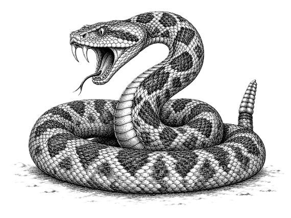
:::

### Squid, Giant
*Source:* `Expert`  *Category:* `Animal`

| Armor Class | 12                    | No. Appearing | 0 (1d4)   |
| Hit Dice    | 6                    | Save As       | Fighter 3 |
| Move        | 120' (40')           | Morale        | 7 (9)     |
| Attacks     | 8 tentacles / 1 bite | Treasure Type | V         |
| Damage      | 1d4x8 / 1d10 beak    | Alignment     | Neutral   |

A giant squid dwells only in the deep sea, rising to the surface only to hunt. A giant squid will sometimes, 25%, wrap its two long tentacles about a boat and squeeze, doing 1-10 points of damage to the boat's hull, while the beak does 2 points per round after the tentacles grapple. Giant squids often, 75%, attempt to snatch seamen from the decks of passing ships and pull them to their lair below to be devoured.

The lesser tentacles do constriction damage after they hit. They can be severed with a single blow that does 6 or more points, while the greater tentacles can be severed with a blow that causes 10 or more points of damage.

If its morale fails, the squid can flee at triple speed and will leave great clouds of ink, 30' radius, twice per day maximum, to confuse pursuers. A large giant squid can even be double or triple normal size.

::: center
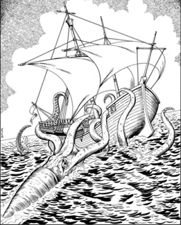
:::

::: columnbreak-pdf
:::

### Stag
*Source:* `AD&D 1E Conversion`  *Category:* `Animal`

| Armor Class | 12          | No. Appearing | 0 (2d6)    |
| Hit Dice    | 3          | Save As       | Fighter 2  |
| Move        | 240' (80') | Morale        | 6          |
| Attacks     | 1 antlers  | Treasure Type | Nil        |
| Damage      | 1d6        | Alignment     | Neutral    |

Stags are swift herd animals. They flee most danger, but males fight during rutting season or when cornered.

Their antlers can gore or batter attackers, and a herd may stampede if panicked.

### Tiger
*Source:* `AD&D 1E Conversion`  *Category:* `Animal`

| Armor Class | 13          | No. Appearing | 1d2 (1d3)  |
| Hit Dice    | 5+5        | Save As       | Fighter 3  |
| Move        | 150' (50') | Morale        | 9          |
| Attacks     | 2 claws / 1 bite | Treasure Type | Nil |
| Damage      | 1d4 / 1d4 / 2d6 | Alignment | Neutral |

Tigers are powerful solitary cats of jungles and forests. They stalk prey silently and spring from cover.

If a tiger hits with both claws, it may rake with its rear claws for `1d6` / `1d6` damage.

### Toad, Giant
*Source:* `Expert`  *Category:* `Animal`

| Armor Class | 12         | No. Appearing | 1d4 (1d4) |
| Hit Dice    | 2 + 2     | Save As       | Fighter 1 |
| Move        | 90' (30') | Morale        | 6         |
| Attacks     | 1 bite    | Treasure Type | Nil       |
| Damage      | 1d4+1     | Alignment     | Neutral   |

A giant toad is about the size of a very large dog and weighs 150-250 pounds. These toads can change their skin color to blend into woods or poorly lit dungeons, thus surprising their prey on a roll of 1-3. They can shoot their tongues out to 15' and drag dwarf-sized or smaller victims to their mouths to be bitten. On a "to hit" roll of 20, small prey will be swallowed whole, taking 1-6 points of damage each round thereafter.

::: columnbreak-pdf
:::

### Turtle, Giant
*Source:* `AD&D 1E Conversion`  *Category:* `Animal`

|               | Giant Sea Turtle | Giant Snapping Turtle |
| ------------- | ---------------- | --------------------- |
| Armor Class   | 17                | 19                     |
| Hit Dice      | 15               | 10                    |
| Save As       | Fighter 8        | Fighter 5             |
| Move          | 30' (10')        | 30' (10')             |
| Swim          | 150' (50')       | 90' (30')             |
| Attacks       | 1 bite           | 1 bite                |
| Damage        | 4d6              | 6d4                   |
| No. Appearing | 1 (1d4)          | 1 (1d2)               |
| Morale        | 7                | 9                     |
| Treasure Type | Nil              | Nil                   |
| Alignment     | Neutral          | Neutral               |

Giant turtles are massive reptiles of seas, lakes, and rivers. Most are placid unless threatened, but snapping turtles are aggressive ambush predators.

Their shells are extremely hard, and they may withdraw to improve their defenses at the cost of attacking.

### Weasel, Giant
*Source:* `Expert`  *Category:* `Animal`

| Armor Class | 12                 | No. Appearing | 1d4 (1d6) |
| Hit Dice    | 4 + 4             | Save As       | Fighter 3 |
| Move        | 150' (50')        | Morale        | 8         |
| Attacks     | 1 bite + special  | Treasure Type | V         |
| Damage      | 2d4               | Alignment     | Neutral   |

A giant weasel is 8'-9' long and covered with richly colored fur of white, gold, or brown. These quick, vicious predators hunt singly or in groups. Once they bite, they hold on and suck blood, doing 2-8 points of damage each round until their prey dies or the weasel is killed.

Giant weasels have infravision to 30' and can track by scent. They prefer wounded prey and lair in underground tunnels, where treasure is often found on the bodies of creatures they have dragged back to eat.

::: columnbreak-pdf
:::

### Whale
*Source:* `Expert`  *Category:* `Animal`

|               | Killer Whale    | Narwhal         | Sperm Whale |
|---------------|-----------------|-----------------|-------------|
| Armor Class   | 13               | 12               | 13           |
| Hit Dice      | 6               | 12              | 36          |
| Move          | 240'            | 180'            | 180'        |
| Attacks       | 1 bite          | 1 horn / 1 bite | 1 bite      |
| Damage        | 1d20            | 2d6 / 1d8       | 3d20        |
| No. Appearing | 0 (1d6)         | 0 (1d4)         | 0 (1d3)     |
| Save As       | Fighter 3       | Fighter 12      | Fighter 15  |
| Morale        | 10              | 8               | 7           |
| Treasure Type | V               | See below       | V           |
| Alignment     | Neutral         | Lawful          | Neutral     |

Killer whale. These are 25' long and are found mainly in cold waters. They live by hunting other sea creatures (even other whales). Creatures of halfling size or smaller will be swallowed whole if the killer whale scores a 20 on its "to hit" roll. Those swallowed take `1d6` points of damage per round and will drown in 10 rounds unless freed.

Narwhal. The narwhal is 15' long, grey to white in color, and has an 8' long spiral horn on its head (like that of a unicorn). It is an intelligent, magical creature, very independent and secretive. It is rumored that their horns vibrate in the presence of evil. Their horns are worth from 1,000 to 6,000 gold pieces each (`1d6` x 1000) for their ivory. Narwhals roam arctic waters.

Sperm whale. This huge whale can grow to be 60' long. It preys on the most feared denizens of the deep (such as the giant squid).

Man-sized or smaller creatures will be swallowed on a die roll that is 4 or more than the score needed to hit, taking `3d6` points of damage per round. Sperm whales will sometimes (10% chance) attack ships, attempting to ram. Should the sperm whale succeed, it will do `6d6` points of damage to the ship.

::: center
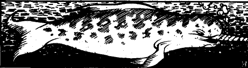
:::

::: columnbreak-pdf
:::

### Wolf
*Source:* `Basic`  *Category:* `Animal`

|               | Normal Wolf | Dire Wolf  |
|---------------|-------------|------------|
| Armor Class   | 12           | 13          |
| Hit Dice      | 2 + 2       | 4 + 1      |
| Move          | 180' (60')  | 150' (50') |
| Attacks       | 1 bite      | 1 bite     |
| Damage        | 1d6         | 2d4        |
| No. Appearing | 2d6 (3d6)   | 1d4 (2d4)  |
| Save As       | Fighter 1   | Fighter 2  |
| Morale        | 8 (6)       | 8          |
| Treasure Type | Nil         | Nil        |
| Alignment     | Neutral     | Neutral    |

**Wolves**: are meat-eaters and hunt in packs. Though wolves prefer the wilderness, they will occasionally be found in caves. Captured wolf cubs can be trained like dogs, if the DM permits, but it is difficult. If 3 wolves or fewer are encountered, or if a pack is reduced to less than 50% of its original numbers, their morale is 6 rather than 8.

**Dire wolves**: may be found in caves, woods, or mountains. They are larger and more ferocious than normal wolves, and are semi-intelligent. They are fierce enemies and usually hunt in packs. They are sometimes trained by goblins to be used as mounts. Captured dire wolf cubs can be trained like dogs, if the DM permits, but they are even more savage than normal wolves.

::: center
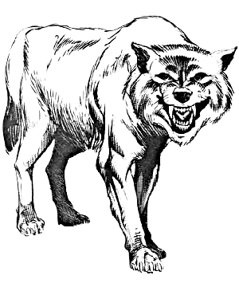
:::

::: columnbreak-pdf
:::

### Wolverine
*Source:* `AD&D 1E Conversion`  *Category:* `Animal`

| Armor Class | 14          | No. Appearing | 1d2 (1d4)  |
| Hit Dice    | 3          | Save As       | Fighter 2  |
| Move        | 120' (40') | Morale        | 10         |
| Attacks     | 2 claws / 1 bite | Treasure Type | Nil |
| Damage      | 1d4 / 1d4 / 1d6 | Alignment | Neutral |

Wolverines are fearless, savage mustelids of cold forests. They defend food and territory with extraordinary ferocity.

If wounded, a wolverine fights with berserk fury and gains +2 to damage.

::: pagebreak-pdf
:::

## Constructs

Most constructs are immune to **sleep**, **charm**, **hold**, and other mind-affecting magic. They do not eat, sleep, breathe, or feel pain, and often fight until completely destroyed. Depending on the materials and enchantments used in their creation, constructs may possess unusual immunities or weaknesses.  Constructs are commonly used as guardians for tombs, temples, treasure vaults, laboratories, and the hidden strongholds of powerful wizards. Their construction can take months or years, making them a rare and valuable investment for those who commission them.

### Animated Armor
*Source:* `Homebrew`  *Category:* `Construct`

| Armor Class | 17         | No. Appearing | 1d6        |
| Hit Dice    | 3         | Save As       | Fighter 2  |
| Move        | 60' (20') | Morale        | 12         |
| Attacks     | 1 weapon  | Treasure Type | Nil        |
| Damage      | By weapon | Alignment     | Neutral    |

Animated armor appears as an empty suit of armor brought to life through enchantment, bound spirits, or ancient curses. 

Animated armor usually remains perfectly motionless until intruders approach, causing many victims to mistake it for an ordinary display or decoration. Once awakened, it attacks tirelessly and without fear, obeying its orders until destroyed.

Most animated armor fights with weapons held in mailed hands, though some punch, grapple, or batter foes with heavy gauntlets. They are immune to **sleep**, **charm**, and other mind-affecting magic, and never need rest.

::: center
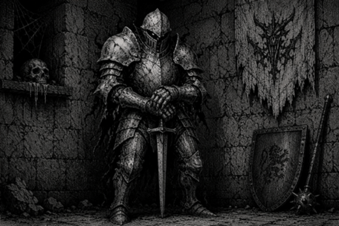
:::

### Gargoyle*
*Source:* `Basic`  *Category:* `Construct`

| Armor Class | 14                 | No. Appearing | 1d6 (2d4) |
| Hit Dice    | 4                 | Save As       | Fighter 8 |
| Move        | 90' (30')         | Morale        | 11        |
| Flying      | 150' (50')        | Treasure Type | C         |
| Attacks     | 2 claws/bite/horn | Alignment     | Chaotic   |
| Damage      | 1d3 / 1d3 / 1d6 / 1d4 |           |           |

Gargoyles are winged, horned, clawed creatures resembling the grotesque stone figures found on ancient temples, castles, and cathedrals. Their hides often look exactly like weathered stone, allowing them to remain perfectly motionless and be mistaken for ordinary statues until they suddenly spring to life.

Gargoyles are magical creatures and save as 8^th^ level Fighters. They can only be harmed by magical attacks or magic weapons. Though cruel and vicious, gargoyles are cunning and semi-intelligent, delighting in ambushes and terrorizing weaker creatures. They will attack nearly anything approaching their territory.

Gargoyles are immune to **sleep** and **charm** spells. Because ordinary weapons cannot harm them, the DM should use gargoyles with care unless the adventurers possess at least one magical weapon.

::: center
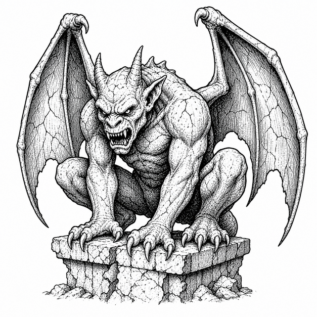
:::

::: twocolumn-pdf-end
:::

### Golem*
*Source:* `Expert`  *Category:* `Construct`

|               | Wood       | Bone       | Flesh      | Amber            | Clay        | Bronze           |
|---------------|------------|------------|------------|------------------|-------------|------------------|
| Armor Class   | 12          | 17          | 10          | 13                | 12           | 19                |
| Hit Dice      | 2 + 2      | 8          | 8*         | 10**             | 11*         | 20**             |
| Move          | 120' (40') | 120' (40') | 90' (30')  | 180' (60')       | 60' (20')   | 240' (80')       |
| Attacks       | 1 fist     | 4 weapons  | 2 fists    | 2 claws / 1 bite | 1 fist      | 1 fist + special |
| Damage        | 1-8        | By weapon  | 2d8 / 2d8  | 2d6 / 2d6 / 2d10 | 3d10        | 3d10 + special   |
| No. Appearing | 1 (1)      | 1 (1)      | 1 (1)      | 1 (1)            | 1 (1)       | 1 (1)            |
| Save As       | Fighter 1  | Fighter 4  | Fighter 4  | Fighter 5        | Fighter 6   | Fighter 10       |
| Morale        | 12         | 12         | 12         | 12               | 12          | 12               |
| Treasure Type | Nil        | Nil        | Nil        | Nil              | Nil         | Nil              |
| Alignment     | Neutral    | Neutral    | Neutral    | Neutral          | Neutral     | Neutral          |

::: twocolumn-pdf-begin
:::

A golem is a powerful monster, created and animated by a high-level magic-user or cleric. They can be made of almost any material, but the ones listed are typical. The DM should feel free to create other golems with any special powers desired.

Normally golems can only be hit by magic weapons. Golems are also immune to **sleep**, **charm**, and **hold** spells, as well as all forms of gases. Creating a golem is costly, time consuming, and beyond the power of player characters in the D&D Expert rules.

- **Wood golems** are crude manlike figures about 3' tall, hacked from wood. They move stiffly and have a penalty of -1 on initiative rolls. They burn easily, saving at -2 and suffering one extra point of damage per die from fire-based attacks.

- **Bone golems** are 6' tall creatures made from the bones of dead men bound together into a manlike form. They wield weapons from skeletal arms fastened to their bodies at various points. Either four one-handed weapons or two pole arms may be used by a bone golem, and it will attack up to two enemies per round. Bone golems are immune to fire, cold, and electrical attacks.

- **Flesh golems** are grim, man-shaped figures nearly 8' tall, stitched together from the corpses of the dead and animated by lightning. Struck by fire, a flesh golem flies into a berserk rage and attacks the nearest creature, friend or foe, for `2d4` rounds. Struck by lightning, it is merely stunned for `1d4` rounds rather than harmed.

- **Amber golems** resemble giant lions or tigers. They are faultless trackers and can detect invisible creatures within 60'.

- **Clay golems** are man-shaped figures of wet clay nearly 8' tall, animated by a curse-bound spirit sealed within. Their fists leave wounds that fester and resist normal healing, curable only by a *cure serious wounds* spell or greater. If reduced to half its hit points or fewer, a clay golem goes berserk and attacks the nearest creature, friend or foe, until destroyed.

- **Bronze golems** look somewhat like fire giants. Their skin is bronze and their blood is liquid fire. Any creature hit by a bronze golem takes `1d10` more points of damage from the great heat inside it. Anyone scoring damage on a bronze golem with an edged weapon must save vs. Death Ray or take `2d6` points of damage from the fiery blood spurting out of the wound. Bronze golems are not affected by fire-based attacks.

::: center
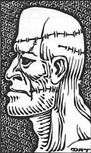
:::

### Homunculus
*Source:* `AD&D 1E Conversion`  *Category:* `Construct`

| Armor Class | 13          | No. Appearing | 1 (1)     |
| Hit Dice    | 2          | Save As       | Fighter 2 |
| Move        | 60' (20')  | Morale        | 11        |
| Fly         | 180' (60') | Treasure Type | Nil       |
| Attacks     | 1 bite     | Alignment     | Neutral   |
| Damage      | 1d3 sleep  |               |           |

A homunculus is a small magical servant created from its master's blood and arcane materials. It is linked to its creator and obeys silently.

A creature bitten by a homunculus must Save vs. Poison or sleep for `5d6` minutes. If the homunculus is slain, its master suffers `2d10` damage. If the master dies, the homunculus also dies.

::: center
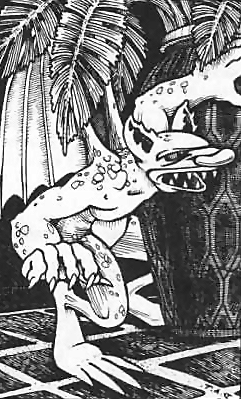
:::

::: columnbreak-pdf
:::

### Living Statue
*Source:* `Basic`  *Category:* `Construct`

|               | Crystal   | Iron                | Rock      |
|---------------|-----------|---------------------|-----------|
| Armor Class   | 15         | 17                   | 15         |
| Hit Dice      | 3         | 4                   | 5*        |
| Move          | 90' (30') | 30' (10')           | 60' (20') |
| Attacks       | 2 blows   | 2 blows + special   | 2 blows   |
| Damage        | 1d6 / 1d6 | 1d8 / 1d8 + special | 2d6 / 2d6 |
| No. Appearing | 1d6 (1d6) | 1d4 (1d4)           | 1d3 (1d3) |
| Save As       | Fighter 3 | Fighter 4           | Fighter 5 |
| Morale        | 11        | 11                  | 11        |
| Treasure Type | Nil       | Nil                 | Nil       |
| Alignment     | Lawful    | Neutral             | Chaotic   |

A living statue is an enchanted animated creature made by a powerful wizard. It appears to be a perfectly normal statue until it begins to move. A living statue may be of any size or material. Living crystal, iron, and rock statues are three types of living statues which serve as examples, should a DM wish to make up his or her own types. Living statues are not affected by **sleep** spells.

- **Crystal**: Living crystal statues are life forms made of crystals instead of flesh. They can look like a statue of anything, but often appear human.

- **Iron**: Living iron statues have bodies which can absorb iron and steel. When hit, they will take normal damage, but if a non-magical metal weapon is used, the attacker must save vs. Spells or the weapon will become stuck in the body of the living iron statue, and may only be removed if the statue is killed.

- **Rock**: Living rock statues have an outer crust of stone but are filled with hot magma (fiery lava). When the living rock statue attacks, it will squirt the magma from its finger tips for `2d6` points of damage per hit.

::: pagebreak-pdf
:::

## Demons

Demons are chaotic evil beings from the Abyss who never willingly serve and always seek to destroy or corrupt those who bind them. The smarter and stronger dominate the weak. Lesser demons attack without question and fight to the death. No demon can be subdued, and they never willingly serve. If forced into service, they constantly seek to slay their captor. Demons that take a liking to someone typically carry them off as a (favored) slave. Demons may divide attacks among multiple opponents if their attack forms allow.

Demons move freely between their home plane, Tarterus, Hades, Pandemonium, and the astral plane, but cannot enter the material plane without aid such as conjuration or gate magic.

Demons can be summoned by any alignment, but control is another matter—a **thaumaturgic circle** holds out types I–V; a **pentacle** is needed for type VI or greater. The DM should carefully weigh whatever threat or reward is used to secure a demon's service. Holy relics and artifacts repel demons.

Demons roam the astral and ethereal planes and are drawn to beings caught in an ethereal state. Speaking a powerful demon's true name there carries a 5% base chance of drawing its attention—and, absent control or preparation, an attempt to kill the speaker.  Types V and greater aren't permanently destroyed when slain outside their home plane—they're banished there for a century and a day unless another demon aids their return. On their home plane, they can be slain normally.

Demons (types I–VI) encountered in their lair appear in groups: 75% chance of `1d6` of the same type, 25% chance of `1d6` mixed types I–VI.

**Demons' Amulets:** Demon lords and princes store their vital essence—their soul—in a small, undetectable amulet that looks ordinary. Amulet-bearers can use **magic jar** once per day. Lesser demons keep their amulet close; the mightiest princes don't bother.  Possessing an amulet grants temporary power over its demon, usually for one adventure or 24 hours, after which the amulet must be returned or destroyed, banishing the demon prince for a year. This is dangerous: holding an amulet doubles the chance of attracting another demon's attention, any uncontrolled demon attacks the holder on sight, and losing the amulet mid-command turns the demon on its former master.

**Common traits:** 

- all have infravision
- error-free teleportation
- darkness (radius varies)
- gate (specifics vary)
- understand all intelligent communication telepathically
- those of average+ intelligence can converse normally
- types I–II are hurt by non-magical weapons, III+ are not
- full damage from acid, iron, magic missile, and poison
- half damage from cold, electricity, fire, and gas
- silver weapons count as non-magical

Named demon lords Demogorgon, Juiblex, Orcus, Yeenoghu etc. are unique, campaign-level threats; review their individual entries before play. See [Appendix A: Legendary Creatures](#appendix-a-legendary-creatures).

::: twocolumn-pdf-end
:::

::: center
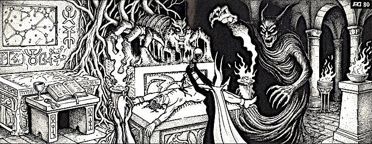
:::

::: twocolumn-pdf-begin
:::

::: pagebreak-pdf
:::


### Larva
*Source:* `AD&D 1E Conversion`  *Category:* `Demon`

| Armor Class | 12          | No. Appearing | 2d6 (10d10) |
| Hit Dice    | 1          | Save As       | Fighter 1  |
| Move        | 60' (20')  | Morale        | 5          |
| Attacks     | 1 bite     | Treasure Type | Nil        |
| Damage      | 1d4        | Alignment     | Chaotic    |

Larvae are wretched souls of the lower planes, appearing as worm-like bodies with human heads. They are weak, spiteful, and preyed upon by greater fiends.

Larvae are often traded or consumed by demons and night hags. They attack living creatures only in desperate hunger or when driven.

::: center
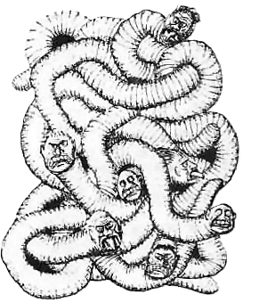
:::

### Manes
*Source:* `AD&D 1E Conversion`  *Category:* `Demon`

| Armor Class | 12                | No. Appearing | 2d4 (4d4) |
| Hit Dice    | 1**              | Save As       | Fighter 1 |
| Move        | 30' (10')        | Morale        | 12        |
| Attacks     | 2 claws / 1 bite | Treasure Type | Nil       |
| Damage      | 1d2 / 1d2 / 1d4  | Alignment     | Chaotic   |

Manes are the least demons, formed from chaotic evil dead. If slain away from the Abyss, they dissolve into foul vapor and reform in one day unless destroyed by a demon lord or similar power. They are treated as undead against **sleep**, **charm**, and similar spells.

::: center
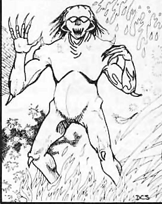
:::

### Succubus
*Source:* `AD&D 1E Conversion`  *Category:* `Demon`

| Armor Class | 19            | No. Appearing | 1 (1)     |
| Hit Dice    | 6**          | Save As       | Fighter 6 |
| Move        | 120' (40')   | Morale        | 9         |
| Fly         | 180' (60')   | Treasure Type | I, Q      |
| Attacks     | 2 claws      | Alignment     | Chaotic   |
| Damage      | 1d3 / 1d3    |               |           |

Succubi are solitary tempters that appear as beautiful humanoids with bat-like wings. Their kiss drains one energy level. At will, a succubus may **become ethereal**, **charm person**, use **ESP**, use **clairaudience**, **suggest**, assume a humanoid form, or attempt to **gate** a stronger demon. Though they can usually overpower a victim through raw seduction alone, a succubus prefers patience and manipulation, savoring the slow unraveling of willpower over a single reckless strike.

::: center
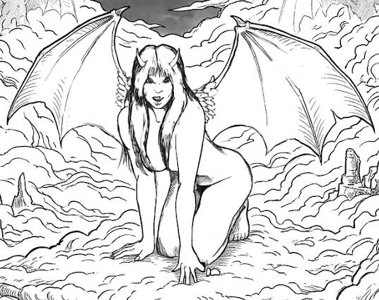
:::

### Type I Demon (Vrock)
*Source:* `AD&D 1E Conversion`  *Category:* `Demon`

| Armor Class | 19                            | No. Appearing | 1d3 (1d6) |
| Hit Dice    | 8**                          | Save As       | Fighter 8 |
| Move        | 120' (40')                   | Morale        | 10        |
| Fly         | 180' (60')                   | Treasure Type | B         |
| Attacks     | 2 claws / 2 talons / 1 bite  | Alignment     | Chaotic   |
| Damage      | 1d4 / 1d4 / 1d8 / 1d8 / 1d6  |               |           |

Type I demons, or vrocks, resemble a human-vulture hybrid. They love human flesh and treasure. They can **detect invisible**, use **telekinesis** up to 2,000 cn, and attempt to **gate** another Type I demon.

::: center
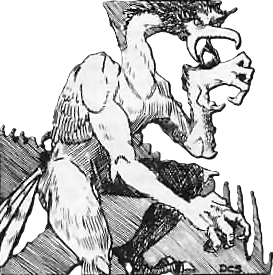
:::

### Type II Demon (Hezrou)
*Source:* `AD&D 1E Conversion`  *Category:* `Demon`

| Armor Class | 21               | No. Appearing | 1d3 (1d6) |
| Hit Dice    | 9**              | Save As       | Fighter 9 |
| Move        | 60' (20')        | Morale        | 10        |
| Swim        | 120' (40')       | Treasure Type | C         |
| Attacks     | 2 claws / 1 bite | Alignment     | Chaotic   |
| Damage      | 1d3 / 1d3 / 4d4  |               |           |

Type II demons, or hezrou, are toad-like brutes that can be harmed by normal weapons. Their bloated, warty hides ooze a rank, sulfurous slime that lingers in the air long after they've moved on. They can **cause fear**, **levitate**, **detect invisible**, use **telekinesis** up to 3,000 cn, and attempt to **gate** another Type II demon.

::: center
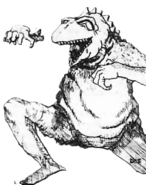
:::

### Type III Demon (Glabrezu)*
*Source:* `AD&D 1E Conversion`  *Category:* `Demon`

| Armor Class | 23                            | No. Appearing | 1d3 (1d6) |
| Hit Dice    | 10**                          | Save As       | Fighter 10 |
| Move        | 90' (30')                     | Morale        | 10        |
| Attacks     | 2 pincers / 2 claws / 1 bite  | Treasure Type | D         |
| Damage      | 2d6 / 2d6 / 1d3 / 1d3 / 1d4+1 | Alignment     | Chaotic   |

Type III demons, or glabrezu, are tall, wrinkled horrors with pincers and a small pair of human arms. Beneath their monstrous bulk lurks a cunning deceiver, and a glabrezu will often offer wishes or bargains to mortals, only to revel in the ruin those pacts bring.  They can **cause fear**, **levitate**, **create pyrotechnics**, **polymorph self**, use **telekinesis** up to 4,000 cn, and attempt to **gate** Type I-III demons.

::: center
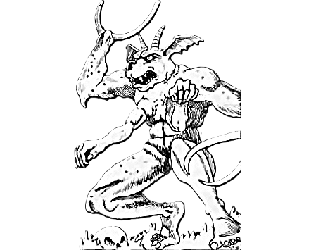
:::

### Type IV Demon (Nalfeshnee)*
*Source:* `AD&D 1E Conversion`  *Category:* `Demon`

| Armor Class | 20               | No. Appearing | 1d3 (1d6)  |
| Hit Dice    | 11**             | Save As       | Fighter 11 |
| Move        | 90' (30')        | Morale        | 10         |
| Fly         | 120' (40')       | Treasure Type | E          |
| Attacks     | 2 claws / 1 bite | Alignment     | Chaotic    |
| Damage      | 1d4 / 1d4 / 2d4  |               |            |

Type IV demons, or nalfeshnee, combine the worst features of ape and boar. They can **create illusions**, **cause fear**, **levitate**, **detect magic**, **read languages**, **dispel magic**, **polymorph self**, use **telekinesis** up to 5,000 cn, **project an image**, use **symbols of fear or discord**, and attempt to **gate** Type I-IV demons.

::: center
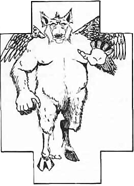
:::

### Type V Demon (Marilith)*
*Source:* `AD&D 1E Conversion`  *Category:* `Demon`

| Armor Class | 26/24                    | No. Appearing | 1d3 (1d6) |
| Hit Dice    | 7+7**                    | Save As       | Fighter 8 |
| Move        | 120' (40')               | Morale        | 10        |
| Attacks     | 6 weapons / 1 constrict  | Treasure Type | G         |
| Damage      | By weapon / 2d8          | Alignment     | Chaotic   |

Type V demons, or mariliths, have a six-armed female torso and the body of a great serpent. They fight with six weapons and constrict with their tails. They can **charm person**, **levitate**, **read languages**, **detect invisible**, **create pyrotechnics**, **polymorph self**, **project an image**, and attempt to **gate** nearly any demon.

::: center
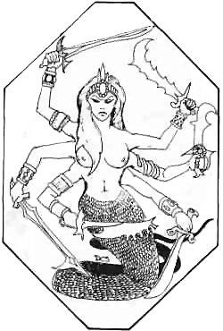
:::

### Type VI Demon (Balor)*
*Source:* `AD&D 1E Conversion`  *Category:* `Demon`

| Armor Class | 21                     | No. Appearing | 1d3 (1d6) |
| Hit Dice    | 8+8**                  | Save As       | Fighter 9 |
| Move        | 60' (20')              | Morale        | 11        |
| Fly         | 150' (50')             | Treasure Type | F         |
| Attacks     | 1 sword or whip        | Alignment     | Chaotic   |
| Damage      | 2d6+1 or special       |               |           |

Type VI demons, or balors, are mighty named demons who favor a sword and a many-tailed whip. In combat there is a 1-4 on `1d6` chance each round that a balor surrounds itself with flame and uses its whip to drag a victim into the fire for `2d6`, `3d6`, or `4d6` damage depending on the demon's size. Balors can **cause fear**, **detect magic**, **read magic**, **read languages**, **detect invisible**, **create pyrotechnics**, **dispel magic**, **suggest**, use **telekinesis** up to 6,000 cn, employ symbols of **fear**, **discord**, **sleep**, or **stunning**, and **gate** Type III or IV demons.

::: center
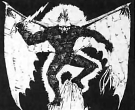
:::

### Quasit*
*Source:* `AD&D 1E Conversion`  *Category:* `Demon`

| Armor Class | 17          | No. Appearing | 1 (1)      |
| Hit Dice    | 3**        | Save As       | Fighter 3  |
| Move        | 150' (50') | Morale        | 9          |
| Attacks     | 2 claws / 1 bite | Treasure Type | Nil   |
| Damage      | 1d2 / 1d2 / 1d4 | Alignment | Chaotic    |

Quasits are minor demonic familiars and tempters. They encourage evil acts while serving only as long as it benefits them.

A quasit can become **invisible**, **cause fear**, **detect good**, and **polymorph** into small animal forms. Its claws carry irritating venom; a victim must Save vs. Poison or lose 1 point of Dexterity for `2d6` rounds. Quasits regenerate 1 hit point per round and can be harmed only by magic or cold iron weapons.

::: center
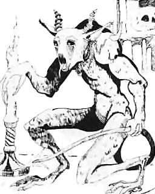
:::

### Shadow Demon
*Source:* `AD&D 1E Conversion`  *Category:* `Demon`

| Armor Class | 10 / 14 / 18  | No. Appearing | 0 (1)     |
| Hit Dice    | 7**        | Save As       | Fighter 7 |
| Move        | 120' (40') | Morale        | 10        |
| Attacks     | 1 bite / 2 claws | Treasure Type | Nil |
| Damage      | 1d8 / 1d6 / 1d6 | Alignment | Chaotic   |

A shadow demon is a lesser demon bound into the form of a living shadow, and it is easily mistaken for one at a glance. Its true nature shows in its light-dependent power: in daylight it is armor class 10 and takes double damage, in torchlight it is armor class 14 and fights normally, and in darkness it is armor class 18, strikes with deadly accuracy, and takes only half damage. It is immune to fire, cold, and lightning, but a **light** spell cast upon it burns like a **fireball**.

The demon can leap up to 30' to open an attack, and once per day it can call up **darkness** and **fear** in a 30' radius. Once per week it may attempt a **magic jar** against a victim; if the victim resists, the demon is stunned for `1d3` rounds.

::: center
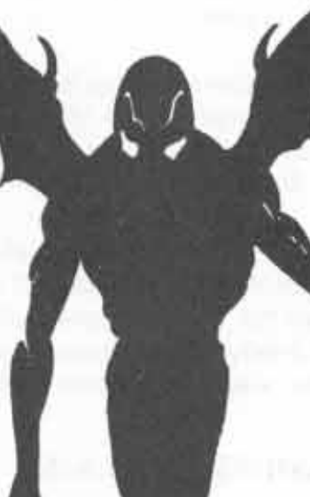
:::

::: pagebreak-pdf
:::

## Devils

Devils are the primary inhabitants of the planes of Hell and the embodiment of lawful evil. They are the eternal enemies of chaotic demons and all servants of good.

Devil society is governed by an immense and inflexible hierarchy enforced by the archdevils who rule the infernal planes. Though rigidly ordered, Hell is filled with endless rivalries, jealousies, and political intrigues among barons, dukes, marquises, princes, and lesser devils all seeking greater power and favor.

All devils may travel freely between the planes of Hell, though passage often requires the permission of the ruling archdevil. Devils may also move to Gehenna, Hades, and Acheron, and rarely travel the Astral Plane. They cannot enter the Prime Material Plane except through magical summoning, gate spells, or invocation of their secret names.

All devils possess powerful magical abilities that vary by type. Common powers include **telepathy**, **animate dead**, **charm person**, **fear**, **illusion**, **know alignment**, **phantasmal force**, **suggestion**, **teleportation** without error, and the ability to summon other devils. Devils may use these abilities at will, though generally only one at a time.

All devils possess infravision and can understand and speak any language.

Only a devil’s physical form can be destroyed outside Hell. A devil slain beyond the lower planes reforms in Hell as a lowly lemure and must endure 9 decades of infernal servitude before regaining its former rank and status.

Once battle is joined, devils never surrender or submit. Lesser devils fight to the death with fanatical determination, while greater devils and archdevils may negotiate if it serves their interests. Devils may divide their attacks among multiple opponents if advantageous.

Devils are masters of laws, bargains, and contracts. They obey the exact wording of agreements while relentlessly exploiting ambiguities, omissions, and hidden loopholes. Bargaining with devils is notoriously dangerous, as even the smallest oversight may lead to ruin.

As with demons, proper magical circles are essential when summoning devils. More powerful devils require increasingly elaborate and costly protections. Devils are also repelled by powerful holy relics and good-aligned artifacts.

Devils resist many forms of attack. They are completely immune to fire and take only half damage from cold and poisonous gas. They suffer full damage from acid, electricity, magic missiles, poison, and silver weapons, and take no damage from iron weapons unless they can be harmed by ordinary weapons. Only erinyes, barbed devils, and bone devils can be hit by normal weapons; greater devils require magic or silver weapons.

Arch-devils such as Asmodeus, Baalzebul, Dispater, and Geryon are unique rulers with campaign-level powers. Review and tailor them individually before play.  See [Appendix A: Legendary Creatures](#appendix-a-legendary-creatures).

### Lemure
*Source:* `AD&D 1E Conversion`  *Category:* `Devil`

| Armor Class | 12         | No. Appearing | 2d6 (5d6) |
| Hit Dice    | 3**        | Save As       | Fighter 3 |
| Move        | 30' (10')  | Morale        | 12        |
| Attacks     | 1 claw     | Treasure Type | Nil       |
| Damage      | 1d3        | Alignment     | Lawful    |

Lemures are mindless damned souls reshaped into vaguely human blobs, endlessly reformed by the will of the Hells to serve as the lowest fodder of Hell's legions. Their doughy, half-formed faces twist in a permanent, wordless wail, as if some faint memory of the life they once had is still trying to claw its way out. They shamble forward heedless of danger, feeling neither pain nor fear, driven only by a dim hunger to rend whatever living thing crosses their path. They regenerate 1 hit point per round and are permanently destroyed only by holy water, holy weapons, or similar blessed power. They are immune to **sleep**, **charm**, and similar spells.

::: center
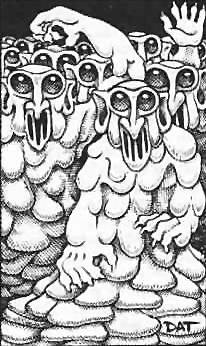
:::

### Erinyes
*Source:* `AD&D 1E Conversion`  *Category:* `Devil`

| Armor Class | 17         | No. Appearing | 1d3 (4d4) |
| Hit Dice    | 6+6*       | Save As       | Fighter 7 |
| Move        | 60' (20')  | Morale        | 9         |
| Fly         | 210' (70') | Treasure Type | R         |
| Attacks     | 1 dagger   | Alignment     | Lawful    |
| Damage      | 2d4        |               |           |

Erinyes are soul-hunters, often appearing beautiful and winged. Their venomous daggers cause terrible pain; a creature hit must Save vs. Poison or faint for `1d6` rounds. They carry **ropes of entanglement**, **cause fear** by gaze, and may **detect invisible**, **locate object**, become **invisible**, **polymorph self**, **produce flame**, or attempt to **summon* another erinyes.

::: center
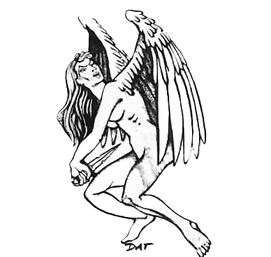
:::

### Barbed Devil
*Source:* `AD&D 1E Conversion`  *Category:* `Devil`

| Armor Class | 19               | No. Appearing | 1d2 (3d4) |
| Hit Dice    | 8**              | Save As       | Fighter 8 |
| Move        | 120' (40')       | Morale        | 10        |
| Attacks     | 2 claws / 1 tail | Treasure Type | Nil       |
| Damage      | 2d4 / 2d4 / 3d4  | Alignment     | Lawful    |

Barbed devils are vigilant guards and are never surprised. A creature struck by a barbed devil must Save vs. Spells or be affected by fear. They may use **pyrotechnics**, **produce flame**, **hold person**, or attempt to **summon** another barbed devil.

::: center
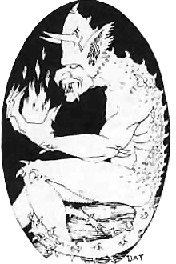
:::

### Bone Devil
*Source:* `AD&D 1E Conversion`  *Category:* `Devil`

| Armor Class | 20               | No. Appearing | 1d2 (2d4) |
| Hit Dice    | 9                | Save As       | Fighter 9 |
| Move        | 150' (50')       | Morale        | 10        |
| Attacks     | 1 hook / 1 tail  | Treasure Type | Nil       |
| Damage      | 3d4 / 2d4        | Alignment     | Lawful    |

Bone devils are malicious torturers armed with great hooks. A creature hit by the hook has a 50% chance to be caught fast, allowing the devil to strike with its tail. A tail hit drains `1d4` Strength for 10 rounds unless the victim Saves vs. Poison. Bone devils may **create fear**, **create illusion**, **fly**, become **invisible**, **detect invisible**, or attempt to **summon** another bone devil. Once per day they may create a **wall of ice**.

::: center
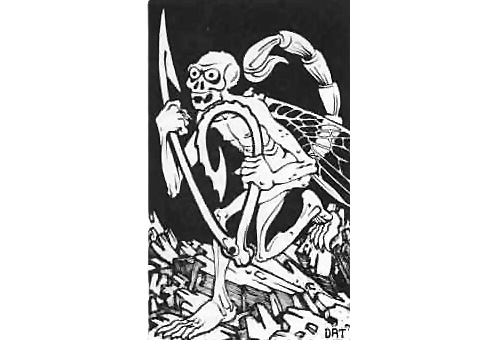
:::

### Horned Devil (Malebranche)*
*Source:* `AD&D 1E Conversion`  *Category:* `Devil`

| Armor Class | 24                                          | No. Appearing | 1d2 (2d4) |
| Hit Dice    | 5+5**                                       | Save As       | Fighter 6 |
| Move        | 90' (30')                                   | Morale        | 10        |
| Fly         | 180' (60')                                  | Treasure Type | I         |
| Attacks     | 2 claws/1 bite, or weapon / 1 tail          | Alignment     | Lawful    |
| Damage      | 1d4/1d4/1d4+1, or weapon / 1d3              |               |           |

Horned devils, or malebranche, are the least greater devils, standing as brutish enforcers a full head above the lemures and imps they command with casual contempt. They may carry a two-tined fork for `2d6` damage or a barbed whip for 1d4 damage plus stunning for the same number of rounds unless the victim Saves vs. Spells.

Their tail wounds bleed for 1 hit point per turn until bound or magically healed. They radiate fear in a 5' radius and may use **pyrotechnics**, **produce flame**, **ESP**, **detect magic**, **illusion**, or attempt to summon another horned devil. Once per day they may create a triple-strength **wall of fire**.

Malebranche delight in cruelty for its own sake, savoring a victim's terror as much as the wound itself. They serve as overseers and enforcers within the infernal hierarchy, driving lesser devils and the damned alike through threat of the lash. Vain and quick to anger, a horned devil that suffers public humiliation may abandon its post entirely to hunt down the source of its embarrassment, its wrath outweighing any concern for the duties it leaves unfinished.

::: center
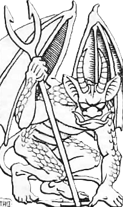
:::

### Ice Devil*
*Source:* `AD&D 1E Conversion`  *Category:* `Devil`

| Armor Class | 23                        | No. Appearing | 1 (1d4)    |
| Hit Dice    | 11**                      | Save As       | Fighter 11 |
| Move        | 60' (20')                 | Morale        | 10         |
| Fly         | Special                   | Treasure Type | Q, R       |
| Attacks     | 2 claws / 1 bite / 1 tail | Alignment     | Lawful     |
| Damage      | 1d4 / 1d4 / 2d4 / 3d4     |               |            |

Ice devils are cold, insectile greater devils. A few carry great spears that deal `2d6` damage and numb the victim unless it Saves vs. Paralysis, slowing it by half. Ice devils regenerate 1 hit point per round, **radiate fear** in a 10' radius, and may **fly**, **wall of ice**, **detect magic**, **detect invisible**, **polymorph self**, or **summon** bone devils or another ice devil. Once per day they may cause an **ice storm**.

Rigid adherents to law and hierarchy, ice devils prize contracts and precedent above all else, and will pursue a bargain's fine print with the same patience they bring to a siege. Their carapaces glitter with permanent frost, and the air around them grows brittle and silent, as if sound itself has frozen.

Many serve as jurists and record-keepers within Hell's bureaucracy, cataloguing the sins and debts of the damned with meticulous, glacial precision.  Player characters who strike a bargain with such a creature would do well to read the terms twice — ice devils never lie outright, but they are infinitely patient about finding the clause that damns the signer regardless.

::: center
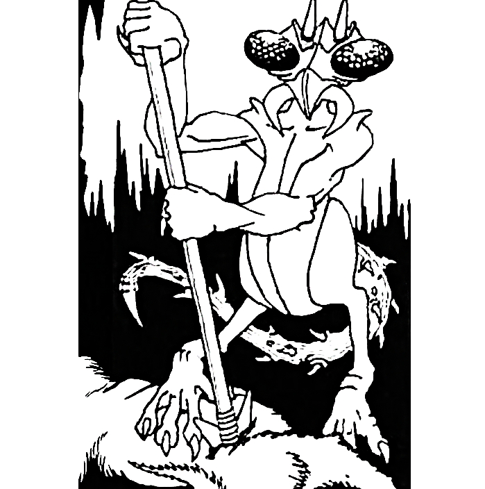
:::


### Pit Fiend*
*Source:* `AD&D 1E Conversion`  *Category:* `Devil`

| Armor Class | 22                     | No. Appearing | 1 (1d3)    |
| Hit Dice    | 13                     | Save As       | Fighter 13 |
| Move        | 60' (20')              | Morale        | 11         |
| Fly         | 150' (50')             | Treasure Type | J, R       |
| Attacks     | 2 weapons / 1 tail     | Alignment     | Lawful     |
| Damage      | 1d4+4 / 1d6+6 / 2d4    |               |            |

Pit fiends are among the most dreaded greater devils and servants of the ruler of Hell. They fight with a hooked weapon and jagged club, regenerate 2 hit points per round, and **radiate fear** in a 20' radius. A tail hit constricts for `2d4` damage each round. Pit fiends may use **pyrotechnics**, **produce flame**, **wall of fire**, **detect magic**, **detect invisible**, **polymorph self**, **hold person**, and **summon** barbed devils or another pit fiend. Once per day they may use a **symbol of pain**.

::: center
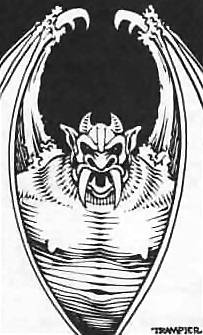
:::

### Imp*
*Source:* `AD&D 1E Conversion`  *Category:* `Devil`

| Armor Class | 17          | No. Appearing | 1 (1)      |
| Hit Dice    | 2+2        | Save As       | Fighter 2  |
| Move        | 60' (20')  | Morale        | 9          |
| Fly         | 180' (60') | Treasure Type | Nil        |
| Attacks     | 1 sting    | Alignment     | Lawful     |
| Damage      | 1d4 poison |               |            |

Imps are minor diabolical familiars and tempters. They serve evil masters while urging them toward cruelty and corruption.

An imp's sting is poisonous; the victim must Save vs. Poison or die. Imps can become invisible, polymorph into small animal forms, detect good, and use suggestion. They regenerate 1 hit point per round and can be harmed only by silver or magic weapons.

::: center
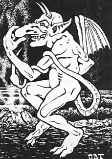
:::

::: pagebreak-pdf
:::

## Dragons

Dragons are the archetypal foes of fantasy adventure games. Some are weak enough that even inexperienced adventurers may dare to face them, while the eldest and greatest dragons are powerful enough to challenge entire companies of heroes. Even high-level parties may struggle against a mated pair or family of ancient dragons.

Dragons are most commonly identified by color. In some campaigns these colors are literal, with red dragons always bearing crimson scales and breathing fire, while in others the colors are symbolic or traditional. Some worlds also feature especially powerful dragons with more than 8 hit points per Hit Die, or even larger Hit Dice such as d10 or d12.

Despite their many kinds, dragons share several common traits. Dragons are intelligent, proud creatures and may sometimes accept a formal challenge rather than fight to the death. Whether a dragon agrees, and under what conditions, depends on its personality, alignment, and the nature of the challenge.

As dragons age, they grow steadily more powerful. Newly hatched dragons typically have only 1 hit point per Hit Die, while extremely ancient dragons over 400 years old may possess the maximum 8 hit points per Hit Die.

All dragons radiate an aura of supernatural fear, similar to a fear spell, affecting creatures below 5^th^ level unless they successfully save versus Spells. Dragons with 5 or more hit points per Hit Die also gain a bonus of +1 on saving throws for each hit point per die above 4. Thus, an ancient dragon with 8 hit points per Hit Die gains a +4 bonus on all saving throws.

::: twocolumn-pdf-end
:::

### Dragon
*Source:* `Basic`  *Category:* `Dragon`

|                | White                  | Black                   | Green                  | Blue                    | Red                    | Gold                   |
|----------------|------------------------|-------------------------|------------------------|-------------------------|------------------------|------------------------|
| Armor Class    | 16                      | 17                       | 18                      | 19                       | 20                     | 21                     |
| Hit Dice       | 6**                    | 7**                     | 8**                    | 9**                     | 10**                   | 11**                   |
| Move           | 90' (30')              | 90' (30')               | 90' (30')              | 90' (30')               | 90' (30')              | 90' (30')              |
| Fly            | 240' (80')             | 240' (80')              | 240' (80')             | 240' (80')              | 240' (80')             | 240' (80')             |
| Attacks        | 2 claws/bite or breath | 2 claws/bite or breath  | 2 claws/bite or breath | 2 claws/bite or breath  | 2 claws/bite or breath | 2 claws/bite or breath |
| Damage         | 1d4 / 1d4 / 2d8 or special | 1d4+1 / 1d4+1 / 2d10 or special | 1d6 / 1d6 / 3d8 or special | 1d6+1 / 1d6+1 / 3d10 or special | 1d8 / 1d8 / 4d8 or special | 2d4 / 2d4 / 6d6 or special |
| No. Appearing  | 1d4 (1d4)              | 1d4 (1d4)               | 1d4 (1d4)              | 1d4 (1d4)               | 1d4 (1d4)              | 1-4 (1-4)              |
| Save As        | Fighter 6              | Fighter 7               | Fighter 8              | Fighter 9               | Fighter 10             | Fighter 11             |
| Morale         | 8                      | 8                       | 9                      | 9                       | 10                     | 10                     |
| Treasure Type  | H                      | H                       | H                      | H                       | H                      | H                      |
| Alignment      | Neutral                | Chaotic                 | Chaotic                | Neutral                 | Chaotic                | Lawful                 |

| Trait                  | White            | Black           | Green            | Blue             | Red              | Gold                             |
|------------------------|------------------|-----------------|------------------|------------------|------------------|----------------------------------|
| Where Found            | Cold region      | Swamp, marsh    | Jungle, forest   | Desert, plain    | Mountain, hill   | Anywhere                         |
| Breath Weapon          | Cold             | Acid            | Chlorine gas     | Lightning        | Fire             | Fire / gas                       |
| Range and Shape        | 80' × 30' cone   | 60' × 5' line   | 50' × 40' cloud  | 100' × 5' line   | 90' × 30' cone   | 90' × 30' cone / 50' × 40' cloud |
| Chance of Talking      | 10%              | 20%             | 30%              | 40%              | 50%              | 100%                             |
| Chance of Being Asleep | 50%              | 40%             | 30%              | 20%              | 10%              | 5%                               |
| Spells by Level        | 3 / - / -        | 4 / - / -       | 3 / 3 / -        | 4 / 4 / -        | 3 / 3 / 3        | 4 / 4 / 4                        |

::: twocolumn-pdf-begin
:::

Dragons are a very old race of huge winged lizards. They like to live in isolated, out-of-the-way places where few humans are found. Though the color of their scaly hide makes dragons look different, they all have several traits in common: they are hatched from eggs, are meat-eaters, have Breath Weapons, love treasure, and will do everything possible to save their own lives, including surrender.

Dragons are proud of their long history, and because of this they tend to think less of the younger races. Chaotic dragons might capture humans, but will usually kill and eat them immediately. Neutral dragons might either attack or ignore a party completely. Lawful dragons, however, may actually help a party if the characters are truly worthy of the honor. When playing a dragon, the DM should remember that even the hungriest dragon will pause and listen to flattery, provided no one is attacking it and it understands the speaker.

BREATH WEAPONS DAMAGE: All dragons have a special attack with their Breath Weapon in addition to their claw and bite attacks. Any dragon can use its Breath Weapon up to 3 times each day. A dragon's first attack is always with its Breath Weapon. The number of points of damage any Breath Weapon does is equal to the dragon's remaining number of hit points. Any damage done to a dragon will reduce the damage it can do with its Breath Weapon.

After the first Breath attack, a dragon may choose to attack with claws and bite. To determine this randomly, roll `1d6`. A result of 1-3 means that the dragon will use its claw and bite attacks; a result of 4-6 means that the dragon will breathe again.

SHAPE OF BREATH: A dragon's Breath Weapon appears as one of three different shapes: cone-shaped, a straight line, or a cloud of gas.

A cone-shaped Breath begins at the dragon's mouth, where it is 2' wide, and spreads out until it is 30' wide at its furthest end. For example, the area of effect of a white dragon's Breath is a cone 80' long and 30' wide at its far end.

A line-shaped Breath starts in the dragon's mouth and stretches out toward its victim in a straight line, even downwards. Even at its source, a line-shaped Breath is 5' wide.

A cloud-shaped Breath billows forth from the dragon's mouth to form a 50'x40'x20' tall cloud around the dragon's targets directly in front of it.

::: center

:::

- **Saving Throws**: Anyone caught within the area of effect of a dragon's Breath Weapon may make a saving throw. A successful saving throw means that the victim takes only 1/2 damage from the Breath. Dragons are never affected by the normal or smaller versions of their own Breath Weapons, and automatically make their saving throws against any attack form that is the same as their Breath Weapon. For example, a red dragon will take no damage from burning oil, and will always take only 1/2 damage from a fire-type magic spell such as a fire ball.

- **Talking**: Dragons are intelligent, and some dragons can speak Dragon and Common. The percentage listed under Chance of Talking is the chance that a dragon will be able to talk. Talking dragons are also able to use Magic-user/Elf spells. The number of spells and their levels are given above under Spells by Level. For example, 3 / 3 / - would mean that the dragon can cast 3 first-level spells and 3 second-level spells, but no third-level spells. Dragon spells are usually selected randomly.

- **Sleeping Dragons**: The percentage chance given under Chance of Being Asleep applies whenever a party encounters a dragon on the ground; flying dragons are never asleep. Any result greater than the percentage means that the dragon is not asleep, though it may be pretending to be. If a dragon is asleep, it may be attacked with a bonus of +2 on attack rolls for one round, during which it will wake. Combat proceeds normally from the second round on.

- **Subduing Dragons**: Whenever characters encounter a dragon, they may choose to try to subdue it rather than kill it. To subdue a dragon, all the attacks must be with the flat of the sword; missile weapons and spells may not be used. Attacks and damage are determined normally when trying to subdue the dragon. The dragon will fight normally until it reaches 0 or fewer hit points, at which time it will surrender. A dragon may be subdued because it realizes that its attackers could have killed it if they had been striking to kill.  A subdued dragon will attempt to escape or turn on its captor if given a reasonable chance to do so through the party's actions. For example, a dragon left unguarded at night, or ordered to guard a position alone, would consider these reasonable chances. A subdued dragon must be sold. The price is up to the DM, but should never exceed 1,000 gp per hit point. The dragon may be forced to serve the characters who subdued it. If a subdued dragon is ever ordered to perform a task that is apparently suicidal, it will attempt to escape and/or kill its captors.

- **Age**: The statistics given are for an average-sized dragon of its type. Younger dragons are smaller and have acquired less treasure; older dragons are larger and have acquired more. Dragons generally range in size from 3 hit dice smaller to 3 hit dice larger than average. For example, red dragons could be found having 7 to 13 hit dice, depending on their age.

- **Treasure**: Younger dragons may have collected as little as 1/2 the normal listed treasure; older dragons may have as much as double the listed amount. Dragon treasure is only found in the dragon's lair. These lairs are rarely left unguarded, and are well-hidden to prevent easy discovery.

- **Gold dragons**: always talk and use spells. They can also change their shape, and often appear in the form of a human or animal. Gold dragons may breathe either fire, like a red dragon, or chlorine gas, like a green dragon, though they still have a total of 3 Breath Weapon attacks per day, not 6. The type of Breath attack should be chosen by the DM to fit the situation.

Dragons are extremely powerful and should be used with caution when encountered by low-level player characters. It is recommended that until characters reach the fourth level and higher, only the youngest and smallest dragons be used by the DM.

::: center

:::

### Dragon Turtle
*Source:* `Expert`  *Category:* `Dragon`

| Armor Class | 21               | No. Appearing | 0 (1)      |
| Hit Dice    | 30               | Save As       | Fighter 15 |
| Move        | 30' (10')        | Morale        | 10         |
| Swimming    | 90' (30')        | Treasure Type | H          |
| Attacks     | 2 claws / 1 bite | Alignment     | Chaotic    |
| Damage      | 1d8 / 1d8 / 10d6 |               |            |

Dragon turtles appear to be some unusual mixture of a dragon and a gigantic turtle. They have the head, limbs and tail of a great dragon and the hard shell of a turtle. These creatures live in the depths of great oceans and seas, seldom surfacing or approaching land. Dragon turtles are so large that sailors have mistakenly anchored on ones floating on the surface, thinking the hard shell to be a small island.

Besides its powerful claws and bite, the dragon turtle is also able to use a breath weapon. It can breathe a 30' wide cloud of steam to a distance of 90'. This breath weapon will do damage in the same manner as a dragon's, inflicting hit points of damage equal to the current hit points of the dragon turtle.

Dragon turtles live in great caverns on the bottom of the deepest oceans, where they keep the treasures of sunken ships. On occasion they will rise under ships, attempting to overturn them and devour the occupants.

Note: Dragon turtles are extremely powerful creatures that should not be used unless the player characters are of very high level.

::: center

:::

### Faerie Dragon
*Source:* `AD&D 1E Conversion`  *Category:* `Dragon`

| Armor Class | 14 (18 invisible) | No. Appearing | 1d6 (1d6)  |
| Hit Dice    | 1-8*            | Save As       | Fighter (as HD) |
| Move        | 60' (20')       | Morale        | 7          |
| Fly         | 240' (80')      | Treasure Type | S, T, U    |
| Attacks     | 1 bite          | Alignment     | Chaotic    |

A faerie dragon is a tiny, whimsical dragon-kin with a long prehensile tail, butterfly-like wings, and a huge smile, its hide running from red when young to purple in great age. Females shine with a golden tinge in sunlight; males, a silver one. They live in peaceful forests, often alongside sprites or pixies, and can turn invisible at will — even while attacking, breathing, or casting.

Rather than fight, a faerie dragon prefers to breathe a small cloud of euphoria gas; a victim failing a Save vs. Breath Weapon wanders about in blissful confusion for `3d4` rounds, unable to attack or otherwise act. About two-thirds of faerie dragons pick up a handful of minor magic-user spells as they age, the rest a handful of druid spells, and every spell they learn is chosen purely for mischief rather than combat — a faerie dragon will go to great lengths for a fresh apple pie or the perfect prank, and months of planning often go into a single elaborate joke. All faerie dragons can speak telepathically with one another up to two miles apart, and often enlist local forest creatures to help spring their pranks.

::: center

:::

### Pseudo-Dragon
*Source:* `AD&D 1E Conversion`  *Category:* `Dragon`

| Armor Class | 17          | No. Appearing | 1 (1)      |
| Hit Dice    | 2          | Save As       | Fighter 2  |
| Move        | 60' (20')  | Morale        | 7          |
| Fly         | 240' (80') | Treasure Type | Nil        |
| Attacks     | 1 bite / 1 sting | Alignment | Neutral   |
| Damage      | 1d3 / sleep |             |            |

Pseudo-dragons are tiny, intelligent dragon-kin that may bond with a trusted companion. They are shy, playful, and telepathic in a limited range. Their tail sting forces a Save vs. Poison. Failure causes deep sleep; a roll of 1 may cause death at the DM's discretion.

Pseudo-dragons can change color like chameleons and often hide near their companions, watching from rafters or branches long before revealing themselves. Fiercely loyal once trust is earned, they will fight far above their size to defend a bonded companion, using stealth and cunning rather than brute force.

::: center

:::

### Sea Dragons
*Source:* `Expert`  *Category:* `Dragon`

| Armor Class | 18                               | No. Appearing | 0 (1d4)                |
| Hit Dice    | 8                               | Save As       | Fighter 8 (see below)  |
| Move        | 180' (60') (Swimming or Flying) | Morale        | 9                      |
| Attacks     | 1 bite or 1 spit                | Treasure Type | H                      |
| Damage      | 3d8 or special                  | Alignment     | Neutral                |

Sea dragons are intelligent and usually green in color with a bright yellow-green crest. Sea dragons have a 20% chance of talking and being spell casters, with three 1^st^ level and three 2^nd^ level spells.

Their breath weapon is a 20' diameter glob of poison that they can spit up to 100', three times per day (50% chance to use). Those struck must save vs. Dragon Breath or die. (This poison loses its effectiveness after 1 round). Their bite is not poisonous.

The statistics given are for an average-sized sea dragon. Younger dragons, as with other dragons, are smaller and have acquired less treasure; older sea dragons are larger and have acquired more.

Sea dragons generally range in size from 3 hit dice smaller to 3 hit dice larger than average.

Sea dragons have fin-like wings which enable them to glide above the water for up to 6 rounds (much like "flying fish"). They live in caves or sunken ships at the bottom of the ocean, and may attack passing ships for food and treasure.

### Wyvern
*Source:* `Expert`  *Category:* `Dragon`

| Armor Class | 16                | No. Appearing | 1-2 (1-6)  |
| Hit Dice    | 7*               | Save As       | Fighter 4  |
| Move        | 90' (30')        | Morale        | 9          |
| Flying      | 240' (80')       | Treasure Type | E          |
| Attacks     | 1 bite / 1 sting | Alignment     | Chaotic    |
| Damage      | 2d8/1d6 + poison |               |            |

A wyvern looks like a two-legged, winged dragon with a long tail. In combat, the wyvern will bite and arch its tail over its head to hit opponents in front of it. Those stung by the tail must save vs. Poison or die. These beasts prefer to live on cliffs or in forests, but may be found anywhere.

::: center

:::

::: pagebreak-pdf
:::

## Elementals

Elementals are beings native to the Planes of Air, Earth, Fire, and Water, each embodying the raw essence of their home plane. Most are summoned to the material plane through conjuration, bound temporarily to serve the caster who called them, then returning once their task is done.

Not all share this transience, though. Free-willed races like the djinn and efreet have their own societies and ambitions, dwelling among their kind on their home planes, and only rarely venture elsewhere, usually by choice rather than compulsion.

True elementals are different still: formless embodiments of their element, lacking the individuality of their free-willed cousins. Because their bodies aren't truly physical, they can only be harmed by magic or magical weapons, making them nearly impervious to conventional arms.

### Aerial Servant*
*Source:* `AD&D 1E Conversion`  *Category:* `Elemental`

| Armor Class | 16          | No. Appearing | 1          |
| Hit Dice    | 16*        | Save As       | Fighter 16 |
| Move        | 240' (80') | Morale        | 12         |
| Attacks     | 1 grapple  | Treasure Type | Nil        |
| Damage      | Special    | Alignment     | Neutral    |

The aerial servant is a semi-intelligent form of an air elemental. It is typically encountered only due to conjuration by a cleric, although these creatures roam the ethereal and astral planes and, when encountered there, can be dimly seen. An aerial servant is normally invisible. Aerial servants do not fight per se, but they are exceedingly strong and very fast.

They can carry weights in excess of 10,000 cn, and if they grasp a creature, it is very difficult to break free. A grasped creature may save vs. Paralysis each round to escape. Characters may add their Strength modifier to this save.

Aerial servants normally use their great strength to seize victims and carry them away. They may also crush a grasped victim for `2d8` damage each round.

They travel at twice the speed of an invisible stalker, and when on the physical plane they are able to achieve surprise on a die roll of `1-4` (out of 6). They can only be harmed by magical weapons.

If the aerial servant is frustrated in the completion of its assigned mission, it becomes insane, returns to the cleric who sent it forth, and attacks as a double-strength invisible stalker. Likewise, if it is encountered ethereally or astrally, the aerial servant will typically attack in the same fashion.

For further details regarding aerial servants, consult the volume detailing clerical spells.

### Dao
*Source:* `AD&D 1E Conversion`  *Category:* `Elemental`

| Armor Class | 16          | No. Appearing | 1 (1d4)    |
| Hit Dice    | 8+3        | Save As       | Fighter 8  |
| Move        | 90' (30')  | Morale        | 10         |
| Burrow      | 60' (20')  | Treasure Type | Nil        |
| Attacks     | 1 fist     | Alignment     | Neutral    |
| Damage      | 3d6        |               |            |

Dao are genies of elemental earth, kin to the djinn, efreet, and jann but far more malicious, coming to the material plane chiefly to work mischief and evil. They dislike servitude even more than efreet do and are quick to nurse a grudge; only efreet count as friends, while djinn, jann, and marids are hated outright.

At will a dao may once each day become **invisible**, take **gaseous form**, cause **misdirection**, or use **passwall**, and can turn **rock to mud** three times a day or dig up to six times a day. A dao can burrow through natural earth (though not worked stone) at a steady pace and can carry a companion along with it. They are immune to earth-based magic, though holy water burns them for double damage. Dao dwell in deep caves and cysts, or in their own Great Dismal Delve on the Elemental Plane of Earth.

 When forced to bargain, a dao's word is technically binding but never generous, and it will search out every loophole a wish or pact allows.

::: center

:::

### Djinni*
*Source:* `Expert`  *Category:* `Elemental`

| Armor Class | 14                    | No. Appearing | 1 (0)       |
| Hit Dice    | 7 + 1                | Save As       | Fighter 14  |
| Move        | 90' (30')            | Morale        | 12          |
| Flying      | 240' (80')           | Treasure Type | Nil         |
| Attacks     | fists or whirlwind   | Alignment     | Neutral     |
| Damage      | 2d8 or 2d6 + special |               |             |

The djinn are intelligent, free-willed air elementals. They appear as tall, human-like beings, surrounded with clouds. Djinn are highly magical in nature and save as 14^th^ level fighters. They can only be harmed by magic or magical weapons.

A djinni can perform any of its seven powers three times a day:

- Create food and drink, as a 7^th^ level cleric
- Create temporary metallic objects up to 1,000 cn weight. Duration varies by hardness, from 1 day for gold to 1 round for iron
- Create soft goods and wooden objects, permanent, to a maximum of 1000 cn weight
- Become invisible
- Assume gaseous form
- Form itself into a whirlwind.

In addition, a djinni can create illusions that affect both sight and hearing at will. Such illusions last until touched or magically dispelled; the djinni need not concentrate to maintain them.

Djinn have two forms of attack:

A djinni can form itself into a whirlwind, 70' tall, 20' diameter at the top, 10' diameter at base, that moves 120' (40') per turn. The djinni requires 5 rounds to enter or leave whirlwind form. The djinni-whirlwind will do `2d6` points of damage to all in its path and will sweep aside all creatures with fewer than 2 hit dice who do not save vs. Death Ray.

When not in whirlwind form, a djinni strikes once per round with its fists for `2d8` points of damage.

If a djinni is slain, it returns to its own plane.

A djinni can carry 6000 cn weight without tiring. Up to 12,000 cn weight can be carried for 3 turns walking or 1 turn flying. Afterwards, a djinni must rest for one turn.

::: center

:::

### Efreeti*

*Source:* `Expert`  *Category:* `Elemental`

| Armor Class | 16           | No. Appearing | 1 (1)       |
| Hit Dice    | 10*         | Save As       | Fighter 15  |
| Move        | 90' (30')   | Morale        | 12          |
| Flying      | 240' (80')  | Treasure Type | Nil         |
| Attacks     | 1 fist      | Alignment     | Chaotic     |
| Damage      | 2d8         |               |             |

Efreet are free-willed fire elementals, proud and cruel in equal measure, hailing from the smoldering wastes of the Elemental Plane of Fire. They usually appear as clouds of oily black smoke that roil and thicken before solidifying into giant demonic-faced men, their skin a deep burning red and their eyes glowing with an inner light. The air around them is always hot and smoky, thick with the reek of sulfur and ash, and torches, tapers, and tinder have been known to catch merely from proximity. They are highly magical in nature, and like all true elemental-kin, they can only be hit with magic weapons — cold steel alone will not avail a would-be slayer.

Efreet can create objects, create illusions, and turn invisible at will, much as their rival djinn can, though efreeti magic carries always the taint of flame and brimstone. Up to three times per day, an efreeti may call forth a wall of fire, using it to bar a passage, herd enemies, or simply watch them burn. More fearsome still is the efreeti's power to transform itself into a raging pillar of flame for up to three rounds; in this form it sets alight any flammable materials within 5', and any creature struck by the efreeti suffers an extra 1-8 points of damage from the searing heat.

Efreet are also capable of flight, and while airborne they may bear aloft as much as 10,000 cn in weight, whether treasure, captives, or unfortunate adventurers. High-level magic-users who have learned the secret rites may summon an efreeti to their service, but such conjurations are perilous undertakings — an efreeti is bound only so long as its summoner's will and wards remain strong, and it will seize eagerly upon any lapse in control to wreak vengeance upon its erstwhile master.

::: center

:::

::: twocolumn-pdf-end
:::

### Elemental*
*Source:* `Expert`  *Category:* `Elemental`

|                | Air             | Earth     | Fire       | Water                      |
|----------------|-----------------|-----------|------------|----------------------------|
| Armor Class    | Variable        | Variable  | Variable   | Variable                   |
| Hit Dice       | Variable        | Variable  | Variable   | Variable                   |
| Move           | Fly 360' (120') | 60' (20') | 120' (40') | 60' (20'); Swim 180' (60') |
| Attacks        | Special         | Special   | Special    | Special                    |
| Damage         | Variable        | Variable  | Variable   | Variable                   |
| No. Appearing  | 1 (1)           | 1 (1)     | 1 (1)      | 1 (1)                      |
| Save As        | Variable        | Variable  | Variable   | Variable                   |
| Morale         | 10              | 10        | 10         | 10                         |
| Treasure Type  | Nil             | Nil       | Nil        | Nil                        |
| Alignment      | Neutral         | Neutral   | Neutral    | Neutral                    |

Elementals can be brought forth only from a large amount of their element, open air, bare earth or rock, large fire, or a large pond. After being summoned they must be totally controlled at all times by the person who summoned them. Control requires complete concentration. If the summoner moves over half speed, takes damage in combat, or does anything besides paying attention to the elemental, the elemental will turn and attempt to attack its summoner. It will also attack any creature in the path between it and the one who summoned it. Once control is lost, it can never be regained. An elemental vanishes when dispelled, when the elemental is slain, or when the summoner orders the elemental to return from whence it came while it is still under control. Elementals can be hit only by magic or magic weapons.

Staff elementals, the weakest, are summoned by a magic-user with a special staff. Device elementals are summoned with the use of a special miscellaneous magic item. Conjured elementals are summoned by the use of the 5^th^ level magic-user or elf spell.

| Kind     | Armor Class | Hit Dice | Damage | Save As    |
|----------|-------------|----------|--------|------------|
| Staff    | 17          | 8        | 1d8    | Fighter 8  |
| Device   | 19          | 12       | 2d8    | Fighter 12 |
| Conjured | 21          | 16       | 3d8    | Fighter 16 |

::: twocolumn-pdf-begin
:::

- **Air elementals**: appear as great whirlwinds 2' tall and 1/2' in diameter for each hit die they have. The whirlwind will catch and sweep away creatures of less than 2 hit dice unless a saving throw vs. Death Ray is made. Air elementals do an extra 1-8 points of damage against flying opponents.

- **Earth elementals**: appear as huge man-like figures 1' tall for each hit die they have. Earth elementals cannot cross a water barrier wider than their height. Earth elementals do an extra 1-8 points of damage against opponents on the ground.

- **Fire elementals**: appear as swirling pillars of roaring flame 1' tall and 1' in diameter for each hit die they have. They cannot cross a water barrier wider than their own diameter. They do an additional `1d8` points of damage against all creatures with cold-based attacks.

- **Water elementals**: appear as great waves of water 1/2' tall and 2' in diameter for each hit die they have. Water elementals are not able to move more than 60' from water. They do an extra `1d8` points of damage against opponents in water.

::: center

:::

::: twocolumn-pdf-end
:::

### Mephit
*Source:* `AD&D 1E Conversion`  *Category:* `Elemental`

|                | Fire Mephit | Lava Mephit | Smoke Mephit | Steam Mephit |
|----------------|-------------|-------------|--------------|--------------|
| Armor Class    | 14           | 13           | 14            | 14            |
| Hit Dice       | 3           | 3           | 3            | 3            |
| Move           | Fly 240' (80') | Fly 240' (80') | Fly 240' (80') | Fly 240' (80') |
| Attacks        | 2 claws / breath | 2 claws / breath | 2 claws / breath | 2 claws / breath |
| Damage         | 1d3 / 1d3 / 2d4 | 1d2 / 1d2 / 1d6 | 1d2 / 1d2 / 1d4 | 1d3 / 1d3 / 1d6 |
| No. Appearing  | 0 (1)       | 0 (1)       | 0 (1)        | 0 (1)        |
| Save As        | Fighter 3   | Fighter 3   | Fighter 3    | Fighter 3    |
| Morale         | 8           | 8           | 8            | 8            |
| Treasure Type  | Special     | Special     | Special      | Special      |
| Alignment      | Chaotic     | Chaotic     | Chaotic      | Chaotic      |

::: twocolumn-pdf-begin
:::

Mephits are small, garish, foul-tempered fiends used as messengers and errand-runners by more powerful denizens of the Lower Planes. Roughly 5' tall with fangs and small functional wings, they dress in the loudest clothing they can steal and delight in cruelty, mockery, and tasteless jokes. Each carries a handful of coin (`2d6` pieces, or platinum in the case of a lava mephit) as personal loot rather than true treasure.

- **Fire mephit**: wreathed in flame, it breathes a jet of fire or a 5' gout that burns everything in front of it.
- **Lava mephit**: oozes molten rock and can hurl a blob of it, and it regenerates while in contact with lava.
- **Smoke mephit**: breathes a choking, blinding cloud, and prefers to lurk in dark, smoky places.
- **Steam mephit**: trails scalding water and breathes a blast of superheated steam.

Once per hour, any mephit may attempt to **gate** in another mephit of random type (25% chance of success). Each type also carries one or two minor spell-like powers of its own, such as **magic missile** or **invisibility**, usable once per day.

::: center

:::

### Salamander*
*Source:* `Expert`  *Category:* `Elemental`

|                | Flame Salamander | Frost Salamander |
|----------------|------------------|------------------|
| Armor Class    | 17                | 16                |
| Hit Dice       | 8*               | 12*              |
| Move           | 120' (40')       | 120' (40')       |
| Attacks        | 2 claws / 1 bite | 4 claws / 1 bite |
| Damage         | 1d4 / 1d4 / 1d8  | 1d6 / 1d6 / 1d6 / 1d6 / 2d6 |
| No. Appearing  | 1d4+1 (2d4)      | 1d3 (1d3)        |
| Save As        | Fighter 8        | Fighter  12      |
| Morale         | 8                | 9                |
| Treasure Type  | F                | E                |
| Alignment      | Neutral          | Chaotic          |


- **Flame salamander**: is a form of free-willed fire elemental that looks like a giant snake, 12' to 16' long, with the head and limbs of a lizard. It has scales of bright orange-yellow and orange-red. All creatures within 20' will take `1d8` points of damage per round from the intense heat the salamander generates. Flame salamanders are immune to all fire-based attacks. These creatures are intelligent and prefer to live near, or in, volcanoes or in very hot, dry lands.

- **Frost Salamander**: looks like a giant lizard with 6 legs. Its scales are white or blue-white in color. When it fights, it rears up and strikes with the front four legs as well as fangs. All creatures within 20' will take an additional `1d8` points of damage each round from the extreme cold the monster radiates. Frost salamanders are immune to all cold-based attacks. They live in frozen wastelands, glaciers, and icy tundras.

Frost and flame salamanders hate each other, and will attack one another on sight.

::: center

:::

### Sylph
*Source:* `AD&D 1E Conversion`  *Category:* `Elemental`

| Armor Class | 10          | No. Appearing | 1 (1d4)    |
| Hit Dice    | 3          | Save As       | Fighter 3  |
| Move        | 120' (40') | Morale        | 6          |
| Fly         | 360' (120') | Treasure Type | Q, X      |
| Attacks     | 1 dagger   | Alignment     | Neutral    |
| Damage      | 1d4        |               |            |

Sylphs are shy air spirits that appear as graceful winged women. They prefer lonely high places and avoid violence.

Sylphs can become invisible and cast magic-user spells at the DM's discretion. They may aid gentle or handsome travelers but flee cruelty.

::: center

:::

### Water Weird
*Source:* `AD&D 1E Conversion`  *Category:* `Elemental`

| Armor Class | 15          | No. Appearing | 1 (1)      |
| Hit Dice    | 3+3        | Save As       | Fighter 4  |
| Move        | 120' (40') swim | Morale | 9          |
| Attacks     | 1 strike   | Treasure Type | I, O, P    |
| Damage      | Drowning   | Alignment     | Chaotic    |

Water weirds are serpentine beings formed from enchanted water. They lurk in pools, fountains, and cisterns.

A hit pulls the victim into the water. Unless freed, the victim begins drowning. Sharp weapons deal only 1 point of damage to a water weird, but purify food and water destroys it if cast on its pool.

::: center

:::

### Wind Walker*
*Source:* `AD&D 1E Conversion`  *Category:* `Elemental`

| Armor Class | 12          | No. Appearing | 1d3 (1d3)  |
| Hit Dice    | 6+3        | Save As       | Fighter 7  |
| Move        | 150' (50') fly | Morale    | 8          |
| Attacks     | 1 wind blast | Treasure Type | Nil     |
| Damage      | 3d6        | Alignment     | Neutral    |

Wind walkers are invisible air beings that roam lonely skies and high places. They are usually indifferent unless disturbed or summoned.

They can buffet foes with violent wind and are harmed only by magic weapons or spells that affect air and weather.

### Xorn
*Source:* `AD&D 1E Conversion`  *Category:* `Elemental`

| Armor Class | 21         | No. Appearing | 1d4 (1d4)  |
| Hit Dice    | 7+7        | Save As       | Fighter 8  |
| Move        | 90' (30')  | Morale        | 8          |
| Burrow      | 90' (30')  | Treasure Type | O, P, Q, X |
| Attacks     | 3 claws / 1 bite | Alignment | Neutral |
| Damage      | 1d3 / 1d3 / 1d3 / 6d4 |       |            |

Xorn are strange beings from the elemental plane of earth. They glide through stone and earth as easily as fish through water.

Xorn feed on precious metals and gems. They usually bargain for food but attack if refused or threatened. Their alien bodies have three arms, three legs, and a great central mouth.

::: center

:::

::: pagebreak-pdf
:::

## Humanoids
“Humanoids” are evil-aligned, human-like creatures such as orcs, goblins, and kobolds. Most humanoids live in tribes, clans, or warbands ruled by the strongest or most cunning leaders.

Larger groups often include shamans, witch doctors, or other tribal spellcasters

### Bugbear
*Source:* `Basic`  *Category:* `Humanoid`

| Armor Class | 14                    | No. Appearing | 2d4 (5d4) |
| Hit Dice    | 3+1                  | Save As       | Fighter 3 |
| Move        | 90' (30')            | Morale        | 9         |
| Attacks     | 1 weapon             | Treasure Type | B         |
| Damage      | 2d4 or by weapon + 1 | Alignment     | Chaotic   |

Bugbears are giant hairy goblins. Despite their size and awkward walk, they move very quietly and attack without warning whenever they can. They surprise on a roll of 1-3 (on `1d6`) due to their stealth. When using weapons, they add + 1 to all damage rolls due to their strength.

If 12 or more bugbears are encountered, one is a leader with AC 15, 22-25 hp, and +1 damage. If 24 or more are encountered, a chief with AC 16, 28-30 hp, and +2 damage is present, along with a sub-chief as a leader. In a lair, a chief and sub-chief are always present, with females and young each equal to 50% of the males. Females fight as hobgoblins and young as kobolds only in desperate defense.

Bugbears speak their own tongue, goblin, hobgoblin, and the chaotic alignment language.

::: center  

:::

::: center  

:::

### Drider
*Source:* `AD&D 1E Conversion`  *Category:* `Humanoid`

| Armor Class | 16          | No. Appearing | 1d4 (1d4)  |
| Hit Dice    | 6+6        | Save As       | Fighter 6  |
| Move        | 120' (40') | Morale        | 8          |
| Attacks     | 1 weapon or 1 bite | Treasure Type | Q |
| Damage      | By weapon or 1d4 + poison | Alignment | Chaotic |

A drider is a drow who failed a secret test set by Lolth for those of promising rank, and was transformed rather than rewarded: the torso, arms, and head of a pale, bloated dark elf sprout from the body of a giant spider. About 60% of driders are female.

A drider retains its former spellcasting — females as a 6^th^ or 7^th^ level cleric, males with a handful of minor magic-user spells — and fights capably with sword, axe, or bow, or with a poisonous bite that forces a Save vs. Poison at -2 or paralyzes for `1d2` turns. Cast out from drow society and shown no love in return, driders are usually encountered alone, though 1 in 10 keep company with a pack of huge spiders. They hunt underground, stalking prey patiently before striking, and feed chiefly on the blood of their kills.

::: center

:::

### Drow (Dark Elf)
*Source:* `AD&D 1E Conversion`  *Category:* `Humanoid`

| Armor Class | 15         | No. Appearing | 1d6 (5d10) |
| Hit Dice    | 2*         | Save As       | Fighter 2  |
| Move        | 120' (40') | Morale        | 9          |
| Attacks     | 1 weapon   | Treasure Type | N, Q       |
| Damage      | 1d6        | Alignment     | Chaotic    |

Ages ago the drow were exiled from the surface world by their kin for their cruelty, and they withdrew into the deep places of the earth to rebuild in darkness. There they grew strong in arcane and priestly magic under the rule of **Lolth**, the Demon Queen of Spiders, whom their clerics still worship. They despise sunlight, fighting at -2 to hit and losing 2 Dexterity when caught in it, and will retreat from bright light unless doing so would be more dangerous.

A drow warrior fights with sword or dagger, and many carry hand crossbows loaded with darts coated in a poison that drops the victim unconscious unless they Save vs. Poison at -4. Once per day each drow can cast **dancing lights**, **faerie fire**, and **darkness**; drow clerics, almost always female, know additional spells such as **detect lie** and **suggestion**. Their fine mesh armor and weapons, forged with strange underground alloys, lose their magic and crumble to uselessness within days of exposure to sunlight.

::: center

:::

### Duergar
*Source:* `AD&D 1E Conversion`  *Category:* `Humanoid`

| Armor Class | 15         | No. Appearing | 2d4 (201-300) |
| Hit Dice    | 1+2**      | Save As       | Fighter 1  |
| Move        | 60' (20')  | Morale        | 8 or see below |
| Attacks     | 1 weapon   | Treasure Type | M, Q (B, F) |
| Damage      | By weapon  | Alignment     | Lawful     |

Duergar, or gray dwarves, are a malicious, subterranean offshoot of dwarfkind who shun the light along with every other kindness. As with other humanoids, larger bands are led by tougher individuals of 2 to 9 Hit Dice, and morale rises to 10 whenever such a leader stands with the group. Duergar lairs are large, well-organized, and often (75% chance) hold 10-40 slaves of other races.

Duergar can turn **invisible** at will, and once per day can enlarge themselves to twice normal size for 1 turn, striking at +2 to hit and damage while so swollen. They save versus magical attacks (including polymorph and paralysis) at +4, are wholly immune to **poison** and **paralysis**, and are unaffected by **illusions**. Like other dwarves they have keen infravision to 90' and speak Dwarvish along with the silent speech shared by evil things underground; some duergar live 500 years or more.

The drow are old rivals of the gray dwarves, and the two races clash bitterly wherever their tunnels and territories meet, neither trusting the other's schemes for long-term truce.  When the two do cooperate, it is only through cold, transactional bargains—slaves and mineral wealth traded for arcane secrets—arrangements that dissolve into betrayal the moment either side sees advantage in breaking them.

::: center

:::

### Githyanki
*Source:* `AD&D 1E Conversion`  *Category:* `Humanoid`

| Armor Class | 17          | No. Appearing | 1d4 (3d10) |
| Hit Dice    | 5          | Save As       | Fighter 5  |
| Move        | 120' (40') | Morale        | 10         |
| Attacks     | 1 weapon   | Treasure Type | A          |
| Damage      | 1d8+1      | Alignment     | Chaotic    |

Long ago the mind flayers enslaved a race of humans, feeding upon them for generations, until under the leadership of the hero Gith they rose up and broke free. Their descendants, the githyanki, now dwell in vast castles on the Astral Plane and raid the Material Plane in small bands, striking at humans and mind flayers alike. They worship an undying lich-queen who is said to destroy any githyanki who grows too powerful to threaten her rule.

Githyanki wield ornate two-handed swords, and their finest warriors carry intelligent silver swords capable of severing the silver cord of an astral traveler; a githyanki band will go to great lengths to recover a lost silver sword. Many keep an ancient pact with red dragons, who bear them as steeds when they venture onto the Material Plane. Githyanki despise the githzerai above all other enemies, even mind flayers.

::: center

:::

### Githzerai
*Source:* `AD&D 1E Conversion`  *Category:* `Humanoid`

| Armor Class | 15          | No. Appearing | 1d4 (3d10) |
| Hit Dice    | 4          | Save As       | Fighter 4  |
| Move        | 120' (40') | Morale        | 9          |
| Attacks     | 1 weapon   | Treasure Type | A          |
| Damage      | 1d6        | Alignment     | Chaotic    |

The githzerai share the same origin as the githyanki, having won their freedom from the mind flayers together under the hero Gith, but the two peoples have been bitter enemies ever since. Where the githyanki are showy and grasping, the githzerai are monastic and disciplined, dwelling in a handful of towering adamantite fortresses in Limbo and on the Material Plane, ruled by an undying wizard-king.

Githzerai fight with plain swords and favor economy of motion over ornament, and some among them train as monks of great skill. Many possess minor psionic talent, and the strongest among them can wield powers of the mind alongside blade and fist. Life in a githzerai fortress is austere and demanding; children are tested young, and those who show discipline and strength of will are drawn into rigorous training under the monastic orders, while the weak-willed are given little standing among their kin. They hold an uneasy, oft-broken truce with the mind flayers, but no such peace exists with the githyanki, whom they war against without end.

::: center

:::

### Gnoll
*Source:* `Basic`  *Category:* `Humanoid`

| Armor Class | 14                    | No. Appearing | 1d6 (3d6) |
| Hit Dice    | 2                    | Save As       | Fighter 2 |
| Move        | 90' (30')            | Morale        | 8         |
| Attacks     | 1 weapon             | Treasure Type | D         |
| Damage      | 2d4 or by weapon + 1 | Alignment     | Chaotic   |

Gnolls are beings of low intelligence that appear to be human-like hyenas. They may use any weapons. They are strong, but dislike work and prefer to bully and steal for a living. For every 20 gnolls encountered, one will be a leader with 16 hit points who attacks as a 3 hit dice monster. Gnolls are rumored to be the result of a magical combination of a gnome and a troll by an evil magic-user.

::: center

:::

### Goblin
*Source:* `Basic`  *Category:* `Humanoid`

| Armor Class | 13                | No. Appearing | 2d4 (6d10)   |
| Hit Dice    | 1-1              | Save As       | Normal Man   |
| Move        | 60' (20')        | Morale        | 7 or special |
| Attacks     | 1 weapon         | Treasure Type | R (C)        |
| Damage      | 1d6 or by weapon | Alignment     | Chaotic      |

Goblins are a small incredibly ugly human-like race. Their skin is a pale earthy color, such as chalky tan or livid gray. Their eyes are red, and glow when there is little light, somewhat like rat's eyes.

Goblins live underground and have well-developed infravision (heat-sensing sight) to 90'. In full daylight they fight with a penalty of -1 on their "to hit" rolls. Goblins hate dwarves and will attack them on sight. There is a 20% chance that when goblins are encountered, 1 of every 4 will be riding a dire wolf.

In the goblin lair lives a goblin king with 15 hit points who fights as a 3 hit dice monster and gains + 1 on damage rolls. The goblin king has a bodyguard of `2d6` goblins who fight as 2 hit dice monsters and have `2d6` hit points each. The king and his bodyguard may fight in full daylight without a penalty. The goblin morale will be 9 rather than 7 as long as their king is with them and still alive.

Treasure type C is only found in the goblin lair or when encountered in the wilderness.

::: center

:::

### Hobgoblin
*Source:* `Basic`  *Category:* `Humanoid`

| Armor Class | 13         | No. Appearing | 1d6 (4d6)      |
| Hit Dice    | 1 + 1     | Save As       | Fighter 1      |
| Move        | 90' (30') | Morale        | 8 or see below |
| Attacks     | 1 weapon  | Treasure Type | D              |
| Damage      | 1d8       | Alignment     | Chaotic        |

Hobgoblins are bigger and meaner relatives of goblins. They live underground but often hunt above ground and have no penalties for fighting in full daylight. A hobgoblin king and 1-4 (`1d4`) bodyguards live in the hobgoblin lair. The king has 22 hit points and fights as a 5 hit dice monster, gaining a bonus of + 2 on damage.

The bodyguards all fight as 4 hit dice  and have 3-18 (`3d6`) hit points each. As long as their king is alive and with them, hobgoblin morale is 10 rather than 8.

::: center

:::

### Kobold
*Source:* `Basic`  *Category:* `Humanoid`

| Armor Class | 12                | No. Appearing | 4d4 (6d10)     |
| Hit Dice    | 1/2 (1d4 hp)     | Save As       | Normal Man     |
| Move        | 60' (20')        | Morale        | 6 or see below |
| Attacks     | 1 weapon         | Treasure Type | P (J)          |
| Damage      | 1d4 or weapon -1 | Alignment     | Chaotic        |

These small, evil dog-like men usually live underground. They have scaly rust-brown skin and no hair. They have well developed infravision (heat-sensing sight) to a 90' range. They prefer to attack by ambush. A kobold chieftain and 1-6 bodyguards live in the kobold lair. The chieftain has 9 hit points and fights as a 2 hit dice monster. The bodyguards each have 6 hit points and fight as 1 + 1 hit dice . As long as the chieftain is alive, all kobolds with him have a morale of 8 rather than 6. Kobolds hate gnomes and will attack them on sight. Treasure type J is only found in encounters in the lair or in the wilderness.

::: center

:::

### Kuo-Toa
*Source:* `AD&D 1E Conversion`  *Category:* `Humanoid`

| Armor Class | 15                | No. Appearing | 2d12 (8d20) |
| Hit Dice    | 2                | Save As       | Fighter 2   |
| Move        | 90' (30')        | Morale        | 8           |
| Swim        | 180' (60')       | Treasure Type | L, M, N (Z in lair) |
| Attacks     | 1 weapon or bite | Alignment     | Neutral     |
| Damage      | 1d6 or 1d4       |               |             |

The kuo-toa are a fish-man race driven from the sunlit world ages ago by the rise of mankind. Those who fled into deep, lightless waters survived and grew strange, and now their descendants dwell in vast subterranean lakes and caverns, worshipping the fish-headed goddess Blibdoolpoolp, the Sea Mother. They hate sunlight and are almost never found above ground.

A kuo-toa's slimy, tough hide grants it a good natural armor class, and that same slime makes it hard to grapple, tie, or web. They fight with spear, net, or barbed harpoon, or bite for `1d4` when unarmed, and their bands are led by higher-level warriors, clerics, and "whips" who keep the fanatical rank and file in line. Kuo-toa keep slaves taken from many races, hate the drow and mind flayers above all else, and regard sahuagin as rivals for the same dark waters.

::: center

:::

### Lizard Man
*Source:* `Basic`  *Category:* `Humanoid`

| Armor Class | 14                              | No. Appearing | 2d4 (6d6) |
| Hit Dice    | 2 + 1                          | Save As       | Fighter 2 |
| Move        | 60' (20'); in water 120' (40') | Morale        | 12        |
| Attacks     | 1 weapon                       | Treasure Type | D         |
| Damage      | 1d6+1 or weapon + 1            | Alignment     | Neutral   |

These water-dwelling creatures look like men with lizard heads and tails. They live in tribes. They will try to capture humans and demi-humans and take the victims back to the tribal lair as the main course of a feast. Lizard men are semi-intelligent and use weapons such as spears and large clubs (treat the clubs as maces) gaining a bonus of + 1 on damage rolls due to their great strength. Lizard men are often found in swamps, rivers, and along seacoasts as well as in dungeons.

::: center

:::

### Locathah
*Source:* `AD&D 1E Conversion`  *Category:* `Humanoid`

| Armor Class | 13          | No. Appearing | 2d10 (20d10) |
| Hit Dice    | 2          | Save As       | Fighter 2  |
| Move        | 120' (40') swim | Morale | 8          |
| Attacks     | 1 weapon   | Treasure Type | A          |
| Damage      | By weapon  | Alignment     | Neutral    |

Locathah are aquatic humanoid nomads of warm shallow seas. They hunt, gather, and dwell in castle-like undersea rock lairs hollowed into rooms and passages.

Locathah ride giant eels into battle. Their forces use lances, crossbows, tridents, nets, and daggers. Lairs are guarded by moray eels and may include a Portuguese man-of-war trap.

::: center

:::

### Orc
*Source:* `Basic`  *Category:* `Humanoid`

| Armor Class | 13                 | No. Appearing | 2d4 (10d6) |
| Hit Dice    | 1                 | Save As       | Fighter  1 |
| Move        | 120' (40')        | Morale        | 8          |
| Attacks     | 1 weapon          | Treasure Type | D          |
| Damage      | 1d6 or weapon     | Alignment     | Chaotic    |

Orcs are ugly human-like creatures who look like a combination of animal and man. Orcs are nocturnal (usually sleeping in the day and active at night or in the dark), and prefer to live underground.

When fighting in daylight, they must subtract 1 from their "to hit" rolls. They have bad tempers and do not like other living things; they will often kill something for their own amusement. They are afraid of anything which looks larger and stronger than they are, but may be forced to fight by their leaders.

Orc leaders gain their positions by fighting and defeating (or killing) the others. One member of any group of orcs will be a leader with 8 hit points who gains a bonus of + 1 on damage rolls. If this "leader" is killed, the morale of the group becomes 6 instead of 8.

Orcs may often be hired at low cost as soldiers, and are often used for armies by Chaotic leaders (both humans and monsters). The orcs are satisfied by being allowed to kill and burn as much as they want. Orcs prefer swords, spears, axes, and clubs for weapons.

They will not use mechanical weapons (such as catapults), as only their leaders understand how to operate them.

There are many different tribes of orcs. Members of different tribes are not usually friendly with each other, and may start fighting unless their leaders are present. An orc lair has only one tribe. Each tribe will have as many female orcs as males, and 2 children ("whelps") for each 2 adults. The leader of an orc tribe is a chieftain who has 15 hit points, attacks as a 4 hit dice monster, and gains + 2 on damage rolls. For every 20 orcs in a tribe, there may be an ogre with them (a 1 in 6 chance). (If the D&D EXPERT rules are used, there is a 1 in 10 chance of a troll living in the lair as well.)

::: center

:::

### Sahuagin
*Source:* `AD&D 1E Conversion`  *Category:* `Humanoid`

| Armor Class | 14          | No. Appearing | 2d10 (20d10) |
| Hit Dice    | 2+2        | Save As       | Fighter 2  |
| Move        | 120' (40') swim | Morale | 9          |
| Attacks     | 2 claws / 1 bite or weapon | Treasure Type | A |
| Damage      | 1d2 / 1d2 / 1d4 or by weapon | Alignment | Chaotic |

Sahuagin are evil sea raiders who hate surface folk and most other aquatic races. They are organized, cruel, and dangerous in numbers.

Sahuagin lairs are underwater strongholds with leaders, priestesses, guards, and trained sharks. They use spears, tridents, nets, and crossbows designed for underwater use.

::: center

:::

### Svirfneblin (Deep Gnome)
*Source:* `AD&D 1E Conversion`  *Category:* `Humanoid`

| Armor Class | 17          | No. Appearing | 1d6 (3d10) |
| Hit Dice    | 3          | Save As       | Fighter 3  |
| Move        | 90' (30')  | Morale        | 8          |
| Attacks     | 1 weapon   | Treasure Type | K, Q       |
| Damage      | 1d6        | Alignment     | Neutral    |

Svirfnebli, or deep gnomes, are a reclusive cousin race to the gnomes of the surface, dwelling in vast connected caverns far beneath the earth where they mine for gems. Only males are ever encountered outside their halls; every small band includes a tougher leader-type, and larger groups may be led by a battle-hardened burrow warden with two trained assistants.

Deep gnomes are doughty fighters and wary of outsiders, though not inherently hostile unless provoked. About one in four of their leaders has some skill as an illusionist, and like their surface kin they have keen infravision and a natural affinity for stone and tunnels.

::: center

:::

### Triton
*Source:* `AD&D 1E Conversion`  *Category:* `Humanoid`

| Armor Class | 14          | No. Appearing | 1d6 (10d10) |
| Hit Dice    | 3          | Save As       | Fighter 3  |
| Move        | 150' (50') swim | Morale | 9          |
| Attacks     | 1 weapon   | Treasure Type | A          |
| Damage      | By weapon  | Alignment     | Lawful     |

Tritons are noble aquatic humanoids who dwell in deep seas. They are enemies of evil sea creatures and often ride hippocampi.

Triton leaders may cast spells or command marine animals. They use spears, tridents, conch horns, and other sea-forged arms.

::: center

:::

### Troglodyte
*Source:* `Basic`  *Category:* `Humanoid`

| Armor Class | 14                 | No. Appearing | 1d8 (5d8) |
| Hit Dice    | 2*                | Save As       | Fighter 2 |
| Move        | 120' (40')        | Morale        | 9         |
| Attacks     | 2 claws / 1 bite  | Treasure Type | A         |
| Damage      | 1d4 each          | Alignment     | Chaotic   |

A troglodyte is an intelligent human-like reptile with a short tail, long legs, and a spiny comb on its head and arms. Troglodytes walk upright and use their hands as well as humans. They hate most other creatures, and will try to kill anyone they meet.

They have a chameleon-like ability to change colors and use it to hide by rock walls, surprising on a roll of 1-4 on `1d6`. They secrete an oil which produces a stench that will nauseate humans and demi-humans unless the victims save vs. Poison. Nauseated characters have a -2 penalty on their attack rolls while in hand-to-hand combat with the troglodytes.

::: center

:::

::: pagebreak-pdf
:::

## Giants

Far from being mere brutes, giants are often surprisingly cunning, making up for their limited intelligence with patience, strength, and ruthless practicality. Though proud and arrogant, giants may sometimes be bargained with if cooperation serves their interests, especially with creatures of similar alignment.

Despite their many kinds, all giants share certain traits. Their immense strength, usually ranging from 19-25, allows them to hurl great rocks with the force of a catapult, even at close range. Young or immature giants are proportionally weaker than adults.

Giants are also famously greedy, especially for gold. When away from their cave dens or strongholds, they commonly carry 1,000-6,000 coins, usually in gold. They almost always keep one or two large rocks at hand as convenient weapons and as a brutal display of strength.

All giants speak their own racial tongue as well as an alignment language.

### Cyclops
*Source:* `Expert`  *Category:* `Giant`

| Armor Class | 14         | No. Appearing | 1 (1d4)     |
| Hit Dice    | 13*       | Save As       | Fighter 13  |
| Move        | 90' (30') | Morale        | 9           |
| Attacks     | 1         | Treasure Type | E + 5000 gp |
| Damage      | 3d10      | Alignment     | Chaotic     |

A cyclops is a rare type of giant, noted for its great size and the single eye in the center of its forehead. A cyclops is about 20' tall. It has poor depth perception due to its single eye, and strikes with a penalty of -2 on all "to hit" rolls. A cyclops will usually fight with a wooden club. A cyclops can throw rocks up to a distance of 200 feet with a penalty of -2 to hit. These rocks will cause 3-18 points of damage to any creature struck.

Some cyclops, 5%, are able to cast a **curse** once a week. The DM should decide the exact nature of the **curse**.

A cyclops usually lives alone, though a small group may sometimes share a large cave. They spend their time raising sheep and grapes. Cyclopes are known for their stupidity, and a clever party can often escape from them by trickery.

### Ettin
*Source:* `AD&D 1E Conversion`  *Category:* `Giant`

| Armor Class | 16          | No. Appearing | 1d2 (1d4)  |
| Hit Dice    | 10         | Save As       | Fighter 10 |
| Move        | 120' (40') | Morale        | 9          |
| Attacks     | 2 clubs    | Treasure Type | O; C, Y in lair |
| Damage      | 2d8 / 3d6  | Alignment     | Chaotic    |

Ettins are two-headed giant-kin that dwell in remote places, usually in underground lairs. They are nocturnal and prefer darkness.

Each head controls one arm, allowing an ettin to attack with both clubs at once. One head is usually alert while the other rests, so ettins are surprised only on a roll of 1 on `1d6`.

Ettins are closely related to orcs in appearance and habits. They dress in filthy animal skins and favor spiked clubs and similar brutal weapons.

::: center

:::

::: twocolumn-pdf-end
:::

::: pagebreak-pdf
:::

### Giant
*Source:* `Expert`  *Category:* `Giant`

|                | Hill Giant  | Stone Giant | Frost Giant | Fire Giant  | Cloud Giant | Storm Giant   |
|----------------|-------------|-------------|-------------|-------------|-------------|---------------|
| Armor Class    | 15           | 15           | 15           | 15           | 15           | 17             |
| Hit Dice       | 8           | 9           | 10 + 1      | 11 + 2      | 12 + 3      | 15            |
| Move           | 120' (40')  | 120' (40')  | 120' (40')  | 120' (40')  | 120' (40')  | 150' (50')    |
| Attacks        | 1           | 1           | 1           | 1           | 1           | 1 + special   |
| Damage         | 2d8         | 3d6         | 4d6         | 5d6         | 6d6         | 8d6 + special |
| No. Appearing  | 1d4 (2d4)   | 1d2 (1d6)   | 1d2 (1d4)   | 1d2 (1d3)   | 1d2 (1d3)   | 1d2 (1d3)     |
| Save As        | Fighter 8   | Fighter 9   | Fighter 10  | Fighter 11  | Fighter 12  | Fighter 15    |
| Morale         | 8           | 9           | 9           | 9           | 10          | 10            |
| Treasure Type  | E + 5000 gp | E + 5000 gp | E + 5000 gp | E + 5000 gp | E + 5000 gp | E + 5000 gp   |
| Alignment      | Chaotic     | Neutral     | Chaotic     | Chaotic     | Neutral     | Lawful        |

::: twocolumn-pdf-begin
:::

- **Hill giants** are hairy, stupid brutes about 12' tall who wear skins and raid nearby human settlements for food and plunder.
- **Stone giants** are 14' tall with gray rock-like skin and hurl boulders up to 300'.
- **Frost giants** are pale, cold-dwelling raiders with bear or wolf guards and immunity to cold-based attacks.
- **Fire giants** have red skin, dark hair, and homes near volcanic regions; they are immune to fire-based attacks and often keep hydras or hellhounds as guards.
- **Cloud giants** are tall, sharp-sensed mountain or cloud dwellers who often keep giant hawks or dire wolves.
- **Storm giants** are the tallest of all giants, love thunder storms, and in a storm may hurl lightning that does damage equal to their current hit points, with a save vs. Spells for half.

::: center

:::

### Ogre
*Source:* `Basic`  *Category:* `Giant`

| Armor Class | 14 | No. Appearing | 1-6 (2-12) |
| Hit Dice | 4+1 | Save As | Fighter: 4 |
| Move | 90' (30') | Morale | 10 |
| Attacks | lclub | Treasure Type | C + 1000 gp |
| Damage | 1-10 | Alignment | Chaotic |

Ogres are huge fearsome human-like creatures, usually 8 to 10 feet tall. They wear animal skins for clothes, and often live in caves.

When encountered outside their lair, they will be carrying 100-600 gp (`1d6` x 100) in large sacks. Ogres hate Neanderthals and will attack them on sight.

::: center

:::

::: columnbreak-pdf
:::

### Ogre Mage
*Source:* `AD&D 1E Conversion`  *Category:* `Giant`

| Armor Class | 15          | No. Appearing | 1d2 (1d6)  |
| Hit Dice    | 5+2        | Save As       | Fighter 5  |
| Move        | 90' (30')  | Morale        | 9          |
| Fly         | 150' (50') | Treasure Type | G          |
| Attacks     | 1 weapon   | Alignment     | Chaotic    |
| Damage      | 1d12       |               |            |

Ogre magi are intelligent, magical ogres with cruel appetites and a taste for command. They use magic and deception before closing to fight.

An ogre mage can become invisible, fly, charm person, assume gaseous form, create darkness, and regenerate 1 hit point per round. Once per day it may breathe a cone of cold for `8d8` damage, half with a successful Save vs. Breath Weapon.

::: center

:::

### Titan
*Source:* `AD&D 1E Conversion`  *Category:* `Giant`

| Armor Class | 22         | No. Appearing | 1 (1d2)    |
| Hit Dice    | 17-22      | Save As       | Fighter 17-22 |
| Move        | 210' (70') | Morale        | 10         |
| Attacks     | 1 weapon   | Treasure Type | E, Q, R, S, T |
| Damage      | 7d6        | Alignment     | Lawful     |

Titans are majestic giant beings of great strength, beauty, and magical power. They dwell in remote palaces, high mountains, or other mythic places.

Titans use huge weapons, hurl great missiles, and cast powerful clerical and magic-user spells. They are campaign-level beings and require manual review for exact spell lists.

::: center

:::

### Troll
*Source:* `Expert`  *Category:* `Giant`

| Armor Class | 14         | No. Appearing | 1d6 (2d6)   |
| Hit Dice    | 4 + 1     | Save As       | Fighter 4   |
| Move        | 90' (30') | Morale        | 10          |
| Attacks     | 1 club    | Treasure Type | C + 1000 gp |
| Damage      | 1d10      | Alignment     | Chaotic     |

Thin, rubbery, and loathsome, trolls stand nearly 8' tall. They are intelligent and prefer humanoid creatures over all other foods. Trolls live in caves, dungeons, wastelands, and in ruined dwellings of the humanoids they have slain and eaten.

Trolls are strong and rend their opponents with talons and sharp teeth. A troll has the power of regeneration, the ability to heal and grow back together. A troll will begin to heal 3 rounds after it has taken damage. A troll's wounds will heal themselves at a rate of 3 hit points per round, and even severed limbs will crawl back to the body and rejoin. The troll cannot regenerate damage from fire or acid. In game turns, this means that unless totally consumed by fire or acid, a troll will eventually regenerate completely. If reduced to 0 hit points by other than fire or acid damage, the troll will heal enough to fight again in 2-12 rounds. The morale in parentheses applies only when the troll is attacked by fire or acid.

::: center

:::

::: pagebreak-pdf
:::

## Insects

Insects and similar creeping creatures are common in dungeons, ruins, and wilderness areas. Though many are merely oversized versions of normal vermin, others are strange and deadly monsters driven by hunger, instinct, or hive behavior.

### Ant, Driver
*Source:* `Basic`  *Category:* `Insect`

| Armor Class | 16          | No. Appearing | 2d4 (4d6)       |
| Hit Dice    | 4*         | Save As       | Fighter 2       |
| Move        | 180' (60') | Morale        | 7 and see below |
| Attacks     | 1          | Treasure Type | U or see below  |
| Damage      | 2d6        | Alignment     | Neutral         |

Driver ants are giant black ants about 6' long. They are ravenous omnivores that will devour nearly anything edible in their path.

Once engaged in combat, driver ants fight to the death and may even cross flames to reach their prey. Their nest-lairs are always guarded by `4d6` driver ants.

Deep within the nest is a massive egg-laying queen attended by countless workers and larvae. A colony will defend its queen with fanatical fury, and the destruction of the queen usually causes the colony to scatter within a few days.

Legends claim driver ants sometimes mine and collect gold. There is a 30% chance a driver ant lair contains `1d10` thousand gp worth of gold nuggets.

::: center

:::

::: columnbreak-pdf
:::

### Ant, Giant
*Source:* `AD&D 1E Conversion`  *Category:* `Insect`

|               | Worker       | Warrior          | Queen     |
| ------------- | ------------ | ---------------- | --------- |
| Armor Class   | 16            | 16                | 16         |
| Hit Dice      | 2            | 3                | 10        |
| Save As       | Fighter 1    | Fighter 2        | Fighter 5 |
| Move          | 180' (60')   | 180' (60')       | 0         |
| Attacks       | 1 bite       | 1 bite / 1 sting | Nil       |
| Damage        | 1d6          | 2d4 / 3d4        | Nil       |
| No. Appearing | 1d8 (1d100)  | See colony       | 0 (1)     |
| Morale        | 8            | 9                | 7         |
| Treasure Type | Q x3, S      | Q x3, S          | Q x3, S   |
| Alignment     | Neutral      | Neutral          | Neutral   |

Giant ants are aggressive social insects that live in vast underground colonies. Most encountered are workers, which tirelessly gather food and defend the nest. Though smaller than the dreaded driver ant, giant ants attack fearlessly when threatened and can overwhelm larger foes through sheer numbers.

When giant ants are encountered outside their lair, there is a 90% chance that they will simply be workers. If found in their lair (nest), there will be the number rolled plus 1 warrior ant for every 5 workers. The warrior ant has 3 hit dice, does `2d4` points of damage with its mandibles, and if it hits with them it will also attempt to sting for `3d4` points of damage. If a sting hits, a saving throw versus poison must be made; if successful, the victim takes only `1d4` points of damage. The queen ant has 10 hit dice, but she neither moves nor attacks. If she is killed, the other ants become confused (as if under the influence of that spell) for six melee rounds and then leave the nest. Treasure held by the ants will be found in the queen's chamber. The egg chamber is guarded by `5d10` workers and 5 warriors. Giant ant eggs have no normal market value.

### Bee, Killer
*Source:* `Basic`  *Category:* `Insect`

| Armor Class | 12             | No. Appearing | 1d6 (5d6) |
| Hit Dice    | 1/2* (1d4 hp) | Save As       | Fighter 1 |
| Move        | 150' (50')    | Morale        | 9         |
| Attacks     | 1 sting       | Treasure Type | See below |
| Damage      | 1d3 + special | Alignment     | Neutral   |

Killer bees are giant bees about 1' long with an extremely vicious temper. They almost always attack on sight and automatically attack any creature approaching within 30' of their underground hive.

When a killer bee successfully stings, it dies, but the victim must save versus Poison or die. The stinger continues working deeper into the wound, causing 1 point of automatic damage each round until removed, which requires one full round.

A hive always contains at least 10 killer bees along with their queen. At least 4 of the bees have 1 Hit Die each. The queen has 2 Hit Dice and may sting repeatedly without dying. The hive is fiercely defended, and nearby bees immediately attack any threat to their queen.

Killer bee hives contain a rare golden honey prized by alchemists and healers. Thick, fragrant, and faintly warm to the touch, this potent substance heals `1d4` hit points if all the honey from a hive (about 2 pints) is consumed, functioning as a half-strength **potion of healing**.

[Driver ants](#ant-driver) prize killer bee honey and will attack hives in enormous swarms. Entire forests have been stripped bare during these savage insect wars, leaving behind mounds of dead ants, shattered combs, and rivers of sticky golden honey.

::: center

:::

::: twocolumn-pdf-end
:::

### Beetle, Giant
*Source:* `Basic + AD&D 1E Conversion`
*Category:* `Insect`

|               | Fire       | Oil         | Bombardier | Water      | Boring     | Stag           | Rhinoceros    |
| ------------- | ---------- | ----------- | ---------- | ---------- | ---------- | -------------- | ------------- |
| Armor Class   | 15          | 15           | 15          | 16          | 16          | 16              | 17             |
| Hit Dice      | 1+2        | 2*          | 2+2*       | 4          | 5          | 7              | 12            |
| Move          | 120' (40') | 120' (40')  | 90' (30')  | 30' (10')  | 60' (20')  | 60' (20')      | 60' (20')     |
| Swim          | Nil        | Nil         | Nil        | 120' (40') | Nil        | Nil            | Nil           |
| Attacks       | 1 bite     | bite/spray  | 1 bite     | 1 bite     | 1 bite     | 1 horn/2 claws | 1 horn/1 bite |
| Damage        | 2d4        | 1d6/special | 2d6        | 3d6        | 5d4        | 4d4 / 1d10 / 1d10 | 3d6/2d8    |
| No. Appearing | 1d8 (2d6)  | 1d8 (2d6)   | 2d4 (3d4)  | 1d6 (2d6)  | 1d6 (3d6)  | 1d8 (2d6)      | 1d4 (1d6)     |
| Save As       | Fighter 1  | Fighter 1   | Fighter 2  | Fighter 2  |  Fighter 3 | Fighter 4      | Fighter 6     |
| Morale        | 7          | 8           | 8          | 8          | 8          | 8              | 8             |
| Treasure Type | Nil        | Nil         | Nil        | Nil        | C, R, S, T | Nil            | Nil           |
| Alignment     | Neutral    | Neutral     | Neutral    | Neutral    | Neutral    | Neutral        | Neutral       |

::: twocolumn-pdf-begin
:::

**General**: Giant beetles are unintelligent and perpetually hungry. They feed on nearly any organic material, including other giant beetles. They locate food primarily through their antennae, relying little on sight or hearing. Anything completely consumed by a giant beetle is ground so thoroughly that only a **wish** can restore it to life.

**Fire Beetle**: Fire beetles are nocturnal creatures found both above and below ground. Two glands above the eyes and one near the abdomen emit a red glow illuminating a 10' radius. The glands continue to glow for `1d6` days after removal.

**Oil Beetle**: When threatened, an oil beetle may spray oily fluid at a target within 5'. A successful hit causes painful blisters, imposing a -2 penalty on attack rolls until a **cure light wounds** spell is applied or 24 hours pass.

**Bombardier Beetle**: If threatened, a bombardier beetle may release an 8' cloud of acidic vapor, causing `3d4` damage to all within it. Creatures within 16' have a 20% chance of being stunned and a separate 20% chance of being deafened. A bombardier may use this attack once every three rounds, but no more than twice per eight hours.

**Water Beetle**: Water beetles inhabit fresh water at least 30' deep. Slow on land but swift swimmers, they hunt by scent and vibration and attack almost any living creature.

**Boring Beetle**: Boring beetles prefer rotting wood, decaying vegetation, fungi, molds, and slimes. They are commonly found within hollow trees or abandoned tunnels. Strange tales claim large groups develop a form of communal intelligence.

**Stag Beetle**: Stag beetles are woodland pests that often raid cultivated fields. Their enormous antler-like horns may exceed 8' in length.

**Rhinoceros Beetle**: Rhinoceros beetles inhabit tropical jungles, feeding on fruits and vegetation. Their massive horn extends roughly 6' and is used to smash obstacles and enemies alike.

::: center

:::

### Centipede, Giant
*Source:* `Basic`  *Category:* `Insect`

| Armor Class | 10             | No. Appearing | 2d4 (1d8)  |
| Hit Dice    | 1/2 (1d4 hp)  | Save As       | Normal Man |
| Move        | 60' (20')     | Morale        | 7          |
| Attacks     | 1 bite        | Treasure Type | Nil        |
| Damage      | Poison        | Alignment     | Neutral    |

Giant centipedes are insects with 1' long bodies and many legs they like to live in damp, dark places. Their bite does no damage, but the victim must save vs. Poison or become violently ill for 10 days. Characters who do not save move at 1/2 speed and will not be able to perform any other physical action.

::: center

:::

::: columnbreak-pdf
:::

### Ear Seeker
*Source:* `AD&D 1E Conversion`  *Category:* `Insect`

| Armor Class | 10          | No. Appearing | 1d4 (1d4)  |
| Hit Dice    | 1 hp       | Save As       | Normal Man |
| Move        | 10' (3')   | Morale        | 6          |
| Attacks     | 1 burrow   | Treasure Type | Nil        |
| Damage      | Special    | Alignment     | Neutral    |

Ear seekers are tiny insect-like creatures found in old wood. They feed on dead cellulose, but lay their eggs in warm cavities, especially ears.

If an ear seeker enters an ear or similar opening, it lays `1d8+8` eggs and crawls out to die. The eggs hatch in `4d6` hours, and the larvae burrow inward, killing the host 90% of the time. Cure disease destroys the eggs or larvae.

### Fly, Robber
*Source:* `Basic`  *Category:* `Insect`

| Armor Class | 13             | No. Appearing | 1d6 (2d6) |
| Hit Dice    | 2             | Save As       | Fighter 1 |
| Move        | 90' (30')     | Morale        | 8         |
| Flying      | 180' (60')    | Treasure Type | U         |
| Attacks     | 1 bite        | Alignment     | Neutral   |
| Damage      | 1d8           |               |           |

Robber flies are 3' long giant flies colored with black and yellow stripes. At a distance they look like killer bees. They are not harmed by the poison of killer bees, which are their main source of food. Robber flies are patient hunters. They often hide in shadows and wait for prey, surprising on a roll of 1-4 (on `1d6`). A robber fly can leap up to 30' and attack with its bite. Robber flies are meat eaters and have been known to attack humans.

### Insect Swarms
*Source:* `Basic`  *Category:* `Insect`

| Armor Class | 12                  | No. Appearing | 1 swarm (1d3 swarms) |
| Hit Dice    | (2d4)              | Save As       | Normal Man           |
| Move        | 30' (10')          | Morale        | 11                   |
| Flying      | 60' (20')          | Treasure Type | Nil                  |
| Attacks     | 1 swarm            | Alignment     | Neutral              |
| Damage      | 2 points           |               |                      |

Insect swarms are a special type of monster. Swarms are not single creatures, but are whole communities of tiny creatures acting together. A swarm may be attracted to light, or a strange smell, or may be defending their lair. A swarm can be considered to be 10'x30' but may be larger or smaller. Some types of creatures which swarm are: ants, spiders and centipedes (crawlers), bees and wasps (flyers), and beetles and locusts (both crawlers and flyers).

If a character is within a swarm he or she is automatically hit by the.

creatures and will take 2 points of damage each round. If the character has no armor the damage will be doubled. If the character is warding the insects off (explained hereafter) or runs out of the swarm the damage will be halved. It takes 3 rounds for a character who has escaped a swarm to swat all the remaining insects.

Characters may ward off the insects by swinging a weapon or similar object around. If the object is a torch the swarm will take 1-4 points of damage. Weapons will do no damage to an insect swarm.

Swarms are affected by a sleep spell (which will affect the whole swarm), smoke (which will drive them away), and fire or extreme cold (which will damage them). The DM may choose to have other things affect swarms if he or she wishes.

If a swarm is angry (has taken damage) it will pursue characters as best as it can. A swarm may be escaped by running out of its line of sight or diving under water. If a character dives under water he or she will take damage for one more round and then all the insects on him or her will be dead.

### Locust, Cave
*Source:* `Basic`  *Category:* `Insect`

| Armor Class | 15                          | No. Appearing | 2d10 (1d10) |
| Hit Dice    | 2                          | Save As       | Fighter 2   |
| Move        | 60' (20')                  | Morale        | 5           |
| Fly         | 180' (60')                 | Treasure Type | Nil         |
| Attacks     | 1 bite or 1 bump or 1 spit | Alignment     | Neutral     |
| Damage      | 1d2 or 1d4 or see below    |               |             |

Cave locusts are 2-3' long, stone-gray giant grasshoppers that live underground. Because of their color they may be mistaken for statues until closely approached. They are herbivorous, eat fungus such as yellow mold and shriekers, and are not harmed by yellow mold or most poisons.

They are very nervous and usually flee rather than fight, often leaping up to 60' away. Unfortunately their sense of direction is poor, and they may accidentally jump into a party; if they jump toward a group, determine a random target and make a normal attack roll, with 1-4 points of battering damage on a hit.

When frightened or attacked, cave locusts make a loud shrieking noise to warn their fellows. This cry has a 20% chance each round of attracting wandering monsters. If cornered, a cave locust may spit a brown gooey substance up to 10'. Treat the spit as an attack against Armor Class 10; a victim hit must save vs. Poison or be unable to act for 1 turn because of the awful smell.

### Rot Grub
*Source:* `AD&D 1E Conversion`  *Category:* `Insect`

| Armor Class | 10          | No. Appearing | 1d6 (2d10) |
| Hit Dice    | 1 hp       | Save As       | Normal Man |
| Move        | 10' (3')   | Morale        | 12         |
| Attacks     | Burrow     | Treasure Type | Nil        |
| Damage      | Death      | Alignment     | Neutral    |

Rot grubs live in offal, dung, and carrion. They burrow into living flesh that touches them.

A victim must immediately apply flame to the wound, taking `1d6` damage, or receive cure disease. Otherwise the grubs reach the heart and kill the victim in `1d3` turns.

::: center

:::

### Scorpion, Giant
*Source:* `Expert`  *Category:* `Insect`

| Armor Class | 17                          | No. Appearing | 1d6 (1d6) |
| Hit Dice    | 4*                         | Save As       | Fighter 2 |
| Move        | 150' (50')                 | Morale        | 11        |
| Attacks     | 2 claws / 1 sting          | Treasure Type | V         |
| Damage      | 1d10 / 1d10 / 1d4 + poison | Alignment     | Chaotic   |

A giant scorpion is the size of a small horse and will usually attack on sight. It fights by grasping opponents with its claws and stinging the immobilized foe. If a claw hits, the stinger attacks at +2.

Anyone struck by the stinger must save vs. Poison or die. Giant scorpions live in deserts, caves, and ruins.

::: center

:::

### Spider
*Source:* `AD&D 1E Conversion`  *Category:* `Insect`

|               | Giant Spider | Huge Spider | Phase Spider |
| ------------- | ------------ | ----------- | ------------ |
| Armor Class   | 15            | 13           | 12            |
| Hit Dice      | 4+4          | 2+2         | 5+5          |
| Save As       | Fighter 3    | Fighter 2   | Fighter 3    |
| Move          | 30' (10')    | 180' (60')  | 60' (20')    |
| Web           | 120' (40')   | Nil         | Nil          |
| Attacks       | 1 bite       | 1 bite      | 1 bite       |
| Damage        | 2d4 poison   | 1d6 poison  | 1d6 poison   |
| No. Appearing | 1d4 (1d8)    | 1d6 (2d6)   | 1d4 (1d4)    |
| Morale        | 8            | 7           | 8            |
| Treasure Type | C            | Nil         | E            |
| Alignment     | Neutral      | Neutral     | Neutral      |

Giant spiders spin webs and ambush prey. Huge spiders are faster hunters. Phase spiders shift in and out of phase to strike, requiring manual review if exact ethereal handling matters.

Spider bites are poisonous. Victims must Save vs. Poison or die, though the DM may grant bonuses for weaker varieties.

::: center

:::

::: twocolumn-pdf-end
:::

::: pagebreak-pdf
:::

### Spider, Giant
*Source:* `Basic`  *Category:* `Insect`

|               | Crab Spider  | Black Widow  | Tarantella   | Rhagodessa   |
| ------------- | ------------ | ------------ | ------------ | ------------ |
| Armor Class   | 12            | 13            | 14            | 14            |
| Hit Dice      | 2*           | 3*           | 4*           | 4+2*         |
| Move          | 120' (40')   | 60' (20')    | 120' (40')   | 150' (50')   |
| In Web        | No webs      | 120' (40')   | No webs      | No webs      |
| Attacks       | 1 bite       | 1 bite       | 1 bite       | 1 leg/1 bite |
| Damage        | 1d8 + poison | 2d6 + poison | 1d8 + poison | 0/2d8        |
| No. Appearing | 1-4 (1-4)    | 1-3 (1-3)    | 1-3 (1-3)    | 1-4 (1-6)    |
| Save As       | Fighter  1   | Fighter: 2   | Fighter  2   | Fighter  2   |
| Morale        | 7            | 8            | 8            | 9            |
| Treasure Type | U            | U            | U            | U            |
| Alignment     | Neutral      | Neutral      | Neutral      | Neutral      |

::: twocolumn-pdf-begin
:::

- *Crab Spider*: Crab spiders are 5' long giant spiders. They are meat-eaters and attack their victims by clinging to walls or ceilings and dropping onto them. They have chameleon-like powers and can change their color to blend into their surroundings, surprising on a roll of 1-4 (on `1d6`). After the first attack, a crab spider can be seen and attacked normally. Any victim bitten by a crab spider must save vs. Poison or die in `1d4` turns. However, the poison is weak, and the victim may add + 2 to the saving throw roll.

- *Black Widow Spider*: Black widow spiders are 6' long and colored black with a red "hourglass" mark on their abdomens. They tend to stay close to their webbed lairs. They are carnivorous and have been known to attack humans. Their webs should be treated as the magic-user's spell web, with respect to the chances of breaking free (once entrapped). The webs may also be burned away. Any victim of the bite of a black widow spider must save vs. Poison or die in 1 turn.

- *Tarantella*: A tarantella is a huge hairy magical spider which looks like a 7' long tarantula. Its bite does not kill; instead, it causes the victim (if a saving throw vs. Poison is failed) to have painful spasms which resemble a frantic thance. This thance has a magical effect on onlookers, and they may be affected. Anyone watching must save vs. Spells or start to thance in the same way. Dancing victims have a penalty of -4 on their "to hit" rolls, and attackers gain + 4 "to hit" the victim. The effects of the bite last for 2-12 turns. However, thancers will drop from exhaustion in 5 turns, and they will then be helpless against attacks. Those caught while watching will dance as long as the original victim. (In the D&D EXPERT rules, there are magical means to cure the poison, and a dispel magic spell will stop the thance.)

- *Rhagodessa*: A rhagodessa is a giant arachnid which looks like a huge hairy spider with an oversized head and jaws (mandibles). A rhagodessa is nocturnal (sleeping during the day and active at night or in the dark), and lives in caves. A rhagodessa is about the size of a small horse, colored yellow with a dark brown thorax. It has 5 pairs of legs; the front pair end in suckers which help the creature to grasp its prey. A hit with a sucker-leg does no damage but means that the victim is stuck. In the next round of combat, the victim will be pulled to the rhagodessa's mandibles and will automatically be bitten for `2d8` points of damage. Rhagodessae can climb walls, are meateaters and always hungry.

::: center

:::

### Tick, Giant
*Source:* `AD&D 1E Conversion`  *Category:* `Insect`

| Armor Class | 16          | No. Appearing | 1d4 (3d4)  |
| Hit Dice    | 2-4        | Save As       | Fighter 1-2 |
| Move        | 30' (10')  | Morale        | 8          |
| Attacks     | 1 bite     | Treasure Type | Nil        |
| Damage      | 1d4 + blood drain | Alignment | Neutral |

Giant ticks drop from ceilings, trees, or cave walls onto warm-blooded prey. Once attached, they swell with blood.

An attached tick drains `1d6` damage per round. Pulling it free without killing it causes another `1d4` damage.

### Wasp, Giant
*Source:* `AD&D 1E Conversion`  *Category:* `Insect`

| Armor Class | 15          | No. Appearing | 1d6 (2d6)  |
| Hit Dice    | 4          | Save As       | Fighter 2  |
| Move        | 60' (20')  | Morale        | 8          |
| Fly         | 210' (70') | Treasure Type | Nil        |
| Attacks     | 1 sting / 1 bite | Alignment | Neutral  |
| Damage      | 1d4 poison / 1d8 |          |            |

Giant wasps are aggressive flying insects that build paper-like nests in trees, cliffs, and ruins.

A sting forces a Save vs. Poison or death. Giant wasps may paralyze prey to feed their young, at the DM's discretion.

::: center

:::

::: pagebreak-pdf
:::

## Lost World

Lost World creatures are ancient beasts and monstrous survivors from forgotten ages of the world. Most dwell in hidden jungles, deep caverns, isolated valleys, subterranean realms, or other remote places untouched by civilization.

These creatures are often larger, more savage, and more primitive than their modern descendants. Encounters with Lost World monsters remind adventurers that ancient and terrible things still lurk beyond the edges of the known world.

Dinosaurs are among the most fearsome Lost World inhabitants: ancient reptiles that are extremely stupid, driven chiefly by hunger, fear, and territorial instinct. Carnivorous species relentlessly pursue anything that looks or smells edible, while armored and horned herbivores, such as ankylosaurs, stegosaurs, and ceratopsians, are more likely to defend themselves aggressively than simply flee.

Huge herbivorous dinosaurs can trample smaller creatures in their path; the trample damage listed in such an entry is used when the creature steps on, charges over, or stampedes through man-sized or smaller targets. Marine reptiles of the Lost World may overturn small vessels or snatch creatures from the deck. Sages do not classify every reptile grouped here as a true dinosaur - dinichthys, archelon, mosasaurus, and the various marine and flying reptiles among them - but all are included together for convenience.

### Allosaurus
*Source:* `AD&D 1E Conversion`  *Category:* `Animal`

| Armor Class | 14                | No. Appearing | 1 (1d2)   |
| Hit Dice    | 15               | Save As       | Fighter 8 |
| Move        | 150' (50')       | Morale        | 9         |
| Attacks     | 2 claws / 1 bite | Treasure Type | Nil       |
| Damage      | 1d4/1d4/6d4      | Alignment     | Neutral   |

The allosaurus is a swift, powerful predator and one of the most feared hunters of the Lost World, rivaled in ferocity only by the tyrannosaurus rex. It stalks herds of plant-eating dinosaurs, using speed and slashing claws to bring down even heavily armored prey. Allosaurs hunt alone or in mated pairs and will not hesitate to attack anything man-sized or larger that crosses their path.

### Anatosaurus
*Source:* `AD&D 1E Conversion`  *Category:* `Animal`

| Armor Class | 14          | No. Appearing | 1d6 (2d6) |
| Hit Dice    | 12         | Save As       | Fighter 6 |
| Move        | 120' (40') | Morale        | 6         |
| Attacks     | 1 tail     | Treasure Type | Nil       |
| Damage      | 1d4        | Alignment     | Neutral   |

Anatosaurus, the "duck-billed" dinosaur, is a large herbivore with a broad, flattened snout suited to stripping leaves and reeds. Though normally placid grazers found in herds near lakes and marshes, they lash out with their heavy tails when cornered. Anatosaurs flee from danger whenever possible, relying on numbers and keen hearing to avoid predators.

### Ankylosaurus
*Source:* `AD&D 1E Conversion`  *Category:* `Animal`

| Armor Class | 19          | No. Appearing | 1d3 (2d4) |
| Hit Dice    | 9          | Save As       | Fighter 5 |
| Move        | 60' (20')  | Morale        | 8         |
| Attacks     | 1 tail     | Treasure Type | Nil       |
| Damage      | 3d6        | Alignment     | Neutral   |

Ankylosaurus is a squat, heavily armored herbivore encased in thick bony plates, making it one of the best-protected creatures of the Lost World. A massive, club-like growth at the end of its tail can shatter bone with a single swing. Slow-moving but supremely confident in its natural armor, an ankylosaurus rarely flees and will stand its ground against even the largest predators.

### Apatosaurus
*Source:* `AD&D 1E Conversion`  *Category:* `Animal`

| Armor Class | 14                 | No. Appearing | 0 (1d6)    |
| Hit Dice    | 30                | Save As       | Fighter 15 |
| Move        | 60' (20')         | Morale        | 6          |
| Attacks     | 1 tail or trample | Treasure Type | Nil        |
| Damage      | 3d6 or 4d10       | Alignment     | Neutral    |

Apatosaurus (also known as brontosaurus) is an enormous, long-necked herbivore that can reach 70 feet or more in length. Despite its size, it is a gentle grazer that prefers to flee from danger, using its whip-like tail to drive off pursuers only when trapped. A stampeding apatosaurus can trample anything smaller in its path without even noticing.

::: center

:::

### Ape, White
*Source:* `Basic`  *Category:* `Animal`

| Armor Class | 13          | No. Appearing | 1d6 (2d4) |
| Hit Dice    | 4          | Save As       | Fighter 2 |
| Move        | 120' (40') | Morale        | 7         |
| Attacks     | 2 claws    | Treasure Type | Nil       |
| Damage      | 1d4 / 1d4  | Alignment     | Neutral   |

White apes are pale cave-dwelling apes that have lost their color after countless generations spent underground. They are nocturnal creatures, sleeping during the day and emerging at night to search for fruits, roots, fungi, and other edible plants.

White apes are territorial and will usually threaten intruders approaching their lairs with loud shrieks, chest beating, and stone throwing. If ignored, they attack savagely. A white ape may throw one stone per round for `1d6` points of damage.

Though not intelligent, white apes are cunning enough to defend their territory and young. [Neanderthals](#neanderthal-caveman) and other primitive peoples sometimes capture and keep them as fierce guard beasts or pets.

::: center

:::

::: columnbreak-pdf
:::

### Archelon
*Source:* `AD&D 1E Conversion`  *Category:* `Animal`

| Armor Class | 16          | No. Appearing | 0 (1d4)   |
| Hit Dice    | 7          | Save As       | Fighter 4 |
| Move        | 30' (10')  | Morale        | 7         |
| Swim        | 150' (50') | Treasure Type | Nil       |
| Attacks     | 1 bite     | Alignment     | Neutral   |
| Damage      | 3d4        |               |           |

Archelon is a gigantic sea turtle, its shell spanning up to 12 feet across, found in the warm coastal waters of Lost World regions. Though it moves with a slow, ungainly gait on land, it is swift and graceful in the water. An archelon's powerful, toothless jaws can deliver a crushing bite to anything that threatens it or its eggs.

### Axe Beak
*Source:* `AD&D 1E Conversion`  *Category:* `Animal`

| Armor Class | 13                | No. Appearing | 1d6 (1d6) |
| Hit Dice    | 3                | Save As       | Fighter 2 |
| Move        | 180' (60')       | Morale        | 8         |
| Attacks     | 2 claws / 1 bite | Treasure Type | Nil       |
| Damage      | 1d3 / 1d3 / 2d8  | Alignment     | Neutral   |

Axe beaks are prehistoric carnivorous flightless birds. They are exceptionally fast runners and aggressively hunt during daylight hours.

An axe beak resembles an ostrich in its lower portions, but possesses a powerful neck and a heavy, axe-like beak capable of delivering devastating blows. Though unable to fly, they can outrun most prey and will relentlessly pursue smaller creatures once they begin a hunt.

::: center

:::

### Baluchitherium
*Source:* `AD&D 1E Conversion`  *Category:* `Animal`

| Armor Class | 14          | No. Appearing | 0 (1d3)   |
| Hit Dice    | 14         | Save As       | Fighter 7 |
| Move        | 120' (40') | Morale        | 7         |
| Attacks     | 2 tramples | Treasure Type | Nil       |
| Damage      | 5d4 / 5d4  | Alignment     | Neutral   |

The baluchitherium is a gigantic prehistoric ancestor of the rhinoceros. Standing nearly 20' tall, it is one of the largest land animals known.

Though herbivorous, a baluchitherium has a tendency to charge and trample anything nearby when startled or threatened. Its immense size and weight make such attacks extremely dangerous.

If two are encountered, they are a mated pair. If three are encountered, the third is a young baluchitherium.

::: center

:::

### Bear, Cave
*Source:* `Basic`  *Category:* `Animal`

| Armor Class | 14              | No. Appearing | 1d2 (1d2) |
| Hit Dice    | 7              | Save As       | Fighter 3 |
| Move        | 120' (40')     | Morale        | 9         |
| Attacks     | 2 claws/1 bite | Treasure Type | V         |
| Damage      | 1d4 / 1d4 / 1d8 | Alignment    | Neutral   |

Cave bears are gigantic prehistoric bears found in deep caverns, isolated valleys, and lost world regions untouched by civilization. Standing nearly 15' tall when rearing, they are among the largest and most dangerous natural predators known. Their shaggy fur ranges from dark brown to pale gray, and their enormous claws can tear through bone and wood with ease.

Though omnivorous, cave bears strongly prefer meat and are infamous for developing a taste for human flesh. Their eyesight is poor, but their sense of smell is extraordinarily keen, allowing them to follow blood trails for miles through darkness or wilderness. Cave bears are notoriously ill-tempered and will often continue fighting long after suffering terrible wounds.

If a cave bear hits the same target with both claw attacks in one combat round, it also hugs its victim for an additional `2d8` points of damage.

### Boar, Giant
*Source:* `AD&D 1E Conversion`
*Category:* `Animal`

| Armor Class | 13          | No. Appearing | 1d4 (2d4) |
| Hit Dice    | 7          | Save As       | Fighter 4 |
| Move        | 120' (40') | Morale        | 10        |
| Attacks     | 1 tusk     | Treasure Type | Nil       |
| Damage      | 3d6        | Alignment     | Neutral   |

Giant boars are prehistoric forerunners of the wild boar and are very aggressive. If 3 or more are encountered, there is a 25% chance that `1d4` of the total are young. Adult giant boars may fight for `1d4` rounds after reaching 0 hit points unless reduced to -11 or worse.

### Brachiosaurus
*Source:* `AD&D 1E Conversion`  *Category:* `Animal`

| Armor Class | 14           | No. Appearing | 0 (1d6)    |
| Hit Dice    | 36          | Save As       | Fighter 18 |
| Move        | 60' (20')   | Morale        | 6          |
| Attacks     | 1 trample   | Treasure Type | Nil        |
| Damage      | 5d4 or 8d10 | Alignment     | Neutral    |

Brachiosaurus is among the largest land animals to ever live, standing over 40 feet tall with its long neck raised to browse treetops beyond the reach of any other creature. Placid and slow-moving, it has little reason to fear most predators and simply ignores smaller creatures. If startled or provoked, however, its immense trampling feet can crush anything underfoot.

::: center

:::

### Camarasaurus
*Source:* `AD&D 1E Conversion`  *Category:* `Animal`

| Armor Class | 13           | No. Appearing | 0 (2d4)    |
| Hit Dice    | 20          | Save As       | Fighter 10 |
| Move        | 60' (20')   | Morale        | 6          |
| Attacks     | 1 trample   | Treasure Type | Nil        |
| Damage      | 3d6 or 3d10 | Alignment     | Neutral    |

Camarasaurus is a large, long-necked herbivore that travels in loose herds across Lost World plains and open woodlands, stripping foliage from low and mid-level branches. It is placid by nature and will retreat from danger when possible, but its great bulk makes it a serious hazard if it panics and stampedes.

### Ceratosaurus
*Source:* `AD&D 1E Conversion`  *Category:* `Animal`

| Armor Class | 14                | No. Appearing | 1 (1d4)   |
| Hit Dice    | 8                | Save As       | Fighter 4 |
| Move        | 150' (50')       | Morale        | 8         |
| Attacks     | 2 claws / 1 bite | Treasure Type | Nil       |
| Damage      | 1d6/1d6/4d4      | Alignment     | Neutral   |

Ceratosaurus is a mid-sized predator distinguished by a short, blade-like horn above its snout and a row of bony ridges down its back. A swift and aggressive hunter, it favors ambush tactics along riverbanks and forest edges, where it preys on smaller herbivores and scavenges from larger kills.

::: center

:::

### Cetiosaurus
*Source:* `AD&D 1E Conversion`  *Category:* `Animal`

| Armor Class | 13           | No. Appearing | 0 (1d4)    |
| Hit Dice    | 24          | Save As       | Fighter 12 |
| Move        | 60' (20')   | Morale        | 6          |
| Attacks     | 1 trample   | Treasure Type | Nil        |
| Damage      | 3d6 or 4d10 | Alignment     | Neutral    |

Cetiosaurus is a massive, whale-sized sauropod that grazes in herds along riverbanks and floodplains. Though entirely herbivorous and unwilling to fight unless cornered, a startled cetiosaurus stampeding through underbrush can level small trees and trample anything too slow to escape.

### Dinichthys
*Source:* `AD&D 1E Conversion`  *Category:* `Animal`

| Armor Class | 12               | No. Appearing | 0 (1d4)   |
| Hit Dice    | 10              | Save As       | Fighter 5 |
| Move        | Swim 210' (70') | Morale        | 8         |
| Attacks     | 1 bite          | Treasure Type | Nil       |
| Damage      | 5d4             | Alignment     | Neutral   |

Dinichthys is a monstrous armored fish, its head and forequarters encased in bony plates and its jaws formed from sharp, self-sharpening bone blades rather than teeth. It lurks in deep lakes, rivers, and coastal waters of the Lost World, ambushing anything that swims within reach of its crushing bite. Sages debate whether dinichthys should be classed among the true dinosaurs at all, but it is grouped here for convenience.

::: columnbreak-pdf
:::

### Diplodocus
*Source:* `AD&D 1E Conversion`  *Category:* `Animal`

| Armor Class | 13           | No. Appearing | 0 (1d6)    |
| Hit Dice    | 24          | Save As       | Fighter 12 |
| Move        | 60' (20')   | Morale        | 6          |
| Attacks     | 1 trample   | Treasure Type | Nil        |
| Damage      | 3d6 or 3d10 | Alignment     | Neutral    |

Diplodocus is one of the longest dinosaurs known, its whip-like tail and long neck together spanning up to 90 feet. It is an unaggressive grazer that prefers open floodplains, using its great length and keen senses to detect predators long before they draw near. When threatened, a diplodocus can lash out with its tail like a massive whip, though it prefers simply to flee.

### Elasmosaurus
*Source:* `AD&D 1E Conversion`  *Category:* `Animal`

| Armor Class | 12               | No. Appearing | 0 (1d2)   |
| Hit Dice    | 15              | Save As       | Fighter 8 |
| Move        | Swim 150' (50') | Morale        | 9         |
| Attacks     | 1 bite          | Treasure Type | Nil       |
| Damage      | 4d6             | Alignment     | Neutral   |

Elasmosaurus is a colossal marine reptile with an extraordinarily long, serpentine neck and a small head lined with needle-like teeth. It hunts fish and other small prey by sweeping its neck through schools with startling speed, and will readily attack swimmers, small boats, or anything else it perceives as prey in its territory.

### Gorgosaurus
*Source:* `AD&D 1E Conversion`  *Category:* `Animal`

| Armor Class | 14                | No. Appearing | 1 (1d2)   |
| Hit Dice    | 13               | Save As       | Fighter 7 |
| Move        | 150' (50')       | Morale        | 9         |
| Attacks     | 2 claws / 1 bite | Treasure Type | Nil       |
| Damage      | 1d3/1d3/7d4      | Alignment     | Neutral   |

Gorgosaurus is a large, swift predator closely related to the tyrannosaurus rex, though built for speed rather than raw power. It runs down fleeing prey with relentless bursts of speed before finishing the kill with its massive jaws. Gorgosaurs are solitary hunters and viciously territorial toward rivals of their own kind.

::: center

:::

### Iguanodon
*Source:* `AD&D 1E Conversion`  *Category:* `Animal`

| Armor Class | 15                       | No. Appearing | 1d8 (3d6) |
| Hit Dice    | 6                       | Save As       | Fighter 3 |
| Move        | 150' (50')              | Morale        | 7         |
| Attacks     | 2 thumb spikes / 1 tail | Treasure Type | Nil       |
| Damage      | 1d3/1d3/2d4             | Alignment     | Neutral   |

Iguanodon is a large, herding herbivore notable for the sharp, conical spikes on its thumbs, originally evolved for stripping vegetation but equally effective as weapons. Normally peaceable grazers that flee from danger in tight herds, cornered iguanodons will rear up and jab with their thumb spikes or lash out with a swipe of the tail.

::: center

:::

### Irish Deer
*Source:* `AD&D 1E Conversion`  *Category:* `Animal`

| Armor Class | 12          | No. Appearing | 0 (2d6)    |
| Hit Dice    | 4          | Save As       | Fighter 2  |
| Move        | 210' (70') | Morale        | 6          |
| Attacks     | 1 antlers  | Treasure Type | Nil        |
| Damage      | 2d6        | Alignment     | Neutral    |

Irish deer are huge prehistoric deer with broad antlers. They are shy herd animals and usually flee danger.

Stags fight during mating season or when cornered, using their great antlers to gore and batter foes.

### Lambeosaurus
*Source:* `AD&D 1E Conversion`  *Category:* `Animal`

| Armor Class | 13          | No. Appearing | 1d8 (2d8) |
| Hit Dice    | 12         | Save As       | Fighter 6 |
| Move        | 120' (40') | Morale        | 6         |
| Attacks     | 1 tail     | Treasure Type | Nil       |
| Damage      | 2d6        | Alignment     | Neutral   |

Lambeosaurus is a crested, duck-billed dinosaur whose hollow head-crest produces resonant calls audible for miles, used to warn its herd of approaching danger. Herds of lambeosaurus graze together for safety, scattering at the first sign of a predator and relying on their tails only as a last resort against anything that catches them.

### Mammoth
*Source:* `AD&D 1E Conversion`  *Category:* `Animal`

| Armor Class | 14          | No. Appearing | 1d6 (1d12) |
| Hit Dice    | 13         | Save As       | Fighter 7  |
| Move        | 120' (40') | Morale        | 8          |
| Attacks     | 2 tusks / 1 trunk / 2 tramples | Treasure Type | Nil |
| Damage      | 3d6 / 3d6 / 2d8 / 2d6 / 2d6 | Alignment | Neutral |

Mammoths are massive prehistoric elephants, including woolly and imperial varieties. They range from subarctic to subtropical lands and are aggressive when threatened.

Like elephants, a mammoth has five attack forms but can use no more than two against a single opponent. Its tusks are heavier and more valuable than elephant ivory.

### Mastodon
*Source:* `Expert`  *Category:* `Animal`

| Armor Class | 16                    | No. Appearing | 0 (2d8)    |
| Hit Dice    | 15                   | Save As       | Fighter 8  |
| Move        | 120' (40')           | Morale        | 8          |
| Attacks     | 2 tusks or 1 trample | Treasure Type | See below  |
| Damage      | 2d6 / 2d6 or 4d8     | Alignment     | Neutral    |

Mastodons look like hairy elephants with long tusks. In combat, a mastodon will charge, striking only with its tusks for double damage. In succeeding rounds, it will either strike with its tusks, 25%, or trample, 75%, if the opponent is man-sized or smaller. The mastodon gains a bonus of +4 on "to hit" rolls when trampling any creature man-sized or smaller.

Ivory mastodon tusks are quite valuable, each tusk being worth 200-800 gp. They live in cold, icy tundras or "lost worlds."

::: center

:::

### Megalosaurus
*Source:* `AD&D 1E Conversion`  *Category:* `Animal`

| Armor Class | 14          | No. Appearing | 1 (1d2)   |
| Hit Dice    | 12         | Save As       | Fighter 6 |
| Move        | 120' (40') | Morale        | 8         |
| Attacks     | 1 bite     | Treasure Type | Nil       |
| Damage      | 3d6        | Alignment     | Neutral   |

Megalosaurus is a heavily built predator with a massive head and powerful, bone-crushing jaws. Less swift than many of its relatives, it relies on ambush and brute strength rather than speed, lying in wait near watering holes and trails favored by herbivorous prey.

::: center

:::

### Monoclonius
*Source:* `AD&D 1E Conversion`  *Category:* `Animal`

| Armor Class | Head 16; Body 15 | No. Appearing | 1d6 (2d6) |
| Hit Dice    | 8              | Save As       | Fighter 4 |
| Move        | 60' (20')      | Morale        | 8         |
| Attacks     | 1 horn         | Treasure Type | Nil       |
| Damage      | 2d8            | Alignment     | Neutral   |

Monoclonius is a stocky, single-horned relative of the triceratops, traveling in small herds across open plains. Its thick bony head-frill turns aside glancing blows, and it will lower its horn and charge without hesitation if its herd is threatened.

### Mosasaurus
*Source:* `AD&D 1E Conversion`  *Category:* `Animal`

| Armor Class | 12          | No. Appearing | 0 (1d3)   |
| Hit Dice    | 12         | Save As       | Fighter 6 |
| Move        | 30' (10')  | Morale        | 8         |
| Swim        | 150' (50') | Treasure Type | Nil       |
| Attacks     | 1 bite     | Alignment     | Neutral   |
| Damage      | 4d8        |               |           |

Mosasaurus is an enormous marine reptile, more closely akin to monitor lizards than to true dinosaurs, that rules the coastal waters of the Lost World as an apex predator. Powerful paddle-like limbs and a long, muscular tail let it run down prey both above and below the surface, and few creatures in the sea are safe from its jaws.

::: columnbreak-pdf
:::

### Neanderthal (Caveman)
*Source:* `Basic`  *Category:* `Humanoid`

| Armor Class | 11                 | No. Appearing | 1d10 (10d4) |
| Hit Dice    | 2                 | Save As       | Fighter 2   |
| Move        | 120' (40')        | Morale        | 7           |
| Attacks     | 1 weapon          | Treasure Type | C           |
| Damage      | 2d4 or weapon + 1 | Alignment     | Lawful      |

Neanderthals, also known as cavemen, are a demi-human species related to humans. They have squat bodies with large bones and powerful muscles. Their faces have apelike features, including large brows above the eyes. Neanderthals live in family groups in caves and caverns.

Neanderthals usually attack with thrown spears and use stone axes, clubs, or stone hammers in hand-to-hand combat. They choose their leaders from a similar race that is much larger than the average Neanderthal. These leaders have 6 hit dice and are 10' tall. There will be 10-40 Neanderthals in the lair with 2 leaders, one male and one female. Neanderthals often hunt cave bears and keep white apes as pets. They are friendly toward dwarves and gnomes, but hate goblins and kobolds. They will attack ogres on sight. They are shy and will avoid humans, but are not usually hostile unless they are attacked.

### Paleoscincus
*Source:* `AD&D 1E Conversion`  *Category:* `Animal`

| Armor Class | 22         | No. Appearing | 1d2 (1d4) |
| Hit Dice    | 9          | Save As       | Fighter 5 |
| Move        | 30' (10')  | Morale        | 8         |
| Attacks     | 1 tail     | Treasure Type | Nil       |
| Damage      | 2d6        | Alignment     | Neutral   |

Paleoscincus is a broad, low-slung armored dinosaur, its back and flanks studded with bony spikes that make it nearly impervious to attack from above. Sluggish and unaggressive, it prefers to simply crouch low and wait out a threat, lashing its spiked tail only if directly attacked.

::: center

:::

### Pentaceratops
*Source:* `AD&D 1E Conversion`  *Category:* `Animal`

| Armor Class | Head 17; Body 13   | No. Appearing | 1d6 (2d6) |
| Hit Dice    | 12               | Save As       | Fighter 6 |
| Move        | 90' (30')        | Morale        | 8         |
| Attacks     | 1 horn / 2 horns | Treasure Type | Nil       |
| Damage      | 1d6/1d10/1d10    | Alignment     | Neutral   |

Pentaceratops bears an enormous frilled skull crowned with five horn-like projections, the largest head of any known land animal. Herds graze together on open plains, and a threatened pentaceratops will charge with lowered horns, capable of goring even the largest predators.

### Plateosaurus
*Source:* `AD&D 1E Conversion`  *Category:* `Animal`

| Armor Class | 14          | No. Appearing | 1d10 (5d4) |
| Hit Dice    | 8          | Save As       | Fighter 4  |
| Move        | 120' (40') | Morale        | 6          |
| Attacks     | Nil        | Treasure Type | Nil        |
| Damage      | Nil        | Alignment     | Neutral    |

Plateosaurus is an early, primitive sauropod ancestor, a bipedal herbivore that browses on ferns and low branches in large herds. Entirely without natural weapons, a plateosaurus has no attack of any kind and relies solely on speed and its herd's numbers to escape predators.

::: columnbreak-pdf
:::

### Plesiosaurus
*Source:* `AD&D 1E Conversion`  *Category:* `Animal`

| Armor Class | 12                    | No. Appearing | 0 (1d3)    |
| Hit Dice    | 20                   | Save As       | Fighter 10 |
| Move        | Swim 150' (50')      | Morale        | 9          |
| Attacks     | 1 bite or 2 flippers | Treasure Type | Nil        |
| Damage      | 5d4 or 2d6 / 2d6     | Alignment     | Neutral    |

Plesiosaurus is a long-necked marine reptile that patrols lakes, rivers, and coastal waters in search of fish and other prey. It can strike swiftly with its toothy jaws or, when pressed, batter an opponent with its powerful flippers. Sages dispute whether plesiosaurus belongs among the true dinosaurs, but it is grouped here for convenience.

### Pterodactyl
*Source:* `Expert`  *Category:* `Animal`

|                | Pterodactyl | Pteranodon  |
|----------------|-------------|-------------|
| Armor Class    | 12           | 13           |
| Hit Dice       | 1           | 5           |
| Flying         | 180' (60')  | 240' (120') |
| Attacks        | 1           | 1           |
| Damage         | 1d3         | 1d12        |
| No. Appearing  | 0 (2d4)     | 0 (1d4)     |
| Save As        | Fighter 1   | Fighter 3   |
| Morale         | 7           | 8           |
| Treasure Type  | Nil         | V           |
| Alignment      | Neutral     | Neutral     |

Pterodactyls are bat-like reptiles with wingspans of 8-10 feet. They hunt small and medium-sized animals, gliding slowly along air currents to spot their prey. If driven by great hunger they will attack human-sized creatures.

Pteranodons are giant pterodactyls. They are more aggressive and will often attack humans or humanoids. These monsters can have a wingspan of up to 50 feet.

Pteranodons and pterodactyls are only found in warm climates, usually in "lost world" areas.

### Rhinoceros, Wooly
*Source:* `Expert`  *Category:* `Animal`

| Armor Class | 15               | No. Appearing | 0 (1d8)   |
| Hit Dice    | 8               | Save As       | Fighter 4 |
| Move        | 120' (40')      | Morale        | 6         |
| Attacks     | butt or trample | Treasure Type | Nil       |
| Damage      | 2d6 or 2d12     | Alignment     | Neutral   |

Woolly rhinoceroses are covered in long white or gray fur and roam cold plains, windswept tundra, and frozen valleys in small herds. These massive beasts are heavily built, bad-tempered, and surprisingly swift when angered. Their thick hides and dense coats protect them from even the harshest climates.

If threatened, surprised, or charged, a rhinoceros will stampede in a random direction, goring anything in its path and inflicting double damage with its first successful attack.

Woolly rhinos are most often encountered in isolated “lost world” regions where ancient creatures still survive from forgotten ages. Primitive tribes sometimes hunt them for meat, horn, hide, and bone, though doing so is extremely dangerous.

### Sabre-Tooth Tiger
*Source:* `Basic`  *Category:* `Animal`

| Armor Class | 13                 | No. Appearing | 1d4 (1d4) |
| Hit Dice    | 8                 | Save As       | Fighter 4 |
| Move        | 150' (50')        | Morale        | 10        |
| Attacks     | 2 claws / 1 bite  | Treasure Type | V         |
| Damage      | 1d8 / 1d8 / 2d8   | Alignment     | Neutral   |

Sabre-tooth tigers are enormous prehistoric predators found in lost world jungles, isolated valleys, and ancient wilderness untouched by civilization. They are heavily built cats with shaggy fur, massive shoulders, and terrifying curved fangs nearly a foot long.

Unlike most Great Cats, sabre-tooth tigers are aggressive and fearless hunters that readily attack large prey, including humans, mammoths, and dinosaurs. They prefer ambushes from tall grass, rocky cover, or dense jungle growth, surprising prey on a roll of `1-4` on `1d6`.

A sabre-tooth tiger that hits the same target with both claw attacks in one combat round also tears with its great fangs for an additional `2-8` points of damage.

::: center

:::

### Stegosaurus
*Source:* `Expert`  *Category:* `Animal`

| Armor Class | 16               | No. Appearing | 0 (1d4)   |
| Hit Dice    | 11              | Save As       | Fighter 6 |
| Move        | 60' (20')       | Morale        | 7         |
| Attacks     | tail or trample | Treasure Type | Nil       |
| Damage      | 2d8 or 2d8      | Alignment     | Neutral   |

These squat dinosaurs have hard upright plates of bone along their backs and 4 long spikes on the end of their tails. They will swing their tail at anything that menaces them. Stegosaurs are herbivores and prefer sub-tropical conditions. They are usually found only in "lost world" areas.

### Styracosaurus
*Source:* `AD&D 1E Conversion`  *Category:* `Animal`

| Armor Class | Head 17; Body 15 | No. Appearing | 1d4 (2d4) |
| Hit Dice    | 10             | Save As       | Fighter 5 |
| Move        | 60' (20')      | Morale        | 8         |
| Attacks     | 1 horn         | Treasure Type | Nil       |
| Damage      | 2d8            | Alignment     | Neutral   |

Styracosaurus is a horned herbivore whose bony frill is ringed with long spikes, giving it a fearsome silhouette that discourages most predators before a fight even begins. When a charge does come, styracosaurus lowers its single great nose horn and attacks with tremendous force.

::: columnbreak-pdf
:::

### Teratosaurus
*Source:* `AD&D 1E Conversion`  *Category:* `Animal`

| Armor Class | 14                | No. Appearing | 1 (1d3)   |
| Hit Dice    | 10               | Save As       | Fighter 5 |
| Move        | 180' (60')       | Morale        | 9         |
| Attacks     | 2 claws / 1 bite | Treasure Type | Nil       |
| Damage      | 1d3/1d3/3d6      | Alignment     | Neutral   |

Teratosaurus is a lean, fast-running predator, among the swiftest hunters of the Lost World. It relies on sheer speed to run down prey too quick for slower carnivores, striking with slashing claws before finishing with a snapping bite.

### Titanothere
*Source:* `Expert`  *Category:* `Animal`

| Armor Class | 14               | No. Appearing | 0 (1d6)   |
| Hit Dice    | 12              | Save As       | Fighter 6 |
| Move        | 120' (40)       | Morale        | 7         |
| Attacks     | butt or trample | Treasure Type | Nil       |
| Damage      | 2d6 or 3d8      | Alignment     | Neutral   |

The prehistoric titanothere resembles a huge blunt-horned rhino, 12' tall at the shoulder. They are generally peaceful if left alone, preferring to graze grass and eat leaves off trees. In combat, titanotheres will butt or trample their opponents. Small herds of these creatures are found in the grasslands of "lost world" areas.

::: center

:::

::: columnbreak-pdf
:::

### Triceratops
*Source:* `Expert`  *Category:* `Animal`

| Armor Class | 17               | No. Appearing | 0 (1d4)   |
| Hit Dice    | 11              | Save As       | Fighter 6 |
| Move        | 90' (d0 ')      | Morale        | 8         |
| Attacks     | gore or trample | Treasure Type | Nil       |
| Damage      | 3d6 each        | Alignment     | Neutral   |

A triceratops is a heavily muscled, four-legged dinosaur that stands about 12' high at the shoulder and is nearly 40' long. It has three horns protruding from the bony protective crest that covers its head. Although these creatures are plant eaters, they are aggressive and dangerous, usually attacking on sight. They charge for double damage on the first attack.

Triceratops are found on the plains of "lost worlds."

### Tyrannosaurus Rex
*Source:* `Expert`  *Category:* `Animal`

| Armor Class | 16          | No. Appearing | 0 (1)      |
| Hit Dice    | 20         | Save As       | Fighter 10 |
| Move        | 120' (40') | Morale        | 11         |
| Attacks     | 1 bite     | Treasure Type | V (x3)     |
| Damage      | 6d6        | Alignment     | Neutral    |

The tyrannosaurus rex is one of the largest hunting dinosaurs, standing over 20' tall. Its great jaws are lined with sharp teeth and it moves erect on its hind legs. It will attack anything man-sized or larger, usually attacking the largest creature first.

The tyrannosaurus rex is usually found only in "lost world" areas.

::: center

:::

::: pagebreak-pdf
:::

## Lycanthropes

Lycanthropes are humans who can transform into beasts, or in the case of wererats, beasts that can transform into humans. They normally change shape at night, and a full moon has a 90% chance of causing an involuntary transformation. Lycanthropes do not wear armor, as it interferes with their shapechanging abilities. All lycanthropes revert to human form when killed.  Horses and some other animals can smell lycanthropes and often react in fear.

**Human Form**: In human form, a lycanthrope usually shows physical traits reminiscent of its animal form. It may speak normally and use weapons and equipment as any human would. Armor Class values given in parentheses apply in human form.

**Animal Form**: In animal form, a lycanthrope may only be harmed by silver weapons, magic weapons, or magic spells. It cannot speak normal languages, but may communicate with animals of its own kind.

**Languages**: Each type of lycanthrope has its own language and may summon 1-2 normal animals of its associated type from the surrounding area (wererats summon giant rats instead). These creatures arrive in `1d4` rounds. 

**Woflsbane**: If struck by wolfsbane, a lycanthrope must save versus Poison or flee in terror. Wolfsbane must be used as a thrown or melee weapon following normal combat rules.

**Lycanthropy**: Lycanthropy is a magical disease. Any humanoid reduced to half its hit points or fewer by a lycanthrope’s natural attacks (bites or claws) contracts lycanthropy if it survives. Symptoms appear after `1d12` days, and the transformation becomes complete after `2d12` days. Humans become lycanthropes of the same type, usually falling under the DM’s control thereafter. Non-humans usually die from the disease rather than transforming.

A **cure disease** spell cast by a cleric of 11^th^ level or higher can remove lycanthropy if cast within three days of the attack. Drinking belladonna within one hour of the attack gives a 25% chance to cure the disease, but incapacitates the victim for *`1d4`* days and carries a 1% chance of death.

The six most common types of lycanthropes are described below.

### Devil Swine*
*Source:* `Expert`  *Category:* `Lycanthrope`

| Armor Class | 16 (10)              | No. Appearing | 1d3 (1d4) |
| Hit Dice    | 9*                 | Save As       | Fighter 9 |
| Move        | 180' (60')         | Morale        | 10        |
| Human       | 120' (40')         | Treasure Type | C         |
| Attacks     | 1 gore (or blow)   | Alignment     | Chaotic   |
| Damage      | 2d6 (or by weapon) |               |           |

Devil swine are vile lycanthropes and shape-changers that haunt the edges of isolated human settlements, especially those near deep forests, marshes, and swamps. Carnivorous and cruel, they possess an insatiable hunger for human flesh. By night, a devil swine may freely shift between the form of a massive boar and that of a bloated, brutish human. At dawn, however, it becomes trapped in its current shape until dusk returns. Like other lycanthropes, devil swine can only be harmed by silver or magical weapons.

Devil swine possess a powerful **charm person** ability that may be used three times every 24 hours, regardless of their current form. Victims may save vs. Spells at a -2 penalty to resist its influence. Charmed victims lose the ability to use spells or magical devices and become obedient servants to the creature. Each devil swine may control up to 0–3 humans at a time.

Cunning and patient hunters, devil swine prefer ambushes, deception, and nighttime attacks over open battle.

::: center

:::

::: columnbreak-pdf
:::

### Jackalwere
*Source:* `AD&D 1E Conversion`  *Category:* `Monster`

| Armor Class | 15          | No. Appearing | 1d4 (1d4)  |
| Hit Dice    | 4          | Save As       | Fighter 4  |
| Move        | 120' (40') | Morale        | 8          |
| Attacks     | 1 bite or weapon | Treasure Type | C      |
| Damage      | 2d4 or by weapon | Alignment | Chaotic |

Jackalweres are evil jackals able to assume human form. They use deception to lure victims into ambush.

A jackalwere may sing or gaze to lull creatures into sleep. Victims must Save vs. Spells or sleep for `2d4` turns. Jackalweres can be harmed only by iron or magic weapons.

::: center

:::

### Werebear*
*Source:* `Basic`  *Category:* `Lycanthrope`

| Armor Class | 17 (11)            | No. Appearing | 1d4 (1d4) |
| Hit Dice    | 6*               | Save As       | Fighter 6 |
| Move        | 120' (40')       | Morale        | 10        |
| Attacks     | 2 claws / 1 bite | Treasure Type | C         |
| Damage      | 2d4 / 2d4 / 2d8  | Alignment     | Neutral   |

In human form, a werebear appears as a large, hairy, solitary human. Werebears are highly intelligent, even in animal form, and are often peaceful if approached without hostility. They usually live alone or among normal bears.

In bear form, a werebear is 50% likely to be accompanied by `1d6` brown bears. It may also summon `1d6` brown bears within one mile, arriving in `2d6` turns.

In combat, if both claw attacks hit the same target in one round, the werebear also hugs for an additional 2-16 points of damage. Werebears are immune to disease, heal three times faster than normal, and may cure disease in another creature within `1d4` weeks.

::: center

:::

### Wereboar*
*Source:* `Basic`  *Category:* `Lycanthrope`

| Armor Class | 15 (10)      | No. Appearing | 1d4 (2d4) |
| Hit Dice    | 4 + 1*     | Save As       | Fighter 4 |
| Move        | 150' (50') | Morale        | 9         |
| Attacks     | 1 tusk     | Treasure Type | C         |
| Damage      | 2d6        | Alignment     | Neutral   |

A wereboar is a foul-tempered, semi-intelligent lycanthrope usually found in heavily wooded areas. In human form, wereboars often resemble savage berserkers and fight with the same reckless fury in battle.  When enraged, a wereboar gains a +2 bonus on attack rolls and fights to the death. There is a 15% chance a wereboar will be accompanied by `1d4` normal boars, which it can direct to attack alongside it.

::: center

:::

### Wererat*
*Source:* `Basic`  *Category:* `Lycanthrope`

| Armor Class | 12 (10)            | No. Appearing | 1d8 (2d8) |
| Hit Dice    | 5*               | Save As       | Fighter 3 |
| Move        | 120' (40')       | Morale        | 8         |
| Attacks     | 1 bite or weapon | Treasure Type | C         |
| Damage      | 1d4 or by weapon | Alignment     | Chaotic   |

Wererats are intelligent, stealthy lycanthropes that infest sewers, catacombs, and other underground places beneath large cities. They can speak Common in any form and may assume three shapes: human, giant rat, or man-rat. Most prefer the man-rat form.

They are cunning ambushers, surprising opponents on a roll of 1-4 on `1d6`. In human or man-rat form they often use swords and other weapons, preferring traps, kidnappings, and ambushes over open battle.

A wererat may summon and control `2d6` giant rats to aid it in combat. Only a wererat’s bite can spread lycanthropy.

Rumors speak of hidden colonies of black wererats ruled by sinister leaders and moon-mad sorcerers. Fearful tales claim entire ratfolk kingdoms lie beneath ancient cities, lit by sickly green fires and ruled by masked wererat kings attended by enormous sacred rats. Some legends say they plot to one day overwhelm the surface world in a tide of fur, fang, and plague.

::: center

:::

### Wereshark*
*Source:* `AD&D 1E Conversion`  *Category:* `Lycanthrope`

| Armor Class | 19 (10)      | No. Appearing | 1 (1)      |
| Hit Dice    | 10+3*      | Save As       | Fighter 10 |
| Move        | 120' (40') | Morale        | 9          |
| Swim        | 210' (70') | Treasure Type | F          |
| Attacks     | 1 bite     | Alignment     | Neutral    |
| Damage      | 5d4        |               |            |

Weresharks are humans afflicted with a lycanthropy that lets them take shark form at will, so long as it is dark, and are found only in tropical waters. In human form a wereshark is virtually indistinguishable from a normal person, though notably large, muscular, and domineering; in shark form it is a huge, solitary predator resembling a great white, unafraid to attack and devour true sharks that cross its path.

Weresharks are harmed only by silver or magical weapons, and a bite that fails to kill its victim has a chance of passing on the curse within a few days. They favor lairing near sunken treasure, which two to five ordinary sharks guard whether or not the wereshark itself is present.

::: center

:::

### Weretiger*
*Source:* `Basic`  *Category:* `Lycanthrope`

| Armor Class | 16 (10)            | No. Appearing | 1d4 (1d4) |
| Hit Dice    | 5*               | Save As       | Fighter 5 |
| Move        | 150' (50')       | Morale        | 9         |
| Attacks     | 2 claws / 1 bite | Treasure Type | C         |
| Damage      | 1d6 / 1d6 / 2d6  | Alignment     | Neutral   |

These relatives of the great cats are curious and graceful hunters, but become deadly when threatened. Most weretigers are female and live much like normal tigers, though they rarely associate with ordinary tigers except 5% of the time.

They are excellent swimmers and silent trackers, surprising opponents on a roll of 1-4 on `1d6`. In combat, they can rake with their rear claws like a normal tiger. They may also summon any type of great cat in the area, though they prefer tigers.

Due to their ability to speak with felines, normal cats are 75% likely to react favorably toward a weretiger.

::: center

:::

### Werewolf*
*Source:* `Basic`  *Category:* `Lycanthrope`

| Armor Class | 14 (10)      | No. Appearing | 1d6 (2d6) |
| Hit Dice    | 4*         | Save As       | Fighter 4 |
| Move        | 180' (60') | Morale        | 8         |
| Attacks     | 1 bite     | Treasure Type | C         |
| Damage      | 2d4        | Alignment     | Chaotic   |

Werewolves are semi-intelligent lycanthropes that usually hunt in packs. In wolf form they often move upright on their hind legs, giving them a terrifying, unnatural appearance.

A pack of 5-8 werewolves is usually a family group consisting of a male, female, and 3-6 younger werewolves ranging from 60%-90% maturity. The male fights at +2 to attack and deals full damage if the female is threatened. The female attacks at +3 to hit and deals full damage if her cubs are endangered.

Young werewolves attack at penalties ranging from -4 to -1, depending on maturity, and inflict `1d4+1` damage.

Any group of 5 or more adult werewolves will also have a leader with 30 hit points who attacks as a 5 Hit Dice monster and gains +2 on damage rolls.

Werewolves may summon normal wolves to form larger hunting packs.

::: center

:::

::: pagebreak-pdf
:::

## Monstrous

### Aboleth
*Source:* `AD&D 1E Conversion`  *Category:* `Monster`

| Armor Class | 15          | No. Appearing | 1d2 (1d4)  |
| Hit Dice    | 8          | Save As       | Fighter 8  |
| Move        | 30' (10')  | Morale        | 10         |
| Swim        | 180' (60') | Treasure Type | F          |
| Attacks     | 4 tentacles | Alignment    | Lawful     |
| Damage      | 1d6 / 1d6 / 1d6 / 1d6 | |            |

Aboleths are ancient, malevolent things that dwell in vast underground lakes, hoarding secrets older than mankind. Foul mucus-secreting organs line their slimy, fish-like flanks, and three narrow purple-red eyes stack atop one another beneath ridged brows.

Each of an aboleth's four ten-foot tentacles lashes independently for `1d6` damage. Any creature struck must Save vs. Spells or begin turning to a clear, slimy membrane over the next few rounds; unless a cure disease is cast in time, the change completes, and thereafter the victim takes `1d12` damage each hour it goes without cool water, though a cure serious wounds restores the victim's normal skin.

An aboleth can attempt to enslave a single creature within 30' up to three times a day; the target Saves vs. Spells or is filled with an abiding compulsion to serve, breakable only by remove curse, dispel magic, or the aboleth's own death. In water it wraps itself in a foot-deep cloud of mucus; anyone drawn in must Save vs. Poison or drown attempting to breathe it, though the aboleth's own slaves gain water breathing from the same substance for a few hours at a stretch. Aboleths are believed to have built vast sunken cities with the labor of their enslaved thralls, though none have ever been confirmed.

::: center

:::

### Ankheg
*Source:* `AD&D 1E Conversion`  *Category:* `Monstrous`

| Armor Class | Overall 17; Underside 15 | No. Appearing | 0 (1d6)     |
| Hit Dice    | 3-8                    | Save As       | Fighter 2-4 |
| Move        | 120' (40')             | Morale        | 9           |
| Attacks     | 1 bite                 | Treasure Type | C           |
| Damage      | 3d6                    | Alignment     | Neutral     |

The ankheg burrows through the earth like an enormous worm, preferring soil rich in minerals and organic matter. It is most often found in forests and fertile farmland, where its tunneling causes great damage to crops and fields. Although it feeds primarily on soil, the ankheg supplements its diet with fresh meat whenever possible.

An ankheg's favorite method of attack is to lie buried 5'-10' below the surface until its antennae detect prey passing overhead. It then bursts from the ground beneath its victim and attacks.

Its powerful mandibles crush prey and secrete digestive enzymes. A creature bitten by an ankheg suffers an additional `1d4` points of damage each turn until magical healing is applied.

If hard pressed, an ankheg may squirt digestive acid up to 30' once every six hours. The target suffers `8d4` damage, or half damage with a successful save vs. Breath Weapon. After using this attack, the ankheg cannot use its digestive enzymes for six hours.

An ankheg's chitinous shell is brown, while its softer underside is pink. Its eyes are glistening black.

::: center

:::

### Basilisk
*Source:* `Expert`  *Category:* `Monstrous`

| Armor Class | 15                    | No. Appearing | 1d6 (1d6) |
| Hit Dice    | 6 + 1**              | Save As       | Fighter 6 |
| Move        | 60' (20')            | Morale        | 9         |
| Attacks     | 1 bite + gaze        | Treasure Type | F         |
| Damage      | 1d10 + petrification | Alignment     | Neutral   |

A basilisk is a 10' long, sinuous magical lizard that is non-intelligent. It lives in underground caverns or wild and tangled thickets.

Creatures touched by a basilisk, or meeting its gaze, must make a saving throw vs. Turn to Stone or be petrified (including all the character wears and holds). Surprised characters automatically meet the gaze of a basilisk. Characters in hand-to-hand combat with a basilisk meet its glance each round unless looking away.

Characters looking away to avoid the gaze of a basilisk must fight it with a penalty of -4 on their "to hit" rolls, while the basilisk attacks at + 2 . The beast can be safely viewed in a mirror, and characters who fight it while looking into a mirror will only have a -1 penalty on their "to hit" rolls. If the basilisk sees itself in a mirror (a `1d6` roll of 1 or 2), if must make a saving throw or be turned to stone! There must be light close by for mirrors to be used, and using a mirror prevents the effective use of a shield.

::: center

:::

### Behir
*Source:* `AD&D 1E Conversion`  *Category:* `Monster`

| Armor Class | 15          | No. Appearing | 1 (1d2)    |
| Hit Dice    | 12         | Save As       | Fighter 6  |
| Move        | 150' (50') | Morale        | 9          |
| Attacks     | 1 bite / 1 constrict | Treasure Type | Special |
| Damage      | 2d4 / 1d4+1 | Alignment    | Neutral    |

The behir is a twelve-legged, serpentine reptile some 40 feet long, crocodile-headed and banded in ultramarine and gray-brown scales. Despite its bulk it moves with startling speed and can fold its many legs to slither like a true snake when it chooses.

A behir bites for `2d4` and, if it also coils its body around a victim, constricts for an additional `1d4+1`; a fully constricted victim suffers six raking talon attacks (`1d6` each) the following round. Once every ten rounds a behir can loose a 20-foot bolt of lightning dealing 24 points of damage (half with a successful Save vs. Breath Weapon), and it is wholly immune to electricity and poison.

Behir occasionally swallow prey whole, and there is a small chance any given behir carries gems, jewelry, or a battered magic item still lodged in its gut from an earlier meal.

::: center

:::

### Beholder
*Source:* `AD&D 1E Conversion`
*Category:* `Monstrous`

| Armor Class | special     | No. Appearing | 1 (1)      |
| Hit Dice    | 11          | Save As       | Fighter 11 |
| Move        | 30' (10')   | Morale        | 10         |
| Attacks     | 1 bite/eyes | Treasure Type | I, S, T    |
| Damage      | 2d4/special | Alignment     | Chaotic    |

A beholder, also called an eye tyrant or sphere of many eyes, is a hateful floating sphere with a fanged mouth, a great central eye, and ten smaller eyes on stalks. Its globular body is covered in a hard chitinous shell and stays aloft through levitation, drifting slowly wherever it wills. It is most often found underground, though it may lair in desolate wilderness.

The body can take two-thirds of the beholder's hit points before the creature dies. The central eye can take one-third before it stops functioning. Each eyestalk can take `1d4+8` (8–12) damage before being severed; lost eyestalks don't count against the body's hit points and regrow in one week each. By hit area, the body accounts for roughly 75%, the central eye and the eyestalks 10% each, and the ten small eyes 5%.

The central eye projects an **anti-magic ray** in a 140' cone. Magic does not function in this cone, including the beholder's own eye rays. The ten smaller eyes each produce a different effect, usable once per round if it can bear on a target: **charm person**, **charm monster**, **sleep**, **telekinesis** up to 2,500 cn, **petrification** (flesh-to-stone), **disintegration**, **fear**, **slow**, **cause serious wounds** for `2d6+2` damage, and **death ray**.

Normally the central eye and `1d4` eyestalks can bear on targets within a 90° arc in front of the beholder. This doubles to `2d4` for a 180° arc, and triples or quadruples for 270° or 360° respectively. An attack from above lets all ten eyestalks bear, but the central eye cannot function in that case.

Beholders are hateful, aggressive, and greedy, usually attacking on sight. Against an obviously powerful party, however, there's a decent chance (roughly 50%) they'll pause to negotiate — either bargaining for tribute in exchange for peace, or demanding ransom not to attack. They speak their own language as well as the Chaotic alignment language.

**AC:** Body 19, Eyestalks 17, Eyes 12

::: center

:::

### Black Pudding*
*Source:* `Expert`  *Category:* `Monstrous`

| Armor Class | 13         | No. Appearing | 1 (0)      |
| Hit Dice    | 10*       | Save As       | Fighter 5  |
| Move        | 60' (20') | Morale        | 12         |
| Attacks     | 1         | Treasure Type | Nil        |
| Damage      | 3d8       | Alignment     | Neutral    |

A black pudding is a black amorphous blob 5'–30' in diameter. It is non-intelligent, constantly hungry, and moves silently through dark places in search of prey.

It can dissolve wood and corrode metal in one turn, but cannot affect stone. Ancient dungeons often bear long black scars where a pudding has slowly passed. The air around a black pudding is damp and foul, carrying the stench of rot and corrosion.

Black puddings can travel on ceilings and walls and can pass through small openings. They instinctively avoid bright light and often lurk in forgotten tunnels, wells, and dungeon cisterns.

They can be killed only by fire; other attacks (weapons or spells) merely break them into smaller puddings (a 2 hit dice pudding that does 1–8 points of damage is created per blow). A **flaming sword** will do normal damage.

::: center

:::

### Blink Dog
*Source:* `Expert`  *Category:* `Monstrous`

| Armor Class | 14          | No. Appearing | 1d6 (1d6) |
| Hit Dice    | 4*         | Save As       | Fighter 4 |
| Move        | 120' (40') | Morale        | 6         |
| Attacks     | 1 bite     | Treasure Type | C         |
| Damage      | 1d6        | Alignment     | Lawful    |

Blink dogs resemble lean wild dogs with pale coats and bright, alert eyes. Fiercely social creatures, they travel and hunt in packs. Blink dogs are nearly as clever as humans, possess a complex spoken language of their own, and can understand Elvish. Their unique ability allows them to instantly teleport, or “blink,” from one location to another.

In combat, blink dogs “blink” beside an enemy, strike, and then reappear 10’–40’ away. On any round in which they win initiative, they may attack and vanish again before a defender can retaliate. Their natural instincts prevent them from “blinking” into solid objects or other dangerous spaces.

If badly threatened, an entire pack may “blink” away and not return. Blink dogs are the natural enemies of displacer beasts and will attack them on sight.

::: center

:::

### Brain Mole
*Source:* `AD&D 1E Conversion`  *Category:* `Monster`

| Armor Class | 10          | No. Appearing | 1 (1d3)    |
| Hit Dice    | 1 hp       | Save As       | Fighter 1  |
| Move        | 10' (3')   | Morale        | 5          |
| Attacks     | Nil        | Treasure Type | Nil        |
| Damage      | Nil        | Alignment     | Neutral    |

Brain moles are tiny mole-like animals that live above and below ground. They are drawn to psionic activity and to magic that duplicates psionic powers.

When a brain mole is within 30' of a creature using such power, it burrows into the victim's mind and feeds on the energy. Treat this as a mental attack each round. A non-psionic creature using a psionic-like spell or magic item must Save vs. Spells each round or suffer confusion for 1 turn. If three such saves are failed during the same encounter, the victim becomes permanently insane until cured by powerful magic.

Ending the spell or ceasing use of the item stops the attack. A truly psionic victim must leave the 30' range or kill the brain mole to stop the burrowing. This monster requires manual review if the campaign does not use psionics.

::: center

:::

### Bulette
*Source:* `AD&D 1E Conversion`
*Category:* `Monster`

| Armor Class | special     | No. Appearing | 1 (1d2)   |
| Hit Dice    | 9           | Save As       | Fighter 5 |
| Move        | 140' (40')  | Morale        | 10        |
| Burrow      | 30' (10')   | Treasure Type | Nil       |
| Attacks     | bite/2 claw | Alignment     | Neutral   |
| Damage      | 4d12 / 3d6 / 3d6 | |           |

The bulette, or landshark, is a ravenous burrowing monster with a plated body and a terrible appetite. It ranges through temperate lands eating horses, humans, and most other flesh. It dislikes dwarves, avoids elves, and hungers for halflings.

A bulette normally attacks with its front claws and gaping jaws. When cornered or seriously wounded, it may leap up to 8' into the air and strike with all four feet, adding two rear claw attacks for `3d6` damage each.

The shell under the crest is only AC 13 and may be exposed during a fierce fight. Its eyes are AC 15 but very small. Bulettes are usually solitary; only a mated pair shares territory. Plates from behind the head are prized by dwarven armorers and may be worked into a shield of +1 to +3 value.

*AC*: Body 21; Eyes 15; Crest 13

::: center

:::

### Caecilia
*Source:* `Expert`  *Category:* `Monstrous`

| Armor Class | 13         | No. Appearing | 1d3 (1d3) |
| Hit Dice    | 6*        | Save As       | Fighter 3 |
| Move        | 60' (20') | Morale        | 9         |
| Attacks     | 1 bite    | Treasure Type | B         |
| Damage      | 1d8       | Alignment     | Neutral   |

These giant gray wormlike creatures are about 30' long. They attack with their cavernous mouths and sharp teeth. An unadjusted "to hit" roll of 19 or 20 means that they have swallowed their prey whole. The victim will take 1-8 points of damage each round after that until either the victim or the caecilia is dead. Any attack from inside a caecilia may only be made with a dagger, and with a penalty of -4 on "to hit" rolls.

### Carrion Crawler
*Source:* `Basic`  *Category:* `Monstrous`

| Armor Class | 12            | No. Appearing | 1d3 (1d3) |
| Hit Dice    | 3 + 1*       | Save As       | Fighter 2 |
| Move        | 120' (40')   | Morale        | 9         |
| Attacks     | 8 tentacles  | Treasure Type | B         |
| Damage      | Paralysis    | Alignment     | Neutral   |

This scavenger is a worm-like creature about 9’ long and 3’ high, with dozens of small legs that allow it to move with ease across floors, walls, and ceilings like a giant spider. Its maw is ringed with eight 2’ long tentacles that can paralyze a victim on a successful hit unless a saving throw vs. Paralysis is made.

Once a victim is paralyzed, the carrion crawler will begin feeding unless driven off or attacked. A **cure light wounds** spell will remove the paralysis, though the spell has no other effect when used in this way.

Without magical aid, the paralysis wears off naturally in `2d4` turns.

::: center

:::

### Catoblepas
*Source:* `AD&D 1E Conversion`
*Category:* `Monster`

| Armor Class | 12**            | No. Appearing | 0 (1d3)    |
| Hit Dice    | 6+2            | Save As       | Fighter 4  |
| Move        | 60' (20')      | Morale        | 8          |
| Attacks     | 1 tail / gaze  | Treasure Type | C          |
| Damage      | 1d6 stun/death | Alignment     | Neutral    |

The catoblepas is a foul swamp monster with the bloated body of a buffalo, the heavy legs of a hippopotamus, a long weak neck, and a swift serpentine tail. Its stench and hideous form make it unmistakable.

A creature struck by the tail must Save vs. Paralysis or be stunned for `1d10` rounds. Creatures of 5 or more Hit Dice gain a +2 bonus to this save.

The catoblepas has a deathly gaze with a range of 60'. Any creature meeting the gaze dies. Because its neck is weak, the monster can raise its head to use the gaze only on a roll of 1-2 on `1d6` each round. If both sides remain still, the chance increases by 1 each round. If the catoblepas is pursuing moving prey, it can use the gaze only on a roll of 1 on `1d6`. A fleeing creature with eyes averted may Save vs. Death to avoid the gaze.

::: center

:::

### Cerebral Parasite
*Source:* `AD&D 1E Conversion`  *Category:* `Monster`

| Armor Class | N/A        | No. Appearing | 0 (1d10)   |
| Hit Dice    | N/A        | Save As       | Normal Man |
| Move        | N/A        | Morale        | 12         |
| Attacks     | Infestation | Treasure Type | Nil       |
| Damage      | Special    | Alignment     | Neutral    |

Cerebral parasites are flea-sized creatures invisible to normal sight. They infest the astral, ethereal, and material planes and can be detected only by magic that reveals invisible or aura-like presences.

They are drawn to psionic power and to magic that imitates it. When a creature within 10' uses such power, the parasites silently attach and feed. Each parasite drains one use, charge, spell level, or similar unit of mental power each time the victim uses that power.

After draining six such points, a parasite reproduces. Cerebral parasites cannot be harmed by weapons or ordinary spells. Cure disease destroys an infestation. This monster requires manual review in campaigns without psionics.

::: columnbreak-pdf
:::

### Chimera
*Source:* `Expert`  *Category:* `Monstrous`

| Armor Class | 15          | No. Appearing | 1d2 (1d4) |
| Hit Dice    | 9**        | Save As       | Fighter 9 |
| Move        | 120' (40') | Morale        | 9         |
| Flying      | 180' (60') | Treasure Type | F         |
| Attacks     | special    | Alignment     | Chaotic   |
| Damage      | special    |               |           |

A chimera is a monstrous fusion of three different creatures. It has the three heads of a goat, lion, and dragon; the forebody of a great lion; the hindquarters of a goat; and the scaled wings of a dragon. Each head attacks independently:

- **goat head** gores with its horns for `2d4`
- **lion head** tears with its fangs for `2d4` 
- **dragon head** can either bite for `3d4` or breathe fire.

The dragon’s fiery breath forms a 50’ long cone, 10’ wide at its furthest point, inflicting `3d6` points of damage on all caught within it. Like a true dragon, the dragon head will breathe fire 50% of the time and bite 50% of the time when attacking. However, its breath weapon can only be used three times per day.

The Chimera also has 2 claw attack for `1d3`

In total: 2 × claw (`1d3`), goat: 1 × gore (`2d4`), lion: 1 × bite (`2d4`), dragon: 1 × bite (`3d4`) or 1 × breath (`3d6`)

Chimeras are savage, ill-tempered predators most often found in wild hills, rocky badlands, and remote mountain regions, though they sometimes lair in deep dungeons or ruined strongholds.

::: center

:::

::: columnbreak-pdf
:::

### Cockatrice
*Source:* `Expert`  *Category:* `Monstrous`

| Armor Class | 13                   | No. Appearing | 1d4 (1d8) |
| Hit Dice    | 5**                 | Save As       | Fighter 5 |
| Move        | 90' (30')           | Morale        | 7         |
| Flying      | 180' (60')          | Treasure Type | D         |
| Attacks     | 1 beak + special    | Alignment     | Neutral   |
| Damage      | 1d6 + petrification |               |           |

This is a small, magical monster with the head, wings, and legs of a rooster and the tail of a serpent. It is able to strike with its beak for 1-6 points of damage. However, its small size and single attack disguises its greatest danger: any character touched by a cockatrice must make a saving throw or be turned to stone.

Cockatrices may be found anywhere.

::: center

:::

### Couatl
*Source:* `AD&D 1E Conversion`  *Category:* `Monster`

| Armor Class | 14          | No. Appearing | 1 (1d4)    |
| Hit Dice    | 9          | Save As       | Fighter 9  |
| Move        | 60' (20')  | Morale        | 9          |
| Fly         | 180' (60') | Treasure Type | B, I       |
| Attacks     | 1 bite / 1 constrict | Alignment | Lawful |
| Damage      | 1d3 poison / 2d4 |        |            |

Couatls are winged, feathered serpents rarely found outside warm jungles or the ether. Their intelligence, magic, and benevolent nature cause many peoples to regard them with awe.

A couatl's bite is venomous. A bitten creature must Save vs. Poison or die. If the couatl constricts, the victim takes `2d4` damage each round until the couatl releases it, the victim escapes, or one of them dies.

Couatls can become ethereal at will and can polymorph themselves. Each couatl casts spells as either a 5th level magic-user, a 7th level cleric, or both, as chosen by the DM. They are aware of psionic activity and should be treated as highly resistant to mental influence.

Couatls speak several human languages, as well as most serpent and avian tongues.

::: center

:::

### Displacer Beast
*Source:* `Expert`  *Category:* `Monstrous`

| Armor Class | 15           | No. Appearing | 1d4 (1d4) |
| Hit Dice    | 6*          | Save As       | Fighter 6 |
| Move        | 150' (50')  | Morale        | 8         |
| Attacks     | 2 tentacles | Treasure Type | D         |
| Damage      | 2d4 / 2d4   | Alignment     | Neutral   |

A displacer beast resembles a great black panther with six powerful legs and a pair of long tentacles sprouting from its shoulders. Each tentacle ends in sharp, horn-like ridges that slash and tear at nearby prey.

The creature’s most feared ability is its constant distortion of light and space. A displacer beast always appears to be about 3’ from its true position, making it extremely difficult to strike. Any creature attacking a displacer beast suffers a -2 penalty on all “to hit” rolls against it, and the beast gains a +2 bonus on all saving throws.

Displacer beasts possess a cruel, predatory cunning and delight in stalking intelligent prey. They harbor an instinctive hatred and fear of blink dogs, attacking them and any creatures traveling with them on sight.

::: center

:::

### Doppelganger
*Source:* `Basic`  *Category:* `Monstrous`

| Armor Class | 14         | No. Appearing | 1d6 (1d6)  |
| Hit Dice    | 4*        | Save As       | Fighter 10 |
| Move        | 90' (30') | Morale        | 10         |
| Attacks     | 1         | Treasure Type | E          |
| Damage      | 1d12      | Alignment     | Chaotic    |

Doppelgangers are evil, shape-changing creatures roughly the size of a human. Cunning and highly intelligent, they delight in deception, betrayal, and murder.

A doppelganger can assume the exact appearance of any human-like creature up to 7’ tall that it has seen. Once it adopts a victim’s form, it will usually attempt to kill the original secretly and take its place without the victim’s companions realizing the substitution. A doppelganger often waits until the party is distracted, resting, or engaged in battle before striking by surprise from within their ranks.

Due to their magical nature, doppelgangers are immune to **sleep** and **charm** spells and save as 10^th^ level Fighter.

When slain, a doppelganger immediately reverts to its true form.

::: center

:::

### Dragonne
*Source:* `AD&D 1E Conversion`  *Category:* `Monster`

| Armor Class | Body 13; Head 17 | No. Appearing | 1 (1)      |
| Hit Dice    | 9          | Save As       | Fighter 5  |
| Move        | 150' (50') | Morale        | 9          |
| Fly         | 90' (30')  | Treasure Type | B, S, T    |
| Attacks     | 2 claws / 1 bite | Alignment | Neutral    |
| Damage      | 1d8 / 1d8 / 3d6 |           |            |

A dragonne is a solitary creature resembling a cross between a brass dragon and a giant lion. It fights with claws and fangs, but its most feared weapon is its roar.

All creatures within 120' that hear the roar must Save vs. Paralysis or lose half their Strength for `2d6` rounds. Creatures within 30' are also deafened for the same duration. Deafened creatures cannot hear and suffer -1 to attack rolls from disorientation.

Dragonnes can fly only short distances, usually `1d3` turns. They speak the languages of brass dragons and sphinxes.

::: center

:::

### Eye of the Deep
*Source:* `AD&D 1E Conversion`  *Category:* `Monster`

| Armor Class | 14          | No. Appearing | 1 (1)      |
| Hit Dice    | 10-12      | Save As       | Fighter 10-12 |
| Move        | 60' (20') swim | Morale    | 10         |
| Attacks     | 2 pincers / 1 bite / eyes | Treasure Type | R |
| Damage      | 2d4 / 2d4 / 1d6 / special | Alignment | Chaotic |

The eye of the deep is a hateful deep-ocean creature related to the beholder. It floats slowly through the dark sea, seizing prey with crab-like pincers and tearing with small sharp teeth.

Its great central eye emits a cone of blinding light 30' long. Creatures in the cone must Save vs. Death or be stunned for `2d4` rounds. Its two smaller eyestalks may work together to create an illusion, or separately to cast hold person and hold monster.

If severed, the eyestalks regrow in about one week.

::: center

:::

### Eye, Floating
*Source:* `AD&D 1E Conversion`  *Category:* `Monster`

| Armor Class | 10          | No. Appearing | 1d12 (6d12) |
| Hit Dice    | 1d4 hp     | Save As       | Normal Man |
| Move        | 300' (100') swim | Morale | 6          |
| Attacks     | Hypnotic gaze | Treasure Type | Nil      |
| Damage      | Special    | Alignment     | Neutral    |

Floating eyes are transparent saltwater fish with a single visible eye. A creature that gazes into the eye must Save vs. Paralysis or become hypnotized and remain motionless.

Predatory fish often lurk near floating eyes and eat helpless prey. The floating eyes feed on the scraps and on small marine creatures they can hypnotize.

### Fungi, Violet
*Source:* `AD&D 1E Conversion`  *Category:* `Monster`

| Armor Class | 12          | No. Appearing | 1d4 (1d4)  |
| Hit Dice    | 3          | Save As       | Fighter 2  |
| Move        | 10' (3')   | Morale        | 12         |
| Attacks     | 1d4 branches | Treasure Type | Nil      |
| Damage      | Rot        | Alignment     | Neutral    |

Violet fungi resemble shriekers and are usually found growing among them. They thrive on rotted animal matter, while shriekers are immune to their touch.

Each violet fungus has `1d4` branches, each 1'-4' long depending on the fungus's size. If an animal comes within reach, the branches lash out. A creature touched must Save vs. Poison or have its flesh rot away in 1 round. Cure disease stops the rot.

::: center

:::

### Gas Spore
*Source:* `AD&D 1E Conversion`  *Category:* `Monster`

| Armor Class | 10          | No. Appearing | 1d3 (1d3)  |
| Hit Dice    | 1 hp       | Save As       | Normal Man |
| Move        | 30' (10')  | Morale        | 12         |
| Attacks     | 1 touch or explosion | Treasure Type | Nil |
| Damage      | Special    | Alignment     | Neutral    |

At a distance, a gas spore looks almost exactly like a beholder, with a false central eye and stalk-like growths. Even nearby it may be mistaken for an eye tyrant.

If a gas spore takes even 1 point of damage, it explodes. All creatures within 20' take `6d6` damage, or half damage with a successful Save vs. Wands. If a gas spore touches exposed flesh, it injects rhizomes and dies. Unless cure disease is cast within 24 hours, the victim dies and sprouts `2d4` new gas spores.

::: center

:::

### Gelatinous Cube
*Source:* `Basic`  *Category:* `Monstrous`

| Armor Class | 11             | No. Appearing | 1 (0)      |
| Hit Dice    | 4*            | Save As       | Fighter 2  |
| Move        | 60' (20')     | Morale        | 12         |
| Attacks     | 1             | Treasure Type | V          |
| Damage      | 2d4 + special | Alignment     | Neutral    |

These  are made of a clear jelly and are shaped like cubes about 10' on a side. Due to their near transparency, they surprise on a roll of 1-4 (`1d6`). They move through the rooms and corridors of dungeons, sweeping the halls clean of all living and dead material. In the process, they may pick up items they can't dissolve (such as gold pieces and gems). Though they usually eat carrion, they will attack any living creature they encounter, inflicting `2d4` points of damage. Each successful hit will paralyze the victim unless a saving throw versus Paralysis is made. Any attacks on a paralyzed victim will automatically hit (only a damage roll is needed). This paralysis is the normal type (lasting 2-8 turns unless removed by a cure light wounds spell). A gelatinous cube may be harmed by fire and weapons, but not by cold or lightning.

::: center

:::

### Gibbering Mouther
*Source:* `AD&D 1E Conversion`  *Category:* `Monster`

| Armor Class | 18          | No. Appearing | 1 (1)      |
| Hit Dice    | 4+3        | Save As       | Fighter 2  |
| Move        | 60' (20')  | Morale        | 12         |
| Attacks     | 6 mouths   | Treasure Type | Q          |
| Damage      | 1 x6       | Alignment     | Neutral    |

A gibbering mouther is a mindless, amoeboid mass of eyes and mouths that lies dormant, resembling a lump of earth, until prey wanders close enough to bite. It devours anything edible without preference for animal, vegetable, or mineral, and strips its lair bare over time.

Its spittle flares into a blinding flash on any hard, cold, or smooth surface; anyone looking at the flash must Save vs. Spells or be blinded for 1 round. Each of its six mouths that hits fastens on and drains 1 additional point of damage every round it remains attached. Once three or more mouths are attached to a single victim, that character must roll `2d6` each round (+1 if Dexterity is 15 or higher); a result of 4 or less means they are pulled down, and the mouther flows over them to bite with all twelve remaining mouths at once.

When it senses food, a mouther gibbers incoherently, causing confusion in all creatures within 60' who fail a Save vs. Spells; the save must be repeated each round the gibbering continues. A mouther can also soften the earth and stone within 5' of itself into clinging quicksand or firm it back into stone, though changing stone takes a full round.

::: center

:::

### Gorgon
*Source:* `Expert`  *Category:* `Monstrous`

| Armor Class | 17                     | No. Appearing | 1d2 (1d4) |
| Hit Dice    | 8*                    | Save As       | Fighter 8 |
| Move        | 120' (40')            | Morale        | 8         |
| Attacks     | 1 gore or breath      | Treasure Type | E         |
| Damage      | 2d6 or petrification | Alignment     | Chaotic   |

A gorgon is a magical bull-like monster covered with large iron scales. It gores opponents with its great horns and will do double damage if it hits when charging. A gorgon also breathes clouds of vapor that will petrify any opponents who fail their saving throw vs. Turn to Stone.

A gorgon's vapor cloud is 60' long by 10' wide. They are impervious to their own breath weapon. Gorgons are usually found in foothills or grasslands.

::: center

:::

### Gray Ooze
*Source:* `Basic`  *Category:* `Monstrous`

| Armor Class | 11        | No. Appearing | 1 (1)      |
| Hit Dice    | 3*       | Save As       | Fighter 2  |
| Move        | 10' (3') | Morale        | 12         |
| Attacks     | 1        | Treasure Type | Nil        |
| Damage      | 2d8      | Alignment     | Neutral    |

This seeping horror looks like wet stone and is difficult to see. It secretes an acid which does `2d8` points of damage if the gray ooze hits bare skin. This acid will dissolve and destroy magic armor in one turn. After the first hit, the ooze will stick to its victim, automatically destroying any normal armor and doing `2d8` points of damage each round. Gray ooze cannot be harmed by cold or fire, but can be harmed by weapons and lightning.

::: center

:::

### Green Slime*
*Source:* `Basic`  *Category:* `Monstrous`

| Armor Class | Can always be hit | No. Appearing | 1 (0)      |
| Hit Dice    | 2*                | Save As       | Fighter 1  |
| Move        | 3' (1')           | Morale        | 12         |
| Attacks     | 1                 | Treasure Type | Nil        |
| Damage      | See below         | Alignment     | Neutral    |

Green slime looks like green, oozing slime. This creature can be harmed by fire or cold but cannot be hurt by any other attacks. It dissolves wood and metal in 6 rounds, but cannot dissolve stone.

Green slime often clings to walls and ceilings and will drop down on surprised characters. Once in contact with flesh, it will stick and turn the flesh into green slime. It cannot be scraped off, but must be burnt off, or treated with a cure disease spell.

When green slime drops on a victim, or is stepped on, the victim can usually burn it while it is dissolving armor and clothing. If it is not burned off, the victim will turn completely into green slime 1-4 rounds after the first 6-round, one-minute period. Burning does 1/2 damage to the green slime and 1/2 damage to the victim.

::: center

:::

### Griffon
*Source:* `Expert`  *Category:* `Monstrous`

| Armor Class | 14                | No. Appearing | 0 (2d8)    |
| Hit Dice    | 7                | Save As       | Fighter 4  |
| Move        | 120' (40')       | Morale        | 8          |
| Flying      | 360' (120')      | Treasure Type | E          |
| Attacks     | 2 claws / 1 bite | Alignment     | Neutral    |
| Damage      | 1d4 / 1d4 / 2d8  |               |            |

A griffon is a large monster with the head, wings, and front claws of an eagle and the body and hindquarters of a lion. It is a voracious predator. Its favorite prey is horses. When within 120' of horses a griffon must pass a morale check or attack immediately.

Wild griffons will attack any who approach their nests. If captured young, they can be tamed to become fierce, loyal mounts, with training left to the DM's discretion. Tamed griffons are still likely to attack horses, however, and must check morale as above.

::: center

:::

### Harpy
*Source:* `Basic`  *Category:* `Monstrous`

| Armor Class | 12               | No. Appearing | 1d6 (2d4)            |
| Hit Dice    | 3*              | Save As       | Fighter 3            |
| Move        | 60' (20')       | Morale        | 7                    |
| Flying      | 150' (50')      | Treasure Type | C weapon + special   |
| Attacks     | 2 claws / 1     | Alignment     | Chaotic + special    |
| Damage      | 1d4 / 1d4 / 1d6 |               |                      |

A harpy has the lower body of a giant eagle and the upper body and head of a hideous-looking woman. By their singing, harpies lure creatures to them, to be killed and devoured. Any creature hearing the harpy's song must save vs. Spells or be charmed (see special attacks at the beginning of the  section).

Charmed individuals will move toward the harpies, resisting any attempt to stop them, but not otherwise attacking. If a character saves against the songs of a group of harpies, the character will not be affected by any of their songs during the encounter. Harpies are resistant to magic and have a + 2 on all their saves.

::: center

:::

### Hellhound
*Source:* `Expert`  *Category:* `Monstrous`

| Armor Class | 15              | No. Appearing | 2d4 (2d4) |
| Hit Dice    | 3-7*           | Save As       | Variable  |
| Move        | 120' (40')     | Morale        | 9         |
| Attacks     | Bite or breath | Treasure Type | C         |
| Damage      | 1d6 or special | Alignment     | Chaotic   |

A hellhound appears as a reddish-brown hound the size of a large wolfhound or small pony, and is impervious to normal fire. They are often found near volcanos, deep in dungeons, or with another fire-loving creature such as a fire giant. Hellhounds are cunning and highly intelligent. They save as a fighter level equal to their hit dice.

In melee, a hellhound will attack one person, biting, 3-6 on `1d6`, or breathing fire, 1 or 2 on `1d6`, each round. Its breath does `1d6` points of damage for each hit die the hellhound has, `3d6` to `7d6`. A character who makes a saving throw vs. Dragon Breath takes only half damage.

Hellhounds have a 75% chance per round of detecting an invisible person or object within 60'. They save as a fighter of equal hit dice.

::: columnbreak-pdf
:::

### Hippocampus
*Source:* `AD&D 1E Conversion`  *Category:* `Monster`

| Armor Class | 14          | No. Appearing | 1d4 (2d4)  |
| Hit Dice    | 4          | Save As       | Fighter 4  |
| Move        | 240' (80') swim | Morale   | 8          |
| Attacks     | 1 bite     | Treasure Type | Nil        |
| Damage      | 1d4        | Alignment     | Lawful     |

Hippocampi are prized marine steeds, strong, swift, and intelligent. They resemble seahorses with long fish-like bodies and forelegs ending in powerful fins.

Hippocampi speak their own language and can learn another if trained. Tritons often keep and ride them.

::: center

:::

### Hippogriff
*Source:* `Expert`  *Category:* `Monstrous`

| Armor Class | 14                | No. Appearing | 0 (2d8)   |
| Hit Dice    | 3 + 1            | Save As       | Fighter 2 |
| Move        | 180' (60')       | Morale        | 8         |
| Flying      | 360' (120')      | Treasure Type | Nil       |
| Attacks     | 2 claws / 1 bite | Alignment     | Neutral   |
| Damage      | 1d6 / 1d6 / 1d10 |               |           |

A hippogriff is a fantastic creature with the foreparts and head of a giant eagle and the hindquarters of a horse. Hippogriffs can be ridden if tamed. They usually attack pegasi, their natural enemies, and nest in rocky crags.

::: center

:::

### Hook Horror
*Source:* `AD&D 1E Conversion`  *Category:* `Monster`

| Armor Class | 16          | No. Appearing | 1d6 (2d6) |
| Hit Dice    | 5          | Save As       | Fighter 5 |
| Move        | 90' (30')  | Morale        | 8         |
| Attacks     | 2 hooks    | Treasure Type | P         |
| Damage      | 1d8 / 1d8  | Alignment     | Neutral   |

Hook horrors are large bipeds that stalk deep underground passages, with vulture-like heads and a hard, mottled-grey exoskeleton covering a powerful frame. Their eyesight is poor, but their hearing is so acute that they are rarely taken by surprise, and their arms end in sharp hooked talons that rake for savage damage in melee.

A hook horror cannot speak, but communicates with others of its kind by clacking its exoskeleton together, an eerie sound that echoes unnervingly through dungeon corridors.

::: center

:::

### Hydra
*Source:* `Expert`  *Category:* `Monstrous`

| Armor Class | 14                | No. Appearing | 1 (1)               |
| Hit Dice    | 5-12             | Save As       | Fighter (see below) |
| Move        | 120' (40')       | Morale        | 9                   |
| Attacks     | 5-12 (see below) | Treasure Type | B                   |
| Damage      | 1d10 per head    | Alignment     | Neutral             |

A hydra is a large creature with a dragon-like body and 5 to 12, `1d8 + 4`, serpentine heads. It has one hit die for each head, and always has 8 hit points per hit die. A hydra will attack with all of its heads each round. For every 8 points of damage a hydra takes, one head will no longer attack. Example: if a 7-headed hydra took 18 points of damage, it would only attack with 5 heads in the next round. A hydra saves as a fighter of a level equal to its number of heads.

Sea hydras have adapted to water. They possess fins instead of legs. They are otherwise the same as their land-dwelling cousins.

The DM may wish to create special versions of hydra. Special hydras could have poisonous bites or breathe fire, as a dragon, but with a 5' range and only causing 8 points of damage per head. Such creatures should be placed by the DM to guard special treasures.

::: center

:::

### Intellect Devourer
*Source:* `AD&D 1E Conversion`  *Category:* `Monster`

| Armor Class | 15          | No. Appearing | 1 (1d2)    |
| Hit Dice    | 6+6        | Save As       | Fighter 7  |
| Move        | 150' (50') | Morale        | 10         |
| Attacks     | 4 claws    | Treasure Type | Nil        |
| Damage      | 1d4 / 1d4 / 1d4 / 1d4 | Alignment | Chaotic |

Intellect devourers are horrid brain-like predators with clawed legs. They stalk intelligent prey and prefer to attack by mental power.

An intellect devourer can use ESP and confusion, and it may attempt to seize control of a helpless or slain victim's body. Treat its psionic attacks as powerful charm or feeblemind effects requiring Saves vs. Spells. This monster requires manual review if psionics are used.

::: center

:::

### Invisible Stalker
*Source:* `Expert`  *Category:* `Monstrous`

| Armor Class | 16          | No. Appearing | 1 (1)      |
| Hit Dice    | 8*         | Save As       | Fighter 8  |
| Move        | 120' (40') | Morale        | 12         |
| Attacks     | 1          | Treasure Type | Nil        |
| Damage      | 4d4        | Alignment     | Neutral    |

An invisible stalker is a very intelligent enchanted monster summoned to this world by use of the invisible stalker magic-user's spell. If the stalker is given a simple task that is clear and can be swiftly completed, it will obey promptly. If the task is complex or lengthy, the invisible stalker will try to distort the intent while obeying the literal command. Example: if ordered to guard a treasure for longer than a week, the stalker may take it away to its native plane of existence and guard it there forever.

Invisible stalkers are most often used to track and slay enemies. They are faultless trackers. They surprise any creature that cannot detect invisible creatures on a `1d6` roll of 1-5. They will return to their native plane once they are slain, dispelled, or have completed their task.

### Ixitxachitl
*Source:* `AD&D 1E Conversion`  *Category:* `Monster`

| Armor Class | 13          | No. Appearing | 1d6 (6d10) |
| Hit Dice    | 1+1        | Save As       | Fighter 1  |
| Move        | 120' (40') swim | Morale | 8          |
| Attacks     | 1 bite     | Treasure Type | A          |
| Damage      | 1d4        | Alignment     | Chaotic    |

Ixitxachitl are evil, intelligent manta-like beings that build undersea lairs and practice dark rites. They are cruel, organized, and hostile to most other sea folk.

Some leaders are vampiric ixitxachitl. Their bite drains life energy and they should be treated as undead for turning and special defenses. This variant requires manual review.

::: center

:::

### Ki-rin
*Source:* `AD&D 1E Conversion`  *Category:* `Monster`

| Armor Class | 24         | No. Appearing | 1 (1)      |
| Hit Dice    | 12         | Save As       | Fighter 12 |
| Move        | 240' (80') | Morale        | 10         |
| Fly         | 480' (160') | Treasure Type | Nil       |
| Attacks     | 2 hooves / 1 horn | Alignment | Lawful   |
| Damage      | 2d4 / 2d4 / 3d6 |             |            |

Ki-rin are noble, highly magical beings that appear as radiant, scaled, horse-like creatures with a single horn. They serve good and oppose great evil.

Ki-rin can fly, become invisible, create food and water, and use powerful clerical and magical spells at the DM's discretion. They are campaign-level allies or patrons and require manual review before use.

::: center

:::

### Kraken
*Source:* `AD&D 1E Conversion`  *Category:* `Monster`

| Armor Class | Tentacles 13; Body 19     | No. Appearing | 1 (1)      |
| Hit Dice    | 20         | Save As       | Fighter 20 |
| Move        | 30' (10')  | Morale        | 11         |
| Swim        | 210' (70') | Treasure Type | G, R, S    |
| Attacks     | 2 tentacles / 8 tentacles / 1 bite | Alignment | Neutral |
| Damage      | 2d6 x2 / 2d4 x8 / 5d4 |               |            |

The kraken is a colossal, air- and water-breathing relative of the squid that dwells in the darkest ocean depths, growing huge and powerful on a diet of whales and any smaller life it can catch. Its ten tentacles are armor class 13, as is its exposed head, but its thick shell carries armor class 19.

Two barbed tentacles rake and drag prey toward the kraken's beaked mouth, while the other eight, if they hit, wrap and constrict for `3d4` damage each subsequent round until severed (16 points of damage to a single tentacle) or the kraken chooses to let go. A kraken that has four or more tentacles fastened on prey will often abandon the fight and drag its catch a thousand feet down to its lair instead. Its ink cloud fills a huge volume of water and remains toxic for several rounds, dealing `1d4` damage each round to anything caught within it.

A kraken can call upon **control weather**, **control temperature**, **faerie fire**, or summon fish to the area once per day each, and can render a great sphere of water breathable as air for a full day. Large enough to drag ships under, a kraken that keeps six or more tentacles fastened to a vessel for three rounds running will hole it as surely as a ram. Sailors whisper of undersea kraken lairs where human captives are kept and bred as a standing larder.

::: center

:::

### Lamia
*Source:* `AD&D 1E Conversion`  *Category:* `Monster`

| Armor Class | 16          | No. Appearing | 1 (1)      |
| Hit Dice    | 9          | Save As       | Fighter 9  |
| Move        | 240' (80') | Morale        | 9          |
| Attacks     | 1 touch / 1 weapon | Treasure Type | D |
| Damage      | Special / 1d6 | Alignment  | Chaotic    |

Lamias are cruel, seductive monsters with the upper body of a woman and the lower body of a beast. They haunt ruins and lonely places.

A lamia's touch drains 1 point of Wisdom. A creature reduced to 3 Wisdom or less obeys the lamia's suggestions. Lamias use illusions, charm, and deception to isolate victims before feeding.

::: center

:::

### Lammasu
*Source:* `AD&D 1E Conversion`  *Category:* `Monster`

| Armor Class | 13          | No. Appearing | 1d2 (1d4)  |
| Hit Dice    | 7+7        | Save As       | Fighter 8  |
| Move        | 120' (40') | Morale        | 9          |
| Fly         | 240' (80') | Treasure Type | C          |
| Attacks     | 2 claws    | Alignment     | Lawful     |
| Damage      | 1d6 / 1d6  |               |            |

Lammasu are noble winged lions with human-like heads. They protect lawful creatures and oppose evil.

Lammasu radiate protection from evil and can cast clerical spells at the DM's discretion. They are intelligent, wise, and may aid worthy parties.

::: center

:::

### Leucrotta
*Source:* `AD&D 1E Conversion`  *Category:* `Monster`

| Armor Class | 15          | No. Appearing | 1d4 (1d4)  |
| Hit Dice    | 6+1        | Save As       | Fighter 6  |
| Move        | 180' (60') | Morale        | 9          |
| Attacks     | 1 bite     | Treasure Type | D          |
| Damage      | 3d6        | Alignment     | Chaotic    |

Leucrottas are cruel, intelligent predators able to mimic voices. They lure victims with cries for help or familiar speech.

Their jaws are powerful enough to bite through armor and bone. They are treacherous and delight in deception, torment, and ambush.

::: center

:::

### Lurker Above
*Source:* `AD&D 1E Conversion`  *Category:* `Monster`

| Armor Class | 13          | No. Appearing | 1 (1d4)    |
| Hit Dice    | 10         | Save As       | Fighter 5  |
| Move        | 10' (3')   | Morale        | 12         |
| Fly         | 90' (30')  | Treasure Type | C, Y       |
| Attacks     | 1 drop     | Alignment     | Neutral    |
| Damage      | 1d6        |               |            |

Lurkers above are subterranean predators resembling great manta rays. Their gray bellies look like stone, making them nearly impossible to notice on ceilings unless prodded.

A lurker surprises on 1-4 on `1d6`. It drops onto prey, wrapping victims in its tough folds. Trapped creatures take `1d6` damage each round and smother in `2d4` rounds unless the lurker is killed. Only short weapons already in hand can be used while trapped.

::: center

:::

### Manticore
*Source:* `Expert`  *Category:* `Monstrous`

| Armor Class | 15                           | No. Appearing | 1d2 (1d4) |
| Hit Dice    | 6 + 1                       | Save As       | Fighter 6 |
| Move        | 120' (40')                  | Morale        | 9         |
| Flying      | 180' (60')                  | Treasure Type | D         |
| Attacks     | 2 claws / 1 bite or spikes  | Alignment     | Chaotic   |
| Damage      | 1d4 / 1d4 / 2d4 or special  |               |           |

A manticore is a horrid monster having a man's face, the body of a lion, leathery bat wings, and a tail ridged with spikes. The manticore has 24 spikes and can shoot 6 each round even when flying. The tail spikes have a 180' range and each do 1-6 points of damage. The creature will regrow 2 spikes per day.

The manticore's favorite food is man. They usually live in wild mountain ranges. They will frequently track parties with humans, ambushing with spike attacks when the party stops to rest.

::: center

:::

### Medusa
*Source:* `Basic`  *Category:* `Monstrous`

| Armor Class | 11             | No. Appearing | 1d3 (1d4) |
| Hit Dice    | 4*            | Save As       | Fighter 4 |
| Move        | 90' (30')     | Morale        | 8         |
| Attacks     | 1 snakebite + | Treasure Type | F special |
| Damage      | 1d6 + poison  | Alignment     | Chaotic   |

A medusa looks like a human female with live snakes growing from her head instead of hair. The sight of a medusa will turn a creature to stone unless the victim saves vs. Turn to Stone. The bite of the snakes is poisonous (save vs. Poison or die in one turn) and when they hit they will do a total of 1-6 (`1d6`) points of damage. The group of snakes may only attack once per round. A medusa will often wear a robe with a hood for disguise in order to trick its victims into looking at it. A medusa can be looked at without harm by looking at its reflection in a mirror. If a medusa sees its own reflection, it must save vs. Turn to Stone or it will petrify itself!

Anyone who tries to attack a medusa without looking at it must subtract 4 from all "to hit" rolls, and the medusa may attack with a bonus of + 2 on its "to hit" rolls. A medusa also gains + 2 on saves vs. Spells due to her magical nature.

::: center

:::

### Mermen
*Source:* `Expert`  *Category:* `Monstrous`

| Armor Class | 13                | No. Appearing | 0 (1d20)  |
| Hit Dice    | 1-4              | Save As       | Fighter 1 |
| Move        | 120' (40')       | Morale        | 8         |
| Attacks     | 1                | Treasure Type | A         |
| Damage      | 1d6 or by weapon | Alignment     | Neutral   |

Mermen have the upper bodies of men and the lower bodies of large fish. They are armed with spears, tridents (treat as spears), or daggers. They live in coastal waters and hunt fish and harvest kelp.

All mermen except leaders have 1 hit die and save as 1^st^ level fighters. The number appearing represents a small hunting party, although mermen will often form underwater villages of 100 to 300 creatures. For every 10 mermen encountered there will be a leader with 2 hit dice. For every 50 there will be one leader with 4 hit dice. Mermen leaders save as fighters with the same amount of hit dice.

Mermen often keep trained marine animals and monsters to help guard their homes.

### Mimic
*Source:* `AD&D 1E Conversion`  *Category:* `Monster`

| Armor Class | 12          | No. Appearing | 1 (1)      |
| Hit Dice    | 7-10       | Save As       | Fighter 4-5 |
| Move        | 30' (10')  | Morale        | 8          |
| Attacks     | 1 slam     | Treasure Type | Nil        |
| Damage      | 3d4        | Alignment     | Neutral    |

Mimics are shapechanging dungeon predators that imitate chests, doors, stonework, or other objects. They wait motionless until prey touches them.

A mimic's surface becomes adhesive at will. A creature touching it is stuck unless it succeeds at an Open Doors roll, and the mimic attacks with a powerful pseudopod. Some larger mimics are intelligent and may bargain for food.

::: center

:::

### Mind Flayer
*Source:* `AD&D 1E Conversion`  *Category:* `Monster`

| Armor Class | 14          | No. Appearing | 1d4 (1d4)  |
| Hit Dice    | 8+4        | Save As       | Fighter 8  |
| Move        | 120' (40') | Morale        | 9          |
| Attacks     | 4 tentacles or mind blast | Treasure Type | B, S, T, X |
| Damage      | 2 hp each or special | Alignment | Chaotic |

Mind flayers are evil subterranean beings with squid-like heads and terrible mental powers. They feed on the brains of intelligent creatures.

Their mind blast is a cone of mental force. Creatures caught in it must Save vs. Spells or be stunned for `3d4` rounds. A mind flayer that hits with all four tentacles extracts and devours the victim's brain on the following round unless the victim escapes or the monster is driven off. This monster requires manual review if psionics are used.

::: center

:::

### Minotaur
*Source:* `Basic`  *Category:* `Monstrous`

| Armor Class | 13                         | No. Appearing | 1d6 (1d8) |
| Hit Dice    | 6                         | Save As       | Fighter 6 |
| Move        | 120' (40')                | Morale        | 12        |
| Attacks     | 1 gore / 1 bite or weapon | Treasure Type | C         |
| Damage      | 1d6 / 1d6 or weapon       | Alignment     | Chaotic e |

A minotaur is a large man with the head of a bull. It is larger than human size, and eats humans. A minotaur will always attack anything its size or smaller and will pursue as long as its prey is in sight.

Minotaurs are semi-intelligent and some use weapons, preferring a spear, club, or axe. Minotaurs gain + 2 to damage done with a weapon due to their strength. If a minotaur uses a weapon, it may not gore or bite. Minotaurs usually live in tunnels or mazes.

::: center

:::


### Mold
*Source:* `AD&D 1E Conversion`  *Category:* `Monster`

|               | Brown Mold  | Yellow Mold |
| ------------- | ----------- | ----------- |
| Armor Class   | 10           | 10           |
| Hit Dice      | 1           | 2           |
| Save As       | Fighter 1   | Fighter 1   |
| Move          | 0'          | 0'          |
| Attacks       | Cold drain  | Spores      |
| Damage        | 4d8 cold    | 1d6 + poison |
| No. Appearing | 1 (1d8)     | 1 (1d8)     |
| Morale        | 12          | 12          |
| Treasure Type | Nil         | Nil         |
| Alignment     | Neutral     | Neutral     |

Brown mold feeds on heat. Creatures within 5' take `4d8` cold damage. Fire causes it to grow, while cold destroys it.

Yellow mold releases a cloud of spores if touched or struck. Creatures in the cloud take `1d6` damage and must Save vs. Poison or die. Fire destroys yellow mold.

::: center

:::

### Morkoth
*Source:* `AD&D 1E Conversion`  *Category:* `Monster`

| Armor Class | 16          | No. Appearing | 1 (1)      |
| Hit Dice    | 7          | Save As       | Fighter 7  |
| Move        | 180' (60') swim | Morale   | 9          |
| Attacks     | 1 bite     | Treasure Type | A          |
| Damage      | 1d10       | Alignment     | Chaotic    |

Morkoths are evil undersea monsters that dwell in spiraling tunnel lairs. Their lairs confuse intruders and draw them toward the center.

A morkoth can hypnotize victims that meet its gaze. The victim must Save vs. Spells or swim helplessly toward the monster. Spells cast at a morkoth may be reflected back at the caster at the DM's discretion.

::: center

:::

### Myconid (Fungus Man)
*Source:* `AD&D 1E Conversion`  *Category:* `Monster`

| Armor Class | 9               | No. Appearing | 1d12 (20-200) |
| Hit Dice    | 1-6*             | Save As       | Fighter (as HD) |
| Move        | 90' (30')        | Morale        | 8          |
| Attacks     | 1                | Treasure Type | S x2       |
| Damage      | 1d4 per HD       | Alignment     | Lawful     |

Myconids, or fungus men, are peaceful, fungoid humanoids that resemble bloated, upright toadstools in shades of purple to gray. Their skin oozes a substance poisonous to animal life; anyone touching a myconid barehanded takes `1d4` damage. They live deep underground among conditions suitable to fungus and have a deathly fear of direct sunlight.

Myconid society is organized into tight-knit "circles" of about twenty members, four each of Hit Dice 1 through 5, who farm fungus crops and share a collective telepathic meld each day. A single king — always the strongest 6 Hit Dice myconid, chosen when the old king dies — stands apart from every circle to lead the colony, brewing potions and directing its defense.

Fungus men fight by clubbing with clasped hands for `1d4` damage per Hit Die of size, and each also carries a growing repertoire of spores it can spray a number of times per day equal to its Hit Dice: *distress* (calls other myconids for aid), *reproducer* (grows new myconids), *rapport* (opens telepathic communication with another creature, Save vs. Poison to resist unless willing), *pacifier* (Save vs. Poison or become totally passive for several rounds), *hallucinator* (Save vs. Poison or suffer violent hallucinations for several turns), and, for the king alone, *animator* (raises a slain creature as a zombie-like fungal thrall). Myconids avoid killing when they can, as violence disturbs their meld, but population pressure brings them into conflict with nearby humanoids all the same.

::: center

:::

### Naga
*Source:* `AD&D 1E Conversion`  *Category:* `Monster`

|               | Guardian Naga | Spirit Naga | Water Naga |
| ------------- | ------------- | ----------- | ---------- |
| Armor Class   | 16             | 15           | 14          |
| Hit Dice      | 11-12         | 9-10        | 7-8        |
| Save As       | Fighter 11-12 | Fighter 9-10 | Fighter 7-8 |
| Move          | 150' (50')    | 120' (40')  | 90' (30')  |
| Swim          | Nil           | Nil         | 180' (60') |
| Attacks       | 1 bite        | 1 bite      | 1 bite     |
| Damage        | 1d6 poison    | 1d3 poison  | 1d4 poison |
| No. Appearing | 1 (1d2)       | 1 (1d3)     | 1 (1d4)    |
| Morale        | 9             | 9           | 8          |
| Treasure Type | H             | D           | B          |
| Alignment     | Lawful        | Chaotic     | Neutral    |

Nagas are intelligent serpent beings with human-like heads. They are magical and often serve as guardians, tempters, or rulers of hidden places.

All nagas have poisonous bites and spellcasting ability. Guardian nagas are benevolent protectors, spirit nagas are evil and manipulative, and water nagas dwell in lakes, rivers, and flooded ruins. Exact spell lists require manual review.

::: center

:::

### Neotyugh
*Source:* `AD&D 1E Conversion`  *Category:* `Monster`

| Armor Class | 19          | No. Appearing | 1d2 (1d4)  |
| Hit Dice    | 9-12       | Save As       | Fighter 5-6 |
| Move        | 60' (20')  | Morale        | 9          |
| Attacks     | 2 tentacles / 1 bite | Treasure Type | D |
| Damage      | 2d6 / 2d6 / 1d8 | Alignment | Neutral   |

Neotyughs are larger, more dangerous relatives of otyughs. They dwell in refuse pits, sewers, and foul lairs where they feed on waste and carrion.

Their tentacles may grab prey and drag it to the mouth. Their bite carries disease unless the victim Saves vs. Poison.

::: center

:::

### Night Hag
*Source:* `AD&D 1E Conversion`  *Category:* `Monster`

| Armor Class | 10          | No. Appearing | 1 (1)      |
| Hit Dice    | 8          | Save As       | Fighter 8  |
| Move        | 90' (30')  | Morale        | 9          |
| Attacks     | 1 bite     | Treasure Type | A          |
| Damage      | 2d6        | Alignment     | Chaotic    |

Night hags are evil crones of the lower planes who trade in larvae and torment sleeping mortals. They can become ethereal and haunt dreams.

A night hag may visit a sleeping victim and drain `1d10` hit points each night. Protection from evil or similar magic wards against this attack. Night hags require manual review for planar and soul-trading details.

::: center

:::

### Nightmare
*Source:* `AD&D 1E Conversion`  *Category:* `Monster`

| Armor Class | 23         | No. Appearing | 1 (1d4)    |
| Hit Dice    | 6+6        | Save As       | Fighter 7  |
| Move        | 150' (50') | Morale        | 10         |
| Fly         | 360' (120') | Treasure Type | Nil       |
| Attacks     | 2 hooves / 1 bite | Alignment | Chaotic  |
| Damage      | 2d4 / 2d4 / 2d4 |             |            |

Nightmares are flaming black steeds from evil planes, ridden by powerful fiends and undead. Smoke and sparks trail from their hooves and nostrils.

They can fly, become ethereal with a rider, and breathe hot smoke that blinds and chokes nearby foes unless they Save vs. Breath Weapon.

::: center

:::

### Ochre Jelly
*Source:* `Basic`  *Category:* `Monstrous`

| Armor Class | 11         | No. Appearing | 1 (0)      |
| Hit Dice    | 5*        | Save As       | Fighter 3  |
| Move        | 30' (10') | Morale        | 12         |
| Attacks     | 1         | Treasure Type | Nil        |
| Damage      | 2d6      | Alignment     | Neutral    |

An ochre jelly is an ochre-colored giant amoeba which can only be harmed by fire or cold. Attacks with weapons or lightning merely make several (`1d4+ 1`) smaller (2 hit dice) ochre jellies. An ochre jelly does `2d6` damage per turn to exposed flesh. The smaller ochre jellies only do half damage. It can seep through small cracks, and destroy wood, leather, and cloth in 1 round, but cannot eat through metal or stone.

::: center

:::

### Otyugh
*Source:* `AD&D 1E Conversion`  *Category:* `Monster`

| Armor Class | 16          | No. Appearing | 1 (1d3)    |
| Hit Dice    | 6-8        | Save As       | Fighter 3-4 |
| Move        | 60' (20')  | Morale        | 8          |
| Attacks     | 2 tentacles / 1 bite | Treasure Type | D |
| Damage      | 1d8 / 1d8 / 1d4+1 | Alignment | Neutral |

Otyughs live in refuse, offal, and carrion. They are filthy but not always aggressive if well fed.

Their tentacles grab prey and drag it to the mouth. The bite carries disease unless the victim Saves vs. Poison.

::: center

:::

### Owl Bear
*Source:* `Basic`  *Category:* `Monstrous`

| Armor Class | 14                | No. Appearing | 1d4 (1d4) |
| Hit Dice    | 5                | Save As       | Fighter 3 |
| Move        | 120' (40')       | Morale        | 9         |
| Attacks     | 2 claws / 1 bite | Treasure Type | C         |
| Damage      | 1d8 each         | Alignment     | Neutral   |

An owl bear is a huge bear-like creature with the head of a giant owl. An owl bear stands 8' tall and weighs 1500 pounds (15,000 coins). Owl bears have nasty tempers and are usually hungry, preferring meat. If both paws of an owl bear hit the same opponent in one round, the owl bear will "hug" for an additional `2d8` points of damage. They are commonly found underground and in dense forests.

::: center

:::

### Pegasus
*Source:* `Expert`  *Category:* `Monstrous`

| Armor Class | 13           | No. Appearing | 0 (1d12)  |
| Hit Dice    | 2 + 2       | Save As       | Fighter 2 |
| Move        | 240' (80')  | Morale        | 8         |
| Flying      | 480' (160') | Treasure Type | Nil       |
| Attacks     | 2 hooves    | Alignment     | Lawful    |
| Damage      | 1d6 / 1d6   |               |           |

These semi-intelligent flying horses are wild and shy. They cannot be tamed, but will serve Lawful characters only if captured when young and trained. Pegasi are the natural enemies of hippogriffs.

::: center

:::

### Peryton
*Source:* `AD&D 1E Conversion`  *Category:* `Monster`

| Armor Class | 12          | No. Appearing | 1d4 (2d4)  |
| Hit Dice    | 4          | Save As       | Fighter 4  |
| Move        | 120' (40') | Morale        | 9          |
| Fly         | 210' (70') | Treasure Type | B          |
| Attacks     | 1 gore     | Alignment     | Chaotic    |
| Damage      | 4d4        |               |            |

Perytons are stag-like flying predators with bird bodies and a hunger for human hearts. They cast strange humanoid shadows.

They dive from the air to impale prey. Until it has consumed a fresh heart, a peryton can be harmed only by magic weapons.

::: center

:::

### Piercer
*Source:* `AD&D 1E Conversion`  *Category:* `Monster`

| Armor Class | 16          | No. Appearing | 1d10 (3d10) |
| Hit Dice    | 1-4        | Save As       | Fighter 1-2 |
| Move        | 10' (3')   | Morale        | 12         |
| Attacks     | 1 drop     | Treasure Type | Nil        |
| Damage      | 1d6 per HD | Alignment     | Neutral    |

Piercers resemble stalactites and cling to cavern ceilings. They drop onto passing creatures to impale them.

After dropping, a piercer crawls slowly away to climb again. Careful tapping or inspection may reveal them before they fall.

::: center

:::

### Portuguese Man-O-War
*Source:* `AD&D 1E Conversion`  *Category:* `Monster`

| Armor Class | 10          | No. Appearing | 1d4 (1d10) |
| Hit Dice    | 1-4        | Save As       | Fighter 1-2 |
| Move        | 30' (10') drift | Morale   | 12         |
| Attacks     | Tentacles  | Treasure Type | Nil        |
| Damage      | 1d10 poison | Alignment    | Neutral    |

These floating jellyfish-like creatures trail long poisonous tentacles through the water. They drift with current and wind.

Creatures touching the tentacles take damage and must Save vs. Poison or be paralyzed. Paralyzed victims may drown unless rescued.

### Purple Worm
*Source:* `Expert`  *Category:* `Monstrous`

| Armor Class | 13                     | No. Appearing | 1d2 (1d4) |
| Hit Dice    | 15*                   | Save As       | Fighter 8 |
| Move        | 60' (20')             | Morale        | 10        |
| Attacks     | 1 bite / 1 sting      | Treasure Type | D         |
| Damage      | 2d8 / 1d8 + poison    | Alignment     | Neutral   |

Purple worms are huge, slime-covered creatures over 100' long and 8' to 10' in diameter. These  tunnel through the earth, burrowing up from the ground to feed on surface-dwelling creatures. They attack by biting and stinging with their tails. If the "to hit" roll for the bite is 4 or more than the number required (or a 20, in any case), creatures of man-size or smaller will be swallowed whole, taking 3-18 (`3d6`) points of damage each round thereafter.

Those stung by the tail must save vs. Poison or die. Note that if encountered underground, the size of underground tunnels may prevent a purple worm from using one or both of its attacks.

::: center

:::

### Rakshasa
*Source:* `AD&D 1E Conversion`  *Category:* `Monster`

| Armor Class | 23         | No. Appearing | 1d4 (1d4)  |
| Hit Dice    | 7          | Save As       | Fighter 7  |
| Move        | 150' (50') | Morale        | 9          |
| Attacks     | 2 claws / 1 bite | Treasure Type | F    |
| Damage      | 1d3 / 1d3 / 1d4+1 | Alignment | Chaotic |

Rakshasas are evil, shapechanging spirits that delight in deception, luxury, and human suffering. They often appear as nobles, priests, or merchants.

Rakshasas use illusion and charm freely and cast spells as magic-users and clerics at the DM's discretion. They are immune to normal weapons and most low-level spells. Blessed crossbow bolts or comparable holy weapons are especially deadly to them.

::: center

:::

### Remorhaz
*Source:* `AD&D 1E Conversion`  *Category:* `Monster`

| Armor Class | Overall 19; Head 17; Underside 15 | No. Appearing | 1 (1d2) |
| Hit Dice    | 7-14       | Save As       | Fighter 4-7 |
| Move        | 120' (40') | Morale        | 10         |
| Attacks     | 1 bite     | Treasure Type | F          |
| Damage      | 6d6        | Alignment     | Neutral    |

Remorhaz, or polar worms, are aggressive predators of frozen wastes. Their size depends on Hit Dice, from 21' to 42' long.

A remorhaz swallows prey whole on a natural 20, killing the victim instantly with internal heat. When enraged, its back glows red-hot. Nonmagical weapons striking the back melt, and creatures touching it take `10d10` damage. Remorhaz eggs are extremely valuable.

::: center

:::

### Roc
*Source:* `Expert`  *Category:* `Monstrous`

|               | Small Roc        | Large Roc        | Giant Roc        |
|---------------|------------------|------------------|------------------|
| Armor Class   | 15                | 17                | 19                |
| Hit Dice      | 6                | 12               | 36               |
| Move          | 60' (20')        | 60' (20')        | 60' (20')        |
| Flying        | 480' (160')      | 480' (160')      | 480' (160')      |
| Attacks       | 2 claws / 1 bite | 2 claws / 1 bite | 2 claws / 1 bite |
| Damage        | 2d5 / 2d5 / 2d6  | 1d8 / 1d8 / 2d10 | 3d6 / 3d6 / 8d6  |
| No. Appearing | 0 (1d12)         | 0 (1d8)          | 0 (1)            |
| Save As       | Fighter 3        | Fighter 6        | Fighter 18       |
| Morale        | 8                | 9                | 10               |
| Treasure Type | I                | I                | I                |
| Alignment     | Lawful           | Lawful           | Lawful           |

Rocs are huge birds of prey resembling eagles. They are very lawful, and are often unfriendly towards neutrals, -1 on reaction rolls, and chaotics, -2 on reactions. Rocs prefer solitude and will swoop to attack any intruders unless carefully approached.

Roc nests are found in the highest mountains and 50% of the time will contain 1-6 eggs or young. Rocs never check morale if encountered in their lair. If hatched or captured as chicks, young rocs can be trained.

::: center

:::

### Roper
*Source:* `AD&D 1E Conversion`  *Category:* `Monster`

| Armor Class | 19          | No. Appearing | 1 (1d3)    |
| Hit Dice    | 10-12      | Save As       | Fighter 10-12 |
| Move        | 30' (10')  | Morale        | 10         |
| Attacks     | 1 bite / 6 strands | Treasure Type | Special |
| Damage      | 5d4 / weakness | Alignment | Chaotic    |

Ropers are intelligent cavern predators that resemble stalagmites or low stone humps. They prefer human prey.

A roper can shoot six sticky strands to a range of 20'-50'. A hit drains half the victim's Strength in `1d3` rounds and pulls the victim 10' closer each round. Breaking a strand uses an Open Doors roll. Ropers are immune to lightning, take half damage from cold, and are vulnerable to fire.

A roper's gizzard may contain `3d6` platinum pieces and, on a 35% chance, `5d4` gems.

::: center

:::

### Rust Monster
*Source:* `Basic`  *Category:* `Monstrous`

| Armor Class | 17          | No. Appearing | 1d4 (1d4) |
| Hit Dice    | 5          | Save As       | Fighter 3 |
| Move        | 120' (40') | Morale        | 7         |
| Attacks     | 1          | Treasure Type | Nil       |
| Damage      | See below  | Alignment     | Neutral   |

A rust monster has a body like a giant armadillo with a long tail, and 2 long front "feelers" (antennae). If a character hits a rust monster, or if a rust monster hits a character with its antenna, it will cause any metal armor or weapons touching it to immediately rust, so that they are unusable and worthless. Each time magical weapons and armor are struck they will lose one plus. Magical weapons and armor have a chance of not being affected. For each "plus" that a weapon or armor has, there is a 10% chance that it will not rust. EXAMPLE: A shield + 3 has a 30% chance of surviving the attack or else it is reduced to a shield + 2. A rust monster is attracted by the smell of metal. It eats the rust created by its attacks.

::: center

:::

### Sea Hag
*Source:* `AD&D 1E Conversion`  *Category:* `Monster`

| Armor Class | 12          | No. Appearing | 1 (1d3)    |
| Hit Dice    | 3          | Save As       | Fighter 3  |
| Move        | 150' (50') swim | Morale   | 8          |
| Attacks     | 1 claw     | Treasure Type | C, Y       |
| Damage      | 1d4        | Alignment     | Chaotic    |

Sea hags are hideous aquatic crones who haunt coasts, reefs, and wrecks. Their appearance is so horrible that it can sap the will of those who see them.

A creature seeing a sea hag must Save vs. Spells or be weakened with fear. A sea hag may fix one victim with its deadly gaze; the victim must Save vs. Death or collapse helpless for 3 days.

::: center

:::

### Sea Lion
*Source:* `AD&D 1E Conversion`  *Category:* `Monster`

| Armor Class | 14          | No. Appearing | 1d4 (2d6)  |
| Hit Dice    | 6          | Save As       | Fighter 3  |
| Move        | 120' (40') swim | Morale | 8          |
| Attacks     | 2 claws / 1 bite | Treasure Type | Nil |
| Damage      | 1d6 / 1d6 / 2d6 | Alignment | Neutral |

Sea lions combine leonine foreparts with fish-like hindquarters. They defend their waters aggressively and are sometimes kept by storm giants.

They attack with claws and bite, using speed and strength to drag prey underwater.

::: center

:::

### Sea Serpent (Lesser)
*Source:* `Expert`  *Category:* `Monstrous`

| Armor Class | 14                  | No. Appearing | 0 (2d6)   |
| Hit Dice    | 6                  | Save As       | Fighter 3 |
| Move        | 150' (50')         | Morale        | 8         |
| Attacks     | 1 bite or squeeze  | Treasure Type | Nil       |
| Damage      | 2d6                | Alignment     | Neutral   |

A sea serpent resembles a long, 20' to 30', giant snake with many fins. A sea serpent may attack a sea craft its own size or smaller by looping around the boat and squeezing for 1-10 points of hull damage per round. Its normal attack is a bite, and it can lunge up to 20' out of the water when biting creatures on the surface.

::: center

:::

### Shadow
*Source:* `Basic`  *Category:* `Monstrous`

| Armor Class | 12             | No. Appearing | 1d8 (1d12) |
| Hit Dice    | 2 + 2*        | Save As       | Fighter 2  |
| Move        | 90' (30')     | Morale        | 12         |
| Attacks     | 1             | Treasure Type | F          |
| Damage      | 1d4 + special | Alignment     | Chaotic    |

Shadows are in-corporeal (ghost-like) intelligent creatures. They can only be harmed by magical weapons. They look like real shadows and can alter their shape slightly. Shadows are hard to see and surprise on a 1 to 5 on a d6. If a shadow scores a hit, it will drain 1 point of Strength in addition to doing normal damage (`1d4` points). This weakness will last for 8 turns. Any creature whose Strength is reduced to 0 or less will become a shadow. Shadows are not undead, and cannot be "Turned" by clerics. They are not affected by sleep and charm spells. The DM is advised not to use shadows unless the party has at least one magical weapon.

### Shambling Mound
*Source:* `AD&D 1E Conversion`  *Category:* `Monster`

| Armor Class | 19          | No. Appearing | 1 (1d3)    |
| Hit Dice    | 8-11       | Save As       | Fighter 4-6 |
| Move        | 60' (20')  | Morale        | 10         |
| Attacks     | 2 slams    | Treasure Type | B, T, X    |
| Damage      | 2d8 / 2d8  | Alignment     | Neutral    |

Shambling mounds are heaps of rotting vegetation animated by strange life. They haunt swamps and wet forests.

If both slam attacks hit, the victim is engulfed and begins to suffocate, taking automatic damage each round. Fire deals half damage, cold deals no damage, and lightning heals a shambling mound.

::: center

:::

### Shedu
*Source:* `AD&D 1E Conversion`  *Category:* `Monster`

| Armor Class | 15          | No. Appearing | 1d2 (1d4)  |
| Hit Dice    | 9+9        | Save As       | Fighter 10 |
| Move        | 120' (40') | Morale        | 9          |
| Fly         | 240' (80') | Treasure Type | Nil        |
| Attacks     | 2 hooves   | Alignment     | Lawful     |
| Damage      | 1d6 / 1d6  |               |            |

Shedu are benevolent winged beings with human heads and bull-like bodies. They protect the worthy and oppose evil powers.

Shedu possess strong mental powers, can become ethereal, and may aid lawful creatures with wisdom or transport. This monster requires manual review if psionics are used.

::: center

:::

### Shrieker
*Source:* `Basic`  *Category:* `Monstrous`

| Armor Class | 12         | No. Appearing | 1d8 (0)   |
| Hit Dice    | 3         | Save As       | Fighter 1 |
| Move        | 9' (3')   | Morale        | 12        |
| Attacks     | See below | Treasure Type | Nil       |
| Damage      | Nil       | Alignment     | Neutral   |

Shriekers look like giant mushrooms. They live in underground caverns and are able to move around slowly. They react to light (within 60') and movement (within 30') by emitting a piercing shriek which lasts for 1-3 rounds. There will be a 50% chance per round of a wandering monster encounter for each round that a shrieker shrieks. The wandering monster will arrive in `2d6` rounds.

::: center

:::

### Slithering Tracker
*Source:* `AD&D 1E Conversion`  *Category:* `Monster`

| Armor Class | 14          | No. Appearing | 1 (1)      |
| Hit Dice    | 5          | Save As       | Fighter 5  |
| Move        | 120' (40') | Morale        | 10         |
| Attacks     | 1 touch    | Treasure Type | Nil        |
| Damage      | Paralysis and drain | Alignment | Chaotic |

Slithering trackers are transparent, fluid undead-like hunters that follow prey by scent. They seep through cracks and under doors.

A hit paralyzes unless the victim Saves vs. Paralysis. The tracker then drains blood for `1d6` damage per round. Its transparency makes it difficult to detect until it attacks.

### Slug, Giant
*Source:* `AD&D 1E Conversion`  *Category:* `Monster`

| Armor Class | 11          | No. Appearing | 1 (1)      |
| Hit Dice    | 12         | Save As       | Fighter 6  |
| Move        | 60' (20')  | Morale        | 10         |
| Attacks     | 1 bite or spit | Treasure Type | Nil    |
| Damage      | 1d12 or acid | Alignment | Neutral     |

Giant slugs are enormous dungeon scavengers that rasp and dissolve anything edible. Their slime makes footing treacherous.

Once per turn, a giant slug may spit acid to 60'. The first range band is accurate, but beyond that the shot may scatter. A direct hit deals `5d8` damage, half with a successful Save vs. Breath Weapon.

::: center

:::

### Sphinx
*Source:* `AD&D 1E Conversion`  *Category:* `Monster`

|               | Androsphinx | Criosphinx | Gynosphinx | Hieracosphinx |
| ------------- | ----------- | ---------- | ---------- | ------------- |
| Armor Class   | 21          | 19          | 19          | 18             |
| Hit Dice      | 12          | 10         | 8          | 9             |
| Save As       | Fighter 12  | Fighter 10 | Fighter 8  | Fighter 9     |
| Move          | 180' (60')  | 120' (40') | 150' (50') | 90' (30')     |
| Fly           | 300' (100') | 240' (80') | 240' (80') | 360' (120')   |
| Attacks       | 2 claws     | 2 claws / 1 horn | 2 claws | 2 claws / 1 bite |
| Damage        | 2d6 / 2d6   | 2d4 / 2d4 / 3d6 | 1d6 / 1d6 | 1d6 / 1d6 / 2d10 |
| No. Appearing | 1 (1)       | 1d2 (1d4)  | 1 (1)      | 1d2 (1d6)     |
| Morale        | 10          | 9          | 8          | 9             |
| Treasure Type | R           | E          | R          | E             |
| Alignment     | Lawful      | Neutral    | Neutral    | Chaotic       |

Sphinxes are intelligent winged lions with differing heads and temperaments. Some are noble guardians, while others are predatory or cruel.

Androsphinxes are powerful lawful protectors with a terrible roar. Gynosphinxes love riddles, knowledge, and guarded treasures. Criosphinxes are ram-headed and greedy. Hieracosphinxes are hawk-headed, savage, and evil.

::: center

:::

### Stirge
*Source:* `Basic`  *Category:* `Monstrous`

| Armor Class | 12          | No. Appearing | 1d10 (3d12) |
| Hit Dice    | 1*         | Save As       | Fighter 2   |
| Move        | 30' (10')  | Morale        | 9           |
| Flying      | 180' (60') | Treasure Type | L           |
| Attacks     | 1          | Alignment     | Neutral     |
| Damage      | 1d3        |               |             |

A stirge is a birdlike creature with a long beak, rather like a very small feathered anteater. When it attacks, it tries to bury its beak in the victim and suck blood. A successful hit means it has attached itself, after which it automatically drains 1-3 points each round until either it or its victim dies.

Because of its speed, a flying stirge gains a +2 bonus on its first attack roll against a target. Stirges are hardy and save as Fighter: 2.

::: center

:::

### Strangle Weed
*Source:* `AD&D 1E Conversion`  *Category:* `Monster`

| Armor Class | 13          | No. Appearing | 1 (1d4)    |
| Hit Dice    | 2-4        | Save As       | Fighter 1-2 |
| Move        | 0'         | Morale        | 12         |
| Attacks     | Tendrils   | Treasure Type | Nil        |
| Damage      | 1d4 and drowning | Alignment | Neutral |

Strangle weed is a mass of aquatic vegetation that entangles swimmers. It is almost indistinguishable from normal weeds until it attacks.

Entangled creatures take `1d4` damage each round and may drown. Cutting or tearing free requires destroying the grasping tendrils.

### Su-Monster
*Source:* `AD&D 1E Conversion`  *Category:* `Monster`

| Armor Class | 13          | No. Appearing | 1d4 (2d4)  |
| Hit Dice    | 5+5        | Save As       | Fighter 6  |
| Move        | 120' (40') | Morale        | 9          |
| Attacks     | 4 claws / 1 bite | Treasure Type | C    |
| Damage      | 1d4 / 1d4 / 1d4 / 1d4 / 2d4 | Alignment | Chaotic |

Su-monsters are wicked tree-dwelling primates with prehensile tails and malicious intelligence. They ambush from above and attack in family groups.

They possess dangerous mental powers. Treat their psychic attack as confusion or feeblemind requiring a Save vs. Spells. This monster requires manual review if psionics are used.

::: center

:::

### Termite, Water
*Source:* `Expert`  *Category:* `Monstrous`

|                | Swamp Termite | Fresh Water Termite | Salt Water Termite  |
|----------------|----------------|---------------------|--------------------|
| Armor Class    | 15              | 13                   | 14                  |
| Hit Dice       | 1 + 1          | 2 + 1               | 4                  |
| Move           | 90' (30')      | 120' (40')          | 180' (60')         |
| Attacks        | See below      | See below           | See below          |
| Damage         | 1d3            | 1d4                 | 1d6                |
| No. Appearing  | 0 (1d4)        | 0 (1d3)             | 0 (2d6+1)          |
| Save As        | Fighter 1      | Fighter 2           | Fighter 3          |
| Morale         | 10             | 8                   | 11                 |
| Treasure Type  | Nil            | Nil                 | Nil                |
| Alignment      | Neutral        | Neutral             | Neutral            |

Water termites vary from about 1' to 5' in length, the largest being found in ocean waters. All are shaped similar to normal termites except for an elastic body sack which can intake and expel water.

When the body sack is completely expanded, the water termite looks like a large balloon with a small insect-like head attached at the front of the body. These termites jet about underwater like squids. When frightened above water, the water termite will release an irritating spray at one target. Any creature or character hit by this spray must save vs. Poison or be stunned for 1 turn. If frightened underwater, it will produce a black ink to obscure the vision of its attacker. These defense mechanisms can be used once per turn. If backed into a corner, the water termite will attempt to bite its attacker.

The real terror of these creatures is the possible destruction they can cause to boats and ships. Water termites will cling to passing vessels and move about the bottom to find a good place to begin eating away at the wood. Once attached, each termite will do 1-3 points of hull damage to the ship or boat and then will drop off, having eaten its fill. Check for sinking (see page ) after the water termites have begun to damage the vessel. Once a water termite damages a boat or ship, there is a 50% chance each round that someone will notice water leaking into the vessel.

::: center

:::

### Thought Eater
*Source:* `AD&D 1E Conversion`  *Category:* `Monster`

| Armor Class | 10          | No. Appearing | 1d3 (1d3)  |
| Hit Dice    | 3          | Save As       | Fighter 3  |
| Move        | 60' (20')  | Morale        | 7          |
| Attacks     | Thought drain | Treasure Type | Nil     |
| Damage      | Special    | Alignment     | Neutral    |

Thought eaters are strange ethereal creatures that feed on mental energy. They are hard to perceive except by magic or psionics.

A thought eater drains memorized spells, charges from mental magic items, or psionic strength. Treat each attack as forcing a Save vs. Spells or losing one prepared spell or similar mental resource. This monster requires manual review if psionics are used.

::: center

:::

### Thoul
*Source:* `Basic`  *Category:* `Monstrous`

| Armor Class | 13                    | No. Appearing | 1d6 (1d10) |
| Hit Dice    | 3**                  | Save As       | Fighter 3  |
| Move        | 120' (40')           | Morale        | 10         |
| Attacks     | 2 claws or 1 weapon  | Treasure Type | C          |
| Damage      | 1d3 / 1d3 or weapon  | Alignment     | Chaotic    |

A thoul is a magical combination of a ghoul, a hobgoblin, and a troll (see D&D EXPERT rules). Except when very close, thouls look exactly like hobgoblins, and they are sometimes found as part of the bodyguard of a hobgoblin king. The touch of a thoul will paralyze in the same way as that of a ghoul.

If it is damaged, a thoul will regenerate 1 hit point per round as long as it is alive. After a thoul is hit, the DM should add 1 hit point to its total at the beginning of each round of combat.

### Trapper
*Source:* `AD&D 1E Conversion`  *Category:* `Monster`

| Armor Class | 16          | No. Appearing | 1 (1)      |
| Hit Dice    | 12         | Save As       | Fighter 6  |
| Move        | 30' (10')  | Morale        | 10         |
| Attacks     | 1 smother  | Treasure Type | C          |
| Damage      | Smother    | Alignment     | Neutral    |

Trappers are flat subterranean predators that resemble stone floors. They wait until prey walks across them, then fold upward to smother victims.

Creatures trapped inside take automatic damage and begin suffocating. Only short weapons already in hand can be used inside the folds.

::: center

:::

### Umber Hulk
*Source:* `AD&D 1E Conversion`  *Category:* `Monster`

| Armor Class | 17          | No. Appearing | 1d4 (1d4)  |
| Hit Dice    | 8+8        | Save As       | Fighter 9  |
| Move        | 60' (20')  | Morale        | 9          |
| Burrow      | 60' (20')  | Treasure Type | G          |
| Attacks     | 2 claws / 1 bite | Alignment | Chaotic   |
| Damage      | 3d4 / 3d4 / 2d10 |           |            |

Umber hulks are powerful burrowing monsters with huge claws and confusing eyes. They tunnel through rock and earth in search of prey.

Any creature meeting an umber hulk's gaze must Save vs. Spells or be confused for `3d4` rounds. Avoiding the gaze gives -4 to attack rolls against it.

::: center

:::

### Will-O-Wisp
*Source:* `AD&D 1E Conversion`  *Category:* `Monster`

| Armor Class | 27         | No. Appearing | 1 (1d3)    |
| Hit Dice    | 9          | Save As       | Fighter 9  |
| Move        | 180' (60') fly | Morale    | 9          |
| Attacks     | 1 shock    | Treasure Type | Z          |
| Damage      | 2d8        | Alignment     | Chaotic    |

Will-o-wisps are floating lights that lure travelers into bogs, pits, and monster lairs. They feed on fear and death.

They can brighten, dim, or vanish at will. Most spells do not affect them, though magic missile and a few DM-chosen effects may. They attack with electrical shocks.

::: center

:::

::: columnbreak-pdf
:::

### Yellow Mold
*Source:* `Basic`  *Category:* `Monstrous`

| Armor Class | Can always be hit | No. Appearing | 1d8 (1d4)      |
| Hit Dice    | 2                 | Save As       | Fighter 2      |
| Move        | 0                 | Morale        | Not applicable |
| Attacks     | Spores            | Treasure Type | Nil            |
| Damage      | 1d6 + special     | Alignment     | Neutral        |

This deadly fungus covers an area of 10 square feet (2' by 5', for example), though many are sometimes found together. Yellow mold can only be killed by fire; a torch will do `1d4` points of damage to it each round. It will eat through wood and leather but does not harm metal or stone.

It does not actually attack, but if it is touched by a torch, for example, the touch may cause the mold to squirt out a 10'x10'x10' cloud of spores. There is a 50% chance per hit that the mold will squirt out this cloud. Anyone caught within the cloud must save vs. Death Ray or choke to death within 6 rounds.

::: center

:::

### Yellow Musk Creeper
*Source:* `AD&D 1E Conversion`  *Category:* `Monster`

| Armor Class | 12        | No. Appearing | 0 (1)     |
| Hit Dice    | 3        | Save As       | Fighter 2 |
| Move        | 0        | Morale        | 12        |
| Attacks     | Special  | Treasure Type | Any       |
| Damage      | Special  | Alignment     | Neutral   |

The yellow musk creeper is a large climbing plant with ivy-like leaves and bright yellow, orchid-like flowers splashed with purple, growing over an area up to 20' square in underground grottoes or deep forest. When approached within 10', its flowers sway hypnotically and puff a musky dust; a victim who fails a Save vs. Spells is entranced and walks into the plant's grasp.

Once entangled, aerial roots attach painlessly to the victim's skull and drain `1d4` points of Intelligence per round. A victim drained to 0 dies and their body sprouts a new bud; one drained to 1 or 2 instead rises as a mindless **Zombie, Yellow Musk** in the creeper's service. The plant can only be killed by destroying its root bulb, buried a foot below the soil at its base; lost Intelligence returns naturally at 1 point per day of rest, or immediately with a **cure** spell.

::: center

:::

### Yeti
*Source:* `AD&D 1E Conversion`  *Category:* `Monster`

| Armor Class | 13          | No. Appearing | 1d4 (1d6)  |
| Hit Dice    | 4+4        | Save As       | Fighter 5  |
| Move        | 150' (50') | Morale        | 9          |
| Attacks     | 2 claws    | Treasure Type | D          |
| Damage      | 1d6 / 1d6  | Alignment     | Neutral    |

Yetis are shaggy white mountain predators that blend into snow and ice. They ambush travelers in cold highlands.

If a yeti hits with both claws, it hugs for `2d8` cold damage. A surprised victim meeting a yeti's gaze must Save vs. Paralysis or be frozen with fear for 3 rounds.

::: center

:::

::: pagebreak-pdf
:::

## NPCs

Non-player characters (NPCs) include adventurers, townsfolk, mercenaries, cultists, bandits, and other intelligent beings encountered during play. Some may become allies, hirelings, rivals, patrons, or enemies depending on the actions of the players.

Most NPCs are ordinary people, but experienced warriors, priests, rogues, and spellcasters may also be encountered. NPCs should be given individual motives, personalities, and loyalties by the DM, as even minor characters can become important parts of a campaign.

### Acolyte
*Source:* `Basic`  *Category:* `NPC`

| Armor Class | 13         | No. Appearing | `1d8` (`1d20`) |
| Hit Dice    | 1         | Save As       | Cleric 1       |
| Move        | 90' (30') | Morale        | 8              |
| Attacks     | 1 weapon  | Treasure Type | U              |
| Damage      | by weapon | Alignment     | Any            |

Acolytes are 1^st^ level NPC clerics on a pilgrimage to or from a holy (or unholy) shrine — or perhaps merely seeking adventure. All of the clerics in the party will be of the same alignment, but the entire party has an equal chance to be Lawful, Neutral, or Chaotic. The acolytes do not know any spells.

If `4` or more acolytes are encountered, they are led by a higher-level cleric:

| Roll (`1d10`) | Leader's Level |
| ----------- | ---------------- |
| 1-4         | 2^nd^            |
| 5-7         | 3^rd^            |
| 8-9         | 4^th^            |
| 10          | 5^th^            |
Table: Random Band Leader Level

### Bandit
*Source:* `Basic`  *Category:* `NPC`

| Armor Class | 13          | No. Appearing | 1d8 (3d10) |
| Hit Dice    | 1          | Save As       | Thief 1    |
| Move        | 120' (40') | Morale        | 6          |
| Attacks     | 1 weapon   | Treasure Type | U (A)      |
| Damage      | 1d6        | Alignment     | Non-lawful |

Bandits are NPC thieves who have joined together for the purpose of robbing others. Bandits will act as normal humans in order to surprise their intended victims. Treasure Type (A) is only found when bandits are encountered in the wilderness in their lair.

Bandits may have an NPC leader of any class, usually a fighter, magic-user, or thief, of a higher level than the bandits. (Roll as for [Acolyte](#acolyte))

::: center

:::

### Berserker
*Source:* `Basic`  *Category:* `NPC`

| Armor Class | 12          | No. Appearing | 1d6 (3d10) |
| Hit Dice    | 1 + 1*     | Save As       | Fighter 1  |
| Move        | 120' (40') | Morale        | See below  |
| Attacks     | 1 weapon   | Treasure Type | P (B)      |
| Damage      | by weapon  | Alignment     | Neutral    |

Berserkers are fighters driven mad by battle fury. Their reactions are determined normally, but once combat begins they will fight to the death, sometimes even attacking their own comrades in blind rage.

Berserkers care little for strategy, discipline, or self-preservation once blood has been spilled. Many are feared raiders, cult warriors, or savage mercenaries who value ferocity above all else.

When fighting humans or human-like creatures such as kobolds, goblins, or orcs, berserkers gain a `+2` bonus on attack rolls due to their ferocity. They never retreat, surrender, or take prisoners.

Treasure Type (B) is only found in the wilderness.

If `4` or more berserkers are encountered, they are led by a higher-level fighter.  (Roll as for [Acolyte](#acolyte))

::: center

:::

### Dwarf
*Source:* `Basic`  *Category:* `NPC`

| Armor Class | 15         | No. Appearing | 1d6 (5d8)       |
| Hit Dice    | 1         | Save As       | Dwarf 1         |
| Move        | 60' (20') | Morale        | 8 or see below  |
| Attacks     | 1 weapon  | Treasure Type | G               |
| Damage      | by weapon | Alignment     | non-chaotic     |

Dwarves can also appear as NPCs, usually in clan groups or as war or mining expeditions. For every 20 dwarves there will be one leader (level 3-8: `1d6 + 2`) and who may have magical items. To check for possible magical items, multiply the leader's level by 5.

The result is the percentage chance for that leader to own a magical item from any one particular subtable. Roll separately for each type (subtable) of magic treasure. Check all the subtables except the Scroll subtable and the Wand/Rod/Staff subtable.

As long as their leader is fighting with them and still alive, dwarven morale is 10 rather than 8. Dwarves hate goblins, and will usually attack them on sight.

::: center

:::

### Elf
*Source:* `Basic`  *Category:* `NPC`

| Armor Class | 14          | No. Appearing | 1d4 (2d212)    |
| Hit Dice    | 1 + 1*     | Save As       | Elf 1          |
| Move        | 120' (40') | Morale        | 8 or see below |
| Attacks     | 1 weapon   | Treasure Type | E              |
| Damage      | by weapon  | Alignment     | non-chaotic    |

Elves can also appear as NPCs. Each elf will have one 1^st^ level spell (chosen at random). When a group of 15 or more elves appears, one of them will be a leader of level `1d6 + 1`. Check for possible magical items that the leader may have. To check for items, multiply the leader's level by 5. The result is the percentage chance for that leader to have a magic item from any one of the magic subtables. Roll separately for each subtable, and check all the magic subtables. As long as their leader is alive, elven morale is 10 rather than 8.

::: center

:::

### Gnome
*Source:* `Basic`  *Category:* `NPC`

| Armor Class | 14         | No. Appearing | 1d8 (5d8)      |
| Hit Dice    | 1         | Save As       | Dwarf 1        |
| Move        | 60' (20') | Morale        | 8 or see below |
| Attacks     | 1 weapon  | Treasure Type | C              |
| Damage      | by weapon | Alignment     | non-chaotic    |

Gnomes are a human-like race related to dwarves. They are smaller than dwarves, and have long noses and full beards.

Gnomes have well developed infravision (heat-sensing sight), and can "see" heat to 90' in the dark. They usually live in burrows in the lowlands. Gnomes are excellent metalsmiths and miners. They love gold and gems and have been known to make bad decisions just to obtain them. They love machinery of all kinds and like to use crossbows as missile weapons and war hammers in hand-to-hand combat. Gnomes like most dwarves, but war with goblins and kobolds who steal their precious gold. They will usually attack kobolds on sight.

For every 20 gnomes, one will be a leader with 11 hit points who fights as a 2 hit dice monster. In the gnome lair lives a clan chieftain and his `1d6` bodyguards. The clan chieftain has 18 hit points, attacks as a 4 hit dice monster, and gains a bonus of + 1 on damage rolls. The bodyguards will have `ld4 + 9` hit points and attack as 3 hit dice . As long as the clan chieftain or leader is alive, all gnomes within sight of him have a morale of 10 rather than 8.

::: center

:::

### Halfling
*Source:* `Basic`  *Category:* `NPC`

| Armor Class | 12         | No. Appearing | 3d6 (5d8)  |
| Hit Dice    | 1-1       | Save As       | Halfling 1 |
| Move        | 90' (30') | Morale        | 7          |
| Attacks     | 1 weapon  | Treasure Type | V (or B)   |
| Damage      | by weapon | Alignment     | Lawful     |

Halflings can also be NPCs. They live in small villages of 30-300 inhabitants. Each village will have a leader (level 2-7) and a village guard of 5-20 militia (each with 2 hit dice). Treasure type (B) will only be found if encountered in the wilderness.

::: center

:::

### Medium
*Source:* `Basic`  *Category:* `NPC`

| Armor Class | 10                 | No. Appearing | 1d4 (1d12)   |
| Hit Dice    | 1*                | Save As       | Magic-user 1 |
| Move        | 120' (40')        | Morale        | 7            |
| Attacks     | 1 dagger or spell | Treasure Type | V            |
| Damage      | 1d4 or by spell   | Alignment     | Any          |

Mediums are NPC 1^st^ level magic-users. There is a 50% chance that mediums will be accompanied by their master, a 3^rd^ level magic-user. Mediums will each have one 1^st^ level spell which the DM may choose or determine randomly.

The 3^rd^ level magic-user will have two 1^st^ level spells and one 2^nd^ level spell, chosen in a similar manner.

::: twocolumn-pdf-end
:::

### Men
*Source:* `Expert`  *Category:* `NPC`

|                | Brigand    | Buccaneer / Pirate| Dervish     | Merchant  | Nomad      |
|----------------|------------|-------------------|-------------|-----------|------------|
| Armor Class    | Variable   | Variable          | Variable    | 14         | Variable   |
| Hit Dice       | 1          | 1                 | 1           | 1         | 1          |
| Move           | 120' (40') | 120' (40')        | 120' (40')  | 90' (30') | 120' (40') |
| Attacks        | 1 weapon   | 1 weapon          | 1 weapon    | 1 weapon  | 1 weapon   |
| Damage         | by weapon  | by weapon         | by weapon   | by weapon | by weapon  |
| No. Appearing  | 0 (10d4)   | 0 (special)       | 0 (5d10+20) | 0 (1d20)  | 0 (10d4)   |
| Save As        | Fighter 1  | Fighter 1         | Fighter 1   | Fighter 1 | Fighter 1  |
| Morale         | 8          | 6 (7)             | 10          | Variable  | 8          |
| Treasure Type  | A          | A                 | A           | A         | A          |
| Alignment      | Chaotic    | Neutral / chaotic | Lawful      | Neutral   | Neutral    |

::: twocolumn-pdf-begin
:::

Most groups of men will be led by additional higher-level leaders with better armor, hit points, saving throws, and possibly magic items. Men also usually have large camps, and the treasure will usually be at the camp.

Brigands are loosely organized outlaws and renegade mercenaries who live by raiding towns and robbing caravans and travelers. For every 20 brigands there will be an additional 2^nd^ level fighter who acts as their leader. For every 40 brigands there will be an additional 4^th^ level fighter acting as commander of the entire group.

Half the brigands will have leather armor, shield, short bow, and sword. The rest will be mounted on riding horses, wear chain mail and shield, and carry swords. The leaders will wear plate mail, carry swords and lances, and ride barded war horses. Brigands will often band together to make fortified camps of 50-300 men. A camp will always be led by a 9^th^ level fighter, with an additional 5^th^ level fighter for every 50 brigands. There is also a 50% chance that a magic-user of 9^th^ to 11^th^ level will be in the brigand camp, and a 30% chance for a cleric of 8^th^ level.

Buccaneers are found on seas, rivers, great lakes, and occasionally oceans. They live by raiding coastal towns and capturing ships to sell the booty elsewhere. Pirates are seagoing men who plunder other vessels, raid coastal towns, and engage in illegal slave trades. They are noted for evil acts and cruelty toward prisoners, and will also freely attack each other if there is a chance for profit. The number of buccaneers or pirates that appear depends on the type and number of ships they are sailing.

Buccaneers and pirates are organized as follows. Leather armor and sword: buccaneers 60%, pirates 50%. Leather armor, sword, and crossbow: buccaneers 30%, pirates 35%. Chain mail and sword: buccaneers 10%, pirates 15%; buccaneers of this type also carry crossbows. For every 30 buccaneers there will be a 4^th^ level fighter. For every ship, there will be a 7^th^ level fighter as captain, and there will be a 9^th^ level fighter as commander of the fleet. There is a 30% chance that a 10^th^ or 11^th^ level magic-user and a 25% chance that an 8^th^ level cleric will be with the fleet.

For every 30 pirates, they will be led by a 4^th^ level fighter. For every 50 pirates or ship, there will be a 5^th^ level fighter. For every 100 pirates or fleet, there will be an 8^th^ level fighter as leader. For every fleet of 300 or more pirates, there will be an 11^th^ level fighter, the pirate lord, as commander of the fleet, and a 75% chance for a 9^th^ or 10^th^ level magic-user. Buccaneers and pirates may carry their treasure with them or have maps showing where it is buried. The treasure given is the total for the entire buccaneer pack or pirate fleet and may be divided as the DM desires. In addition, pirates have a 25% chance of having 1-3 prisoners with them, awaiting ransom. Often, well-defended coastal towns will serve as havens for pirates and buccaneers. These are lawless and dangerous places, full of many possible adventures.

Dervishes often form into camps or tribes of up to 300 men, led by a 10^th^ level cleric. Such a camp will be of tents, 75%, or a wooden or brick stockade, 25%. These camps will contain women, children, livestock, and the treasure of the dervishes.

Dervishes are noted for their fanatic belief in their religion and their intolerance of other views. On rare occasions, they will wage a holy war, in which they will attempt to capture or kill all who have different beliefs. Captives will be given an opportunity to convert; if they refuse, they may be killed or enslaved. Lawful characters may be invited to join the crusade, and those who refuse will be viewed with great suspicion unless a good reason can be provided as to why they should not participate.

Merchants are traders who travel in caravans from town to town, selling and buying various goods such as wines, silks, jewels, and precious metals. Those in the caravan usually ride horses, but they are likely to travel by camel in desert and barren lands and by mule in the mountains. All merchants wear chain mail and carry a sword and dagger.

Typical caravan organization is 5 wagons with 10 merchants, 20 1^st^ level fighters, 2 2^nd^ or 3^rd^ level fighters, 1 5^th^ level fighter, and 1-12 extra animals. At 10 wagons, 20 merchants, 40 1^st^ level fighters, 4 2^nd^ or 3^rd^ level fighters, 1 5^th^ level fighter, and 1-12 extra animals. At 15 wagons, 30 merchants, 60 1^st^ level fighters, 6 2^nd^ or 3^rd^ level fighters, 1 5^th^ level fighter, and 1-12 extra animals. At 20 wagons, 40 merchants, 80 1^st^ level fighters, 8 2^nd^ or 3^rd^ level fighters, 1 5^th^ level fighter, and 1-12 extra animals. All fighters have Armor Class 15 and carry swords, daggers, and crossbows. The extra animals may be horses, mules, or even camels, at the DM's choice. If a caravan has fewer than 20 wagons, the treasure should be reduced accordingly.

Nomads are groups of wandering tribesmen who may be peaceful or warlike and may have any alignment. Small bands encountered hunting or foraging in the wilderness will usually be part of a larger tribe. All treasure will be at the main camp.

### Noble
*Source:* `Basic`  *Category:* `NPC`

| Armor Class | 17             | No. Appearing | 2d6 (2d6) |
| Hit Dice    | 3             | Save As       | Variable  |
| Move        | 60' (20')     | Morale        | 8         |
| Attacks     | 1 weapon      | Treasure Type | V x 3     |
| Damage      | 1d8 or weapon | Alignment     | Any       |

"Noble" is a general term for the lord of a castle and any of his or her relatives. In the D&D BASIC rules, a noble will always be a 3^rd^ level fighter. However, the DM may choose to make a noble any class and level. The DM may make up the noble's title or use traditional ones; a few sample titles are Baron or Baroness, Count or Countess, Duke or Duchess, Emir, Khan, Knight, Margrave, and Sheikh.

A little research will uncover many more traditional titles. A noble will always be accompanied by a squire, a 2^nd^ level fighter. A noble might also be accompanied by as many as 10 retainers or hirelings, usually 1^st^ level fighters. For details on encounters with nobles in their castles, see the D&D EXPERT rules.

::: columnbreak-pdf
:::

### Normal Human
*Source:* `Basic`  *Category:* `NPC`

| Armor Class | 10              | No. Appearing | 1d4 (1d20)   |
| Hit Dice    | 1d4 hit points | Save As       | Normal Human |
| Move        | 120' (40')     | Morale        | 6            |
| Attacks     | 1 weapon       | Treasure Type | U            |
| Damage      | by weapon      | Alignment     | Any          |

A normal human is a human who does not seek dangerous adventure. A normal human does not have a class. Normal humans have their own saving throws and "to hit" numbers. They have from 1 to 4 hit points (depending on their age, health, and profession). EXAMPLE: An adult blacksmith would have 4 hp, but a young child or sickly beggar would have 1 hp.

Most humans are "normal" humans, though people with certain professions (such as merchant, soldier, lord, scout, and so forth) help in some adventures. As soon as a human gets experience points through an adventure, that person must choose a character class. Some type of normal humans are: peasants, children, housewives, workers, artists, villagers, townspeople, slaves, fishermen, and scholars.

### NPC Parties
*Source:* `Expert`  *Category:* `NPC`

#### Adventuring Parties

These rules generate random groups of NPC adventurers. Because the procedure can involve several rolls, referees may wish to pre-generate a few parties for use during play.

The following details apply to all NPC parties unless noted otherwise:

- *Spells*: Spell casters should have memorized spells selected or rolled in advance.
- *Equipment*: Standard adventuring gear.
- *Treasure*: Treasure types `U + V`, divided among the party.
- *Marching Order*: Determined by the DM.

If the character classes presented in this book are not used in the campaign, substitute equivalent classes.

---

#### Basic Adventurers

A small, low-level adventuring group.

- *Composition*: `1d4+4` characters of random class and level.
- *Alignment*:* Roll once for the whole party or individually for each NPC.

#### Expert Adventurers

An experienced and better-equipped adventuring party.

- *Composition*: `1d6+3` characters of random class and level.
- *Alignment*: Roll once for the whole party or individually for each NPC.
- *Mounts*: In the wilderness, there is a `75%` chance the party is mounted.
- *Magic Items*: Each NPC has a `5% per level` chance of possessing one magic item from each appropriate magic item sub-table. Ignore unusable results; do not re-roll.

---

#### High-Level Cleric

A powerful cleric travelling with loyal followers.

- *Leader*: Cleric of level `1d6+6`
- *Followers*: `1d4` clerics of level `1d4+1`
- *Retainers*: `1d3` fighters of level `1d6`
- *Alignment*: Roll once for the whole party.

*Mounts and magic items are determined as for Expert Adventurers.*

---

#### High-Level Fighter

A renowned warrior accompanied by retainers, often travelling to or from battle.

- *Leader*: Fighter of level `1d4+6`
- *Retainers**: `2d4` retainers of level `1d4+2` (any class)
- *Alignment*: Roll once for the whole party.

*Mounts and magic items are determined as for Expert Adventurers.*

---

#### High-Level Magic-User

A powerful magic-user accompanied by apprentices and hired guards, often seeking forgotten lore.

- *Leader*: Magic-user of level `1d4+6`
- *Apprentices**: `1d4` magic-users of level `1d3`
- *Mercenaries*: `1d4` fighters of level `1d4+1`
- *Alignment*: The apprentices share the leader’s alignment. Mercenaries may be of any alignment.

*Mounts and magic items are determined as for Expert Adventurers.*

#### NPC Adventurer Class and Level

| d8 | Class      | Basic | Expert |
|----|------------|-------|--------|
| 1  | Cleric     | 1d3   | 1d6+3  |
| 2  | Dwarf      | 1d3   | 1d6+6  |
| 3  | Elf        | 1d3   | 1d6+2  |
| 4  | Fighter    | 1d3   | 1d6+3  |
| 5  | Fighter    | 1d3   | 1d6+5  |
| 6  | Halfling   | 1d3   | 1d6+2  |
| 7  | Magic-User | 1d3   | 1d6+3  |
| 8  | Thief      | 1d3   | 1d6+4  |

#### NPC Adventurer Alignment

| d6  | Alignment |
|-----|-----------|
| 1-2 | Lawful    |
| 3-4 | Neutral   |
| 5-6 | Chaotic   |

### Trader
*Source:* `Basic`  *Category:* `NPC`

| Armor Class | 13          | No. Appearing | 1d8 (3d6) |
| Hit Dice    | 1          | Save As       | Fighter 1 |
| Move        | 120' (40') | Morale        | 7         |
| Attacks     | 1 weapon   | Treasure Type | U + V     |
| Damage      | by weapon  | Alignment     | Any       |

Traders are first level fighters who make their living trading goods. They are similar to merchants, but much braver and much better fighters. They usually carry swords and hand axes. They wear furs, treating them as leather armor, and carry shields.

When encountered in the wilderness, they will be leading 1-4 pack mules carrying trade goods. The choice of exactly which trade goods is left to the DM; typical ones are spices, furs, or carved decorative items.

### Veteran
*Source:* `Basic`  *Category:* `NPC`

| Armor Class | 17         | No. Appearing | 2d4 (2d6)   |
| Hit Dice    | 1d3       | Save As       | Fighter 1-3 |
| Move        | 60' (20') | Morale        | 9 (varies)  |
| Attacks     | 1 weapon  | Treasure Type | V           |
| Damage      | by weapon | Alignment     | Any         |

Veterans are low-level fighters, usually returning from or going to a war. To determine each veteran's level and alignment, use the method outlined under Creating an NPC Party. A party of veterans may be of mixed levels and alignments, or the DM may wish to give all members the same levels.

::: pagebreak-pdf
:::

## Sylvan or Faerie Creatures

Sylvan or faerie creatures are encountered in magical woodlands, sometimes sharing their territory with elves. As a group they are reclusive and, with some notable exceptions, generally good aligned.

Their homes are places of uncanny beauty filled with lush growth, flowering glades, sparkling waterfalls, and clear woodland pools. These creatures are often highly magical and possess a mischievous sense of humor, making encounters with them unpredictable and dangerous as often as they are wondrous.

### Brownie
*Source:* `AD&D 1E Conversion`
*Category:* `Sylvan or Faerie`

| Armor Class | 16          | No. Appearing | 2d4 (4d4) |
| Hit Dice    | 1d4 hp     | Save As       | Cleric 9  |
| Move        | 120' (40') | Morale        | 7         |
| Attacks     | 1 sword    | Treasure Type | O, P, Q   |
| Damage      | 1d3        | Alignment     | Lawful    |

Brownies are small, shy relatives of halflings and pixies. They favor quiet pastoral places and are friendly toward lawful folk, especially humans, dwarves, elves, and halflings.

If met peacefully, brownies have a 50% chance to help lawful characters. They are skilled at making and repairing items of wood, leather, metal, and similar materials, and they make excellent guides.

A brownie may use each of the following once per day: **protection from evil**, **ventriloquism**, **dancing lights**, **continual light**, **mirror image**, **confusion**, and **dimension door**. Brownies are never surprised and can blend into natural surroundings so quickly that they effectively become invisible while escaping.

Brownies speak their own tongue, the lawful alignment language, elvish, pixie, sprite, and halfling.

::: center

:::

### Centaur
*Source:* `Expert`  *Category:* `Sylvan or Faerie`

| Armor Class | 14                   | No. Appearing | 0 (2d10)  |
| Hit Dice    | 4                   | Save As       | Fighter 4 |
| Move        | 180' (60')          | Morale        | 8         |
| Attacks     | 2 hooves / 1 weapon | Treasure Type | A         |
| Damage      | 1d6 / 1d6 / by weapon | Alignment   | Neutral   |

A centaur has the head, arms, and upper body of a human joined to the body and legs of a powerful horse. Proud and wary creatures, centaurs prefer the deep forests and open meadows far from the settlements of humankind. They are intelligent enough to craft and use weapons such as clubs, lances, bows, and spears.

Centaurs usually live in small tribes or extended family bands. Their hidden camps are often concealed within dense woods or thorny thickets, reached only by twisting, carefully guarded trails. Females and young generally remain within the lair while the warriors patrol and hunt.

If threatened, the females and young will attempt to flee unless escape is impossible, in which case they will fight fiercely to the death. Young centaurs fight as 2 hit dice monsters, attacking with small weapons or with hooves for 1-2 / 1-2 / 1-4 damage.

::: center

:::

### Dryad
*Source:* `Expert`  *Category:* `Sylvan or Faerie`

| Armor Class | 14          | No. Appearing | 0 (1d6)   |
| Hit Dice    | 2*         | Save As       | Fighter 4 |
| Movement    | 120' (40') | Morale        | 6         |
| Attacks     | See below  | Treasure Type | D         |
| Damage      | 0          | Alignment     | Neutral   |

A dryad is a beautiful female tree spirit who lives in a woodland setting or dense forest. Each individual dryad always lives in a specific tree and will die in one turn if taken more than 240’ away from it. A dryad will also die if her tree dies. If a dryad wishes to be unobserved, she will join with her tree, becoming part of it. Dryads are extremely shy and non-violent, but very suspicious of strangers.

Anyone approaching or following a dryad, not merely standing in the area of the tree, may be attacked by the powerful charm person spell these creatures can cast. The victim must make a saving throw vs. Spells with a penalty of -2 on the roll. A charmed character will approach the tree and be drawn into it. Unless rescued immediately, the victim will never be seen again.

Dryads hide their treasure in hollows under the roots of their trees.

::: center

:::

### Leprechaun
*Source:* `AD&D 1E Conversion`  *Category:* `Humanoid`

| Armor Class | 11          | No. Appearing | 1 (1d20)   |
| Hit Dice    | 1d4 hp     | Save As       | Fighter 1  |
| Move        | 150' (50') | Morale        | 6          |
| Attacks     | Nil        | Treasure Type | F          |
| Damage      | Nil        | Alignment     | Neutral    |

Leprechauns are tiny tricksters who live in green countryside. They avoid combat, preferring pranks, misdirection, and escape.

A leprechaun can become invisible, create illusions, ventriloquize, and use minor magical tricks at will. If captured, it may bargain with treasure, but it always seeks a loophole or distraction.

::: center

:::

### Nixies
*Source:* `Expert`  *Category:* `Sylvan or Faerie`

| Armor Class | 12          | No. Appearing | 0 (2d10)  |
| Hit Dice    | 1          | Save As       | Elf 1     |
| Move        | 120' (40') | Morale        | 6         |
| Attacks     | 1          | Treasure Type | B         |
| Damage      | 1d4        | Alignment     | Neutral   |

Nixies are 3' tall water sprites. They look like small beautiful women, and their skin is light blue, green, or gray-green. They avoid combat, but may try to charm an adventurer. Ten nixies can cast one such charm, and if a save vs. Spells is not made, the victim will enter the water and serve the nixies for a year. (Each nixie can cast a water breathing spell on her slave, but this must be renewed every day.) If forced to fight, nixies use small tridents (treat as spears) and daggers, and each will summon a giant bass to aid them (AC 12, HD 2, MV 120' (40'), #AT 1, D 1-6, Save Fl, ML 8, AL N).

Nixies dwell in rivers and lakes, making their lairs in the deepest part of the water.

### Nymph
*Source:* `AD&D 1E Conversion`  *Category:* `Monster`

| Armor Class | 10          | No. Appearing | 1 (1d4)    |
| Hit Dice    | 3          | Save As       | Fighter 3  |
| Move        | 120' (40') | Morale        | 6          |
| Attacks     | Nil        | Treasure Type | Q, X       |
| Damage      | Special    | Alignment     | Neutral    |

Nymphs are beautiful spirits of wild places, bound to springs, groves, and secluded natural sites. They avoid violence and flee if threatened.

Any creature seeing a nymph unveiled must Save vs. Spells or be blinded. A creature that sees her unclothed must save or die. Nymphs can dimension door and may cast druidic or clerical spells at the DM's discretion.

### Pixie
*Source:* `Basic`  *Category:* `Sylvan or Faerie`

| Armor Class | 16          | No. Appearing | 2d4 (10d4) |
| Hit Dice    | 1*         | Save As       | Elf 1      |
| Move        | 90' (30')  | Morale        | 7          |
| Flying      | 180' (60') | Treasure Type | R + S      |
| Attacks     | 1 dagger   | Alignment     | Neutral    |
| Damage      | 1d4        |               |            |

Pixies are small (1-2' tall) human-like creatures with insect-like wings distantly related to elves. They are invisible unless they want to be seen (or unless a detect invisible spell is used when they are nearby). Unlike the effects of the invisibility spell, pixies can attack and remain invisible, and they always gain surprise when doing so. They may not be attacked in the first round of combat, but after that their attackers will see shadows and movement in the air and may attack the pixies with a -2 penalty on "to hit" rolls.

Their small insect-like wings can only support pixies for 3 turns, and they must rest one full turn after flying.

::: center

:::

### Satyr
*Source:* `AD&D 1E Conversion`  *Category:* `Humanoid`

| Armor Class | 14          | No. Appearing | 1d6 (2d6)  |
| Hit Dice    | 5          | Save As       | Fighter 5  |
| Move        | 180' (60') | Morale        | 7          |
| Attacks     | 1 head butt or weapon | Treasure Type | I, S |
| Damage      | 2d4 or by weapon | Alignment | Neutral |

Satyrs are woodland revelers with goat legs and horns. They love wine, music, dancing, and mischief, and avoid serious combat when possible.

A satyr's pipes can charm, sleep, or cause fear unless listeners Save vs. Spells. Satyrs are stealthy in forests and rarely surprised there.

::: center

:::

::: columnbreak-pdf
:::

### Sprite
*Source:* `Basic`  *Category:* `Sylvan or Faerie`

| Armor Class | 14             | No. Appearing | 3d6 (5d8) |
| Hit Dice    | 1/2* (1d4 hp) | Save As       | Elf 1     |
| Move        | 60' (20')     | Morale        | 7         |
| Flying      | 180' (60')    | Treasure Type | S         |
| Attacks     | 1 spell       | Alignment     | Neutral   |
| Damage      | See below     |               |           |

Sprites are small winged people about 1 foot tall related to pixies and elves. While shy, they are very curious and have a strange sense of humor. Five sprites acting together can cast one curse spell. This will take the form of a magical practical joke, such as tripping or having one's nose grow. The exact effect of the spell is up to the DM's imagination. Sprites will never cause death on purpose even if they are attacked. (In the D&D EXPERT rules, the effects of the sprites' curse can be removed by a remove curse spell.)

::: center

:::

### Treant
*Source:* `Expert`  *Category:* `Sylvan or Faerie`

| Armor Class | 17          | No. Appearing | 0 (1d8)   |
| Hit Dice    | 8          | Save As       | Fighter 8 |
| Move        | 60' (20')  | Morale        | 9         |
| Attacks     | 2 blows    | Treasure Type | C         |
| Damage      | 2d6 / 2d6  | Alignment     | Lawful    |

Treants are 18' tall tree-men who resemble trees. Treants are only concerned with protecting forests and plant life. They speak a slow and difficult tongue and distrust those who use fire. Because treants are often mistaken for normal trees, all encounters with treants take place at 30 yards or less and they surprise a party on a roll of 1-3.

One treant can animate any two trees within 60' to move at 30' (5') and fight as treants. A treant may change which trees it is animating at will.

::: center

:::

::: columnbreak-pdf
:::

### Unicorn
*Source:* `Expert`  *Category:* `Sylvan or Faerie`

| Armor Class | 17                 | No. Appearing | 1d6 (1d8) |
| Hit Dice    | 4*                | Save As       | Fighter 8 |
| Move        | 240' (80')        | Morale        | 7         |
| Attacks     | 2 hooves / 1 horn | Treasure Type | Nil       |
| Damage      | 1d8 each          | Alignment     | Lawful    |

A unicorn looks like a slender horse with a horn growing from its forehead. A unicorn is a fierce but shy creature. Only a pure maiden can talk to or ride one. It can magically teleport itself with a rider to a distance of 360' once per day.

::: center

:::

::: pagebreak-pdf
:::

## Undead

Undead are evil creatures created through dark magic. They are unaffected by things that affect living creatures, such as poison, and are not affected by spells which influence the mind, such as sleep and charm person. They do not make noise.

### Death Knight
*Source:* `AD&D 1E Conversion`  *Category:* `Undead`

| Armor Class | 19          | No. Appearing | 0 (1)      |
| Hit Dice    | 9          | Save As       | Fighter 9  |
| Move        | 120' (40') | Morale        | 12         |
| Attacks     | 1 weapon   | Treasure Type | Nil        |
| Damage      | 1d8+1      | Alignment     | Chaotic    |

A death knight is a fallen paladin bound into undeath by a demon prince as punishment and reward both. Only a handful are ever thought to exist, each ruling some dark corner of the world through terror and dark magic. Its armor and blade radiate an aura of dread that fills a 5' radius, and it is always treated as armor class 19 regardless of what it wears.

A death knight resists most magic and has a chance to hurl any spell cast against it back at the caster. Twice per day it can cast **dispel magic** and **gate** in a demon to fight at its side; once per day it can call on any **power word** spell and unleash a devastating fireball. It also has innate **detect magic** and **detect invisible**, and can conjure a **wall of ice** at will.

Death knights cannot be turned. Only powerful magic, such as a **holy word**, has any hope of dispelling one.

::: center

:::

### Demilich
*Source:* `AD&D 1E Conversion`  *Category:* `Undead`

| Armor Class | 25         | No. Appearing | 1 (1)      |
| Hit Dice    | 50 hp (special) | Save As  | Special    |
| Move        | Nil        | Morale        | 12         |
| Attacks     | Special    | Treasure Type | Z          |
| Damage      | Special    | Alignment     | Neutral    |

A demilich is what remains of a lich (see **Lich**) whose undying life force has finally begun to fail after centuries: only dust, a skull, and a few bones remain, animated by a soul too evil to fully pass on. It cannot move or pursue, but any who disturb its resting place face one of the deadliest traps in the dungeon.

When its lair is entered, the demilich's dust rises into a man-shaped cloud. Left alone it may dissipate harmlessly, but any attack against it — physical or magical — feeds it energy, and once it has absorbed enough it manifests as a wraith or worse, striking at those responsible. Neither the dust nor its manifestation can be turned or meaningfully harmed; only destroying the skull itself ends the threat.

Touching the skull is far worse. It rises into the air and howls, and everyone within 20' must Save vs. Death or be instantly and permanently slain. The following round, the skull drains the very soul from the strongest remaining character with no saving throw possible, leaving only a collapsed, moldering corpse; the soul is trapped in one of the gems set into the skull. If molested again, it repeats the process on the next-strongest character until every gem is filled, after which it can only howl and curse. A trapped soul can be freed by shattering its gem near a body ready to receive it, but a demilich's skull can be damaged only by powerful magic — spells of 6th level or higher, a vorpal weapon, a +4 or better magic weapon, or similar — and any lesser attack does nothing at all. Even reduced to its last hit point the skull will reform within `1d10` days unless doused in holy water.

::: center

:::

### Ghast
*Source:* `AD&D 1E Conversion`  *Category:* `Undead`

| Armor Class | 15          | No. Appearing | 1d4 (1d6)  |
| Hit Dice    | 4          | Save As       | Fighter 4  |
| Move        | 150' (50') | Morale        | 9          |
| Attacks     | 2 claws / 1 bite | Treasure Type | B, Q, R, S, T |
| Damage      | 1d4 / 1d4 / 1d8 | Alignment | Chaotic    |

Ghasts look so much like ghouls that they are almost impossible to distinguish until they attack. They are usually found with ghoul packs.

Ghasts exude a carrion stench in a 10' radius. Living creatures in the area must Save vs. Poison or suffer -2 to attack rolls from nausea. Their claws and bite paralyze as a ghoul's touch does, but their paralysis affects elves as well.

Ghasts are undead and are immune to sleep and charm. Cold iron weapons deal double damage to them. Protection from evil does not hold them back unless combined with a circle or barrier of cold iron.

### Ghost
*Source:* `AD&D 1E Conversion`  *Category:* `Undead`

| Armor Class | 19 or 11     | No. Appearing | 1 (1)      |
| Hit Dice    | 10         | Save As       | Fighter 10 |
| Move        | 90' (30')  | Morale        | 10         |
| Attacks     | 1 touch    | Treasure Type | E, S       |
| Damage      | Age 1d4 x 10 years | Alignment | Chaotic |

Ghosts are the ethereal spirits of evil humans, cursed into undeath and drawn to darkness. They hate life and seek to drain it from the living.

The sight of a ghost causes humanoids to age 10 years and flee in panic for `2d6` turns unless they Save vs. Spells. Clerics above 6th level are immune, and other humanoids above 8th level gain +2 to the save.

A ghost normally attacks from the ethereal plane with magic jar against a creature within 60'. If this fails, it semi-materializes and attacks by touch. In ethereal form it is AC 11 and can be fought only ethereally or by mental means. In semi-material form it is AC 19 and can be struck only by silver weapons for half damage or by magic weapons. A human or demi-human killed by a ghost is forever dead unless the DM allows extraordinary magic.

::: center

:::

### Ghoul
*Source:* `Basic`  *Category:* `Undead`

| Armor Class | 13               | No. Appearing | 1d6 (2d8) |
| Hit Dice    | 2*              | Save As       | Fighter 2 |
| Move        | 90' (30')       | Morale        | 9         |
| Attacks     | 2 claws/1 bite  | Treasure Type | B         |
| Damage      | 1d3 / 1d3 / 1d3 + special | Alignment | Chaotic |

Ghouls are undead creatures. They are hideous, beast-like humans who will attack anything living. Any attack by a ghoul will paralyze any creature of ogre-size or smaller that they hit successfully (except elves) unless the victim saves vs. Paralysis. Once an opponent is paralyzed, the ghoul will turn and attack another opponent, until either the ghoul or all the opponents are paralyzed or dead. This paralysis is the normal type (lasting 2-8 turns unless removed by a **cure light wounds spell**).

::: center

:::

### Groaning Spirit
*Source:* `AD&D 1E Conversion`  *Category:* `Undead`

| Armor Class | 19          | No. Appearing | 1 (1)      |
| Hit Dice    | 7          | Save As       | Fighter 7  |
| Move        | 150' (50') | Morale        | 10         |
| Attacks     | 1 touch or wail | Treasure Type | D      |
| Damage      | 1d8 or death | Alignment   | Chaotic    |

A groaning spirit, or banshee, is the undead spirit of an evil female elf. It haunts desolate countryside, moors, and other lonely places.

Its chilling touch deals `1d8` damage. Once per day, it may wail; all living creatures within 30' that hear it must Save vs. Death or die. The sight of a groaning spirit causes fear unless a Save vs. Spells is made.

Groaning spirits can be harmed only by +1 or better magic weapons and have 50% magic resistance.

::: center

:::

### Lich
*Source:* `AD&D 1E Conversion`  *Category:* `Undead`

| Armor Class | 19          | No. Appearing | 1 (1)      |
| Hit Dice    | 11+        | Save As       | Fighter 11+ |
| Move        | 60' (20')  | Morale        | 10         |
| Attacks     | 1 touch or spell | Treasure Type | A      |
| Damage      | 1d10 paralysis or spell | Alignment | Chaotic |

A lich is an undead magic-user or cleric of great power, sustained by forbidden magic. It is intelligent, patient, and usually bound to a hidden lair.

A lich's touch deals `1d10` cold damage and paralyzes unless the victim Saves vs. Paralysis. Its presence causes fear in creatures of 5 Hit Dice or fewer unless they Save vs. Spells. A lich casts spells as it did in life, usually at 11th level or higher.

Liches can be harmed only by magic weapons or spells, are immune to sleep, charm, cold, lightning, poison, and death magic, and require manual review for exact spell lists and phylactery handling.

::: center

:::

### Mummy*
*Source:* `Expert`  *Category:* `Undead`

| Armor Class | 16                 | No. Appearing | 1d4 (1d12) |
| Hit Dice    | 5 + 1*            | Save As       | Fighter 5  |
| Move        | 60' (20')         | Morale        | 12         |
| Attacks     | 1 touch + disease | Treasure Type | D          |
| Damage      | 1d12 + disease    | Alignment     | Chaotic    |

Mummies are undead who lurk near deserted ruins and tombs. On seeing a mummy, each character must save vs. Paralysis or be paralyzed with fear until the mummy attacks someone or goes out of sight.

In melee, a hit by a mummy does `1d12` points of damage and infects the creature hit with a hideous rotting disease. This disease prevents magical healing and makes all wounds take 10 times as long to heal. The disease lasts until it is magically cured.

Mummies can only be damaged by spells, fire, or magic weapons, all of which will only do half damage. They are immune to **sleep**, **charm**, and **hold** spells.

::: center

:::

### Poltergeist*
*Source:* `AD&D 1E Conversion`  *Category:* `Undead`

| Armor Class | 9        | No. Appearing | 1d4 (1d8) |
| Hit Dice    | 1         | Save As       | Fighter 1 |
| Move        | 60' (20') | Morale        | 10        |
| Attacks     | 1 object  | Treasure Type | Nil       |
| Damage      | 1d4       | Alignment     | Chaotic   |

A poltergeist is the invisible, non-corporeal remnant of a person who died violently in a particular room or stretch of corridor, and it rarely strays from that spot. It attacks by hurling nearby loose objects at intruders.

Anyone struck must Save vs. Spells or flee in panic for `2d12` rounds, dropping whatever they carry. A poltergeist can only be harmed by silver or magic weapons. Holy water or a boldly presented holy symbol will drive one back, though it causes no actual harm.

### Revenant
*Source:* `AD&D 1E Conversion`  *Category:* `Undead`

| Armor Class | 9        | No. Appearing | 0 (1)     |
| Hit Dice    | 8         | Save As       | Fighter 8 |
| Move        | 90' (30') | Morale        | 12        |
| Attacks     | 1 strangle | Treasure Type | Nil      |
| Damage      | 2d8       | Alignment     | Chaotic   |

A revenant is a person of extraordinary will who has returned from death to destroy their own killer. It cannot be turned, and normal or magic weapons do nothing to stop it; only burning it to ashes will end it for good, and even severed limbs continue to fight until then. It regenerates 3 hit points each round.

The revenant seeks out its killer with unerring certainty no matter where they hide, ignoring all other creatures unless attacked. In melee it locks its hands around a victim's throat, and anyone it stares at must Save vs. Spells or be paralyzed with terror for `2d4` rounds. Once its killer (and any who aided in the killing) are slain, the revenant crumbles to dust and troubles the world no more.

::: center

:::

### Skeleton
*Source:* `Basic`  *Category:* `Undead`

| Armor Class | 12         | No. Appearing | 3d4 (3d10) |
| Hit Dice    | 1         | Save As       | Fighter: 1 |
| Move        | 60' (20') | Morale        | 12         |
| Attacks     | 1         | Treasure Type | Nil        |
| Damage      | by weapon | Alignment     | Chaotic    |

Animated skeletons are undead creatures often found near graveyards, dungeons, or other deserted places. They are used as guards by the high level magic-user or cleric who animated them.

Since they are undead, they can be "Turned" by a cleric, and are not affected by sleep or charm spells, nor any form of mind reading. Skeletons will always fight until killed.

::: center

:::

### Skeleton Warrior*
*Source:* `AD&D 1E Conversion`  *Category:* `Undead`

| Armor Class | 17         | No. Appearing | 0 (1)     |
| Hit Dice    | 9         | Save As       | Fighter 9 |
| Move        | 60' (20') | Morale        | 12        |
| Attacks     | 1 weapon  | Treasure Type | A         |
| Damage      | 1d10      | Alignment     | Chaotic   |

Long ago an evil demigod bound the souls of twelve mighty fighters into golden circlets, dooming each to rise as a skeleton warrior clad in the rotting finery of its former glory. A skeleton warrior fights with unnatural skill, striking at +3 to hit no matter what weapon it wields, and only 5+ Hit Dice creatures can stand against the terror of its presence without fleeing.

Whoever wears the circlet that holds a skeleton warrior's soul commands it utterly, whether directing its every move or leaving it to act on its own within 240'. Should the circlet ever leave its wearer's head, the skeleton warrior turns at once on its former master, hunting them relentlessly until the circlet is recovered or the wearer is destroyed. It can be harmed only by magic weapons and resists spells fiercely; clerics cannot turn it.

::: center

:::

### Spectre*
*Source:* `Expert`  *Category:* `Undead`

| Armor Class | 17                   | No. Appearing | 1d4 (1d8) |
| Hit Dice    | 6**                 | Save As       | Fighter 6 |
| Move        | 150' (50')          | Morale        | 11        |
| Flying      | 300' (100')         | Treasure Type | E         |
| Attacks     | 1 touch + special   | Alignment     | Chaotic   |
| Damage      | 1d8 + 2 level drain |               |           |

The ghostly spectres are among the mightiest of the undead. They have no solid bodies and can only be hit by magic weapons; silver weapons have no effect. Like all undead, spectres are immune to sleep, charm, and hold spells.

A hit by a spectre does `1d8` points of damage and drains 2 life energy levels. The result of this drain is that the creature touched loses 2 hit dice, levels of experience. Experience points will drop to the lowest amount needed for the new level, and all hit dice and abilities associated with the drained levels are lost.

A character whose level is reduced to 0 is slain. A character slain by a spectre will rise the next night as a spectre under the control of the slayer.

::: center

:::

### Vampire*
*Source:* `Expert`  *Category:* `Undead`

| Armor Class | 17                   | No. Appearing | 1d4 (1d6)   |
| Hit Dice    | 7-9**               | Save As       | Fighter 7-9 |
| Move        | 120' (40')          | Morale        | 11          |
| Flying      | 180' (60')          | Treasure Type | F           |
| Attacks     | 1 touch + special   | Alignment     | Chaotic     |
| Damage      | 1d10 + energy drain |               |             |

Vampires are the most feared of the undead, feeding on the blood of the living in order to survive. Vampires haunt ruins, tombs, crypts, and other places deserted by man. They are unaffected by sleep, charm, and hold spells. Vampires can only be hit with magic weapons.

In human form, a vampire's touch will drain 2 life energy levels from the victim. A character slain by a vampire will return from death as a vampire in 3 days.

A vampire may also attempt to charm any who gaze into its eyes. The victim must save vs. Spells to avoid the charm, with a -2 penalty on the roll. A charmed victim will be totally under the vampire's control, but cannot use spells or magic.

A vampire in any form can regenerate 3 hit points per round, as soon as it is damaged. If a vampire is reduced to 0 hit points, it will not regenerate, but will become gaseous and flee to its coffin.

In human form the vampire can summon 10-100 rats, 5-20 giant rats, 10-100 bats, 3-18 giant bats, or 3-18 wolves, 2-8 dire wolves, if these are in the area.

Weaknesses of vampires: Vampires will not come within 10' of any strongly presented holy symbol, although they may move to attack the person holding the symbol from another direction. A strong odor of garlic repels them, save vs. Poison or cannot attack that round. Vampires cast no reflection and avoid mirrors.

A vampire may take the form of a human, a dire wolf, a giant bat, or a gaseous cloud at will. This transformation requires 1 round. In dire wolf or giant bat form, the vampire will move, attack, and do damage according to the statistics for those creatures. The vampire's armor class, hit dice, morale, and saving throws remain unchanged. In gaseous form, a vampire can fly at the listed speed and has immunity to all weapon attacks. A vampire cannot attack while in gaseous form.

Vampires cannot cross running water, either on foot or flying, except at bridges or while in their coffins. During the day, a vampire usually rests in its coffin, and failure to do so results in the loss of `2d6` hit points per day. These hit points will not be regenerated until the vampire has rested in its coffin for a full day.

Destroying vampires: A vampire can be destroyed by driving a wooden stake through its heart or by immersion in running water for 1 turn. If a vampire is exposed to direct sunlight, the creature must make a saving throw vs. Death Ray each round or disintegrate. A continual light spell will not disintegrate a vampire, but will partially blind it, making its attacks suffer a -4 penalty to hit. If all of the vampire's coffins are blessed or destroyed, the vampire will weaken, taking damage as above, and will die when its hit points are reduced to 0. A vampire will always have several well-hidden coffins available.

::: center

:::

### Wight*
*Source:* `Basic`  *Category:* `Undead`

| Armor Class | 14            | No. Appearing | 1d6 (1d8) |
| Hit Dice    | 3*           | Save As       | Fighter 3 |
| Move        | 90' (30')    | Morale        | 12        |
| Attacks     | 1            | Treasure Type | B         |
| Damage      | Energy drain | Alignment     | Chaotic   |

A wight is an undead spirit living in the body of a dead human or demi-human. It can only be hit by silvered or magical weapons. Wights are greatly feared, as they drain life energy when striking a victim. Each hit drains one level of experience or hit die. Example: a 3^rd^ level fighter struck by a wight becomes a 2^nd^ level fighter, keeping only enough experience points to be at the midpoint of 2^nd^ level, and losing 1 hit die of hit points.

Any person totally drained of life energy by a wight will become a wight in 1-4 days and will be under control of the wight who drained them.

::: center

:::

### Wraith*
*Source:* `Expert`  *Category:* `Undead`

| Armor Class | 16                  | No. Appearing | 1d4 (1d6) |
| Hit Dice    | 4**                | Save As       | Fighter 4 |
| Move        | 120' (40')         | Morale        | 12        |
| Flying      | 240' (80')         | Treasure Type | E         |
| Attacks     | 1 touch + special  | Alignment     | Chaotic   |
| Damage      | 1d6 + energy drain |               |           |

A wraith is an undead monster that drains the life force of its victims. It has no physical body and looks like a pale, manlike, almost transparent figure composed of thick mist. It is immune to sleep, charm, and hold spells. A wraith can only be hit by silver or magical weapons, but silver weapons will only do half damage.

When a wraith hits in melee, it will do normal damage and also drain one life energy level, see spectre. Wraiths dwell in deserted lands or in the dwellings of creatures they have slain or frightened away. Characters slain by a wraith will become wraiths under the control of the one that killed them after one day.

::: center

:::

### Zombie
*Source:* `Basic`  *Category:* `Undead`

| Armor Class | 11          | No. Appearing | 2d4 (4d6) |
| Hit Dice    | 2          | Save As       | Fighter 1 |
| Move        | 120' (40') | Morale        | 12        |
| Attacks     | 1 weapon   | Treasure Type | Nil       |
| Damage      | by weapon  | Alignment     | Chaotic   |

Zombies are undead humans or demi-humans animated by some evil cleric or magic-user. As all undead, they may be turned by a cleric but are not affected by **sleep** or **charm spells** or any form of mind reading. They are often placed to guard treasures, since they make no noise until they attack.

Zombies will always attack on sight, but can be destroyed by normal weapons. They are slow fighters and always strike last (no initiative roll needed).

::: center

:::

### Zombie, Yellow Musk
*Source:* `AD&D 1E Conversion`  *Category:* `Undead`

| Armor Class | 10          | No. Appearing | 1d2 (1d2) |
| Hit Dice    | 2          | Save As       | Fighter 1 |
| Move        | 90' (30')  | Morale        | 12        |
| Attacks     | 1 weapon   | Treasure Type | Nil       |
| Damage      | by weapon  | Alignment     | Chaotic   |

A yellow musk zombie is what remains of a victim drained to near-mindlessness by a **Yellow Musk Creeper**. Its skin turns sickly yellow and its eyes glaze over, but it keeps the weapons, armor, and rough combat skill it had in life. It exists only to drag new victims back to the creeper that made it.

It is not true undead: clerics cannot turn it, but like undead it is immune to charm, hold, sleep, and similar mind-affecting magic. It serves for about two months before collapsing, whereupon a seed planted in its skull sprouts into a new creeper. Destroying the parent creeper and then treating the zombie with **neutralize poison** followed by **cure disease** restores the victim, though full recovery takes four weeks of rest.

::: center

:::

::: pagebreak-pdf
:::

## Appendix A: Legendary Creatures

The creatures in this appendix are unique, campaign-level beings rather than ordinary monster-manual entries. Each is a singular individual with powers well beyond a typical encounter, and should be used sparingly and with care by the DM.

### The Political Landscape

The Abyss and the Nine Hells are rival seats of evil power, and most of the beings gathered in this appendix are bound up in one hierarchy or the other. Knowing where a figure sits in that structure hands a DM a ready-made web of allies, enemies, and motives.

**The Abyss** has no single ruler. Each demon lord or prince claims one or more layers as a private domain and answers to nobody; grudges among them run old, personal, and violent. **Demogorgon** and **Orcus** hold an immense, unending enmity for one another, and **Graz'zt** counts both as dedicated foes, warring against the pair from his own layer. **Baphomet**, lord of minotaurs, wages ceaseless war on **Yeenoghu**, lord of gnolls. **Kostchtchie** is so hateful that even most demons avoid him. **Lolth** stands apart as a lesser goddess ruling the drow directly, rather than contesting Abyssal ground. **Pazuzu** answers to no one at all, ranging the Lower Planes on terms of amity with devils and daemons alike. **Fraz-Urb'luu** nurses a private vendetta against humankind rather than his own kind, and **Juiblex** keeps to himself, tending an ecosystem of lesser oozes that serve and are fed upon in turn.

::: twocolumn-pdf-end
:::

**The Nine Hells** run on a strict chain of command beneath **Asmodeus** (9^th^ plane), to whom every devil answers — even the arch-devils must attend his court once a year:

::: center

:::

::: twocolumn-pdf-begin
:::

Dukes serve their arch-devils directly: **Amon** commands bone devils for **Geryon**; **Bael** commands barbed devils for **Mammon**; **Hutijin** commands pit fiends for **Mephistopheles**; **Titivilus** is **Dispater**'s messenger; **Glasya**, Asmodeus's own daughter, is consort to Mammon, tying the royal line into the 3^rd^ plane's court.

**Tiamat**, ruler of the 1^st^ plane, spawns all evil dragonkind — but she is a dragon-goddess in her own right, not truly bound to Asmodeus's service. **Bahamut**, her eternal opposite, belongs to neither hierarchy at all: the King of Good dragons keeps his own court beyond the elemental plane of air, entirely outside the demon/devil axis.

::: pagebreak-pdf
:::

### Baphomet (Demon Lord)
*Source:* `AD&D 1E Conversion`  *Category:* `Demon`

| Armor Class | 23                   | No. Appearing | 1          |
| Hit Dice    | 24***                | Save As       | Fighter 24 |
| Move        | 240' (80')           | Morale        | 12         |
| Attacks     | 1 gore / 1 bardiche  | Treasure Type | S, T, W, Z |
| Damage      | 2d6 / 3d4+8          | Alignment     | Chaotic    |

Baphomet is lord of minotaurs and the bitter rival of Yeenoghu, with whom he wages ceaseless war. He is usually attended by `2d4` minotaurs and can summon `5d4` more, though only once per day. In melee he first gores with his great bull's horns before laying about with a huge bardiche; any armor, shield, or item struck by the weapon must save versus a crushing blow or be ruined outright.

At will Baphomet may call upon **darkness** (10' radius), **detect invisible**, **detect magic**, **dispel magic**, **levitate**, **maze**, **passwall**, **phantasmal force**, **shape change**, **telekinesis** up to 75,000 gold pieces' weight, **teleport**, or **wall of stone**. Once per day he can bellow a horrible roar that sends all creatures within 30' fleeing in panic for `1d6` turns unless they save versus magic, and he can **gate** in a Type III demon with an 85% chance of success. Several times a day he can spit a gout of unholy water that sears creatures of the Upper Planes for grievous damage. His hearing and infravision both reach twice the normal range, and he can converse telepathically with animals.

**Description**: Baphomet has the hulking, black-haired body of a huge ogre topped with a bull's head, his great horns curving out and forward, his hands and feet broad and thick-fingered, and a short bovine tail lashing behind him.

::: center

:::

### Demogorgon
*Source:* `AD&D 1E Conversion`  *Category:* `Demon`

| Armor Class | 27                  | No. Appearing | 1          |
| Hit Dice    | 44***               | Save As       | Fighter 44 |
| Move        | 150' (50')          | Morale        | 12         |
| Attacks     | 2 tentacles / tail  | Treasure Type | R, S, J, V |
| Damage      | 1d6 / 1d6 / special | Alignment     | Chaotic    |


The rivalry between demon lords is great, but the enmity between Demogorgon and Orcus is immense and unending.  Demogorgon is a terrible opponent.

**First**: He possesses great powers in his two heads. Should he fix the gaze of both upon his enemies he is able to hypnotize them. This hypnosis affects from
- `10d10` creatures of 1-3 hit dice
- `5d8` with 4-6 hit dice
- `3d8` with 7-9 hit dice
- `2d6` with 10-12 hit dice
- `1-4` with 13 or more hit dice. 

Those over 15 hit dice save versus magic; all others are automatically hypnotized. Victims remain under the effect for 1 turn, obeying nearly all instructions short of self-destruction. For `1d6` turns afterwards they tend to continue acting upon lingering suggestions. Demogorgon's left head may instead use a gaze with the effect of a **rod of beguiling**, while the gaze of his right head causes insanity for `1d6` turns. Victims save versus magic to avoid either gaze.

**Second**: Demogorgon is able to lash his forked tail, striking with it as a whip-like weapon. Its touch causes energy drain of `1d4` levels, the tail striking as a flail for hit determination.

**Third**: His tentacles are also deadly weapons, each causing `1d6` hit points of damage. Opponents of lesser stature, especially those from the material plane such as humans, dwarves, and elves, are subject to a terrible supernatural rot. A struck limb becomes useless in 6 melee rounds and drops off in another 6 rounds. Body hits permanently remove 25% of the victim’s hit points after 6 melee rounds, cumulative per hit. A **cure disease** cast within the initial 6-round period saves the limb, which heals in `1d4` weeks, and restores body damage completely.

Whenever he desires, Demogorgon may use any one of the following powers: **continual darkness**, **charm person**, **create illusion** (as a wand of illusion), **cause fear** (as a wand of that sort), **levitate** (as a 16^th^ level magic-user), **detect magic**, **read magic**, **read languages**, **detect invisible**, **ESP**, **dispel magic**, **clairvoyance**, **clairaudience**, **suggestion**, **water breathing**, **polymorph self**, **wall of ice**, **charm monster**, or **telekinesis** up to 7,000 cn weight with one or both heads. Once per day he may cast **feeblemind**, **project image**, **power word stun**, any **symbol**, or **sticks to snakes**. He may also **gate** in other demons with an 85% chance of success: 50% chance for type I-IV demons and 50% chance for a type V or VI demon.

**Description**: It is contended by some that this demon prince is supreme, and in any event he is awesome in his power. This gigantic demon is 18' tall and reptilian. Demogorgon has two heads bearing the visages of evil baboons or perhaps mandrills, with the hideous coloration of the latter beasts. His blue-green skin is plated with snake-like scales, his body and legs are those of a giant lizard, his twin necks resemble serpents, and his thick tail is forked. Rather than arms, he possesses great tentacles. His appearance testifies to his command over cold-blooded things such as serpents, reptiles, and octopi.

::: center

:::

### Fraz-Urb'luu (Prince of Deception)
*Source:* `AD&D 1E Conversion`  *Category:* `Demon`

| Armor Class | 21                | No. Appearing | 1          |
| Hit Dice    | 52***             | Save As       | Fighter 52 |
| Move        | 120' (40')        | Morale        | 12         |
| Fly         | 180' (60')        | Treasure Type | O, P, U, Z |
| Attacks     | 2 fists / 1 bite  | Alignment     | Chaotic    |
| Damage      | 2d6+7 / 2d6+7 / 3d6 |             |            |

Fraz-Urb'luu is strong as a storm giant, and a barbed tail fifteen feet long lets him entwine a victim to hold it for his fists or bite. He is completely immune to any spell that would detect, charm, command, dominate, hypnotize, or otherwise influence him, and speaks every human tongue as well as telepathically with most other creatures.

At will Fraz-Urb'luu may call upon **darkness** (30' radius), **dispel magic**, **hypnotic pattern**, **misdirection**, **polymorph self or other**, **programmed illusion**, **suggestion**, **telekinesis** up to 10,000 gold pieces' weight, **teleport**, or **veil**. Once per day he may loose a **prismatic spray**, use **plane shift**, or speak a **power word, blind**. He can **gate** in `1d4` Type I demons with a 60% chance of success, or — his signature deception — trick another demon lord or lady into believing itself summoned rather than gated, 75% of the time; the deceived demon invariably arrives in a fury, and Fraz-Urb'luu is rarely still nearby when it does.

For centuries Fraz-Urb'luu was bound in a stone prison beneath Castle Greyhawk until a magic-user and a cleric were tricked into freeing him; both were carried off as slaves to his own bleak plane, where magic items other than artifacts and relics lose their power. He now searches for his stolen staff, an artifact combining the powers of a **staff of command**, a **rod of beguiling**, and a **rod of rulership**, and has sworn vengeance on humankind for his long torment.

**Description**: Fraz-Urb'luu's hulking, coarse-haired body has broad splayed feet and huge stubby hands. His face is beautiful but cruel, framed by ragged ears and a domed, ratlike head, his hair pale blue, his skin gray, and two vast dull-black wings project from his back; his tail runs from gray at the base to pale blue at its tip.

::: center

:::

### Graz'zt (Demon Prince)
*Source:* `AD&D 1E Conversion`  *Category:* `Demon`

| Armor Class | 28         | No. Appearing | 1          |
| Hit Dice    | 41***      | Save As       | Fighter 41 |
| Move        | 120' (40') | Morale        | 12         |
| Attacks     | 2 sword    | Treasure Type | U, Z       |
| Damage      | 2d6+6 / 2d6+6 | Alignment  | Chaotic    |

Graz'zt is dedicated foe of both Demogorgon and Orcus, and rules his own layer of the Abyss with the aid of lamias (`1d3` always at hand) and succubi. He wields a huge, wavy-bladed sword that drips acid — any nonliving material struck must save versus acid when Graz'zt rolls a natural 20, for the acid deals an extra `1d4+4` points of damage — together with a `+3` shield (AC 28); he may instead fight two-handed with a `+1` guisarme in place of the shield, dropping to AC 25 but striking with both weapons each round.

At will Graz'zt may call upon **chaos**, **continual darkness**, **duo-dimension**, **emotion**, **magic missile** (5 missiles), **mirror image**, **polymorph self**, **read languages**, **read magic**, **telekinesis** up to 15,000 gold pieces' weight, **teleport**, **vanish**, or **water breathing**. Once per day he may **disintegrate**, **polymorph any object**, use **trap the soul**, or **veil**. His mere sneer and word spread fear for 60'. He can **gate** in `1d2` Type VI demons (60% chance) or `2d5` babau demons (40% chance) without fail.

**Description**: By human standards, Graz'zt is the handsomest of the demon lords — a huge, powerfully built man with shining black skin, glowing green eyes, small fangs, pointed ears, and six fingers on each hand and six toes on each foot.

::: center

:::

### Juiblex (The Faceless Lord)
*Source:* `AD&D 1E Conversion`  *Category:* `Demon`

| Armor Class | 26        | No. Appearing | 1          |
| Hit Dice    | 20***     | Save As       | Fighter 20 |
| Move        | 30' (10') | Morale        | 12         |
| Attacks     | 1 touch   | Treasure Type | P x2, R x2 |
| Damage      | 4d10      | Alignment     | Chaotic    |

Juiblex is foul and nauseating even by demonic standards; his dripping, half-liquid form surrounds and dissolves anything it engulfs, combining crushing weight with the caustic burn of his secretions. His lair teems with lesser oozes and jellies who serve and are fed upon in turn: `1d4` green slimes, `2d8` ochre jellies, `1d4` gray oozes, and `1d4` black puddings can typically be found nearby.

Juiblex may shed a **circle of darkness** (15' radius) at will, cause **fear** as a wand, chill the air with **cold** (10' radius), and regenerates 2 hit points every round he is not destroyed outright. Once per melee round he may instead call upon **detect invisible**, **locate object**, **fly**, **dispel magic**, **invisibility** (10' radius), **charm monster**, **hold monster**, **telekinesis** up to 15,000 gold pieces' weight, **phase door**, **purify food & water**, **cause disease**, or **speak with monsters and plants**. Once every ten rounds he can spew a mass of jelly-like slime combining the effects of ochre jelly and green slime out to 15', roughly 3 cubic feet in volume.

**Description**: Juiblex has no fixed shape. He can flatten into a vast pool of slime or tower upward as a column of ordure 18' or more in height, but most often holds a roughly 9'-tall cone-like heap, striated in sickly blacks, greens, browns, and translucent yellows and grays, studded with a scattering of glaring red eyes.

::: center

:::

### Kostchtchie (Demon Lord)
*Source:* `AD&D 1E Conversion`  *Category:* `Demon`

| Armor Class | 22         | No. Appearing | 1          |
| Hit Dice    | 21***      | Save As       | Fighter 21 |
| Move        | 60' (20')  | Morale        | 12         |
| Attacks     | 1 hammer   | Treasure Type | A, I, S, T |
| Damage      | 2d6+10     | Alignment     | Chaotic    |

Kostchtchie is so hateful that even other demons avoid him, save the weakest and most bullying sorts. Immensely strong, he fights with a huge iron hammer inlaid with nickel and silver; anyone struck must save versus Paralysis or be stunned, unable to act for the rest of that round and all of the next. A pair of huge leucrotta serve as his constant guards, and he is rumored at times to ride an ancient white dragon.

At will Kostchtchie may call upon **command**, **curse**, **darkness** (15' radius), **know alignment**, **protection from good**, **speak with monsters**, **telekinesis** up to 5,000 gold pieces' weight, or **teleport**. Twice per day he may cast **poison** or **wind walk**, and once per day **dispel good**, **harm**, or an **unholy word**. He can always **gate** in `1d4` babau demons (35% chance) or `2d4` bar-lgura (65% chance). He speaks many tongues and can converse telepathically as well.

**Description**: Kostchtchie resembles a giant with short, bandy, malformed legs that slow his gait. His flat, oval head bears slitted eyes and gross features above a muscle-bulging torso and arms; his skin is pale yellow and hairless save for heavy brows.

::: center

:::

### Lolth (Demon Queen of Spiders) (Lesser Goddess)
*Source:* `AD&D 1E Conversion`  *Category:* `Demon`

| Armor Class | 29 (spider) / 21 (drow) | No. Appearing | 1          |
| Hit Dice    | 16***                    | Save As       | Fighter 16 |
| Move        | 90' (30')                | Morale        | 12         |
| Attacks     | 1 bite (spider) / 1 weapon (drow) | Treasure Type | Q(x5), R, X(x3) |
| Damage      | 4d4 + poison (spider) / by weapon (drow) | Alignment | Chaotic |

Lolth is the Demon Queen of Spiders, patron and tormentor of the drow, who venerate and fear her in equal measure. She most often walks the Prime Material Plane as a monstrous black widow spider, though she is equally at home appearing as a beautiful and terrible drow woman, and she commands the obedience of spiders of every kind. She heals herself at will, up to three times a day, and is seldom found in her own lair unless summoned to a shrine raised in her honor.

In spider form Lolth spins webs equal to a **web** spell from her spinnerets, poisoning anyone caught in the strands for `1d4` damage per round, and bites for `4d4` plus poison. At will she may call upon **comprehend languages**, **confusion**, **darkness** (10' radius), or **dispel magic**; twice per day **phase door**, **shape change**, or **read magic**; and once per day **gate** in a lesser demon, **summon** a host of giant spiders, or **teleport**. In drow form she fights as a high-level cleric and magic-user, but cannot wear armor and loses her other powers while so shaped.

Lolth can only be harmed by magic weapons, takes only half damage from cold, electricity, and gas, and is especially vulnerable to holy water, which sears her for full damage.

**Description**: As a spider Lolth is monstrous and black, bristling with hooked legs; her drow-woman form is coldly, unnervingly beautiful, marked by pale skin and dark, knowing eyes.

::: center

:::

### Orcus (Prince of the Undead)
*Source:* `AD&D 1E Conversion`  *Category:* `Demon`

| Armor Class | 25          | No. Appearing | 1          |
| Hit Dice    | 27***       | Save As       | Fighter 27 |
| Move        | 90' (30')   | Morale        | 12         |
| Fly         | 180' (60')  | Treasure Type | P, S, T, U |
| Attacks     | fist / tail | Alignment     | Chaotic    |
| Damage      | 2d6+1 / 2d4 |               |            |

Orcus fights with a fanged, wand-topped rod and with his own goat-like body. An open-handed slap deals only `1d4` damage, but a full blow from his fist strikes far harder, and he wields weapons with a `+6` bonus to hit and `+8` to damage. His long, snaking tail ends in a venomous head that stings for `2d4` and carries a poison harsh enough to punish a failed save.

At will Orcus may cast **continual darkness**, **charm person**, **create illusion**, **detect magic**, **read magic**, **read languages**, **detect invisible**, **ESP**, **pyrotechnics**, **dispel magic**, **clairaudience**, a **lightning bolt** as though from a 12-die wand, **polymorph self**, **telekinesis** up to 12,000 gold pieces' weight, **shape change**, and once per day **time stop**. He speaks with the dead as would a 20th-level cleric, and can summon `4d12` skeletons, `4d8` zombies, `4d6` shadows, or `2d4` vampires to his side.

Orcus carries the **Wand of Orcus**, a rod of obsidian topped with a skull, which slays outright any creature of lesser status merely by touching them with it.

**Description**: Orcus is a grossly fat demon lord some 15' tall, his huge gray body thick with goatish hair. His head bears ram-like horns, his legs are those of a goat, but his arms are disquietingly human. Vast bat wings sprout from his back, and his long tail ends in a serpentine, poisonous head.

::: center

:::

### Pazuzu (Prince of the Lower Aerial Kingdoms)
*Source:* `AD&D 1E Conversion`  *Category:* `Demon`

| Armor Class | 28              | No. Appearing | 1                   |
| Hit Dice    | 34***           | Save As       | Fighter 34          |
| Move        | 120' (40')      | Morale        | 12                  |
| Fly         | 360' (120')     | Treasure Type | S, T, U, V, W, X, Z |
| Attacks     | 1 weapon        | Alignment     | Chaotic             |
| Damage      | 2d6+8           |               |                     |

Pazuzu answers to no one, ranging freely across the Lower Planes on terms of amity with daemons and devils alike; he is lord of all evil flying creatures, and those of fewer than 5 hit dice within his sight obey him without question. He rarely fights directly, preferring to send Type VI demon bodyguards or unleash his spell-like powers, but lashes out capably enough with whatever weapon is at hand if forced to blows. On the material plane he delights in corrupting the righteous: a lawful good cleric or paladin who speaks his name three times summons him, and any who accept his aid owe him a service in return — compliance shifts the servant's alignment a step further toward chaos each time. He bears a great sense of humor and rarely resents a clever defeat.

At will Pazuzu may call upon **astral travel**, **call lightning**, **control weather**, **darkness** (20' radius), **flesh to stone**, **shape change**, **statue**, **tongues**, or **wind walk**. Once per day he may lay a **symbol** of pain, hopelessness, or death, or speak an **unholy word**. Three times per day he can breathe out a cloud of **creeping doom**, **insect plague**, or poison gas as large as a green dragon's breath. He can summon `4d4` harpies (50% chance), `3d4` perytons (25% chance), or `3d4` gargoyles (25% chance), and once per day **gate** in `1d4` succubi with 75% certainty. His infravision and normal sight both reach twice the usual range, and he regenerates 1 hit point every round.

**Description**: Pazuzu appears as a tall, four-winged humanoid, handsome yet betraying his evil in red-glowing eyes, a noble but avian-cast brow, and taloned, bird-like feet.

::: center

:::

### Yeenoghu (Demon Lord of Gnolls)
*Source:* `AD&D 1E Conversion`  *Category:* `Demon`

| Armor Class | 24            | No. Appearing | 1          |
| Hit Dice    | 22***         | Save As       | Fighter 22 |
| Move        | 180' (60')    | Morale        | 12         |
| Attacks     | 1 flail       | Treasure Type | C, G, I    |
| Damage      | 3d6 + special | Alignment     | Chaotic    |

Yeenoghu is attended by a howling retinue of 66 gnoll warriors of exceptional strength, and if caught alone he can summon `6d10` more within a turn; as the gnolls' patron he can also call `6d10` ghouls to his side. His weapon of choice is a monstrous flail seven feet long, its three adamantine chains each ending in a spiked ball. Each ball that connects does something different: the first deals `3d6` damage, the second forces a saving throw versus wands or paralysis, and the third forces a save versus magic or confusion.

Once per round Yeenoghu may call on **darkness** (10' radius), a triple **magic missile** dealing `2d4` each and striking at `+2` to hit, **detect magic**, **read magic**, **read languages**, **detect invisible**, **invisibility**, **fly**, **hold person**, **dispel magic**, **fear**, **teleport**, **mass charm**, **telekinesis** up to 10,000 gold pieces' weight, or **transmute rock to mud**.

**Description**: Yeenoghu looks human at a glance, but his head is that of a hyena, his hands and feet end in pads and claws, and his frame is gaunt to the point of starvation. A mane of putrid yellow hair runs from his skull to the middle of his back; his smooth skin is a deep, ashen gray, and his large eyes glow amber.

::: center

:::

### Amon (Duke of Hell)
*Source:* `AD&D 1E Conversion`  *Category:* `Devil`

| Armor Class | 21              | No. Appearing | 1          |
| Hit Dice    | 28***           | Save As       | Fighter 28 |
| Move        | 180' (60')      | Morale        | 12         |
| Attacks     | 1 mace / 1 bite | Treasure Type | G, P       |
| Damage      | 1d6+7 / 3d4     | Alignment     | Lawful     |

Amon is vassal to Geryon, mustering and commanding up to 40 companies of bone devils drawn from his fief. He fights with a huge `+3` mace and follows up with a vicious bite, and keeps a winter wolf of the largest size — `+3` to hit and damage, 25% magic resistant — as guardian and companion. On the Prime Material Plane, Amon can summon and command every wolf within a mile of him.

At will Amon may call upon **animate dead**, **charm monster**, **detect magic**, **detect invisible**, **dispel magic**, **fly**, **geas**, **know alignment**, **polymorph self**, **produce flame**, **read languages**, **read magic**, **suggestion**, **teleport**, or **wall of ice**, and once may grant another's **limited wish**. His gaze causes fear unless the target saves versus magic. Once per day he may lay a **symbol of hopelessness**, and he can summon `1d4` bone devils with a 60% chance of success. Amon regenerates 2 hit points every turn.

**Description**: Amon is wolf-headed but otherwise appears as a large, powerfully muscled man, his torso and limbs well-formed beneath a lupine snarl.

::: center

:::

### Asmodeus (Arch-devil)
*Source:* `AD&D 1E Conversion`  *Category:* `Devil`

| Armor Class | 26         | No. Appearing | 1          |
| Hit Dice    | 44***      | Save As       | Fighter 44 |
| Move        | 120' (40') | Morale        | 12         |
| Fly         | 240' (80') | Treasure Type | I, R, U, V |
| Attacks     | 1 rod      | Alignment     | Lawful     |
| Damage      | 2d6+2      |               |            |

Asmodeus rules Hell from the floor of the lowest rift of its ninth plane, and every devil in creation ultimately answers to him, from the lowliest lemure to his own arch-devil dukes, who must attend his court once a year and pay homage. Physically he is as strong as a storm giant, and his cunning is unmatched among the lawful evil.

At will Asmodeus may call upon **pyrotechnics**, **produce flame**, **wall of fire**, **ice storm**, **wall of ice**, **continual light**, **read languages**, **read magic**, **detect invisible**, **locate object**, **dispel magic**, **hold person**, **hold monster**, **shape change**, **beguile**, **rulership**, **mass charm**, **geas**, **restoration**, **raise dead fully**, or grant a **wish**. Once per day he may lay a **symbol of pain**, **symbol of insanity**, or **symbol of hopelessness**, or speak an **unholy word**. He can always summon two lesser devils or one greater devil to his side, and his gaze alone can strike a victim with **fear**, **weakness**, or a paralyzing **chill** (-50% speed and -5 on all rolls), as he chooses.

Asmodeus carries a glowing rod that functions as a **rod of absorption** and inflicts grievous wounds on any unarmored foe it touches; on command it can instead loose a cone of frost, a jet of acid, or a bolt of lightning as though from a dragon's breath.

**Description**: Asmodeus is accounted the most handsome of all devils, as well as the strongest and most cunning, and the depth of his evil shows in his beauty only when he wills it — or when rage strips the mask away.

::: center

:::

### Baalzebul (Arch-devil)
*Source:* `AD&D 1E Conversion`  *Category:* `Devil`

| Armor Class | 24           | No. Appearing | 1          |
| Hit Dice    | 37***        | Save As       | Fighter 37 |
| Move        | 90' (30')    | Morale        | 12         |
| Fly         | 240' (80')   | Treasure Type | E, R, V    |
| Attacks     | 1 bite       | Alignment     | Lawful     |
| Damage      | 2d6 + poison |               |            |

Second only to Asmodeus, Baalzebul — the "Lord of the Flies" — rules Hell's sixth and seventh planes: Malbolge, a black stone waste of stinking vapors, fire pits, and yawning caverns, and Maladomini, ringed with the moated castles of his malebranche and his own great fortress. Any who meet his gaze directly must save versus magic or collapse into helpless, fear-wracked trembling for `1d4` rounds after he looks away.

At will Baalzebul may call upon **pyrotechnics**, **produce flame**, **wall of fire**, **continual light**, **read languages**, **read magic**, **detect invisible**, **locate object**, **invisibility**, **dispel magic**, **shape change**, **beguile**, **charm monster**, **geas**, **restoration**, **raise dead fully**, or grant a **wish**. Once per day he may lay a **symbol of pain**, **symbol of insanity**, or speak an **unholy word**, and he can always summon `1d4` horned devils to his side.

**Description**: Baalzebul's horned, reptilian face is set in a permanent scowl, his hide dark and scaled, and what might be the ragged remnants of wings hang folded and useless behind his shoulders — a mark, it is said, of a beauty stripped from him for a great transgression against Asmodeus.

::: center

:::

### Bael (Duke of Hell)
*Source:* `AD&D 1E Conversion`  *Category:* `Devil`

| Armor Class | 22              | No. Appearing | 1          |
| Hit Dice    | 24***           | Save As       | Fighter 24 |
| Move        | 120' (40')      | Morale        | 12         |
| Attacks     | 2 morning star  | Treasure Type | G, P       |
| Damage      | 1d6+6 / 1d6+6   | Alignment     | Lawful     |

Bael is vassal to Mammon, commanding 66 companies of barbed devils. He wears bronze armor in the ancient style and wields a bronze-handled `+2` morning star whose haft telescopes from four to eight feet at his desire. He radiates fear within 20' at will and regenerates 1 hit point every round.

At will Bael may call upon **alter self**, **animate dead**, **cause serious wounds**, **detect invisible**, **detect magic**, **dispel magic**, **invisibility**, **know alignment**, **produce fire**, **pyrotechnics**, **read languages**, **read magic**, **suggestion**, **teleport**, or **wind walk**, and twice per day **shape change**; once he may also grant another's **limited wish**. Once per day he may lay a **symbol of stunning**, and he can summon `1d4` barbed devils with a 65% chance of success.

**Description**: Bael is a well-formed, golden-skinned humanoid with a rather small, long head bearing forward-curling bull's horns, large round eyes, a long broad nose, and protruding ears.

::: center

:::

### Belial (Arch-devil)
*Source:* `AD&D 1E Conversion`  *Category:* `Devil`

| Armor Class | 23                | No. Appearing | 1          |
| Hit Dice    | 34***             | Save As       | Fighter 34 |
| Move        | 90' (30')         | Morale        | 12         |
| Fly         | 150' (50')        | Treasure Type | A, S, T, Y |
| Attacks     | 2 military fork   | Alignment     | Lawful     |
| Damage      | 1d8+7 / 1d8+7     |               |            |

Belial rules Hell's Fourth Plane, allied with Baalzebul and warring in enmity against Geryon nearly as fiercely as does Moloch; he must also watch constantly for the machinations of Mammon. From his basalt palace he directs the abishai and the barbed, bearded, bone, and spined devils that populate his reeking fens and smoking plains. His huge `+4` military fork forces anyone it strikes to save versus magic or suffer as though struck by a **symbol of pain**.

At will Belial may call upon **animate dead**, **beguile**, **charm person**, **detect magic**, **detect invisible**, **dispel magic**, **geas**, **illusion**, **invisibility**, **know alignment**, **light**, **produce flame**, **pyrotechnics**, **raise dead fully**, **read languages**, **read magic**, **shape change**, **suggestion**, **teleport**, or **wall of fire**, and once may grant another's **wish**. Three times per day he may lay a **symbol of pain**, and once per day speak an **unholy word**. His stare causes fear unless the target saves versus magic. He can summon `1d4` black abishai (25% chance), `1d3` barbed devils (25% chance), or `1d4` bearded devils (50% chance) with an 85% chance of success.

**Description**: Belial is accounted the most handsome and diabolic in appearance of all devils, his eyes large, slanted, and glowing red — fitting for the lord of pain and suffering.

::: center

:::

### Dispater (Arch-devil)
*Source:* `AD&D 1E Conversion`  *Category:* `Devil`

| Armor Class | 21         | No. Appearing | 1          |
| Hit Dice    | 32***      | Save As       | Fighter 32 |
| Move        | 150' (50') | Morale        | 12         |
| Attacks     | 1 staff    | Treasure Type | Q x10, S   |
| Damage      | 4d6        | Alignment     | Lawful     |

Dispater rules Hell's second plane from Dis, an iron city whose infernally grand palace he calls home, its streets patrolled by zombies, erinyes, and a scattering of barbed devils and malebranche. Any who fail their save versus magic under his stare are struck with fear or a paralyzing chill.

At will Dispater may call upon **pyrotechnics**, **produce flame**, **wall of fire**, **light**, **read magic**, **read languages**, **detect invisible**, **shape change**, **beguile**, **geas**, **restoration**, **raise dead fully**, or grant a **wish**. Once per day he may lay a **symbol of pain** or speak an **unholy word**, and he can summon `1d3` erinyes or, less often, a single pit fiend to his side.

He fights with a rod bearing the powers of a **rod of rulership** and a doubled **staff of striking**.

**Description**: Dispater is evilly handsome, and only his small horns, tail, and cloven left hoof mark him as anything other than human.

::: center

:::

::: columnbreak-pdf
:::

### Geryon (Arch-devil)
*Source:* `AD&D 1E Conversion`  *Category:* `Devil`

| Armor Class | 22         | No. Appearing | 1          |
| Hit Dice    | 30***      | Save As       | Fighter 30 |
| Move        | 30' (10')  | Morale        | 12         |
| Fly         | 180' (60') | Treasure Type | H, R       |
| Attacks     | 2 claws / 1 tail | Alignment | Lawful    |
| Damage      | 3d6/3d6/2d4 |              |            |

Known as the "Wild Beast," Geryon rules Hell's fifth plane from a vast castle at its center, venturing forth only rarely. As strong as a storm giant, he delights in seizing opponents in his claws and stabbing them with his barbed, poisonous tail; a creature struck must save versus Poison at -4 or be overcome.

At will Geryon may call upon **ice storm**, **wall of ice**, **light**, **read languages**, **read magic**, **detect invisible**, **locate object**, **dispel magic**, **invisibility**, **shape change**, **beguile**, **geas**, **raise dead fully**, or grant a **wish**. Once per day he may lay a **symbol of pain** or speak an **unholy word**, and he can summon `1-2` bone devils or, less often, a single ice devil to his side. Geryon's glare causes fear in anyone he directs it upon unless they save versus magic.

Geryon carries a great bull's horn that he may wind but once per week, summoning `5-20` minotaurs who will serve him to the death.

**Description**: A handsome head and torso rise from Geryon's serpentine, legless trunk, which moves in a snakelike glide along the ground. Huge bat wings sprout from his back, his arms are strong and hairy with paw-like hands, and his barbed tail drips venom.

::: center

:::

### Glasya (Princess of Hell)
*Source:* `AD&D 1E Conversion`  *Category:* `Devil`

| Armor Class | 21                | No. Appearing | 1          |
| Hit Dice    | 15***             | Save As       | Fighter 15 |
| Move        | 150' (50')        | Morale        | 12         |
| Fly         | 300' (100')       | Treasure Type | I, Q x5, S |
| Attacks     | 1 short sword     | Alignment     | Lawful     |
| Damage      | 1d6+4 + poison    |               |            |

Glasya, daughter of Asmodeus and consort of Mammon, is among the most powerful and influential of female devils, though she rarely engages in combat herself. When she does, her poisoned short sword forces a struck victim to save versus Poison or suffer double damage. She regenerates 2 hit points every turn.

At will Glasya may call upon **animate dead**, **charm monster**, **charm person**, **dispel magic**, **illusion**, **know alignment**, **poison**, **polymorph self**, **produce flame**, **read languages**, **read magic**, **suggestion**, or **teleport**, and once may grant another's **limited wish**. Her voice alone causes fear (save versus magic applies), and she can summon `1d2` malebranche with a 70% chance of success.

**Description**: Glasya is incredibly beautiful, her copper-colored skin, forked tail, curling horns, and folded wings the only betrayal of her infernal blood.

::: center

:::

### Hutijin (Duke of Hell)
*Source:* `AD&D 1E Conversion`  *Category:* `Devil`

| Armor Class | 23                | No. Appearing | 1          |
| Hit Dice    | 25***             | Save As       | Fighter 25 |
| Move        | 90' (30')         | Morale        | 12         |
| Fly         | 180' (60')        | Treasure Type | G          |
| Attacks     | 1 net / 1 trident | Alignment     | Lawful     |
| Damage      | special / 1d6+8   |               |            |

Hutijin commands two companies of pit fiends — Hell's proudest soldiers — in service to Mephistopheles, and stands among the greatest of Hell's dukes in his own right. He fights with a **net of snaring** in one hand and a `+3` trident in the other; a creature entangled in the net cannot act until it breaks free.

At will Hutijin may call upon **animate dead**, **detect invisible**, **detect magic**, **hold monster**, **invisibility**, **know alignment**, **polymorph self**, **produce flame**, **pyrotechnics**, **read languages**, **read magic**, **teleport**, or **wall of fire**, and twice per day **heal**; once he may also grant another's **limited wish**. His presence spreads fear in a 30' radius (save versus magic applies), and once per day he may lay a **symbol of persuasion**. He can summon a pit fiend with a 75% chance of success.

**Description**: Hutijin resembles a pit fiend, though his wings are smaller in proportion and his head larger, his hide a dark rust-red.

::: center

:::

### Mammon (Arch-devil)
*Source:* `AD&D 1E Conversion`  *Category:* `Devil`

| Armor Class | 22         | No. Appearing | 1          |
| Hit Dice    | 31***      | Save As       | Fighter 31 |
| Move        | 60' (20')  | Morale        | 12         |
| Fly         | 120' (40') | Treasure Type | H, R       |
| Attacks     | 2 fork     | Alignment     | Lawful     |
| Damage      | 1d8+7 / 1d8+7 |            |            |

Mammon rules Hell's Third Plane, a boundless series of ash-choked rifts and slime-streaked badlands. He and Dispater are supposedly allies who jointly back Mephistopheles, though it is doubtful Mammon places real trust in Dispater — neither, in any case, has ever failed to obey Asmodeus. Over his grim domain Mammon rides a nightmare of the largest size with a pack of hell hounds coursing at his heels, ever in search of trophies for the hunt. His weapon is a fauchard-fork that deals normal harm but otherwise strikes as would a **sword of wounding**.

At will Mammon may call upon **animate dead**, **beguile**, **charm person**, **detect invisible**, **detect magic**, **dispel magic**, **fool's gold**, **geas**, **illusion**, **invisibility**, **know alignment**, **produce flame**, **pyrotechnics**, **raise dead fully**, **read languages**, **read magic**, **shape change**, **suggestion**, **teleport**, or **wall of fire**, and once may grant another's **wish**. Once per day he may lay a **symbol of hopelessness** or speak an **unholy word**. His gaze causes fear unless the target saves versus magic. He can summon `1d4` green abishai (50% chance), `1d3` barbed devils (25% chance), or `1d3` bearded devils (25% chance) with an 80% chance of success.

**Description**: Mammon is a red-gold devil with scaled wings that gleam like rubies; his form is bloated and soft-looking, though he is immensely strong, and otherwise typically diabolic in appearance.

::: center

:::

### Mephistopheles (Arch-devil)
*Source:* `AD&D 1E Conversion`  *Category:* `Devil`

| Armor Class | 25           | No. Appearing | 1          |
| Hit Dice    | 42***        | Save As       | Fighter 42 |
| Move        | 150' (50')   | Morale        | 12         |
| Fly         | 180' (60')   | Treasure Type | R, X, Z    |
| Attacks     | 2 fork       | Alignment     | Lawful     |
| Damage      | 1d8+9 / 1d8+9 |            |            |

Mephistopheles rules the Eighth Hell from a great iron citadel amid ice mountains, plotting to wrest the Seventh Plane from Baalzebul and, so strengthened, challenge Asmodeus himself. He fights with a three-tined `+3` fork that can, three times a day per effect, deal an extra `3d4` points of electrical or fire damage on top of the weapon's own harm, saving throw versus magic for half.

At will Mephistopheles may call upon **animate dead**, **beguile**, **charm person**, **cone of cold**, **detect invisible**, **detect magic**, **dispel illusion**, **dispel magic**, **geas**, **illusion**, **invisibility**, **know alignment**, **polymorph self**, **produce fire**, **produce flame**, **pyrotechnics**, **raise dead fully**, **read languages**, **read magic**, **suggestion**, **teleport**, or **wall of fire**, and once may grant another's **wish**. Once per day he may use **rulership** or speak an **unholy word**. His gaze, or mere presence within 10', spreads fear (save versus magic applies). He can summon `1d3` ice devils with a 90% chance of success.

**Description**: Mephistopheles is a tall, blue-black, powerfully muscled devil with handsome if diabolical features, sooty scales, deep blue wings, horns, and talons, pale blue eyes ringed red, and a voice like a whispering wind.

::: center

:::

### Moloch (Arch-devil)
*Source:* `AD&D 1E Conversion`  *Category:* `Devil`

| Armor Class | 22                   | No. Appearing | 1             |
| Hit Dice    | 28***                | Save As       | Fighter 28    |
| Move        | 120' (40')           | Morale        | 12            |
| Attacks     | 2 claws / 1 bite     | Treasure Type | I, R, S, T, X |
| Damage      | 1d4+7 / 1d4+7 / 4d4  | Alignment     | Lawful        |

Moloch is grand duke and viceroy to Baalzebul, ruling Hell's Sixth Plane and as strong as a hill giant; he grabs and crushes with taloned hands before finishing with a shark-toothed bite. He also carries a six-tailed whip of unknown metal that lashes for `1d4` points of electrical damage per tail struck, up to 20 charges expendable each turn — a weapon greatly feared even by other devils. Once per turn he may instead breathe upon `1d8` persons within 30', who must save versus magic or drop their weapons and flee in fear. Great enmity exists between Moloch and Geryon, kept from open war only by Baalzebul's restraint.

At will Moloch may call upon **affect normal fires**, **beguile**, **burning hands**, **detect invisible**, **detect magic**, **fire charm**, **fly**, **geas**, **illusion**, **know alignment**, **polymorph self**, **produce fire**, **produce flame**, **pyrotechnics**, **raise dead fully**, **read languages**, **read magic**, **suggestion**, or **wall of fire**, and once may grant another's **limited wish**. Once per day he may use **rulership**, cast **flame strike**, lay a **symbol of stunning**, or speak an **unholy word**. He can summon `1d3` horned devils with an 80% chance of success.

**Description**: Moloch is a great square-bodied devil with red-orange skin, short thick limbs, huge square hands and feet, a horned head with slanting eyes and a gaping mouth, and horned feet besides.

::: center

:::

### Titivilus (Duke of Hell)
*Source:* `AD&D 1E Conversion`  *Category:* `Devil`

| Armor Class | 21           | No. Appearing | 1          |
| Hit Dice    | 19***        | Save As       | Fighter 19 |
| Move        | 150' (50')   | Morale        | 12         |
| Fly         | 300' (100')  | Treasure Type | G, S, T    |
| Attacks     | 2 sword      | Alignment     | Lawful     |
| Damage      | 1d8+3 / 1d8+3 |            |            |

Titivilus is Dispater's messenger and notorious for his cleverness with words, twisting speech to confuse and betray. Neither large nor especially strong, he carries a silver **sword of wounding** but relies far more on guile and magic than steel; he causes fear by touch alone and regenerates 1 hit point every round.

At will Titivilus may call upon **animate dead**, **bestow curse**, **charm person or mammal**, **chaos**, **emotion**, **forget**, **fumble**, **hypnotism**, **illusion**, **illusionary script**, **improved invisibility**, **know alignment**, **message**, **misdirection**, **nondetection**, **polymorph self**, **protection from good**, **suggestion**, **teleport**, **tongues**, **ventriloquism**, or **whispering wind**, and once per day **feeblemind**. Once per day he may lay a **symbol of discord** or **sleep** (affecting up to 19 Hit Dice or 99 hit points; those who save merely nod and doze, with a 1-in-20 chance each round of waking). He can summon `1d4` erinyes with a 50% chance of success.

**Description**: Titivilus resembles a satyr more than a true devil, pale-skinned with ruddy cheeks and a human cast to his face, marred only by a pair of bat-like wings.

::: center

:::

### Tiamat (Chromatic Dragon)
*Source:* `AD&D 1E Conversion`  *Category:* `Dragon`

| Armor Class | 19                              | No. Appearing | 1          |
| Hit Dice    | 16***                          | Save As       | Fighter 16 |
| Move        | 60' (20')                      | Morale        | 12         |
| Fly         | 180' (60')                     | Treasure Type | H, S, T, U |
| Attacks     | 5 heads / tail                 | Alignment     | Lawful     |
| Damage      | 2d8/3d6/2d10/3d8/3d10 / 1d6    |               |            |

Tiamat rules the first plane of the Nine Hells, where she spawns all evil dragonkind and hoards treasure with as much passion as she hates the good. She rarely (10%) leaves her lair, venturing out only to place a new dragon in the world or to seek fresh plunder.

Tiamat's five heads — white, black, green, blue, and red — can each bite, and her tail can sting, all in the same round; her sheer bulk keeps her from using claws. Any head may instead loose its matching **breath weapon** once per day (frost, acid, gas, lightning, or fire, each as fearsome as an ancient dragon of that color) or cast **spells** — the white head knows two 1st level spells, black two 2nd level, green two 3rd level, blue two 4th level, and red two 5th level. Each head can absorb 16 hit points of damage before it is disabled until the next day; if her body takes more than 48 points of damage in a single encounter she is banished back to her own plane rather than slain outright. In her lair she is usually attended by five huge adult dragons — one each of the white, black, green, blue, and red kinds — who guard her and can speak and cast spells in her service.

**Description**: Each head's color runs down its neck and into stripes along Tiamat's back and haunches, blending into gray, blue-green, and purple before merging into a muddy dark-brown tail. Her underbelly and legs fade to a greenish white where they meet her upper body's colors.

::: center

:::

### Bahamut (Platinum Dragon)
*Source:* `AD&D 1E Conversion`  *Category:* `Dragon`

| Armor Class | 22               | No. Appearing | 1                     |
| Hit Dice    | 21***            | Save As       | Fighter 21            |
| Move        | 90' (30')        | Morale        | 12                    |
| Fly         | 300' (100')      | Treasure Type | H, I, R, S, T, V      |
| Attacks     | 2 claws / bite   | Alignment     | Lawful                |
| Damage      | 2d6 / 2d6 / 6d8  |               |                       |

Bahamut, King of the Good dragons, keeps a fortified palace behind the east wind — no one is certain whether it lies on the elemental plane of air or somewhere between it and the Seven Heavens. He spends roughly a quarter of his time walking the earth in the shape of a human, an animal, or nearly anything else he wishes, for he can **shape change** himself at will and travel astrally or ethereally besides.

In place of his claws and bite, Bahamut may instead loose one of three breath weapons, twice per day each: a cone of **cold**, a cloud of vapor that forces a save or turns its victims gaseous for 12 turns, or a disintegrating sonic vibration that can unmake up to 150 tons of matter — saves against any of these are made at -3 given the power behind them. He can call on any spell of 1st through 7th level, magical or clerical, up to 21 spells a day, and keeps books recording every spell he knows. Seven huge, ancient gold dragons of great loyalty serve as his guards and counselors, and he is seldom (10%) without at least one at his side.

**Description**: Bahamut's scales shine a deep, burnished platinum from nose to tail-tip, and for all his 72' length he carries himself with an unhurried, watchful calm that belies the speed and fury he can bring to bear.

::: center

:::


::: pagebreak-pdf
:::

::: twocolumn-pdf-end
:::

## Appendix B: Treasure

*Source:* `D&D Expert Rulebook, Part 7: Treasure`

As in the D&D Basic rules, treasure consists of the coins, gems, jewelry, and magic items the party finds on an adventure. As the party becomes more experienced the treasure will be better guarded, better hidden, and possibly trapped, too! However, there will be more treasure for characters to win, and more things to spend their wealth on.

Often the treasure will be in unusual and possibly hard-to-recognize forms. Valuable silks, wines, rare books, small statues, furs, and tusks are only some of the forms such treasure could take. A party should always look for clues that odd items might be more valuable than they appear.

The random treasure tables are given again here for easy reference. It is recommended that when the players are experienced, very few treasures be left completely unguarded. As the campaign goes on, the DM should be especially careful when placing treasures, as these will become even more important in determining the rate at which the characters gain levels and power. They can be the major tool the DM uses to balance the campaign.

### Treasure Types

| Type | Copper (1000s) | Silver (1000s) | Electrum (1000s) | Gold (1000s) | Platinum (1000s) | Gems and Jewelry\* | Magic Items |
|------|-----------------|-----------------|--------------------|---------------|--------------------|----------------------|--------------|
| A | 25% 1-6 | 30% 1-6 | 20% 1-4 | 35% 2-12 | 25% 1-2 | 50% 6-36 | 30% Any 3 |
| B | 50% 1-8 | 25% 1-6 | 25% 1-4 | 25% 1-3 | Nil | 25% 1-6 | 10% 1 sword, armor, or weapon |
| C | 20% 1-12 | 30% 1-4 | 10% 1-4 | Nil | Nil | 25% 1-4 | 10% Any 2 |
| D | 10% 1-8 | 15% 1-12 | Nil | 60% 1-6 | Nil | 30% 1-8 | 15% Any 2 + 1 potion |
| E | 5% 1-10 | 30% 1-12 | 25% 1-4 | 25% 1-8 | Nil | 10% 1-10 | 25% Any 3 + 1 scroll |
| F | Nil | 10% 2-20 | 20% 1-8 | 45% 1-12 | 30% 1-3 | 20% 2-24 / 10% 1-12 | 30% Any 3 except weapons, + 1 potion + 1 scroll |
| G | Nil | Nil | Nil | 50% 10-40 | 50% 1-6 | 25% 3-18 / 25% 1-10 | 35% Any 4 + 1 scroll |
| H | 25% 3-24 | 50% 1-100 | 50% 10-40 | 50% 10-60 | 25% 5-20 | 50% 1-100 / 50% 10-40 | 15% Any 4 + 1 potion + 1 scroll |
| I | Nil | Nil | Nil | Nil | 30% 1-8 | 50% 2-12 | 15% Any 1 |
| J | 25% 1-4 | 10% 1-3 | Nil | Nil | Nil | Nil | Nil |
| K | Nil | 30% 1-6 | 10% 1-2 | Nil | Nil | Nil | Nil |
| L | Nil | Nil | Nil | Nil | Nil | 50% 1-4 | Nil |
| M | Nil | Nil | Nil | 40% 2-8 | 50% 5-30 | 55% 5-20 / 45% 2-12 | Nil |
| N | Nil | Nil | Nil | Nil | Nil | Nil | 40% 2-8 potions |
| O | Nil | Nil | Nil | Nil | Nil | Nil | 50% 1-4 scrolls |

::: center
*Treasure Types*
:::

\*Roll twice, once for each category (Gems and Jewelry). The chances are the same unless two notations are made, in which case the order given is for "Gems/Jewelry".

### Individuals' Treasure Type

| Type | Copper | Silver | Electrum | Gold | Platinum | Gems and Jewelry | Magic Items |
|------|--------|--------|----------|------|----------|-------------------|-------------|
| P | 3-24 per individual | Nil | Nil | Nil | Nil | Nil | Nil |
| Q | Nil | 3-18 per individual | Nil | Nil | Nil | Nil | Nil |
| R | Nil | Nil | 2-12 per individual | Nil | Nil | Nil | Nil |
| S | Nil | Nil | Nil | 2-8 per individual | Nil | Nil | Nil |
| T | Nil | Nil | Nil | Nil | 1-6 per individual | Nil | Nil |
| U | 10% 1-100 | 10% 1-100 | Nil | 5% 1-100 | Nil | 5% 1-4 | 2% Any 1 |
| V | Nil | 10% 1-100 | 5% 1-100 | 10% 1-100 | 5% 1-100 | 10% 1-4 | 5% Any 1 |

::: center
*Individuals' Treasure Type*
:::

The average gold piece value of random treasures (not including magic) are given below, for easy reference when a quick estimate is needed.

| Type | Average Value | Type | Average Value | Type | Average Value |
|------|----------------|------|----------------|------|----------------|
| A | 17,000 gp | F | 5,000 gp | J | 25 gp |
| B | 2,000 gp | G | 25,000 gp | K | 125 gp |
| C | 1,000 gp | H | 50,000 gp | L | 250 gp |
| D | 4,000 gp | I | 8,000 gp | M | 15,000 gp |
| E | 2,500 gp | | | | |

### Unguarded Treasure

*Source:* `D&D Basic Rulebook, Part 8: Dungeon Master Information; D&D Expert Rulebook, Part 8: Dungeon Master Information`

If a room holds treasure but no monster to guard it, roll on this table by dungeon level instead of using a monster's Treasure Type. Silver pieces are always present; the other columns give the die to roll for the amount once the percentage chance succeeds.

| Dungeon Level | Silver Pieces | Gold Pieces | Gems/Jewelry\* | Magic Items |
|---|---|---|---|---|
| 1 | 1d6×100 | 50%: 1d6×10 | 5%/2%: 1d6 | 2%: Any 1 |
| 2-3 | 1d12×100 | 50%: 1d6×100 | 10%/5%: 1d6 | 8%: Any 1 |
| 4-5 | 1d6×1000 | 1d6×200 | 20%/10%: 1d6 | 10%: Any 1 |
| 6-7 | 1d6×2000 | 1d6×500 | 30%/15%: 1d6 | 15%: Any 1 |
| 8-9 | 1d6×5000 | 1d6×1000 | 40%/20%: 1d12 | 20%: Any 1 |

\*Roll separately for gems and jewelry: the first percentage/die is for gems, the second for jewelry.

::: twocolumn-pdf-begin
:::

### Magic Items

There are many new magic items presented in this section of the rules. Descriptions of each may be found after the tables listing the items, under the appropriate heading. These tables have combined the magic items from both the D&D Basic and Expert rules and should be used to replace the tables found in the D&D Basic rulebook. However, only new items are described here; the other item descriptions and general guidelines (duration of potions, etc.) may be found in the D&D Basic rulebook.

The magic subtables are similar to those in the D&D Basic rules, except that the exact item is determined by rolling percentage dice (d%). In general, magic items are used in the same way as before, except that many items will be much more powerful. When such items have the effect of spells whose effects change with level, consider the power of the item to be as a 6th level spell caster.

Items shown below in parentheses are described in the D&D Basic rulebook. When stocking an area for 1st-3rd level characters, it is recommended that the DM use the magic tables from the D&D Basic rules.

#### General Magic

| Die Roll | Magic Subtable |
|----------|-----------------|
| 01-20 | Sword |
| 21-30 | Armor |
| 31-35 | Misc. Weapon |
| 36-55 | Potion |
| 56-85 | Scroll |
| 86-90 | Ring |
| 91-95 | Wand/Staff/Rod |
| 96-00 | Misc. Magic |

#### Sword Subtable

| Die Roll | Sword Type |
|----------|------------|
| 01-40 | (Sword +1) |
| 41-46 | (Sword +1, +2 vs. lycanthropes) |
| 47-52 | (Sword +1, +2 vs. spell users) |
| 53-57 | (Sword +1, +3 vs. undead) |
| 58-62 | (Sword +1, +3 vs. dragons) |
| 63-67 | Sword +1, +3 vs. regenerating creatures |
| 68-72 | Sword +1, +3 vs. enchanted monsters |
| 73-80 | (Sword +1, casts light on command (30' radius)) |
| 81-83 | Sword +1, locate objects |
| 84-87 | Sword +1, flames on command |
| 88 | Sword +1, drains life energy, 5-8 levels |
| 89 | Sword +1, wishes |
| 90-92 | (Sword +2) |
| 93-94 | Sword +2, charm person |
| 95-96 | Sword +3 |
| 97-98 | (Sword -1, cursed) |
| 99-00 | Sword -2, cursed |

#### Armor Subtable

| Die Roll | Armor Type |
|----------|------------|
| 01-20 | (Shield +1) |
| 21-35 | (Armor +1) |
| 36-45 | (Armor +1, Shield +1) |
| 46-55 | Shield +2 |
| 56-60 | Armor +2 |
| 61-65 | Armor +2, Shield +2 |
| 66-70 | Shield +3 |
| 71-73 | Armor +3 |
| 74 | Armor +3, Shield +3 |
| 75-80 | Cursed Shield -2 |
| 81-82 | Cursed Armor -2 |
| 83-85 | Cursed Armor -1 |
| 86-88 | Cursed Shield, AC 10 |
| 89-90 | (Cursed Armor, AC 10) |
| 91-93 | Armor +2, Shield +1 |
| 94-95 | Armor +1, Shield +2 |
| 96 | Armor +1, Shield +3 |
| 97 | Armor +3, Shield +1 |
| 98 | Armor +3, Shield +2 |
| 99 | Armor +2, Shield +3 |
| 00 | Cursed Armor -2, Shield +1 |

#### Potion Subtable

| Die Roll | Potion Type |
|----------|--------------|
| 01-03 | Clairaudience |
| 04-07 | Clairvoyance |
| 08-10 | Control Animal |
| 11-13 | Control Dragon |
| 14-16 | Control Giant |
| 17-19 | Control Human |
| 20-22 | Control Plant |
| 23-25 | Control Undead |
| 26-28 | (Diminution) |
| 29-35 | Delusion |
| 36-39 | (ESP) |
| 40-43 | Fire Resistance |
| 44-47 | Flying |
| 48-51 | (Gaseous Form) |
| 52-55 | Giant Strength |
| 56-59 | (Growth) |
| 60-63 | (Healing) |
| 64-68 | Heroism |
| 69-72 | (Invisibility) |
| 73-76 | Invulnerability |
| 77-80 | (Levitation) |
| 81-84 | Longevity |
| 85-86 | (Poison) |
| 87-89 | Polymorph Self |
| 90-97 | Speed |
| 98-00 | Treasure Finding |

#### Miscellaneous Weapon Subtable

| Die Roll | Weapon Type |
|----------|-------------|
| 01-10 | (Arrows +1, 2-12 found) |
| 11-12 | (Arrows +1, 3-30 found) |
| 13-18 | Arrows +2, 1-6 found |
| 19-28 | Crossbow Bolts +1, 2-12 found |
| 29-30 | Crossbow Bolts +1, 3-30 found |
| 31-37 | Crossbow Bolts +2, 1-6 found |
| 38-40 | Magic Bow +1 |
| 41-49 | (Axe +1) |
| 50-52 | Axe +2 |
| 53-60 | (Mace +1) |
| 61-63 | Mace +2 |
| 64 | Mace +3 |
| 65-67 | (Dagger +1) |
| 68 | Dagger +2, +3 vs. orcs, goblins, and kobolds |
| 69-75 | War Hammer +1 |
| 76-80 | War Hammer +2 |
| 81 | War Hammer +3, returns if thrown by dwarf |
| 82-87 | Sling +1 |
| 88-95 | Spear +1 |
| 96-99 | Spear +2 |
| 00 | Spear +3 |

#### Ring Subtable

| Die Roll | Ring Type |
|----------|-----------|
| 01-05 | (Control Animal) |
| 06-10 | Control Human |
| 11-16 | Control Plant |
| 17-26 | Delusion |
| 27-29 | Djinni Summoning |
| 30-39 | (Fire Resistance) |
| 40-50 | (Invisibility) |
| 51-65 | (Protection +1) |
| 66-70 | Protection +1, 5' radius |
| 71-72 | Regeneration |
| 73-74 | Spell Storing |
| 75-80 | Spell Turning |
| 81-82 | Telekinesis |
| 83-88 | (Water Walking) |
| 89-94 | (Weakness) |
| 95-96 | Wishes, 1-2 |
| 97 | Wishes, 1-3 |
| 98 | Wishes, 2-4 |
| 99-00 | X-Ray Vision |

#### Scroll Subtable

| Die Roll | Type of Scroll |
|----------|-----------------|
| 01-15 | (Spell scroll: 1 spell\*) |
| 16-25 | (Spell scroll: 2 spells\*) |
| 26-31 | (Spell scroll: 3 spells\*) |
| 32-34 | Spell scroll: 5 spells\* |
| 35 | Spell scroll: 7 spells\* |
| 36-40 | (Cursed scroll (affects reader immediately)) |
| 41-50 | (Protection from Lycanthropes) |
| 51-60 | (Protection from Undead) |
| 61-70 | Protection from Elementals |
| 71-75 | Protection from Magic |
| 76-79 | (Treasure Map: location of 1,000 to 4,000 gp value) |
| 80-84 | Treasure Map: location of 5,000 to 30,000 gp value |
| 85-86 | Treasure Map: location of 6,000 to 36,000 gp value |
| 87-88 | Treasure Map: location of 5,000 to 30,000 gp value and 5-30 gems |
| 89-90 | Treasure Map: location of 1-60 gems and 2-20 pieces of jewelry |
| 91-93 | (Treasure Map: location of one magic item) |
| 94-95 | Treasure Map: location of 2 magic items |
| 96 | Treasure Map: location of 3 magic items — no swords |
| 97 | Treasure Map: location of 3 magic items and 1 potion |
| 98 | Treasure Map: location of 3 magic items, 1 scroll, and 1 potion |
| 99 | Treasure Map: location of 5,000-30,000 gp value and one magic item |
| 00 | Treasure Map: location of 5-30 gems and 2 magic items |

\*25% of all spell scrolls will be clerical.

#### Wand/Staff/Rod Subtable

| Die Roll | Type of Wand/Staff/Rod |
|----------|--------------------------|
| 01-08 | (Rod of Cancellation) |
| 09-11 | Staff of Commanding \*† |
| 12-21 | (Staff of Healing †) |
| 22-23 | Staff of Power \* |
| 24-28 | (Snake Staff †) |
| 29-31 | Staff of Striking \*† |
| 32-34 | Staff of Withering † |
| 35 | Staff of Wizardry \* |
| 36-40 | (Wand of Enemy Detection \*) |
| 41-45 | (Wand of Magic Detection \*) |
| 46-50 | Wand of Metal Detection \* |
| 51-55 | Wand of Secret Door Detection \* |
| 56-60 | Wand of Trap Detection \* |
| 61-65 | Wand of Fear \* |
| 66-70 | Wand of Cold \* |
| 71-75 | Wand of Fire Balls \* |
| 76-80 | Wand of Illusion \* |
| 81-85 | Wand of Lightning Bolts \* |
| 86-90 | Wand of Negation \* |
| 91-95 | (Wand of Paralyzation \*) |
| 96-00 | Wand of Polymorph \* |

\*Usable by magic-users and elves only. †Usable by clerics only.

#### Miscellaneous Magic Subtable

| Die Roll | Miscellaneous Magic Type |
|----------|----------------------------|
| 01-03 | Amulet vs. Crystal Ball and ESP |
| 04-05 | (Bag of Devouring) |
| 06-11 | (Bag of Holding) |
| 12-16 | Boots of Levitation |
| 17-21 | Boots of Speed |
| 22-26 | Boots of Traveling and Leaping |
| 27-31 | (Broom of Flying) |
| 32-35 | (Crystal Ball) |
| 36-37 | Crystal Ball with Clairaudience |
| 38 | Crystal Ball with ESP |
| 39 | Drums of Panic |
| 40 | Efreeti Bottle |
| 41-42 | Displacer Cloak |
| 43 | Bowl Commanding Water Elementals |
| 44 | Brazier Commanding Fire Elementals |
| 45 | Censer Controlling Air Elementals |
| 46 | Stone Controlling Earth Elementals |
| 47-56 | (Elven Cloak and Boots) |
| 57 | Flying Carpet |
| 58-64 | (Gauntlets of Ogre Power) |
| 65-66 | Girdle of Giant Strength |
| 67-77 | (Helm of Alignment Changing) |
| 78 | (Helm of Telepathy) |
| 79-83 | Helm of Reading Languages and Magic |
| 84 | Helm of Teleportation |
| 85 | Horn of Blasting |
| 86-90 | (Medallion of ESP 30') |
| 91-93 | Medallion of ESP 90' |
| 94 | Mirror of Life Trapping |
| 95-97 | (Rope of Climbing) |
| 98-00 | Scarab of Protection |

### Explanation of Magic Items

#### Swords

All magic swords are listed with a plus or minus (for example, a sword +1 or a cursed sword -1). The number is the amount added to or subtracted from the result of the "to hit" roll and to the damage done. *Example*: A sword +1 would adjust a roll of 17 to 18, and if 5 points of damage were rolled, 6 would actually be inflicted.

Once a cursed weapon is used in battle it may not be gotten rid of except by use of a remove curse or dispel magic spell.

Some magic swords have additional abilities or intelligence. For example, a sword +1, +2 vs. lycanthropes would give a bonus of +2 on the "to hit" and damage rolls (instead of the normal +1) when used against any were-creature. All other abilities are listed either here or in the D&D Basic rulebook. The intelligence of swords is described later.

**Sword +1, locate objects**: Once per day, this sword may be used to locate objects up to 120' away in the same manner as the 2nd level magic-user's spell.

**Sword +1, flames on command**: This sword will blaze with flames when commanded by the user. It will remain flaming until commanded to go out. While flaming, it gives a bonus of +2 on "to hit" rolls against trolls, pegasi, hippogriffs, and rocs; and a +3 bonus against treants and undead monsters. Damage from this sword is treated as fire damage (for example, trolls cannot regenerate damage inflicted by it). It will cast light and burn as if a torch (when used against a web, for example).

**Sword +1, drain life energy**: When this sword hits, it will drain one life level or hit die (like a spectre) on command, in addition to the normal damage done. The sword can only drain 5-8 (`1d4+4`) levels, after which it becomes a normal magical sword +1.

**Sword +1, wishes**: This sword will grant 1-4 wishes once. A wish can be cast by holding the sword and stating the wish. Once the sword is used in this manner, one of the wishes is gone. Wishes are very powerful magic, and should be used (and handled by the DM) with great care.

**Sword +2, charm person**: This sword can cast a charm person (1st level magic-user's spell) on command, up to 3 times per week. The effects are the same as the spell.

#### Intelligent Swords

Certain magic swords may be intelligent and have other special abilities, as well. The DM can create special intelligent magic swords or roll them randomly, using the following procedure. An intelligent sword should be played by the DM, just like an NPC character.

**Rolling Up a Magic Sword**

1. Find out if the sword has a special purpose (Optional: `1d20`).
2. Determine the sword's Intelligence score (`1d20`).
3. Find the languages (if any) known by the sword (d%).
4. Determine the alignment of the sword (`1d20`).
5. Find the Primary powers of the sword (d%).
6. Roll for an Extraordinary power (if any, d%).
7. Roll for the sword's Ego score (`1d12`).

**1. Special Purpose.** A sword will have a special purpose if a roll of 20 on `1d20` is made (the DM may choose to omit this roll, carefully placing all special purpose swords, as they are both very powerful and very rare). Any sword with a special purpose will have Intelligence and Ego scores of 12, as well as one special purpose.

Special purpose is given to some rare swords by their supernatural creator. The following list gives some special purposes which may be used, or the DM may invent others. Only one special purpose may be given to any one magic sword.

1. Slay magic-users (including elves)
2. Slay clerics
3. Slay fighters (including dwarves and halflings)
4. Slay monster (roll for one type randomly)
5. Defeat Law (if sword is Lawful, Defeat Chaos)
6. Defeat Chaos (if sword is Chaotic, Defeat Law)

When used for its special purpose, the sword will gain one added ability, according to its alignment.

- Lawful swords will paralyze a Chaotic opponent upon a hit unless the victim saves vs. Spells.
- Neutral swords will add +1 to all of the user's saving throws.
- Chaotic swords will turn to stone a Lawful opponent upon a hit unless the victim saves vs. Spells.

*Example*: A Lawful sword with a special purpose to slay magic-users will paralyze only Chaotic magic-users, and only if the saving throw is failed.

**2. Intelligence.** Each intelligent sword has an Intelligence score, one or more Primary powers, possibly an Extraordinary power, and a method of communication. Empathy means that the user of the sword will somehow know what the sword's powers are and how to use them.

| Die Roll | Intelligence Score | Powers | Method of Communication |
|----------|---------------------|--------|---------------------------|
| 1-14 | None | None | None |
| 15 | 7 | 1 Primary | Empathy |
| 16 | 8 | 2 Primary | Empathy |
| 17 | 9 | 3 Primary | Empathy |
| 18 | 10 | 3 Primary | Speech |
| 19 | 11 | 3 Primary + Reads Magic | Speech |
| 20 | 12 | 3 Primary + Reads Magic + 1 Extraordinary | Speech |

**3. Languages.** Speaking swords will talk aloud, usually telling the user what is desired. Any sword that can read magic can read written information in any language it can speak. A talking sword will always know its alignment language, in addition to the number of languages rolled. The DM will have to choose which languages are known by a sword.

| Die Roll | Number of Languages |
|----------|-----------------------|
| 01-50 | 1 |
| 51-70 | 2 |
| 71-85 | 3 |
| 86-95 | 4 |
| 96-99 | 5 |
| 00 | Roll again twice, and add the results |

**4. Alignment.** Determine the alignment of the intelligent sword (roll `1d20`):

| Die Roll | Alignment |
|----------|-----------|
| 1-13 | Lawful |
| 14-18 | Neutral |
| 19-20 | Chaotic |

A sword's alignment cannot be detected until it is handled. If the creature handling the sword is of the same alignment, there will be no adverse effects. However, if the alignment is different, the user will take some damage each round in which the sword is touched or held, according to the following chart:

| User's Alignment | Sword's Alignment | Damage per Round |
|-------------------|---------------------|--------------------|
| Lawful | Neutral | 1-6 |
| Lawful | Chaotic | 2-12 |
| Neutral | Lawful or Chaotic | 1-6 |
| Chaotic | Lawful | 2-12 |
| Chaotic | Neutral | 1-6 |

**5. Primary Powers.** Roll d% to find any Primary powers a sword might have. The number of Primary powers depends on the sword's Intelligence score (see #2 above). Duplicate results should be rolled again.

| Die Roll | Primary Power |
|----------|-----------------|
| 01-15 | Detect shifting walls and rooms |
| 16-30 | Detect sloping passages |
| 31-40 | Find secret doors |
| 41-50 | Find traps |
| 51-60 | See invisible objects |
| 61-70 | Detect evil (good) |
| 71-80 | Detect metal |
| 81-90 | Detect magic |
| 91-95 | Detect gems |
| 96-99 | Roll for 1 extraordinary power (6, below) |
| 00 | Roll twice more on this table |

Unless otherwise noted, one Primary power may be used each round, once per round. The user must have the sword in hand and be concentrating on the power in order to use it. Duplicate results should be rolled again unless noted otherwise.

**Detect shifting walls and rooms.** The sword can find shifting walls and rooms within a range of 10'.

**Detect sloping passages.** The sword can locate sloping passages within a 10' range.

**Find secret doors.** The sword can locate all secret doors within a 10' range. This power can only be used three times per day.

**Detect traps.** The sword can detect traps of any type within 10', but only three times per day.

**See invisible objects.** The sword can see invisible and hidden objects (but not secret doors) within 20'.

**Detect evil (good).** The sword will be able to detect one of these intentions up to a range of 20'. (Animals and traps are neither evil nor good.)

**Detect metal.** The sword can detect metal of any type requested up to a range of 60' (unless blocked by lead). It will point in the direction of the material.

**Detect magic.** The sword can detect any magic spell or item within 20', and will cause the magic item (when commanded) to glow. This power can only be used three times per day.

**Detect gems.** The sword can detect any type of gems (and will tell the number of them) within a range of 60' (unless blocked by lead). The sword will point in the direction of the gems.

**6. Extraordinary Powers.** If the intelligent sword has an extraordinary power, roll d% on the table below. Duplicate results should be rolled again unless noted otherwise.

| Die Roll | Extraordinary Power |
|----------|-----------------------|
| 01-10 | Clairaudience |
| 11-20 | Clairvoyance |
| 21-30 | ESP |
| 31-40 | Telepathy |
| 41-50 | Telekinesis |
| 51-59 | Teleportation |
| 60-68 | X-ray vision |
| 69-77 | Illusion |
| 78-82 | Levitation |
| 83-87 | Flying |
| 88-92 | Healing (duplicate allowed) |
| 93-97 | Extra damage (duplicate allowed) |
| 98-99 | Make two more rolls on this table |
| 00 | Make three more rolls on this table |

As with Primary powers, the user must have the sword in hand and be concentrating on the power. Any Extraordinary power is only usable three times per day unless specially noted otherwise.

**Clairaudience.** This power will allow the user to hear noises (including speech) in an area up to a range of 60' through the ears of a creature in that area (unless blocked by lead). The user must concentrate for one turn in order to hear what the creature hears.

**Clairvoyance.** This power will allow the user to see an area up to 60' away through the eyes of a creature in that area, unless blocked by lead. The user must concentrate for one turn in order to "see".

**ESP.** The user of the sword may listen to any one living creature's thoughts. The user must concentrate in one direction, and can only "hear" thoughts within 60' (unless blocked by lead). The user will understand any thoughts "heard".

**Telepathy.** This power will allow the user to perform the same powers as ESP (above), but also gives the ability to "send" thoughts to the creature contacted (as a helm of telepathy). The creature may refuse to answer.

**Telekinesis.** The user of the sword may move up to 2,000 coins of weight by concentration alone. See the magic-user's spell of the same name for more information.

**Teleportation.** This power allows the user of the sword to teleport (as the magic-user's spell).

**X-ray vision.** This power produces the same effect as a ring of X-ray vision (the ability to see through anything, except gold or lead).

**Illusion.** This power allows the user to create one phantasmal force spell (as the magic-user's spell).

**Levitation.** The user of the sword may levitate as if using the magic-user's spell of the same name, for a maximum of 3 turns.

**Flying.** The user of the sword may fly as if using the magic-user's spell of the same name, for a maximum of 3 turns.

**Healing.** The sword will heal up to 6 points of damage at the rate of 1 hit point per round. This power may only be used once per day. Duplicate ability rolls will increase the amount of healing and the time required by 6.

**Extra damage.** This power will increase the user's strength when striking for 1-10 (`1d10`) rounds. During this time, the user will inflict 4 times the normal damage on each successful hit (but has no better chances to hit). Each duplicate roll of this power increases the multiplier by 1 (to 5 times, 6 times, etc.).

**7. Ego.** To determine the Ego score of an intelligent (non-special purpose) sword, roll `1d12`. The Ego of the sword is a measure of the force of its personality. A sword with high intelligence and ego may try to control its user. The DM should make a control check at certain times.

**Control checks.** An intelligent sword must be checked to see if it controls its user in five different situations:

1. When the character first handles the sword.
2. When the character is wounded to a point where half of his or her original hit points are gone.
3. When the character acquires any other magic weapon.
4. When a character of a different alignment tries to use it.
5. When a situation arises where the special purpose of the sword (if applicable) can be used.

To make the control check, the DM must find the will score of the user and of the sword. When the will scores are found, the being with the higher total will score, either character or sword, will control the actions of the character.

**Will score.** An intelligent sword's will score is found by adding the sword's Intelligence, Ego, and bonuses. The sword gets a bonus of +1 to the will score for each Extraordinary power it has, plus 1-10 (`1d10`) points if the sword is of a different alignment than the user. A character's will score is found by adding the character's Strength and Wisdom scores and subtracting any adjustments due to wounds, as follows: if the character is damaged but no more than ½ the original hit points, 1-4 (`1d4`) points are subtracted. If the character has lost more than ½ the original hit points, 2-8 (`2d4`) points are subtracted from the Will score.

**Swords in control.** If a sword controls a character, the DM must decide on the actions of the sword in certain situations. These may include:

- Leading the user past other magic weapons found, or discard other weapons.
- Forcing the user to charge into combat to win glory for itself.
- Forcing the user to surrender to an opponent — either one more worthy of the sword or one easier to control.
- Forcing the user to spend most of his or her money on items for the sword (jeweled fittings, fancy scabbards, special magical protection, etc.).

The control will last until the sword is satisfied or until the situation which caused the control check has passed.

#### Weapons and Armor

Most magic weapons and armor work just as in the D&D Basic rules. A cursed shield or cursed armor (-1 or -2) will lower the character's Armor Class by that amount. *Example*: a character wearing plate mail (AC 16) with a cursed shield that would normally add +1 has an Armor Class of 13 instead of 17 — a -2 curse on the plate mail and a -1 curse on the shield each work against the wearer (16 - 2 - 1 = 13). These items will only display their true nature in actual, deadly combat and can only be gotten rid of with the aid of a remove curse or dispel evil spell.

| Die Roll | Type of Armor | Normal AC | Encumbrance of Magic Armor |
|----------|-----------------|-----------|-------------------------------|
| 1-2 | Leather | 12 | 100 coins |
| 3-6 | Chain mail | 14 | 200 coins |
| 7-8 | Plate mail | 16 | 250 coins |

#### Potions

Unless stated otherwise, a potion will give the creature who drinks it a given magical ability for 7-12 turns (`1d6+6`). If a character drinks any potion while another potion is still in effect, the character will become sick and will be unable to do anything for 3 turns. No saving throw is allowed. Potions whose effects are permanent (healing, longevity) are exempt from this rule.

**Control Potions.** When using these potions, the caster must see the controlled creatures in order to direct their actions. The controlled creatures cannot be forced to kill themselves. While controlling creatures by using a potion, the user will be too busy to do anything else.

**Clairaudience.** The user may hear noises (including speech) in an area up to a range of 60' through the ears of a creature in that area. The effect will be blocked by lead.

**Clairvoyance.** The user may see an area up to 60' away through the eyes of a creature in that area, unless blocked by lead.

**Control Animal.** The user may control up to 3-18 (`3d6`) hit dice of animals (normal or giant but not fantastic or magical). When the control ends, the animals will leave the area if they can.

**Control Dragon.** The user may control up to 1-3 dragons of one particular type (chosen or randomly determined by the DM). Note that there are therefore 6 different types of this potion. A dragon thus controlled will do what is commanded of it, excluding spell casting (if it is capable of spells). The dragon will be hostile when the control ends.

**Control Giant.** The user may control 1-4 giants of one type. The DM determines the particular type affected.

**Control Human.** The user may cast a charm person spell at will (to a maximum of once per round) at any human within 60'. This potion allows a maximum of 6 hit dice of humans (normal men count as ½ hit die each) to be charmed. Each victim may save vs. Spells to avoid the charm. The charm lasts only until the potion wears off.

**Control Plant.** The user may control all plants and plant-like creatures (including monsters) in a 30' x 30' area up to 60' from the user. The controlled plants will respond to the user's will, and can twist, writhe, and entangle victims in the area.

**Control Undead.** The user may control 3-18 (`3d6`) hit dice of undead monsters. The undead will be hostile when the control ends.

**Delusion.** This potion has the same effect as a ring of delusion for 7-12 (`1d6+6`) turns.

**Fire Resistance.** The user receives immunity to normal fires, a bonus of +2 on saving throws vs. fire attacks, and will take less damage from magical or dragon fire (-1 per die of damage, but with a minimum of 1 point per die).

**Flying.** The user may fly at up to 120' per round without tiring (as the magic-user's spell of the same name).

**Giant Strength.** The user will gain the strength of a frost giant. The effect may not be combined with other strength-adjusting magic items (such as gauntlets of ogre power). The user may throw small boulders up to 200' to strike for 3-18 (`3d6`) points of damage, and will inflict twice normal damage on a successful hit when using any weapon.

**Heroism.** A fighter, dwarf or halfling will gain the hit dice, hit points, and all abilities of a high level fighter, as follows:

| Character | Effect |
|-----------|--------|
| Cleric, magic-user, elf, or thief | No effect |
| Normal Man | Becomes a 4th level fighter |
| Character level 1-3 | Gains 3 levels |
| Character level 4-7 | Gains 2 levels |
| Character level 8-10 | Gains 1 level |
| Character level 11+ | No effect |

All wounds incurred during the duration of the potion are subtracted from the magically gained hit points first.

**Invulnerability.** The potion improves the user's Armor Class by 2, and gives a bonus of +2 on all saving throws. However, if used more than once per week, the effect will become a penalty of -2 on Armor Class and saving throws!

**Longevity.** The user will become 10 years younger immediately. The effect is permanent and will not wear off.

**Polymorph Self.** The user may change shape (as the magic-user's spell of the same name).

**Speed.** This potion allows the character who drinks it to move twice as fast, make double the normal number of attacks per round, and perform other actions at twice the normal speed.

**Treasure Finding.** The user may, when concentrating, detect the direction and distance of the largest treasure within 360' (unless blocked by lead).

#### Scrolls

To use a scroll there must be enough light to read by and the scroll must be read aloud. A scroll can only be used once, for the words disappear as they are read aloud. Only magic-users and elves may use magic-user and elf spell scrolls once a read magic spell has been cast to understand each scroll. Only clerics may use clerical spell scrolls. Anyone may use protection scrolls and treasure maps.

**Spells.** A scroll of spells may only be used by the spell-casting character class which matches the spells on the scroll. Roll percentage dice (d%) to find the level of the spell. The type of spells (cleric, magic-user or elf) and the exact spells may be selected by the DM or determined randomly.

| Die Roll | Level of Spell |
|----------|------------------|
| 01-25 | 1st |
| 26-50 | 2nd |
| 51-70 | 3rd |
| 71-85 | 4th |
| 86-95 | 5th |
| 96-00 | 6th |

**Protection Scrolls.** A protection scroll may be read by any character who can read the Common language. Some protection scrolls are described in the D&D Basic rulebook; additions are given below.

**Protection from Elementals.** This scroll will create a circle of protection (10' radius) around the reader. No elemental can attack those within the protection, unless attacked first in hand-to-hand combat. Once attacked, an elemental creature may attack in return. The effect will last for 2 turns, and will move with the reader.

**Protection from Magic.** This scroll will create a circle of protection (10' radius) around the reader. No spells, or spell effects (from items, for example), may enter or leave the protected area. The effect will last for 1-4 turns, and may not be broken by any means short of a wish. The area will move with the reader.

**Treasure Maps.** The map should show a route to the location of a treasure either in the dungeon or wilderness. The treasure is usually hidden or protected by monsters, traps, or magic. The usual guardian for a treasure of this size is a monster from the Wandering Monster table for levels 5-6 (or greater). The DM may want to prepare several treasure maps.

#### Rings

A ring must be worn on a hand to have the given effects, but may be carried and put on when desired. Some rings are explained in the D&D Basic rulebook; additions are described below. Rings are usable once per round, unless otherwise noted.

**Control Human.** The wearer may cast a powerful charm person spell a range of 60' (as the magic-user's spell of the same name). The victim may save vs. Spells to resist the effect, but with a penalty of -2 on the die roll. The wearer may control up to 6 hit dice of humans at one time (normal humans count as ½ hit die each). Controlled persons may not cast spells. The control will last until dispelled by a magic-user, cancelled by the wearer of the ring, or until the ring is removed.

**Control Plant.** The wearer may animate and control all plants and plant-like creatures (including monsters) within a 10' x 10' area, up to a range of 60'. The controlled plants may be forced to leave the area. The control will last as long as the wearer concentrates on the desired effects.

**Delusion.** The wearer will think that this ring is any one of the other types of rings. The DM should make every effort to fool the wearer, and to keep the discovery of the ring's actual power a secret until some crucial time in the game. Some suggested misleading types include the delusions of a ring of protection or ring of spell turning.

**Djinni Summoning.** The wearer may summon one djinni to serve for up to one day. The djinni will only serve and obey the person wearing the ring when it is summoned, even if the ring is then given to another character. (See Monsters for a description of a djinni.) The ring may only be used once per day.

**Protection +1, 5' radius.** This ring improves the wearer's Armor Class and saving throws by 1 (as a normal ring +1), but also gives the same bonus to all friendly creatures within 5' of the wearer. For example, 3 fighters in one rank would gain this bonus if the middle one were wearing the ring.

**Regeneration.** The wearer will regenerate lost hit points at the rate of 1 per round. It will also replace lost limbs; a finger will regrow in 24 hours and 1 limb can be replaced in one week. The ring will not function if the wearer's hit points drop to 0 or less. Fire and acid damage cannot be cured by this ring.

**Spell Storing.** This ring will have 1-6 (`1d6`) spells stored in it when found. Once the ring is put on the wearer will know what spells are in the ring and how to cast them from it. The ring will hold only the spells in it when found; the exact spells may never be changed. After a spell is used, the ring may be recharged by a spell caster, who must cast the replacement spell directly at the ring. The ring will not absorb spells thrown at the wearer. The spells in the ring will have the duration, range and effect equal to the lowest level needed to cast them. The DM should select the type of spells in the ring; about 20% of these rings contain only clerical spells.

**Spell Turning.** This ring will prevent 2-12 (`2d6`) spells from affecting the wearer by reflecting the spell back on the caster.

**Telekinesis.** The wearer may move up to 2,000 coins of weight by concentration alone (as the magic-user's spell).

**Wishes (2, 3, or 4).** A ring of wishes is an extremely powerful magic item. Wishes must be handled very carefully by the DM and the players alike.

**X-ray Vision.** The wearer may see a distance of 30' through a wall and into the space beyond. The effect is blocked by gold or lead. The wearer can inspect one 10' x 10' area per turn, and will be able to see any traps or secret doors in the area examined. Any items less dense than stone (such as cloth, wood, and water) can be seen through easily, to a range of 60'. To use the ring, a character must stand still and concentrate. The ring may be used once per turn.

#### Wands, Staves, and Rods

A rod may be used by any character class, but a staff or wand may only be used by a spell caster. Wands may only be used by magic-users or elves. The users of the staves explained below are noted after the name of the item (and in the previous chart) using the abbreviations "\*" for magic-users and elves and "†" for clerics. Some of these items have been explained in the D&D Basic rulebook; the rest are described below. Unless specified otherwise, a wand has 2-20 (`2d10`) charges and a staff 3-30 (`3d10`) charges when found, and each use of a power will use 1 charge. Each item may be used a maximum of once per round until all the charges are exhausted.

**Staff of Commanding \*†.** This item has all the powers of the rings of animal, human, and plant control.

**Staff of Power \*.** This item can be used as a staff of striking, and can also be used to cast any of the following attack spells (each doing 6-48 (`8d6`) points of damage): fire ball, lightning bolt, and cone of cold. It can also cast a continual light or a telekinesis spell that moves 2400 coins weight.

**Staff of Striking \*†.** This weapon will inflict 2-12 (`2d6`) points of damage per charge when a hit is successful. Only one charge may be used per strike.

**Staff of Withering †.** A hit from this item will age the victim 10 years. The effect of old age will be fatal to animals and to most character classes, but elves may ignore the effect up to 200 years of aging. Dwarves may also ignore the first 50 years of aging. This item does not affect the undead.

**Staff of Wizardry \*.** This staff +1 has all the powers of a staff of power, plus the following additional powers: the spells of invisibility, passwall, web, and conjure (staff) elementals. It may also be used to create a whirlwind (as if from a djinni) or shoot a cone of paralysis (as if a wand of paralyzation). In addition, the wielder may break the staff, releasing all of its power at once (a final strike). The final strike will create a fire ball effect for 8 points of damage per charge remaining in the staff to all within 20'. All creatures within 30' of the final strike (including the wielder) will take the indicated amount of damage.

**Wand of Metal Detection \*.** This item will point towards any mass of metal weighing 1,000 coins or more if within 20'. The user can detect the type of metal.

**Wand of Secret Door Detection \*.** The user may find any secret door within 20'.

**Wand of Trap Detection \*.** This wand will point out the location of all traps within 20'.

**Wand of Fear \*.** This wand will produce a cone of fear 60' long and 30' wide at the far end. All within the cone must save vs. Wands or run away from the user (at 3 times their movement rate per round) for 30 rounds.

**Wand of Cold \*.** This item will produce a cone of cold 60' long and 30' wide at the far end. All within the cone must save vs. Wands or take 6-36 (`6d6`) points of cold damage; a successful save will reduce damage to half.

**Wand of Fire Balls \*.** This wand can cast one fire ball per round (as the magic-user's spell) for 6-36 points of damage. The victim may save vs. Wands for half damage.

**Wand of Illusion \*.** This item can cast a phantasmal force spell. The user must concentrate on the illusion to maintain it, but may walk (at ½ normal movement rate) while doing so. The user may not cast spells nor enter melee while concentrating, and any successful attack on the user (for damage, charm, etc.) will break the concentration, causing the illusion to disappear.

**Wand of Lightning Bolts \*.** This wand can cast a lightning bolt (as the magic-user's spell) for 6-36 points of damage. The victims may save vs. Wands to reduce damage to half.

**Wand of Negation \*.** A charge from this wand will cancel the effect of one other wand or staff for one round. The user chooses the wand or staff to be negated and the decision to use it must be announced before rolling for initiative.

**Wand of Polymorphing \*.** This wand can cast either a polymorph self or polymorph others magic-user's spell. The user must state which effect is desired. An unwilling victim may save vs. Wands to avoid the effect.

#### Miscellaneous Magic Items

These items may be used by any character class, and as often as desired, unless stated otherwise. Most of the given effects are activated simply by concentration. Some items are explained in the D&D Basic rulebook; additional items are described below.

**Amulet vs. Crystal Balls & ESP.** The wearer of this item is automatically protected from being spied on by someone using a crystal ball or any type of ESP.

**Boots of Levitation.** The wearer may levitate (as the magic-user's spell). There is no limit to the duration of the effect.

**Boots of Speed.** The wearer may move as fast as a riding horse (240' per turn) for 12 hours, after which the wearer must rest for one full day.

**Boots of Traveling and Leaping.** The wearer needs no rest during normal movement. The wearer may also jump, up to a maximum height of 10' and a maximum length of 30'.

**Crystal Ball with Clairaudience.** This works like a standard crystal ball and may only be used by a magic-user or elf. This item also allows the user to listen to any noise (including speech) at the place viewed.

**Crystal Ball with ESP.** This works like a standard crystal ball, but also allows the user to listen to the thoughts of creatures viewed (as the ESP magic-user's spell). The user may listen to one creature's thoughts.

**Displacer Cloak.** This cloak warps light rays: the wearer will seem to be 5' away from his or her actual location. The cloak gives a bonus of +2 to the wearer's saving throws vs. Spells, Wands/Staff/Rod, and Turn to Stone. Hand-to-hand attacks on the wearer are penalized by -2 on the "to hit" rolls.

**Drums of Panic.** These large kettle drums have no effect on any creatures within 10' of them. When used, all creatures between 10'-240' from the drums must save vs. Spells or run away from the user (at 3 times normal movement rate per round) for 30 rounds. If the optional Morale system is used, the victims need not save vs. Spells but must make a morale check instead, with a penalty of -2 to their morale.

**Efreeti Bottle.** This item is a large, heavy, sealed jug about 3' high. If the seal is broken and the stopper pulled, an efreeti will come forth to serve the opener once per day for 101 days (or until slain). The creature will return to its home (the fabled City of Brass) after its term of service is ended. It will serve no one but the person opening the bottle.

**Elemental Summoning Devices** (Bowl of Commanding Water Elementals, Brazier of Commanding Fire Elementals, Censer of Controlling Air Elementals, Stone of Controlling Earth Elementals). Each of these items for elemental control may be used once per day. They range in size from the largest (the bowl), being 3' in diameter, to the smallest (the stone), a mere 6 inches across. Each item requires 1 full turn of preparation before use. When prepared, each will summon (and allow the user to control) one device elemental of the appropriate type in 1 round. The user must maintain concentration, neither moving nor casting spells, to control the elemental creature summoned (as the magic-user's spell conjure elemental).

**Flying Carpet.** This item can carry one passenger at up to 100' per round (300' per turn), two at 80' per round, or three at 60' per round. It will not carry more than 3 passengers and their equipment.

**Girdle of Giant Strength.** This item will give the wearer the same chances to hit as a hill giant (if better than his or her own). The wearer will inflict 2-16 (`2d8`) points of damage upon any successful hit. (If the optional Variable Weapon Damage system is used, as explained in the D&D Basic rulebook, damage will be twice normal instead of `2d8`.)

**Helm of Reading Languages and Magic.** The wearer is able to read any writing, regardless of the language or magical properties of the script. This does not allow non-spell-casters to use spell scrolls. This helm is fragile, however, and will be destroyed if the wearer is killed, and any hit on the wearer might (a 10% chance) destroy the helm.

**Helm of Teleportation \*.** This item may only be used once by a magic-user or elf. It will have no further effect until a teleport spell is cast on it, after which it may be used to teleport as often as desired (up to a maximum of once per round). The user may try to teleport another creature or item; an unwilling victim may avoid the effect by making a saving throw vs. Spells. If used to teleport an unwilling creature the helmet will only work once, and the helm must thereafter be recharged with another teleport spell before again becoming useful.

**Horn of Blasting.** Blowing this horn creates a cone of sound 100' long and 20' wide at the far end. Victims within this area take `2d6` points of damage and must save vs. Spells or be deafened for one turn. The DM must decide how much damage the horn will do to objects; for example, the horn may have to be blown three times to destroy a 10' section of castle wall, but a wooden cottage may be flattened with a single blast! The horn may be blown once per turn.

**Medallion of ESP (90').** This item will allow the user to cast an ESP spell (as if a magic-user) to a range of 90'.

**Mirror of Life Trapping.** This mirror will store man-size or smaller creatures indefinitely. Any creature of appropriate size who looks into the mirror must save vs. Spells or be sucked into it (with all things carried at the time). A mirror of life trapping can store up to 20 creatures; when full, no more will be trapped. Creatures trapped in the mirror do not age or need food or air, but are completely powerless. Anyone can talk with the creatures trapped in the mirror (if they speak the same language). If the mirror is broken, all the creatures trapped within will be immediately released.

**Scarab of Protection.** This item will automatically absorb any curse (whether by spell, scroll, or other effect). It will also absorb the clerical spell finger of death (the reverse of the raise dead spell). The scarab will work 2-12 (`2d6`) times before becoming worthless.

::: twocolumn-pdf-end
:::
::: pagebreak-pdf
:::

## Appendix C: Random Encounters

*Source:* `OSRIC, Dungeons, Towns and Wildernesses; D&D Basic Rulebook, Part 8: Dungeon Master Information; D&D Expert Rulebook, Part 8: Dungeon Master Information`

This appendix covers wandering monsters — creatures the party meets at random rather than by the DM's deliberate placement, generated on the fly according to where the party is: a dungeon level, a stretch of wilderness terrain, or the streets of a city. It adapts OSRIC's random encounter system for dungeons, towns, and the wilderness, with monster and class names translated to match this book. It does not cover the mechanics of running an encounter once it starts (surprise, initiative, combat, and so on) — those belong to the core rulebooks. For building a deliberately-stocked location such as a haunted tomb, see Appendix D: The Encounter Builder.

### Building an Encounter

At a glance, the whole procedure runs like this:

::: center
{width=85%}
:::

Each step is detailed below.

A. **Choose the setting.** Is the party in a dungeon, the wilderness, or a settlement? This determines which table set to use for the rest of the procedure — *Dungeon Random Encounters*, *Wilderness Encounters*, or *Urban Encounters*, below.

B. **Check whether an encounter occurs.** See *Encounter Frequency*, below, for the chance appropriate to the setting.

C. **Determine the monster.** Roll on the table matching the setting from step A:
   - *Dungeon:* find the dungeon level's row on the Monster Sub-table Matrix, roll `1d12` to find the Monster Level, then roll `d%` on that Monster Level table.
   - *Wilderness:* roll `d%` on the Terrain Category Summary for the party's terrain, then roll on that terrain's matching column using the die given by Wilderness Encounter Level for the party's level.
   - *Settlement:* roll on the Daytime or Nighttime Encounters table, as appropriate, consulting whichever sub-table it calls for, and check the result against Urban Encounter Level for the party's level.

D. **Determine why it's here.** See *Encounter Purpose*, below, for a quick note on what the creature is doing when the party meets it.

E. **Determine number appearing.**
   - *Dungeon:* the Monster Level table already gave a number in its `#` column — use that.
   - *Settlement:* the Daytime or Nighttime Encounters table already gave a number (and often a full retinue) in its `# Encountered & Notes` column — use that.
   - *Wilderness:* these tables give a monster name only, with no number of its own. Use the creature's own No. Appearing entry from its stat block — specifically the *parenthetical* number (the one appearing in the wilderness or a lair), not the first number (which is for a wandering dungeon encounter). See *No. Appearing* in the glossary at the front of the book.

   For a dungeon encounter whose Monster Level doesn't match the dungeon level it was rolled on, adjust the number as described in *Dungeon Random Encounters*, above.

F. **Award treasure.** If the monster's description gives a Treasure Type, roll on the Treasure Types table (Appendix B: Treasure). If treasure is present without a guardian, use the Unguarded Treasure table (Appendix B: Treasure) instead.

To stock a whole dungeon room-by-room instead of generating a single wandering monster, see *Stocking a Room* in Appendix D: The Encounter Builder.

### Encounter Frequency

*Dungeon:* At the end of every 2 turns, roll `1d6`. A result of `1` means the party will encounter a Wandering Monster in the next turn.

*Wilderness:* Checked once per day by default, though the DM may make up to 3-4 checks on an eventful day. Roll `1d6`; the terrain determines which results trigger an encounter.

| Terrain | Chance of Encounter (1d6) |
|---|---|
| Clear, Grasslands\*\*\* | 6 |
| Woods | 5-6 |
| River | 5-6 |
| Mountains | 4-6 |
| Desert | 5-6 |
| Inhabited | 6 |
| Ocean\* | 5-6 |
| Jungle | 4-6 |
| Aerial\*\* | 5-6 |
| Hills | 5-6 |
| Barren | 5-6 |

\*A roll of 5 indicates a normal ocean encounter; a 6 results in an encounter at the end of the day in whatever terrain the ship has beached in, or no encounter if the ship spent the entire day at sea.

\*\*Aerial encounters always use the Airborne category.

\*\*\*Called "Plains" in the Terrain Category Summary and wilderness terrain tables, below — see *Terrain Name Cross-Reference* under *Wilderness Encounters* for how every entry in this table maps onto that more granular terrain list.

Treat other terrain types as whichever entry above is the closest match.

*Settlement:* Checked every 3 turns, per *Urban Encounters*, below.

### Encounter Purpose

A quick note on what a creature is doing when the party meets it — useful for describing the scene and for deciding how it behaves before combat, negotiation, or flight begins.

| d8 | Purpose |
|---|---|
| 1 | Guarding a lair, nest, or treasure |
| 2 | Hunting or foraging for food |
| 3 | Patrolling a territory or route |
| 4 | Fleeing something more dangerous |
| 5 | Lost, wandering, or migrating |
| 6 | Investigating a noise, light, or scent |
| 7 | Resting, sleeping, or otherwise off guard |
| 8 | Escorting or accompanying another creature or NPC |

```{=latex}
% Keep each of this appendix's sub-headings on the same page as the table
% that follows it, rather than letting the heading strand alone at the
% bottom of a page. Left in effect for the whole appendix (this is now the
% only appendix with this heading/table pattern; restored at its own end).
\let\oldparagraph\paragraph
\renewcommand{\paragraph}[1]{\filbreak\oldparagraph{#1}}
\let\oldsubparagraph\subparagraph
\renewcommand{\subparagraph}[1]{\filbreak\oldsubparagraph{#1}}
```

### Dungeon Random Encounters

*Source:* `OSRIC, Dungeons, Towns and Wildernesses: Random Dungeon Encounters`

Monster tables below are organized by **monster level** (1-10), which is not the same thing as dungeon level — deeper dungeon levels draw from higher monster levels on average, but the two numbers don't run 1-to-1. To find which monster level applies:

1. Note the **dungeon level** where the encounter occurs, and find its row in the Monster Sub-table Matrix below.
2. Roll `1d12`.
3. Find which column's range (in that row) contains your roll. The column header — "Monster Level 1" through "Monster Level 10" — tells you which monster-level table to use.
4. Roll d% on that monster level's table (below the matrix) to determine the actual monster encountered.

*Worked example:* the party is on dungeon level 5. A `1d12` roll comes up 9. On the "5" row, 9 falls in the "8-9" range under the "Monster Level 4" column — so this encounter is rolled on the Monster Level 4 table.

#### Monster Sub-table Matrix (d12)

| Dungeon Level | ML 1 | ML 2 | ML 3 | ML 4 | ML 5 | ML 6 | ML 7 | ML 8 | ML 9 | ML 10 |
|---|---|---|---|---|---|---|---|---|---|---|
| 1-2 | 1-8 | 9-11 | 12 | - | - | - | - | - | - | - |
| 3 | 1-5 | 6-8 | 9-10 | 11 | 12 | - | - | - | - | - |
| 4 | 1-4 | 5-7 | 8-9 | 10 | 11 | 12 | - | - | - | - |
| 5 | 1-3 | 4-5 | 6-7 | 8-9 | 10 | 11 | 12 | - | - | - |
| 6 | 1-2 | 3-4 | 5-6 | 7-8 | 9 | 10 | 11 | 12 | - | - |
| 7 | 1 | 2-3 | 4-5 | 6-7 | 8 | 9 | 10 | 11 | 12 | - |
| 8 | 1 | 2 | 3-4 | 5-6 | 7 | 8 | 9 | 10 | 11 | 12 |
| 9 | 1 | 2 | 3 | 4-5 | 6-7 | 8 | 9 | 10 | 11 | 12 |
| 10-11 | 1 | 2 | 3 | 4 | 5-6 | 7-8 | 9 | 10 | 11 | 12 |
| 12-13 | 1 | 2 | 3 | 4 | 5 | 6-7 | 8-9 | 10 | 11 | 12 |
| 14-15 | 1 | 2 | 3 | 4 | 5 | 6 | 7-8 | 9-10 | 11 | 12 |
| 16+ | 1 | 2 | 3 | 4 | 5 | 6 | 7 | 8-9 | 10-11 | 12 |

*("ML" = Monster Level. Cell values are the `1d12` ranges that select each monster level for that dungeon level.)*

Lesser monsters encountered on a lower dungeon level than their monster level should have their numbers increased by the same amount for each dungeon level lower than their monster level. Greater monsters encountered on a higher dungeon level have their numbers decreased by 1 for each dungeon level higher (minimum of 1). NPC parties instead have their class level increased rather than their numbers.

#### Monster Level 1

| d% | Monster Encountered | # |
|---|---|---|
| 01-02 | [Lemure](#lemure) | 1d10 |
| 03-04 | [Halfling](#halfling) | 3d6 |
| 05-06 | [Acolyte](#acolyte) | 1d8 |
| 07-09 | NPC Party (see *NPC Parties*) | varies |
| 10-13 | [Larva](#larva) | 1 |
| 14-17 | [Rat](#rat) | 1d10x5 |
| 18-19 | [Shrew, Giant](#shrew-giant) | 1d10 |
| 20-21 | [Sprite](#sprite) | 3d6 |
| 22-25 | [Stirge](#stirge) | 1d4 |
| 26-29 | [Bat](#bat) | 5d10 |
| 30-31 | [Bee, Killer](#bee-killer) | 1d10 |
| 32-36 | [Goblin](#goblin) | 2d10 |
| 37-43 | [Men, Bandit](#bandit) | 2d4 |
| 44-45 | [Trader](#trader) | 1d8 |
| 46-52 | [Orc](#orc) | 3d10 |
| 53-54 | [Gnome](#gnome) | 1d6 |
| 55-61 | [Frog, Giant](#frog-giant) | 1d8 |
| 62-68 | [Beetle, Giant](#beetle-giant) | 1d4 |
| 69-73 | [Kobold](#kobold) | 4d10 |
| 74-78 | [Dog](#dog) | 1d4 |
| 79-83 | [Bat, Giant](#bat) | 1d6 |
| 84-85 | [Green Slime](#green-slime) | 1d4 |
| 86-89 | [Skeleton](#skeleton) | 1d10 |
| 90-93 | [Rot Grub](#rot-grub) | 5d4 |
| 94-96 | [Brain Mole](#brain-mole) | 1d6 |
| 97-98 | [Hobgoblin](#hobgoblin) | 4d6 |
| 99-00 | [Berserker](#berserker) | 1d6 |

#### Monster Level 2

| d% | Monster Encountered | # |
|---|---|---|
| 01-02 | NPC Party (see *NPC Parties*) | varies |
| 03-04 | [Ant, Giant (Worker)](#ant-giant) | 2d10 |
| 05-07 | [Shadow](#shadow) | 1 |
| 08-09 | [Elf](#elf) | 1d4 |
| 10-13 | [Gnoll](#gnoll) | 1d12 |
| 14-17 | [Toad, Giant](#toad-giant) | 1d4 |
| 18-22 | [Neanderthals](#neanderthal-caveman) | 2d10 |
| 23-29 | [Troglodyte](#troglodyte) | 1d10 |
| 30-31 | [Pixie](#pixie) | 2d4 |
| 32-36 | [Hobgoblin](#hobgoblin) | 2d10 |
| 37-41 | [Lizard Man](#lizard-man) | 1d10 |
| 42-48 | [Piercer](#piercer) | 3d6 |
| 49-50 | [Noble](#noble) | 2d6 |
| 51-57 | [Giant Badger](#badger) | 1d2 |
| 58-64 | [Spider, Giant](#spider-giant) (see table) | 1d8 |
| 65-66 | [Fly, Robber](#fly-robber) | 1d6 |
| 67-71 | [Bugbear](#bugbear) | 1d6 |
| 72-76 | [Gnoll](#gnoll) | 2d10 |
| 77-78 | [Baboon](#baboon) | 2d6 |
| 79-83 | [Stirge](#stirge) | 1d10+5 |
| 84-87 | [Zombie](#zombie) | 1d8 |
| 88-89 | [Veteran](#veteran) | 2d4 |
| 90-93 | [Ghoul](#ghoul) | 1 |
| 94-96 | [Troll](#troll) | 1d6 |
| 97-98 | [Centipede, Giant](#centipede-giant) | 1d12 |
| 99-00 | [Dwarf](#dwarf) | 4d4 |

#### Monster Level 3

| d% | Monster Encountered | # |
|---|---|---|
| 01-02 | [Ape](#ape) | 1d3 |
| 03-04 | [Centipede, Giant](#centipede-giant) | 1d2 |
| 05-07 | [Rust Monster](#rust-monster) | 1d2 |
| 08-11 | [Wolf](#wolf) | 1d4 |
| 12-13 | [Doppelganger](#doppelganger) | 1d6 |
| 14-17 | [Harpy](#harpy) | 1d6 |
| 18-22 | [Ghoul](#ghoul) | 1d6 |
| 23-27 | [Wererat](#wererat) | 1d8 |
| 28-32 | [Frog, Giant](#frog-giant) | 1d8 |
| 33-37 | [Lemure](#lemure) | 5d6 |
| 38-42 | NPC Party (see *NPC Parties*) | varies |
| 43-44 | [Ant, Driver](#ant-driver) | 2d4 |
| 45-52 | [Lizards, Giant](#lizards-giant) | 1d6 |
| 53-60 | [Ogre](#ogre) | 1d10 |
| 61-62 | [Gelatinous Cube](#gelatinous-cube) | 1 |
| 63-70 | [Carrion Crawler](#carrion-crawler) | 1d6 |
| 71-75 | [Beetle, Giant](#beetle-giant) | 1d6 |
| 76-80 | [Bugbear](#bugbear) | 2d8 |
| 81-85 | [Wight](#wight) | 1d4 |
| 86-89 | [Fungi, Violet](#fungi-violet) | 1d4 |
| 90-93 | [Shadow](#shadow) | 1 |
| 94-96 | Dragon (see sub-table) | 1 |
| 97-98 | [Zombie](#zombie) | 1d3 |
| 99-00 | [Spider, Giant](#spider-giant) | 1d6 |

##### Monster Level 3 Dragon Sub-table

| d% | Type | Age | Hit Points per HD |
|---|---|---|---|
| 01-30 | [Dragon, Black](#dragon) | Very Young | 1 |
| 31-60 | [Dragon, Brass](#dragon) | Very Young | 1 |
| 61-00 | [Dragon, White](#dragon) | Very Young | 1 |

#### Monster Level 4

| d% | Monster Encountered | # |
|---|---|---|
| 01-02 | [Strangle Weed](#strangle-weed) | 1 |
| 03-04 | [Spider, Giant](#spider-giant) | 1d2 |
| 05-07 | [Blink Dog](#blink-dog) | 1d4 |
| 08-11 | [Ghast](#ghast) | 1d3 |
| 12-15 | [Zombie](#zombie) | 1d2 |
| 16-20 | [Piercer](#piercer) | 3d6 |
| 21-25 | [Cockatrice](#cockatrice) | 1d3 |
| 26-30 | [Snake, Rock Python](#snake) | 1 |
| 31-35 | [Manes](#manes) | 2d4 |
| 36-40 | NPC Party (see *NPC Parties*) | varies |
| 41-42 | [Ochre Jelly](#ochre-jelly) | 1 |
| 43-50 | [Beetle, Giant](#beetle-giant) | 1d6 |
| 51-58 | [Werewolf](#werewolf) | 1d6 |
| 59-60 | [Caecilia](#caecilia) | 1d3 |
| 61-68 | [Imp](#imp) | 2d4 |
| 69-73 | [Snake, Spitting Cobra](#snake) | 1 |
| 74-78 | [Gargoyle](#gargoyle) | 1d8 |
| 79-80 | [Owl Bear](#owl-bear) | 1d4 |
| 81-85 | Dragon (see sub-table) | 5 |
| 86-89 | [Shadow](#shadow) | 1d8 |
| 90-93 | [Wereboar](#wereboar) | 1d4 |
| 94-96 | [Gray Ooze](#gray-ooze) | 1d3 |
| 97-98 | [Hellhound](#hellhound) | 2d6 |
| 99-00 | [Wight](#wight) | 1 |

##### Monster Level 4 Dragon Sub-table

| d% | Type | Age | Hit Points per HD |
|---|---|---|---|
| 01-10 | [Dragon, Black](#dragon) | Young/Sub-adult | 2/3 |
| 11-20 | [Dragon, Blue](#dragon) | Very Young/Young | 1/2 |
| 21-30 | [Dragon, Brass](#dragon) | Young/Sub-adult | 2/3 |
| 31-35 | [Dragon, Bronze](#dragon) | Very Young/Young | 1/2 |
| 36-50 | [Dragon, Copper](#dragon) | Very Young/Young | 1/2 |
| 51-55 | [Dragon, Gold](#dragon) | Very Young/Young | 1/2 |
| 56-70 | [Dragon, Green](#dragon) | Very Young/Young | 1/2 |
| 71-80 | [Dragon, Red](#dragon) | Very Young/Young | 1/2 |
| 81-85 | [Dragon, Silver](#dragon) | Very Young/Young | 1/2 |
| 86-00 | [Dragon, White](#dragon) | Young/Sub-adult | 2/3 |

#### Monster Level 5

| d% | Monster Encountered | # |
|---|---|---|
| 01-02 | [Djinni](#djinni) | 1 |
| 03-04 | [Animated Armor](#animated-armor) | 1d4 |
| 05-07 | [Medusa](#medusa) | 1d2 |
| 08-11 | [Bat, Giant](#bat) | 1d4 |
| 12-15 | [Sabre-Tooth Tiger](#sabre-tooth-tiger) | 1 |
| 16-20 | [Minotaur](#minotaur) | 1d8 |
| 21-25 | [Scorpion, Giant](#scorpion-giant) | 1d2 |
| 26-30 | [Snake, Rock Python](#snake) | 1d4 |
| 31-40 | [Type IV Demon (Nalfeshnee)](#type-iv-demon-nalfeshnee) | 1d4 |
| 41-48 | [Bear, Cave](#bear-cave) | 1d2 |
| 49-50 | [Weasel, Giant](#weasel-giant) | 1d4 |
| 51-60 | NPC Party (see *NPC Parties*) | varies |
| 61-70 | [Bone Devil](#bone-devil) | 1d4 |
| 71-75 | Dragon (see sub-table) | 1 |
| 76-80 | [Displacer Beast](#displacer-beast) | 1 |
| 81-85 | [Hydra](#hydra) (5-6 heads) | 1 |
| 86-89 | [Ogre Mage](#ogre-mage) | 1d3 |
| 90-93 | [Werebear](#werebear) | 1d4 |
| 94-96 | [Cat, Great](#cat-great) | 1 |
| 97-98 | [Hellhound](#hellhound) | 2d6 |
| 99-00 | [Snake, Giant Rattler](#snake) | 1 |

##### Monster Level 5 Dragon Sub-table

| d% | Type | Age | Hit Points per HD |
|---|---|---|---|
| 01-08 | [Dragon, Black](#dragon) | Young Adult/Adult | 4/5 |
| 09-18 | [Dragon, Blue](#dragon) | Sub-Adult/Young Adult | 3/4 |
| 19-30 | [Dragon, Brass](#dragon) | Young Adult/Adult | 4/5 |
| 31-35 | [Dragon, Bronze](#dragon) | Sub-Adult/Young Adult | 3/4 |
| 36-50 | [Dragon, Copper](#dragon) | Sub-Adult/Young Adult | 3/4 |
| 51-55 | [Dragon, Gold](#dragon) | Sub-Adult/Young Adult | 3/4 |
| 56-70 | [Dragon, Green](#dragon) | Sub-Adult/Young Adult | 3/4 |
| 71-80 | [Dragon, Red](#dragon) | Sub-Adult/Young Adult | 3/4 |
| 81-87 | [Dragon, Silver](#dragon) | Sub-Adult/Young Adult | 3/4 |
| 88-00 | [Dragon, White](#dragon) | Young Adult/Adult | 4/5 |

#### Monster Level 6

| d% | Monster Encountered | # |
|---|---|---|
| 01-02 | [Wraith](#wraith) | 1d6 |
| 03-04 | [Quasit](#quasit) | 1 |
| 05-07 | [Displacer Beast](#displacer-beast) | 1d4 |
| 08-11 | [Mummy](#mummy) | 1d4 |
| 12-15 | Dragon (see sub-table) | 1 |
| 16-20 | [Erinyes](#erinyes) | 1d3 |
| 21-31 | [Troll](#troll) | 1d12 |
| 32-36 | [Otyugh](#otyugh) | 1d2 |
| 37-41 | [Bone Devil](#bone-devil) | 1d3 |
| 42-46 | NPC Party (see *NPC Parties*) | varies |
| 47-48 | [Black Pudding](#black-pudding) | 1 |
| 49-56 | [Giant, Hill](#giant) | 1d10 |
| 57-64 | [Wight](#wight) | 1d8 |
| 65-66 | [Weretiger](#weretiger) | 1d4 |
| 67-74 | [Sphinx](#sphinx) | 1 |
| 75-79 | [Wyvern](#wyvern) | 1d3 |
| 80-84 | [Hydra](#hydra) (7-8 heads) | 5 |
| 85-89 | [Manticore](#manticore) | 1d2 |
| 90-91 | [Salamander](#salamander) | 2d4 |
| 92-95 | [Lizards, Giant](#lizards-giant) | 1d4 |
| 96-98 | [Hellhound](#hellhound) | 2d6 |
| 99-00 | [Groaning Spirit](#groaning-spirit) | 1 |

##### Monster Level 6 Dragon Sub-table

| d% | Type | Age | Hit Points per HD |
|---|---|---|---|
| 01-10 | [Dragon, Black](#dragon) | Old | 6 |
| 11-20 | [Dragon, Blue](#dragon) | Adult | 5 |
| 21-30 | [Dragon, Brass](#dragon) | Old | 6 |
| 31-35 | [Dragon, Bronze](#dragon) | Adult | 5 |
| 36-50 | [Dragon, Copper](#dragon) | Adult | 5 |
| 51-55 | [Dragon, Gold](#dragon) | Adult | 5 |
| 56-70 | [Dragon, Green](#dragon) | Adult | 5 |
| 71-80 | [Dragon, Red](#dragon) | Adult | 5 |
| 81-85 | [Dragon, Silver](#dragon) | Adult | 5 |
| 86-00 | [Dragon, White](#dragon) | Old | 6 |

#### Monster Level 7

| d% | Monster Encountered | # |
|---|---|---|
| 01-02 | [Clay Golem](#golem) (1-3) or [Flesh Golem](#golem) (4-6) on 1d6 | 1 |
| 03-04 | [Ettin](#ettin) | 1d2 |
| 05-07 | [Chimera](#chimera) | 1d4 |
| 08-11 | [Spectre](#spectre) | 1d4 |
| 12-15 | [Basilisk](#basilisk) | 1d2 |
| 16-20 | [Giant, Fire](#giant) | 1d8 |
| 21-25 | [Type III Demon (Glabrezu)](#type-iii-demon-glabrezu) | 1d3 |
| 26-30 | [Sphinx](#sphinx) | 1 |
| 31-35 | [Lamia](#lamia) | 1 |
| 36-40 | NPC Party (see *NPC Parties*) | varies |
| 41-50 | [Lizard Man](#lizard-man) | 1d2 |
| 51-55 | [Skeleton](#skeleton) | 1 |
| 56-60 | [Shedu](#shedu) | 1d2 |
| 61-68 | [Will-O-Wisp](#will-o-wisp) | 1 |
| 69-70 | [Gorgon](#gorgon) | 1d2 |
| 71-75 | [Naga](#naga) | 1d3 |
| 76-80 | [Barbed Devil](#barbed-devil) or [Bone Devil](#bone-devil) | 1d2 |
| 81-85 | [Hydra](#hydra) (9-10 heads) | 1 |
| 86-89 | Dragon (see sub-table) | 1 |
| 90-93 | [Cyclops](#cyclops) | 1 |
| 94-96 | [Hellhound](#hellhound) | 1 |
| 97-98 | [Troll](#troll) | 1d3 |
| 99-00 | [Efreeti](#efreeti) | 1 |

##### Monster Level 7 Dragon Sub-table

| d% | Type | Age | Hit Points per HD |
|---|---|---|---|
| 01-10 | [Dragon, Black](#dragon) | Very Old | 7 |
| 11-20 | [Dragon, Blue](#dragon) | Old | 6 |
| 21-30 | [Dragon, Brass](#dragon) | Very Old | 7 |
| 31-35 | [Dragon, Bronze](#dragon) | Old | 6 |
| 36-50 | [Dragon, Copper](#dragon) | Old | 6 |
| 51-55 | [Dragon, Gold](#dragon) | Old | 6 |
| 56-70 | [Dragon, Green](#dragon) | Old | 6 |
| 71-80 | [Dragon, Red](#dragon) | Old | 6 |
| 81-85 | [Dragon, Silver](#dragon) | Old | 6 |
| 86-00 | [Dragon, White](#dragon) | Very Old | 7 |

#### Monster Level 8

| d% | Monster Encountered | # |
|---|---|---|
| 01-03 | [Naga](#naga) | 1d2 |
| 04-07 | [Golem](#golem) | 1 |
| 08-11 | [Giant, Cloud](#giant) | 1 |
| 12-15 | [Vampire](#vampire) | 1d2 |
| 16-20 | [Ice Devil](#ice-devil) | 1 |
| 21-25 | [Barbed Devil](#barbed-devil) | 1d2 |
| 26-30 | [Otyugh](#otyugh) | 1d2 |
| 31-40 | [Type I Demon (Vrock)](#type-i-demon-vrock) | 1d3 |
| 41-42 | [Devil Swine](#devil-swine) | 1d3 |
| 43-52 | NPC Party (see *NPC Parties*) | varies |
| 53-62 | [Manes](#manes) | 5d4 |
| 63-72 | [Hydra](#hydra) (11-12 heads) | 1 |
| 73-80 | [Elemental](#elemental), Air/Earth/Fire/Water | 1 |
| 81-89 | Dragon (see sub-table) | 1 |
| 90-93 | [Lammasu](#lammasu) | 1d4 |
| 94-00 | [Ghost](#ghost) | 1 |

##### Monster Level 8 Dragon Sub-table

| d% | Type | Age | Hit Points per HD |
|---|---|---|---|
| 01-12 | [Dragon, Black](#dragon) | Ancient | 8 |
| 13-25 | [Dragon, Blue](#dragon) | Very Old | 7 |
| 26-30 | [Dragon, Brass](#dragon) | Ancient | 8 |
| 31-35 | [Dragon, Bronze](#dragon) | Very Old | 7 |
| 36-45 | [Dragon, Copper](#dragon) | Very Old | 7 |
| 46-50 | [Dragon, Gold](#dragon) | Very Old | 7 |
| 51-60 | [Dragon, Green](#dragon) | Very Old | 7 |
| 61-80 | [Dragon, Red](#dragon) | Very Old | 7 |
| 81-85 | [Dragon, Silver](#dragon) | Very Old | 7 |
| 86-00 | [Dragon, White](#dragon) | Ancient | 8 |

#### Monster Level 9

| d% | Monster Encountered | # |
|---|---|---|
| 01-07 | [Trapper](#trapper) | 1 |
| 08-11 | [Pit Fiend](#pit-fiend) | 1 |
| 12-25 | [Otyugh](#otyugh) | 1 |
| 26-40 | NPC Party (see *NPC Parties*) | varies |
| 41-55 | [Type II Demon (Hezrou)](#type-ii-demon-hezrou) | 1d3 |
| 56-70 | [Hydra](#hydra) (12 heads) | 1 |
| 71-80 | Dragon (see sub-table) | 1 or 2 |
| 81-89 | [Purple Worm](#purple-worm) | 1d2 |
| 90-93 | [Succubus](#succubus) | 1 |
| 94-96 | [Roper](#roper) | 1d4 |
| 97-00 | [Golem](#golem) | 1 |

##### Monster Level 9 Dragon Sub-table

| d% | Type | Age | Hit Points per HD |
|---|---|---|---|
| 01-12 | 2x [Dragon, Black](#dragon) | Ancient + Old | 8+6 |
| 13-25 | [Dragon, Blue](#dragon) | Ancient | 8 |
| 26-30 | 2x [Dragon, Brass](#dragon) | Ancient + Old | 8+6 |
| 31-35 | [Dragon, Bronze](#dragon) | Ancient | 8 |
| 36-45 | [Dragon, Copper](#dragon) | Ancient | 8 |
| 46-50 | [Dragon, Gold](#dragon) | Ancient | 8 |
| 51-60 | [Dragon, Green](#dragon) | Ancient | 8 |
| 61-80 | [Dragon, Red](#dragon) | Ancient | 8 |
| 81-85 | [Dragon, Silver](#dragon) | Ancient | 8 |
| 86-00 | 2x [Dragon, White](#dragon) | Ancient + Very Old | 8+7 |

#### Monster Level 10

| d% | Monster Encountered | # |
|---|---|---|
| 01-07 | [Type V Demon (Marilith)](#type-v-demon-marilith) | 1d3 |
| 08-11 | [Giant, Storm](#giant) | 1 |
| 12-15 | [Otyugh](#otyugh) | 1 |
| 16-20 | NPC Party (see *NPC Parties*) | varies |
| 21-30 | [Type III Demon (Glabrezu)](#type-iii-demon-glabrezu) | 1d3 |
| 31-40 | [Elemental](#elemental), Earth | 1 |
| 41-50 | [Elemental](#elemental), Air | 1 |
| 51-60 | [Elemental](#elemental), Fire | 1 |
| 61-70 | [Elemental](#elemental), Water | 1 |
| 71-80 | [Type IV Demon (Nalfeshnee)](#type-iv-demon-nalfeshnee) | 1d3 |
| 81-89 | Dragon (see sub-table) | 2 |
| 90-95 | [Type VI Demon (Balor)](#type-vi-demon-balor) | 1d3 |
| 96-00 | [Lich](#lich) | 1 |

##### Monster Level 10 Dragon Sub-table

| d% | Type | Age | Hit Points per HD |
|---|---|---|---|
| 01-20 | [Dragon, Blue](#dragon) | Ancient + Very Old | 8+7 |
| 21-25 | [Dragon, Bronze](#dragon) | Ancient + Very Old | 8+7 |
| 26-35 | [Dragon, Copper](#dragon) | Ancient + Very Old | 8+7 |
| 36-40 | [Dragon, Gold](#dragon) | Ancient + Old | 8+6 |
| 41-60 | [Dragon, Green](#dragon) | Ancient + Very Old | 8+7 |
| 61-95 | [Dragon, Red](#dragon) | Ancient + Old | 8+6 |
| 96-00 | [Dragon, Silver](#dragon) | Ancient + Old | 8+6 |

### NPC Parties (All Dungeon Levels)

*Source:* `OSRIC, Dungeons, Towns and Wildernesses: NPC Parties (All Dungeon Levels)`

When a Dungeon Random Encounters table calls for an NPC Party, generate it using the **NPC Parties** entry earlier in this book: pick a party archetype (Basic Adventurers, Expert Adventurers, or one of the High-Level Cleric/Fighter/Magic-User retinues), then roll class and level as described there. As with other dungeon encounters, an NPC party's *class level* increases for each dungeon level deeper than its normal range, rather than its numbers.

If a demi-human or multi-classed NPC turns up in the party, roll on the table below to decide their race and whether they hold a second (or third) class.

#### NPC Race and Multi-Class Chance

| d% | Race | % Multi-Class |
|---|---|---|
| 01-25 | Dwarf | 15% |
| 26-50 | Elf | 80% |
| 51-65 | Gnome | 25% |
| 66-75 | Half-Elf | 80% |
| 76-85 | Halfling | 15% |
| 86-00 | Half-Orc | 50% |

Demi-humans and multi-classed NPCs make up roughly 20% of a typical adventuring party. About half of all demi-humans who multi-class have two professions, and another quarter have three; assign the additional class(es) from the same NPC Adventurer Class table, ignoring any result that class or race cannot normally take.

### Urban Encounters

*Source:* `OSRIC, Dungeons, Towns and Wildernesses: Random Urban Encounters`

Player characters are also likely to have random encounters when roaming the streets of a town or city. The DM should check for a random encounter every three turns, or as desired. Improbable or inconvenient results can be ignored and treated as if no encounter occurred.

*Editorial note:* this book's class list is limited to Cleric, Fighter, Magic-User, and Thief (plus the demi-human classes). Where the source material calls for an Assassin, Druid, Illusionist, Paladin, or Ranger, the tables below use the nearest of those four classes instead — labeled, e.g., "Thief (as Assassin)" — so it's clear at a glance how each entry differs from a plain Fighter/Cleric/Magic-User/Thief encounter of the same name.

#### 0-Level NPCs

Most NPCs encountered while adventuring in urban or civilised areas are normal folk with no adventuring class. They can be grouped into five types by their level of activity:

| Type | hp | Combat Ability | Examples |
|---|---|---|---|
| Infirm | 1d3 | -3 to hit/damage | Elders, children, beggars, plague victims |
| Sedentary | 1d4 | -2 to hit/damage | Clerks, scribes, shopkeepers, minor officials |
| Active | 1d4+1 | as 0-level Normal Human | Craftsmen, servants, merchants, boatmen |
| Fit | 1d4+2 | as 0-level Normal Human | Farmers, miners, labourers, sailors, militiamen |
| Very Fit | 1d6+1 | as 0-level Normal Human | Soldiers, watchmen, bodyguards, men-at-arms |

#### Urban Encounter Sub-tables

Several entries in the Daytime and Nighttime Encounter tables below refer to one of the following sub-tables.

##### Race

| d% | Race | d% | Race |
|---|---|---|---|
| 01-10 | Dwarf | 29-34 | Halfling |
| 11-15 | Elf | 35-40 | Half-Orc |
| 16-20 | Gnome | 41-00 | Human |
| 21-28 | Half-Elf | | |

##### Urban Professions

| d% | Profession | d% | Profession |
|---|---|---|---|
| 01-08 | Bandit | 44-58 | Labourer |
| 09-16 | Brigand | 59-63 | Magic-User |
| 17-18 | City Guard | 64-71 | Mercenary |
| 19-20 | City Official | 72-78 | Merchant |
| 21-23 | City Watchman | 79-80 | Noble |
| 24-27 | Cleric | 81-88 | Rake |
| 28-36 | Fighter | 89-93 | Ruffian |
| 37-43 | Gentleman | 94-97 | Thief |
| | | 98-00 | Tradesman |

##### Noble Professions

| d% | Class | Level |
|---|---|---|
| 01-50 | Normal Human | 0 |
| 51-85 | Fighter | 1d8+4 |
| 86-00 | Cleric | 1d8+4 |

##### Red-Light Professions

| d% | Profession | d% | Profession |
|---|---|---|---|
| 01-02 | Cheap harlot | 46-48 | Wealthy gigolo |
| 03-10 | Slovenly whore | 49-63 | Sleazy tout |
| 11-18 | Brazen streetwalker | 64-65 | Shifty procurer |
| 19-20 | Typical tart | 66-73 | Seductive dancer |
| 21-22 | Saucy wench | 74-80 | Finely-attired concubine |
| 23-25 | Expensive callgirl | 81-82 | Penniless hag |
| 26-27 | Haughty mistress | 83-90 | Amoral street hustler |
| 28-29 | Sly panderer | 91-95 | Foppish bawd |
| 30-38 | Rich pimp | 96-97 | Elegant doxy |
| 39-45 | Wanton lady-of-the-night | 98-00 | Sleepy-eyed trollop |

::: pagebreak-pdf
:::

#### Nighttime Encounters

| d% | Encounter | # Encountered & Notes |
|---|---|---|
| 01-03 | Thief (as Assassin) | 1d3 (check Race sub-table) |
| 04-05 | Bandit | 3d4 and a leader |
| 06-08 | Beggar | 1d2 |
| 09-10 | Brigand | 3d4 and a leader |
| 11 | Guardsman | 2d8 and a leader |
| 12 | Official | (1-9) minor official; (10) major official and 2d4 guardsmen |
| 13-21 | Watchman | 5 men-at-arms (0-level) and a sergeant (level 1d3) and a cleric (level 1d4+1) |
| 22 | Cleric | A 1d6+5-level cleric with 1d6-1 assistant clerics (level 1d4) |
| 23 | Demon | DM's discretion (any demon in this book). Only 1 encountered |
| 24 | Devil | DM's discretion (any devil in this book). Only 1 encountered |
| 25 | Doppelganger | 1d4+2, disguised as a profession from the Urban Professions sub-table |
| 26 | Cleric (as Druid) | A 1d6+5-level cleric with (1-5) 1d4-1 lesser clerics (level 1d4) or (6-10) 1d4 fighters (level 1d6) |
| 27-31 | Drunk | See Urban Professions sub-table for exact profession |
| 32-33 | Fighter | A 2d4+4-level fighter with 1d4-1 henchmen (level 1d4) |
| 34-35 | Gentleman | (1-4) foppish dandy and 1d4 sycophants; (5-6) gentlewoman; (7-10) 1d4+6-level nobleman fighter and 1d4 similar friends |
| 36 | Ghast or Ghoul | (1-3) 2d4 ghasts; (4-10) 4d4 ghouls |
| 37 | Ghost | 1 |
| 38-42 | Giant Rats | 4d6 |
| 43 | Townsperson | 0-level Normal Human |
| 44-50 | Prostitute | See Red-Light Professions sub-table for exact type |
| 51 | Magic-User (as Illusionist) | A 1d4+6-level magic-user with (1-5) 1d4-1 apprentice magic-users (level 1d4) or (6-10) 1d3 fighter bodyguards (level 1d6) |

::: pagebreak-pdf
:::

| d% | Encounter | # Encountered & Notes |
|---|---|---|
| 52 | Labourer or Peddler | (1-5) 3d4 rough 0-level workmen; (6-10) 1d3 peddlers selling simple goods on the street |
| 53 | Magic-User | A 1d6+6-level magic-user with (1-4) 1d4 apprentice magic-users (level 1d6) or (5-7) 1d4 fighter bodyguards (level 1d4+3) or (8-10) 1d2 apprentices and 1d2 bodyguards as above |
| 54-58 | Mercenary | 3d4 fighters (level 1d6-1) |
| 59-60 | Merchant | 1d3 merchants, 2d4 0-level mercenary guards, and a mercenary leader (level 1d4) |
| 61 | Troubadour | 1d4 travelling bards, musicians, or actors |
| 62 | Night Hag | DM's discretion. Only 1 encountered |
| 63-64 | Noble | (1-7) nobleman and 1d4 fighter bodyguards (level 1d4); (8-10) noblewoman |
| 65 | Fighter (as Paladin) | A 1d4+5-level fighter |
| 66 | Pilgrim | 3d4 pilgrims (Normal Humans) |
| 67 | Press Gang | 2d8 1st-level fighters and a leader (level 1d4+1), all wielding clubs |
| 68-71 | Thugs | 1d4+1 fighters (level 1d6+4) |
| 72 | Rakshasa | DM's discretion. 1d3 encountered |
| 73 | Fighter (as Ranger) | A 1d4+6-level fighter |
| 74-80 | Muggers or Humanoids | (1-8) 1d6+6 2nd-level fighters armed with clubs; (9-10) humanoids (Orcs, Kobolds, Goblins, etc. — DM's discretion) |
| 81 | Shadow | DM's discretion. 2d4 encountered |
| 82 | Spectre | DM's discretion. 1d3 encountered |
| 83-88 | Thief | A 1d4+7-level thief and 1d3-1 apprentice thieves (level 1d4) |
| 89-90 | Tradesman | 2d4 artisans, craftsmen, or skilled workmen (Normal Humans) |
| 91-93 | Wererat | 2d4 encountered; (1-5) in human form, (6-10) in giant rat form |
| 94 | Weretiger | 1d2 encountered; (1-9) in human form, (10) in tiger form |
| 95-96 | Werewolf | 2d4 encountered; (1-5) in human form, (6-10) in wolf form |
| 97 | Wight | DM's discretion. 1d4+1 encountered |
| 98 | Will-O-Wisp | DM's discretion. 1d2 encountered |
| 99 | Wraith | DM's discretion. 1d4 encountered |
| 00 | Vampire or Lich | (1-8) 1 vampire, encountered in human (1-2), giant bat (3-6), or gaseous (7-10) form; (9-10) 1 lich, DM's discretion |

*For starred entries, check the Race sub-table first to see if the NPC is human or demi-human.*

::: pagebreak-pdf
:::

#### Daytime Encounters

| d% | Encounter | # Encountered & Notes |
|---|---|---|
| 01 | Thief (as Assassin) | 1d3 (check Race sub-table) |
| 02 | Bandit | 3d4 and a leader |
| 03-12 | Beggar | 1d2 |
| 13 | Brigand | 3d4 and a leader |
| 14-18 | Guardsmen | 2d8 and a leader |
| 19-21 | Official | (1-9) minor official; (10) major official and 2d4 guardsmen |
| 22-23 | Watchman | 5 men-at-arms (0-level) and a sergeant (level 1d3) and a cleric (level 1d4+1) |
| 24-25 | Cleric | A 1d6+5-level cleric with 1d6-1 assistant clerics (level 1d4) |
| 26 | Cleric (as Druid) | A 1d6+5-level cleric with (1-5) 1d4-1 lesser clerics (level 1d4) or (6-10) 1d4 fighters (level 1d6) |
| 27 | Drunk | See Urban Professions sub-table for exact profession |
| 28-29 | Fighter | A 2d4+4-level fighter with 1d4-1 henchmen (level 1d4) |
| 30-33 | Gentleman | (1-4) foppish dandy and 1d4 sycophants; (5-6) gentlewoman; (7-10) 1d4+6-level nobleman fighter and 1d4 similar friends |
| 34 | Giant Rats | 2d4 |
| 35-39 | Townsperson | 0-level Normal Human |
| 40-41 | Harlot | See Red-Light Professions sub-table for exact type |
| 42 | Magic-User (as Illusionist) | A 1d4+6-level magic-user with (1-5) 1d4-1 apprentice magic-users (level 1d4) or (6-10) 1d3 fighter bodyguards (level 1d6) |

::: pagebreak-pdf
:::

| d% | Encounter | # Encountered & Notes |
|---|---|---|
| 43-50 | Labourer or Peddler | (1-5) 3d4 rough 0-level workmen; (6-10) 1d3 peddlers selling simple goods on the street |
| 51 | Magic-User | A 1d6+6-level magic-user with (1-4) 1d4 apprentice magic-users (level 1d6) or (5-7) 1d4 fighter bodyguards (level 1d4+3) or (8-10) 1d2 apprentices and 1d2 bodyguards as above |
| 52-55 | Mercenary | 3d4 fighters (level 1d6-1) |
| 56-62 | Merchant | 1d3 merchants (0-level Normal Humans) |
| 63 | Troubadour | 1d4 travelling bards, musicians, or actors |
| 64-65 | Night Hag | DM's discretion. Only 1 encountered |
| 66 | Noble | (1-7) nobleman and 1d4 fighter bodyguards (level 1d4); (8-10) noblewoman |
| 67-69 | Fighter (as Paladin) | A 1d4+5-level fighter |
| 70 | Pilgrim | 3d4 pilgrims (Normal Humans) |
| 71-72 | Press Gang | 2d8 1st-level fighters and a leader (level 1d4+1), all wielding clubs |
| 73 | Thugs | 1d4+1 fighters (level 1d6+4) |
| 74-78 | Rakshasa | DM's discretion. 1d3 encountered |
| 79-82 | Thief | A 1d4+7-level thief and 1d3-1 apprentice thieves (level 1d4) |
| 83-97 | Tradesman | 2d4 artisans, craftsmen, or skilled workmen (Normal Humans) |
| 98 | Wererat | 2d4 encountered; (1-9) in human form, (10) in giant rat form |
| 99 | Weretiger | 1d2 encountered, in human form |
| 00 | Werewolf | 2d4 encountered, in human form |

#### Urban Encounter Level

Unlike the wilderness terrain tables, the entries above aren't ordered by threat — a low-level party can roll a Beggar and a Vampire on consecutive nights with equal probability. The entries below are out of place for a party under the listed level; if a lower-level party rolls one, the DM may reroll, present it as a rumor or a sighting from a safe distance rather than a direct encounter, or let it stand as a dangerous surprise — city dangers don't politely wait for the party to be ready for them.

| Party Level | Entries out of place below this level |
|---|---|
| 3+ | Wererat, Weretiger, Werewolf |
| 5+ | Demon, Devil, Ghost, Night Hag, Rakshasa, Shadow, Spectre, Wight, Will-O-Wisp, Wraith |
| 8+ | Vampire or Lich |

All other entries are appropriate at any level.

### Wilderness Encounters

*Source:* `OSRIC, Dungeons, Towns and Wildernesses: Random Wilderness Encounters`

Wilderness encounters aren't leveled through a separate table set the way dungeon encounters are — instead, each terrain table's rows are already ordered from common, weaker creatures (low rows) up to rare and dangerous ones (high rows). See *Wilderness Encounter Level*, below, for how to use that ordering to scale danger to the party. Use the "No. Appearing" entry from the creature's own stat block (the parenthetical lair/wilderness number) to generate specific numbers, and use the terrain type most prevalent in the party's current location.

To generate a wilderness encounter: first roll d% on the Terrain Category Summary below to find the general category (Airborne, Animal, Dragon, Giant, Human/Demi-Human, Humanoid, Monster, NPC, Undead, Invertebrates, Water, or Special). Then turn to that terrain's own tables and roll the die given by *Wilderness Encounter Level*, below, for the party's level (`1d20` at full strength), reading down the column that matches the category you rolled. Each terrain has twelve category columns split across two tables purely because they're too wide to print together — both tables share the *same* roll and column set; the second table is not a continuation of the first table's rows, it simply holds the other six category columns.

#### Wilderness Encounter Level

| Party Level | Roll |
|---|---|
| 1-3 | 1d8 |
| 4-6 | 1d14 |
| 7+ | 1d20 |

A lower-level party only rolls against the earlier, tamer rows of each terrain table; a 7th-level-or-higher party is exposed to the full table, rare and legendary entries included. If the party's levels vary widely, use the highest level in the group — wilderness travel doesn't discriminate by who's weakest.

#### Becoming Lost

*Source:* `D&D Expert Rulebook, Part 8: Dungeon Master Information`

A party following a road, trail, or river, or led by a reliable guide, will never become lost. Otherwise, check once per day: roll `1d6` before the party's movement; if the roll matches one of the numbers listed for the terrain below, the party is lost for the day. Treat other terrain types as whichever entry below is the closest match.

| Terrain | Chance to Become Lost (1d6) |
|---|---|
| Clear, Grasslands | 1 |
| Woods | 1-2 |
| Mountains, Hills, Barren Lands | 1-2 |
| Desert | 1-3 |
| Ocean | 1-2 |

#### Foraging

*Source:* `D&D Expert Rulebook, Part 8: Dungeon Master Information`

Characters travelling in the wilderness may search for food to extend their supplies or stave off starvation. Searching while travelling costs nothing extra: roll `1d6` for the day, and a result of `1` means the party has found enough nuts, berries, and small game to feed `1d6` people for one day. Hunting is more deliberate — the party must spend the entire day without travelling — and carries a 1-in-6 chance of an encounter from that terrain's Animal category, in addition to any normal encounter checks for the day. Days spent resting cannot be used for hunting.

#### Terrain Name Cross-Reference

*Encounter Frequency* and *Becoming Lost*, above, describe a hex by broad, familiar terms — the kind of thing you'd say out loud at the table ("we're crossing grasslands," "it's all barren rock up here"). The *Terrain Category Summary* and the terrain tables that follow it use a more granular set of names, because they need to distinguish things those familiar terms blur together (a mountain lake plays differently than a mountain peak). The two vocabularies don't line up one-to-one. This table gives the closest match for each term used above, so a DM doesn't have to guess it fresh every session.

| Encounter Frequency / Becoming Lost term | Terrain Category Summary / terrain table |
|---|---|
| Clear, Grasslands | Plains |
| Woods | Forest |
| River | Aquatic |
| Mountains | Mountains |
| Desert | Desert |
| Inhabited | Rural |
| Ocean | Marine |
| Jungle | Jungle |
| Hills | Hills |
| Barren | Tundra (or Desert, if the barrens in question are sandy rather than rocky/frozen) |
| Aerial | *Not a hex terrain — see note below.* |

*Aerial* isn't a terrain a hex can have; it means the party itself is traveling by air. Roll the encounter as normal for whatever terrain lies beneath the party, but force the category roll straight to Airborne rather than rolling d% on the Terrain Category Summary.

Four terrain tables below — **Arctic**, **Graveyard**, **Lost World**, and **Wetlands** — have no dedicated row in *Encounter Frequency* or *Becoming Lost* at all, because those source tables predate them. Use whichever frequency-table entry the hex most resembles (Arctic ≈ Barren/Mountains; Graveyard ≈ Inhabited, since it's typically at the edge of a settlement; Lost World ≈ Jungle; Wetlands ≈ River or Ocean, DM's choice).

#### Terrain Category Summary (d%)

| Terrain | Airborne | Animal | Dragon | Giant | Human/Demi-Human | Humanoid |
|---|---|---|---|---|---|---|
| Aquatic | 01-10 | 11-15 | 16-17 | 18-21 | 22-31 | 32-46 |
| Arctic | 01-05 | 06-17 | 18-22 | 23-37 | 38-47 | 48-57 |
| Desert | 01-04 | 05-19 | 20-24 | 25-29 | 30-49 | 50-61 |
| Forest | 01-10 | 11-30 | 31-36 | 37-41 | 42-48 | 49-56 |
| Graveyard | 01-03 | 04-13 | 14-16 | 17 | 18-22 | 23-37 |
| Hills | 01-15 | 16-25 | 26-30 | 31-40 | 41-60 | 61-75 |
| Jungle | 01-15 | 16-25 | 26-27 | 28-29 | 30-37 | 38-49 |
| Lost World | 01-15 | 16-27 | 28 | 29 | 30-35 | 36-50 |
| Marine | 01-10 | 11-15 | 16 | 17-20 | 21-30 | 31-45 |
| Mountains | 01-19 | 20-39 | 40-44 | 45-52 | 53-62 | 63-77 |
| Plains | 01-19 | 20-29 | 30-31 | 32 | 33-52 | 53-60 |
| Rural | 01-10 | 11-20 | 21 | 22 | 23-58 | 59-66 |
| Tundra | 01-08 | 09-23 | 24-27 | 28-33 | 34-43 | 44-58 |
| Wetlands | 01-05 | 06-15 | 16-18 | 19-20 | 21-22 | 23-37 |

| Terrain | Monster | NPC | Undead | Invertebrates | Water | Special |
|---|---|---|---|---|---|---|
| Aquatic | 47-56 | 57-58 | 59 | 60-69 | 70-99 | 00 |
| Arctic | 58-82 | 83 | 84 | 85-89 | 90-99 | 00 |
| Desert | 62-76 | 77-83 | 84 | 85-96 | 97-98 | 99-00 |
| Forest | 57-76 | 77-78 | 79 | 80-88 | 89-98 | 99-00 |
| Graveyard | 38-57 | 58-62 | 63-87 | 88-97 | 98 | 99-00 |
| Hills | 76-90 | 91-92 | 93 | 94-98 | 99 | 00 |
| Jungle | 50-67 | 68-69 | 70-74 | 75-89 | 90-99 | 00 |
| Lost World | 51-70 | 71-73 | 74 | 75-89 | 90-99 | 00 |
| Marine | 46-60 | 61-65 | 66 | 67-69 | 70-99 | 00 |
| Mountains | 78-82 | 83-84 | 85 | 86-92 | 93-95 | 96-00 |
| Plains | 61-75 | 76-78 | 79 | 80-89 | 90-97 | 98-00 |
| Rural | 67-76 | 77-80 | 81 | 82-91 | 92-99 | 00 |
| Tundra | 59-78 | 79-80 | 81 | 82-91 | 92-99 | 00 |
| Wetlands | 38-57 | 58 | 58-60 | 61-80 | 81-95 | 95-00 |

*Wetlands has no further breakdown table in the source material — treat it as a Rural or Marine encounter, DM's choice, or reroll on the Category Summary.*

The **NPC** category above refers to the following types of lone NPCs or small non-adventuring groups (as opposed to full adventuring parties, generated as described under *NPC Parties*):

- **Decoys**: Serve either to distract the party from something else, or put the party at ease and lure them into a dangerous situation — for example, a group of charmed humans who seek to lure the party into a monster's den.
- **Escapees**: These NPCs have escaped from imprisonment by some nearby entity. They may have little or no equipment or weapons, and are either under pursuit from their captors or will be shortly.
- **Joiners**: Seek to join the party. The DM is free to manufacture a motivation, either malevolent or benevolent.
- **Runners**: The NPCs are fleeing or avoiding an encounter. Whatever they are fleeing is probably chasing them; whatever they are avoiding may or may not be aware of their presence. Unlike escapees, these NPCs will be appropriately armed, armoured, and equipped.
- **Searchers**: Are looking for something, usually an item or person: a powerful artifact, weapon, or stolen item; or a friend, arch-enemy, or kidnapped relative.
- **Survivors**: 1 or 2 demoralized survivors of an otherwise wiped-out adventuring party. They may have limited equipment and be in need of healing.
- **Wolves in Sheep's Clothing**: An encounter with something that appears human but is not — werecreatures, doppelgangers, polymorphed creatures, and the like. The disguised creature may not necessarily mean the party harm.

```{=latex}
% The 13 terrain tables below are each split into two 20-row halves; shrink
% them slightly so both halves have a better chance of sharing one page
% instead of each wasting half a page. Scoped to this point on (nothing
% follows Appendix C).
\let\oldsmall\small
\renewcommand{\small}{\footnotesize}
```

#### Aquatic

| 1d20 | Airborne | Animal | Dragon | Giant | Human | Humanoid |
|---|---|---|---|---|---|---|
| 1 | [Bat](#bat) | [Baboon](#baboon) | [Dragon, Black](#dragon) | [Giant, Hill](#giant) | Castle | [Bugbear](#bugbear) |
| 2 | [Bat](#bat) | [Bear, Black](#bear) | [Dragon, Black](#dragon) | [Giant, Hill](#giant) | [Dwarf](#dwarf) | [Gnoll](#gnoll) |
| 3 | [Bat](#bat) | [Boar](#boar) | [Dragon, Black](#dragon) | [Giant, Hill](#giant) | [Elf](#elf) | [Gnoll](#gnoll) |
| 4 | [Bat](#bat) | [Cat, Great](#cat-great) | [Dragon, Black](#dragon) | [Giant, Hill](#giant) | Fishing Village | [Gnoll](#gnoll) |
| 5 | [Bat, Giant](#bat) | [Cattle](#cattle) | [Dragon, Black](#dragon) | [Giant, Hill](#giant) | [Gnome](#gnome) | [Goblin](#goblin) |
| 6 | [Bat, Giant](#bat) | [Cat, Great](#cat-great) | [Dragon, Black](#dragon) | [Giant, Hill](#giant) | [Halfling](#halfling) | [Troglodyte](#troglodyte) |
| 7 | [Flightless Bird](#flightless-bird) | [Dog](#dog) | [Dragon, Black](#dragon) | [Giant, Hill](#giant) | Hamlet | [Hobgoblin](#hobgoblin) |
| 8 | [Flightless Bird](#flightless-bird) | [Elephant](#elephant) | [Dragon, Black](#dragon) | [Giant, Hill](#giant) | [Men, Bandit](#men) | [Hobgoblin](#hobgoblin) |
| 9 | [Flightless Bird](#flightless-bird) | [Horse](#horse) | [Dragon, Bronze](#dragon) | [Giant, Hill](#giant) | [Men, Bandit](#men) | [Hobgoblin](#hobgoblin) |
| 10 | [Flightless Bird](#flightless-bird) | [Horse](#horse) | [Dragon, Bronze](#dragon) | [Giant, Hill](#giant) | [Men, Brigand](#men) | [Kobold](#kobold) |
| 11 | [Flightless Bird](#flightless-bird) | [Hyena](#hyena) | [Dragon, Gold](#dragon) | [Giant, Hill](#giant) | [Men, Brigand](#men) | [Orc](#orc) |
| 12 | [Eagle, Giant](#eagle-giant) | [Jackal](#jackal) | [Dragon, Green](#dragon) | [Giant, Hill](#giant) | [Men, Buccaneer / Pirate](#men) | [Orc](#orc) |
| 13 | [Chimera](#chimera) | [Lizards, Giant](#lizards-giant) | [Dragon, Green](#dragon) | [Giant, Hill](#giant) | [Men, Buccaneer / Pirate](#men) | [Orc](#orc) |
| 14 | [Cockatrice](#cockatrice) | [Lizards, Giant](#lizards-giant) | [Dragon, Green](#dragon) | [Giant, Hill](#giant) | [Men, Merchant](#men) | [Orc](#orc) |
| 15 | [Shedu](#shedu) | [Rat](#rat) | [Dragon, Green](#dragon) | [Giant, Hill](#giant) | [Men, Merchant](#men) | [Orc](#orc) |
| 16 | [Sphinx](#sphinx) | [Rat](#rat) | [Dragon, Red](#dragon) | [Giant, Storm](#giant) | [Men, Merchant](#men) | [Orc](#orc) |
| 17 | [Sphinx](#sphinx) | [Rhinoceros](#rhinoceros) | [Dragon, Red](#dragon) | [Giant, Storm](#giant) | [Men, Nomad](#men) | [Troglodyte](#troglodyte) |
| 18 | [Stirge](#stirge) | [Snake, Pit Viper](#snake) | [Dragon, Red](#dragon) | [Giant, Storm](#giant) | [Men, Merchant](#men) | [Troll](#troll) |
| 19 | [Stirge](#stirge) | [Snake, Rock Python](#snake) | [Dragon, Red](#dragon) | [Giant, Storm](#giant) | [Men, Buccaneer / Pirate](#men) | [Troll](#troll) |
| 20 | [Stirge](#stirge) | [Wolf](#wolf) | [Dragon, Red](#dragon) | [Giant, Storm](#giant) | [Men, Buccaneer / Pirate](#men) | [Troll](#troll) |

```{=latex}
\filbreak
```

**Aquatic — Monster / NPC / Undead / Invertebrates / Water / Special columns (same `1d20` roll as above)**

| 1d20 | Monster | NPC | Undead | Invertebrates | Water | Special |
|---|---|---|---|---|---|---|
| 1 | [Basilisk](#basilisk) | Decoys | [Ghast](#ghast) | [Ant, Giant](#ant-giant) | [Beetle, Giant](#beetle-giant) | [Type I Demon (Vrock)](#type-i-demon-vrock) |
| 2 | [Lizards, Giant](#lizards-giant) | Decoys | [Ghast](#ghast) | [Ant, Giant](#ant-giant) | [Crayfish, Giant](#crayfish-giant) | [Type II Demon (Hezrou)](#type-ii-demon-hezrou) |
| 3 | [Blink Dog](#blink-dog) | Escapees | [Ghoul](#ghoul) | [Beetle, Giant](#beetle-giant) | [Crocodile](#crocodile) | [Type II Demon (Hezrou)](#type-ii-demon-hezrou) |
| 4 | [Blink Dog](#blink-dog) | Escapees | [Ghoul](#ghoul) | [Beetle, Giant](#beetle-giant) | [Crocodile](#crocodile) | [Type IV Demon (Nalfeshnee)](#type-iv-demon-nalfeshnee) |
| 5 | [Bulette](#bulette) | Escapees | [Ghoul](#ghoul) | [Beetle, Giant](#beetle-giant) | [Eel](#eel) | [Barbed Devil](#barbed-devil) |
| 6 | [Cat, Great](#cat-great) | Joiners | [Ghoul](#ghoul) | [Beetle, Giant](#beetle-giant) | [Eel](#eel) | [Bone Devil](#bone-devil) |
| 7 | [Centaur](#centaur) | Joiners | [Ghoul](#ghoul) | [Beetle, Giant](#beetle-giant) | [Fish, Giant](#fish-giant) | [Barbed Devil](#barbed-devil) |
| 8 | [Cyclops](#cyclops) | Joiners | [Skeleton](#skeleton) | [Centipede, Giant](#centipede-giant) | [Fish, Giant](#fish-giant) | [Barbed Devil](#barbed-devil) |
| 9 | [Basilisk](#basilisk) | Joiners | [Skeleton](#skeleton) | [Centipede, Giant](#centipede-giant) | [Frog, Giant](#frog-giant) | [Elemental, Air](#elemental) |
| 10 | [Hellhound](#hellhound) | Runners | [Skeleton](#skeleton) | [Centipede, Giant](#centipede-giant) | [Hippopotamus](#hippopotamus) | [Elemental, Air](#elemental) |
| 11 | [Wererat](#wererat) | Runners | [Skeleton](#skeleton) | [Centipede, Giant](#centipede-giant) | [Locathah](#locathah) | [Elemental, Water](#elemental) |
| 12 | [Naga](#naga) | Searchers | [Skeleton](#skeleton) | [Fly, Robber](#fly-robber) | [Naga](#naga) | [Elemental, Water](#elemental) |
| 13 | [Lizard Man](#lizard-man) | Searchers | [Will-O-Wisp](#will-o-wisp) | [Fly, Robber](#fly-robber) | [Sea Serpent (Lesser)](#sea-serpent-lesser) | [Elemental, Water](#elemental) |
| 14 | [Lizard Man](#lizard-man) | Searchers | [Zombie](#zombie) | [Spider, Giant](#spider-giant) | [Toad, Giant](#toad-giant) | [Elemental, Water](#elemental) |
| 15 | [Lizard Man](#lizard-man) | Searchers | [Zombie](#zombie) | [Spider, Giant](#spider-giant) | [Toad, Giant](#toad-giant) | [Homunculus](#homunculus) |
| 16 | [Lizards, Giant](#lizards-giant) | Searchers | [Zombie](#zombie) | [Wasp, Giant](#wasp-giant) | [Turtle, Giant](#turtle-giant) | [Invisible Stalker](#invisible-stalker) |
| 17 | [Owl Bear](#owl-bear) | Survivors | [Zombie](#zombie) | [Wasp, Giant](#wasp-giant) | [Turtle, Giant](#turtle-giant) | [Invisible Stalker](#invisible-stalker) |
| 18 | [Owl Bear](#owl-bear) | [Wolf](#wolf) | [Zombie](#zombie) | [Wasp, Giant](#wasp-giant) | [Termite, Water](#termite-water) | [Night Hag](#night-hag) |
| 19 | [Pseudo-Dragon](#pseudo-dragon) | [Wolf](#wolf) | [Zombie](#zombie) | [Wasp, Giant](#wasp-giant) | [Triton](#triton) | [Pixie](#pixie) |
| 20 | [Wolf](#wolf) | [Wolf](#wolf) | [Zombie](#zombie) | [Wasp, Giant](#wasp-giant) | [Dragon Turtle](#dragon-turtle) | [Rakshasa](#rakshasa) |

#### Arctic

| 1d20 | Airborne | Animal | Dragon | Giant | Human | Humanoid |
|---|---|---|---|---|---|---|
| 1 | [Flightless Bird](#flightless-bird) | [Bear, Cave](#bear-cave) | [Dragon, Black](#dragon) | [Giant, Cloud](#giant) | [Dwarf](#dwarf) | [Bugbear](#bugbear) |
| 2 | [Flightless Bird](#flightless-bird) | [Bear, Cave](#bear-cave) | [Dragon, Black](#dragon) | [Giant, Cloud](#giant) | [Dwarf](#dwarf) | [Bugbear](#bugbear) |
| 3 | [Eagle, Giant](#eagle-giant) | [Bear, Cave](#bear-cave) | [Dragon, Black](#dragon) | [Giant, Frost](#giant) | [Dwarf](#dwarf) | [Gnoll](#gnoll) |
| 4 | [Chimera](#chimera) | [Bear, Cave](#bear-cave) | [Dragon, Black](#dragon) | [Giant, Frost](#giant) | [Men, Bandit](#men) | [Gnoll](#gnoll) |
| 5 | [Cockatrice](#cockatrice) | [Dog](#dog) | [Dragon, Black](#dragon) | [Giant, Frost](#giant) | [Men, Bandit](#men) | [Gnoll](#gnoll) |
| 6 | [Cockatrice](#cockatrice) | [Dog](#dog) | [Dragon, Black](#dragon) | [Giant, Frost](#giant) | [Men, Bandit](#men) | [Gnoll](#gnoll) |
| 7 | [Griffon](#griffon) | [Dog](#dog) | [Dragon, Bronze](#dragon) | [Giant, Frost](#giant) | [Berserker](#berserker) | [Goblin](#goblin) |
| 8 | [Harpy](#harpy) | [Dog](#dog) | [Dragon, Bronze](#dragon) | [Giant, Frost](#giant) | [Berserker](#berserker) | [Goblin](#goblin) |
| 9 | [Hippogriff](#hippogriff) | [Sea Lion](#sea-lion) | [Dragon, Bronze](#dragon) | [Giant, Frost](#giant) | [Berserker](#berserker) | [Hobgoblin](#hobgoblin) |
| 10 | [Nightmare](#nightmare) | [Sea Lion](#sea-lion) | [Dragon, Red](#dragon) | [Giant, Frost](#giant) | [Berserker](#berserker) | [Hobgoblin](#hobgoblin) |
| 11 | [Pegasus](#pegasus) | [Sea Lion](#sea-lion) | [Dragon, Red](#dragon) | [Giant, Frost](#giant) | [Men, Brigand](#men) | [Hobgoblin](#hobgoblin) |
| 12 | [Roc](#roc) | [Wolf](#wolf) | [Dragon, White](#dragon) | [Giant, Frost](#giant) | [Men, Brigand](#men) | [Troll](#troll) |
| 13 | [Shedu](#shedu) | [Wolf](#wolf) | [Dragon, White](#dragon) | [Giant, Frost](#giant) | [Men, Brigand](#men) | [Troll](#troll) |
| 14 | [Sphinx](#sphinx) | [Wolf](#wolf) | [Dragon, White](#dragon) | [Giant, Frost](#giant) | [Men, Merchant](#men) | [Troll](#troll) |
| 15 | [Sphinx](#sphinx) | [Wolf](#wolf) | [Dragon, White](#dragon) | [Giant, Frost](#giant) | [Men, Merchant](#men) | [Troll](#troll) |
| 16 | [Sphinx](#sphinx) | [Wolf](#wolf) | [Dragon, White](#dragon) | [Giant, Stone](#giant) | [Men, Merchant](#men) | [Troll](#troll) |
| 17 | [Sphinx](#sphinx) | [Wolverine](#wolverine) | [Dragon, White](#dragon) | [Giant, Stone](#giant) | [Men, Merchant](#men) | [Troll](#troll) |
| 18 | [Stirge](#stirge) | [Wolverine](#wolverine) | [Dragon, White](#dragon) | [Giant, Storm](#giant) | [Men, Merchant](#men) | [Troll](#troll) |
| 19 | [Stirge](#stirge) | [Wolverine](#wolverine) | [Dragon, White](#dragon) | [Giant, Storm](#giant) | [Werewolf](#werewolf) | [Troll](#troll) |
| 20 | [Wyvern](#wyvern) | [Wolverine](#wolverine) | [Dragon, White](#dragon) | [Giant, Storm](#giant) | [Werewolf](#werewolf) | [Troll](#troll) |

```{=latex}
\filbreak
```

**Arctic — Monster / NPC / Undead / Invertebrates / Water / Special columns (same `1d20` roll as above)**

| 1d20 | Monster | NPC | Undead | Invertebrates | Water | Special |
|---|---|---|---|---|---|---|
| 1 | [Basilisk](#basilisk) | Decoys | [Ghost](#ghost) | [Ant, Giant](#ant-giant) | [Pike, Giant](#pike-giant) | [Aerial Servant](#aerial-servant) |
| 2 | [Blink Dog](#blink-dog) | Decoys | [Ghost](#ghost) | [Ant, Giant](#ant-giant) | [Pike, Giant](#pike-giant) | [Hellhound](#hellhound) |
| 3 | [Blink Dog](#blink-dog) | Escapees | [Ghost](#ghost) | [Ant, Giant](#ant-giant) | [Crab, Giant](#crab-giant) | [Hellhound](#hellhound) |
| 4 | [Blink Dog](#blink-dog) | Escapees | [Ghost](#ghost) | [Ant, Giant](#ant-giant) | [Eel](#eel) | [Bone Devil](#bone-devil) |
| 5 | [Displacer Beast](#displacer-beast) | Escapees | [Groaning Spirit](#groaning-spirit) | [Beetle, Giant](#beetle-giant) | [Sea Serpent (Lesser)](#sea-serpent-lesser) | [Type III Demon (Glabrezu)](#type-iii-demon-glabrezu) |
| 6 | [Naga](#naga) | Joiners | [Groaning Spirit](#groaning-spirit) | [Beetle, Giant](#beetle-giant) | [Octopus, Giant](#octopus-giant) | [Type I Demon (Vrock)](#type-i-demon-vrock) |
| 7 | [Owl Bear](#owl-bear) | Joiners | [Groaning Spirit](#groaning-spirit) | [Beetle, Giant](#beetle-giant) | [Nixies](#nixies) | [Type IV Demon (Nalfeshnee)](#type-iv-demon-nalfeshnee) |
| 8 | [Remorhaz](#remorhaz) | Joiners | [Shadow](#shadow) | [Beetle, Giant](#beetle-giant) | [Octopus, Giant](#octopus-giant) | [Type IV Demon (Nalfeshnee)](#type-iv-demon-nalfeshnee) |
| 9 | [Remorhaz](#remorhaz) | Joiners | [Shadow](#shadow) | [Beetle, Giant](#beetle-giant) | [Sea Serpent (Lesser)](#sea-serpent-lesser) | [Succubus](#succubus) |
| 10 | [Remorhaz](#remorhaz) | Runners | [Vampire](#vampire) | [Beetle, Giant](#beetle-giant) | [Shark](#shark) | [Night Hag](#night-hag) |
| 11 | [Remorhaz](#remorhaz) | Runners | [Vampire](#vampire) | [Beetle, Giant](#beetle-giant) | [Shark](#shark) | [Ice Devil](#ice-devil) |
| 12 | [Remorhaz](#remorhaz) | Searchers | [Vampire](#vampire) | [Beetle, Giant](#beetle-giant) | [Squid, Giant](#squid-giant) | [Cat, Great](#cat-great) |
| 13 | [Wolf](#wolf) | Searchers | [Vampire](#vampire) | [Beetle, Giant](#beetle-giant) | [Squid, Giant](#squid-giant) | [Hobgoblin](#hobgoblin) |
| 14 | [Wolf](#wolf) | Searchers | [Wight](#wight) | [Beetle, Giant](#beetle-giant) | [Sea Lion](#sea-lion) | [Imp](#imp) |
| 15 | [Wolf](#wolf) | Searchers | [Wight](#wight) | [Displacer Beast](#displacer-beast) | [Sea Lion](#sea-lion) | [Night Hag](#night-hag) |
| 16 | [Wolf](#wolf) | Searchers | [Wight](#wight) | [Displacer Beast](#displacer-beast) | [Sea Lion](#sea-lion) | [Lemure](#lemure) |
| 17 | [Yeti](#yeti) | Survivors | [Will-O-Wisp](#will-o-wisp) | [Displacer Beast](#displacer-beast) | [Sea Lion](#sea-lion) | [Bone Devil](#bone-devil) |
| 18 | [Yeti](#yeti) | [Wolf](#wolf) | [Will-O-Wisp](#will-o-wisp) | [Displacer Beast](#displacer-beast) | [Sea Lion](#sea-lion) | [Men, Dervish](#men) |
| 19 | [Yeti](#yeti) | [Wolf](#wolf) | [Will-O-Wisp](#will-o-wisp) | [Displacer Beast](#displacer-beast) | [Sea Lion](#sea-lion) | [Quasit](#quasit) |
| 20 | [Yeti](#yeti) | [Wolf](#wolf) | [Will-O-Wisp](#will-o-wisp) | [Displacer Beast](#displacer-beast) | [Sea Lion](#sea-lion) | [Quasit](#quasit) |

#### Desert

| 1d20 | Airborne | Animal | Dragon | Giant | Human | Humanoid |
|---|---|---|---|---|---|---|
| 1 | [Flightless Bird](#flightless-bird) | [Camel](#camel) | [Dragon, Blue](#dragon) | [Giant, Cloud](#giant) | [Men, Bandit](#men) | [Gnoll](#gnoll) |
| 2 | [Flightless Bird](#flightless-bird) | [Camel](#camel) | [Dragon, Blue](#dragon) | [Giant, Cloud](#giant) | [Men, Bandit](#men) | [Gnoll](#gnoll) |
| 3 | [Flightless Bird](#flightless-bird) | [Camel](#camel) | [Dragon, Blue](#dragon) | [Giant, Cloud](#giant) | [Men, Bandit](#men) | [Gnoll](#gnoll) |
| 4 | [Flightless Bird](#flightless-bird) | [Cat, Great](#cat-great) | [Dragon, Blue](#dragon) | [Ogre](#ogre) | [Men, Brigand](#men) | [Gnoll](#gnoll) |
| 5 | [Chimera](#chimera) | [Cat, Great](#cat-great) | [Dragon, Brass](#dragon) | [Ogre](#ogre) | [Men, Brigand](#men) | [Gnoll](#gnoll) |
| 6 | [Chimera](#chimera) | [Dog](#dog) | [Dragon, Brass](#dragon) | [Ogre](#ogre) | [Men, Brigand](#men) | [Gnoll](#gnoll) |
| 7 | [Cockatrice](#cockatrice) | [Horse](#horse) | [Dragon, Brass](#dragon) | [Ogre](#ogre) | [Men, Dervish](#men) | [Goblin](#goblin) |
| 8 | [Cockatrice](#cockatrice) | [Jackal](#jackal) | [Dragon, Brass](#dragon) | [Ogre](#ogre) | [Men, Dervish](#men) | [Troglodyte](#troglodyte) |
| 9 | [Cockatrice](#cockatrice) | [Jackal](#jackal) | [Dragon, Bronze](#dragon) | [Ogre](#ogre) | [Men, Dervish](#men) | [Troglodyte](#troglodyte) |
| 10 | [Manticore](#manticore) | [Jackal](#jackal) | [Dragon, Bronze](#dragon) | [Ogre](#ogre) | [Men, Dervish](#men) | [Hobgoblin](#hobgoblin) |
| 11 | [Manticore](#manticore) | [Jackal](#jackal) | [Dragon, Copper](#dragon) | [Ogre](#ogre) | [Men, Dervish](#men) | [Orc](#orc) |
| 12 | [Manticore](#manticore) | [Jackal](#jackal) | [Dragon, Copper](#dragon) | [Ogre](#ogre) | [Men, Nomad](#men) | [Orc](#orc) |
| 13 | [Nightmare](#nightmare) | [Rat](#rat) | [Dragon, Gold](#dragon) | [Ogre](#ogre) | [Men, Nomad](#men) | [Orc](#orc) |
| 14 | [Roc](#roc) | [Rat](#rat) | [Dragon, Gold](#dragon) | [Ogre](#ogre) | [Men, Nomad](#men) | [Troll](#troll) |
| 15 | [Roc](#roc) | [Rat](#rat) | [Dragon, Green](#dragon) | [Ogre Mage](#ogre-mage) | [Men, Nomad](#men) | [Troll](#troll) |
| 16 | [Sphinx](#sphinx) | [Rat](#rat) | [Dragon, Red](#dragon) | [Ogre Mage](#ogre-mage) | [Men, Merchant](#men) | [Troll](#troll) |
| 17 | [Sphinx](#sphinx) | [Snake, Pit Viper](#snake) | [Dragon, Red](#dragon) | [Ogre Mage](#ogre-mage) | [Men, Merchant](#men) | [Troll](#troll) |
| 18 | [Sphinx](#sphinx) | [Snake, Rock Python](#snake) | [Dragon, Red](#dragon) | [Ogre Mage](#ogre-mage) | [Wereboar](#wereboar) | [Troll](#troll) |
| 19 | [Sphinx](#sphinx) | [Snake, Spitting Cobra](#snake) | [Dragon, Red](#dragon) | [Ogre Mage](#ogre-mage) | [Wererat](#wererat) | [Troll](#troll) |
| 20 | [Stirge](#stirge) | [Snake, Giant Rattler](#snake) | [Dragon, Silver](#dragon) | [Ogre Mage](#ogre-mage) | [Werewolf](#werewolf) | [Troll](#troll) |

```{=latex}
\filbreak
```

**Desert — Monster / NPC / Undead / Invertebrates / Water / Special columns (same `1d20` roll as above)**

| 1d20 | Monster | NPC | Undead | Invertebrates | Water | Special |
|---|---|---|---|---|---|---|
| 1 | [Ankheg](#ankheg) | Decoys | [Ghast](#ghast) | [Ant, Giant](#ant-giant) | [Beetle, Giant](#beetle-giant) | [Bear, Cave](#bear-cave) |
| 2 | [Basilisk](#basilisk) | Decoys | [Ghast](#ghast) | [Ant, Giant](#ant-giant) | [Beetle, Giant](#beetle-giant) | [Elemental, Air](#elemental) |
| 3 | [Lizards, Giant](#lizards-giant) | Decoys | [Ghoul](#ghoul) | [Ant, Giant](#ant-giant) | [Crayfish, Giant](#crayfish-giant) | [Elemental, Earth](#elemental) |
| 4 | [Blink Dog](#blink-dog) | Escapees | [Ghoul](#ghoul) | [Ant, Giant](#ant-giant) | [Crocodile](#crocodile) | [Elemental, Earth](#elemental) |
| 5 | [Bulette](#bulette) | Escapees | [Ghoul](#ghoul) | [Ant, Giant](#ant-giant) | [Crocodile](#crocodile) | [Elemental, Fire](#elemental) |
| 6 | [Basilisk](#basilisk) | Escapees | [Ghoul](#ghoul) | [Centipede, Giant](#centipede-giant) | [Crocodile](#crocodile) | [Elemental, Fire](#elemental) |
| 7 | [Hellhound](#hellhound) | Escapees | [Ghoul](#ghoul) | [Centipede, Giant](#centipede-giant) | [Crocodile](#crocodile) | [Elemental, Water](#elemental) |
| 8 | [Wererat](#wererat) | Joiners | [Lich](#lich) | [Centipede, Giant](#centipede-giant) | [Eel](#eel) | [Djinni](#djinni) |
| 9 | [Wererat](#wererat) | Joiners | [Mummy](#mummy) | [Centipede, Giant](#centipede-giant) | [Fish, Giant](#fish-giant) | [Djinni](#djinni) |
| 10 | [Naga](#naga) | Runners | [Mummy](#mummy) | [Centipede, Giant](#centipede-giant) | [Fish, Giant](#fish-giant) | [Invisible Stalker](#invisible-stalker) |
| 11 | [Naga](#naga) | Runners | [Mummy](#mummy) | [Centipede, Giant](#centipede-giant) | [Hippopotamus](#hippopotamus) | [Salamander](#salamander) |
| 12 | [Lizards, Giant](#lizards-giant) | Searchers | [Mummy](#mummy) | [Fly, Robber](#fly-robber) | [Hippopotamus](#hippopotamus) | [Salamander](#salamander) |
| 13 | [Naga](#naga) | Searchers | [Mummy](#mummy) | [Fly, Robber](#fly-robber) | [Hippopotamus](#hippopotamus) | [Salamander](#salamander) |
| 14 | [Naga](#naga) | Searchers | [Skeleton](#skeleton) | [Fly, Robber](#fly-robber) | [Naga](#naga) | [Salamander](#salamander) |
| 15 | [Pseudo-Dragon](#pseudo-dragon) | Searchers | [Vampire](#vampire) | [Scorpion, Giant](#scorpion-giant) | [Spider, Giant](#spider-giant) | [Skeleton](#skeleton) |
| 16 | [Pseudo-Dragon](#pseudo-dragon) | Survivors | [Vampire](#vampire) | [Spider, Giant](#spider-giant) | [Spider, Giant](#spider-giant) | [Night Hag](#night-hag) |
| 17 | [Purple Worm](#purple-worm) | [Wolf](#wolf) | [Wight](#wight) | [Spider, Giant](#spider-giant) | [Toad, Giant](#toad-giant) | [Rakshasa](#rakshasa) |
| 18 | [Purple Worm](#purple-worm) | [Wolf](#wolf) | [Zombie](#zombie) | [Spider, Giant](#spider-giant) | [Toad, Giant](#toad-giant) | [Troll](#troll) |
| 19 | [Wolf](#wolf) | [Wolf](#wolf) | [Zombie](#zombie) | [Wasp, Giant](#wasp-giant) | [Toad, Giant](#toad-giant) | [Xorn](#xorn) |
| 20 | [Wolf](#wolf) | [Wolf](#wolf) | [Zombie](#zombie) | [Wasp, Giant](#wasp-giant) | [Toad, Giant](#toad-giant) | [Xorn](#xorn) |

#### Forest

| 1d20 | Airborne | Animal | Dragon | Giant | Human | Humanoid |
|---|---|---|---|---|---|---|
| 1 | [Bat](#bat) | [Badger](#badger) | [Dragon, Bronze](#dragon) | [Giant, Hill](#giant) | Castle | [Bugbear](#bugbear) |
| 2 | [Bat](#bat) | [Bear, Black](#bear) | [Dragon, Bronze](#dragon) | [Giant, Hill](#giant) | [Elf](#elf) | [Gnoll](#gnoll) |
| 3 | [Bat, Giant](#bat) | [Bear, Brown](#bear) | [Dragon, Gold](#dragon) | [Giant, Hill](#giant) | [Elf](#elf) | [Gnoll](#gnoll) |
| 4 | [Bat, Giant](#bat) | [Boar](#boar) | [Dragon, Gold](#dragon) | [Giant, Hill](#giant) | [Elf](#elf) | [Gnoll](#gnoll) |
| 5 | [Flightless Bird](#flightless-bird) | [Cat, Great](#cat-great) | [Dragon, Gold](#dragon) | [Ogre](#ogre) | [Elf](#elf) | [Troglodyte](#troglodyte) |
| 6 | [Flightless Bird](#flightless-bird) | [Dog](#dog) | [Dragon, Green](#dragon) | [Ogre](#ogre) | Hamlet | [Troglodyte](#troglodyte) |
| 7 | [Flightless Bird](#flightless-bird) | [Horse](#horse) | [Dragon, Green](#dragon) | [Ogre](#ogre) | [Men, Bandit](#men) | [Troglodyte](#troglodyte) |
| 8 | [Flightless Bird](#flightless-bird) | [Horse](#horse) | [Dragon, Green](#dragon) | [Ogre](#ogre) | [Men, Bandit](#men) | [Hobgoblin](#hobgoblin) |
| 9 | [Chimera](#chimera) | [Jackal](#jackal) | [Dragon, Green](#dragon) | [Ogre](#ogre) | [Men, Brigand](#men) | [Kobold](#kobold) |
| 10 | [Cockatrice](#cockatrice) | [Jackal](#jackal) | [Dragon, Green](#dragon) | [Ogre](#ogre) | [Men, Brigand](#men) | [Kobold](#kobold) |
| 11 | [Nightmare](#nightmare) | [Rat](#rat) | [Dragon, Green](#dragon) | [Ogre](#ogre) | [Men, Merchant](#men) | [Kobold](#kobold) |
| 12 | [Pegasus](#pegasus) | [Rat](#rat) | [Dragon, Green](#dragon) | [Ogre](#ogre) | [Men, Merchant](#men) | [Kobold](#kobold) |
| 13 | [Pixie](#pixie) | [Snake, Pit Viper](#snake) | [Dragon, Green](#dragon) | [Ogre](#ogre) | [Men, Merchant](#men) | [Orc](#orc) |
| 14 | [Shedu](#shedu) | [Snake, Rock Python](#snake) | [Dragon, Red](#dragon) | [Ogre Mage](#ogre-mage) | [Men, Merchant](#men) | [Orc](#orc) |
| 15 | [Sphinx](#sphinx) | [Snake, Spitting Cobra](#snake) | [Dragon, Red](#dragon) | [Ogre Mage](#ogre-mage) | [Men, Merchant](#men) | [Orc](#orc) |
| 16 | [Sphinx](#sphinx) | [Snake, Giant Rattler](#snake) | [Dragon, Red](#dragon) | [Ogre Mage](#ogre-mage) | [Men, Merchant](#men) | [Troll](#troll) |
| 17 | [Sphinx](#sphinx) | [Wolf](#wolf) | [Dragon, Red](#dragon) | [Ogre Mage](#ogre-mage) | [Werebear](#werebear) | [Troll](#troll) |
| 18 | [Sphinx](#sphinx) | [Wolf](#wolf) | [Dragon, Red](#dragon) | [Ogre Mage](#ogre-mage) | [Wereboar](#wereboar) | [Troll](#troll) |
| 19 | [Stirge](#stirge) | [Wolverine](#wolverine) | [Dragon, Red](#dragon) | [Ogre Mage](#ogre-mage) | [Wererat](#wererat) | [Troll](#troll) |
| 20 | [Wyvern](#wyvern) | [Wolverine](#wolverine) | [Dragon, Red](#dragon) | [Ogre Mage](#ogre-mage) | [Werewolf](#werewolf) | [Troll](#troll) |

```{=latex}
\filbreak
```

**Forest — Monster / NPC / Undead / Invertebrates / Water / Special columns (same `1d20` roll as above)**

| 1d20 | Monster | NPC | Undead | Invertebrates | Water | Special |
|---|---|---|---|---|---|---|
| 1 | [Centaur](#centaur) | Decoys | [Groaning Spirit](#groaning-spirit) | [Ant, Giant](#ant-giant) | [Beetle, Giant](#beetle-giant) | [Succubus](#succubus) |
| 2 | [Centaur](#centaur) | Decoys | [Groaning Spirit](#groaning-spirit) | [Ant, Giant](#ant-giant) | [Beetle, Giant](#beetle-giant) | [Barbed Devil](#barbed-devil) |
| 3 | [Dryad](#dryad) | Decoys | [Groaning Spirit](#groaning-spirit) | [Ant, Giant](#ant-giant) | [Crayfish, Giant](#crayfish-giant) | [Bone Devil](#bone-devil) |
| 4 | [Dryad](#dryad) | Escapees | [Ghoul](#ghoul) | [Ant, Giant](#ant-giant) | [Crayfish, Giant](#crayfish-giant) | [Pit Fiend](#pit-fiend) |
| 5 | [Satyr](#satyr) | Escapees | [Ghoul](#ghoul) | [Beetle, Giant](#beetle-giant) | [Crocodile](#crocodile) | [Elemental, Air](#elemental) |
| 6 | [Satyr](#satyr) | Escapees | [Ghoul](#ghoul) | [Beetle, Giant](#beetle-giant) | [Crocodile](#crocodile) | [Elemental, Earth](#elemental) |
| 7 | [Leprechaun](#leprechaun) | Escapees | [Shadow](#shadow) | [Beetle, Giant](#beetle-giant) | [Crocodile](#crocodile) | [Elemental, Fire](#elemental) |
| 8 | [Leprechaun](#leprechaun) | Joiners | [Shadow](#shadow) | [Beetle, Giant](#beetle-giant) | [Crocodile](#crocodile) | [Elemental, Water](#elemental) |
| 9 | [Minotaur](#minotaur) | Joiners | [Shadow](#shadow) | [Beetle, Giant](#beetle-giant) | [Eel](#eel) | [Golem](#golem) |
| 10 | [Nymph](#nymph) | Runners | [Shadow](#shadow) | [Centipede, Giant](#centipede-giant) | [Eel](#eel) | [Invisible Stalker](#invisible-stalker) |
| 11 | [Nymph](#nymph) | Runners | [Skeleton](#skeleton) | [Centipede, Giant](#centipede-giant) | [Fish, Giant](#fish-giant) | [Salamander](#salamander) |
| 12 | [Owl Bear](#owl-bear) | Runners | [Skeleton](#skeleton) | [Centipede, Giant](#centipede-giant) | [Fish, Giant](#fish-giant) | [Salamander](#salamander) |
| 13 | [Owl Bear](#owl-bear) | Searchers | [Skeleton](#skeleton) | [Fly, Robber](#fly-robber) | [Fish, Giant](#fish-giant) | [Salamander](#salamander) |
| 14 | [Pseudo-Dragon](#pseudo-dragon) | Searchers | [Skeleton](#skeleton) | [Fly, Robber](#fly-robber) | [Fish, Giant](#fish-giant) | [Salamander](#salamander) |
| 15 | [Slug, Giant](#slug-giant) | Searchers | [Wraith](#wraith) | [Scorpion, Giant](#scorpion-giant) | [Frog, Giant](#frog-giant) | [Skeleton](#skeleton) |
| 16 | [Sylph](#sylph) | Searchers | [Wraith](#wraith) | [Spider, Giant](#spider-giant) | [Nixies](#nixies) | [Night Hag](#night-hag) |
| 17 | [Treant](#treant) | Survivors | [Zombie](#zombie) | [Spider, Giant](#spider-giant) | [Nixies](#nixies) | [Goblin](#goblin) |
| 18 | [Treant](#treant) | Survivors | [Zombie](#zombie) | [Spider, Giant](#spider-giant) | [Nixies](#nixies) | [Quasit](#quasit) |
| 19 | [Unicorn](#unicorn) | [Wolf](#wolf) | [Zombie](#zombie) | [Spider, Giant](#spider-giant) | [Toad, Giant](#toad-giant) | [Sea Serpent (Lesser)](#sea-serpent-lesser) |
| 20 | [Wolf](#wolf) | [Wolf](#wolf) | [Zombie](#zombie) | [Wasp, Giant](#wasp-giant) | [Toad, Giant](#toad-giant) | [Xorn](#xorn) |

#### Graveyard

| 1d20 | Airborne | Animal | Dragon | Giant | Human | Humanoid |
|---|---|---|---|---|---|---|
| 1 | [Bat](#bat) | [Badger](#badger) | [Dragon, Black](#dragon) | [Ettin](#ettin) | Alchemist's Lab | [Gnoll](#gnoll) |
| 2 | [Bat](#bat) | [Bear, Black](#bear) | [Dragon, Black](#dragon) | [Ettin](#ettin) | Hamlet | [Gnoll](#gnoll) |
| 3 | [Bat](#bat) | [Bear, Brown](#bear) | [Dragon, Black](#dragon) | [Ettin](#ettin) | [Men, Bandit](#men) | [Gnoll](#gnoll) |
| 4 | [Bat, Giant](#bat) | [Boar](#boar) | [Dragon, Black](#dragon) | [Ettin](#ettin) | [Men, Bandit](#men) | [Goblin](#goblin) |
| 5 | [Bat, Giant](#bat) | [Dog](#dog) | [Dragon, Black](#dragon) | [Ettin](#ettin) | [Men, Bandit](#men) | [Goblin](#goblin) |
| 6 | [Bat, Giant](#bat) | [Hyena](#hyena) | [Dragon, Green](#dragon) | [Ettin](#ettin) | [Men, Bandit](#men) | [Goblin](#goblin) |
| 7 | [Bat, Giant](#bat) | [Jackal](#jackal) | [Dragon, Green](#dragon) | [Ettin](#ettin) | [Men, Brigand](#men) | [Goblin](#goblin) |
| 8 | [Flightless Bird](#flightless-bird) | [Rat](#rat) | [Dragon, Green](#dragon) | [Ettin](#ettin) | [Men, Brigand](#men) | [Goblin](#goblin) |
| 9 | [Flightless Bird](#flightless-bird) | [Rat](#rat) | [Dragon, Green](#dragon) | [Giant, Hill](#giant) | [Men, Brigand](#men) | [Goblin](#goblin) |
| 10 | [Flightless Bird](#flightless-bird) | [Rat](#rat) | [Dragon, Green](#dragon) | [Giant, Hill](#giant) | [Men, Brigand](#men) | [Troglodyte](#troglodyte) |
| 11 | [Flightless Bird](#flightless-bird) | [Rat](#rat) | [Dragon, Green](#dragon) | [Ogre](#ogre) | [Men, Brigand](#men) | [Troglodyte](#troglodyte) |
| 12 | [Eagle, Giant](#eagle-giant) | [Rat](#rat) | [Dragon, Green](#dragon) | [Ogre](#ogre) | [Men, Merchant](#men) | [Hobgoblin](#hobgoblin) |
| 13 | [Eagle, Giant](#eagle-giant) | [Rat](#rat) | [Dragon, Green](#dragon) | [Ogre](#ogre) | [Men, Merchant](#men) | [Hobgoblin](#hobgoblin) |
| 14 | [Gargoyle](#gargoyle) | [Snake, Pit Viper](#snake) | [Dragon, Green](#dragon) | [Ogre](#ogre) | [Men, Merchant](#men) | [Hobgoblin](#hobgoblin) |
| 15 | [Gargoyle](#gargoyle) | [Snake, Pit Viper](#snake) | [Dragon, Green](#dragon) | [Ogre](#ogre) | [Men, Merchant](#men) | [Orc](#orc) |
| 16 | [Stirge](#stirge) | [Snake, Rock Python](#snake) | [Dragon, Red](#dragon) | [Ogre](#ogre) | [Men, Merchant](#men) | [Orc](#orc) |
| 17 | [Stirge](#stirge) | [Snake, Spitting Cobra](#snake) | [Dragon, Red](#dragon) | [Ogre Mage](#ogre-mage) | [Men, Merchant](#men) | [Orc](#orc) |
| 18 | [Stirge](#stirge) | [Snake, Giant Rattler](#snake) | [Dragon, Red](#dragon) | [Ogre Mage](#ogre-mage) | [Wererat](#wererat) | [Orc](#orc) |
| 19 | [Wyvern](#wyvern) | [Wolf](#wolf) | [Dragon, Red](#dragon) | [Ogre Mage](#ogre-mage) | [Wererat](#wererat) | [Orc](#orc) |
| 20 | [Wyvern](#wyvern) | [Wolf](#wolf) | [Dragon, Red](#dragon) | [Ogre Mage](#ogre-mage) | Wizard's Tower | [Orc](#orc) |

```{=latex}
\filbreak
```

**Graveyard — Monster / NPC / Undead / Invertebrates / Water / Special columns (same `1d20` roll as above)**

| 1d20 | Monster | NPC | Undead | Invertebrates | Water | Special |
|---|---|---|---|---|---|---|
| 1 | [Strangle Weed](#strangle-weed) | Decoys | [Groaning Spirit](#groaning-spirit) | [Ant, Giant](#ant-giant) | [Crayfish, Giant](#crayfish-giant) | [Efreeti](#efreeti) |
| 2 | [Strangle Weed](#strangle-weed) | Decoys | [Ghast](#ghast) | [Ant, Giant](#ant-giant) | [Crayfish, Giant](#crayfish-giant) | [Hellhound](#hellhound) |
| 3 | [Strangle Weed](#strangle-weed) | Decoys | [Ghast](#ghast) | [Ant, Giant](#ant-giant) | [Crayfish, Giant](#crayfish-giant) | [Animated Armor](#animated-armor) |
| 4 | [Basilisk](#basilisk) | Decoys | [Ghost](#ghost) | [Beetle, Giant](#beetle-giant) | [Crocodile](#crocodile) | [Type VI Demon (Balor)](#type-vi-demon-balor) |
| 5 | [Basilisk](#basilisk) | Decoys | [Ghoul](#ghoul) | [Beetle, Giant](#beetle-giant) | [Crocodile](#crocodile) | [Succubus](#succubus) |
| 6 | [Lizards, Giant](#lizards-giant) | Escapees | [Lich](#lich) | [Beetle, Giant](#beetle-giant) | [Crocodile](#crocodile) | [Night Hag](#night-hag) |
| 7 | [Bulette](#bulette) | Escapees | [Mummy](#mummy) | [Centipede, Giant](#centipede-giant) | [Crocodile](#crocodile) | [Horned Devil (Malebranche)](#horned-devil-malebranche) |
| 8 | [Carrion Crawler](#carrion-crawler) | Escapees | [Ghast](#ghast) | [Centipede, Giant](#centipede-giant) | [Eel](#eel) | [Erinyes](#erinyes) |
| 9 | [Carrion Crawler](#carrion-crawler) | Joiners | [Skeleton](#skeleton) | [Centipede, Giant](#centipede-giant) | [Eel](#eel) | [Ice Devil](#ice-devil) |
| 10 | [Carrion Crawler](#carrion-crawler) | Joiners | [Skeleton](#skeleton) | [Centipede, Giant](#centipede-giant) | [Spider, Giant](#spider-giant) | [Bone Devil](#bone-devil) |
| 11 | [Cat, Great](#cat-great) | Runners | [Skeleton](#skeleton) | [Fly, Robber](#fly-robber) | [Spider, Giant](#spider-giant) | [Manticore](#manticore) |
| 12 | [Wight](#wight) | Runners | [Spectre](#spectre) | [Fly, Robber](#fly-robber) | [Toad, Giant](#toad-giant) | [Imp](#imp) |
| 13 | [Wight](#wight) | Runners | [Vampire](#vampire) | [Fly, Robber](#fly-robber) | [Toad, Giant](#toad-giant) | [Lemure](#lemure) |
| 14 | [Hellhound](#hellhound) | Searchers | [Wight](#wight) | [Scorpion, Giant](#scorpion-giant) | [Toad, Giant](#toad-giant) | [Salamander](#salamander) |
| 15 | [Wererat](#wererat) | Searchers | [Will-O-Wisp](#will-o-wisp) | [Spider, Giant](#spider-giant) | [Toad, Giant](#toad-giant) | [Salamander](#salamander) |
| 16 | [Lamia](#lamia) | Survivors | [Wraith](#wraith) | [Spider, Giant](#spider-giant) | [Toad, Giant](#toad-giant) | [Salamander](#salamander) |
| 17 | [Medusa](#medusa) | Survivors | [Zombie](#zombie) | [Spider, Giant](#spider-giant) | [Toad, Giant](#toad-giant) | [Salamander](#salamander) |
| 18 | [Naga](#naga) | [Wolf](#wolf) | [Zombie](#zombie) | [Spider, Giant](#spider-giant) | [Toad, Giant](#toad-giant) | [Skeleton](#skeleton) |
| 19 | [Rot Grub](#rot-grub) | [Wolf](#wolf) | [Zombie](#zombie) | [Spider, Giant](#spider-giant) | [Toad, Giant](#toad-giant) | [Night Hag](#night-hag) |
| 20 | [Wolf](#wolf) | [Wolf](#wolf) | [Zombie](#zombie) | [Wasp, Giant](#wasp-giant) | [Turtle, Giant](#turtle-giant) | [Night Hag](#night-hag) |

#### Hills

| 1d20 | Airborne | Animal | Dragon | Giant | Human | Humanoid |
|---|---|---|---|---|---|---|
| 1 | [Flightless Bird](#flightless-bird) | [Cat, Great](#cat-great) | [Dragon, Black](#dragon) | [Ettin](#ettin) | [Elf](#elf) | [Bugbear](#bugbear) |
| 2 | [Flightless Bird](#flightless-bird) | [Cat, Great](#cat-great) | [Dragon, Bronze](#dragon) | [Ettin](#ettin) | [Halfling](#halfling) | [Bugbear](#bugbear) |
| 3 | [Flightless Bird](#flightless-bird) | [Dog](#dog) | [Dragon, Bronze](#dragon) | [Ettin](#ettin) | [Halfling](#halfling) | [Bugbear](#bugbear) |
| 4 | [Flightless Bird](#flightless-bird) | [Dog](#dog) | [Dragon, Bronze](#dragon) | [Ettin](#ettin) | [Halfling](#halfling) | [Bugbear](#bugbear) |
| 5 | [Flightless Bird](#flightless-bird) | [Horse](#horse) | [Dragon, Bronze](#dragon) | [Giant, Hill](#giant) | [Halfling](#halfling) | [Troglodyte](#troglodyte) |
| 6 | [Eagle, Giant](#eagle-giant) | [Rat](#rat) | [Dragon, Gold](#dragon) | [Giant, Hill](#giant) | [Halfling](#halfling) | [Troglodyte](#troglodyte) |
| 7 | [Chimera](#chimera) | [Rat](#rat) | [Dragon, Green](#dragon) | [Giant, Hill](#giant) | Hamlet | [Hobgoblin](#hobgoblin) |
| 8 | [Cockatrice](#cockatrice) | [Rat](#rat) | [Dragon, Green](#dragon) | [Giant, Hill](#giant) | [Men, Bandit](#men) | [Hobgoblin](#hobgoblin) |
| 9 | [Griffon](#griffon) | [Rat](#rat) | [Dragon, Green](#dragon) | [Giant, Hill](#giant) | [Men, Bandit](#men) | [Hobgoblin](#hobgoblin) |
| 10 | [Harpy](#harpy) | [Rat](#rat) | [Dragon, Red](#dragon) | [Giant, Hill](#giant) | [Men, Bandit](#men) | [Kobold](#kobold) |
| 11 | [Harpy](#harpy) | [Snake, Pit Viper](#snake) | [Dragon, Red](#dragon) | [Giant, Hill](#giant) | [Men, Brigand](#men) | [Kobold](#kobold) |
| 12 | [Harpy](#harpy) | [Snake, Pit Viper](#snake) | [Dragon, Red](#dragon) | [Ogre](#ogre) | [Men, Merchant](#men) | [Orc](#orc) |
| 13 | [Nightmare](#nightmare) | [Snake, Rock Python](#snake) | [Dragon, Red](#dragon) | [Ogre](#ogre) | [Men, Merchant](#men) | [Orc](#orc) |
| 14 | [Pegasus](#pegasus) | [Snake, Spitting Cobra](#snake) | [Dragon, Red](#dragon) | [Ogre](#ogre) | [Men, Merchant](#men) | [Troll](#troll) |
| 15 | [Pixie](#pixie) | [Snake, Giant Rattler](#snake) | [Dragon, Red](#dragon) | [Ogre](#ogre) | Stronghold | [Troll](#troll) |
| 16 | [Shedu](#shedu) | [Wolf](#wolf) | [Dragon, Red](#dragon) | [Ogre](#ogre) | [Men, Merchant](#men) | [Troll](#troll) |
| 17 | [Stirge](#stirge) | [Wolf](#wolf) | [Dragon, Red](#dragon) | [Ogre Mage](#ogre-mage) | [Wereboar](#wereboar) | [Troll](#troll) |
| 18 | [Stirge](#stirge) | [Wolf](#wolf) | [Dragon, Red](#dragon) | [Ogre Mage](#ogre-mage) | [Wererat](#wererat) | [Troll](#troll) |
| 19 | [Stirge](#stirge) | [Wolf](#wolf) | [Dragon, Red](#dragon) | [Titan](#titan) | [Werewolf](#werewolf) | [Troll](#troll) |
| 20 | [Wyvern](#wyvern) | [Wolverine](#wolverine) | [Dragon, Silver](#dragon) | [Titan](#titan) | [Werewolf](#werewolf) | [Troll](#troll) |

```{=latex}
\filbreak
```

**Hills — Monster / NPC / Undead / Invertebrates / Water / Special columns (same `1d20` roll as above)**

| 1d20 | Monster | NPC | Undead | Invertebrates | Water | Special |
|---|---|---|---|---|---|---|
| 1 | [Basilisk](#basilisk) | Decoys | [Groaning Spirit](#groaning-spirit) | [Ant, Giant](#ant-giant) | [Crayfish, Giant](#crayfish-giant) | [Hellhound](#hellhound) |
| 2 | [Lizards, Giant](#lizards-giant) | Decoys | [Ghast](#ghast) | [Ant, Giant](#ant-giant) | [Crayfish, Giant](#crayfish-giant) | [Hellhound](#hellhound) |
| 3 | [Blink Dog](#blink-dog) | Decoys | [Ghost](#ghost) | [Ant, Giant](#ant-giant) | [Crayfish, Giant](#crayfish-giant) | [Type II Demon (Hezrou)](#type-ii-demon-hezrou) |
| 4 | [Cat, Great](#cat-great) | Escapees | [Ghoul](#ghoul) | [Ant, Giant](#ant-giant) | [Crocodile](#crocodile) | [Succubus](#succubus) |
| 5 | [Displacer Beast](#displacer-beast) | Escapees | [Ghoul](#ghoul) | [Ant, Giant](#ant-giant) | [Crocodile](#crocodile) | [Bone Devil](#bone-devil) |
| 6 | [Basilisk](#basilisk) | Escapees | [Ghoul](#ghoul) | [Ant, Giant](#ant-giant) | [Crocodile](#crocodile) | [Barbed Devil](#barbed-devil) |
| 7 | [Leprechaun](#leprechaun) | Escapees | [Lich](#lich) | [Beetle, Giant](#beetle-giant) | [Crocodile](#crocodile) | [Barbed Devil](#barbed-devil) |
| 8 | [Leprechaun](#leprechaun) | Escapees | [Shadow](#shadow) | [Beetle, Giant](#beetle-giant) | [Eel](#eel) | [Doppelganger](#doppelganger) |
| 9 | [Lizard Man](#lizard-man) | Joiners | [Shadow](#shadow) | [Beetle, Giant](#beetle-giant) | [Fish, Giant](#fish-giant) | [Elemental, Air](#elemental) |
| 10 | [Lizard Man](#lizard-man) | Joiners | [Skeleton](#skeleton) | [Centipede, Giant](#centipede-giant) | [Fish, Giant](#fish-giant) | [Elemental, Earth](#elemental) |
| 11 | [Medusa](#medusa) | Joiners | [Skeleton](#skeleton) | [Centipede, Giant](#centipede-giant) | [Sea Serpent (Lesser)](#sea-serpent-lesser) | [Elemental, Fire](#elemental) |
| 12 | [Minotaur](#minotaur) | Joiners | [Skeleton](#skeleton) | [Centipede, Giant](#centipede-giant) | [Frog, Giant](#frog-giant) | [Elemental, Water](#elemental) |
| 13 | [Naga](#naga) | Runners | [Skeleton](#skeleton) | [Fly, Robber](#fly-robber) | [Frog, Giant](#frog-giant) | [Djinni](#djinni) |
| 14 | [Owl Bear](#owl-bear) | Runners | [Spectre](#spectre) | [Fly, Robber](#fly-robber) | [Nixies](#nixies) | [Golem](#golem) |
| 15 | [Owl Bear](#owl-bear) | Runners | [Vampire](#vampire) | [Scorpion, Giant](#scorpion-giant) | [Nixies](#nixies) | [Golem](#golem) |
| 16 | [Pseudo-Dragon](#pseudo-dragon) | Searchers | [Vampire](#vampire) | [Spider, Giant](#spider-giant) | [Spider, Giant](#spider-giant) | [Homunculus](#homunculus) |
| 17 | [Rust Monster](#rust-monster) | Searchers | [Wraith](#wraith) | [Spider, Giant](#spider-giant) | [Spider, Giant](#spider-giant) | [Berserker](#berserker) |
| 18 | [Treant](#treant) | Survivors | [Zombie](#zombie) | [Spider, Giant](#spider-giant) | [Toad, Giant](#toad-giant) | [Goblin](#goblin) |
| 19 | [Unicorn](#unicorn) | [Wolf](#wolf) | [Zombie](#zombie) | [Spider, Giant](#spider-giant) | [Toad, Giant](#toad-giant) | [Rakshasa](#rakshasa) |
| 20 | [Wolf](#wolf) | [Wolf](#wolf) | [Zombie](#zombie) | [Wasp, Giant](#wasp-giant) | [Toad, Giant](#toad-giant) | [Xorn](#xorn) |

#### Jungle

| 1d20 | Airborne | Animal | Dragon | Giant | Human | Humanoid |
|---|---|---|---|---|---|---|
| 1 | [Bat](#bat) | [Ape](#ape) | [Dragon, Black](#dragon) | [Ettin](#ettin) | [Men, Bandit](#men) | [Gnoll](#gnoll) |
| 2 | [Bat](#bat) | [Ape](#ape) | [Dragon, Black](#dragon) | [Ettin](#ettin) | [Men, Bandit](#men) | [Gnoll](#gnoll) |
| 3 | [Bat](#bat) | [Ape](#ape) | [Dragon, Bronze](#dragon) | [Ettin](#ettin) | [Men, Brigand](#men) | [Gnoll](#gnoll) |
| 4 | [Bat, Giant](#bat) | [Ape](#ape) | [Dragon, Bronze](#dragon) | [Ettin](#ettin) | [Men, Brigand](#men) | [Troglodyte](#troglodyte) |
| 5 | [Bat, Giant](#bat) | [Ape](#ape) | [Dragon, Green](#dragon) | [Ettin](#ettin) | [Men, Merchant](#men) | [Troglodyte](#troglodyte) |
| 6 | [Bat, Giant](#bat) | [Baboon](#baboon) | [Dragon, Green](#dragon) | [Ettin](#ettin) | [Men, Merchant](#men) | [Hobgoblin](#hobgoblin) |
| 7 | [Bat, Giant](#bat) | [Baboon](#baboon) | [Dragon, Green](#dragon) | [Ettin](#ettin) | [Men, Merchant](#men) | [Orc](#orc) |
| 8 | [Bat, Giant](#bat) | [Elephant](#elephant) | [Dragon, Green](#dragon) | [Ettin](#ettin) | [Men, Merchant](#men) | [Orc](#orc) |
| 9 | [Bat, Giant](#bat) | [Elephant](#elephant) | [Dragon, Green](#dragon) | [Giant, Cloud](#giant) | [Men, Merchant](#men) | [Orc](#orc) |
| 10 | [Bat, Giant](#bat) | [Jackal](#jackal) | [Dragon, Green](#dragon) | [Giant, Cloud](#giant) | [Men, Merchant](#men) | [Men, Bandit](#men) |
| 11 | [Flightless Bird](#flightless-bird) | [Jackal](#jackal) | [Dragon, Green](#dragon) | [Giant, Fire](#giant) | [Men, Merchant](#men) | [Men, Bandit](#men) |
| 12 | [Flightless Bird](#flightless-bird) | [Jackal](#jackal) | [Dragon, Green](#dragon) | [Giant, Fire](#giant) | Stronghold | [Men, Bandit](#men) |
| 13 | [Eagle, Giant](#eagle-giant) | [Cat, Great](#cat-great) | [Dragon, Green](#dragon) | [Ogre](#ogre) | Village | [Men, Bandit](#men) |
| 14 | [Chimera](#chimera) | [Lizards, Giant](#lizards-giant) | [Dragon, Red](#dragon) | [Ogre](#ogre) | Village | [Men, Bandit](#men) |
| 15 | [Cockatrice](#cockatrice) | [Lizards, Giant](#lizards-giant) | [Dragon, Red](#dragon) | [Ogre](#ogre) | [Wereboar](#wereboar) | [Men, Bandit](#men) |
| 16 | [Couatl](#couatl) | [Rat](#rat) | [Dragon, Red](#dragon) | [Ogre](#ogre) | [Wereboar](#wereboar) | [Troll](#troll) |
| 17 | [Couatl](#couatl) | [Rat](#rat) | [Dragon, Red](#dragon) | [Ogre](#ogre) | [Weretiger](#weretiger) | [Troll](#troll) |
| 18 | [Stirge](#stirge) | [Rat](#rat) | [Dragon, Red](#dragon) | [Ogre](#ogre) | [Weretiger](#weretiger) | [Troll](#troll) |
| 19 | [Wyvern](#wyvern) | [Cat, Great](#cat-great) | [Dragon, Red](#dragon) | [Ogre Mage](#ogre-mage) | [Weretiger](#weretiger) | [Troll](#troll) |
| 20 | [Wyvern](#wyvern) | [Cat, Great](#cat-great) | [Dragon, Red](#dragon) | [Ogre Mage](#ogre-mage) | [Werewolf](#werewolf) | [Troll](#troll) |

```{=latex}
\filbreak
```

**Jungle — Monster / NPC / Undead / Invertebrates / Water / Special columns (same `1d20` roll as above)**

| 1d20 | Monster | NPC | Undead | Invertebrates | Water | Special |
|---|---|---|---|---|---|---|
| 1 | [Strangle Weed](#strangle-weed) | Decoys | [Shadow](#shadow) | [Ant, Giant](#ant-giant) | [Crocodile](#crocodile) | [Efreeti](#efreeti) |
| 2 | [Strangle Weed](#strangle-weed) | Decoys | [Skeleton](#skeleton) | [Beetle, Giant](#beetle-giant) | [Crocodile](#crocodile) | [Hellhound](#hellhound) |
| 3 | [Strangle Weed](#strangle-weed) | Decoys | [Skeleton](#skeleton) | [Beetle, Giant](#beetle-giant) | [Eel](#eel) | [Hellhound](#hellhound) |
| 4 | [Strangle Weed](#strangle-weed) | Decoys | [Skeleton](#skeleton) | [Beetle, Giant](#beetle-giant) | [Eel](#eel) | [Manes](#manes) |
| 5 | [Ankheg](#ankheg) | Escapees | [Skeleton](#skeleton) | [Beetle, Giant](#beetle-giant) | [Crocodile](#crocodile) | [Type II Demon (Hezrou)](#type-ii-demon-hezrou) |
| 6 | [Basilisk](#basilisk) | Escapees | [Zombie](#zombie) | [Beetle, Giant](#beetle-giant) | [Crocodile](#crocodile) | [Quasit](#quasit) |
| 7 | [Basilisk](#basilisk) | Escapees | [Zombie](#zombie) | [Beetle, Giant](#beetle-giant) | [Frog, Giant](#frog-giant) | [Type I Demon (Vrock)](#type-i-demon-vrock) |
| 8 | [Blink Dog](#blink-dog) | Escapees | [Zombie](#zombie) | [Beetle, Giant](#beetle-giant) | [Frog, Giant](#frog-giant) | [Succubus](#succubus) |
| 9 | [Blink Dog](#blink-dog) | Joiners | [Zombie](#zombie) | [Centipede, Giant](#centipede-giant) | [Frog, Giant](#frog-giant) | [Night Hag](#night-hag) |
| 10 | [Displacer Beast](#displacer-beast) | Joiners | [Zombie](#zombie) | [Centipede, Giant](#centipede-giant) | [Hippopotamus](#hippopotamus) | [Barbed Devil](#barbed-devil) |
| 11 | [Displacer Beast](#displacer-beast) | Runners | [Zombie](#zombie) | [Centipede, Giant](#centipede-giant) | [Hippopotamus](#hippopotamus) | [Bone Devil](#bone-devil) |
| 12 | [Lizard Man](#lizard-man) | Runners | [Zombie](#zombie) | [Fly, Robber](#fly-robber) | [Nixies](#nixies) | [Pit Fiend](#pit-fiend) |
| 13 | [Lizard Man](#lizard-man) | Searchers | [Zombie](#zombie) | [Fly, Robber](#fly-robber) | [Spider, Giant](#spider-giant) | [Manticore](#manticore) |
| 14 | [Lizard Man](#lizard-man) | Searchers | [Zombie](#zombie) | [Fly, Robber](#fly-robber) | [Spider, Giant](#spider-giant) | [Doppelganger](#doppelganger) |
| 15 | [Basilisk](#basilisk) | Searchers | [Zombie](#zombie) | [Scorpion, Giant](#scorpion-giant) | [Toad, Giant](#toad-giant) | [Elemental, Air](#elemental) |
| 16 | [Hellhound](#hellhound) | Searchers | [Zombie](#zombie) | [Spider, Giant](#spider-giant) | [Toad, Giant](#toad-giant) | [Elemental, Earth](#elemental) |
| 17 | [Hellhound](#hellhound) | Survivors | [Zombie](#zombie) | [Spider, Giant](#spider-giant) | [Toad, Giant](#toad-giant) | [Elemental, Fire](#elemental) |
| 18 | [Rot Grub](#rot-grub) | [Wolf](#wolf) | [Zombie](#zombie) | [Spider, Giant](#spider-giant) | [Toad, Giant](#toad-giant) | [Elemental, Water](#elemental) |
| 19 | [Rot Grub](#rot-grub) | [Wolf](#wolf) | [Zombie](#zombie) | [Spider, Giant](#spider-giant) | [Turtle, Giant](#turtle-giant) | [Djinni](#djinni) |
| 20 | [Wolf](#wolf) | [Wolf](#wolf) | [Zombie](#zombie) | [Wasp, Giant](#wasp-giant) | [Turtle, Giant](#turtle-giant) | [Mammoth](#mammoth) |

#### Lost World

| 1d20 | Airborne | Animal | Large Carnivore | Large Herbivore | Human | Humanoid |
|---|---|---|---|---|---|---|
| 1 | [Flightless Bird](#flightless-bird) | [Badger](#badger) | [Tyrannosaurus Rex](#tyrannosaurus-rex) | [Apatosaurus](#apatosaurus) | [Neanderthal (Caveman)](#neanderthal-caveman) | [Troglodyte](#troglodyte) |
| 2 | [Flightless Bird](#flightless-bird) | [Bear, Cave](#bear-cave) | [Tyrannosaurus Rex](#tyrannosaurus-rex) | [Apatosaurus](#apatosaurus) | [Neanderthal (Caveman)](#neanderthal-caveman) | [Troglodyte](#troglodyte) |
| 3 | [Bat, Giant](#bat) | [Bear, Cave](#bear-cave) | [Tyrannosaurus Rex](#tyrannosaurus-rex) | [Apatosaurus](#apatosaurus) | [Neanderthal (Caveman)](#neanderthal-caveman) | [Troglodyte](#troglodyte) |
| 4 | [Bat, Giant](#bat) | [Boar, Giant](#boar-giant) | [Tyrannosaurus Rex](#tyrannosaurus-rex) | [Apatosaurus](#apatosaurus) | [Neanderthal (Caveman)](#neanderthal-caveman) | [Troglodyte](#troglodyte) |
| 5 | [Bat, Giant](#bat) | [Hyena](#hyena) | [Megalosaurus](#megalosaurus) | [Brachiosaurus](#brachiosaurus) | [Neanderthal (Caveman)](#neanderthal-caveman) | [Troglodyte](#troglodyte) |
| 6 | [Bat, Giant](#bat) | [Jackal](#jackal) | [Megalosaurus](#megalosaurus) | [Camarasaurus](#camarasaurus) | [Neanderthal (Caveman)](#neanderthal-caveman) | [Troglodyte](#troglodyte) |
| 7 | [Bat, Giant](#bat) | [Cat, Great](#cat-great) | [Megalosaurus](#megalosaurus) | [Camarasaurus](#camarasaurus) | [Neanderthal (Caveman)](#neanderthal-caveman) | [Troglodyte](#troglodyte) |
| 8 | [Flightless Bird](#flightless-bird) | [Mammoth](#mammoth) | [Gorgosaurus](#gorgosaurus) | [Triceratops](#triceratops) | [Neanderthal (Caveman)](#neanderthal-caveman) | [Troglodyte](#troglodyte) |
| 9 | [Flightless Bird](#flightless-bird) | [Mammoth](#mammoth) | [Gorgosaurus](#gorgosaurus) | [Cetiosaurus](#cetiosaurus) | [Neanderthal (Caveman)](#neanderthal-caveman) | [Troglodyte](#troglodyte) |
| 10 | [Eagle, Giant](#eagle-giant) | [Mastodon](#mastodon) | [Gorgosaurus](#gorgosaurus) | [Cetiosaurus](#cetiosaurus) | [Neanderthal (Caveman)](#neanderthal-caveman) | [Troglodyte](#troglodyte) |
| 11 | [Eagle, Giant](#eagle-giant) | [Rat](#rat) | [Tyrannosaurus Rex](#tyrannosaurus-rex) | [Pentaceratops](#pentaceratops) | [Neanderthal (Caveman)](#neanderthal-caveman) | [Troglodyte](#troglodyte) |
| 12 | [Pterodactyl](#pterodactyl) | [Rhinoceros](#rhinoceros) | [Tyrannosaurus Rex](#tyrannosaurus-rex) | [Diplodocus](#diplodocus) | [Neanderthal (Caveman)](#neanderthal-caveman) | [Troglodyte](#troglodyte) |
| 13 | [Pterodactyl](#pterodactyl) | [Snake, Pit Viper](#snake) | [Tyrannosaurus Rex](#tyrannosaurus-rex) | [Diplodocus](#diplodocus) | [Neanderthal (Caveman)](#neanderthal-caveman) | [Troglodyte](#troglodyte) |
| 14 | [Pterodactyl](#pterodactyl) | [Snake, Rock Python](#snake) | [Tyrannosaurus Rex](#tyrannosaurus-rex) | [Monoclonius](#monoclonius) | [Neanderthal (Caveman)](#neanderthal-caveman) | [Troglodyte](#troglodyte) |
| 15 | [Pterodactyl](#pterodactyl) | [Sabre-Tooth Tiger](#sabre-tooth-tiger) | [Tyrannosaurus Rex](#tyrannosaurus-rex) | [Pentaceratops](#pentaceratops) | [Neanderthal (Caveman)](#neanderthal-caveman) | [Troglodyte](#troglodyte) |
| 16 | [Pterodactyl](#pterodactyl) | [Sabre-Tooth Tiger](#sabre-tooth-tiger) | [Tyrannosaurus Rex](#tyrannosaurus-rex) | [Pentaceratops](#pentaceratops) | [Neanderthal (Caveman)](#neanderthal-caveman) | [Troglodyte](#troglodyte) |
| 17 | [Pterodactyl](#pterodactyl) | [Wolf](#wolf) | [Tyrannosaurus Rex](#tyrannosaurus-rex) | [Styracosaurus](#styracosaurus) | [Lizard Man](#lizard-man) | [Troll](#troll) |
| 18 | [Pterodactyl](#pterodactyl) | [Wolf](#wolf) | [Tyrannosaurus Rex](#tyrannosaurus-rex) | [Styracosaurus](#styracosaurus) | [Lizard Man](#lizard-man) | [Troll](#troll) |
| 19 | [Pterodactyl](#pterodactyl) | [Wolf](#wolf) | [Tyrannosaurus Rex](#tyrannosaurus-rex) | [Triceratops](#triceratops) | [Lizard Man](#lizard-man) | [Troll](#troll) |
| 20 | [Pterodactyl](#pterodactyl) | [Wolverine](#wolverine) | [Tyrannosaurus Rex](#tyrannosaurus-rex) | [Triceratops](#triceratops) | NPC Party (see *NPC Parties*) | [Troll](#troll) |

```{=latex}
\filbreak
```

**Lost World — Other Dinosaurs / NPC / Undead / Invertebrates / Water / Special columns (same `1d20` roll as above)**

| 1d20 | Other Dinosaurs | NPC | Undead | Invertebrates | Water | Special |
|---|---|---|---|---|---|---|
| 1 | [Ankylosaurus](#ankylosaurus) | Escapees | [Skeleton](#skeleton) | [Beetle, Giant](#beetle-giant) | [Archelon](#archelon) | [Peryton](#peryton) |
| 2 | [Ceratosaurus](#ceratosaurus) | Escapees | [Skeleton](#skeleton) | [Beetle, Giant](#beetle-giant) | [Crocodile](#crocodile) | [Peryton](#peryton) |
| 3 | [Ceratosaurus](#ceratosaurus) | Escapees | [Skeleton](#skeleton) | [Beetle, Giant](#beetle-giant) | [Dinichthys](#dinichthys) | [Hellhound](#hellhound) |
| 4 | [Megalosaurus](#megalosaurus) | Escapees | [Skeleton](#skeleton) | [Beetle, Giant](#beetle-giant) | [Dinichthys](#dinichthys) | [Type I Demon (Vrock)](#type-i-demon-vrock) |
| 5 | [Megalosaurus](#megalosaurus) | Escapees | [Skeleton](#skeleton) | [Beetle, Giant](#beetle-giant) | [Elasmosaurus](#elasmosaurus) | [Type II Demon (Hezrou)](#type-ii-demon-hezrou) |
| 6 | [Megalosaurus](#megalosaurus) | Runners | [Skeleton](#skeleton) | [Centipede, Giant](#centipede-giant) | [Octopus, Giant](#octopus-giant) | [Type VI Demon (Balor)](#type-vi-demon-balor) |
| 7 | [Megalosaurus](#megalosaurus) | Runners | [Skeleton](#skeleton) | [Centipede, Giant](#centipede-giant) | [Mosasaurus](#mosasaurus) | [Manes](#manes) |
| 8 | [Megalosaurus](#megalosaurus) | Runners | [Skeleton](#skeleton) | [Centipede, Giant](#centipede-giant) | [Plesiosaurus](#plesiosaurus) | [Type II Demon (Hezrou)](#type-ii-demon-hezrou) |
| 9 | [Iguanodon](#iguanodon) | Searchers | [Wight](#wight) | [Centipede, Giant](#centipede-giant) | [Plesiosaurus](#plesiosaurus) | [Quasit](#quasit) |
| 10 | [Iguanodon](#iguanodon) | Searchers | [Wight](#wight) | [Centipede, Giant](#centipede-giant) | [Sea Serpent (Lesser)](#sea-serpent-lesser) | [Type I Demon (Vrock)](#type-i-demon-vrock) |
| 11 | [Iguanodon](#iguanodon) | Survivors | [Wight](#wight) | [Centipede, Giant](#centipede-giant) | [Sea Serpent (Lesser)](#sea-serpent-lesser) | [Horned Devil (Malebranche)](#horned-devil-malebranche) |
| 12 | [Megalosaurus](#megalosaurus) | Survivors | [Wraith](#wraith) | [Fly, Robber](#fly-robber) | [Shark](#shark) | [Horned Devil (Malebranche)](#horned-devil-malebranche) |
| 13 | [Megalosaurus](#megalosaurus) | Survivors | [Wraith](#wraith) | [Fly, Robber](#fly-robber) | [Shark](#shark) | [Horned Devil (Malebranche)](#horned-devil-malebranche) |
| 14 | [Peryton](#peryton) | Survivors | [Zombie](#zombie) | [Fly, Robber](#fly-robber) | [Spider, Giant](#spider-giant) | [Ice Devil](#ice-devil) |
| 15 | [Peryton](#peryton) | Survivors | [Zombie](#zombie) | [Scorpion, Giant](#scorpion-giant) | [Squid, Giant](#squid-giant) | [Ice Devil](#ice-devil) |
| 16 | [Plateosaurus](#plateosaurus) | Survivors | [Zombie](#zombie) | [Spider, Giant](#spider-giant) | [Toad, Giant](#toad-giant) | [Imp](#imp) |
| 17 | [Plateosaurus](#plateosaurus) | Survivors | [Zombie](#zombie) | [Spider, Giant](#spider-giant) | [Toad, Giant](#toad-giant) | [Pit Fiend](#pit-fiend) |
| 18 | [Stegosaurus](#stegosaurus) | NPC Party (see *NPC Parties*) | [Zombie](#zombie) | [Spider, Giant](#spider-giant) | [Turtle, Giant](#turtle-giant) | [Horned Devil (Malebranche)](#horned-devil-malebranche) |
| 19 | [Stegosaurus](#stegosaurus) | NPC Party (see *NPC Parties*) | [Zombie](#zombie) | [Wasp, Giant](#wasp-giant) | [Turtle, Giant](#turtle-giant) | [Horned Devil (Malebranche)](#horned-devil-malebranche) |
| 20 | [Cockatrice](#cockatrice) | NPC Party (see *NPC Parties*) | [Zombie](#zombie) | [Wasp, Giant](#wasp-giant) | [Whale](#whale) | [Imp](#imp) |

#### Marine

| 1d20 | Airborne | Animal | Dragon | Giant | Human | Humanoid |
|---|---|---|---|---|---|---|
| 1 | [Flightless Bird](#flightless-bird) | [Ape](#ape) | [Dragon, Black](#dragon) | [Giant, Cloud](#giant) | Fishing Village | [Gnoll](#gnoll) |
| 2 | [Flightless Bird](#flightless-bird) | [Boar, Giant](#boar-giant) | [Dragon, Black](#dragon) | [Giant, Cloud](#giant) | [Men, Bandit](#men) | [Gnoll](#gnoll) |
| 3 | [Flightless Bird](#flightless-bird) | [Boar](#boar) | [Dragon, Blue](#dragon) | [Giant, Storm](#giant) | [Men, Bandit](#men) | [Gnoll](#gnoll) |
| 4 | [Flightless Bird](#flightless-bird) | [Dog](#dog) | [Dragon, Brass](#dragon) | [Giant, Storm](#giant) | [Men, Brigand](#men) | [Gnoll](#gnoll) |
| 5 | [Flightless Bird](#flightless-bird) | [Horse](#horse) | [Dragon, Bronze](#dragon) | [Giant, Storm](#giant) | [Men, Buccaneer / Pirate](#men) | [Goblin](#goblin) |
| 6 | [Flightless Bird](#flightless-bird) | [Jackal](#jackal) | [Dragon, Bronze](#dragon) | [Giant, Storm](#giant) | [Men, Buccaneer / Pirate](#men) | [Goblin](#goblin) |
| 7 | [Flightless Bird](#flightless-bird) | [Jackal](#jackal) | [Dragon, Bronze](#dragon) | [Giant, Storm](#giant) | [Men, Buccaneer / Pirate](#men) | [Troglodyte](#troglodyte) |
| 8 | [Eagle, Giant](#eagle-giant) | [Lizards, Giant](#lizards-giant) | [Dragon, Copper](#dragon) | [Giant, Storm](#giant) | [Men, Merchant](#men) | [Troglodyte](#troglodyte) |
| 9 | [Eagle, Giant](#eagle-giant) | [Lizards, Giant](#lizards-giant) | [Dragon, Gold](#dragon) | [Giant, Storm](#giant) | [Men, Merchant](#men) | [Hobgoblin](#hobgoblin) |
| 10 | [Eagle, Giant](#eagle-giant) | [Lizards, Giant](#lizards-giant) | [Dragon, Gold](#dragon) | [Giant, Storm](#giant) | [Men, Merchant](#men) | [Hobgoblin](#hobgoblin) |
| 11 | [Chimera](#chimera) | [Lizards, Giant](#lizards-giant) | [Dragon, Gold](#dragon) | [Ogre](#ogre) | [Men, Merchant](#men) | [Hobgoblin](#hobgoblin) |
| 12 | [Chimera](#chimera) | [Lizards, Giant](#lizards-giant) | [Dragon, Gold](#dragon) | [Ogre](#ogre) | [Men, Merchant](#men) | [Kobold](#kobold) |
| 13 | [Chimera](#chimera) | [Rat](#rat) | [Dragon, Green](#dragon) | [Ogre](#ogre) | [Men, Buccaneer / Pirate](#men) | [Orc](#orc) |
| 14 | [Cockatrice](#cockatrice) | [Rat](#rat) | [Dragon, Red](#dragon) | [Ogre](#ogre) | [Men, Buccaneer / Pirate](#men) | [Orc](#orc) |
| 15 | [Cockatrice](#cockatrice) | [Rat](#rat) | [Dragon, Red](#dragon) | [Ogre](#ogre) | [Men, Buccaneer / Pirate](#men) | [Orc](#orc) |
| 16 | [Harpy](#harpy) | [Rat](#rat) | [Dragon, Red](#dragon) | [Ogre](#ogre) | [Wereboar](#wereboar) | [Troll](#troll) |
| 17 | [Harpy](#harpy) | [Rat](#rat) | [Dragon, Red](#dragon) | [Ogre](#ogre) | [Wererat](#wererat) | [Troll](#troll) |
| 18 | [Manticore](#manticore) | [Snake, Pit Viper](#snake) | [Dragon, Red](#dragon) | [Ogre Mage](#ogre-mage) | [Wererat](#wererat) | [Troll](#troll) |
| 19 | [Nightmare](#nightmare) | [Snake, Pit Viper](#snake) | [Dragon, Red](#dragon) | [Ogre Mage](#ogre-mage) | [Weretiger](#weretiger) | [Troll](#troll) |
| 20 | [Wyvern](#wyvern) | [Snake, Pit Viper](#snake) | [Dragon, Silver](#dragon) | [Ogre Mage](#ogre-mage) | [Werewolf](#werewolf) | [Troll](#troll) |

```{=latex}
\filbreak
```

**Marine — Monster / NPC / Undead / Invertebrates / Water / Special columns (same `1d20` roll as above)**

| 1d20 | Monster | NPC | Undead | Invertebrates | Water | Special |
|---|---|---|---|---|---|---|
| 1 | [Basilisk](#basilisk) | Decoys | [Groaning Spirit](#groaning-spirit) | [Centipede, Giant](#centipede-giant) | [Pike, Giant](#pike-giant) | [Shadow](#shadow) |
| 2 | [Lizards, Giant](#lizards-giant) | Decoys | [Lich](#lich) | [Centipede, Giant](#centipede-giant) | [Crab, Giant](#crab-giant) | [Quasit](#quasit) |
| 3 | [Blink Dog](#blink-dog) | Escapees | [Shadow](#shadow) | [Centipede, Giant](#centipede-giant) | [Crab, Giant](#crab-giant) | [Quasit](#quasit) |
| 4 | [Cat, Great](#cat-great) | Escapees | [Shadow](#shadow) | [Centipede, Giant](#centipede-giant) | [Crab, Giant](#crab-giant) | [Succubus](#succubus) |
| 5 | [Sahuagin](#sahuagin) | Escapees | [Skeleton](#skeleton) | [Centipede, Giant](#centipede-giant) | [Crab, Giant](#crab-giant) | [Succubus](#succubus) |
| 6 | [Sahuagin](#sahuagin) | Joiners | [Skeleton](#skeleton) | [Fly, Robber](#fly-robber) | [Eel](#eel) | [Imp](#imp) |
| 7 | [Sahuagin](#sahuagin) | Joiners | [Skeleton](#skeleton) | [Fly, Robber](#fly-robber) | [Eel](#eel) | [Elemental, Water](#elemental) |
| 8 | [Sahuagin](#sahuagin) | Joiners | [Skeleton](#skeleton) | [Fly, Robber](#fly-robber) | [Octopus, Giant](#octopus-giant) | [Elemental, Water](#elemental) |
| 9 | [Cyclops](#cyclops) | Joiners | [Skeleton](#skeleton) | [Fly, Robber](#fly-robber) | [Locathah](#locathah) | [Elemental, Water](#elemental) |
| 10 | [Cyclops](#cyclops) | Joiners | [Spectre](#spectre) | [Fly, Robber](#fly-robber) | [Locathah](#locathah) | [Homunculus](#homunculus) |
| 11 | [Cyclops](#cyclops) | Joiners | [Wight](#wight) | [Fly, Robber](#fly-robber) | [Mermen](#mermen) | [Invisible Stalker](#invisible-stalker) |
| 12 | [Hellhound](#hellhound) | Joiners | [Wight](#wight) | [Scorpion, Giant](#scorpion-giant) | [Mermen](#mermen) | [Salamander](#salamander) |
| 13 | [Wererat](#wererat) | Runners | [Wight](#wight) | [Scorpion, Giant](#scorpion-giant) | [Sea Serpent (Lesser)](#sea-serpent-lesser) | [Salamander](#salamander) |
| 14 | [Wererat](#wererat) | Runners | [Will-O-Wisp](#will-o-wisp) | [Scorpion, Giant](#scorpion-giant) | [Sea Serpent (Lesser)](#sea-serpent-lesser) | [Salamander](#salamander) |
| 15 | [Lizard Man](#lizard-man) | Runners | [Will-O-Wisp](#will-o-wisp) | [Spider, Giant](#spider-giant) | [Shark](#shark) | [Salamander](#salamander) |
| 16 | [Lizard Man](#lizard-man) | Searchers | [Wraith](#wraith) | [Spider, Giant](#spider-giant) | [Shark](#shark) | [Night Hag](#night-hag) |
| 17 | [Lizard Man](#lizard-man) | Searchers | [Zombie](#zombie) | [Spider, Giant](#spider-giant) | [Shark](#shark) | [Rakshasa](#rakshasa) |
| 18 | [Pseudo-Dragon](#pseudo-dragon) | Survivors | [Zombie](#zombie) | [Spider, Giant](#spider-giant) | [Triton](#triton) | [Troll](#troll) |
| 19 | [Unicorn](#unicorn) | [Wolf](#wolf) | [Zombie](#zombie) | [Spider, Giant](#spider-giant) | [Turtle, Giant](#turtle-giant) | [Xorn](#xorn) |
| 20 | [Wolf](#wolf) | [Wolf](#wolf) | [Zombie](#zombie) | [Wasp, Giant](#wasp-giant) | [Whale](#whale) | [Xorn](#xorn) |

#### Mountains

| 1d20 | Airborne | Animal | Dragon | Giant | Human | Humanoid |
|---|---|---|---|---|---|---|
| 1 | [Bat](#bat) | [Bear, Black](#bear) | [Dragon, Bronze](#dragon) | [Ettin](#ettin) | [Dwarf](#dwarf) | [Bugbear](#bugbear) |
| 2 | [Bat](#bat) | [Bear, Brown](#bear) | [Dragon, Bronze](#dragon) | [Giant, Cloud](#giant) | [Dwarf](#dwarf) | [Bugbear](#bugbear) |
| 3 | [Flightless Bird](#flightless-bird) | [Bear, Brown](#bear) | [Dragon, Bronze](#dragon) | [Giant, Cloud](#giant) | [Dwarf](#dwarf) | [Bugbear](#bugbear) |
| 4 | [Flightless Bird](#flightless-bird) | [Cat, Great](#cat-great) | [Dragon, Bronze](#dragon) | [Giant, Fire](#giant) | [Dwarf](#dwarf) | [Bugbear](#bugbear) |
| 5 | [Flightless Bird](#flightless-bird) | [Cat, Great](#cat-great) | [Dragon, Gold](#dragon) | [Giant, Fire](#giant) | [Dwarf](#dwarf) | [Goblin](#goblin) |
| 6 | [Flightless Bird](#flightless-bird) | [Cat, Great](#cat-great) | [Dragon, Gold](#dragon) | [Giant, Fire](#giant) | Keep, Small | [Goblin](#goblin) |
| 7 | [Eagle, Giant](#eagle-giant) | [Dog](#dog) | [Dragon, Gold](#dragon) | [Giant, Fire](#giant) | [Men, Bandit](#men) | [Goblin](#goblin) |
| 8 | [Griffon](#griffon) | [Dog](#dog) | [Dragon, Gold](#dragon) | [Giant, Hill](#giant) | [Men, Bandit](#men) | [Goblin](#goblin) |
| 9 | [Griffon](#griffon) | [Dog](#dog) | [Dragon, Green](#dragon) | [Giant, Stone](#giant) | [Men, Bandit](#men) | [Goblin](#goblin) |
| 10 | [Griffon](#griffon) | [Dog](#dog) | [Dragon, Red](#dragon) | [Giant, Stone](#giant) | [Men, Brigand](#men) | [Goblin](#goblin) |
| 11 | [Harpy](#harpy) | [Lizards, Giant](#lizards-giant) | [Dragon, Red](#dragon) | [Giant, Stone](#giant) | [Men, Brigand](#men) | [Troglodyte](#troglodyte) |
| 12 | [Harpy](#harpy) | [Lizards, Giant](#lizards-giant) | [Dragon, Red](#dragon) | [Giant, Stone](#giant) | [Men, Merchant](#men) | [Troglodyte](#troglodyte) |
| 13 | [Hippogriff](#hippogriff) | [Rat](#rat) | [Dragon, Red](#dragon) | [Giant, Storm](#giant) | [Men, Merchant](#men) | [Hobgoblin](#hobgoblin) |
| 14 | [Hippogriff](#hippogriff) | [Rat](#rat) | [Dragon, Red](#dragon) | [Giant, Storm](#giant) | [Men, Merchant](#men) | [Hobgoblin](#hobgoblin) |
| 15 | [Nightmare](#nightmare) | [Rat](#rat) | [Dragon, Red](#dragon) | [Ogre](#ogre) | [Men, Merchant](#men) | [Troll](#troll) |
| 16 | [Pegasus](#pegasus) | [Rat](#rat) | [Dragon, Red](#dragon) | [Ogre](#ogre) | [Men, Merchant](#men) | [Troll](#troll) |
| 17 | [Roc](#roc) | [Rat](#rat) | [Dragon, Silver](#dragon) | [Ogre](#ogre) | Village, Mining | [Troll](#troll) |
| 18 | [Stirge](#stirge) | [Snake, Pit Viper](#snake) | [Dragon, Silver](#dragon) | [Ogre Mage](#ogre-mage) | [Werebear](#werebear) | [Troll](#troll) |
| 19 | [Stirge](#stirge) | [Snake, Pit Viper](#snake) | [Dragon, Silver](#dragon) | [Ogre Mage](#ogre-mage) | [Werebear](#werebear) | [Troll](#troll) |
| 20 | [Stirge](#stirge) | [Snake, Pit Viper](#snake) | [Dragon, Silver](#dragon) | [Titan](#titan) | [Wereboar](#wereboar) | [Troll](#troll) |

```{=latex}
\filbreak
```

**Mountains — Monster / NPC / Undead / Invertebrates / Water / Special columns (same `1d20` roll as above)**

| 1d20 | Monster | NPC | Undead | Invertebrates | Water | Special |
|---|---|---|---|---|---|---|
| 1 | [Cyclops](#cyclops) | Decoys | [Ghast](#ghast) | [Centipede, Giant](#centipede-giant) | [Beetle, Giant](#beetle-giant) | [Type VI Demon (Balor)](#type-vi-demon-balor) |
| 2 | [Cyclops](#cyclops) | Decoys | [Ghost](#ghost) | [Centipede, Giant](#centipede-giant) | [Beetle, Giant](#beetle-giant) | [Quasit](#quasit) |
| 3 | [Cyclops](#cyclops) | Decoys | [Ghost](#ghost) | [Centipede, Giant](#centipede-giant) | [Beetle, Giant](#beetle-giant) | [Quasit](#quasit) |
| 4 | [Cyclops](#cyclops) | Escapees | [Ghoul](#ghoul) | [Centipede, Giant](#centipede-giant) | [Beetle, Giant](#beetle-giant) | [Bone Devil](#bone-devil) |
| 5 | [Hellhound](#hellhound) | Joiners | [Ghoul](#ghoul) | [Centipede, Giant](#centipede-giant) | [Frog, Giant](#frog-giant) | [Ice Devil](#ice-devil) |
| 6 | [Hellhound](#hellhound) | Joiners | [Ghoul](#ghoul) | [Centipede, Giant](#centipede-giant) | [Frog, Giant](#frog-giant) | [Imp](#imp) |
| 7 | [Wererat](#wererat) | Joiners | [Lich](#lich) | [Fly, Robber](#fly-robber) | [Frog, Giant](#frog-giant) | [Imp](#imp) |
| 8 | [Wererat](#wererat) | Joiners | [Lich](#lich) | [Fly, Robber](#fly-robber) | [Frog, Giant](#frog-giant) | [Doppelganger](#doppelganger) |
| 9 | [Lizard Man](#lizard-man) | Runners | [Skeleton](#skeleton) | [Fly, Robber](#fly-robber) | [Naga](#naga) | [Elemental, Air](#elemental) |
| 10 | [Lizard Man](#lizard-man) | Searchers | [Skeleton](#skeleton) | [Scorpion, Giant](#scorpion-giant) | [Nixies](#nixies) | [Elemental, Earth](#elemental) |
| 11 | [Medusa](#medusa) | Searchers | [Skeleton](#skeleton) | [Scorpion, Giant](#scorpion-giant) | [Nixies](#nixies) | [Elemental, Earth](#elemental) |
| 12 | [Medusa](#medusa) | Searchers | [Skeleton](#skeleton) | [Spider, Giant](#spider-giant) | [Nixies](#nixies) | [Elemental, Earth](#elemental) |
| 13 | [Medusa](#medusa) | Searchers | [Vampire](#vampire) | [Spider, Giant](#spider-giant) | [Nixies](#nixies) | [Elemental, Fire](#elemental) |
| 14 | [Medusa](#medusa) | Survivors | [Vampire](#vampire) | [Spider, Giant](#spider-giant) | [Toad, Giant](#toad-giant) | [Elemental, Water](#elemental) |
| 15 | [Rust Monster](#rust-monster) | Survivors | [Vampire](#vampire) | [Spider, Giant](#spider-giant) | [Toad, Giant](#toad-giant) | [Night Hag](#night-hag) |
| 16 | [Rust Monster](#rust-monster) | Survivors | [Wraith](#wraith) | [Spider, Giant](#spider-giant) | [Toad, Giant](#toad-giant) | [Goblin](#goblin) |
| 17 | [Unicorn](#unicorn) | [Wolf](#wolf) | [Wraith](#wraith) | [Spider, Giant](#spider-giant) | [Toad, Giant](#toad-giant) | [Rakshasa](#rakshasa) |
| 18 | [Unicorn](#unicorn) | [Wolf](#wolf) | [Wraith](#wraith) | [Spider, Giant](#spider-giant) | [Toad, Giant](#toad-giant) | [Sabre-Tooth Tiger](#sabre-tooth-tiger) |
| 19 | [Wolf](#wolf) | [Wolf](#wolf) | [Zombie](#zombie) | [Wasp, Giant](#wasp-giant) | [Toad, Giant](#toad-giant) | [Troll](#troll) |
| 20 | [Wolf](#wolf) | [Wolf](#wolf) | [Zombie](#zombie) | [Wasp, Giant](#wasp-giant) | [Turtle, Giant](#turtle-giant) | [Xorn](#xorn) |

#### Plains

| 1d20 | Airborne | Animal | Dragon | Giant | Human | Humanoid |
|---|---|---|---|---|---|---|
| 1 | [Bat](#bat) | [Buffalo](#buffalo) | [Dragon, Black](#dragon) | [Ettin](#ettin) | [Halfling](#halfling) | [Gnoll](#gnoll) |
| 2 | [Bat, Giant](#bat) | [Buffalo](#buffalo) | [Dragon, Blue](#dragon) | [Ettin](#ettin) | [Halfling](#halfling) | [Gnoll](#gnoll) |
| 3 | [Flightless Bird](#flightless-bird) | [Bull](#bull) | [Dragon, Blue](#dragon) | [Ettin](#ettin) | [Halfling](#halfling) | [Gnoll](#gnoll) |
| 4 | [Flightless Bird](#flightless-bird) | [Cattle](#cattle) | [Dragon, Brass](#dragon) | [Ettin](#ettin) | [Halfling](#halfling) | [Goblin](#goblin) |
| 5 | [Flightless Bird](#flightless-bird) | [Horse](#horse) | [Dragon, Bronze](#dragon) | [Ettin](#ettin) | [Halfling](#halfling) | [Goblin](#goblin) |
| 6 | [Flightless Bird](#flightless-bird) | [Horse](#horse) | [Dragon, Bronze](#dragon) | [Giant, Hill](#giant) | [Men, Bandit](#men) | [Goblin](#goblin) |
| 7 | [Flightless Bird](#flightless-bird) | [Horse](#horse) | [Dragon, Copper](#dragon) | [Giant, Hill](#giant) | [Men, Bandit](#men) | [Goblin](#goblin) |
| 8 | [Flightless Bird](#flightless-bird) | [Horse](#horse) | [Dragon, Gold](#dragon) | [Giant, Hill](#giant) | [Men, Brigand](#men) | [Troglodyte](#troglodyte) |
| 9 | [Eagle, Giant](#eagle-giant) | [Horse](#horse) | [Dragon, Gold](#dragon) | [Giant, Hill](#giant) | [Men, Brigand](#men) | [Troglodyte](#troglodyte) |
| 10 | [Eagle, Giant](#eagle-giant) | [Horse](#horse) | [Dragon, Green](#dragon) | [Giant, Hill](#giant) | [Men, Merchant](#men) | [Hobgoblin](#hobgoblin) |
| 11 | [Shedu](#shedu) | [Hyena](#hyena) | [Dragon, Green](#dragon) | [Giant, Hill](#giant) | [Men, Merchant](#men) | [Kobold](#kobold) |
| 12 | [Sphinx](#sphinx) | [Hyena](#hyena) | [Dragon, Green](#dragon) | [Ogre](#ogre) | [Men, Merchant](#men) | [Kobold](#kobold) |
| 13 | [Sphinx](#sphinx) | [Cat, Great](#cat-great) | [Dragon, Green](#dragon) | [Ogre](#ogre) | [Men, Merchant](#men) | [Kobold](#kobold) |
| 14 | [Sphinx](#sphinx) | [Rhinoceros](#rhinoceros) | [Dragon, Red](#dragon) | [Ogre](#ogre) | [Men, Nomad](#men) | [Orc](#orc) |
| 15 | [Sphinx](#sphinx) | [Rhinoceros](#rhinoceros) | [Dragon, Red](#dragon) | [Ogre](#ogre) | [Men, Nomad](#men) | [Orc](#orc) |
| 16 | [Stirge](#stirge) | [Snake, Pit Viper](#snake) | [Dragon, Red](#dragon) | [Ogre](#ogre) | [Men, Nomad](#men) | [Orc](#orc) |
| 17 | [Stirge](#stirge) | [Snake, Rock Python](#snake) | [Dragon, Red](#dragon) | [Ogre](#ogre) | [Men, Nomad](#men) | [Troll](#troll) |
| 18 | [Wyvern](#wyvern) | [Snake, Spitting Cobra](#snake) | [Dragon, Red](#dragon) | [Ogre](#ogre) | [Men, Merchant](#men) | [Troll](#troll) |
| 19 | [Wyvern](#wyvern) | [Snake, Giant Rattler](#snake) | [Dragon, Red](#dragon) | [Ogre Mage](#ogre-mage) | Wizard's Tower | [Troll](#troll) |
| 20 | [Wyvern](#wyvern) | [Cat, Great](#cat-great) | [Dragon, Silver](#dragon) | [Titan](#titan) | Village, Farming | [Troll](#troll) |

```{=latex}
\filbreak
```

**Plains — Monster / NPC / Undead / Invertebrates / Water / Special columns (same `1d20` roll as above)**

| 1d20 | Monster | NPC | Undead | Invertebrates | Water | Special |
|---|---|---|---|---|---|---|
| 1 | [Ankheg](#ankheg) | Decoys | [Groaning Spirit](#groaning-spirit) | [Beetle, Giant](#beetle-giant) | [Beetle, Giant](#beetle-giant) | [Efreeti](#efreeti) |
| 2 | [Ankheg](#ankheg) | Decoys | [Ghast](#ghast) | [Beetle, Giant](#beetle-giant) | [Beetle, Giant](#beetle-giant) | [Ape](#ape) |
| 3 | [Ankheg](#ankheg) | Escapees | [Ghost](#ghost) | [Centipede, Giant](#centipede-giant) | [Beetle, Giant](#beetle-giant) | [Hellhound](#hellhound) |
| 4 | [Ankheg](#ankheg) | Escapees | [Ghost](#ghost) | [Centipede, Giant](#centipede-giant) | [Crayfish, Giant](#crayfish-giant) | [Type II Demon (Hezrou)](#type-ii-demon-hezrou) |
| 5 | [Basilisk](#basilisk) | Joiners | [Ghoul](#ghoul) | [Centipede, Giant](#centipede-giant) | [Crayfish, Giant](#crayfish-giant) | [Type I Demon (Vrock)](#type-i-demon-vrock) |
| 6 | [Blink Dog](#blink-dog) | Joiners | [Ghoul](#ghoul) | [Centipede, Giant](#centipede-giant) | [Crocodile](#crocodile) | [Succubus](#succubus) |
| 7 | [Blink Dog](#blink-dog) | Joiners | [Lich](#lich) | [Fly, Robber](#fly-robber) | [Crocodile](#crocodile) | [Erinyes](#erinyes) |
| 8 | [Bulette](#bulette) | Joiners | [Mummy](#mummy) | [Fly, Robber](#fly-robber) | [Eel](#eel) | [Imp](#imp) |
| 9 | [Bulette](#bulette) | Joiners | [Skeleton](#skeleton) | [Fly, Robber](#fly-robber) | [Eel](#eel) | [Lemure](#lemure) |
| 10 | [Centaur](#centaur) | Runners | [Skeleton](#skeleton) | [Fly, Robber](#fly-robber) | [Fish, Giant](#fish-giant) | [Barbed Devil](#barbed-devil) |
| 11 | [Centaur](#centaur) | Runners | [Skeleton](#skeleton) | [Scorpion, Giant](#scorpion-giant) | [Fish, Giant](#fish-giant) | [Bone Devil](#bone-devil) |
| 12 | [Centaur](#centaur) | Searchers | [Skeleton](#skeleton) | [Scorpion, Giant](#scorpion-giant) | [Frog, Giant](#frog-giant) | [Bone Devil](#bone-devil) |
| 13 | [Wererat](#wererat) | Searchers | [Skeleton](#skeleton) | [Scorpion, Giant](#scorpion-giant) | [Frog, Giant](#frog-giant) | [Barbed Devil](#barbed-devil) |
| 14 | [Owl Bear](#owl-bear) | Searchers | [Spectre](#spectre) | [Spider, Giant](#spider-giant) | [Nixies](#nixies) | [Dragon, White](#dragon) |
| 15 | [Pseudo-Dragon](#pseudo-dragon) | Survivors | [Vampire](#vampire) | [Spider, Giant](#spider-giant) | [Nixies](#nixies) | [Elemental, Earth](#elemental) |
| 16 | [Purple Worm](#purple-worm) | Survivors | [Wight](#wight) | [Spider, Giant](#spider-giant) | [Spider, Giant](#spider-giant) | [Golem](#golem) |
| 17 | [Purple Worm](#purple-worm) | Survivors | [Wraith](#wraith) | [Spider, Giant](#spider-giant) | [Spider, Giant](#spider-giant) | [Imp](#imp) |
| 18 | [Purple Worm](#purple-worm) | Survivors | [Zombie](#zombie) | [Wasp, Giant](#wasp-giant) | [Toad, Giant](#toad-giant) | [Goblin](#goblin) |
| 19 | [Purple Worm](#purple-worm) | [Wolf](#wolf) | [Zombie](#zombie) | [Wasp, Giant](#wasp-giant) | [Toad, Giant](#toad-giant) | [Peryton](#peryton) |
| 20 | [Wolf](#wolf) | [Wolf](#wolf) | [Zombie](#zombie) | [Wasp, Giant](#wasp-giant) | [Toad, Giant](#toad-giant) | [Megalosaurus](#megalosaurus) |

#### Rural

| 1d20 | Airborne | Animal | Dragon | Giant | Human | Humanoid |
|---|---|---|---|---|---|---|
| 1 | [Bat](#bat) | [Badger](#badger) | [Dragon, Blue](#dragon) | [Ettin](#ettin) | [Halfling](#halfling) | [Gnoll](#gnoll) |
| 2 | [Bat](#bat) | [Bear, Brown](#bear) | [Dragon, Bronze](#dragon) | [Ettin](#ettin) | [Halfling](#halfling) | [Gnoll](#gnoll) |
| 3 | [Bat](#bat) | [Bull](#bull) | [Dragon, Bronze](#dragon) | [Ettin](#ettin) | [Halfling](#halfling) | [Gnoll](#gnoll) |
| 4 | [Bat](#bat) | [Badger](#badger) | [Dragon, Bronze](#dragon) | [Ettin](#ettin) | [Men, Bandit](#men) | [Goblin](#goblin) |
| 5 | [Bat](#bat) | [Badger](#badger) | [Dragon, Bronze](#dragon) | [Ettin](#ettin) | [Men, Bandit](#men) | [Goblin](#goblin) |
| 6 | [Bat](#bat) | [Badger](#badger) | [Dragon, Bronze](#dragon) | [Ettin](#ettin) | [Men, Brigand](#men) | [Goblin](#goblin) |
| 7 | [Bat, Giant](#bat) | [Cattle](#cattle) | [Dragon, Gold](#dragon) | [Ettin](#ettin) | [Men, Brigand](#men) | [Hobgoblin](#hobgoblin) |
| 8 | [Bat, Giant](#bat) | [Cattle](#cattle) | [Dragon, Gold](#dragon) | [Ettin](#ettin) | [Men, Merchant](#men) | [Hobgoblin](#hobgoblin) |
| 9 | [Flightless Bird](#flightless-bird) | [Dog](#dog) | [Dragon, Green](#dragon) | [Giant, Cloud](#giant) | [Men, Merchant](#men) | [Hobgoblin](#hobgoblin) |
| 10 | [Flightless Bird](#flightless-bird) | [Dog](#dog) | [Dragon, Green](#dragon) | [Giant, Fire](#giant) | [Men, Merchant](#men) | [Kobold](#kobold) |
| 11 | [Flightless Bird](#flightless-bird) | [Dog](#dog) | [Dragon, Red](#dragon) | [Giant, Hill](#giant) | [Men, Merchant](#men) | [Kobold](#kobold) |
| 12 | [Flightless Bird](#flightless-bird) | [Horse](#horse) | [Dragon, Red](#dragon) | [Giant, Storm](#giant) | [Men, Merchant](#men) | [Kobold](#kobold) |
| 13 | [Flightless Bird](#flightless-bird) | [Horse](#horse) | [Dragon, Red](#dragon) | [Ogre](#ogre) | [Men, Merchant](#men) | [Kobold](#kobold) |
| 14 | [Flightless Bird](#flightless-bird) | [Horse](#horse) | [Dragon, Silver](#dragon) | [Ogre](#ogre) | [Werebear](#werebear) | [Orc](#orc) |
| 15 | [Flightless Bird](#flightless-bird) | [Horse](#horse) | [Dragon, Silver](#dragon) | [Ogre](#ogre) | [Wereboar](#wereboar) | [Orc](#orc) |
| 16 | [Flightless Bird](#flightless-bird) | [Horse](#horse) | [Dragon, Silver](#dragon) | [Ogre](#ogre) | [Wererat](#wererat) | [Orc](#orc) |
| 17 | [Eagle, Giant](#eagle-giant) | [Horse](#horse) | [Dragon, Gold](#dragon) | [Ogre Mage](#ogre-mage) | [Wererat](#wererat) | [Orc](#orc) |
| 18 | [Eagle, Giant](#eagle-giant) | [Rat](#rat) | [Dragon, Gold](#dragon) | [Ogre Mage](#ogre-mage) | [Wererat](#wererat) | [Orc](#orc) |
| 19 | [Wyvern](#wyvern) | [Rat](#rat) | [Dragon, Gold](#dragon) | [Ogre Mage](#ogre-mage) | [Wererat](#wererat) | [Troll](#troll) |
| 20 | [Wyvern](#wyvern) | [Wolf](#wolf) | [Dragon, Gold](#dragon) | [Ogre Mage](#ogre-mage) | [Werewolf](#werewolf) | [Troll](#troll) |

```{=latex}
\filbreak
```

**Rural — Monster / NPC / Undead / Invertebrates / Water / Special columns (same `1d20` roll as above)**

| 1d20 | Monster | NPC | Undead | Invertebrates | Water | Special |
|---|---|---|---|---|---|---|
| 1 | [Ankheg](#ankheg) | Decoys | [Ghast](#ghast) | [Ant, Giant](#ant-giant) | [Crayfish, Giant](#crayfish-giant) | [Strangle Weed](#strangle-weed) |
| 2 | [Ankheg](#ankheg) | Decoys | [Ghost](#ghost) | [Beetle, Giant](#beetle-giant) | [Crayfish, Giant](#crayfish-giant) | [Hellhound](#hellhound) |
| 3 | [Satyr](#satyr) | Escapees | [Ghoul](#ghoul) | [Centipede, Giant](#centipede-giant) | [Crayfish, Giant](#crayfish-giant) | [Hellhound](#hellhound) |
| 4 | [Satyr](#satyr) | Escapees | [Ghoul](#ghoul) | [Centipede, Giant](#centipede-giant) | [Crayfish, Giant](#crayfish-giant) | [Sahuagin](#sahuagin) |
| 5 | [Hellhound](#hellhound) | Joiners | [Lich](#lich) | [Centipede, Giant](#centipede-giant) | [Crayfish, Giant](#crayfish-giant) | [Lizard Man](#lizard-man) |
| 6 | [Hellhound](#hellhound) | Joiners | [Mummy](#mummy) | [Fly, Robber](#fly-robber) | [Crocodile](#crocodile) | [Type III Demon (Glabrezu)](#type-iii-demon-glabrezu) |
| 7 | [Lizard Man](#lizard-man) | Joiners | [Shadow](#shadow) | [Fly, Robber](#fly-robber) | [Crocodile](#crocodile) | [Quasit](#quasit) |
| 8 | [Lizard Man](#lizard-man) | Joiners | [Ghost](#ghost) | [Fly, Robber](#fly-robber) | [Crocodile](#crocodile) | [Succubus](#succubus) |
| 9 | [Naga](#naga) | Joiners | [Shadow](#shadow) | [Fly, Robber](#fly-robber) | [Eel](#eel) | [Succubus](#succubus) |
| 10 | [Naga](#naga) | Joiners | [Shadow](#shadow) | [Scorpion, Giant](#scorpion-giant) | [Fish, Giant](#fish-giant) | [Succubus](#succubus) |
| 11 | [Otyugh](#otyugh) | Joiners | [Shadow](#shadow) | [Scorpion, Giant](#scorpion-giant) | [Fish, Giant](#fish-giant) | [Night Hag](#night-hag) |
| 12 | [Otyugh](#otyugh) | Runners | [Skeleton](#skeleton) | [Spider, Giant](#spider-giant) | [Frog, Giant](#frog-giant) | [Night Hag](#night-hag) |
| 13 | [Otyugh](#otyugh) | Runners | [Skeleton](#skeleton) | [Spider, Giant](#spider-giant) | [Frog, Giant](#frog-giant) | [Horned Devil (Malebranche)](#horned-devil-malebranche) |
| 14 | [Otyugh](#otyugh) | Runners | [Spectre](#spectre) | [Spider, Giant](#spider-giant) | [Nixies](#nixies) | [Imp](#imp) |
| 15 | [Owl Bear](#owl-bear) | Searchers | [Vampire](#vampire) | [Spider, Giant](#spider-giant) | [Sea Serpent (Lesser)](#sea-serpent-lesser) | [Bone Devil](#bone-devil) |
| 16 | [Owl Bear](#owl-bear) | Searchers | [Wight](#wight) | [Spider, Giant](#spider-giant) | [Toad, Giant](#toad-giant) | [Golem](#golem) |
| 17 | [Rot Grub](#rot-grub) | Survivors | [Wraith](#wraith) | [Spider, Giant](#spider-giant) | [Toad, Giant](#toad-giant) | [Hydra](#hydra) |
| 18 | [Rot Grub](#rot-grub) | Survivors | [Zombie](#zombie) | [Spider, Giant](#spider-giant) | [Toad, Giant](#toad-giant) | [Will-O-Wisp](#will-o-wisp) |
| 19 | [Shambling Mound](#shambling-mound) | [Wolf](#wolf) | [Zombie](#zombie) | [Spider, Giant](#spider-giant) | [Toad, Giant](#toad-giant) | [Yeti](#yeti) |
| 20 | [Shambling Mound](#shambling-mound) | [Wolf](#wolf) | [Zombie](#zombie) | [Spider, Giant](#spider-giant) | [Turtle, Giant](#turtle-giant) | [Zombie](#zombie) |

#### Tundra

| 1d20 | Airborne | Animal | Dragon | Giant | Human | Humanoid |
|---|---|---|---|---|---|---|
| 1 | [Flightless Bird](#flightless-bird) | [Bear, Brown](#bear) | [Dragon, Black](#dragon) | [Giant, Cloud](#giant) | [Men, Bandit](#men) | [Bugbear](#bugbear) |
| 2 | [Flightless Bird](#flightless-bird) | [Bear, Black](#bear) | [Dragon, Black](#dragon) | [Giant, Cloud](#giant) | [Men, Bandit](#men) | [Bugbear](#bugbear) |
| 3 | [Eagle, Giant](#eagle-giant) | [Bear, Cave](#bear-cave) | [Dragon, Black](#dragon) | [Giant, Cloud](#giant) | [Men, Bandit](#men) | [Gnoll](#gnoll) |
| 4 | [Chimera](#chimera) | [Bear, Cave](#bear-cave) | [Dragon, Black](#dragon) | [Giant, Frost](#giant) | [Men, Bandit](#men) | [Gnoll](#gnoll) |
| 5 | [Cockatrice](#cockatrice) | [Bear, Cave](#bear-cave) | [Dragon, Bronze](#dragon) | [Giant, Frost](#giant) | [Berserker](#berserker) | [Gnoll](#gnoll) |
| 6 | [Cockatrice](#cockatrice) | [Dog](#dog) | [Dragon, Bronze](#dragon) | [Giant, Frost](#giant) | [Berserker](#berserker) | [Gnoll](#gnoll) |
| 7 | [Griffon](#griffon) | [Dog](#dog) | [Dragon, Bronze](#dragon) | [Giant, Frost](#giant) | [Berserker](#berserker) | [Goblin](#goblin) |
| 8 | [Harpy](#harpy) | [Dog](#dog) | [Dragon, Bronze](#dragon) | [Giant, Frost](#giant) | [Berserker](#berserker) | [Goblin](#goblin) |
| 9 | [Hippogriff](#hippogriff) | [Sea Lion](#sea-lion) | [Dragon, Bronze](#dragon) | [Giant, Frost](#giant) | [Berserker](#berserker) | [Hobgoblin](#hobgoblin) |
| 10 | [Nightmare](#nightmare) | [Sea Lion](#sea-lion) | [Dragon, Red](#dragon) | [Giant, Frost](#giant) | [Men, Brigand](#men) | [Hobgoblin](#hobgoblin) |
| 11 | [Pegasus](#pegasus) | [Sea Lion](#sea-lion) | [Dragon, Red](#dragon) | [Giant, Frost](#giant) | [Men, Brigand](#men) | [Kobold](#kobold) |
| 12 | [Roc](#roc) | [Wolf](#wolf) | [Dragon, Red](#dragon) | [Giant, Frost](#giant) | [Men, Brigand](#men) | [Orc](#orc) |
| 13 | [Shedu](#shedu) | [Wolf](#wolf) | [Dragon, Red](#dragon) | [Giant, Stone](#giant) | [Men, Merchant](#men) | [Orc](#orc) |
| 14 | [Sphinx](#sphinx) | [Wolf](#wolf) | [Dragon, Red](#dragon) | [Giant, Storm](#giant) | [Men, Merchant](#men) | [Orc](#orc) |
| 15 | [Sphinx](#sphinx) | [Wolf](#wolf) | [Dragon, White](#dragon) | [Giant, Storm](#giant) | [Men, Merchant](#men) | [Troll](#troll) |
| 16 | [Sphinx](#sphinx) | [Wolf](#wolf) | [Dragon, White](#dragon) | [Giant, Storm](#giant) | [Men, Merchant](#men) | [Troll](#troll) |
| 17 | [Sphinx](#sphinx) | [Wolf](#wolf) | [Dragon, White](#dragon) | [Giant, Storm](#giant) | [Men, Merchant](#men) | [Troll](#troll) |
| 18 | [Stirge](#stirge) | [Wolverine](#wolverine) | [Dragon, White](#dragon) | [Giant, Storm](#giant) | Port, Smuggler | [Troll](#troll) |
| 19 | [Stirge](#stirge) | [Wolverine](#wolverine) | [Dragon, White](#dragon) | [Giant, Storm](#giant) | Village, Fishing | [Troll](#troll) |
| 20 | [Wyvern](#wyvern) | [Wolverine](#wolverine) | [Dragon, White](#dragon) | [Giant, Storm](#giant) | [Werewolf](#werewolf) | [Troll](#troll) |

```{=latex}
\filbreak
```

**Tundra — Monster / NPC / Undead / Invertebrates / Water / Special columns (same `1d20` roll as above)**

| 1d20 | Monster | NPC | Undead | Invertebrates | Water | Special |
|---|---|---|---|---|---|---|
| 1 | [Basilisk](#basilisk) | Decoys | [Ghast](#ghast) | [Beetle, Giant](#beetle-giant) | [Pike, Giant](#pike-giant) | [Aerial Servant](#aerial-servant) |
| 2 | [Blink Dog](#blink-dog) | Decoys | [Ghoul](#ghoul) | [Beetle, Giant](#beetle-giant) | [Pike, Giant](#pike-giant) | [Ape](#ape) |
| 3 | [Blink Dog](#blink-dog) | Decoys | [Ghoul](#ghoul) | [Beetle, Giant](#beetle-giant) | [Crab, Giant](#crab-giant) | [Hellhound](#hellhound) |
| 4 | [Blink Dog](#blink-dog) | Decoys | [Ghoul](#ghoul) | [Beetle, Giant](#beetle-giant) | [Eel](#eel) | [Hellhound](#hellhound) |
| 5 | [Cat, Great](#cat-great) | Escapees | [Skeleton](#skeleton) | [Beetle, Giant](#beetle-giant) | [Sea Serpent (Lesser)](#sea-serpent-lesser) | [Succubus](#succubus) |
| 6 | [Remorhaz](#remorhaz) | Escapees | [Skeleton](#skeleton) | [Beetle, Giant](#beetle-giant) | [Octopus, Giant](#octopus-giant) | [Night Hag](#night-hag) |
| 7 | [Remorhaz](#remorhaz) | Escapees | [Skeleton](#skeleton) | [Beetle, Giant](#beetle-giant) | [Nixies](#nixies) | [Ice Devil](#ice-devil) |
| 8 | [Remorhaz](#remorhaz) | Joiners | [Vampire](#vampire) | [Beetle, Giant](#beetle-giant) | [Octopus, Giant](#octopus-giant) | [Ice Devil](#ice-devil) |
| 9 | [Remorhaz](#remorhaz) | Joiners | [Wight](#wight) | [Beetle, Giant](#beetle-giant) | [Octopus, Giant](#octopus-giant) | [Manticore](#manticore) |
| 10 | [Remorhaz](#remorhaz) | Runners | [Wight](#wight) | [Centipede, Giant](#centipede-giant) | [Octopus, Giant](#octopus-giant) | [Elemental, Fire](#elemental) |
| 11 | [Wolf](#wolf) | Runners | [Wight](#wight) | [Centipede, Giant](#centipede-giant) | [Sea Serpent (Lesser)](#sea-serpent-lesser) | [Elemental, Fire](#elemental) |
| 12 | [Wolf](#wolf) | Runners | [Will-O-Wisp](#will-o-wisp) | [Centipede, Giant](#centipede-giant) | [Sea Serpent (Lesser)](#sea-serpent-lesser) | [Elf](#elf) |
| 13 | [Wolf](#wolf) | Searchers | [Will-O-Wisp](#will-o-wisp) | [Fly, Robber](#fly-robber) | [Shark](#shark) | [Halfling](#halfling) |
| 14 | [Wolf](#wolf) | Searchers | [Wraith](#wraith) | [Fly, Robber](#fly-robber) | [Shark](#shark) | [Imp](#imp) |
| 15 | [Yeti](#yeti) | Survivors | [Zombie](#zombie) | [Spider, Giant](#spider-giant) | [Squid, Giant](#squid-giant) | [Imp](#imp) |
| 16 | [Yeti](#yeti) | Survivors | [Zombie](#zombie) | [Spider, Giant](#spider-giant) | [Squid, Giant](#squid-giant) | [Lemure](#lemure) |
| 17 | [Yeti](#yeti) | [Wolf](#wolf) | [Zombie](#zombie) | [Spider, Giant](#spider-giant) | [Turtle, Giant](#turtle-giant) | [Bone Devil](#bone-devil) |
| 18 | [Yeti](#yeti) | [Wolf](#wolf) | [Zombie](#zombie) | [Spider, Giant](#spider-giant) | [Turtle, Giant](#turtle-giant) | [Pterodactyl](#pterodactyl) |
| 19 | [Yeti](#yeti) | [Wolf](#wolf) | [Zombie](#zombie) | [Spider, Giant](#spider-giant) | [Sea Lion](#sea-lion) | [Quasit](#quasit) |
| 20 | [Yeti](#yeti) | [Wolf](#wolf) | [Zombie](#zombie) | [Spider, Giant](#spider-giant) | [Sea Lion](#sea-lion) | [Quasit](#quasit) |

#### Dinosaur Sub-table

Used whenever a Lost World encounter calls for "Other Dinosaurs."

| 1d8 | Result |
|---|---|
| 1 | Tyrannosaurids & Allosaurids |
| 2 | Hadrosaurids |
| 3 | Sauropods |
| 4 | Ceratopsians |
| 5 | Other Dinosaurs I |
| 6 | Other Dinosaurs II |
| 7 | Marine Dinosaurs |
| 8 | Flying Dinosaurs |

##### Tyrannosaurids & Allosaurids

| 1d6 | Result | Era |
|---|---|---|
| 1 | [Megalosaurus](#megalosaurus) | Cretaceous |
| 2 | [Allosaurus](#allosaurus) | Jurassic |
| 3 | [Gorgosaurus](#gorgosaurus) | Cretaceous |
| 4 | [Megalosaurus](#megalosaurus) | Jurassic |
| 5 | [Tyrannosaurus Rex](#tyrannosaurus-rex) | Cretaceous |
| 6 | [Tyrannosaurus Rex](#tyrannosaurus-rex) | Cretaceous |

##### Hadrosaurids

| 1d6 | Result | Era |
|---|---|---|
| 1 | [Anatosaurus](#anatosaurus) | Cretaceous |
| 2 | [Lambeosaurus](#lambeosaurus) | Cretaceous |
| 3 | [Anatosaurus](#anatosaurus) | Cretaceous |
| 4 | [Lambeosaurus](#lambeosaurus) | Cretaceous |
| 5 | [Anatosaurus](#anatosaurus) | Cretaceous |
| 6 | [Lambeosaurus](#lambeosaurus) | Cretaceous |

##### Sauropods

| 1d6 | Result | Era |
|---|---|---|
| 1 | [Apatosaurus](#apatosaurus) | Jurassic |
| 2 | [Brachiosaurus](#brachiosaurus) | Cretaceous |
| 3 | [Brachiosaurus](#brachiosaurus) | Jurassic |
| 4 | [Camarasaurus](#camarasaurus) | Jurassic |
| 5 | [Cetiosaurus](#cetiosaurus) | Jurassic |
| 6 | [Diplodocus](#diplodocus) | Jurassic |

##### Ceratopsians

| 1d6 | Result | Era |
|---|---|---|
| 1 | [Triceratops](#triceratops) | Cretaceous |
| 2 | [Pentaceratops](#pentaceratops) | Cretaceous |
| 3 | [Monoclonius](#monoclonius) | Cretaceous |
| 4 | [Pentaceratops](#pentaceratops) | Cretaceous |
| 5 | [Styracosaurus](#styracosaurus) | Cretaceous |
| 6 | [Triceratops](#triceratops) | Cretaceous |

##### Other Dinosaurs I

| 1d6 | Result | Era |
|---|---|---|
| 1 | [Ankylosaurus](#ankylosaurus) | Cretaceous |
| 2 | [Ceratosaurus](#ceratosaurus) | Jurassic |
| 3 | [Iguanodon](#iguanodon) | Cretaceous |
| 4 | [Plateosaurus](#plateosaurus) | Triassic |
| 5 | [Stegosaurus](#stegosaurus) | Jurassic |
| 6 | [Megalosaurus](#megalosaurus) | Cretaceous |

##### Other Dinosaurs II

| 1d6 | Result | Era |
|---|---|---|
| 1 | [Teratosaurus](#teratosaurus) | Jurassic |
| 2 | [Megalosaurus](#megalosaurus) | Cretaceous |
| 3 | [Teratosaurus](#teratosaurus) | Jurassic |
| 4 | [Paleoscincus](#paleoscincus) | Permian |
| 5 | [Teratosaurus](#teratosaurus) | Triassic |
| 6 | [Megalosaurus](#megalosaurus) | Jurassic |

##### Marine Dinosaurs

| 1d6 | Result | Era |
|---|---|---|
| 1 | [Archelon](#archelon) | Cretaceous |
| 2 | [Dinichthys](#dinichthys) | Devonian |
| 3 | [Elasmosaurus](#elasmosaurus) | Cretaceous |
| 4 | [Mosasaurus](#mosasaurus) | Cretaceous |
| 5 | [Plesiosaurus](#plesiosaurus) | Triassic |
| 6 | [Plesiosaurus](#plesiosaurus) | Jurassic |

##### Flying Dinosaurs

| 1d6 | Result | Era |
|---|---|---|
| 1 | [Pterodactyl](#pterodactyl) | Jurassic |
| 2 | [Pterodactyl](#pterodactyl) | Cretaceous |
| 3-4 | [Pterodactyl](#pterodactyl) | Jurassic |
| 5 | [Pterodactyl](#pterodactyl) | Cretaceous |
| 6 | [Pterodactyl](#pterodactyl) | Jurassic |

#### Castle Encounters

*Source:* `D&D Expert Rulebook, Part 8: Dungeon Master Information`

Most castles the party discovers in the wilderness belong to high-level NPCs who have cleared the surrounding land and hired mercenaries. If the DM hasn't planned the castle's inhabitants and reaction in advance, find the owner's class below for a suggested patrol composition, then roll `1d6` for the lord's reaction — assuming the party does nothing to arouse suspicion or inspire particular trust. The men listed are only part of the owner's forces; the rest of the garrison may include other troop types, or even special creatures such as trolls or a charmed monster.

| Owner | Level | Patrol | Pursue | Ignore | Friendly |
|---|---|---|---|---|---|
| Fighter | 9-14 | 2-12 heavy horsemen | 1-3 | 4-5 | 6 |
| Magic-User | 11-14 | 2-12 heavy footmen | 1 | 2-5 | 6 |
| Cleric | 7-14 | 2-12 medium horsemen | 1-2 | 3-4 | 5-6 |

Elves, dwarves, and halflings are not given on this table, as their strongholds are special cases the DM should detail individually — in almost all cases these demi-humans will seek to avoid contact with strangers altogether.

- **Pursue**: The patrol chases the party off the lord's land, or charges a toll to pass — the amount depends on the lord's personality, how wealthy the party looks, and similar factors. Refusing to pay may mean arrest, being run off, or attack.
- **Ignore**: No attempt is made to aid or hinder the party.
- **Friendly**: The lord has invited the party to stay — this doesn't necessarily mean the lord *likes* them; some NPCs offer hospitality for their own, less benevolent purposes.

::: pagebreak-pdf
:::

## Appendix D: The Encounter Builder

*Source:* `D&D Basic Rulebook, Part 8: Dungeon Master Information; D&D Expert Rulebook, Part 8: Dungeon Master Information; OSRIC, Dungeons, Towns and Wildernesses`

Where Appendix C generates a wandering monster on the fly, this appendix is a procedure for building a deliberately-stocked location in advance — a haunted tomb, a bandit hideout, a wizard's tower — complete with monsters placed on purpose, treasure, traps, and sensory detail.

### Building a Stocked Location

At a glance, the whole procedure runs like this:

::: center
{width=80%}
:::

Each step is detailed below.

A. **Choose a scenario.** See *Scenarios*, below, for a background theme that gives the location a reason to exist and the DM a reason for choosing specific monsters and treasure.

B. **Place special monsters and treasure.** Decide which creatures belong in the location on purpose — guardians the scenario calls for, a boss encounter, a captive to rescue — rather than leaving them to chance. Place their treasure to match.

C. **Get a floor plan and stock it.** This is one step with two methods, not two — pick whichever fits how you're building this location:
   - *You already have a map* (hand-drawn, from a module, or already decided on): stock each remaining room using *Stocking a Room*, below. It calls on Appendix C: Random Encounters for the monster (if any) and Appendix B: Treasure for the treasure.
   - *You're building the layout from scratch*: use *Random Dungeon Generation*, below, to generate the floor plan room by room. Its own Table 8: Chamber or Room Contents stocks each room as the layout is built, so you do *not* also use Stocking a Room — that would mean stocking every room twice, by two different methods.

D. **Add dressing.** See *Dungeon Dressing*, below, for the sensory detail — sights, sounds, smells — that makes a room feel real even when it holds nothing of mechanical importance.

E. **Place traps.** See *Trap Generation and Placement*, below.

### Scenarios

*Source:* `D&D Basic Rulebook, Part 8: Dungeon Master Information`

A scenario is a background theme that ties a dungeon together, giving the players a reason for adventuring and the DM a reason for choosing specific monsters and treasures. Without one, a dungeon risks becoming a boring repetition of "open the door, kill the monster, take the treasure." A scenario may be anything the DM can imagine; the ten common ones below, adapted from the D&D Basic Rulebook, are offered as a starting menu — roll `1d10` or simply pick whichever fits the campaign.

| d10 | Scenario |
|---|---|
| 1 | Exploring the Unknown |
| 2 | Investigating a Chaotic Outpost |
| 3 | Recovering Ruins |
| 4 | Destroying an Ancient Evil |
| 5 | Visiting a Lost Shrine |
| 6 | Fulfilling a Quest |
| 7 | Escaping from Enemies |
| 8 | Rescuing Prisoners |
| 9 | Using a Magic Portal |
| 10 | Finding a Lost Race |

1. **Exploring the Unknown**: The party is hired to map unknown territory. The area might once have been familiar but is now overrun or destroyed; a strange tower might mysteriously appear overnight in a familiar area.
2. **Investigating a Chaotic Outpost**: A Chaotic invasion is in progress or about to begin. The characters must enter the enemy outpost, find out the strength and plans of the invaders, and destroy the outpost if possible.
3. **Recovering Ruins**: The party is usually scouting an old village before permanent settlers move in. The ruins have often been overrun by a specific kind of monster which must be killed or driven away — the ruins could be part of (or underneath) a thriving town.
4. **Destroying an Ancient Evil**: The evil is usually a monster or NPC whose exact type the players don't know. Sometimes it has been deeply buried and re-awakened by recent digging. This theme combines well with others — an ancient evil may need destroying before some ruins can be resettled.
5. **Visiting a Lost Shrine**: To remove a curse or recover a sacred item, the players must travel to a shrine that has been lost for ages. The characters usually have only a rough idea of its location, and may have to consult an oracle or seer during their visit.
6. **Fulfilling a Quest**: A king, other NPC, or "the gods" provide a reason for adventuring. Quite often this scenario also involves recovering a sacred object or powerful magic item.
7. **Escaping from Enemies**: The player characters begin this adventure as prisoners and must escape. The reason is clear and simple, especially if imprisonment is to be followed by the characters' deaths — the DM must be careful to make escape possible, though not necessarily easy.
8. **Rescuing Prisoners**: Valuable and important persons are held prisoner by bandits, a tribe of orcs, or an evil magic-user. The party sets out to rescue them because they've been hired to (for an expected reward), for a debt of honor, or for some other reason. Sometimes the player characters are only hired to guard an individual negotiating the ransom.
9. **Using a Magic Portal**: A magic portal is a device that magically sends creatures from one place to another — usually a door into another dimension or world, and thus easily the point of an invasion from one of these worlds. Portals may be known or secret, and may operate both ways or one way only (teleporting into but not out of an area).
10. **Finding a Lost Race**: The players find a once-human race that has lived underground for so long it has begun to change — its members might have developed infravision, changed color, or begun to fall back into animal ways. This scenario works well combined with Destroying an Ancient Evil, since lost races are often servants of the ancient powers, and requires extra invention by the DM since details for the lost race must be created from scratch.

### Stocking a Room

*Source:* `D&D Basic Rulebook, Part 8: Dungeon Master Information; D&D Expert Rulebook, Part 8: Dungeon Master Information`

Use this when the location already has a floor plan — hand-drawn, from a module, or already decided — and just needs its rooms or areas filled in. Works for any location type: a dungeon room, a chamber in a wilderness lair, or an office in an urban hideout. (If you're generating the floor plan itself from nothing, use *Random Dungeon Generation*, below, instead — its own Table 8: Chamber or Room Contents does this job as part of building the layout.) To stock a room or area with no predetermined contents, roll `1d6` on the Contents table below, then roll `1d6` on the Treasure table using the column matching the Contents result.

| d6 | Contents |
|---|---|
| 1-2 | Monster |
| 3 | Trap |
| 4 | Special |
| 5-6 | Empty |

| d6 | Treasure? (Monster) | Treasure? (Trap) | Treasure? (Empty) |
|---|---|---|---|
| 1 | Yes | Yes | Yes |
| 2 | Yes | Yes | No |
| 3 | Yes | No | No |
| 4-6 | No | No | No |

A **Monster** result is rolled on whichever Appendix C table matches this location's type — Dungeon Random Encounters for a dungeon (cross-referenced against the dungeon level being stocked), Wilderness Encounters for a wilderness lair, or Urban Encounters for an urban hideout. A **Trap** may be placed in an otherwise empty room or on top of the room's treasure; roll on the Random Trap Generation table below. A **Special** is anything not exactly a trap but placed for its own reasons — a moaning corridor, a sliding room, a trick (see below) — left to the DM's invention; the Treasure table above has no Special column of its own for the same reason — roll on its Empty column if you'd rather roll than decide. When treasure is indicated, use the monster's own Treasure Type if a monster is present, or the Unguarded Treasure table (Appendix B: Treasure) if the room is empty, holds only a trap, or holds a Special.

### Dungeon Dressing

Dungeon dressing tables provide sensory detail — sights, sounds, and smells — to make a corridor or chamber feel lived-in even when it holds no monster or treasure. Roll on any of the tables below when a room's contents call for detail beyond "empty."

#### Air Currents

| d% | Result | d% | Result |
|---|---|---|---|
| 01-05 | slight breeze | 70-75 | still, cold air |
| 06-10 | damp slight breeze | 76-85 | still, warm air |
| 11-12 | gusting breeze | 86-87 | slight updraft |
| 13-18 | cold current of air | 88-89 | strong updraft |
| 19-20 | slight downdraft | 90-93 | strong wind |
| 21-22 | strong downdraft | 94-95 | strong gusting wind |
| 23-69 | still | 96-00 | strong moaning wind |

#### Odours

| d% | Result | d% | Result |
|---|---|---|---|
| 01-03 | acrid | 66-70 | putrid |
| 04-05 | chlorine | 71-75 | rotting vegetation |
| 06-39 | dank and mouldy | 76-77 | salty wet |
| 40-49 | earthy | 78-82 | smoky |
| 50-57 | manure | 83-89 | stale, foetid |
| 58-61 | metallic | 90-95 | sulphur |
| 62-65 | ozone | 96-00 | urine |

#### General

| d% | Result | d% | Result |
|---|---|---|---|
| 01 | ashes | 61 | leather boot |
| 02-04 | badly dented helmet | 62-64 | lantern |
| 05-06 | bent iron bar | 65-68 | mould |
| 07 | bits of hair or fur | 69 | pick handle |
| 08 | blunted javelin head | 70 | pole or rope (broken) |
| 09 | bones | 71 | pottery shards |
| 10-19 | broken arrow | 72-73 | rags |
| 20 | broken bottle | 74 | rats |
| 21-22 | ceiling damp | 75-76 | rubble |
| 23-24 | corroded chain | 77 | sack |
| 25-26 | cobwebs | 78 | scattered teeth or fangs |
| 27 | copper coin, bent | 79 | scratches on wall |
| 28-29 | cracks in ceiling | 80 | slime on ceiling |
| 30-33 | cracks in floor | 81 | slime on floor |
| 34-40 | cracks in wall | 82-83 | slime on wall |
| 41 | cracked flask | 84 | spike |
| 42-44 | cracked hammer head | 85 | sticks |
| 45-49 | dagger hilt | 86 | strap (shield or armour) |
| 50 | dripping water | 87 | straw |
| 51 | dried blood | 88 | stones |
| 52 | dry leaves and twigs | 89 | sword hilt |
| 53-55 | dung | 90-91 | torch stub |
| 56 | dust | 92-93 | wall damp |
| 57 | floor damp | 94-95 | water (puddle or trickle) |
| 58 | food item | 96 | wax drippings |
| 59 | fungi | 97 | wax blob or candle stub |
| 60 | guano | 98-00 | wood |

#### Noises

| d% | Result | d% | Result |
|---|---|---|---|
| 01-05 | bang or slam | 50-53 | knocking |
| 06 | bellow or bellowing | 54-55 | laughter |
| 07 | bong | 56-57 | moaning |
| 08 | buzzing | 58-60 | murmuring |
| 09-10 | chanting | 61 | music |
| 11 | chiming | 62 | rattling |
| 12 | chirping | 63 | ringing |
| 13 | clanking | 64 | roar or roaring |
| 14 | clashing | 65-68 | rustling |
| 15 | clicking | 69-72 | scratching or scrabbling |
| 16 | coughing | 73-74 | scream or screaming |
| 17-18 | creaking | 75-77 | scuttling |
| 19 | drumming | 78 | shuffling |
| 20-23 | footsteps ahead | 79-80 | slithering |
| 24-26 | footsteps approaching | 81 | snapping |
| 27-29 | footsteps behind | 82 | sneezing |
| 30-31 | footsteps receding | 83 | sobbing |
| 32-33 | footsteps to the side | 84 | splashing |
| 34-35 | faint giggling | 85 | splintering |
| 36 | gong | 86-87 | squeaking |
| 37-39 | grating | 88 | squeal or squealing |
| 40-41 | groaning | 89-90 | tapping |
| 42 | grunting | 91-92 | thud |
| 43-44 | hissing | 93-94 | thumping |
| 45 | hooting | 95 | tinkling |
| 46 | trumpet sounding | 96 | twanging |
| 47 | howling | 97 | whining |
| 48 | humming | 98 | whispering |
| 49 | jingling | 99-00 | whistling |

#### Furnishings

| d% | Result | d% | Result |
|---|---|---|---|
| 01 | altar | 50 | kettle |
| 02 | armchair | 51 | loom |
| 03 | armoire | 52 | mat |
| 04 | arras | 53 | mattress |
| 05 | bag | 54 | mural |
| 06 | barrel | 55 | oven |
| 07-08 | bed | 56 | pail |
| 09 | bench | 57 | painting |
| 10 | blanket | 58-60 | pallet |
| 11 | box | 61 | pans |
| 12 | brazier | 62-64 | pedestal |
| 13 | bucket | 65 | pegs |
| 14 | buffet | 66 | pillow |
| 15 | bunks | 67 | pots |
| 16 | cabinet | 68-70 | quilt |
| 17 | candelabrum | 71 | rug |
| 18 | carpet | 72 | rushes |
| 19 | cask | 73 | sack |
| 20 | cauldron | 74 | sconce |
| 21 | chandelier | 75 | screen |
| 22 | charcoal | 76-77 | sheet |
| 23 | chair | 78 | shelf |
| 24-25 | chair with straps | 79 | shrine |
| 26 | chest | 80 | sideboard |
| 27 | chest of drawers | 81 | sofa |
| 28 | coal | 82 | spinning wheel |
| 29 | couch | 83 | staff |
| 30 | crate | 84 | stand |
| 31 | cresset | 85 | statue |
| 32-33 | cupboard | 86 | stool |
| 34 | cushion | 87-88 | table |
| 35 | dais | 89 | tapestry |
| 36 | desk | 90 | throne |
| 37 | fireplace with wood | 91 | trestle |
| 38 | fireplace and mantle | 92 | trunk |
| 39 | firkin | 93 | tub |
| 40-42 | fountain | 94 | tun |
| 43 | fresco | 95 | utensil (cooking etc.) |
| 44 | grindstone | 96 | urn |
| 45 | hammock | 97 | wall basin and font |
| 46 | hamper | 98 | wardrobe |
| 47 | hogshead | 99 | wood billets |
| 48-49 | idol | 00 | workbench |

#### Religious

| d% | Result | d% | Result |
|---|---|---|---|
| 01-05 | altar | 56-58 | offertory container |
| 06-08 | bell | 59 | paintings or frescoes |
| 09-11 | brazier | 60-61 | pews |
| 12 | candelabrum | 62 | pipes |
| 13-14 | candles | 63 | prayer rug |
| 15 | candlesticks | 64 | pulpit |
| 16 | cassocks | 65 | rail |
| 17 | chime | 66-67 | robes |
| 18-19 | altar cloth | 68-69 | sanctuary |
| 20-23 | columns or pillars | 70-71 | screen |
| 24 | curtain or tapestry | 72-76 | shrine |
| 25 | drum | 77 | side chair |
| 26-27 | font | 78-79 | stand |
| 28-29 | gong | 80-82 | statue |
| 30-35 | holy symbol | 83 | throne |
| 36-37 | holy writings | 84-85 | thurible |
| 38-43 | idol | 86-88 | tripod |
| 44-48 | incense burner | 89-90 | vestry |
| 49 | kneeling bench | 91-97 | vestments |
| 50-53 | lamp | 98-99 | votive light |
| 54-55 | lectern | 00 | whistle |

#### Torture Chamber

| d% | Result | d% | Result |
|---|---|---|---|
| 01-02 | bastinadoes | 49-50 | pillory |
| 03 | bell, huge | 51-54 | pincers |
| 04-06 | bench | 55-56 | pliers |
| 07-10 | iron boots | 57-58 | huge pot |
| 11-15 | branding irons | 59-66 | rack |
| 16-20 | brazier | 67-68 | ropes |
| 21-22 | cage | 69 | stocks |
| 23-26 | chains | 70-71 | stool |
| 27 | chair with straps | 72-75 | strappado |
| 28 | clamps | 76-78 | straw |
| 29-31 | cressets | 79-80 | table |
| 32 | fetters | 81 | thongs |
| 33-35 | fire pit | 82-85 | thumb screws |
| 36 | grill | 86-88 | torches |
| 37-38 | hooks | 89-90 | "U" rack |
| 39-43 | iron maiden | 91 | vice |
| 44 | knives | 92-93 | well |
| 45 | manacles | 94-96 | wheel |
| 46 | oubliette | 97-99 | whips |
| 47-48 | oil | 00 | whip, cat-o-nine tails |

#### Alchemy Lab

| d% | Result | d% | Result |
|---|---|---|---|
| 01-03 | alembic | 54 | magic circle |
| 04-05 | balance and weights | 55 | mortar and pestle |
| 06-09 | beaker | 56 | pan |
| 10 | bellows | 57-58 | parchment |
| 11 | bladder | 59 | pentacle |
| 12-13 | bottle | 60 | pentagram |
| 14-16 | book | 61 | phial |
| 17 | bowl | 62 | pipette |
| 18 | box | 63 | pot |
| 19-22 | brazier | 64 | prism |
| 23 | cage | 65 | quill |
| 24-25 | cauldron | 66-68 | retort |
| 26 | candle | 69 | stirring/mixing rod |
| 27 | candlestick | 70-71 | scroll |
| 28 | carafe | 72 | scroll tube |
| 29-30 | chalk | 73 | sheet |
| 31 | crucible | 74 | skin |
| 32 | cruet | 75 | skull |
| 33 | crystal ball | 76 | spatula |
| 34 | decanter | 77 | measuring spoon |
| 35 | desk | 78 | stand |
| 36 | dish | 79 | stool |
| 37-38 | flask | 80 | stuffed animal |
| 39 | funnel | 81 | tank container |
| 40 | furnace | 82 | tongs |
| 41-44 | herbs | 83 | tripod |
| 45 | horn | 84 | tube, container |
| 46 | hourglass | 85-86 | tube, piping |
| 47-48 | jar | 87 | tweezers |
| 49 | jug | 88-90 | vial |
| 50 | kettle | 91 | water clock |
| 51 | ladle | 92 | wire |
| 52-53 | lamp | 93-00 | workbench |

#### Container Contents

| d% | Result | d% | Result |
|---|---|---|---|
| 01-03 | ashes | 49-56 | liquid |
| 04-06 | bark | 57-58 | lump |
| 07-09 | bone | 59-61 | oily |
| 10-14 | chunks | 62-65 | paste |
| 15-17 | cinders | 66-68 | pellets |
| 18-22 | crystals | 69-81 | powder |
| 23-26 | dust | 82-83 | semi-liquid |
| 27-28 | fibres | 84-85 | skin or hide |
| 29-31 | gelatin | 86-87 | splinters |
| 32-33 | globes | 88-89 | stalks |
| 34-37 | grains | 90-92 | strands |
| 38-40 | greasy | 93-95 | strips |
| 41-43 | husks | 96-00 | viscous |
| 44-48 | leaves | | |

#### Personal and Miscellaneous

| d% | Result | d% | Result |
|---|---|---|---|
| 01 | awl | 51 | fuel oil |
| 02 | bandages | 52 | scented oil |
| 03 | basin | 53 | pan |
| 04-05 | basket | 54 | parchment |
| 06 | beater | 55 | pitcher |
| 07 | book | 56 | musical pipes |
| 08-09 | bottle | 57 | smoking pipe |
| 10 | bowl | 58 | plate |
| 11 | small box | 59 | platter |
| 12-13 | brush | 60 | pot |
| 14 | candle | 61 | pouch |
| 15 | candle snuffer | 62 | puff |
| 16 | candlestick | 63 | quill |
| 17 | walking cane | 64 | razor |
| 18 | case | 65 | rope |
| 19 | small casket | 66 | salve |
| 20 | chopper | 67 | saucer |
| 21 | coffer | 68 | scraper |
| 22 | cologne | 69 | scroll |
| 23 | comb | 70 | shaker |
| 24 | cup | 71 | sifter |
| 25 | decanter | 72 | soap |
| 26 | dipper | 73 | spigot |
| 27 | dish | 74 | spoon |
| 28 | earspoon | 75 | stopper |
| 29 | ewer | 76 | statuette or figurine |
| 30 | flagon | 77 | strainer |
| 31 | flask | 78 | tankard |
| 32 | food | 79 | thongs |
| 33 | fork | 80 | thread |
| 34 | grater | 81-84 | tinderbox |
| 35 | grinder | 85-86 | towel |
| 36 | hourglass | 87 | tray |
| 37 | jack (container) | 88 | trivet |
| 38 | jar | 89 | tureen |
| 39 | jug | 90-91 | twine |
| 40 | kettle | 92 | unguent |
| 41 | knife | 93 | vase |
| 42 | knucklebones | 94 | vial |
| 43 | ladle | 95 | wallet |
| 44-45 | lamp or lantern | 96 | washcloth |
| 46 | masher | 97 | whetstone |
| 47 | mirror | 98 | wig |
| 48 | mug | 99 | wool |
| 49-50 | needle and thread | 00 | yarn |

#### Clothing and Footwear

| d% | Result | d% | Result |
|---|---|---|---|
| 01-02 | apron | 47-48 | kirtle |
| 03-04 | belt | 49-50 | leggings |
| 05 | blouse | 51-54 | linen drawers |
| 06-08 | boots | 55-58 | linen undershirt |
| 09 | buskins | 59 | mantle |
| 10-12 | cap | 60 | pantaloons |
| 13-16 | cloak | 61-63 | petticoat |
| 17-18 | coat | 64-70 | pouch or purse |
| 19 | coif | 71-74 | sandals |
| 20 | doublet | 75-76 | scarf |
| 21-22 | dress | 77 | shawl |
| 23-24 | frock or pinafore | 78-79 | shift |
| 25-26 | gauntlets | 80-83 | slippers |
| 27-28 | girdle | 84-86 | smock |
| 29 | gloves | 87-89 | stockings |
| 30-31 | gown | 90 | surcoat |
| 32-34 | hat | 91 | toga |
| 35 | habit | 92-94 | trousers |
| 36-39 | hood | 95-96 | tunic |
| 40-41 | hose | 97 | veil |
| 42-44 | jerkin | 98-99 | vest |
| 45-46 | kerchief | 00 | wrapper |

#### Food and Drink

| d% | Result | d% | Result |
|---|---|---|---|
| 01-02 | ale | 39-42 | mead |
| 03 | apricots | 43-46 | grain meal |
| 04-05 | apples | 47-56 | meat |
| 06 | beans | 57 | milk |
| 07-10 | beer | 58 | muffins |
| 11 | berries | 59 | mushrooms |
| 12 | biscuits | 60-62 | nuts |
| 13 | brandy | 63-64 | onions |
| 14-18 | bread | 65 | pastries |
| 19 | broth | 66 | peaches |
| 20 | butter | 67 | pears |
| 21 | cakes | 68 | peas |
| 22-24 | cheese | 69 | pickles |
| 25 | cookies | 70 | pie |
| 26 | eggs | 71 | plums |
| 27 | fish | 72-74 | porridge |
| 28 | shellfish | 75 | prunes |
| 29-30 | fowl | 76 | pudding |
| 31 | grapes | 77 | raisins |
| 32 | greens | 78-80 | soup |
| 33 | gruel | 81-82 | stew |
| 34 | honey | 83 | sweetmeats |
| 35 | jam | 84-87 | tea |
| 36 | jelly | 88-89 | tubers, roots |
| 37 | leeks | 90-95 | water |
| 38 | lentils | 96-00 | wine |

#### Seasonings

| d% | Result | d% | Result |
|---|---|---|---|
| 01-15 | garlic | 56-58 | pepper |
| 16-50 | herbs | 59-85 | salt |
| 51-55 | mustard | 86-00 | vinegar |

#### Room Names

A quick way to name a room without rolling: pick one word from each column below and combine them (e.g. "Entry-Hall," "Divination-Chamber," "Water Closet").

| | | |
|---|---|---|
| Antechamber | Entry- | Secret- |
| Armoury | Gallery | Seraglio |
| Audience- | Game Room | Shrine |
| Aviary | Great Hall | Sitting Room |
| Banquet- | Guardroom | Smithy |
| Barracks | Hall | Solar |
| Bath | Hallway | Stable |
| Bedroom | Harem | Storage |
| Bestiary | Kennel | Strongroom |
| Boudoir | Kitchen | Study |
| Cell | Laboratory | Temple |
| Chantry | Library | Throne Room |
| Chapel | Lounge | Toilet |
| Cistern | Meditation | Torture Chamber |
| Class- | Observatory | Training |
| Closet | Office | Trophy Room |
| Conjuring- | Pantry | Vault |
| Corridor | Pen | Vestibule |
| Court | Prison | Waiting Room |
| Crypt | Privy | Water Closet |
| Dining- | Reception | Well |
| Divination- | Refectory | Workroom |
| Dormitory | Robing- | Workshop |
| Dressing Room | Salon | |

### Trap Generation and Placement

The table below is not an exhaustive list — a quick look at it should readily suggest variations on the themes presented. Traps can also be combined for greater effect: a spiked pit trap might trigger a swinging log to "help" the party in, for instance.

Traps come in four rough levels of severity:

- **Nuisance:** a hidden trap door with a 10 ft drop.
- **Hazardous:** a hidden trap door with a 10 ft drop onto spikes.
- **Dangerous:** a hidden trap door with a 10 ft drop onto poisoned spikes (for extra nastiness, have the pit lock shut after the victim falls in).
- **Fatal:** all of the above, plus a 10-ton stone block, the exact shape of the pit, that drops from the ceiling into the pit.

#### Trap Placement

A trap's severity should suit the dungeon level it's on and the treasure it guards — a trap on the first dungeon level guarding an area infested with ferocious but poverty-stricken monsters should be a nuisance, while a trap on the sixteenth level protecting a dragon's hoard while the dragon is out hunting should be fatal.

Intelligent creatures that live near a trap will maintain it and know how to avoid or disarm it, and may work to make it effective again if the party learns to bypass it. DMs vary widely in how heavily they lean on traps: some place many, several capable of instant death with no save; others use fewer and always allow one. Players adapt to whichever style prevails — cautious, methodical play against a trap-heavy dungeon, or faster and more heroic play against a lighter touch. Decide which style suits your table and design traps accordingly.

#### Random Trap Generation

| d% | Result | d% | Result |
|---|---|---|---|
| 01-02 | acid spray | 51-52 | oil-filled pit with dropping lit torch |
| 03-04 | bolt, crossbow | 53-54 | pit trap triggered by false door |
| 05-06 | bridge, collapsing | 55-56 | pit with dropping ceiling block |
| 07-08 | bridge, illusory | 57-58 | pit with locking trap door |
| 09-10 | caltrops drop from ceiling | 59-60 | pit, 10 ft |
| 11-12 | ceiling block drops behind players | 61-62 | poisoned bolt, crossbow |
| 13-14 | ceiling block drops in front of and behind players | 63-64 | poisoned caltrops |
| 15-16 | ceiling block drops in front of players | 65-66 | poisoned spear, ballista |
| 17-18 | ceiling block drops on players | 67-68 | poisoned spike pit |
| 19-20 | ceiling block seals players in room or area | 69-70 | portcullis drops behind players |
| 21-22 | elevator room | 71-72 | portcullises drop in front of and behind players |
| 23-24 | elevator room, deactivates for 24 hours | 73-74 | portcullis drops in front of players |
| 25-26 | elevator room, one way | 75-76 | rolling stone ball, height and width of corridor |
| 27-28 | falling door | 77-78 | scything blade, ankle-high |
| 29-30 | flame jets | 79-80 | scything blade, neck-high |
| 31-32 | flooding room | 81-82 | sliding room changes facing or location |
| 33-34 | gas, blinding | 83-84 | spear, ballista |
| 35-36 | gas, fear | 85-86 | spiked log trap |
| 37-38 | gas, flammable | 87-88 | spiked pit |
| 39-40 | gas, sleep | 89-90 | spring-loaded pile-driver disguised as a door |
| 41-42 | gas, slowing | 91-92 | stairs fold flat into a sliding chute |
| 43-44 | greased chute | 93-94 | stairs collapse |
| 45-46 | lightning bolt | 95-96 | teleporter |
| 47-48 | log trap, swinging | 97-98 | trip wire |
| 49-50 | obscuring fog | 99-00 | wire, neck high |

#### Tricks

Tricks make something harmless appear dangerous, or make something dangerous appear harmless. Create an expectation, then fulfil it in an entirely extraordinary manner — an expensive diamond ring resting in a sturdy lead coffer, or is it? The ring is a worthless (if well-made) trinket; the box is solid gold, painted to look like lead. That's the essence of a trick. Roll on the two tables below: the first generates a mundane object commonly found in dungeons, the second an unexpected attribute for it.

**Trick Object**

| Die | Feature | Die | Feature |
|---|---|---|---|
| 1-3 | altar | 51-53 | monster |
| 4-6 | arch | 54-56 | mosaic |
| 7-10 | ceiling | 57-60 | painting |
| 11-13 | container* | 61-63 | passage |
| 14-16 | dome | 64-66 | pedestal |
| 17-20 | door** | 67-70 | pillar/column |
| 21-23 | fire | 71-73 | pit |
| 24-26 | fireplace | 74-76 | pool |
| 27-30 | force field | 77-80 | room |
| 31-33 | fountain | 81-83 | stairway |
| 34-36 | furnishing | 84-86 | statue |
| 37-40 | idol | 87-90 | tapestry |
| 41-43 | illusion | 91-93 | vegetation |
| 44-46 | machine | 94-96 | wall |
| 47-50 | mirror | 97-00 | well |

\*Any: jar, box, coffer, chest, barrel, vase, casket, etc.

\*\*Any door: secret, concealed, valve, arch, etc.

```{=latex}
% "Trick Attribute" is a short heading immediately followed by a 50-row
% table - \filbreak alone lets the heading fit alone at the bottom of a
% page even though the table can't follow, stranding it. Reserve enough
% space for the heading plus the table's opening rows so the whole block
% moves to the next page together when it doesn't fit.
\needspace{10\baselineskip}
```

**Trick Attribute**

| Die | Feature | Die | Feature |
|---|---|---|---|
| 1 | ages | 51 | increases Dexterity |
| 2 | animated | 52 | increases Intelligence |
| 3 | anti-Magic | 53 | increases Strength |
| 4 | appearing | 54 | increases Wisdom |
| 5 | asks | 55 | intelligent |
| 6 | attacks | 56 | invisible |
| 7 | changes class | 57 | laughs |
| 8 | changes minds from one body to another | 58 | magnetic |
| 9 | changes sex | 59 | makes younger |
| 10 | collapsing | 60 | moves |
| 11 | combination | 61 | null gravity |
| 12 | dances | 62 | one way |
| 13 | decreases charisma | 63 | opposite alignment |
| 14 | decreases constitution | 64 | pivots |
| 15 | decreases dexterity | 65 | plays games |
| 16 | decreases intelligence | 66 | points |
| 17 | decreases strength | 67 | poison |
| 18 | decreases wisdom | 68 | polymorphing |
| 19 | directs | 69 | random alignment |
| 20 | disappearing | 70 | randomly acts |
| 21 | disintegrates | 71 | reduces |
| 22 | dispenses coins | 72 | repellent/repulses |
| 23 | dispenses counterfeit coins | 73 | resists magic |
| 24 | dispenses counterfeit gems | 74 | reverse gravity |
| 25 | dispenses counterfeit jewellery | 75 | reverse wish fulfilment |
| 26 | dispenses counterfeit magic item | 76 | riddles |
| 27 | dispenses counterfeit map | 77 | rising |
| 28 | dispenses gems | 78 | rolls |
| 29 | dispenses jewellery | 79 | shifting |
| 30 | dispenses magic item | 80 | shoots |
| 31 | dispenses map | 81 | sings |
| 32 | distorted depth | 82 | sinking |
| 33 | distorted height | 83 | sliding |
| 34 | distorted length | 84 | sloping |
| 35 | distorted width | 85 | spinning |
| 36 | electric shock | 86 | steals |
| 37 | enlarges | 87 | suggests |
| 38 | enrages | 88 | suspends animation |
| 39 | false | 89 | symbiotic |
| 40 | flesh to stone | 90 | takes |
| 41 | foretells | 91 | talks |
| 42 | fruit | 92 | talks in poetry and rhymes |
| 43 | gaseous | 93 | talks nonsense |
| 44 | geas | 94 | talks very intelligently |
| 45 | gravity decreased | 95 | talks, spell casting |
| 46 | gravity increased | 96 | teleports |
| 47 | greed inducing | 97 | unusual colour/texture/material |
| 48 | hovers | 98 | variable gravity |
| 49 | increases charisma | 99 | wish fulfilment |
| 50 | increases constitution | 00 | yells and screams |

*Example of use:* Gina the DM needs a trick to round out a dungeon map. Taking her trusty d% in hand, she rolls a 37 on the Trick Object table and a 55 on the Trick Attribute table. This yields idol, intelligent. She decides the room contains a carved idol holding the mind and soul of a long-departed adventurer — it knows something of the surrounding dungeon rooms, but not much else, and may share that knowledge depending on how the party treats with it.

Gina rolls a second trick for a different room: 25 then 31, yielding fireplace, dispenses map. She places an unlit fireplace in the room, with a rolled-up map of the next level down hidden among the logs stacked neatly within.

### Random Dungeon Generation

This is the primary method for building a stocked location's floor plan from scratch (step C of *Building a Stocked Location*, above) — roll the whole thing before a session, or improvise it live when a session takes an unexpected turn. It's equally useful to spur ideas when the DM's own artistic ambitions fail, for generating add-on levels to an existing megadungeon, or for solo play. For these tables, a **room** has exits closed by a door or other portal, while a **chamber** has open exits such as archways.

**How to create a random dungeon:**

1. Roll or pick a starting area on Table 1: Starting Area Shape. If using one of the pre-drawn starting areas, skip to step 6. If starting from an empty area instead, skip to step 7.
2. Roll room shape and size on Table 2(a): Room or Table 2(b): Chambers.
3. Roll number of exits on Table 5: Number of Exits.
4. Roll location of room exits on Table 6: Exit Location.
5. Roll direction for chamber exit passages on Table 7: Exit Direction, Chamber Passage, or roll what lies beyond the door for rooms on Table 20: Behind the Door.
6. Roll contents for the room on Table 8: Chamber or Room Contents, consulting sub-tables as indicated.
7. If no particular table is indicated, the corridor continues for 30 ft; then check Table 18: General.

After the room is fully resolved, roll up the corridors and rooms generated in step 4, using the same steps as a guideline.

At a glance, the loop this procedure settles into looks like this:

::: center
{width=75%}
:::

#### Map Symbols

*Source:* `D&D Basic Rulebook, p.B58`

A standard set of symbols for hand-drawing a dungeon map, so any DM's map reads the same way at the table.

::: center

:::

#### Starting Area

Six pre-drawn starting-area floor plans — small irregular clusters of corridors and chambers with doors already placed — give a DM a ready-made starting point rather than building outward one room at a time.

::: center

:::

| Die | Starting Area | Die | Starting Area |
|---|---|---|---|
| 1 | Use area 1 | 4 | Use area 4 |
| 2 | Use area 2 | 5 | Use area 5 |
| 3 | Use area 3 | 6 | Use area 6 |

::: center
*Table 1: Starting Area Shape (`1d6`)*
:::

#### Room and Chamber Size

| Die | Room Size |
|---|---|
| 1 | 10 x 10 ft |
| 2-4 | 20 x 20 ft |
| 5-7 | 30 x 30 ft |
| 8-10 | 40 x 40 ft |
| 11 | 10 x 20 ft |
| 12-13 | 20 x 30 ft |
| 14-15 | 20 x 40 ft |
| 16-18 | 30 x 40 ft |
| 19-20 | Special* |

::: center
*Table 2(a): Room (`1d20`) — proceed to Table 5: Number of Exits*
:::

\*Refer to Table 3: Special Rooms or Chambers.

| Die | Chamber |
|---|---|
| 1 | 10 x 20 ft |
| 2-4 | 20 x 20 ft |
| 5-6 | 30 x 30 ft |
| 7-8 | 40 x 40 ft |
| 9-10 | 20 x 30 ft |
| 11-13 | 20 x 40 ft |
| 14-15 | 40 x 50 ft |
| 16-17 | 40 x 60 ft |
| 18-20 | Special* |

::: center
*Table 2(b): Chambers (`1d20`) — proceed to Table 5: Number of Exits*
:::

\*Refer to Table 3: Special Rooms or Chambers.

#### Special Rooms and Chambers

| Die | Shape | Die | Shape |
|---|---|---|---|
| 1 | Cave | 11-12 | Oval |
| 2-6 | Circular* | 13-14 | Special** |
| 7-8 | Hexagonal | 15-17 | Trapezoidal |
| 9-10 | Octagonal | 18-20 | Triangular |

::: center
*Table 3: Special Rooms or Chambers (`1d20`) — proceed to Table 4: Approximate Size Table for Unusual Rooms*
:::

\*Roll `1d20`: 1-6 room has a pool (see Table 15: Pools), 7 room has a well, 8-11 room has a shaft, 12-20 proceed to Table 4.

\*\*DM's discretion — freehand-draw an unusual shape, pick a standard room as needed for mapping, or reroll.

| Die | Size (sq ft) | Die | Size (sq ft) |
|---|---|---|---|
| 1-3 | 500 | 11-12 | 3,250 |
| 4-6 | 1,000 | 13-15 | 4,000 |
| 7-8 | 1,500 | 16-20 | Reroll* |
| 9-10 | 2,500 | | |

::: center
*Table 4: Approximate Size Table for Unusual Rooms (`1d20`) — proceed to Table 5: Number of Exits*
:::

\*Roll again and add the result to 1,000 sq ft. If 16-20 comes up a second time, raise the base to 2,000 sq ft and reroll; each subsequent 16-20 adds another 1,000 sq ft, until a result of 1-15 is finally obtained.

#### Exits

| Die | Room Area (sq ft) | # Exits | Room Area (sq ft) | # Exits |
|---|---|---|---|---|
| 1-4 | < 500 | 1 | > 500 | 2 |
| 5-7 | < 500 | 2 | > 500 | 3 |
| 8-9 | < 500 | 3 | > 500 | 4 |
| 10-12 | < 1,000 | 0* | > 1,000 | 1 |
| 13-15 | < 1,500 | 0* | > 1,500 | 1 |
| 16-19 | Any | 1d4 | Any | 1d4 |
| 20 | Any | 1** | Any | 1** |

::: center
*Table 5: Number of Exits (`1d20`) — proceed to Table 6: Exit Location*
:::

\*Check for secret doors: any section of wall close to another mapped room or passage has a 25% chance of a secret door; otherwise this room or chamber is a dead end.

\*\*This result switches things up a bit: for a room, this calls for a passage; for a chamber, it indicates a door.

| Die | Location | Die | Location |
|---|---|---|---|
| 1-4 | Left Wall | 13-16 | Right Wall |
| 5-12 | Opposite Wall | 17-20 | Same Wall |

::: center
*Table 6: Exit Location (`1d20`)*
:::

\*If a passage or door placed per this table would open into a previously mapped space, roll `1d20`: on 1-10 the door moves to the opposite wall; on 11-15 the door stays put but becomes a secret door; on 16-20 the door stays put but becomes a one-way door.

If passage, proceed to Table 7: Exit Direction, Chamber Passage. If door, proceed to Table 20: Behind the Door.

| Die | Direction |
|---|---|
| 1-16 | Straight |
| 17-18 | Left 45 degrees* |
| 19-20 | Right 45 degrees* |

::: center
*Table 7: Exit Direction, Chamber Passage (`1d20`) — for doors, consult Table 20: Behind the Door instead. Proceed to Table 22: Passage Width*
:::

\*If the passage can't bend in the direction indicated, bend it the other way instead — a left 45 degree bend that can't be drawn becomes a right 45 degree bend.

#### Chamber or Room Contents

| Die | Result |
|---|---|
| 1-7 | Empty |
| 8-11 | Monster (determine randomly — see Appendix C: Random Encounters) |
| 12-17 | Monster and Treasure (as above, plus Table 9: Treasure Container, below) |
| 18 | Stairs (see Table 13: Stairs) |
| 19 | Trick or Trap (see *Trap Generation and Placement* and *Tricks*, above) |
| 20 | Treasure (see Appendix B: Treasure and Table 9: Treasure Container, below) |

::: center
*Table 8: Chamber or Room Contents (`1d20`) — proceed to Table 9: Treasure Container if Monster and Treasure or Treasure is indicated*
:::

#### Treasure Container and Guards

| Die | Container | Die | Container |
|---|---|---|---|
| 1-2 | Bags | 11-12 | Pottery Jars |
| 3-4 | Sacks | 13-14 | Metal Urns |
| 5-6 | Coffers | 15-16 | Stone Containers |
| 7-8 | Chests | 17-18 | Iron Trunks |
| 9-10 | Large Chests | 19-20 | None, loose |

::: center
*Table 9: Treasure Container (`1d20`)*
:::

Optional, or on a 50% chance: consult Tables 10 and 11. Treasure amounts are determined on Table 12.

| Die | Treasure | Die | Treasure |
|---|---|---|---|
| 1-2 | Blade scything across inside | 13 | Spears released from walls when container opened |
| 3-4 | Contact poison on container | 14 | Spring darts firing from front of container |
| 5-6 | Contact poison on treasure | 15 | Spring darts firing from top of container |
| 7 | Gas released by opening container | 16 | Spring darts firing up from inside bottom of container |
| 8 | Explosive runes | 17 | Stone block dropping in front of container |
| 9-10 | Poisoned needles in lock | 18 | Symbol |
| 11 | Poisoned needles in handles | 19 | Trapdoor opening in front of container |
| 12 | Poisonous insect or reptile living inside container | 20 | Trapdoor opening 6 ft in front of container |

::: center
*Table 10: Treasure Guards & Wards (`1d20`)*
:::

| Die | Hidden by or in | Die | Hidden by or in |
|---|---|---|---|
| 1-2 | Behind a loose wall stone | 13 | Inside or under trash or dung heap |
| 3-4 | Illusion to change appearance or hide item | 14 | Non-magically disguised |
| 5-7 | Invisibility | 15 | Secret space under container |
| 8-11 | In a nearby secret room | 16-17 | Secret compartment in container |
| 12 | In an ordinary container in plain view | 18-20 | Under a loose flooring stone |

::: center
*Table 11: Treasure Hidden By or In (`1d20`)*
:::

If the treasure is guarded by a monster, roll twice on the table below and add 1 to each roll; otherwise roll once at no bonus.

| Die | Result | Die | Result |
|---|---|---|---|
| 1-5 | 2d10x100 cp | 17-18 | 2d10x100 pp |
| 6-10 | 2d10x100 sp | 19 | Gems/Jewellery — roll 1d8: 1-5 = 1d3 gems, 6-8 = 1 jewellery |
| 11-13 | 2d8x100 ep | 20 | Roll 1d8: 1-5 = no treasure, 6-8 = 1 magic item |
| 14-16 | 1d4x100 gp | 21 | 1 magic item |

::: center
*Table 12: Treasure Amount (`1d20`)*
:::

Results from this table are multiplied by the dungeon level where the treasure is found — a 1d4x100 gp result on the third dungeon level, for instance, yields 3d4x100 gp. If a magic item is rolled, the party receives one item per dungeon level (minimum 1). Adjust extreme results to keep them proportional.

#### Stairs and Caves

| Die | Result | Die | Result |
|---|---|---|---|
| 1-5 | Down 1 level | 12 | Chimney up 1 level, passage continues |
| 6 | Down 2 levels | 13 | Chimney up 2 levels, passage continues |
| 7 | Down 3 levels | 14 | Chimney down 2 levels, passage continues |
| 8-9 | Up 1 level | 15-16 | Trap door down 1 level, passage continues |
| 10 | Up to a dead end | 17 | Trap door down 2 levels, passage continues |
| 11 | Down to a dead end | 18-20 | Down 1 level into chamber |

::: center
*Table 13: Stairs (`1d20`)*
:::

The lowest levels of a dungeon are often composed of caves and caverns. Use the table below for caves and caverns, and roll for exits on Table 5: Number of Exits.

| Die | Cave | Die | Cave |
|---|---|---|---|
| 1-5 | Cave 40 x 60 ft | 12-14 | Cavern 100 x 125 ft* |
| 6-7 | Cave 50 x 75 ft | 15-16 | Cavern 125 x 150 ft |
| 8-9 | Double Cave: 30 x 30 ft, 60 x 60 ft | 17-18 | Cavern 150 x 200 ft* |
| 10-11 | Double Cave: 30 x 50 ft, 80 x 100 ft* | 19-20 | Cavern 300 x 400 ft** |

::: center
*Table 14: Caves (`1d20`)*
:::

\*Roll on Table 15: Pools. \*\*Roll on Table 16: Lakes.

#### Pools and Lakes

| Die | Result | Die | Result |
|---|---|---|---|
| 1-12 | No pool | 17-19 | Pool, monster, and treasure |
| 13-14 | Pool | 20 | Magic pool, go to Table 17: Magic Pools |
| 15-16 | Pool, monster | | |

::: center
*Table 15: Pools (`1d20`)*
:::

DMs should note the opportunity to use aquatic or amphibious monster encounters.

| Die | Result | Die | Result |
|---|---|---|---|
| 1-12 | No lake | 18-19 | Lake, monster and treasure |
| 13-15 | Lake | 20 | Enchanted Lake* |
| 16-17 | Lake, monster | | |

::: center
*Table 16: Lakes (`1d20`)*
:::

\*The lake is a portal to a special area such as a temple on the Elemental Plane of Water, or another remote and exotic location. If no such map is prepared, treat this instead as lake, monster, and treasure.

In order to learn the secret of a magic pool, adventurers must actually enter the water.

| Die | Result |
|---|---|
| 1-8 | Roll 1d20. Pool turns gold pieces into platinum pieces (1-12) or lead (13-20); after doing this once, the pool is non-magical. |
| 9-15 | Characters in the pool lose (1-50 on d%) or gain (51-100) 1 point in a randomly-determined attribute. Roll 1d6: 1=Strength, 2=Dexterity, 3=Constitution, 4=Intelligence, 5=Wisdom, 6=Charisma. One-time-only effect; check each character separately for loss or gain and affected characteristic. |
| 16-17 | Talking pool: grants 1 wish to any characters of like alignment, and damages all others (1d20 points). The wish must be used within 24 hours. Roll 1d20 for the pool's alignment: 1-6 LG, 7-9 LE, 10-12 CG, 13-17 CE, 18-20 TN. |
| 18-20 | Transporter pool. Roll 1d20: 1-7 back to surface, 8-12 elsewhere on the level, 13-16 one level down, 17-20 many miles away for a wilderness or outdoor adventure. This can be especially fiendish if not every character in the party is standing in the pool. |

::: center
*Table 17: Magic Pools (`1d20`)*
:::

#### General, Doors, and Passages

| Die | Result |
|---|---|
| 1-3 | Chamber. Roll on Table 2(b): Chambers. Check this table again 30 ft after leaving the chamber. |
| 4 | Continue straight; check this table again in 50 ft. |
| 5 | Dead End; check for secret doors as per Table 6: Exit Location. |
| 6-10 | Door. Consult Table 19: Door Location, then Table 20: Behind the Door to see what lies beyond it — if the door found isn't straight-ahead, check this table again in 30 ft. |
| 11-14 | Side passage. See Table 21: Side Passages, then check this table again in 30 ft. |
| 15 | Stairs. Go to Table 13: Stairs. |
| 16-19 | Turn. Consult Table 24: Turns, then check this table again in 30 ft. |
| 20 | Wandering Monster; reroll on this table to determine the monster's location and approach. |

::: center
*Table 18: General (`1d20`)*
:::

If the door indicated is a left or right door, roll `1d20` again — on a result of 1-3, there's also a door on the opposite side.

| Die | Result |
|---|---|
| 1-6 | Left |
| 7-12 | Right |
| 13-20 | Ahead |

::: center
*Table 19: Door Location (`1d20`)*
:::

This table is for doors that exit a room. For passages, consult Table 7: Exit Direction, Chamber Passage instead. Always check corridor width on Table 22: Passage Width.

| Die | Result |
|---|---|
| 1-3 | Side door: parallel passage. Door straight ahead: 10 x 10 ft room. |
| 4-8 | Straight passage |
| 9 | Passage 45 degrees left |
| 10 | Passage 45 degrees right |
| 11-18 | See Table 2(a): Room |
| 19-20 | See Table 2(b): Chambers |

::: center
*Table 20: Behind the Door (`1d20`)*
:::

| Die | Result |
|---|---|
| 1-4 | Left 90 degrees |
| 5-8 | Right 90 degrees |
| 9 | Left 45 degrees (d6: 1-3 ahead, 4-6 behind) |
| 10 | Right 45 degrees (d6: 1-3 ahead, 4-6 behind) |
| 11-13 | Passage T's |
| 14-15 | Passage Y's |
| 16-19 | Four-way intersection |
| 20 | Five-way intersection* |

::: center
*Table 21: Side Passages (`1d20`)*
:::

\*Usually two passages along the x-axis, two along the y-axis, and one diagonal.

| Die | Width | Die | Width |
|---|---|---|---|
| 1 | 5 ft | 18 | 30 ft |
| 2-13 | 10 ft | 19-20 | See Table 23: Special Passages |
| 14-17 | 20 ft | | |

::: center
*Table 22: Passage Width (`1d20`)*
:::

| Die | Result |
|---|---|
| 1-7 | 40 ft wide* |
| 8-12 | 50 ft wide* |
| 13-15 | Stream** |
| 16-19 | River*** |
| 20 | Chasm**** |

::: center
*Table 23: Special Passages (`1d20`)*
:::

\*There's a 50% chance the passage contains a single or double row of columns; if double, there's a 10% chance the columns support a balcony or gallery above.

\*\*Determine passage width via an additional roll. The stream bisects the passage and is bridged 75% of the time.

\*\*\*Determine passage width via an additional roll. The river bisects the passage and is bridged 50% of the time, or has a boat 25% of the time (50% chance the boat is on the party's side).

\*\*\*\*Determine passage width via an additional roll. The chasm bisects the passage and is a long sheer drop (nominally 100 ft). It is bridged 50% of the time, or has a narrower spot suitable for jumping across 25% of the time.

| Die | Result |
|---|---|
| 1-9 | Left 90 degrees |
| 10 | Left 45 degrees (d6: 1-3 ahead, 4-6 behind) |
| 11-19 | Right 90 degrees |
| 20 | Right 45 degrees (d6: 1-3 ahead, 4-6 behind) |

::: center
*Table 24: Turns (`1d20`)*
:::

#### Using the Random Dungeon Generator for Solo Play

Start with Table 1: Starting Area Shape in the middle of a sheet of graph paper. Use Appendix C: Random Encounters to resolve monster encounters, and Appendix B: Treasure (or the tables above) to generate treasure.

To resolve listening at doors, roll `1d12` and treat a result of 1-5 as a monster encounter. Use Table 8: Chamber or Room Contents, but treat any result as including a monster encounter; otherwise, ignore any monster encounters rolled unless the creature would be silent (undead, bugbears, etc.).

*ESP*, scrying, and other means of magical detection can be resolved as follows: a roll of 1 on `1d6` indicates a monster in the area being checked. Roll the encounter using Appendix C, ignoring any monster type not detectable by the method of detection used. If a 6 is rolled, the player should reroll when actually entering the room; if a 6 comes up again, a non-detectable monster is encountered and the player's chance to be surprised increases by +1.

**Stocking the Dungeon:** This appendix can stock a dungeon on its own, or a DM may design specific encounter areas without reference to random tables. Many DMs mix both methods, with designed areas surrounded by randomly-generated ones. Dungeons don't have to make sense, but they do need variety — a little thought on the placement of creatures doesn't go amiss, and rewarding player skill is an important part of this system.

```{=latex}
\let\paragraph\oldparagraph
\let\subparagraph\oldsubparagraph
```

::: pagebreak-pdf
:::

## Appendix E: Random Settlement Builder

*Source:* `D&D Expert Rulebook, Part 8: Dungeon Master Information; Basic Fantasy RPG Equipment Emporium`

Villages, towns, and cities need their own procedure — not a dungeon level, not a wilderness terrain, but a place the party returns to between adventures to resupply, sell treasure, hire help, and pick up rumors. This appendix builds one from nothing: how big it is, who runs it, what's in it, who's behind the counter, and what they'll sell. It is not level-scaled — a settlement's size and government don't care what level the party is.

```{=latex}
% Same heading/table pairing protection used in Appendices A-D. This is
% now the last section in the book; restored at its own end, below.
\let\oldparagraph\paragraph
\renewcommand{\paragraph}[1]{\filbreak\oldparagraph{#1}}
\let\oldsubparagraph\subparagraph
\renewcommand{\subparagraph}[1]{\filbreak\oldsubparagraph{#1}}
```

### Building a Settlement

At a glance, the whole procedure runs like this:

::: center
{width=85%}
:::

A. **Determine size.** Roll or pick from *Settlement Size*, below. This sets the settlement's population and how many points of interest it has.

B. **Determine government.** Roll or pick from *Government*, below — who's actually in charge here, and what that means for the party.

C. **Roll points of interest.** Use *Points of Interest*, below, rolling the number of times given for the settlement's size. Duplicate results are fine — a town can have two smithies — but a DM who wants a cleaner list may reroll duplicates instead.

D. **Populate each point of interest.** See *Populating a Point of Interest*, below, to give each notable location an owner or proprietor, using the NPC sub-tables already built for Appendix C: Random Encounters rather than rolling new ones.

E. **Stock shops and services.** For any point of interest that sells goods, see *Equipment and Services*, below, for prices.

F. **Fill in final details.** Rumors, local tensions, a notable NPC's grudge against the party — left to the DM's invention, the same way Appendix D's *Scenarios* gives a dungeon its reason to exist.

### Settlement Size

*Source:* `D&D Expert Rulebook, Part 8: Dungeon Master Information`

| Size | Population | Points of Interest |
|---|---|---|
| Village | 50-999 | 1d4 |
| Small Town | 1,000-4,999 | 1d6+2 |
| Large Town | 5,000-14,999 | 2d6+4 |
| Major City | 15,000+ | 3d6+8 |

A settlement should be large enough to support the services the party will need — somewhere to stay, a church with at least one NPC cleric capable of casting *raise dead*, and someone to buy and sell with. A Village-sized settlement won't have all of these; a Major City will have several of each.

### Government

*Source:* `D&D Expert Rulebook, Part 8: Dungeon Master Information`

| d6 | Authority | Notes |
|---|---|---|
| 1-2 | Sheriff appointed by a noble or baron | Law is enforced on the noble's behalf; taxes and tolls fund the noble's own ends. |
| 3-4 | Town council with a charter | Decisions and disputes move slowly, through debate; bribery of individual council members is a live option. |
| 5 | A powerful merchant prince | The settlement is run like a business; trade is easy, but everything has a price, including favors. |
| 6 | A high-level NPC adventurer | Rules personally, backed by loyal retainers and whatever magic they returned from adventuring with. |

Whoever holds authority here should be at least name level, with bodyguards and resources appropriate to holding onto the position.

### Points of Interest

Rows are ordered from common (low rolls) to rare (high rolls), the same convention used by *Wilderness Encounters* in Appendix C. Roll the number of times given by the settlement's size (above); for Village and Small Town, restrict the roll to the range shown so rare entries stay rare.

| Roll Range | Settlement Size |
|---|---|
| 1d8 | Village |
| 1d14 | Small Town |
| 1d20 | Large Town or Major City |

| d20 | Point of Interest |
|---|---|
| 1 | General Store |
| 2 | Tavern |
| 3 | Inn or Rooming House |
| 4 | Smithy or Farrier |
| 5 | Shrine or Small Temple |
| 6 | Stables |
| 7 | Physician or Healer |
| 8 | Town Militia or Guard Post |
| 9 | Moneylender |
| 10 | Carpenter or Mason |
| 11 | Weaver or Tailor |
| 12 | Market Square (several vendors) |
| 13 | Sage or Scholar |
| 14 | Church (an NPC cleric here can cast *raise dead*) |
| 15 | Thieves' Guild (hidden, not openly advertised) |
| 16 | Mercenary or Adventurers' Guild Hall |
| 17 | Alchemist or Apothecary |
| 18 | Wizard's Tower or Arcane Academy |
| 19 | Noble's Manor or Keep |
| 20 | Something Unusual — the DM's invention (a foreign embassy, a haunted house, a monster running a legitimate business under an assumed name) |

### Populating a Point of Interest

Give each notable point of interest an owner or a few notable staff, using the sub-tables already built for Appendix C's *Urban Encounters* rather than rolling anything new:

- **Shops, trades, and services** (General Store, Smithy, Stables, Carpenter, Weaver, Tavern, Inn, Physician, Moneylender, Alchemist or Apothecary): roll on the *Urban Professions* sub-table for the proprietor's trade, and the *Race* sub-table if their race matters. For rank-and-file staff, use the *0-Level NPCs* table.
- **Market Square**: several vendors at once, not one proprietor — roll on *Urban Professions* two to four times (DM's choice), once per stall.
- **Town Militia or Guard Post**: roll on *Urban Professions* for the officer in charge (a City Guard, City Watchman, or Fighter result fits best; reroll anything that plainly doesn't) and use the *0-Level NPCs* table for the rank and file.
- **Shrine, Temple, or Church**: a Cleric, per the Nighttime or Daytime Encounters tables' Cleric entry, adjusted to a level appropriate for what the settlement needs (a Church capable of *raise dead* needs a cleric of the level that spell requires).
- **Thieves' Guild**: a Thief, per the Nighttime or Daytime Encounters tables' Thief entry — this NPC and their apprentices are the guild's local leadership.
- **Mercenary or Adventurers' Guild Hall**: a Fighter, per the Nighttime or Daytime Encounters tables' Fighter entry, with henchmen as given.
- **Wizard's Tower**: a Magic-User, per the Nighttime or Daytime Encounters tables' Magic-User entry.
- **Noble's Manor**: roll on the *Noble Professions* sub-table.
- **Sage or Scholar**: a 0-level Normal Human of unusually high Intelligence (DM's choice), or a low-level Magic-User with a research specialty.
- **Red-Light establishments**, if the settlement's tone calls for them: roll on the *Red-Light Professions* sub-table.

### Equipment and Services

Prices below cover the common case; the DM may vary them by settlement size (a Village smithy may not stock plate mail at any price) or by haggling.

#### Weapons and Armor

*Source:* `D&D Basic Rulebook, p.B12`

| Weapon | Cost | Armor | AC | Cost |
|---|---|---|---|---|
| Hand Axe | 4 gp | Leather Armor | 12 | 20 gp |
| Battle Axe (two-handed) | 7 gp | Chain Mail Armor | 14 | 40 gp |
| Dagger | 3 gp | Plate Mail Armor | 16 | 60 gp |
| Silver Dagger | 30 gp | Shield | +1 | 10 gp |
| Short Sword | 7 gp | | | |
| Sword | 10 gp | | | |
| Two-Handed Sword | 15 gp | | | |
| Mace\* | 5 gp | | | |
| Club\* | 3 gp | | | |
| Pole Arm (two-handed) | 7 gp | | | |
| Spear | 3 gp | | | |
| War Hammer\* | 5 gp | | | |
| Short Bow | 25 gp | | | |
| Long Bow | 40 gp | | | |
| Crossbow | 30 gp | | | |
| Sling with 30 Stones\* | 2 gp | | | |

\*May be used by a cleric.

#### General Equipment

*Source:* `Basic Fantasy RPG Equipment Emporium` (a fuller catalog than shown here is available in that source, for a DM who wants more granularity)

| Item | Price | Item | Price |
|---|---|---|---|
| Backpack | 5 gp | Rope, Hemp (50 ft) | 1 gp |
| Bedroll | 6 gp | Sack, Small | 1 gp |
| Candles (12) | 1 gp | Sack, Large | 2 gp |
| Chalk, small bag | 2 gp | Signal Whistle | 1 gp |
| Crowbar (3 ft) | 2 gp | Soap (per lb) | 5 sp |
| Flask of Oil | 1 gp | Tent, Small (one man) | 5 gp |
| Grappling Hook | 2 gp | Tent, Large (ten men) | 25 gp |
| Hammer (small) | 2 gp | Thieves' Tools | 25 gp |
| Holy Symbol | 25 gp | Tinder Box | 3 gp |
| Holy Water (per vial) | 10 gp | Torches (6) | 1 gp |
| Iron Spikes (12) | 1 gp | Vial, glass | 1 gp |
| Ladder, 10 ft | 1 gp | Waterskin/Wineskin | 1 gp |
| Lantern | 10 gp | Whetstone | 1 gp |
| Lock, Poor | 20 gp | Winter Blanket | 1 gp |
| Lock, Good | 100 gp | Writing Ink (per vial) | 8 gp |
| Mirror, small steel | 7 gp | Journal (blank) | 20 gp |
| Paper or Parchment (sheet) | 1 gp | Map or Scroll Case | 1 gp |

#### Services

*Source:* `Basic Fantasy RPG Equipment Emporium`

| Food and Lodging | Price |
|---|---|
| City room (per month), Common | 20 gp |
| City room (per month), Poor | 6 sp |
| Grain and stabling for horse (daily) | 5 sp |
| Inn lodging (per day/week), Private Room | 2 gp / 8 gp |
| Inn lodging (per day/week), Common | 5 sp / 3 gp |
| Inn lodging (per day/week), Poor | 5 cp / 2 sp |
| Meals (per day), Poor | 1 sp |
| Meals (per day), Common | 3 sp |
| Meals (per day), Good | 5 sp |

| Service | Price | Service | Price |
|---|---|---|---|
| Bath | 3 cp | Messenger, in city (per message) | 1 sp |
| Clerk (per letter) | 2 sp | Messenger, overland (per mile) | 2 cp |
| Guide, in city (per day) | 2 sp | Minstrel (per performance) | 3 gp |
| Lantern or torchbearer (per night) | 1 sp | Mourner (per funeral) | 2 sp |
| Hireling, trained (per day) | 3 sp | Road or gate toll | 1 cp |
| Hireling, untrained (per day) | 1 sp | Ship's passage (per mile) | 1 sp |
| | | Teamster with wagon (per mile) | 1 sp |

#### At the Tavern

*Source:* `Basic Fantasy RPG Equipment Emporium`

| Meal | Price |
|---|---|
| Poor (dark bread, hard cheese, broth or simple stew) | 5 cp |
| Common (good bread and cheese, hearty stew, roast fowl) | 1 sp |
| Merchant's (roast meats, cheeses, light breads, fruit) | 2 sp |
| Rich (several courses, exceptional quality) | 1 gp |
| Banquet (per person, multiple courses, service included) | 10 gp |

| Drink | By the Drink | By the Pitcher/Gallon | By the Bottle |
|---|---|---|---|
| Small Beer | 5 cp | 4 sp | — |
| Beer, common | 5 cp | 4 sp | — |
| Beer, quality | 2 sp | 16 sp | — |
| Ale/Cider, common | 1 sp | 8 sp | — |
| Ale/Cider, quality | 4 sp | 3 gp | — |
| Wine, common | 2 sp | 16 sp | 1 gp |
| Wine, quality | 1 gp | 10 gp | 5 gp |
| Mead, common | 1 sp | — | 5 sp |
| Spirits, common | 1 sp | — | 2 gp |
| Spirits, quality | 1 gp | — | 20 gp |

```{=latex}
\let\paragraph\oldparagraph
\let\subparagraph\oldsubparagraph
```
